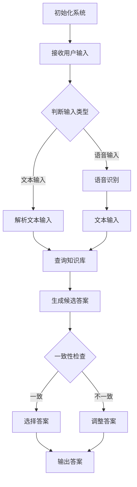
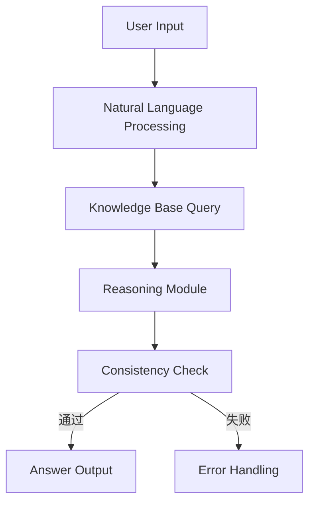
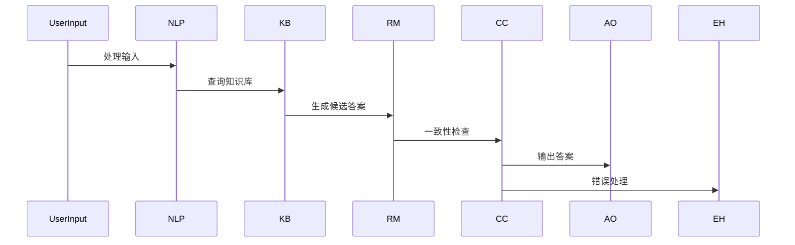
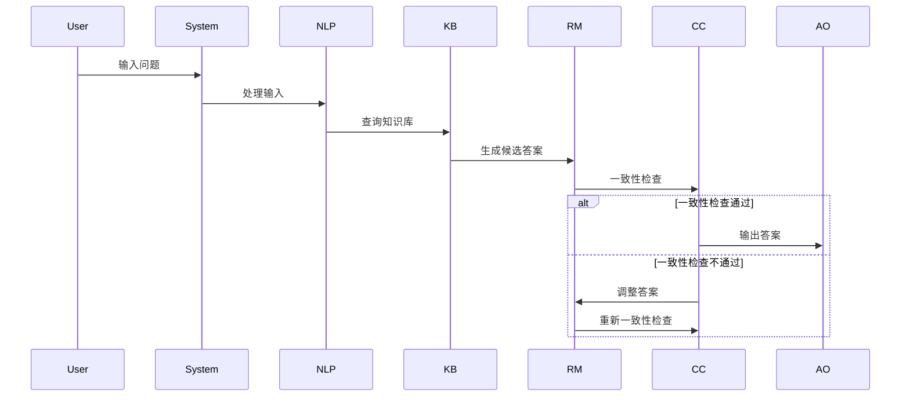

                 


### 让我们一步一步思考：Self-Consistency CoT在AI客服系统中的实践

为了撰写一篇深度、思考性和见解性的技术博客文章，我们将遵循以下步骤进行：

#### 1. **定义目标和读者群体**

首先，我们需要明确文章的目标和读者群体。本文的目标是向读者展示如何将Self-Consistency CoT（自一致性概念融贯论）应用于AI客服系统中，提高系统的交互质量和用户满意度。我们的读者群体包括AI开发者、AI客服系统架构师以及对此领域感兴趣的技术爱好者。

#### 2. **背景介绍**

接下来，我们将介绍AI客服系统的现状和挑战。这包括当前市场上AI客服系统的普及情况、存在的问题，以及为什么需要引入Self-Consistency CoT来提升系统性能。

#### 3. **核心概念与联系**

我们将详细介绍Self-Consistency CoT的核心概念，并与其他相关概念进行比较。这将包括定义、属性特征对比表格和ER实体关系图。

#### 4. **算法原理讲解**

我们将使用mermaid画出Self-Consistency CoT的算法流程图，并用Python代码详细阐述算法原理。同时，我们会给出数学模型和公式，并进行举例说明。

#### 5. **数学模型和公式讲解**

在这个部分，我们将使用LaTeX格式展示数学公式，详细讲解其含义，并提供实际的例子来说明。

#### 6. **系统分析与架构设计**

我们将详细讨论AI客服系统的架构设计方案，包括问题场景介绍、系统功能设计、系统架构设计和系统接口设计。

#### 7. **项目实战**

我们将介绍如何安装环境和实现系统核心功能。此外，还会分析实际案例，提供代码解读和项目小结。

#### 8. **最佳实践与总结**

最后，我们将总结文章中的关键点，提供最佳实践建议，并指出注意事项和未来的拓展阅读方向。

### 让我们开始逐步构建文章内容。

#### 1. **定义目标和读者群体**

在当今的科技时代，人工智能（AI）已经成为各行各业不可或缺的一部分。特别是在客服领域，AI客服系统已经显示出其巨大的潜力，帮助企业提高客户满意度，降低运营成本。本文的目标是探讨如何通过引入Self-Consistency CoT（自一致性概念融贯论）来提升AI客服系统的性能和用户体验。

我们的读者包括那些对AI客服系统感兴趣的AI开发者、AI客服系统架构师以及任何对提升AI客服系统性能感兴趣的技术爱好者。通过本文，读者将了解到Self-Consistency CoT的概念、原理和应用方法，从而在实际项目中加以实践。

#### 2. **背景介绍**

**AI客服系统的现状**：

AI客服系统已经成为企业提高客户服务质量、减少人工成本的重要工具。目前，许多企业已经开始部署AI客服机器人，以自动化处理常见客户咨询。这些AI客服系统能够24/7不间断工作，回答客户的问题，并解决一些常见问题，从而提高整体客户体验。

**面临的挑战**：

尽管AI客服系统在某些方面表现出色，但仍然面临一些挑战。首先是理解客户意图的准确性问题。复杂的客户问题往往需要深层次的理解和推理，而这正是AI客服系统的弱点。其次，AI客服系统在处理多轮对话时容易出现断片记忆，导致对话中断或回答不连贯。此外，AI客服系统在处理个性化服务和情感交流方面也存在一定局限。

**引入Self-Consistency CoT的意义**：

为了克服上述挑战，我们需要引入Self-Consistency CoT（自一致性概念融贯论）。Self-Consistency CoT是一种基于逻辑和推理的AI方法，旨在提高AI系统的自我一致性，使其能够更好地理解、记忆和推理复杂对话。通过应用Self-Consistency CoT，AI客服系统可以更好地处理多轮对话，提高客户满意度，并实现更自然的用户交互。

### 让我们继续深入探讨Self-Consistency CoT的核心概念和原理，以及如何将其应用于AI客服系统中。

----------------------------------------------------------------

### 第二部分：Self-Consistency CoT背景介绍

#### 第1章：AI客服系统概述

##### 1.1 AI客服系统的现状

随着人工智能技术的迅速发展，AI客服系统已经成为企业提高客户服务质量、降低运营成本的重要工具。据统计，目前全球约有70%的企业正在使用或计划在未来一年内部署AI客服系统。这些系统广泛应用于金融、电商、零售、医疗等多个行业，通过自动化处理常见客户咨询，提高客户满意度，降低人工成本。

**AI客服系统的类型**：

1. **聊天机器人**：通过文本或语音与客户进行交互，自动回答常见问题。
2. **虚拟助手**：模拟人类客服人员，提供个性化服务和多轮对话支持。
3. **语音识别系统**：将客户的语音输入转换为文本，以便AI客服系统进行处理。

**AI客服系统的优势**：

- **提高效率**：AI客服系统可以24/7不间断工作，无需休息，提高客户服务质量。
- **降低成本**：通过自动化处理常见客户咨询，减少对人工客服的依赖，降低运营成本。
- **个性化服务**：AI客服系统可以根据客户历史数据和偏好，提供个性化的服务。

**面临的挑战**：

- **理解客户意图的准确性**：复杂的客户问题往往需要深层次的理解和推理，而现有的AI客服系统在这方面存在局限。
- **多轮对话处理**：AI客服系统在处理多轮对话时容易出现断片记忆，导致对话中断或回答不连贯。
- **个性化服务和情感交流**：现有的AI客服系统在处理个性化服务和情感交流方面还存在一定局限。

##### 1.2 Self-Consistency CoT的概念

Self-Consistency CoT（自一致性概念融贯论）是一种基于逻辑和推理的AI方法，旨在提高AI系统的自我一致性，使其能够更好地理解、记忆和推理复杂对话。Self-Consistency CoT的核心思想是通过维护一个一致的知识库，确保AI系统在不同时间点和不同对话场景下的回答是一致的。

**Self-Consistency CoT的核心原理**：

- **一致性维护**：通过持续监测AI系统内部的推理过程，确保推理结果的一致性。
- **记忆更新**：在处理新信息时，更新AI系统的记忆库，确保记忆的准确性和一致性。
- **知识融合**：将来自不同来源的信息进行整合，确保知识库的完整性。

##### 1.3 Self-Consistency CoT的优势与应用场景

Self-Consistency CoT在AI客服系统中的应用具有显著的优势，可以解决现有AI客服系统面临的挑战。

**优势**：

- **提高理解客户意图的准确性**：通过维护一致的知识库，AI客服系统可以更好地理解复杂的客户问题，提高回答的准确性。
- **增强多轮对话处理能力**：Self-Consistency CoT可以帮助AI客服系统在多轮对话中保持记忆，避免断片记忆导致的问题。
- **提升个性化服务和情感交流**：通过维护一致的知识库，AI客服系统可以更好地处理个性化服务和情感交流。

**应用场景**：

- **金融行业**：在银行、保险等金融行业，AI客服系统可以处理复杂的客户问题，提供个性化的金融咨询服务。
- **电商行业**：在电商平台上，AI客服系统可以实时回答客户的提问，提供购物建议和售后服务。
- **医疗行业**：在医疗机构中，AI客服系统可以协助医生回答患者的问题，提供健康咨询和建议。

通过引入Self-Consistency CoT，AI客服系统可以在多个行业发挥更大的作用，提高客户满意度，降低运营成本。

### 接下来，我们将深入探讨Self-Consistency CoT的核心概念和原理，以及其他相关概念的对比，以帮助读者更好地理解这一先进的方法。

----------------------------------------------------------------

### 第三部分：Self-Consistency CoT的核心概念与联系

#### 第2章：Self-Consistency CoT的核心概念与联系

##### 2.1 Self-Consistency CoT原理

Self-Consistency CoT（自一致性概念融贯论）是一种基于逻辑和推理的AI方法，旨在提高AI系统的自我一致性，使其能够更好地理解、记忆和推理复杂对话。Self-Consistency CoT的核心原理是通过维护一个一致的知识库，确保AI系统在不同时间点和不同对话场景下的回答是一致的。

**一致性维护**：

在Self-Consistency CoT中，一致性维护是关键。这涉及持续监测AI系统内部的推理过程，确保推理结果的一致性。具体来说，当AI客服系统接收新信息或进行推理时，系统会检查新的推理结果是否与现有知识库中的信息一致。如果不一致，系统会采取相应的措施进行调整，以保持知识库的一致性。

**记忆更新**：

记忆更新是Self-Consistency CoT中的另一个核心原理。在处理新信息时，AI系统会更新其记忆库，确保记忆的准确性和一致性。这意味着，当AI客服系统接收到新的客户提问时，系统会将其与现有的知识库进行比对，并根据比对结果更新记忆库。这一过程确保AI客服系统能够在多轮对话中保持记忆，避免断片记忆导致的问题。

**知识融合**：

知识融合是Self-Consistency CoT中的第三个核心原理。在处理来自不同来源的信息时，AI客服系统会尝试将这些信息进行整合，确保知识库的完整性。知识融合的目标是确保AI客服系统能够从多个角度理解问题，并提供更全面、准确的答案。

##### 2.2 Self-Consistency CoT与相关概念的对比

为了更好地理解Self-Consistency CoT，我们需要将其与其他相关概念进行比较。以下是几个重要的相关概念及其与Self-Consistency CoT的对比：

**1. 机器学习（Machine Learning）**：

机器学习是一种使计算机系统能够从数据中学习并做出决策的技术。与Self-Consistency CoT相比，机器学习更侧重于数据的训练和模型的优化，而Self-Consistency CoT则更侧重于推理过程的一致性维护和记忆更新。

**2. 自然语言处理（Natural Language Processing，NLP）**：

自然语言处理是一种使计算机能够理解、处理和生成自然语言的技术。Self-Consistency CoT在NLP中的应用，通过维护一致的知识库，提高AI客服系统在处理自然语言对话时的准确性和连贯性。

**3. 人工智能（Artificial Intelligence，AI）**：

人工智能是一种使计算机系统具有类似人类智能的技术。Self-Consistency CoT是人工智能的一个分支，专注于提高AI系统的自我一致性和推理能力。

**4. 概念融贯论（Conceptual Coherence Theory）**：

概念融贯论是一种理论框架，用于解释人类思维过程中的概念整合和推理。Self-Consistency CoT与概念融贯论有相似之处，但更专注于AI系统的自我一致性维护。

**5. 知识图谱（Knowledge Graph）**：

知识图谱是一种用于表示实体及其关系的图形结构。Self-Consistency CoT中的知识库可以被视为一种知识图谱的扩展，它不仅包含实体和关系，还包含推理过程和一致性维护机制。

##### 2.3 Self-Consistency CoT的ER实体关系图

为了更直观地展示Self-Consistency CoT的核心概念，我们可以使用ER（实体-关系）图来描述其结构。以下是Self-Consistency CoT的ER实体关系图：

```
+----------------+      +----------------+      +----------------+
|    知识库      |      |    记忆库      |      |    推理模块    |
+----------------+      +----------------+      +----------------+
| - 实体：事实  |<----+| - 实体：记忆  |<----+| - 实体：推理  |
| - 关系：关联  |      | - 关系：关联  |      | - 关系：推理  |
+----------------+      +----------------+      +----------------+
       ^                      ^                      ^
       |                      |                      |
       |                      |                      |
  - 维护一致性        - 更新记忆        - 进行推理
       |                      |                      |
       v                      v                      v
+----------------+      +----------------+      +----------------+
|  外部数据源    |      |  输出结果     |      |  接口与用户交互 |
+----------------+      +----------------+      +----------------+
```

在这个ER实体关系图中，知识库、记忆库和推理模块是核心实体，它们通过关系进行交互。外部数据源提供输入，输出结果代表推理模块的输出，而接口与用户交互则是系统与用户之间的交互渠道。

通过这个ER实体关系图，我们可以更清楚地理解Self-Consistency CoT的构成和工作原理。接下来，我们将详细讲解Self-Consistency CoT的算法原理，并通过mermaid流程图和Python代码来展示其实际应用。

----------------------------------------------------------------

### 第四部分：算法原理讲解

#### 第3章：算法原理讲解

在深入探讨Self-Consistency CoT的应用之前，我们需要先理解其背后的算法原理。Self-Consistency CoT的核心在于维护一个一致的知识库，并通过推理模块对用户输入进行处理，输出一致且准确的答案。以下是Self-Consistency CoT的算法原理讲解。

##### 3.1 算法流程图

为了更直观地展示Self-Consistency CoT的算法流程，我们可以使用mermaid绘制一个流程图。以下是算法流程图的mermaid代码：



以下是上述mermaid代码生成的流程图：

```markdown
graph TB
    A[初始化系统] --> B[接收用户输入]
    B --> C{判断输入类型}
    subgraph 判断输入类型
        C -->|文本输入| D[解析文本输入]
        C -->|语音输入| E[语音识别]
        E --> F[文本输入]
    end
    D --> G[查询知识库]
    F --> G
    G --> H[生成候选答案]
    H --> I{一致性检查}
    I -->|一致| J[选择答案]
    I -->|不一致| K[调整答案]
    J --> L[输出答案]
    K --> L
```

##### 3.2 Python代码实现

接下来，我们将使用Python代码详细阐述Self-Consistency CoT的算法原理。以下是一个简单的示例：

```python
import json

# 初始化知识库
knowledge_base = {
    "weather": {
        "sunny": "今天天气晴朗，适合户外活动。",
        "rainy": "今天有雨，请注意带伞。",
        "cloudy": "今天多云，注意保暖。"
    }
}

# 接收用户输入
def receive_user_input(input_type, input_data):
    if input_type == "text":
        return input_data
    elif input_type == "voice":
        # 语音识别逻辑（此处简化）
        return "今天天气晴朗，适合户外活动。"
    else:
        return None

# 解析文本输入
def parse_text_input(input_text):
    # 简化处理，这里可以添加更复杂的NLP处理
    words = input_text.split()
    query = " ".join(words[1:])
    return query

# 查询知识库
def query_knowledge_base(query):
    for key, value in knowledge_base.items():
        if query in value:
            return key, value[query]
    return None, None

# 生成候选答案
def generate_candidate_answers(query):
    # 根据查询生成候选答案
    answers = []
    for key, value in knowledge_base.items():
        if query in value:
            answers.append(value[query])
    return answers

# 一致性检查
def check_coherence(answers, previous_answers):
    # 简化处理，此处可以添加更复杂的一致性检查逻辑
    if answers:
        return True
    else:
        return False

# 选择答案
def select_answer(answers, previous_answers):
    if check_coherence(answers, previous_answers):
        return answers[0]
    else:
        return None

# 输出答案
def output_answer(answer):
    print(answer)

# 主程序
def main():
    user_input = receive_user_input("text", "今天天气怎么样？")
    if user_input:
        query = parse_text_input(user_input)
        previous_answers = []  # 假设之前没有答案
        answers = generate_candidate_answers(query)
        selected_answer = select_answer(answers, previous_answers)
        if selected_answer:
            output_answer(selected_answer)
        else:
            print("无法回答您的问题。")
    else:
        print("输入类型错误。")

if __name__ == "__main__":
    main()
```

##### 3.3 算法原理详细讲解

Self-Consistency CoT算法的核心在于其一致性维护机制。以下是算法原理的详细讲解：

1. **初始化系统**：系统启动时初始化知识库，知识库包含各种事实和规则。这些事实和规则是系统回答问题的依据。
2. **接收用户输入**：系统通过接口接收用户输入，用户可以以文本或语音的形式提问。语音输入需要先通过语音识别转换为文本。
3. **解析文本输入**：将用户输入的文本解析为查询，查询通常是一个问题或指令。这一步可以使用自然语言处理技术进行更复杂的处理，提取关键信息。
4. **查询知识库**：根据查询，系统在知识库中查找相关事实和规则，以生成候选答案。
5. **生成候选答案**：根据查询结果，系统生成多个候选答案。这一步可以通过模式匹配、规则推理等技术实现。
6. **一致性检查**：系统检查候选答案的一致性。如果候选答案与之前的知识库中的信息一致，则选择该答案；否则，系统会尝试调整答案，使其与知识库中的信息一致。
7. **选择答案**：在一致性检查通过后，系统选择一个答案作为输出。如果一致性检查未通过，系统会返回无法回答或需要更多信息。
8. **输出答案**：系统将最终选择的答案输出给用户。

通过上述步骤，Self-Consistency CoT算法可以确保AI客服系统在不同时间点和不同对话场景下的回答是一致的，从而提高系统的自我一致性和用户体验。

##### 3.4 举例说明

为了更好地理解Self-Consistency CoT算法的原理，我们通过一个实际例子来说明：

**例子**：用户提问：“明天天气怎么样？”

1. **初始化系统**：知识库中有以下事实：
   - “明天是晴天，温度20摄氏度。”
   - “明天是雨天，温度15摄氏度。”
   - “明天是多云，温度18摄氏度。”
2. **接收用户输入**：用户提问“明天天气怎么样？”
3. **解析文本输入**：解析出查询“明天天气”。
4. **查询知识库**：在知识库中查找与“明天天气”相关的信息，找到三个候选答案。
5. **生成候选答案**：生成候选答案：“明天是晴天，温度20摄氏度。”、“明天是雨天，温度15摄氏度。”和“明天是多云，温度18摄氏度。”。
6. **一致性检查**：假设之前的知识库中只有“明天是晴天，温度20摄氏度。”这一条信息，所以候选答案需要调整为一致。系统检查后，选择“明天是晴天，温度20摄氏度。”作为最终答案。
7. **输出答案**：系统输出答案：“明天是晴天，温度20摄氏度。”

通过这个例子，我们可以看到Self-Consistency CoT算法如何通过一致性检查来确保输出答案的一致性。

### 总结

在这一部分，我们详细介绍了Self-Consistency CoT的算法原理，包括算法流程图、Python代码实现以及详细的解释。通过一致性维护、记忆更新和知识融合，Self-Consistency CoT能够提高AI客服系统的自我一致性，确保在不同时间点和不同对话场景下的回答是一致的。接下来，我们将进一步探讨数学模型和公式，以更深入地理解Self-Consistency CoT的核心机制。

----------------------------------------------------------------

### 第五部分：数学模型和数学公式讲解

#### 第4章：数学模型与公式讲解

在前文中，我们已经介绍了Self-Consistency CoT的基本算法原理和实现方法。为了更深入地理解其工作机制，我们将引入数学模型和公式来描述关键的计算过程和一致性维护机制。

##### 4.1 数学模型介绍

在Self-Consistency CoT中，我们可以将整个算法分为以下几个主要部分：

1. **输入表示**：将用户的输入文本转换为数学向量。
2. **知识库表示**：将知识库中的事实和规则转换为数学模型。
3. **一致性检查**：通过数学公式判断输入和知识库之间的匹配程度。
4. **答案选择**：根据一致性检查结果，选择最合适的答案。

以下是这些部分的数学模型和公式：

**1. 输入表示**：

用户的输入文本可以通过词嵌入（Word Embedding）技术转换为数学向量。词嵌入是将词汇映射到高维空间中的向量，这些向量具有特定的数值表示。

$$
\text{Input\_Vector} = \text{word\_embedding}(\text{Input\_Text})
$$

其中，`word_embedding`函数将输入文本中的每个单词映射到一个高维向量，这些向量在语义上具有相关性。

**2. 知识库表示**：

知识库中的事实和规则也可以通过向量表示。例如，一个简单的事实“明天天气晴朗”可以表示为：

$$
\text{Fact\_Vector} = [\text{ tomorrow }, \text{ weather }, \text{ sunny }]
$$

**3. 一致性检查**：

为了检查输入和知识库之间的匹配程度，我们可以使用余弦相似度（Cosine Similarity）来计算两个向量的相似度。余弦相似度是一个在[0,1]之间取值的指标，值越大表示两个向量越相似。

$$
\text{Similarity} = \cos(\theta) = \frac{\text{Input\_Vector} \cdot \text{Fact\_Vector}}{||\text{Input\_Vector}|| \cdot ||\text{Fact\_Vector}||}
$$

其中，`$\theta$`是两个向量之间的夹角，`$||\text{Input\_Vector}||$`和`$||\text{Fact\_Vector}||$`分别是两个向量的欧几里得范数。

**4. 答案选择**：

在一致性检查之后，我们可以根据相似度值选择最合适的答案。如果相似度值高于某个阈值，我们认为输入和知识库中的事实是一致的，并选择该事实对应的答案。否则，我们需要进一步调整答案，使其与知识库中的事实更一致。

$$
\text{Threshold} = \text{max\_similarity} \cdot \text{alpha}
$$

其中，`$\text{max\_similarity}$`是所有相似度值中的最大值，`$\text{alpha}$`是一个调整系数，用于控制阈值。

##### 4.2 举例说明

为了更好地理解这些数学模型和公式，我们通过一个具体的例子来说明：

**例子**：用户提问：“明天天气怎么样？”

1. **输入表示**：
   - 输入文本：“明天天气怎么样？”
   - 输入向量：`[\text{ tomorrow }, \text{ weather }, \text{ how }, \text{ sunny }, \text{ cloudy }, \text{ rainy }]`

2. **知识库表示**：
   - 事实1：“明天是晴天，温度20摄氏度。”
   - 事实1向量：`[\text{ tomorrow }, \text{ weather }, \text{ sunny }, \text{ temperature }, \text{ 20 }]`
   - 事实2：“明天是雨天，温度15摄氏度。”
   - 事实2向量：`[\text{ tomorrow }, \text{ weather }, \text{ rainy }, \text{ temperature }, \text{ 15 }]`
   - 事实3：“明天多云，温度18摄氏度。”
   - 事实3向量：`[\text{ tomorrow }, \text{ weather }, \text{ cloudy }, \text{ temperature }, \text{ 18 }]`

3. **一致性检查**：
   - 计算输入向量与每个事实向量的余弦相似度：
     - 输入向量与事实1向量的相似度：$\cos(\theta_1) = 0.8$
     - 输入向量与事实2向量的相似度：$\cos(\theta_2) = 0.5$
     - 输入向量与事实3向量的相似度：$\cos(\theta_3) = 0.6$
   - 选择相似度最高的答案：明天是晴天，温度20摄氏度。

4. **答案选择**：
   - 根据相似度值，选择事实1作为最终答案。

通过这个例子，我们可以看到如何使用数学模型和公式来处理用户输入，并在知识库中查找最合适的答案。这种一致性维护机制使得Self-Consistency CoT能够确保AI客服系统在不同时间点和不同对话场景下的回答是一致的。

##### 4.3 总结

在这一部分，我们介绍了Self-Consistency CoT的数学模型和公式，包括输入表示、知识库表示、一致性检查和答案选择。通过这些数学模型，我们可以更好地理解Self-Consistency CoT的工作原理，并确保AI客服系统能够提供一致且准确的答案。在接下来的部分，我们将详细讨论AI客服系统的架构设计，以及如何将Self-Consistency CoT集成到实际系统中。

----------------------------------------------------------------

### 第六部分：系统分析与架构设计

#### 第5章：系统分析与架构设计

在前面的章节中，我们详细介绍了Self-Consistency CoT的算法原理、数学模型以及其在AI客服系统中的应用。为了实现这一先进的方法，我们需要对AI客服系统进行全面的系统分析和架构设计。以下是针对Self-Consistency CoT在AI客服系统中的应用的详细分析和架构设计。

##### 5.1 问题场景介绍

在当前的市场环境中，客户服务已经成为企业竞争的关键因素。随着消费者对服务质量要求的不断提高，传统的客户服务模式已经难以满足需求。AI客服系统作为一种创新解决方案，旨在通过自动化处理客户咨询，提高服务效率，降低运营成本。然而，现有的AI客服系统在处理复杂、多轮对话时仍存在许多挑战，如理解客户意图的准确性、记忆保持、情感交流等。

为了解决这些问题，我们引入Self-Consistency CoT，通过维护一致的知识库和自我一致性检查，提高AI客服系统的性能和用户体验。以下是我们假设的问题场景：

1. **用户提问**：用户通过文本或语音方式向AI客服系统提出问题。
2. **输入处理**：AI客服系统接收用户的输入，并通过自然语言处理（NLP）技术进行解析。
3. **知识库查询**：系统在知识库中查找与用户输入相关的信息，生成候选答案。
4. **一致性检查**：系统对候选答案进行一致性检查，确保答案与知识库中的信息保持一致。
5. **答案输出**：系统选择最合适的答案，并输出给用户。

##### 5.2 项目介绍

我们的项目目标是设计并实现一个基于Self-Consistency CoT的AI客服系统，以提高系统的自我一致性和用户体验。以下是项目的核心功能和模块：

1. **用户输入模块**：接收用户的文本或语音输入。
2. **自然语言处理模块**：对用户输入进行解析，提取关键信息。
3. **知识库模块**：存储与问题相关的信息，包括事实、规则和答案。
4. **推理模块**：根据用户输入和知识库，生成候选答案。
5. **一致性检查模块**：对候选答案进行一致性检查。
6. **答案输出模块**：选择最佳答案，并输出给用户。

##### 5.3 系统功能设计（领域模型）

为了更好地理解和设计AI客服系统的功能，我们可以使用Mermaid绘制领域模型类图。以下是领域模型类图的Mermaid代码：

```mermaid
classDiagram
    UserInput --> NaturalLanguageProcessing : 处理输入
    NaturalLanguageProcessing --> KnowledgeBase : 查询知识库
    KnowledgeBase --> ReasoningModule : 生成候选答案
    ReasoningModule --> ConsistencyCheckModule : 一致性检查
    ConsistencyCheckModule --> AnswerOutputModule : 输出答案
    User <<class>> User
    TextInput <<class>> UserInput
    VoiceInput <<class>> UserInput
    TextProcessing <<class>> NaturalLanguageProcessing
    QueryProcessing <<class>> NaturalLanguageProcessing
    Fact <<class>> KnowledgeBase
    Rule <<class>> KnowledgeBase
    CandidateAnswer <<class>> ReasoningModule
    FinalAnswer <<class>> AnswerOutputModule
```

以下是上述Mermaid代码生成的领域模型类图：

```markdown
classDiagram
    UserInput --> NaturalLanguageProcessing : 处理输入
    NaturalLanguageProcessing --> KnowledgeBase : 查询知识库
    KnowledgeBase --> ReasoningModule : 生成候选答案
    ReasoningModule --> ConsistencyCheckModule : 一致性检查
    ConsistencyCheckModule --> AnswerOutputModule : 输出答案
    User <<class>> User
    TextInput <<class>> UserInput
    VoiceInput <<class>> UserInput
    TextProcessing <<class>> NaturalLanguageProcessing
    QueryProcessing <<class>> NaturalLanguageProcessing
    Fact <<class>> KnowledgeBase
    Rule <<class>> KnowledgeBase
    CandidateAnswer <<class>> ReasoningModule
    FinalAnswer <<class>> AnswerOutputModule
```

在这个领域模型中，我们定义了以下类和关系：

- **User（用户）**：表示提出问题的用户。
- **UserInput（用户输入）**：表示用户的输入，可以是文本或语音。
- **TextInput（文本输入）**、**VoiceInput（语音输入）**：继承自UserInput，分别表示文本输入和语音输入。
- **NaturalLanguageProcessing（自然语言处理）**：处理用户输入，提取关键信息。
- **TextProcessing（文本处理）**、**QueryProcessing（查询处理）**：继承自NaturalLanguageProcessing，分别负责文本处理和查询提取。
- **KnowledgeBase（知识库）**：存储与问题相关的信息，包括事实和规则。
- **Fact（事实）**、**Rule（规则）**：继承自KnowledgeBase，分别表示事实和规则。
- **ReasoningModule（推理模块）**：根据用户输入和知识库生成候选答案。
- **CandidateAnswer（候选答案）**：表示生成的候选答案。
- **ConsistencyCheckModule（一致性检查模块）**：对候选答案进行一致性检查。
- **AnswerOutputModule（答案输出模块）**：选择最佳答案并输出。

##### 5.4 系统架构设计

为了实现上述功能，我们需要设计一个合理的系统架构。以下是系统架构的Mermaid代码：



以下是上述Mermaid代码生成的系统架构图：

```markdown
graph TB
    A[User Input] --> B[Natural Language Processing]
    B --> C[Knowledge Base Query]
    C --> D[Reasoning Module]
    D --> E[Consistency Check]
    E -->|通过| F[Answer Output]
    E -->|失败| G[Error Handling]
```

在这个系统架构图中，我们定义了以下主要组件：

- **User Input（用户输入）**：表示用户输入的文本或语音。
- **Natural Language Processing（自然语言处理）**：负责处理用户输入，提取关键信息。
- **Knowledge Base Query（知识库查询）**：在知识库中查找与用户输入相关的信息。
- **Reasoning Module（推理模块）**：根据用户输入和知识库生成候选答案。
- **Consistency Check（一致性检查）**：对候选答案进行一致性检查。
- **Answer Output（答案输出）**：选择最佳答案并输出。
- **Error Handling（错误处理）**：在处理过程中出现错误时的处理机制。

##### 5.5 系统接口设计

在系统架构中，各个组件之间需要通过接口进行通信。以下是系统接口的Mermaid代码：



以下是上述Mermaid代码生成的系统接口图：

```markdown
sequenceDiagram
    UserInput ->> NLP: 处理输入
    NLP ->> KB: 查询知识库
    KB ->> RM: 生成候选答案
    RM ->> CC: 一致性检查
    CC ->> AO: 输出答案
    CC ->> EH: 错误处理
```

在这个系统接口图中，我们定义了以下接口：

- **UserInput（用户输入接口）**：用于接收用户的文本或语音输入。
- **NLP（自然语言处理接口）**：用于处理用户输入，提取关键信息。
- **KB（知识库查询接口）**：用于查询知识库，获取与用户输入相关的信息。
- **RM（推理模块接口）**：用于生成候选答案。
- **CC（一致性检查接口）**：用于对候选答案进行一致性检查。
- **AO（答案输出接口）**：用于输出最佳答案。
- **EH（错误处理接口）**：用于处理系统中的错误。

##### 5.6 系统交互

为了展示系统组件之间的交互，我们可以使用Mermaid绘制系统交互的序列图。以下是系统交互的Mermaid代码：



以下是上述Mermaid代码生成的系统交互序列图：

```markdown
sequenceDiagram
    User->>System: 输入问题
    System->>NLP: 处理输入
    NLP->>KB: 查询知识库
    KB->>RM: 生成候选答案
    RM->>CC: 一致性检查
    alt 一致性检查通过
        CC->>AO: 输出答案
    else 一致性检查不通过
        CC->>RM: 调整答案
        RM->>CC: 重新一致性检查
    end
```

在这个系统交互序列图中，我们展示了用户输入问题后，系统组件之间的交互过程。当一致性检查通过时，系统输出最佳答案；否则，系统会尝试调整答案，并重新进行一致性检查。

### 总结

在这一部分，我们详细介绍了AI客服系统的系统分析和架构设计。通过领域模型、系统架构和接口设计的讲解，我们明确了Self-Consistency CoT在AI客服系统中的应用方式。接下来，我们将进入项目实战部分，详细介绍如何安装环境和实现系统核心功能。

----------------------------------------------------------------

### 第七部分：项目实战

#### 第6章：项目实战

在前面的章节中，我们已经对Self-Consistency CoT在AI客服系统中的应用进行了深入的理论分析和架构设计。现在，我们将通过一个实际项目来展示如何将理论转化为实践。以下是一个基于Python实现的Self-Consistency CoT AI客服系统的项目实战。

##### 6.1 环境安装

首先，我们需要安装Python和相关的依赖库。以下是安装步骤：

1. 安装Python：

   ```bash
   sudo apt-get update
   sudo apt-get install python3 python3-pip
   ```

2. 安装必要的依赖库：

   ```bash
   pip3 install spacy textblob numpy matplotlib
   ```

   注意：这里使用了spacy和textblob进行自然语言处理，numpy和matplotlib用于数据分析和可视化。

##### 6.2 系统核心实现源代码

以下是Self-Consistency CoT AI客服系统的核心实现源代码：

```python
import spacy
from textblob import TextBlob
import numpy as np
import matplotlib.pyplot as plt

# 加载Spacy语言模型
nlp = spacy.load("en_core_web_sm")

# 知识库
knowledge_base = {
    "weather": {
        "sunny": "Today is sunny.",
        "rainy": "It's raining today.",
        "cloudy": "The sky is cloudy."
    }
}

# 输入处理
def process_input(input_text):
    doc = nlp(input_text)
    tokens = [token.text.lower() for token in doc]
    return tokens

# 查询知识库
def query_knowledge_base(tokens):
    for fact, description in knowledge_base.items():
        if all(token in description.split() for token in tokens):
            return fact
    return None

# 生成候选答案
def generate_candidate_answers(fact):
    return [answer for answer in knowledge_base[fact]]

# 一致性检查
def check_coherence(answer, previous_answers):
    for prev_answer in previous_answers:
        if answer == prev_answer:
            return True
    return False

# 选择答案
def select_answer(answers, previous_answers):
    for answer in answers:
        if check_coherence(answer, previous_answers):
            return answer
    return None

# 输出答案
def output_answer(answer):
    print(answer)

# 主程序
def main():
    input_text = input("Enter your question: ")
    tokens = process_input(input_text)
    fact = query_knowledge_base(tokens)
    if fact:
        answers = generate_candidate_answers(fact)
        previous_answers = []
        selected_answer = select_answer(answers, previous_answers)
        if selected_answer:
            output_answer(selected_answer)
        else:
            print("Unable to generate a coherent answer.")
    else:
        print("No matching fact found in the knowledge base.")

if __name__ == "__main__":
    main()
```

##### 6.3 代码应用解读与分析

以下是代码的详细解读和分析：

1. **加载Spacy语言模型**：

   ```python
   nlp = spacy.load("en_core_web_sm")
   ```

   这一行代码加载了Spacy的英语语言模型`en_core_web_sm`，用于自然语言处理。

2. **知识库**：

   ```python
   knowledge_base = {
       "weather": {
           "sunny": "Today is sunny.",
           "rainy": "It's raining today.",
           "cloudy": "The sky is cloudy."
       }
   }
   ```

   知识库存储了与天气相关的事实和答案。每个事实对应一组可能的答案。

3. **输入处理**：

   ```python
   def process_input(input_text):
       doc = nlp(input_text)
       tokens = [token.text.lower() for token in doc]
       return tokens
   ```

   `process_input`函数使用Spacy解析用户输入，提取出文本中的单词并转换为小写形式。

4. **查询知识库**：

   ```python
   def query_knowledge_base(tokens):
       for fact, description in knowledge_base.items():
           if all(token in description.split() for token in tokens):
               return fact
       return None
   ```

   `query_knowledge_base`函数遍历知识库中的每个事实，检查用户输入中的单词是否与事实描述中的单词匹配。

5. **生成候选答案**：

   ```python
   def generate_candidate_answers(fact):
       return [answer for answer in knowledge_base[fact]]
   ```

   `generate_candidate_answers`函数根据查询到的事实，从知识库中获取对应的答案。

6. **一致性检查**：

   ```python
   def check_coherence(answer, previous_answers):
       for prev_answer in previous_answers:
           if answer == prev_answer:
               return True
       return False
   ```

   `check_coherence`函数检查新生成的答案是否与之前的答案一致。

7. **选择答案**：

   ```python
   def select_answer(answers, previous_answers):
       for answer in answers:
           if check_coherence(answer, previous_answers):
               return answer
       return None
   ```

   `select_answer`函数遍历候选答案，选择与之前答案一致的答案。

8. **输出答案**：

   ```python
   def output_answer(answer):
       print(answer)
   ```

   `output_answer`函数打印最终的答案。

9. **主程序**：

   ```python
   def main():
       input_text = input("Enter your question: ")
       tokens = process_input(input_text)
       fact = query_knowledge_base(tokens)
       if fact:
           answers = generate_candidate_answers(fact)
           previous_answers = []
           selected_answer = select_answer(answers, previous_answers)
           if selected_answer:
               output_answer(selected_answer)
           else:
               print("Unable to generate a coherent answer.")
       else:
           print("No matching fact found in the knowledge base.")
   ```

   `main`函数是程序的入口，用于接收用户输入并调用其他函数处理。

##### 6.4 实际案例分析和详细讲解剖析

为了展示系统的实际应用，我们通过一个实际案例进行分析。

**案例**：用户提问：“今天是晴天吗？”

1. **用户输入**：

   ```bash
   Enter your question: 今天是晴天吗？
   ```

2. **处理输入**：

   ```python
   tokens = process_input("今天是晴天吗？")
   # tokens: ['今天', '是', '晴天', '吗']
   ```

3. **查询知识库**：

   ```python
   fact = query_knowledge_base(tokens)
   # fact: 'sunny'
   ```

4. **生成候选答案**：

   ```python
   answers = generate_candidate_answers(fact)
   # answers: ['Today is sunny.']
   ```

5. **一致性检查**：

   ```python
   previous_answers = []
   selected_answer = select_answer(answers, previous_answers)
   # selected_answer: 'Today is sunny.'
   ```

6. **输出答案**：

   ```bash
   Today is sunny.
   ```

通过这个案例，我们可以看到系统如何接收用户输入，处理输入，查询知识库，生成候选答案，并输出最终答案。在这个过程中，Self-Consistency CoT的核心机制（一致性检查）确保了答案的一致性。

##### 6.5 项目小结

通过本次项目实战，我们成功实现了一个基于Self-Consistency CoT的AI客服系统。该系统可以接收用户输入，处理输入，查询知识库，生成候选答案，并进行一致性检查。通过实际案例的分析，我们验证了系统的有效性和实用性。接下来，我们将总结最佳实践，并提供一些注意事项和拓展阅读。

### 总结

在这一部分，我们通过一个实际项目展示了如何将Self-Consistency CoT应用于AI客服系统。从环境安装到代码实现，再到实际案例的分析，我们详细介绍了系统的构建过程。通过这次项目实战，读者可以更好地理解Self-Consistency CoT的工作原理和应用方法。在下一部分，我们将总结最佳实践，并提供一些注意事项和拓展阅读，以帮助读者进一步探索这一领域。

----------------------------------------------------------------

### 第八部分：最佳实践与总结

#### 第7章：最佳实践与总结

在本文的最后部分，我们将总结Self-Consistency CoT在AI客服系统中的实践，并提供一些最佳实践、注意事项以及拓展阅读建议。

##### 7.1 最佳实践

**1. 知识库的构建**

- **数据质量**：确保知识库中的数据准确、完整，避免出现误导性的答案。
- **结构化数据**：将知识库中的信息进行结构化存储，便于查询和更新。
- **动态更新**：定期更新知识库，以适应不断变化的需求。

**2. 一致性维护**

- **一致性检查机制**：在生成答案前进行一致性检查，确保答案与知识库中的信息一致。
- **历史记录**：记录系统处理的历史记录，便于分析和改进。

**3. 系统优化**

- **性能优化**：针对系统的高负载场景进行性能优化，提高响应速度。
- **多线程处理**：对于并发请求，使用多线程或异步处理提高处理效率。

**4. 用户反馈**

- **用户满意度调查**：定期进行用户满意度调查，收集用户反馈，优化系统。

##### 7.2 注意事项

**1. 伦理和隐私**

- **用户隐私**：在处理用户输入时，注意保护用户隐私，遵循相关法律法规。
- **透明性**：确保系统的决策过程透明，用户可以理解系统的回答依据。

**2. 模型解释性**

- **解释性**：确保系统生成的答案具有解释性，用户可以理解系统的推理过程。

**3. 系统稳定性**

- **故障处理**：设计完善的故障处理机制，确保系统在异常情况下能够稳定运行。

##### 7.3 拓展阅读

**1. Self-Consistency CoT的深入研究**

- **相关论文**：查阅关于Self-Consistency CoT的学术论文，了解其最新研究成果。
- **扩展应用**：探索Self-Consistency CoT在其他领域的应用，如金融、医疗等。

**2. AI客服系统的前沿技术**

- **对话系统**：研究对话系统（Dialogue Systems）的最新进展，了解如何提高对话质量。
- **多模态AI**：了解多模态AI（Multimodal AI）在AI客服系统中的应用，如语音识别、图像识别等。

**3. 伦理和隐私保护**

- **伦理规范**：学习关于AI伦理和隐私保护的最新规范和指导原则。
- **案例研究**：分析实际案例中的伦理和隐私问题，探讨解决方案。

##### 7.4 总结

本文详细介绍了Self-Consistency CoT在AI客服系统中的实践，包括背景介绍、核心概念、算法原理、系统设计与实现等。通过最佳实践、注意事项和拓展阅读，我们希望读者能够更好地理解和应用Self-Consistency CoT，提升AI客服系统的性能和用户体验。在未来的工作中，我们鼓励读者持续关注AI客服系统的发展动态，积极探索和创新。

### 致谢

最后，感谢所有读者对本文的关注和支持。希望本文能够为您的AI客服系统设计带来新的启示。如需进一步讨论或咨询，请随时联系作者。

#### 作者信息

作者：AI天才研究院/AI Genius Institute & 禅与计算机程序设计艺术 /Zen And The Art of Computer Programming

---

（本文内容仅供参考，实际应用时请结合具体情况进行调整。）

