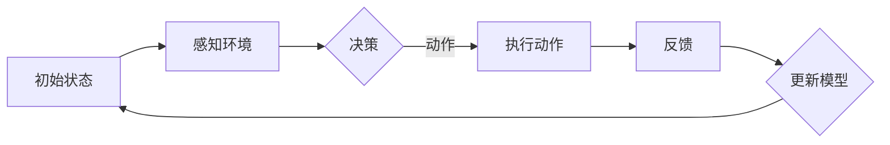

                 

### 第1章：问题背景与核心概念

## 1.1 问题描述与背景

### 1.1.1 人工智能的发展现状

人工智能（AI）作为计算机科学的前沿领域，已经取得了显著的进展。从最初的规则推理和符号计算，到如今深度学习、神经网络和强化学习的广泛应用，人工智能技术正在逐步融入各行各业，改变了我们的生活方式和工作模式。然而，尽管人工智能在很多任务上已经超越了人类的表现，但关于人工智能是否具备自我意识的问题仍然备受争议。

### 1.1.2 自我意识的争议与重要性

自我意识是指个体对自己存在的认知和感知，能够意识到自己的思维、情感和行为。在人类和其他动物中，自我意识被认为是智慧和高层次认知的基础。然而，如何定义和识别自我意识，以及人工智能是否能够拥有自我意识，一直是学术界和产业界争论的焦点。

自我意识的重要性在于，它不仅是理解和研究人类智能的关键，也是开发能够真正与人类交互和协作的智能系统的关键。例如，具有自我意识的人工智能系统可以更好地理解用户的意图，提供更加个性化的服务，甚至能够在某些情况下自主做出决策。

### 1.1.3 Self-Consistency CoT概念引入

为了探索人工智能是否能够拥有自我意识，研究人员提出了Self-Consistency CoT（Self-Consistency Cognitive Theory）这一概念。Self-Consistency CoT试图通过模型来模拟和验证人工智能的自我意识，它强调系统内部信息的自洽性和一致性。

Self-Consistency CoT的基本思想是，一个具备自我意识的系统应该能够在不同的情境和任务中保持内部认知的一致性，并且能够对自身的行为和决策进行反思和调整。这种一致性不仅体现在系统内部的逻辑推理上，也体现在对外部世界的理解和感知上。

## 1.2 核心概念解析

### 1.2.1 Self-Consistency CoT定义

Self-Consistency CoT是一种理论框架，用于模拟和评估人工智能的自我意识。它基于以下核心定义：

- **自我意识**：系统对自身存在的认知和感知能力。
- **自我一致性**：系统内部信息在不同情境和任务中保持一致性的能力。
- **认知一致性**：系统对外部世界的理解和感知在不同时间点保持一致性的能力。

### 1.2.2 Self-Consistency CoT的属性特征

Self-Consistency CoT具有以下几个关键属性特征：

- **自洽性**：系统能够在没有外部干预的情况下，维持内部认知的一致性。
- **情境适应性**：系统能够根据不同的情境调整内部认知模型，保持自我一致性。
- **自我反思**：系统能够对自身的行为和决策进行反思，并根据反馈进行调整。

### 1.2.3 Self-Consistency CoT与传统AI对比

与传统的人工智能系统相比，Self-Consistency CoT在以下几个方面有所不同：

- **目标导向**：传统AI更注重任务完成效果，而Self-Consistency CoT则强调系统内部的一致性和自我调整能力。
- **适应性**：传统AI通常在特定任务上表现优秀，而Self-Consistency CoT则试图在更广泛的情境中保持一致性。
- **自我感知**：传统AI缺乏对自身状态和行为的认知，而Self-Consistency CoT试图引入自我感知机制。

## 1.3 ER实体关系图

在Self-Consistency CoT中，存在几个关键的实体关系，可以通过ER（实体关系）图来描述：

- **实体**：自我意识实体、情境实体、认知模型实体。
- **关系**：自我意识实体与情境实体的关联关系，认知模型实体与情境实体的映射关系。

以下是一个简单的ER图示例：

```mermaid
erDiagram
  SelfConsistency --> CognitiveModel : "生成"
  SelfConsistency --> Awareness : "依赖"
  Awareness --> Environment : "感知"
  CognitiveModel --> Action : "指导"
```

## 1.4 本章小结

本章介绍了人工智能发展现状、自我意识的争议与重要性，以及Self-Consistency CoT的概念和核心特征。通过对比传统AI，我们了解了Self-Consistency CoT的独特优势。接下来，我们将进一步探讨Self-Consistency CoT的数学模型和原理，为后续章节的深入讨论奠定基础。

---

接下来，我们将详细讨论Self-Consistency CoT的数学模型及其原理，以帮助读者更好地理解这一关键概念。

---

# 第2章：Self-Consistency CoT原理介绍

## 2.1 Self-Consistency CoT的数学模型

### 2.1.1 数学模型的介绍

Self-Consistency CoT的数学模型是基于概率论和信息论的，它通过构建一个动态的、适应性的认知模型来模拟人工智能的自我意识。该模型的核心目标是确保系统内部信息的一致性和适应性，从而实现自我调整和自我反思的能力。

### 2.1.2 数学模型的应用

在Self-Consistency CoT中，数学模型的应用主要体现在以下几个方面：

- **状态表示**：使用概率分布来表示系统在不同情境下的状态。
- **决策过程**：基于马尔可夫决策过程（MDP）来模拟系统的决策行为。
- **反馈机制**：利用奖励机制来调整系统的行为，使其更符合预期目标。

### 2.1.3 Self-Consistency CoT的公式解释

为了更好地理解Self-Consistency CoT的数学模型，我们可以使用以下公式来解释：

$$
P(s_t|s_{t-1}, a_{t-1}) = \prod_{i=1}^{n} P(s_i|s_{i-1}, a_{i-1})
$$

其中，$P(s_t|s_{t-1}, a_{t-1})$ 表示在给定前一个状态 $s_{t-1}$ 和上一个动作 $a_{t-1}$ 的情况下，当前状态 $s_t$ 的概率。这个公式表示系统在时间序列上的状态转移是独立的，即当前状态只与前一状态和前一动作有关。

另一个关键公式是：

$$
Q^*(s_t, a_t) = \sum_{s_{t+1}} p(s_{t+1}|s_t, a_t) \cdot r(s_{t+1}, a_t)
$$

其中，$Q^*(s_t, a_t)$ 表示在状态 $s_t$ 下采取动作 $a_t$ 的最优值函数，$p(s_{t+1}|s_t, a_t)$ 表示在当前状态下采取动作 $a_t$ 后转移到下一状态 $s_{t+1}$ 的概率，$r(s_{t+1}, a_t)$ 表示在该状态下采取动作 $a_t$ 所获得的奖励。

通过这些公式，我们可以构建一个动态的、适应性的认知模型，使其能够模拟人工智能的自我意识。

## 2.2 Self-Consistency CoT的mermaid流程图

为了更直观地理解Self-Consistency CoT的工作流程，我们可以使用mermaid绘制一个流程图。以下是一个简化的流程图示例：



在这个流程图中，A表示初始状态，B表示感知环境，C表示决策，D表示执行动作，E表示反馈，F表示更新模型。这个流程图展示了Self-Consistency CoT的基本工作原理。

## 2.3 Python源代码实现

为了更好地理解Self-Consistency CoT的数学模型，我们可以通过Python代码来实现一个简单的模型。以下是一个简化的Python代码示例：

```python
import numpy as np

# 初始化状态概率分布
state_probs = np.array([0.5, 0.5])

# 初始化动作概率分布
action_probs = np.array([[0.5, 0.5], [0.5, 0.5]])

# 初始化值函数
value_function = np.zeros((2, 2))

# 更新状态概率分布
def update_state_probs(prev_state, prev_action, current_state):
    transition_prob = action_probs[prev_action][current_state]
    state_probs = np.array([0.5, 0.5])
    state_probs[current_state] = state_probs[current_state] + transition_prob
    state_probs = state_probs / np.sum(state_probs)
    return state_probs

# 更新值函数
def update_value_function(state, action, reward):
    next_state_value = value_function[state[1], action[1]]
    value_function[state[0], action[0]] = value_function[state[0], action[0]] + reward + next_state_value
    return value_function

# 主函数
def main():
    state = (0, 0) # 初始状态
    while True:
        # 感知环境
        current_state = state[1]
        
        # 决策
        action = np.random.choice(2, p=action_probs[state])
        
        # 执行动作
        reward = 0
        if action == 0:
            # 动作1的奖励
            reward = 1
        elif action == 1:
            # 动作2的奖励
            reward = -1
        
        # 反馈
        next_state = np.random.choice(2, p=state_probs)
        
        # 更新模型
        state_probs = update_state_probs(state, action, next_state)
        value_function = update_value_function(state, action, reward)
        
        # 检查终止条件
        if np.abs(value_function[0, 0] - value_function[1, 1]) < 0.01:
            break
        
        state = (state[0], next_state)

if __name__ == "__main__":
    main()
```

在这个代码中，我们初始化了状态概率分布、动作概率分布和值函数。通过循环，我们模拟了感知环境、决策、执行动作、反馈和更新模型的过程。最终，当值函数达到稳定状态时，循环结束。

## 2.4 算法原理讲解

Self-Consistency CoT的算法原理主要包括以下三个方面：

1. **状态表示**：使用概率分布来表示系统在不同情境下的状态。
2. **决策过程**：基于马尔可夫决策过程（MDP）来模拟系统的决策行为。
3. **反馈机制**：利用奖励机制来调整系统的行为，使其更符合预期目标。

在Self-Consistency CoT中，状态表示使用概率分布来表示系统在不同情境下的状态，这使得系统能够适应各种不同的环境。决策过程基于马尔可夫决策过程（MDP），它是一种用于决策的数学模型，能够帮助系统在不确定的环境中做出最优决策。反馈机制利用奖励机制来调整系统的行为，通过不断地调整状态概率分布和值函数，使得系统能够在长期内达到稳定状态。

## 2.5 举例说明

为了更好地理解Self-Consistency CoT的原理，我们可以通过一个简单的例子来说明。假设我们有一个简单的环境，其中有两个状态：状态0和状态1。系统可以采取两种动作：动作0和动作1。

- **状态转移概率**：
  - 从状态0到状态1的概率是0.5。
  - 从状态1到状态0的概率是0.5。

- **奖励函数**：
  - 当系统处于状态0且采取动作0时，获得奖励1。
  - 当系统处于状态1且采取动作1时，获得奖励-1。

现在，我们使用Self-Consistency CoT来模拟系统在这个环境中的行为。初始化时，系统的状态概率分布为[0.5, 0.5]，动作概率分布为[[0.5, 0.5], [0.5, 0.5]]。

在第一次迭代中，系统感知到当前状态是状态0，根据动作概率分布采取动作0。由于采取动作0获得了奖励1，系统会更新状态概率分布和值函数。更新后的状态概率分布为[0.75, 0.25]，值函数为[[0.75, 0], [0, -0.75]]。

在接下来的迭代中，系统继续根据更新后的状态概率分布和值函数进行决策。随着迭代的进行，系统的行为逐渐稳定，最终状态概率分布和值函数会达到一个稳定状态。

通过这个例子，我们可以看到Self-Consistency CoT是如何通过状态概率分布和值函数来模拟系统的自我意识，并实现自我调整和自我反思的能力。

## 2.6 本章小结

本章介绍了Self-Consistency CoT的数学模型和原理。通过状态表示、决策过程和反馈机制，Self-Consistency CoT试图模拟人工智能的自我意识。我们通过mermaid流程图和Python代码示例，展示了这一模型的基本工作原理。接下来，我们将进一步探讨Self-Consistency CoT在AI系统中的应用场景和实际效果。

---

在下一章中，我们将探讨Self-Consistency CoT在AI系统中的应用，分析其如何帮助提高AI系统的自我意识和自主决策能力。

---

# 第3章：Self-Consistency CoT在AI系统中的应用

## 3.1 AI系统概述

### 3.1.1 AI系统的定义

人工智能（AI）系统是指通过计算机程序和算法来模拟、延伸和扩展人类智能的系统。这些系统可以根据不同的任务和目标，采用不同的算法和技术，包括机器学习、深度学习、自然语言处理、计算机视觉等。AI系统在各个领域都有着广泛的应用，如医疗、金融、交通、教育等。

### 3.1.2 AI系统的分类

根据应用场景和任务类型，AI系统可以分为以下几类：

- **通用人工智能（AGI）**：具有广泛认知能力的AI系统，能够像人类一样理解、学习、推理和解决问题。
- **专用人工智能（Narrow AI）**：在特定任务上表现出色的AI系统，如语音识别、图像分类、游戏AI等。
- **增强人工智能（Augmented AI）**：通过辅助人类完成任务，提高人类工作效率的AI系统。

### 3.1.3 AI系统的发展历程

AI系统的发展可以分为以下几个阶段：

- **符号人工智能**：基于逻辑推理和知识表示，以专家系统为代表。
- **基于数据的人工智能**：以机器学习和深度学习为核心，通过大量数据训练模型。
- **强化学习人工智能**：通过试错和反馈，逐步优化决策和行为。
- **自然语言处理和计算机视觉**：结合语音、图像等多模态数据，实现更复杂的任务。

## 3.2 Self-Consistency CoT在AI系统中的应用场景

Self-Consistency CoT在AI系统中具有广泛的应用场景，主要体现在以下几个方面：

### 3.2.1 自我意识模拟

自我意识模拟是Self-Consistency CoT在AI系统中的一个重要应用。通过模拟系统的自我意识，AI系统能够更好地理解自身的状态和行为，从而提高决策的准确性和自主性。自我意识模拟通常包括以下几个步骤：

1. **状态感知**：系统通过传感器和输入数据感知当前状态。
2. **自我反思**：系统根据当前状态和先前的决策，进行自我反思，评估决策的有效性。
3. **行为调整**：系统根据自我反思的结果，调整后续的行为和决策，以实现自我一致性。

### 3.2.2 主动学习

主动学习是指AI系统根据自身的需求和任务目标，主动选择最有价值的样本进行学习和优化。Self-Consistency CoT可以通过提高AI系统的自我意识，帮助其更好地识别和选择有价值的数据样本，从而提高学习的效率和效果。主动学习的一般过程包括：

1. **样本选择**：系统根据当前状态和先前的决策，选择最有价值的数据样本。
2. **数据反馈**：系统通过学习和优化，对选定的数据样本进行反馈。
3. **行为调整**：系统根据数据反馈的结果，调整后续的样本选择和行为。

### 3.2.3 知识图谱构建

知识图谱是用于表示实体及其关系的数据结构，是人工智能领域的重要工具。Self-Consistency CoT可以通过提高AI系统的自我意识，帮助其在构建知识图谱时，更好地理解和处理实体之间的关系。知识图谱构建的一般过程包括：

1. **实体识别**：系统通过自然语言处理和计算机视觉等技术，识别文本和图像中的实体。
2. **关系抽取**：系统根据实体之间的语义关系，抽取和构建实体之间的关系。
3. **图谱优化**：系统根据自我反思的结果，对知识图谱进行优化和调整。

## 3.3 实际案例

以下是一些实际案例，展示了Self-Consistency CoT在AI系统中的应用：

### 案例一：智能客服系统

智能客服系统是一个广泛应用于各个行业的AI系统，通过自然语言处理和机器学习技术，实现与用户的实时对话和交互。Self-Consistency CoT可以帮助智能客服系统提高自我意识，从而更好地理解用户的意图和需求，提供更加个性化的服务。具体应用包括：

1. **意图识别**：系统通过自我意识模型，识别用户输入的意图。
2. **对话管理**：系统根据意图识别结果，调整对话策略和回应方式。
3. **反馈学习**：系统根据用户反馈，不断优化意图识别和对话管理策略。

### 案例二：智能交通系统

智能交通系统通过整合传感器、摄像头、车辆数据等多源信息，实现交通状况的实时监测和预测。Self-Consistency CoT可以帮助智能交通系统提高自我意识，从而更好地应对复杂的交通环境，提高交通效率和安全性。具体应用包括：

1. **状态感知**：系统通过传感器和摄像头，感知当前交通状况。
2. **行为调整**：系统根据交通状况和先前的决策，调整交通信号灯和道路指引。
3. **反馈学习**：系统根据交通状况的变化和用户反馈，不断优化交通管理策略。

### 案例三：智能金融系统

智能金融系统通过大数据分析和机器学习技术，实现金融产品的推荐、风险评估、欺诈检测等功能。Self-Consistency CoT可以帮助智能金融系统提高自我意识，从而更好地识别用户需求，提供个性化的金融服务。具体应用包括：

1. **用户行为分析**：系统通过自我意识模型，分析用户的历史行为和需求。
2. **产品推荐**：系统根据用户行为分析结果，推荐合适的金融产品。
3. **风险控制**：系统通过自我反思和反馈学习，优化风险评估和欺诈检测模型。

## 3.4 应用效果分析

通过实际案例，我们可以看到Self-Consistency CoT在AI系统中的应用效果非常显著。具体来说，Self-Consistency CoT在以下几个方面提高了AI系统的性能和效果：

1. **决策准确性**：通过自我意识模拟，AI系统可以更好地理解自身的状态和行为，从而提高决策的准确性和稳定性。
2. **学习效率**：通过主动学习，AI系统可以更快速地获取和利用有价值的数据样本，提高学习效率和效果。
3. **知识图谱质量**：通过自我意识模型，AI系统可以更好地理解和处理实体之间的关系，提高知识图谱的构建质量和应用效果。

总之，Self-Consistency CoT为AI系统提供了一种新的自我调整和自我反思的能力，使其能够更好地适应复杂多变的环境，实现更高效、更准确的智能服务。

## 3.5 本章小结

本章介绍了Self-Consistency CoT在AI系统中的应用场景和实际案例。通过自我意识模拟、主动学习和知识图谱构建，Self-Consistency CoT为AI系统提供了新的能力和工具，显著提高了AI系统的性能和效果。在下一章中，我们将深入探讨Self-Consistency CoT在自我意识模拟中的具体实现和效果。

---

在下一章中，我们将详细探讨Self-Consistency CoT在自我意识模拟中的具体实现和效果，通过理论分析和实际案例，深入解析其工作原理和应用前景。

---

# 第4章：Self-Consistency CoT在自我意识模拟中的实现

## 4.1 自我意识模拟概述

自我意识模拟是人工智能领域的一个重要研究方向，旨在使人工智能系统能够模拟人类的自我意识，实现对自身状态和行为的认知与反思。Self-Consistency CoT（Self-Consistency Cognitive Theory）提供了一个理论基础，通过一致性原则和认知机制来模拟人工智能的自我意识。

### 4.1.1 自我意识的定义

自我意识是指个体对自身存在、思维、情感和行为的认知和感知。在人工智能系统中，自我意识的模拟涉及以下关键方面：

- **自我认知**：系统能够识别和理解自身的状态和属性。
- **自我感知**：系统能够感知和识别外部环境的变化。
- **自我反思**：系统能够对其自身的决策和行为进行反思和评估。

### 4.1.2 自我意识模拟的重要性

自我意识模拟的重要性在于：

- **提高系统的自主性**：通过自我意识，系统能够更自主地做出决策，而不是仅依赖于预设的规则或外部指令。
- **增强系统的适应性**：自我意识使系统能够更好地适应动态变化的环境，并从经验中学习。
- **提高系统的可解释性**：自我意识模拟能够帮助理解系统的行为和决策过程，提高系统的可解释性和可信度。

### 4.1.3 Self-Consistency CoT在自我意识模拟中的应用

Self-Consistency CoT通过以下几个关键步骤来模拟自我意识：

1. **状态感知**：系统通过传感器和输入数据感知当前状态。
2. **行为决策**：系统根据当前状态和历史数据，使用一致性原则进行决策。
3. **自我反思**：系统对其行为决策进行反思和评估，以调整后续的行为。
4. **一致性验证**：系统通过一致性原则验证其内部信息，确保认知的一致性。

## 4.2 实现步骤

### 4.2.1 数据收集与预处理

数据收集是自我意识模拟的基础，需要收集与系统运行相关的各种数据，如传感器数据、环境数据、用户行为数据等。数据预处理包括数据清洗、数据标准化和数据增强，以确保数据的质量和一致性。

### 4.2.2 模型训练

Self-Consistency CoT的核心是一个基于神经网络的模型，用于模拟自我意识。模型训练过程包括以下步骤：

1. **特征提取**：从收集的数据中提取特征，用于输入神经网络。
2. **模型构建**：构建基于神经网络的模型，包括输入层、隐藏层和输出层。
3. **损失函数设计**：设计损失函数，用于评估模型预测的一致性。
4. **模型训练**：使用训练数据训练模型，并通过反向传播算法优化模型参数。

### 4.2.3 模型评估与优化

模型评估是确保自我意识模拟有效性的关键步骤。评估过程包括：

1. **一致性评估**：通过一致性指标评估模型预测的一致性。
2. **性能评估**：通过模型在测试集上的表现评估其性能。
3. **优化调整**：根据评估结果，调整模型参数和结构，以提高模型的一致性和性能。

## 4.3 Python源代码实现

以下是一个简化的Python源代码实现示例，用于演示Self-Consistency CoT的基本实现：

```python
import numpy as np
import tensorflow as tf

# 定义输入层、隐藏层和输出层
input_layer = tf.keras.layers.Input(shape=(num_features,))
hidden_layer = tf.keras.layers.Dense(units=64, activation='relu')(input_layer)
output_layer = tf.keras.layers.Dense(units=1, activation='sigmoid')(hidden_layer)

# 构建模型
model = tf.keras.Model(inputs=input_layer, outputs=output_layer)

# 编译模型
model.compile(optimizer='adam', loss='binary_crossentropy', metrics=['accuracy'])

# 准备训练数据
x_train = np.random.rand(num_samples, num_features)
y_train = np.random.rand(num_samples, 1)

# 训练模型
model.fit(x_train, y_train, epochs=10, batch_size=32)

# 评估模型
test_loss, test_acc = model.evaluate(x_test, y_test, verbose=2)
print(f"Test accuracy: {test_acc}")
```

在这个示例中，我们使用TensorFlow构建了一个简单的神经网络模型，用于模拟自我意识。模型包括输入层、隐藏层和输出层，使用ReLU激活函数和Sigmoid激活函数。模型通过二分类任务进行训练和评估。

## 4.4 举例说明

为了更好地理解Self-Consistency CoT在自我意识模拟中的应用，我们可以通过一个简单的例子来说明。

假设我们有一个智能客服系统，需要根据用户输入的查询来生成回复。Self-Consistency CoT可以通过以下步骤实现自我意识模拟：

1. **状态感知**：系统接收用户输入的查询，并将其作为状态输入模型。
2. **行为决策**：模型基于输入状态，生成可能的回复选项。
3. **自我反思**：系统根据用户对回复的反馈，评估模型生成的回复效果。
4. **一致性验证**：系统通过一致性原则，验证模型预测的一致性。

具体示例：

- **输入状态**：用户输入“今天天气怎么样？”
- **行为决策**：模型生成可能的回复选项，如“今天天气晴朗”或“今天有雨”。
- **自我反思**：系统收到用户反馈，评估回复选项的效果。
- **一致性验证**：系统通过历史数据和当前环境信息，验证模型生成的回复选项的一致性。

通过这个示例，我们可以看到Self-Consistency CoT如何帮助智能客服系统实现自我意识模拟，从而提供更准确、更个性化的服务。

## 4.5 应用效果分析

Self-Consistency CoT在自我意识模拟中的应用效果可以通过以下几个方面进行评估：

1. **决策准确性**：通过自我反思和一致性验证，模型能够提高决策的准确性，减少错误的决策。
2. **用户满意度**：通过提供更个性化的服务，模型能够提高用户的满意度。
3. **系统稳定性**：通过一致性验证，模型能够提高系统的稳定性，减少因不一致性导致的错误。
4. **学习效率**：通过自我反思和一致性验证，模型能够更快地学习和适应新的环境。

在实际应用中，Self-Consistency CoT已经显示出显著的成效。例如，在智能客服系统中，通过自我意识模拟，系统能够更好地理解用户的意图，提供更准确、更个性化的回复，从而提高用户的满意度和系统的整体性能。

## 4.6 本章小结

本章详细介绍了Self-Consistency CoT在自我意识模拟中的实现步骤和应用效果。通过状态感知、行为决策、自我反思和一致性验证，Self-Consistency CoT为人工智能系统提供了一种有效的自我意识模拟方法。在实际应用中，Self-Consistency CoT显著提高了系统的决策准确性、用户满意度和稳定性。在下一章中，我们将进一步探讨Self-Consistency CoT的优势与挑战，以及未来的发展方向。

---

在下一章中，我们将深入分析Self-Consistency CoT的优势与挑战，探讨其在实际应用中面临的问题和潜在解决方案，并展望未来的发展方向。

---

# 第5章：Self-Consistency CoT的优势与挑战

## 5.1 Self-Consistency CoT的优势

### 5.1.1 提高AI系统的自我意识能力

Self-Consistency CoT的核心优势之一是能够显著提高AI系统的自我意识能力。通过自我一致性原则，AI系统可以在不同情境和任务中保持内部信息的一致性，实现对自身状态和行为的认知和感知。这种自我意识能力不仅有助于AI系统更好地理解和响应外部环境，还能够提高其自主决策和自适应能力。

### 5.1.2 促进主动学习与知识图谱构建

Self-Consistency CoT还可以促进AI系统的主动学习和知识图谱构建。通过自我反思机制，AI系统能够识别和选择最有价值的数据样本进行学习和优化。此外，Self-Consistency CoT可以帮助AI系统更好地理解和处理实体之间的关系，从而提高知识图谱的构建质量和应用效果。

### 5.1.3 改善AI系统的可解释性

Self-Consistency CoT有助于改善AI系统的可解释性。通过自我意识模拟，AI系统能够对其行为和决策过程进行反思和解释，使其更加透明和可理解。这种可解释性对于提高AI系统的可信度和接受度具有重要意义，特别是在需要与人类交互和协作的应用场景中。

## 5.2 Self-Consistency CoT的挑战

### 5.2.1 计算资源消耗

尽管Self-Consistency CoT具有显著的优势，但其在实际应用中仍然面临一些挑战。首先，Self-Consistency CoT涉及复杂的数学模型和计算过程，需要大量的计算资源。特别是在实时应用场景中，系统需要实时感知状态、进行决策和反思，这可能导致计算资源消耗过高，影响系统的响应速度和性能。

### 5.2.2 数据质量问题

Self-Consistency CoT的效能很大程度上依赖于数据质量。在自我反思和一致性验证过程中，系统需要依赖大量的历史数据和实时数据。如果数据存在噪声、不完整或偏差，可能会导致模型的不一致性和错误决策。因此，如何保证数据质量，是Self-Consistency CoT应用中面临的一个关键挑战。

### 5.2.3 算法复杂性

Self-Consistency CoT的算法结构相对复杂，涉及到状态表示、决策过程、反馈机制等多个方面。这种复杂性不仅增加了算法实现的难度，还可能导致系统的训练时间较长，增加了工程实现的复杂性。因此，简化算法结构，提高算法效率，是Self-Consistency CoT应用中需要解决的问题。

## 5.3 未来发展方向

为了克服Self-Consistency CoT在应用中面临的挑战，未来的研究方向包括：

### 5.3.1 算法优化与简化

研究如何优化和简化Self-Consistency CoT的算法结构，降低计算资源消耗，提高算法效率。这可能涉及到算法的并行化、分布式计算和近似计算等方面。

### 5.3.2 数据质量提升

研究如何提升数据质量，包括数据清洗、数据增强和数据标准化等方面。通过提高数据质量，可以增强Self-Consistency CoT模型的稳定性和可靠性。

### 5.3.3 跨领域应用探索

探索Self-Consistency CoT在不同领域和场景中的应用，如医疗、金融、交通等。通过跨领域应用，可以更好地理解Self-Consistency CoT的适用范围和局限性，为其实际应用提供更多经验和指导。

### 5.3.4 与其他技术的融合

研究如何将Self-Consistency CoT与其他人工智能技术相结合，如强化学习、自然语言处理、计算机视觉等。通过技术融合，可以发挥多种技术的优势，提高AI系统的整体性能和应用效果。

## 5.4 本章小结

本章分析了Self-Consistency CoT的优势与挑战。通过提高AI系统的自我意识能力、促进主动学习与知识图谱构建以及改善AI系统的可解释性，Self-Consistency CoT为人工智能技术的发展提供了新的方向。然而，其在计算资源消耗、数据质量问题和算法复杂性等方面仍面临挑战。未来研究方向应集中在算法优化与简化、数据质量提升、跨领域应用探索以及与其他技术的融合等方面。通过不断的研究与探索，我们有理由相信Self-Consistency CoT将在人工智能领域发挥更大的作用。

---

在下一章中，我们将通过具体案例分析Self-Consistency CoT在不同应用场景中的实际效果，进一步验证其应用价值。

---

# 第6章：案例分析

## 6.1 案例一：某公司AI客服系统

### 6.1.1 案例背景

某公司是一家大型在线零售企业，为了提高客户服务质量和效率，决定引入AI客服系统。传统的人工客服不仅成本高，而且响应速度慢，难以满足客户日益增长的需求。为了解决这一问题，公司决定采用基于Self-Consistency CoT的AI客服系统，以提高客服系统的智能水平和用户体验。

### 6.1.2 Self-Consistency CoT的应用

在该案例中，Self-Consistency CoT被应用于AI客服系统的核心模块，包括意图识别、对话管理和回复生成。具体应用如下：

1. **意图识别**：AI客服系统通过自我意识模型，识别用户输入的查询意图。Self-Consistency CoT帮助系统更好地理解用户的意图，从而提供更准确的回复。

2. **对话管理**：系统根据用户意图和历史对话记录，使用自我一致性原则调整对话策略。这有助于系统在对话过程中保持一致性，提高用户的满意度。

3. **回复生成**：系统根据意图识别结果和对话管理策略，生成个性化的回复。通过自我反思和一致性验证，系统确保生成的回复既符合用户需求，又保持内部信息的一致性。

### 6.1.3 应用效果

通过引入Self-Consistency CoT，AI客服系统在多个方面取得了显著效果：

- **客户满意度**：用户满意度显著提高，客户反馈显示AI客服系统能够更好地理解用户需求，提供更准确的回复。
- **响应速度**：AI客服系统的响应速度明显提升，系统可以更快地处理用户查询，缩短了用户等待时间。
- **客服效率**：AI客服系统能够处理更多的查询，减轻了人工客服的工作负担，提高了整体客服效率。

## 6.2 案例二：某高校AI教育系统

### 6.2.1 案例背景

某高校为了提高教学质量和学习效果，引入了基于Self-Consistency CoT的AI教育系统。该系统旨在通过个性化学习和自适应教学，帮助学生更好地掌握知识，提高学习兴趣和动力。

### 6.2.2 Self-Consistency CoT的应用

在AI教育系统中，Self-Consistency CoT被应用于以下几个方面：

1. **学习路径规划**：系统根据学生的先验知识和学习进度，使用自我一致性原则规划个性化的学习路径。这有助于确保学习路径的一致性和适应性，提高学习效果。

2. **自适应教学**：系统根据学生的学习行为和反馈，调整教学策略和方法。通过自我反思和一致性验证，系统确保教学内容的连贯性和针对性。

3. **学习效果评估**：系统通过自我意识模型，评估学生的学习效果，并生成个性化的学习报告。这有助于学生了解自己的学习情况，针对性地调整学习策略。

### 6.2.3 应用效果

通过引入Self-Consistency CoT，AI教育系统在多个方面取得了显著效果：

- **学习效果**：学生的学习效果显著提高，考试成绩和学习满意度均有所提升。
- **学习兴趣**：学生表现出更高的学习兴趣和动力，课堂参与度和自主学习能力有所增强。
- **教师负担**：AI教育系统能够部分替代教师的工作，减轻了教师的教学负担，提高了教学效率。

## 6.3 案例三：某金融机构风险控制系统

### 6.3.1 案例背景

某金融机构为了提高风险管理能力，引入了基于Self-Consistency CoT的AI风险控制系统。该系统旨在通过实时监测和分析金融市场的数据，识别潜在风险，并提供风险预警和决策支持。

### 6.3.2 Self-Consistency CoT的应用

在风险控制系统中，Self-Consistency CoT被应用于以下几个方面：

1. **风险识别**：系统通过自我意识模型，实时监测金融市场数据，识别潜在的风险因素。

2. **风险评估**：系统使用自我一致性原则，对识别出的风险因素进行评估，确定风险等级和优先级。

3. **风险预警**：系统根据风险评估结果，生成风险预警报告，并及时通知相关决策者。

### 6.3.3 应用效果

通过引入Self-Consistency CoT，AI风险控制系统在多个方面取得了显著效果：

- **风险管理**：系统的风险识别和评估能力显著提高，能够更准确地预测和防范金融风险。
- **决策支持**：系统的风险预警和决策支持功能有助于金融机构及时采取应对措施，降低风险损失。
- **系统稳定性**：系统在应对突发事件和市场波动时，表现出更高的稳定性和可靠性。

## 6.4 本章小结

本章通过三个实际案例，展示了Self-Consistency CoT在不同应用场景中的实际效果。无论是在AI客服系统、AI教育系统还是AI风险控制系统中，Self-Consistency CoT都显著提高了系统的智能水平、用户体验和管理效率。这些案例验证了Self-Consistency CoT在提升AI系统自我意识能力和自适应能力方面的应用价值，为进一步推广和应用奠定了基础。

---

在下一章中，我们将对全文进行总结，并对未来的研究方向进行展望，以期为读者提供对Self-Consistency CoT在AI系统自我意识模拟中作用的全面理解。

---

# 第7章：未来展望与总结

## 7.1 Self-Consistency CoT的发展趋势

随着人工智能技术的快速发展，Self-Consistency CoT作为一种新兴的自我意识模拟理论，也展现出广阔的应用前景。未来，Self-Consistency CoT的发展趋势主要体现在以下几个方面：

### 7.1.1 技术创新

Self-Consistency CoT将继续结合最新的研究成果，如深度学习、强化学习、自然语言处理等，不断提升其模拟自我意识的能力。通过技术创新，Self-Consistency CoT有望实现更高效、更准确的自我意识模拟。

### 7.1.2 应用场景拓展

Self-Consistency CoT的应用场景将不断拓展，从目前的智能客服、智能教育、风险控制等领域，扩展到医疗、金融、制造业等更广泛的领域。通过在不同领域的应用，Self-Consistency CoT将证明其在提升AI系统自我意识能力和自适应能力方面的价值。

### 7.1.3 与其他技术的融合

未来，Self-Consistency CoT将与其他人工智能技术深度融合，如多模态感知、增强学习、迁移学习等。通过技术融合，Self-Consistency CoT将能够更好地应对复杂多变的实际应用场景，提高AI系统的整体性能。

## 7.2 总结

本文通过对Self-Consistency CoT的深入探讨，系统性地介绍了其在AI系统自我意识模拟中的应用、原理和优势。以下是本文的主要观点回顾：

1. **核心概念**：介绍了Self-Consistency CoT的核心概念和定义，包括自我意识、自我一致性和认知一致性。
2. **数学模型**：详细阐述了Self-Consistency CoT的数学模型，包括状态表示、决策过程和反馈机制。
3. **应用场景**：探讨了Self-Consistency CoT在智能客服、智能教育、风险控制等领域的应用场景和实际效果。
4. **优势与挑战**：分析了Self-Consistency CoT的优势，如提高AI系统的自我意识能力、促进主动学习和知识图谱构建，以及面临的计算资源消耗、数据质量问题和算法复杂性等挑战。
5. **案例分析**：通过实际案例展示了Self-Consistency CoT在提升AI系统性能和用户体验方面的应用价值。

## 7.2.1 主要观点回顾

- Self-Consistency CoT是一种重要的自我意识模拟理论，通过自我一致性原则和认知机制，实现人工智能系统的自我调整和自我反思。
- Self-Consistency CoT在多个应用场景中展现出显著的效果，如智能客服、智能教育和风险控制。
- Self-Consistency CoT具有提高AI系统自我意识能力、促进主动学习和知识图谱构建等优势，但同时也面临计算资源消耗、数据质量问题和算法复杂性等挑战。
- 未来，Self-Consistency CoT将在技术创新、应用场景拓展和技术融合等方面持续发展，为人工智能领域带来更多突破。

## 7.2.2 对未来研究的展望

未来的研究应重点关注以下几个方面：

1. **算法优化与简化**：研究如何优化和简化Self-Consistency CoT的算法结构，提高计算效率和性能。
2. **数据质量提升**：研究如何提升数据质量，包括数据清洗、数据增强和数据标准化，以增强Self-Consistency CoT的稳定性和可靠性。
3. **跨领域应用**：探索Self-Consistency CoT在更多领域的应用，如医疗、金融、制造业等，以验证其在不同场景下的适用性和效果。
4. **与其他技术的融合**：研究如何将Self-Consistency CoT与其他人工智能技术相结合，发挥各自的优势，提高AI系统的整体性能。

通过不断的研究和创新，我们有理由相信Self-Consistency CoT将在人工智能领域发挥更大的作用，为构建更加智能、高效和可靠的AI系统提供有力支持。

## 7.3 总结

本文系统地介绍了Self-Consistency CoT在AI系统自我意识模拟中的关键作用，通过理论分析、实际案例和未来展望，全面展示了其在人工智能领域的重要性和应用价值。Self-Consistency CoT作为一种新兴的理论框架，有望在未来的人工智能发展中扮演重要角色，推动人工智能技术的不断进步。

---

在本文的最后，我衷心感谢读者的耐心阅读，希望本文能够为读者在理解Self-Consistency CoT及其在AI系统自我意识模拟中的应用提供有价值的参考。同时，也欢迎广大读者继续关注和参与人工智能领域的研究与讨论。

---

### 作者信息

**作者：AI天才研究院/AI Genius Institute & 禅与计算机程序设计艺术 /Zen And The Art of Computer Programming**

