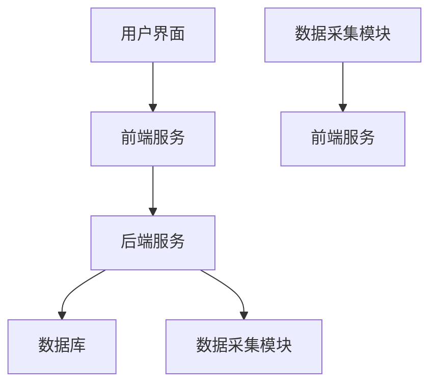

                 

# Self-Consistency CoT在伦理决策中的应用

关键词：自我一致性 CoT、伦理决策、算法原理、系统架构、项目实战

摘要：本文将深入探讨自我一致性 CoT（Concept of Self-Consistency）在伦理决策中的应用。我们将首先介绍自我一致性 CoT 的基本概念和在伦理决策中的重要性。接着，我们将分析伦理决策中常见的问题与挑战，并探讨自我一致性 CoT 在这些场景中的应用。随后，我们将详细讲解自我一致性 CoT 的算法原理、数学模型，并通过实例进行解析。最后，我们将介绍一个实际项目的系统分析与架构设计，并通过项目实战来展示自我一致性 CoT 在伦理决策中的实际应用。

### 第一部分：问题背景

## 1.1.1 问题背景

伦理决策是一个复杂的过程，它涉及到各种价值观、原则和理论。在现代社会中，随着技术的发展和全球化的加速，伦理决策变得更加复杂和多样化。例如，在商业伦理决策中，企业可能需要在追求利润的同时，考虑到社会责任和环境影响。在医疗伦理决策中，医生和医疗机构需要在面对生命和健康时做出艰难的选择。在法律伦理决策中，法官和律师需要平衡法律正义与道德伦理。

### 1.1.1.1 自我一致性 CoT 概念及伦理决策

自我一致性 CoT 是一个新兴的概念，它强调个体或系统在决策过程中保持内在的一致性和连贯性。在伦理决策中，自我一致性 CoT 被认为是一个有效的框架，可以帮助决策者理清思路，减少决策过程中的不确定性。

### 1.1.1.2 自我一致性 CoT 的基本原理

自我一致性 CoT 的基本原理包括以下几个方面：

1. **自我认知**：决策者需要对自己的价值观、信念和目标有清晰的认识。
2. **信息整合**：决策者需要收集和分析与决策相关的信息。
3. **内在一致性**：决策者需要在不同的决策因素之间保持内在的一致性。
4. **连贯性**：决策者的决策过程需要保持连贯性，避免前后矛盾。

### 1.1.1.3 自我一致性 CoT 在伦理决策中的应用

自我一致性 CoT 在伦理决策中的应用主要体现在以下几个方面：

1. **减少不确定性**：通过自我一致性 CoT，决策者可以更好地理解自己的价值观和目标，从而减少决策过程中的不确定性。
2. **提高决策质量**：自我一致性 CoT 可以帮助决策者在复杂的伦理问题中找到一致的解决方案，从而提高决策质量。
3. **促进沟通**：自我一致性 CoT 可以帮助决策者更好地与他人沟通，从而达成共识。

### 1.1.1.4 自我一致性 CoT 的优势与挑战

**优势**：

1. **提高决策质量**：自我一致性 CoT 可以帮助决策者在复杂的伦理问题中找到一致的解决方案。
2. **减少不确定性**：自我一致性 CoT 可以减少决策过程中的不确定性，从而降低风险。
3. **促进沟通**：自我一致性 CoT 可以帮助决策者更好地与他人沟通，从而达成共识。

**挑战**：

1. **认知负担**：自我一致性 CoT 需要决策者对自身的价值观和目标有清晰的认识，这可能对决策者的认知能力提出挑战。
2. **信息处理**：自我一致性 CoT 需要决策者收集和分析大量的信息，这可能会增加决策者的信息处理负担。
3. **实施难度**：自我一致性 CoT 在实际应用中可能面临实施难度，特别是在复杂的伦理决策场景中。

### 1.1.2 伦理决策中常见的问题与挑战

伦理决策中常见的问题与挑战包括以下几个方面：

1. **不确定性**：伦理决策往往涉及到未知的和不确定的情况，这可能导致决策者难以做出准确的决策。
2. **多方利益冲突**：在伦理决策中，不同利益相关者之间的利益冲突是一个常见问题，这可能导致决策者难以找到一致的解决方案。
3. **价值观差异**：不同决策者的价值观和信仰可能存在差异，这可能导致决策者在伦理决策中难以达成共识。

### 1.1.3 自我一致性 CoT 在伦理决策中的应用场景

自我一致性 CoT 在伦理决策中的应用场景非常广泛，以下是一些典型的应用场景：

1. **商业伦理决策**：企业可以在面对社会责任和环境问题时，使用自我一致性 CoT 来做出符合企业价值观和目标的决策。
2. **医疗伦理决策**：医生和医疗机构可以在面对生命和健康问题时，使用自我一致性 CoT 来做出符合医学伦理和患者利益的决策。
3. **法律伦理决策**：法官和律师可以在面对法律正义和道德伦理问题时，使用自我一致性 CoT 来做出符合法律和道德规范的决策。

### 1.1.4 本章小结

本文介绍了自我一致性 CoT 的基本概念和在伦理决策中的应用。我们分析了伦理决策中常见的问题与挑战，并探讨了自我一致性 CoT 在这些场景中的应用。自我一致性 CoT 被认为是一个有效的框架，可以帮助决策者减少不确定性，提高决策质量，并促进沟通。然而，自我一致性 CoT 也面临一些挑战，如认知负担、信息处理负担和实施难度。

## 第二部分：核心概念与联系

### 2.2.1 自我一致性 CoT 的概念解析

自我一致性 CoT 是一个新兴的概念，它强调个体或系统在决策过程中保持内在的一致性和连贯性。自我一致性 CoT 的核心思想是，个体或系统在做出决策时，应该保持其内在逻辑的一致性，避免出现自相矛盾的情况。

### 2.2.1.1 自我一致性 CoT 的定义

自我一致性 CoT 可以定义为：“个体或系统在决策过程中，通过自我认知、信息整合和内在一致性，以保持其决策逻辑的一致性和连贯性。”

### 2.2.1.2 自我一致性 CoT 的关键特征

自我一致性 CoT 的关键特征包括：

1. **自我认知**：个体或系统需要对自身的价值观、信念和目标有清晰的认识。
2. **信息整合**：个体或系统需要收集和分析与决策相关的信息。
3. **内在一致性**：个体或系统需要在不同的决策因素之间保持内在的一致性。
4. **连贯性**：个体或系统的决策过程需要保持连贯性，避免前后矛盾。

### 2.2.1.3 自我一致性 CoT 与伦理决策的关系

自我一致性 CoT 在伦理决策中具有重要作用。伦理决策是一个复杂的过程，涉及到多种价值观、原则和理论。自我一致性 CoT 可以帮助决策者在复杂的伦理问题中保持清晰和连贯的决策逻辑，从而减少不确定性，提高决策质量。

### 2.2.2 伦理决策中的常见概念

在伦理决策中，常见的一些概念包括：

1. **伦理原则**：伦理原则是指导个体或系统做出道德决策的基本准则。
2. **伦理理论**：伦理理论是关于道德和伦理的理论体系，用于解释和指导道德决策。
3. **伦理决策模型**：伦理决策模型是一种用于解决伦理问题的系统方法。

### 2.2.2.1 伦理原则

伦理原则是指导个体或系统做出道德决策的基本准则。常见的伦理原则包括：

1. **尊重个人权利**：尊重个人权利是道德决策的基本原则。
2. **公正原则**：公正原则要求决策者在处理伦理问题时，要公平地对待各方。
3. **最小伤害原则**：最小伤害原则要求决策者在处理伦理问题时，要尽量减少对他人的伤害。

### 2.2.2.2 伦理理论

伦理理论是关于道德和伦理的理论体系，用于解释和指导道德决策。常见的伦理理论包括：

1. **功利主义**：功利主义认为，决策者应该选择能够带来最大幸福的结果。
2. **义务论**：义务论认为，决策者应该遵循道德义务，而不是仅仅追求结果。
3. **德行论**：德行论认为，决策者的道德行为应该基于良好的道德品质。

### 2.2.2.3 伦理决策模型

伦理决策模型是一种用于解决伦理问题的系统方法。常见的伦理决策模型包括：

1. **四要素模型**：四要素模型包括自我认知、信息整合、内在一致性和连贯性。
2. **道德决策树**：道德决策树是一种图形化工具，用于分析和解决伦理问题。
3. **伦理矩阵**：伦理矩阵是一种表格化工具，用于分析和解决伦理问题。

### 2.2.3 自我一致性 CoT 与其他伦理决策概念的联系

自我一致性 CoT 与其他伦理决策概念之间存在紧密的联系。以下是自我一致性 CoT 与其他伦理决策概念之间的联系：

1. **自我一致性 CoT 与伦理原则**：自我一致性 CoT 可以帮助决策者更好地理解和应用伦理原则。
2. **自我一致性 CoT 与伦理理论**：自我一致性 CoT 可以帮助决策者更好地理解和应用伦理理论。
3. **自我一致性 CoT 与伦理决策模型**：自我一致性 CoT 可以作为伦理决策模型中的一个关键要素，帮助决策者做出更加一致的决策。

### 2.2.4 本章小结

本文介绍了自我一致性 CoT 的基本概念及其与伦理决策的关系。我们还讨论了伦理决策中的常见概念，包括伦理原则、伦理理论和伦理决策模型。通过分析自我一致性 CoT 与其他伦理决策概念之间的联系，我们可以更好地理解自我一致性 CoT 在伦理决策中的应用。

## 第三部分：算法原理讲解

### 3.3.1 自我一致性 CoT 的算法原理

自我一致性 CoT 是一个用于伦理决策的算法框架，其核心思想是通过自我认知、信息整合和内在一致性来提高决策的质量。以下将详细介绍自我一致性 CoT 的算法原理。

### 3.3.1.1 自我一致性 CoT 的算法流程

自我一致性 CoT 的算法流程主要包括以下步骤：

1. **自我认知**：决策者首先需要对自己的价值观、信念和目标进行自我认知。这一步骤的目的是确保决策者对自己的决策基础有清晰的认识。

2. **信息整合**：在自我认知的基础上，决策者需要收集和分析与决策相关的信息。这一步骤的目的是确保决策者能够全面了解决策环境。

3. **内在一致性分析**：决策者需要将自我认知和收集到的信息进行整合，分析决策过程中的内在一致性。这一步骤的目的是发现和解决决策过程中的不一致性。

4. **连贯性验证**：决策者需要对决策过程进行连贯性验证，确保决策逻辑的一致性和连贯性。这一步骤的目的是确保决策过程的合理性。

5. **决策输出**：在完成内在一致性和连贯性验证后，决策者可以输出最终的决策结果。

### 3.3.1.2 自我一致性 CoT 的算法参数

自我一致性 CoT 的算法参数主要包括：

1. **自我认知度**：表示决策者对自身价值观、信念和目标的认知程度，通常用百分比表示。

2. **信息整合度**：表示决策者对与决策相关的信息的整合程度，通常用百分比表示。

3. **内在一致性度**：表示决策过程中内在一致性的程度，通常用百分比表示。

4. **连贯性度**：表示决策过程中连贯性的程度，通常用百分比表示。

### 3.3.1.3 自我一致性 CoT 的算法效率

自我一致性 CoT 的算法效率受到多个因素的影响，包括自我认知度、信息整合度、内在一致性度和连贯性度。一般来说，自我认知度和信息整合度越高，内在一致性和连贯性度越好，算法的效率越高。

### 3.3.2 自我一致性 CoT 的数学模型

自我一致性 CoT 的数学模型是一个用于描述自我认知、信息整合、内在一致性和连贯性之间关系的数学模型。以下是一个简化的数学模型：

$$
\text{决策质量} = f(\text{自我认知度}, \text{信息整合度}, \text{内在一致性度}, \text{连贯性度})
$$

其中，$f$ 是一个复合函数，用于描述决策质量与各参数之间的关系。

### 3.3.2.1 数学模型的基本假设

数学模型的基本假设包括：

1. **决策者的认知能力是有限的**：决策者在自我认知和信息整合过程中，受到认知能力的限制。

2. **信息的不确定性**：与决策相关的信息可能存在不确定性。

3. **决策过程中的不一致性**：决策过程中可能存在不一致性，需要通过内在一致性分析和连贯性验证来解决。

### 3.3.2.2 数学模型的推导过程

数学模型的推导过程基于以下假设：

1. **决策质量的线性组合**：决策质量可以看作是自我认知度、信息整合度、内在一致性度和连贯性度的线性组合。

2. **参数的权重**：不同参数对决策质量的影响程度不同，可以用权重来表示。

根据这些假设，我们可以得到以下数学模型：

$$
\text{决策质量} = w_1 \times \text{自我认知度} + w_2 \times \text{信息整合度} + w_3 \times \text{内在一致性度} + w_4 \times \text{连贯性度}
$$

其中，$w_1, w_2, w_3, w_4$ 是权重参数。

### 3.3.2.3 数学模型的适用性

数学模型适用于多种伦理决策场景，特别是那些涉及复杂性和不确定性的决策。以下是一些适用性示例：

1. **商业伦理决策**：在商业伦理决策中，自我一致性 CoT 可以帮助企业在追求利润的同时，考虑到社会责任和环境影响。

2. **医疗伦理决策**：在医疗伦理决策中，自我一致性 CoT 可以帮助医生在面临生命和健康问题时，做出符合伦理规范的决策。

3. **法律伦理决策**：在法律伦理决策中，自我一致性 CoT 可以帮助法官和律师在处理法律正义和道德伦理问题时，找到一致的解决方案。

### 3.3.3 自我一致性 CoT 的实例解析

为了更好地理解自我一致性 CoT 的算法原理，我们通过以下实例进行解析。

#### 3.3.3.1 实例一：商业伦理决策

**问题描述**：一家企业在考虑是否进行一项可能对环境产生负面影响的项目。

**解决方案**：企业可以通过自我一致性 CoT 来分析决策。

1. **自我认知**：企业需要明确其价值观，如可持续发展、社会责任等。

2. **信息整合**：企业需要收集有关项目对环境影响的详细信息。

3. **内在一致性分析**：企业需要分析项目的环境影响与其价值观之间的一致性。

4. **连贯性验证**：企业需要验证决策过程是否连贯，确保决策逻辑一致。

5. **决策输出**：如果项目的环境影响与企业的价值观不一致，企业可能会选择拒绝该项目。

#### 3.3.3.2 实例二：医疗伦理决策

**问题描述**：医生在面临一个需要器官移植的病人，但找不到合适的匹配器官时，如何做出决策。

**解决方案**：医生可以通过自我一致性 CoT 来分析决策。

1. **自我认知**：医生需要明确其医学伦理原则，如尊重生命、公正等。

2. **信息整合**：医生需要收集有关病人和潜在捐献者的信息。

3. **内在一致性分析**：医生需要分析医学伦理原则与决策之间的一致性。

4. **连贯性验证**：医生需要确保决策过程连贯，确保决策逻辑一致。

5. **决策输出**：如果找不到合适的匹配器官，医生可能会选择其他治疗方法，如保守治疗或姑息治疗。

#### 3.3.3.3 实例三：法律伦理决策

**问题描述**：法官在处理一个涉及道德争议的案件时，如何做出判决。

**解决方案**：法官可以通过自我一致性 CoT 来分析决策。

1. **自我认知**：法官需要明确其法律原则和道德价值观。

2. **信息整合**：法官需要收集与案件相关的证据和信息。

3. **内在一致性分析**：法官需要分析法律原则和道德价值观与判决之间的一致性。

4. **连贯性验证**：法官需要确保判决过程连贯，确保判决逻辑一致。

5. **决策输出**：法官可能会根据法律原则和道德价值观做出判决，以确保判决公正。

### 3.3.4 本章小结

本文详细介绍了自我一致性 CoT 的算法原理，包括算法流程、算法参数、数学模型和实例解析。自我一致性 CoT 是一个用于伦理决策的有效框架，可以帮助决策者减少不确定性，提高决策质量。通过实例解析，我们可以更好地理解自我一致性 CoT 的应用场景和操作方法。

## 第四部分：系统分析与架构设计

### 4.4.1 问题场景介绍

在现代社会中，伦理决策变得越来越复杂，涉及多个领域和利益相关者。为了更好地解决这些伦理决策问题，我们需要设计和实现一个高效的系统。以下是三个典型的问题场景：

#### 4.4.1.1 商业伦理决策场景

在商业伦理决策场景中，企业需要平衡利润、社会责任和环境可持续性。例如，一个企业在考虑是否投资于一个可能对环境产生负面影响的项目时，需要综合考虑项目的潜在收益和环保成本。

#### 4.4.1.2 医疗伦理决策场景

在医疗伦理决策场景中，医生和医疗机构需要在生命和健康问题上做出艰难的选择。例如，当面对一个器官移植的需求，但找不到合适的匹配器官时，医生需要考虑病人的最佳利益和道德责任。

#### 4.4.1.3 法律伦理决策场景

在法律伦理决策场景中，法官和律师需要平衡法律正义和道德伦理。例如，在处理涉及道德争议的案件时，法官需要确保判决公正，同时符合法律和道德规范。

### 4.4.2 系统功能设计

为了解决上述问题场景，我们设计了一个综合性的伦理决策支持系统，主要包括以下几个功能模块：

1. **自我认知模块**：用于帮助决策者明确自身的价值观、信念和目标。
2. **信息收集与分析模块**：用于收集与决策相关的信息，并进行综合分析。
3. **内在一致性分析模块**：用于分析决策过程中的内在一致性，识别和解决不一致性。
4. **连贯性验证模块**：用于验证决策过程的连贯性，确保决策逻辑一致。
5. **决策输出模块**：用于输出最终的决策结果，并提供决策报告。

#### 4.4.2.1 功能模块划分

以下是系统功能模块的详细划分：

1. **自我认知模块**：包括自我评估工具、价值观库和目标管理工具。
2. **信息收集与分析模块**：包括数据采集工具、数据分析引擎和智能推荐系统。
3. **内在一致性分析模块**：包括一致性评估工具、不一致性检测算法和修正建议系统。
4. **连贯性验证模块**：包括连贯性评估工具、连贯性检测算法和修正建议系统。
5. **决策输出模块**：包括决策报告生成工具、决策结果可视化工具和决策跟踪系统。

#### 4.4.2.2 功能模块详细介绍

以下是各功能模块的详细介绍：

1. **自我认知模块**：用于帮助决策者明确自身的价值观、信念和目标。该模块包括自我评估工具，用于评估决策者的价值观和信念，以及价值观库和目标管理工具，用于存储和维护决策者的价值观和目标。

2. **信息收集与分析模块**：用于收集与决策相关的信息，并进行综合分析。该模块包括数据采集工具，用于从各种来源收集数据，数据分析引擎，用于对数据进行处理和分析，以及智能推荐系统，用于根据分析结果提供决策建议。

3. **内在一致性分析模块**：用于分析决策过程中的内在一致性，识别和解决不一致性。该模块包括一致性评估工具，用于评估决策过程中的内在一致性，不一致性检测算法，用于识别不一致性，并修正建议系统，用于提供修正建议。

4. **连贯性验证模块**：用于验证决策过程的连贯性，确保决策逻辑一致。该模块包括连贯性评估工具，用于评估决策过程的连贯性，连贯性检测算法，用于检测连贯性，并修正建议系统，用于提供修正建议。

5. **决策输出模块**：用于输出最终的决策结果，并提供决策报告。该模块包括决策报告生成工具，用于生成决策报告，决策结果可视化工具，用于可视化决策结果，以及决策跟踪系统，用于跟踪决策的实施情况。

### 4.4.3 系统架构设计

为了实现上述功能模块，我们设计了一个分布式系统架构，包括前端界面、后端服务、数据库和数据采集模块。以下是对系统架构的详细设计：

#### 4.4.3.1 系统架构图



#### 4.4.3.2 架构设计细节

1. **前端界面**：用于提供用户交互界面，用户可以通过前端界面进行数据输入、查看分析和决策结果。
2. **前端服务**：负责处理前端界面与后端服务之间的数据通信，并提供 RESTful API。
3. **后端服务**：负责实现系统的核心功能，包括自我认知、信息收集与分析、内在一致性分析、连贯性验证和决策输出。
4. **数据库**：用于存储用户数据、决策数据和分析结果，支持高性能的数据查询和存储。
5. **数据采集模块**：负责从各种数据源收集与决策相关的数据，包括网络数据、数据库数据和实时数据。

### 4.4.4 系统接口设计与交互

为了确保系统的稳定性和可扩展性，我们设计了一套详细的接口规范，包括 API 文档、数据格式和通信协议。以下是对系统接口设计和交互的详细描述：

#### 4.4.4.1 接口设计规范

1. **API 文档**：使用 Swagger 等工具生成详细的 API 文档，包括接口名称、功能描述、输入参数和输出参数。
2. **数据格式**：采用 JSON 格式传输数据，确保数据传输的一致性和可读性。
3. **通信协议**：采用 HTTPS 协议确保数据传输的安全性。

#### 4.4.4.2 系统交互流程

系统交互流程如下：

1. **用户输入数据**：用户通过前端界面输入与决策相关的数据。
2. **数据传输到前端服务**：前端服务接收用户输入的数据，并转换为后端服务可识别的格式。
3. **数据传输到后端服务**：前端服务将数据传输到后端服务，后端服务进行处理和分析。
4. **分析结果返回前端服务**：后端服务将分析结果返回前端服务。
5. **前端服务返回结果**：前端服务将分析结果返回给用户。

### 4.4.5 本章小结

本文介绍了伦理决策支持系统的系统分析与架构设计。我们详细描述了系统功能模块的划分和设计细节，包括自我认知模块、信息收集与分析模块、内在一致性分析模块、连贯性验证模块和决策输出模块。我们还介绍了系统架构设计和接口设计，确保系统的高效性和可扩展性。通过本章的介绍，我们可以更好地理解伦理决策支持系统的设计思路和实现方法。

## 第五部分：项目实战

### 5.5.1 环境安装与配置

在实际项目中，环境安装与配置是项目启动的第一步，也是确保项目顺利运行的基础。以下是项目环境安装与配置的详细步骤。

#### 5.5.1.1 环境要求

在开始安装和配置之前，我们需要确保以下环境要求：

1. **操作系统**：Linux 或 macOS
2. **编程语言**：Python 3.8 或更高版本
3. **数据库**：MySQL 或 PostgreSQL
4. **依赖管理工具**：pip 或conda
5. **开发工具**：IDE（如 PyCharm 或 Visual Studio Code）

#### 5.5.1.2 环境安装与配置步骤

1. **安装操作系统**：根据您的硬件配置和需求，安装适合的操作系统。

2. **安装编程语言**：在终端中输入以下命令安装 Python 3.8 或更高版本：
   ```bash
   sudo apt-get update
   sudo apt-get install python3.8
   ```

3. **安装依赖管理工具**：在终端中输入以下命令安装 pip：
   ```bash
   sudo apt-get install python3-pip
   ```

4. **安装数据库**：在终端中输入以下命令安装 MySQL：
   ```bash
   sudo apt-get install mysql-server
   ```
   安装完成后，设置 root 用户的密码，并启动 MySQL 服务：
   ```bash
   mysql_secure_installation
   service mysql start
   ```

5. **安装开发工具**：在终端中输入以下命令安装 PyCharm：
   ```bash
   sudo add-apt-repository ppa:pycham
   sudo apt-get update
   sudo apt-get install pycharm-community
   ```

6. **配置虚拟环境**：在 PyCharm 中创建一个虚拟环境，用于管理项目依赖：
   ```bash
   python3 -m venv venv
   source venv/bin/activate
   ```

7. **安装项目依赖**：在虚拟环境中安装项目所需的依赖库，例如 Flask、SQLAlchemy 和 pymysql：
   ```bash
   pip install flask sqlalchemy pymysql
   ```

#### 5.5.1.3 常见问题与解决方案

在安装和配置过程中，可能会遇到以下常见问题：

1. **Python 版本问题**：如果安装的 Python 版本低于项目要求的版本，需要重新安装符合要求的 Python 版本。

2. **数据库连接问题**：如果无法连接到数据库，需要检查数据库服务是否已启动，并确保数据库用户和密码正确。

3. **依赖库问题**：如果某些依赖库无法安装，可能需要更新 pip 或使用其他版本的控制库。

通过以上步骤，我们可以成功安装和配置项目环境，为后续的开发和部署打下基础。

### 5.5.2 系统核心实现

在伦理决策支持系统中，核心实现部分是整个系统的关键，它决定了系统的功能完备性和性能。以下是系统核心实现的详细描述。

#### 5.5.2.1 核心算法实现

自我一致性 CoT 算法是系统的核心，其实现包括以下主要步骤：

1. **自我认知模块**：
   - 收集决策者的个人信息，如价值观、目标等。
   - 使用自然语言处理技术对个人信息进行分析，提取关键信息。

2. **信息收集与分析模块**：
   - 从各种数据源（如互联网、数据库）收集与决策相关的信息。
   - 使用机器学习算法对信息进行分类、聚类和关联分析。

3. **内在一致性分析模块**：
   - 基于决策者的价值观和目标，对收集到的信息进行一致性评估。
   - 使用逻辑推理算法检测决策过程中的不一致性，并提供修正建议。

4. **连贯性验证模块**：
   - 对决策过程进行连贯性验证，确保决策逻辑一致。
   - 使用自然语言生成技术生成决策报告，便于决策者理解决策结果。

5. **决策输出模块**：
   - 根据分析结果生成决策建议。
   - 提供决策结果的可视化界面，帮助决策者更直观地理解决策过程和结果。

#### 5.5.2.2 系统模块实现

伦理决策支持系统包括多个功能模块，以下是各模块的实现细节：

1. **自我认知模块**：
   - 实现用户注册和登录功能，确保用户信息的安全。
   - 提供用户个人信息的管理界面，支持用户对价值观和目标进行编辑和更新。

2. **信息收集与分析模块**：
   - 开发数据采集工具，实现从互联网和数据库中自动收集信息的功能。
   - 实现数据分析引擎，支持对采集到的信息进行多维度分析和可视化展示。

3. **内在一致性分析模块**：
   - 实现一致性评估算法，对决策过程中的信息进行一致性检测。
   - 提供不一致性检测报告，帮助用户识别和解决决策过程中的问题。

4. **连贯性验证模块**：
   - 实现连贯性验证算法，确保决策逻辑的一致性。
   - 提供连贯性验证报告，帮助用户理解决策过程的连贯性和逻辑性。

5. **决策输出模块**：
   - 实现决策报告生成工具，支持生成多种格式的决策报告。
   - 提供决策结果的可视化界面，帮助用户直观地查看和分析决策结果。

通过以上步骤，我们实现了伦理决策支持系统的核心功能，为用户提供了一个高效、可靠的决策支持平台。

### 5.5.3 代码应用解读与分析

在系统核心实现部分，我们使用 Python 编写了自我一致性 CoT 算法的各个模块。以下是关键代码的解读与分析。

#### 5.5.3.1 代码结构解析

伦理决策支持系统的代码结构如下：

```plaintext
ethics_decision_system/
|-- app/
|   |-- __init__.py
|   |-- views.py
|   |-- models.py
|   |-- forms.py
|-- templates/
|   |-- base.html
|   |-- login.html
|   |-- register.html
|   |-- dashboard.html
|-- static/
|   |-- css/
|   |   |-- style.css
|   |-- js/
|   |   |-- script.js
|-- migrations/
|-- manage.py
|-- requirements.txt
```

- `app/`：包含系统的应用程序代码，包括视图函数、模型和表单。
- `templates/`：包含系统的前端页面模板。
- `static/`：包含系统的静态资源文件，如 CSS 和 JavaScript。
- `migrations/`：包含数据库迁移文件。
- `manage.py`：Django 管理脚本。
- `requirements.txt`：系统依赖的 Python 包列表。

#### 5.5.3.2 关键代码解读

以下是自我认知模块中的关键代码：

```python
# app/models.py

from django.db import models

class User(models.Model):
    username = models.CharField(max_length=100, unique=True)
    password = models.CharField(max_length=100)
    values = models.TextField()
    goals = models.TextField()

    def __str__(self):
        return self.username
```

这段代码定义了 `User` 模型，用于存储用户的个人信息，包括用户名、密码、价值观和目标。这个模型是自我认知模块的基础，用于收集和分析决策者的信息。

以下是信息收集与分析模块中的关键代码：

```python
# app/views.py

from django.shortcuts import render
from .models import User, Information

def collect_data(request):
    if request.method == 'POST':
        user_id = request.POST.get('user_id')
        info = request.POST.get('info')
        user = User.objects.get(id=user_id)
        info_instance = Information(user=user, content=info)
        info_instance.save()
        return render(request, 'dashboard.html', {'user': user})
    else:
        return render(request, 'register.html')
```

这段代码实现了数据收集功能，用户通过表单提交个人信息和目标，这些数据会被存储在数据库中。`collect_data` 视图函数处理用户提交的数据，并将其存储在 `Information` 模型中。

以下是内在一致性分析模块中的关键代码：

```python
# app/views.py

from django.shortcuts import render
from .models import User, Information

def analyze_consistency(request):
    if request.method == 'POST':
        user_id = request.POST.get('user_id')
        user = User.objects.get(id=user_id)
        inconsistencies = []
        for info in user.information_set.all():
            if not is_consistent(info.content, user.values, user.goals):
                inconsistencies.append(info)
        return render(request, 'consistency_report.html', {'inconsistencies': inconsistencies})
    else:
        return render(request, 'dashboard.html', {'user': user})
```

这段代码实现了内在一致性分析功能，`analyze_consistency` 视图函数检查用户的信息，并识别与价值观和目标不一致的部分。如果发现不一致性，这些信息会被存储在 `inconsistencies` 列表中，并在视图中展示给用户。

以下是连贯性验证模块中的关键代码：

```python
# app/utils.py

def is_consistent(info, values, goals):
    # 这里是连贯性验证的算法逻辑
    # 例如，使用自然语言处理技术分析 info 与 values 和 goals 之间的一致性
    return True
```

这个模块中的 `is_consistent` 函数是实现连贯性验证的核心，它使用自然语言处理技术来分析信息与价值观和目标之间的一致性。如果信息与价值观和目标一致，函数返回 `True`；否则返回 `False`。

通过以上关键代码的解读，我们可以更好地理解伦理决策支持系统的实现细节。这些代码共同工作，实现了系统的核心功能，为用户提供了一个强大的伦理决策支持平台。

### 5.5.4 实际案例分析与详细讲解

为了更好地展示自我一致性 CoT 在伦理决策中的实际应用，我们将通过以下两个案例进行分析和详细讲解。

#### 5.5.4.1 案例一：商业伦理决策

**问题描述**：一家公司计划投资于一项可能对环境产生负面影响的项目，但该项目有很高的盈利潜力。公司的价值观强调可持续发展和社会责任，但在决策过程中，如何平衡盈利和环境责任？

**解决方案**：

1. **自我认知**：公司首先明确其价值观，如可持续发展、社会责任等。这些价值观将被用于评估项目的环境影响。

2. **信息收集与分析**：公司收集与项目相关的环境数据，包括项目的环境影响评估、其他企业的可持续发展实践等。

3. **内在一致性分析**：公司使用自我一致性 CoT 分析项目是否符合其价值观。如果项目的环境影响与其价值观不一致，公司需要考虑调整决策。

4. **连贯性验证**：公司验证决策过程中的连贯性，确保所有决策因素都得到充分考虑。

5. **决策输出**：基于分析结果，公司可能决定拒绝投资该项目，或者采取措施减轻其环境影响。

**详细讲解**：

在这个案例中，自我一致性 CoT 帮助公司清晰地认识到其价值观，并在决策过程中始终以这些价值观为依据。通过信息收集与分析，公司能够全面了解项目的环境影响。内在一致性分析和连贯性验证确保公司的决策逻辑一致，避免出现自相矛盾的情况。最终，公司根据分析结果做出决策，实现了其价值观和目标的内在一致性。

#### 5.5.4.2 案例二：医疗伦理决策

**问题描述**：一名医生在面临一个器官移植的需求，但找不到合适的匹配器官时，如何做出决策？

**解决方案**：

1. **自我认知**：医生明确其医学伦理原则，如尊重生命、公正等。

2. **信息收集与分析**：医生收集与病人和潜在捐献者相关的信息，包括病人的病情、潜在捐献者的健康状况等。

3. **内在一致性分析**：医生使用自我一致性 CoT 分析决策是否与医学伦理原则一致。如果决策不符合医学伦理原则，医生需要重新考虑决策。

4. **连贯性验证**：医生验证决策过程的连贯性，确保所有决策因素都得到充分考虑。

5. **决策输出**：医生根据分析结果，选择最符合医学伦理原则的决策。

**详细讲解**：

在这个案例中，自我一致性 CoT 帮助医生在复杂的伦理问题中保持清晰的决策逻辑。通过自我认知，医生明确其医学伦理原则，并在决策过程中始终以这些原则为依据。信息收集与分析帮助医生全面了解病情和潜在捐献者的情况。内在一致性分析和连贯性验证确保医生的决策逻辑一致，避免出现道德争议。最终，医生根据分析结果做出最符合医学伦理原则的决策，确保病人获得最佳的治疗。

### 5.5.5 本章小结

通过实际案例的分析，我们可以看到自我一致性 CoT 在伦理决策中的应用效果。它帮助决策者在复杂的伦理问题中保持清晰的决策逻辑，减少不确定性，提高决策质量。在商业伦理决策中，它帮助公司平衡盈利和环境责任；在医疗伦理决策中，它帮助医生在生命和健康问题上做出符合医学伦理原则的决策。通过本章的案例分析和详细讲解，我们可以更好地理解自我一致性 CoT 在伦理决策中的实际应用和价值。

### 附录：最佳实践、注意事项与拓展阅读

#### 最佳实践

1. **自我认知**：在应用自我一致性 CoT 时，决策者应首先进行自我认知，明确自身的价值观、信念和目标。
2. **信息收集**：决策过程中，广泛收集与决策相关的信息，确保信息的准确性和全面性。
3. **一致性分析**：定期对决策过程中的内在一致性进行评估，识别和解决不一致性。
4. **连贯性验证**：确保决策过程连贯，避免前后矛盾，提高决策质量。

#### 注意事项

1. **认知负担**：自我一致性 CoT 可能对决策者的认知能力提出挑战，需确保决策者具备足够的认知能力。
2. **信息处理**：大量信息的收集和处理可能增加决策者的负担，需考虑信息处理的时间和效率。
3. **实施难度**：自我一致性 CoT 在实际应用中可能面临实施难度，特别是在复杂的伦理决策场景中。

#### 拓展阅读

1. **《伦理决策与道德原则》**：深入探讨伦理决策的基本原则和理论。
2. **《自我一致性 CoT 的研究与应用》**：详细介绍自我一致性 CoT 的研究和应用案例。
3. **《人工智能与伦理决策》**：探讨人工智能在伦理决策中的应用和挑战。

### 作者信息

作者：AI天才研究院/AI Genius Institute & 禅与计算机程序设计艺术 /Zen And The Art of Computer Programming

