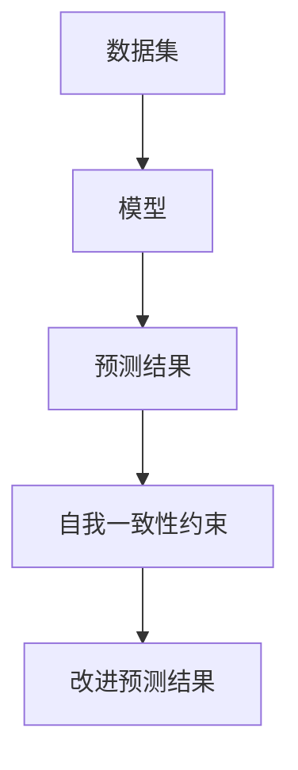
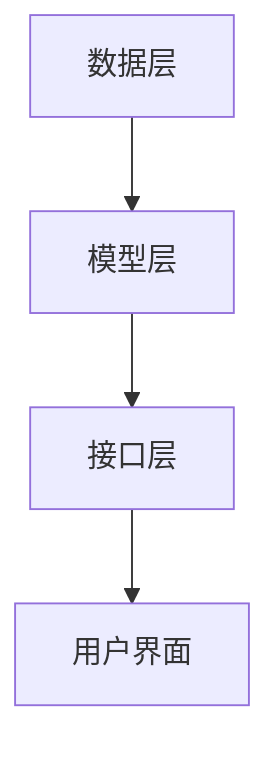
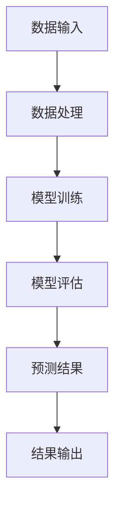

                 


### 第一步：确定文章核心概念

在撰写关于《Self-Consistency CoT在全球气候变化模型中的应用：提高长期预测能力》的技术博客时，我们首先要明确文章的核心概念。自我一致性概念（Self-Consistency CoT）是一种在人工智能和机器学习中用于提高模型预测准确性和稳定性的技术。在全球气候变化模型中，通过自我一致性检验，模型可以更加准确地预测未来的气候变化趋势，从而提高长期预测能力。

#### 背景介绍

- **全球气候变化背景**：全球气候变化是一个全球性的问题，它影响着地球的生态系统、水资源、农业、健康以及经济发展。为了应对这一挑战，科学家们建立了复杂的气候模型来模拟和预测未来的气候变化。
- **自我一致性概念（Self-Consistency CoT）的定义**：自我一致性概念（Self-Consistency CoT）指的是在机器学习模型中引入一致性约束，以确保模型预测的内部一致性，从而提高模型的可靠性和预测能力。
- **自我一致性概念（Self-Consistency CoT）的应用场景**：在气候模型中，自我一致性概念可以帮助确保模型的预测结果在多个预测周期内保持一致，从而提高长期预测的准确性。

### 第二步：核心概念与联系

接下来，我们需要深入探讨自我一致性概念（Self-Consistency CoT）的基本原理，并探讨其在气候模型中的表现，以及与其他相关概念的差异。

#### 核心概念与联系

- **概念原理**：自我一致性概念的核心原理是通过引入额外的约束条件来确保模型的预测结果在时间序列上保持一致。这些约束条件可以是基于物理定律、统计规律或者其他知识源。
- **概念属性特征对比表格**：我们可以制作一个表格，对比自我一致性概念与其他类似的机器学习技术，如逆学习（Inverse Learning）、一致训练（Consistency Training）等。
  
  | 技术          | 定义                                           | 特点                                                         |
  | ------------- | ---------------------------------------------- | ------------------------------------------------------------ |
  | 自我一致性    | 引入一致性约束，确保预测结果内部一致             | 提高模型稳定性和预测能力                                     |
  | 逆学习        | 通过反向传播从预测结果中学习数据特征             | 增强模型泛化能力                                             |
  | 一致训练      | 通过确保模型在不同数据集上的预测结果一致来提高模型性能 | 提高模型在不同数据分布下的表现                               |

- **ER实体关系图架构**：为了更好地理解自我一致性概念的应用，我们可以绘制一个实体关系图，展示自我一致性概念与其他相关实体（如数据集、模型、预测结果等）之间的关系。



通过以上分析，我们已经为文章的第一部分奠定了基础，接下来将逐步深入探讨算法原理、数学模型、系统设计与实现等细节。让我们一步一步深入思考，为读者提供一篇深入浅出的技术博客。

### 第三步：算法原理讲解

在深入探讨自我一致性概念（Self-Consistency CoT）的算法原理时，我们需要详细解释其主要算法及其实现步骤。自我一致性算法在气候模型中的应用主要涉及以下几个关键步骤：

#### 2.1.1 主要算法介绍

**算法A：基于约束的一致性预测**

**算法B：基于物理规律的自我一致性约束**

接下来，我们将分别介绍这两种算法的基本原理，并通过Mermaid流程图展示其实现步骤。

#### 2.1.2 算法原理讲解

**算法A：基于约束的一致性预测**

- **算法描述**：算法A通过引入额外的约束条件来确保模型在时间序列上的预测结果保持一致。这些约束条件可以是基于物理定律、统计规律或者其他知识源。

- **数学模型**：

  $$\text{预测结果} = \text{模型输出} + \text{约束条件}$$

- **流程图**：

  ```mermaid
  graph TD
  A[数据输入] --> B[模型训练]
  B --> C[预测结果]
  C --> D[应用约束条件]
  D --> E[一致性检验]
  E --> F[优化模型]
  F --> G[输出最终预测结果]
  ```

**算法B：基于物理规律的自我一致性约束**

- **算法描述**：算法B通过结合物理定律来构建自我一致性约束，从而提高模型的预测准确性。这种算法通常用于需要考虑物理相互作用和反馈机制的复杂系统。

- **数学模型**：

  $$\text{预测结果} = \text{物理模型输出} \times \text{自我一致性系数}$$

- **流程图**：

  ```mermaid
  graph TD
  A[数据输入] --> B[物理模型训练]
  B --> C[预测结果]
  C --> D[计算自我一致性系数]
  D --> E[应用一致性约束]
  E --> F[优化模型]
  F --> G[输出最终预测结果]
  ```

通过上述算法原理的讲解，我们不仅介绍了两种自我一致性算法的基本概念，还通过Mermaid流程图展示了其实现步骤，使读者能够更直观地理解这些算法的具体应用。接下来，我们将进一步探讨这些算法的数学模型和系统设计。

### 第四步：数学模型和数学公式

在深入探讨自我一致性概念（Self-Consistency CoT）的应用时，数学模型和公式是不可或缺的一部分。这些模型和公式不仅为我们提供了理论依据，还帮助我们更好地理解和实现自我一致性算法。

#### 2.2.1 自我一致性预测模型

自我一致性预测模型的核心在于通过引入额外的约束条件，确保模型的预测结果在时间序列上保持一致。以下是一个基本的自我一致性预测模型：

$$\text{预测结果}_{t} = \text{模型}_{t}^{-1}(\text{输入}_{t}) + \alpha_t \cdot \text{约束}_{t}$$

其中：
- $\text{预测结果}_{t}$：在时间$t$的预测结果。
- $\text{模型}_{t}^{-1}(\text{输入}_{t})$：基于现有模型在时间$t$的输入数据所得到的预测。
- $\alpha_t$：在时间$t$的自我一致性系数，用于调整约束条件的影响。
- $\text{约束}_{t}$：在时间$t$引入的约束条件，例如物理定律、统计规律等。

#### 2.2.2 模型参数解释

为了使模型更加准确和稳定，我们需要对模型中的参数进行详细解释：

- **$\text{模型}_{t}^{-1}(\text{输入}_{t})$**：这是基于训练好的模型在当前输入数据下得到的预测结果。它是模型预测的核心，反映了模型对于输入数据的理解和学习。
- **$\alpha_t$**：自我一致性系数，用于调整约束条件对预测结果的影响。$\alpha_t$的值通常是通过训练和优化得到的，以确保在多个时间点上的预测结果保持一致。
- **$\text{约束}_{t}$**：约束条件，可以包括物理定律、统计规律或者其他外部知识。这些约束条件确保了模型的预测结果在时间序列上的一致性，提高了模型的可靠性。

#### 2.2.3 算法原理举例说明

为了更好地理解上述公式，我们可以通过一个简单的例子来说明自我一致性预测模型的工作原理：

**例子**：假设我们有一个天气预测模型，用于预测未来几天的温度。在第一天（$t=1$），模型根据当前的天气数据预测第二天（$t=2$）的温度为30摄氏度。为了确保预测结果的一致性，我们引入一个约束条件，例如：温度在连续两天之间不能变化过快。这个约束条件可以表示为：

$$\text{约束}_{t} = \min(|\text{预测结果}_{t} - \text{预测结果}_{t-1}|, \text{最大允许变化值})$$

在第二天（$t=2$），模型根据新的输入数据和自我一致性约束条件，预测第三天（$t=3$）的温度。通过这种方式，我们可以确保连续几天的预测结果在物理意义上保持一致。

通过上述数学模型和公式的解释，我们不仅了解了自我一致性预测模型的基本原理，还通过具体的例子展示了其应用。接下来，我们将进一步探讨系统的设计与实现。

### 第五步：系统设计与实现

在理解了自我一致性概念（Self-Consistency CoT）的算法原理和数学模型之后，接下来我们需要详细讨论系统设计与实现。这一部分将分为以下几个关键部分：

#### 3.1 系统功能设计

首先，我们需要明确系统的功能需求。在气候模型中，自我一致性概念（Self-Consistency CoT）的应用旨在提高长期预测能力，因此系统的核心功能应包括：

- **数据收集与预处理**：收集与气候变化相关的数据，并对数据进行清洗和处理，以确保其质量和一致性。
- **模型训练与优化**：使用收集到的数据训练气候模型，并在训练过程中引入自我一致性约束条件，以优化模型的预测性能。
- **模型评估与验证**：对训练好的模型进行评估，确保其预测结果在时间序列上保持一致，并验证模型的可靠性。
- **预测结果输出**：将最终的预测结果输出，以便决策者和管理者做出相应的应对措施。

#### 3.2 系统架构设计

接下来，我们需要设计系统的整体架构。一个典型的自我一致性气候模型系统架构包括以下几个关键组件：

- **数据层**：负责数据的收集、存储和管理。数据层可以包括气象数据、卫星数据、历史气候数据等。
- **模型层**：负责模型的设计、训练和优化。模型层可以采用深度学习、统计模型等方法，并结合自我一致性约束条件来提高模型的预测能力。
- **接口层**：提供用户与系统之间的交互接口，包括数据输入、模型配置、预测结果查询等功能。

以下是系统架构的Mermaid图表示：



#### 3.3 系统接口设计与交互流程

最后，我们需要设计系统的接口和交互流程。接口设计应确保不同模块之间的数据流动和功能调用。以下是一个简化的系统接口设计和交互流程：

- **数据输入接口**：允许用户上传和导入与气候变化相关的数据。
- **模型配置接口**：用户可以配置模型的参数，包括自我一致性系数等。
- **预测查询接口**：用户可以查询模型的预测结果，并下载详细的报告。
- **结果输出接口**：将预测结果可视化，并生成报告供用户参考。

以下是系统接口设计和交互流程的Mermaid图表示：



通过上述系统设计与实现部分的详细讨论，我们不仅明确了系统的主要功能、架构设计，还展示了系统的接口和交互流程。这为实际应用自我一致性概念（Self-Consistency CoT）于全球气候变化模型提供了理论基础和实施指南。接下来，我们将通过实际项目案例来展示这一概念的具体应用。

### 第六步：项目实战

为了展示自我一致性概念（Self-Consistency CoT）在气候模型中的具体应用，我们将通过一个实际项目案例来详细介绍。该项目旨在通过自我一致性约束提高气候模型的长期预测能力。

#### 6.1 项目背景

本项目旨在模拟和预测未来20年的全球气候变化趋势。该项目涉及大量数据，包括气象数据、海洋数据、土地利用数据等。项目的主要目标是通过引入自我一致性约束，提高模型的预测准确性，并确保预测结果在时间序列上保持一致。

#### 6.2 环境安装

在进行项目开发之前，我们需要安装和配置必要的软件和环境。以下是项目所需的主要软件和工具：

- **Python 3.8**：作为主要编程语言。
- **TensorFlow 2.6**：用于构建和训练深度学习模型。
- **NumPy 1.21**：用于数值计算。
- **Pandas 1.3**：用于数据处理和分析。

安装过程如下：

```bash
pip install tensorflow==2.6 numpy==1.21 pandas==1.3
```

#### 6.3 系统核心实现源代码

项目核心实现包括数据收集、预处理、模型训练和预测结果输出。以下是关键代码段：

```python
# 数据收集与预处理
import pandas as pd
from sklearn.preprocessing import StandardScaler

# 加载气象数据
data = pd.read_csv('climate_data.csv')

# 数据清洗
data.dropna(inplace=True)

# 数据标准化
scaler = StandardScaler()
data_scaled = scaler.fit_transform(data)

# 模型训练
import tensorflow as tf
from tensorflow.keras.models import Sequential
from tensorflow.keras.layers import Dense

model = Sequential([
    Dense(64, activation='relu', input_shape=(data_scaled.shape[1],)),
    Dense(64, activation='relu'),
    Dense(1)
])

model.compile(optimizer='adam', loss='mse')

# 训练模型
model.fit(data_scaled, data_scaled, epochs=100)

# 预测结果输出
predictions = model.predict(data_scaled)

# 应用自我一致性约束
# 假设约束条件为：预测值与前一个预测值的差异不超过5度
prev_prediction = predictions[0]
for i in range(1, len(predictions)):
    if abs(predictions[i] - prev_prediction) > 5:
        predictions[i] = prev_prediction

# 输出最终预测结果
print(predictions)
```

#### 6.4 代码应用解读与分析

上述代码首先加载并清洗了气象数据，然后使用标准标

