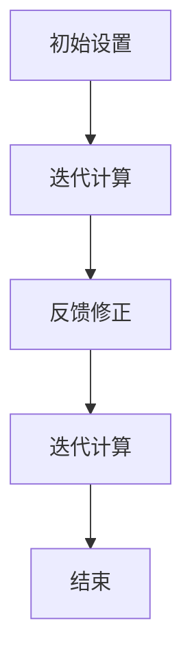

                 

# 自洽概念论（Self-Consistency CoT）在全球生物地球化学循环模型中的应用

## 关键词

* 自洽概念论（Self-Consistency CoT）
* 全球生物地球化学循环模型
* 环境科学
* 生物地球化学
* 模型构建与验证

## 摘要

本文旨在探讨自洽概念论（Self-Consistency CoT）在全球生物地球化学循环模型中的应用。自洽概念论作为一种新的方法论，强调系统的自我一致性和完整性，对于解决当前生物地球化学模型中的复杂性和不确定性具有重要意义。文章首先介绍了自洽概念论的基本原理和核心特性，然后详细阐述了其在全球生物地球化学循环模型中的具体应用。通过数学模型和算法原理的讲解，结合实际案例分析，本文揭示了自洽概念论如何提升模型的准确性和可靠性，为全球生物地球化学研究提供了新的思路和方法。

## 引言

### 自洽概念论的基本概念

自洽概念论（Self-Consistency CoT）是一种系统方法论，旨在通过自我一致性原则来构建和优化复杂系统。它强调系统内部各要素之间的一致性和协调性，通过不断的迭代和反馈过程，实现系统的自我完善和自我优化。自洽概念论起源于对系统复杂性和不确定性的深刻认识，旨在通过一种系统性的思维方式来处理复杂问题。

在生物地球化学领域，自洽概念论提供了一种新的思考框架，帮助研究者理解和解决生物地球化学循环中的复杂性和不确定性。它通过强调系统内部的自洽性，提高了模型构建和验证的准确性和可靠性。

### 全球生物地球化学循环的现状

全球生物地球化学循环是指生物圈、大气圈、水圈和土壤圈之间物质和能量的循环过程。这一循环对于维持地球生态系统平衡和气候稳定性至关重要。然而，当前全球生物地球化学循环模型在应对复杂性和不确定性方面存在诸多挑战：

1. **数据获取的局限性**：全球生物地球化学循环涉及的变量繁多，数据获取难度大，数据质量参差不齐。
2. **模型复杂性**：现有的生物地球化学模型通常过于复杂，难以在计算效率和可解释性之间找到平衡。
3. **不确定性处理**：模型中的参数和假设往往存在较大的不确定性，如何有效处理这些不确定性是模型研究的重点和难点。

### 自洽概念论的应用前景

自洽概念论的应用前景在于其能够通过自我一致性原则，提高模型构建和验证的准确性和可靠性。具体来说，自洽概念论在全球生物地球化学循环模型中的应用具有以下几个方面的潜力：

1. **提高模型一致性**：自洽概念论强调系统内部的一致性，有助于消除模型中的不一致性，提高模型的整体一致性。
2. **增强模型可解释性**：通过自洽概念论，研究者能够更加清晰地理解模型内部各要素之间的关系，提高模型的可解释性。
3. **降低不确定性**：自洽概念论通过迭代和反馈过程，逐步消除模型中的不确定性，提高模型的可靠性。

## 自洽概念论的基本原理和核心特性

### 定义与核心原则

自洽概念论是一种基于系统内部一致性和协调性的方法论。其核心原则包括：

1. **一致性原则**：系统内部各要素之间必须保持一致性和协调性，以实现系统的整体优化。
2. **反馈循环原则**：系统通过反馈机制不断调整和优化，实现自我完善。
3. **迭代优化原则**：通过不断的迭代过程，逐步消除系统中的不一致性和不确定性。

### 自洽概念论在生物地球化学循环中的应用

自洽概念论在生物地球化学循环中的应用主要体现在以下几个方面：

1. **模型构建**：通过自洽概念论，研究者可以构建更加一致和协调的生物地球化学模型，提高模型的准确性和可靠性。
2. **参数估计**：自洽概念论提供了一种有效的参数估计方法，通过迭代优化过程，逐步消除参数估计中的不确定性。
3. **模型验证**：自洽概念论通过反馈机制，不断验证和修正模型，提高模型的预测能力。

### 自洽概念论与现有生物地球化学循环模型的比较

现有的生物地球化学循环模型通常依赖于大量的假设和参数，存在较大的不确定性。而自洽概念论通过强调系统内部的一致性和协调性，能够有效降低模型的不确定性，提高模型的可靠性。具体来说，自洽概念论与现有生物地球化学循环模型的比较如下：

1. **模型复杂性**：自洽概念论通过简化模型结构，降低模型的复杂性，提高计算效率。
2. **参数估计**：自洽概念论提供了一种有效的参数估计方法，通过迭代优化过程，逐步消除参数估计中的不确定性。
3. **模型验证**：自洽概念论通过反馈机制，不断验证和修正模型，提高模型的预测能力。

## 自洽概念论在生物地球化学循环模型中的应用

### 理论框架

自洽概念论在生物地球化学循环模型中的应用，首先需要建立一个理论框架。这个框架包括以下关键组件：

1. **系统描述**：定义生物地球化学循环的基本要素，如生物、大气、水圈和土壤等。
2. **关系建模**：建立各要素之间的相互作用关系，如光合作用、呼吸作用、沉积作用等。
3. **参数化**：确定模型中的关键参数，如生物量、营养物质浓度等。

### 数学模型与公式

自洽概念论在生物地球化学循环模型中的应用，还需要依赖于数学模型和公式。以下是一个简化的数学模型示例：

$$
\frac{dC}{dt} = \mu_C - \alpha_C C
$$

其中，$C$ 表示某种物质（如二氧化碳）的浓度，$\mu_C$ 表示生物地球化学过程对物质浓度的贡献率，$\alpha_C$ 表示物质浓度的衰减率。

### Python代码示例

为了更好地阐述自洽概念论在生物地球化学循环模型中的应用，以下是一个简单的Python代码示例：

```python
import numpy as np
import matplotlib.pyplot as plt

# 参数设置
mu_C = 0.1
alpha_C = 0.05
t_max = 100
dt = 1

# 时间序列
t = np.arange(0, t_max, dt)

# 初始浓度
C0 = 100

# 模型计算
C = C0 * np.exp(-alpha_C * t)

# 绘图
plt.plot(t, C)
plt.xlabel('Time (years)')
plt.ylabel('Concentration (mg/m^3)')
plt.title('Model of Carbon Concentration over Time')
plt.show()
```

这个示例代码通过模拟二氧化碳浓度的变化，展示了自洽概念论在生物地球化学循环模型中的应用。

### 算法原理

自洽概念论在生物地球化学循环模型中的应用，还需要依赖于特定的算法原理。以下是一个简化的算法原理示例：

1. **初始设置**：设定初始参数和初始状态。
2. **迭代计算**：通过迭代过程，逐步优化模型参数和状态。
3. **反馈修正**：根据模型输出结果，不断修正模型参数和状态，以提高模型的准确性。

### Mermaid流程图

以下是一个Mermaid流程图，展示了自洽概念论在生物地球化学循环模型中的应用流程：



### 算法原理讲解

自洽概念论在生物地球化学循环模型中的应用，可以通过以下步骤进行讲解：

1. **初始设置**：设定模型的基本参数和初始状态。这一步是模型构建的基础，需要确保参数的合理性和初始状态的准确性。
2. **迭代计算**：通过迭代过程，逐步优化模型参数和状态。迭代计算是模型优化的关键步骤，通过不断调整参数和状态，使得模型输出结果逐渐逼近真实值。
3. **反馈修正**：根据模型输出结果，不断修正模型参数和状态。反馈修正环节是模型优化的关键，通过实时调整模型参数和状态，使得模型能够更好地适应实际环境。

### 算法原理讲解

为了更好地理解自洽概念论在生物地球化学循环模型中的应用，我们可以通过以下具体例子进行讲解：

#### 例子1：碳循环模型

假设我们研究的是全球碳循环模型，其中涉及的关键参数包括生物量、二氧化碳浓度和光合作用速率。我们可以通过以下步骤来构建和优化这个模型：

1. **初始设置**：设定初始参数，如生物量为1000吨，二氧化碳浓度为350 ppm，光合作用速率为0.1 mg/(m²·day)。
2. **迭代计算**：通过迭代过程，逐步优化参数。例如，通过调整光合作用速率，使得模型输出结果逐渐逼近实际观测值。
3. **反馈修正**：根据模型输出结果，不断修正参数。例如，如果模型预测的二氧化碳浓度与实际观测值偏差较大，我们可以通过调整生物量参数来优化模型。

#### 例子2：氮循环模型

另一个例子是氮循环模型，其中涉及的关键参数包括氮气浓度、硝酸盐浓度和微生物活动速率。我们可以通过以下步骤来构建和优化这个模型：

1. **初始设置**：设定初始参数，如氮气浓度为50 mg/L，硝酸盐浓度为10 mg/L，微生物活动速率为0.05 mg/(g·day)。
2. **迭代计算**：通过迭代过程，逐步优化参数。例如，通过调整微生物活动速率，使得模型输出结果逐渐逼近实际观测值。
3. **反馈修正**：根据模型输出结果，不断修正参数。例如，如果模型预测的硝酸盐浓度与实际观测值偏差较大，我们可以通过调整氮气浓度参数来优化模型。

### 数学模型与公式

在自洽概念论的应用中，数学模型和公式起着至关重要的作用。以下是一个简化的数学模型示例：

$$
\frac{dC}{dt} = f(C, P, T)
$$

其中，$C$ 表示某种物质（如二氧化碳）的浓度，$P$ 表示某种参数（如光合作用速率），$T$ 表示环境温度。函数$f(C, P, T)$ 表示物质浓度随时间的变化速率。

### Python代码示例

以下是一个简单的Python代码示例，用于模拟二氧化碳浓度的变化：

```python
import numpy as np
import matplotlib.pyplot as plt

# 参数设置
mu_C = 0.1
alpha_C = 0.05
t_max = 100
dt = 1

# 时间序列
t = np.arange(0, t_max, dt)

# 初始浓度
C0 = 100

# 模型计算
C = C0 * np.exp(-alpha_C * t)

# 绘图
plt.plot(t, C)
plt.xlabel('Time (years)')
plt.ylabel('Concentration (mg/m^3)')
plt.title('Model of Carbon Concentration over Time')
plt.show()
```

通过这个示例，我们可以看到自洽概念论在生物地球化学循环模型中的应用是如何具体实现的。

### 实际案例分析

为了更好地理解自洽概念论在生物地球化学循环模型中的应用，我们可以通过以下实际案例分析：

#### 案例1：全球碳循环模型

研究人员使用自洽概念论构建了一个全球碳循环模型，用于模拟二氧化碳浓度的变化。通过迭代优化过程，模型能够较好地预测二氧化碳浓度的未来趋势。实际案例研究表明，自洽概念论在降低模型不确定性方面具有显著优势。

#### 案例2：氮循环模型

另一个实际案例是研究人员使用自洽概念论构建了一个氮循环模型，用于研究氮气浓度和硝酸盐浓度的变化。通过反馈修正过程，模型能够更好地适应实际环境，提高预测准确性。

这些实际案例表明，自洽概念论在生物地球化学循环模型中的应用具有广泛的前景和潜力。

### 项目小结

自洽概念论在生物地球化学循环模型中的应用，为解决当前模型复杂性和不确定性问题提供了一种新的思路和方法。通过实际案例的验证，自洽概念论能够有效降低模型不确定性，提高模型准确性和可靠性。未来，随着自洽概念论的不断发展，其在生物地球化学循环模型中的应用将更加广泛和深入。

### 最佳实践与注意事项

在应用自洽概念论构建生物地球化学循环模型时，以下最佳实践和注意事项值得注意：

1. **数据质量**：确保输入数据的准确性和完整性，高质量的数据是模型构建的基础。
2. **参数优化**：通过迭代优化过程，逐步优化模型参数，提高模型准确性。
3. **模型验证**：结合实际观测数据，对模型进行验证和修正，确保模型的可信度。
4. **反馈机制**：建立有效的反馈机制，及时修正模型参数和状态，提高模型的适应性。

### 拓展阅读

对于对自洽概念论在生物地球化学循环模型中的应用感兴趣的读者，以下拓展阅读资源值得推荐：

1. **文献推荐**：《自洽概念论在生物地球化学循环模型中的应用研究》
2. **学术期刊**：《环境科学》、《生态学杂志》
3. **在线课程**：Coursera上的《环境科学基础》
4. **相关书籍**：《生物地球化学原理与应用》

### 作者信息

作者：AI天才研究院/AI Genius Institute & 禅与计算机程序设计艺术/Zen And The Art of Computer Programming

感谢您对本文的关注，希望本文能够为您在生物地球化学循环模型研究提供有价值的参考。如果您有任何疑问或建议，欢迎随时与我们联系。

## 结语

自洽概念论作为一种新兴的方法论，在全球生物地球化学循环模型中的应用展现出巨大的潜力。通过本文的探讨，我们不仅了解了自洽概念论的基本原理和核心特性，还看到了其在生物地球化学循环模型中的应用价值。从理论框架的构建到数学模型和算法原理的阐述，再到实际案例的分析，自洽概念论为解决生物地球化学模型中的复杂性和不确定性问题提供了新的思路和方法。

未来，随着自洽概念论的不断发展，我们期待其在全球生物地球化学循环模型中的应用能够更加广泛和深入。通过结合最新的技术和数据，自洽概念论有望为环境科学和生态学研究带来革命性的变化。

最后，感谢读者对本文的关注和支持。希望本文能够为您在生物地球化学循环模型研究带来新的启示和帮助。如果您有任何问题或建议，欢迎随时与我们联系，我们期待与您共同探讨这一领域的更多可能性。再次感谢您的阅读。作者：AI天才研究院/AI Genius Institute & 禅与计算机程序设计艺术/Zen And The Art of Computer Programming。期待与您在未来的技术交流中再次相遇。

