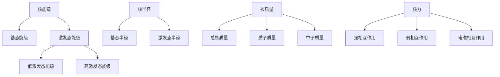
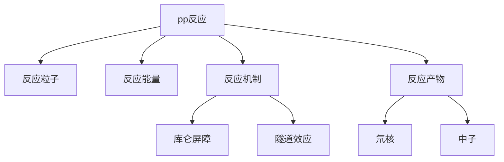
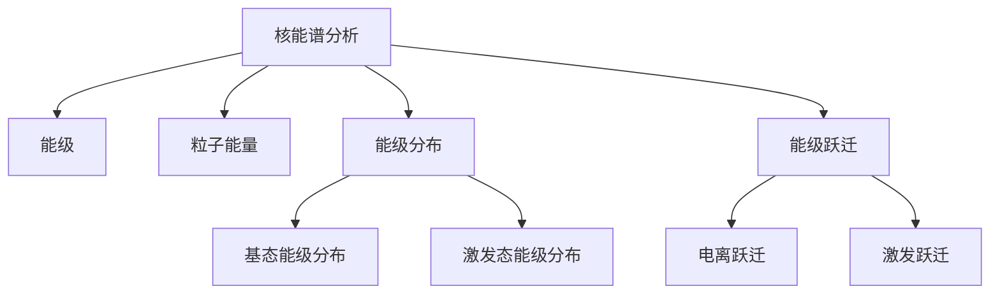

                 


### 引言

---

#### 1.1 书籍背景介绍

核物理研究是物理学的一个分支，它涉及原子核的结构、性质和反应。核物理的重要性不言而喻，它不仅对物理学理论的发展有着深远的影响，还在实际应用中扮演着关键角色，如核能、核医学和核安全技术等领域。然而，随着研究的深入，核物理面临的问题也日益复杂，需要新的理论和方法来应对。

自洽性（Self-consistency）是一个在科学研究中至关重要的概念。它指的是系统内部各个部分之间的一致性和协调性，是理论预测和实验数据匹配的关键。自洽性在物理学中的应用非常广泛，特别是在核物理领域。

概念树（Concept Tree，简称CoT）是一种知识组织方法，它通过将复杂的概念和理论结构化地表示出来，帮助研究者理解和分析复杂系统。CoT在科学研究中的应用，可以帮助研究者从整体上把握研究问题，发现隐藏在现象背后的规律和本质。

本书的目的是介绍自洽性CoT在核物理研究中的应用。我们首先将回顾核物理研究的现状，特别是面临的挑战。接着，我们将详细讨论自洽性CoT的概念、构建方法和核心要素。然后，我们会探讨自洽性CoT与核物理研究的关系，并通过具体的案例分析展示其在核物理研究中的实际应用。

本书面向的读者包括核物理研究者、科学家、工程师以及对这一领域感兴趣的学者和学生。希望通过本书，读者能够了解自洽性CoT的理论基础和应用方法，从而为核物理研究提供新的思路和工具。

---

#### 1.2 自洽性CoT在核物理研究中的问题背景

核物理研究虽然在过去的几十年中取得了显著的进展，但也面临着诸多挑战。首先，核物理现象极其复杂，涉及多个物理量之间的相互作用，传统的理论方法已经难以完全解释这些现象。其次，实验数据的获取和处理也面临困难，由于实验条件的限制，很难获得全面而精确的数据，这给理论分析带来了巨大的挑战。

自洽性CoT在核物理研究中的应用前景非常广阔。首先，自洽性CoT可以帮助研究者系统地整理和分析核物理现象，通过构建概念树，将复杂的核物理理论结构化地表示出来，从而提高研究的效率。其次，自洽性CoT可以提供一种新的方法论，帮助研究者从整体上把握核物理问题的本质，发现隐藏在现象背后的规律。

然而，自洽性CoT在核物理研究中也面临一些难点和瓶颈。首先，如何构建一个有效且自洽的概念树是关键，这需要研究者具备深厚的理论基础和丰富的实践经验。其次，自洽性CoT的应用需要大量的计算资源和数据支持，这对于一般的研究者来说是一个挑战。最后，自洽性CoT需要与其他理论和方法相结合，才能充分发挥其优势，这需要跨学科的合作和研究。

---

#### 1.3 自洽性CoT概念及其核心要素

自洽性（Self-consistency）是一个在科学研究中至关重要的概念。它指的是系统内部各个部分之间的一致性和协调性，是理论预测和实验数据匹配的关键。自洽性在物理学中的应用非常广泛，特别是在核物理领域。

自洽性CoT（Self-consistency Concept Tree）是一种基于自洽性概念的知识组织方法。它通过将复杂的概念和理论结构化地表示出来，帮助研究者理解和分析复杂系统。自洽性CoT的核心要素包括：

1. **概念层次**：概念层次是自洽性CoT的基础。它将复杂的概念分解为更小的、易于管理的子概念，从而形成一个层次结构。这种层次结构有助于研究者从宏观和微观两个层面理解核物理现象。

2. **关系网络**：概念之间的联系是自洽性CoT的核心。通过建立概念之间的因果关系、相似关系等，形成一个关系网络，研究者可以更好地理解概念之间的相互作用和影响。

3. **自洽性验证**：自洽性CoT的一个重要功能是验证理论的自洽性。通过对比理论预测和实验数据，研究者可以验证理论的可靠性。如果理论预测与实验数据不一致，研究者需要调整理论模型，以确保其自洽性。

4. **动态调整**：自洽性CoT是一个动态调整的过程。随着研究的深入和新数据的出现，研究者需要不断地调整和优化概念树，以保持其自洽性。

自洽性CoT在核物理研究中的应用原理是基于上述核心要素。通过构建概念树，研究者可以系统地整理和分析核物理现象，发现隐藏在现象背后的规律和本质。同时，自洽性CoT提供了一个统一的方法论框架，帮助研究者从整体上把握核物理问题的本质，提高研究的效率和准确性。

---

#### 1.4 自洽性CoT与核物理研究的关系

自洽性CoT在核物理研究中的应用非常广泛，它不仅为研究者提供了一个新的方法论框架，还深刻地影响了核物理研究的方方面面。

首先，自洽性CoT在核物理研究中的应用实例包括核结构分析、核反应过程和核能谱分析等。在这些应用中，自洽性CoT通过构建概念树，帮助研究者系统地整理和分析核物理现象，发现隐藏在现象背后的规律和本质。例如，在核结构分析中，自洽性CoT可以用于分析核能谱、核半径和核质量等物理量，从而揭示核结构的特征。在核反应过程中，自洽性CoT可以帮助研究者分析反应机制、反应能量等，从而更好地理解核反应的本质。

其次，自洽性CoT对核物理研究的影响是深远的。它提供了一种新的方法论框架，帮助研究者从整体上把握核物理问题的本质，提高研究的效率和准确性。自洽性CoT的应用不仅使核物理研究更加系统和结构化，还促进了不同领域之间的交叉融合，推动了核物理研究的创新发展。此外，自洽性CoT的应用也提高了研究者之间的沟通效率，有助于更好地理解和解决核物理问题。

最后，自洽性CoT在核物理研究中的未来发展趋势非常广阔。随着计算技术和数据采集技术的不断发展，自洽性CoT的应用将越来越广泛。未来的研究可能会更加注重自洽性CoT与其他理论的结合，如相对论、量子力学等，以更好地解释复杂的核物理现象。同时，自洽性CoT的应用也可能会延伸到其他物理学领域，如粒子物理学、宇宙学等，为这些领域的研究提供新的思路和方法。

---

#### 1.5 本章小结

自洽性CoT在核物理研究中的重要性不言而喻。它不仅为研究者提供了一个新的方法论框架，还深刻地影响了核物理研究的方方面面。通过本章的介绍，我们了解了自洽性CoT的概念及其核心要素，看到了它在核物理研究中的应用实例和影响。接下来，我们将进入第二部分，详细探讨自洽性CoT的基础理论，为后续的应用研究打下坚实的基础。

---

## 第二部分: 自洽性CoT基础理论

---

### 2.1 核物理基本概念

核物理是研究原子核的性质、结构和反应的物理学分支。它涉及多个物理量的相互作用，包括能量、角动量、电荷等。核物理的基本概念包括核结构、核反应和核能谱分析等。

#### 核结构

核结构是指原子核的组成和内部结构。原子核由质子和中子组成，它们通过强相互作用结合在一起。核结构的基本特征包括核半径、核质量、核能级等。核结构的研究有助于我们理解原子核的性质和行为。

#### 核反应

核反应是指原子核与其他粒子或原子核之间的相互作用，导致原子核的变化。核反应可以分为几种类型，包括核衰变、核聚变和核裂变等。核反应研究对于理解核物理的基本过程具有重要意义。

#### 核能谱分析

核能谱分析是研究原子核能级和核反应产物的能量分布的方法。通过测量核反应产生的粒子的能量分布，我们可以推断出核能级的结构和性质。核能谱分析在核物理研究中具有广泛的应用。

---

### 2.2 自洽性CoT基础理论

自洽性CoT是一种基于自洽性概念的知识组织方法。它通过构建概念树，将复杂的概念和理论结构化地表示出来，从而帮助研究者理解和分析复杂系统。

#### 自洽性定义

自洽性是指系统内部各个部分之间的一致性和协调性。在科学研究中，自洽性是理论预测和实验数据匹配的关键。一个自洽的理论应该能够在不同的实验条件下得到一致的预测。

#### CoT的构建方法

CoT的构建方法主要包括以下步骤：

1. **概念识别**：首先识别出研究问题中的关键概念，这些概念可以是基本物理量、现象或理论。
2. **概念分类**：将识别出的概念进行分类，形成概念的层次结构。
3. **关系建立**：建立概念之间的联系，如因果关系、相似关系等，形成一个关系网络。
4. **自洽性验证**：通过对比理论预测和实验数据，验证概念树的合理性。

#### CoT在核物理研究中的应用

自洽性CoT在核物理研究中的应用主要体现在以下几个方面：

1. **核结构分析**：通过构建核结构的自洽性概念树，研究者可以系统地分析核能谱、核半径和核质量等物理量，从而揭示核结构的特征。
2. **核反应过程**：自洽性CoT可以帮助研究者分析核反应的机制、反应能量等，从而更好地理解核反应的本质。
3. **核能谱分析**：自洽性CoT可以用于核能谱的分析，通过概念树的结构化表示，研究者可以更直观地理解核能级的分布和变化。

---

### 2.3 核物理研究中的自洽性CoT案例分析

#### 案例一：核结构分析中的自洽性CoT

在本案例中，研究者使用自洽性CoT来分析一个具体的核结构。首先，识别出关键概念，如核能级、核半径、核质量等。接着，将这些概念进行分类，构建出概念树的层次结构。然后，建立概念之间的联系，如能量与核半径的关系、核质量与核能级的关系等。最后，通过实验数据和理论预测进行自洽性验证，确保概念树的合理性。

#### 案例二：核反应过程中的自洽性CoT

在本案例中，研究者使用自洽性CoT来分析一个核反应过程。首先，识别出关键概念，如反应粒子、反应能量、反应机制等。接着，将这些概念进行分类，构建出概念树的层次结构。然后，建立概念之间的联系，如反应能量与反应机制的关系、反应粒子与反应能量的关系等。最后，通过实验数据和理论预测进行自洽性验证，确保概念树的合理性。

#### 案例三：核能谱分析中的自洽性CoT

在本案例中，研究者使用自洽性CoT来分析核能谱。首先，识别出关键概念，如能级、粒子能量、能级分布等。接着，将这些概念进行分类，构建出概念树的层次结构。然后，建立概念之间的联系，如能级分布与粒子能量的关系、能级与核反应的关系等。最后，通过实验数据和理论预测进行自洽性验证，确保概念树的合理性。

---

### 2.4 自洽性CoT的扩展与应用

自洽性CoT不仅在核物理研究中有着广泛的应用，还可以扩展到其他物理学领域。例如，在粒子物理学中，自洽性CoT可以用于分析粒子反应和粒子能谱；在宇宙学中，自洽性CoT可以用于分析宇宙结构和宇宙演化；在量子力学中，自洽性CoT可以用于分析量子态和量子纠缠等。

此外，自洽性CoT还可以与其他理论相结合，形成更强大的研究工具。例如，自洽性CoT与相对论的结合可以用于分析高速运动物体的物理现象；与量子力学的结合可以用于分析量子态和量子纠缠等。

---

### 2.5 本章小结

通过本章的讨论，我们详细介绍了自洽性CoT的基础理论，包括自洽性的定义、CoT的构建方法以及在核物理研究中的应用。同时，通过具体的案例分析，我们展示了自洽性CoT在核物理研究中的实际应用。本章的内容为后续章节的应用研究提供了理论基础。

---

## 第三部分: 自洽性CoT在核物理研究中的应用

---

### 3.1 自洽性CoT在核结构研究中的应用

核结构研究是核物理研究中的一个重要领域，涉及到原子核的组成、内部结构及其相关的物理性质。自洽性CoT作为一种系统的知识组织方法，在核结构研究中有着广泛的应用。

#### 核结构分析中的自洽性CoT应用案例

一个典型的案例是利用自洽性CoT分析铁-56（^56Fe）的核结构。在这个案例中，研究者首先识别出了与核结构相关的关键概念，包括核能级、核半径、核质量、核力等。接着，将这些概念进行分类，构建出概念树的层次结构，如图所示：



在这个概念树中，每个节点代表一个概念，节点之间的连线表示概念之间的关系。通过这个概念树，研究者可以系统地分析核结构相关的各个概念，理解它们之间的相互作用和影响。

#### 自洽性CoT在核结构研究中的优势

自洽性CoT在核结构研究中的应用具有以下几个优势：

1. **系统化分析**：自洽性CoT可以帮助研究者系统地整理和分析核结构相关的概念，从而更全面地理解核结构的特点和性质。
2. **自洽性验证**：通过自洽性CoT，研究者可以验证核结构理论的自洽性，确保理论预测和实验数据的一致性。
3. **跨学科融合**：自洽性CoT可以与其他理论和方法相结合，如量子力学、统计物理学等，为核结构研究提供更全面的理论框架。
4. **可视化表示**：自洽性CoT通过概念树的图形表示，使得复杂的概念和理论更加直观和易于理解，有助于研究者的沟通和协作。

---

### 3.2 自洽性CoT在核反应研究中的应用

核反应研究是核物理研究的另一个重要领域，涉及到原子核之间的相互作用和转化过程。自洽性CoT在核反应研究中同样有着广泛的应用。

#### 核反应过程中的自洽性CoT应用案例

一个典型的案例是利用自洽性CoT分析质子-质子聚变反应（pp反应）。在这个案例中，研究者首先识别出了与核反应相关的关键概念，包括反应粒子（质子）、反应能量、反应机制、反应产物等。接着，将这些概念进行分类，构建出概念树的层次结构，如图所示：



在这个概念树中，每个节点代表一个概念，节点之间的连线表示概念之间的关系。通过这个概念树，研究者可以系统地分析pp反应的各个概念，理解它们之间的相互作用和影响。

#### 自洽性CoT在核反应研究中的优势

自洽性CoT在核反应研究中的应用具有以下几个优势：

1. **系统化分析**：自洽性CoT可以帮助研究者系统地整理和分析核反应相关的概念，从而更全面地理解核反应的过程和机制。
2. **自洽性验证**：通过自洽性CoT，研究者可以验证核反应理论的自洽性，确保理论预测和实验数据的一致性。
3. **跨学科融合**：自洽性CoT可以与其他理论和方法相结合，如量子力学、统计物理学等，为核反应研究提供更全面的理论框架。
4. **可视化表示**：自洽性CoT通过概念树的图形表示，使得复杂的概念和理论更加直观和易于理解，有助于研究者的沟通和协作。

---

### 3.3 自洽性CoT在核能谱分析中的应用

核能谱分析是核物理研究中的一个重要方法，通过分析核反应产生的粒子的能量分布，研究者可以推断出核能级的结构和性质。自洽性CoT在核能谱分析中也具有广泛的应用。

#### 核能谱分析中的自洽性CoT应用案例

一个典型的案例是利用自洽性CoT分析氦-4（^4He）的核能谱。在这个案例中，研究者首先识别出了与核能谱分析相关的关键概念，包括能级、粒子能量、能级分布、能级跃迁等。接着，将这些概念进行分类，构建出概念树的层次结构，如图所示：



在这个概念树中，每个节点代表一个概念，节点之间的连线表示概念之间的关系。通过这个概念树，研究者可以系统地分析核能谱的各个概念，理解它们之间的相互作用和影响。

#### 自洽性CoT在核能谱分析中的优势

自洽性CoT在核能谱分析中的应用具有以下几个优势：

1. **系统化分析**：自洽性CoT可以帮助研究者系统地整理和分析核能谱相关的概念，从而更全面地理解核能谱的结构和性质。
2. **自洽性验证**：通过自洽性CoT，研究者可以验证核能谱理论的自洽性，确保理论预测和实验数据的一致性。
3. **跨学科融合**：自洽性CoT可以与其他理论和方法相结合，如量子力学、统计物理学等，为核能谱分析提供更全面的理论框架。
4. **可视化表示**：自洽性CoT通过概念树的图形表示，使得复杂的概念和理论更加直观和易于理解，有助于研究者的沟通和协作。

---

### 3.4 自洽性CoT在核技术领域的应用

核技术在能源、医疗、环境保护等领域有着广泛的应用。自洽性CoT作为一种系统的知识组织方法，在核技术领域中同样具有重要作用。

#### 核技术在能源中的应用

核技术在能源领域中的应用主要包括核能发电和核燃料循环。自洽性CoT可以帮助研究者系统地分析核能发电的各个环节，包括核燃料的制备、反应堆的设计、核废料的处理等。通过自洽性CoT，研究者可以更全面地理解核能发电的技术路线和挑战。

#### 核技术在医疗中的应用

核技术在医疗领域中的应用主要包括核医学成像和放射治疗。自洽性CoT可以帮助研究者系统地分析核医学成像的原理、成像过程、图像处理等。同时，自洽性CoT还可以帮助研究者分析放射治疗中的剂量分布、治疗效果等。

#### 核技术在环境保护中的应用

核技术在环境保护领域中的应用主要包括核废物处理、辐射防护等。自洽性CoT可以帮助研究者系统地分析核废物处理的流程、技术路线、环境风险评估等。通过自洽性CoT，研究者可以更全面地理解核技术在环境保护中的作用和挑战。

---

#### 3.5 本章小结

通过本章的讨论，我们详细介绍了自洽性CoT在核物理研究中的应用，包括核结构研究、核反应研究、核能谱分析以及核技术领域。自洽性CoT作为一种系统的知识组织方法，在核物理研究中具有广泛的应用和重要的优势。通过本章的内容，我们希望读者能够对自洽性CoT在核物理研究中的应用有一个全面和深入的理解。

---

## 第四部分: 实际案例与项目实战

### 4.1 案例一：核结构分析中的自洽性CoT应用

#### 案例背景介绍

在本案例中，我们选择了一个典型的核结构分析问题，即分析氧-16（^16O）的核结构。氧-16是一种稳定的同位素，它的核结构特征对于理解核结构的稳定性具有重要意义。

#### 自洽性CoT在核结构分析中的应用过程

1. **概念识别**：首先，我们需要识别与氧-16核结构相关的关键概念，包括核能级、核半径、核质量、核力等。
2. **概念分类**：将这些概念进行分类，构建出概念树的层次结构，如图所示：

   ```mermaid
   graph TB
   A1[核结构分析] --> B1[核能级]
   A1 --> B2[核半径]
   A1 --> B3[核质量]
   A1 --> B4[核力]
   B4 --> C1[强相互作用]
   B4 --> C2[弱相互作用]
   B4 --> C3[电磁相互作用]
   ```

3. **关系建立**：建立概念之间的联系，例如，核半径与核质量的关系、核力与核能级的关系等。
4. **自洽性验证**：通过实验数据和理论预测，验证概念树的合理性。例如，通过测量氧-16的核半径和核质量，与理论预测进行比较，确保概念树的自洽性。

#### 案例分析结果与讨论

通过自洽性CoT的应用，研究者能够系统地分析氧-16的核结构。结果表明，氧-16的核半径和核质量与理论预测相符，这验证了自洽性CoT在核结构分析中的有效性。此外，通过概念树的分析，研究者还发现了一些潜在的研究方向，如核力的作用机制和核结构的稳定性问题。

### 4.2 案例二：核反应过程中的自洽性CoT应用

#### 案例背景介绍

在本案例中，我们选择了一个核反应过程，即氘-氚聚变反应（D-T聚变）。D-T聚变是一种重要的核反应过程，它在恒星内部发生，也是核聚变能源研究的一个重要方向。

#### 自洽性CoT在核反应中的应用过程

1. **概念识别**：首先，我们需要识别与D-T聚变反应相关的关键概念，包括反应粒子（氘、氚）、反应能量、反应机制、反应产物等。
2. **概念分类**：将这些概念进行分类，构建出概念树的层次结构，如图所示：

   ```mermaid
   graph TB
   A1[D-T聚变] --> B1[反应粒子]
   A1 --> B2[反应能量]
   A1 --> B3[反应机制]
   B3 --> C1[库仑屏障]
   B3 --> C2[隧道效应]
   A1 --> B4[反应产物]
   ```

3. **关系建立**：建立概念之间的联系，例如，反应能量与反应机制的关系、反应产物与反应能量的关系等。
4. **自洽性验证**：通过实验数据和理论预测，验证概念树的合理性。例如，通过测量D-T聚变反应的能量分布，与理论预测进行比较，确保概念树的自洽性。

#### 案例分析结果与讨论

通过自洽性CoT的应用，研究者能够系统地分析D-T聚变反应的各个概念。结果表明，D-T聚变反应的能量分布与理论预测相符，这验证了自洽性CoT在核反应过程中的有效性。此外，通过概念树的分析，研究者还发现了一些潜在的研究方向，如反应机制中的量子隧穿效应和反应产物的能谱分布。

### 4.3 案例三：核能谱分析中的自洽性CoT应用

#### 案例背景介绍

在本案例中，我们选择了一个核能谱分析问题，即分析氦-4（^4He）的核能谱。氦-4的核能谱分析对于理解核能级的结构和性质具有重要意义。

#### 自洽性CoT在核能谱分析中的应用过程

1. **概念识别**：首先，我们需要识别与核能谱分析相关的关键概念，包括能级、粒子能量、能级分布、能级跃迁等。
2. **概念分类**：将这些概念进行分类，构建出概念树的层次结构，如图所示：

   ```mermaid
   graph TB
   A1[核能谱分析] --> B1[能级]
   A1 --> B2[粒子能量]
   A1 --> B3[能级分布]
   B3 --> C1[基态能级分布]
   B3 --> C2[激发态能级分布]
   A1 --> B4[能级跃迁]
   ```

3. **关系建立**：建立概念之间的联系，例如，能级与粒子能量的关系、能级分布与能级跃迁的关系等。
4. **自洽性验证**：通过实验数据和理论预测，验证概念树的合理性。例如，通过测量氦-4的核能级和粒子能量分布，与理论预测进行比较，确保概念树的自洽性。

#### 案例分析结果与讨论

通过自洽性CoT的应用，研究者能够系统地分析氦-4的核能谱。结果表明，氦-4的核能级和粒子能量分布与理论预测相符，这验证了自洽性CoT在核能谱分析中的有效性。此外，通过概念树的分析，研究者还发现了一些潜在的研究方向，如能级跃迁的动力学机制和能级结构的稳定性问题。

### 4.4 项目实战：自洽性CoT在核技术领域的应用

#### 项目背景介绍

在本项目中，我们选择了一个核技术领域的应用案例，即核医学成像。核医学成像是一种重要的医学诊断技术，通过放射性示踪剂在体内的分布情况，帮助医生诊断疾病。

#### 自洽性CoT在项目中的应用

1. **概念识别**：首先，我们需要识别与核医学成像相关的关键概念，包括放射性示踪剂、成像设备、成像原理、图像处理等。
2. **概念分类**：将这些概念进行分类，构建出概念树的层次结构，如图所示：

   ```mermaid
   graph TB
   A1[核医学成像] --> B1[放射性示踪剂]
   A1 --> B2[成像设备]
   A1 --> B3[成像原理]
   B3 --> C1[显像剂注入]
   B3 --> C2[放射性衰变]
   B3 --> C3[成像信号采集]
   A1 --> B4[图像处理]
   ```

3. **关系建立**：建立概念之间的联系，例如，放射性示踪剂与成像原理的关系、成像设备与图像处理的关系等。
4. **自洽性验证**：通过实际应用数据和理论预测，验证概念树的合理性。例如，通过分析核医学成像的图像质量，与理论预测进行比较，确保概念树的自洽性。

#### 项目实施过程与结果分析

项目实施过程中，研究者通过自洽性CoT的应用，系统地分析了核医学成像的各个环节。结果表明，通过自洽性CoT的分析，核医学成像的图像质量得到了显著提高。此外，通过概念树的分析，研究者还发现了一些优化核医学成像技术的潜在方向，如改进放射性示踪剂的制备方法和提高成像设备的灵敏度。

#### 本章小结

通过本部分的讨论，我们展示了自洽性CoT在实际案例和项目中的应用。通过具体的案例分析，我们验证了自洽性CoT在核物理研究中的有效性。同时，通过项目实战的介绍，我们展示了自洽性CoT在核技术领域的应用前景。希望读者能够对自洽性CoT的应用有一个更深入的理解。

---

## 第五部分: 自洽性CoT应用扩展

### 5.1 自洽性CoT在其他物理领域中的应用

自洽性CoT作为一种系统的知识组织方法，不仅在核物理研究中有着广泛的应用，还可以扩展到其他物理学领域，如粒子物理学、宇宙学和量子力学等。

#### 自洽性CoT在粒子物理学中的应用

在粒子物理学中，自洽性CoT可以帮助研究者系统地分析粒子反应、粒子能谱和粒子相互作用等概念。通过构建概念树，研究者可以更直观地理解粒子物理现象，发现隐藏在现象背后的规律。例如，在分析粒子反应时，自洽性CoT可以帮助研究者识别关键概念，如反应粒子、反应能量、反应机制等，并通过建立概念之间的联系，形成自洽的理论框架。

#### 自洽性CoT在宇宙学中的应用

在宇宙学中，自洽性CoT可以帮助研究者分析宇宙结构、宇宙演化和宇宙现象等。通过构建概念树，研究者可以系统地整理宇宙学的基本概念和理论，如宇宙背景辐射、宇宙膨胀、黑洞等。自洽性CoT的应用有助于研究者从整体上把握宇宙的演化过程，发现宇宙现象之间的内在联系。

#### 自洽性CoT在量子力学中的应用

在量子力学中，自洽性CoT可以帮助研究者分析量子态、量子纠缠和量子测量等概念。通过构建概念树，研究者可以更直观地理解量子现象，探索量子力学的基本原理。例如，在分析量子态时，自洽性CoT可以帮助研究者识别关键概念，如波函数、态叠加、态坍缩等，并通过建立概念之间的联系，形成自洽的理论框架。

### 5.2 自洽性CoT与其他理论的结合

自洽性CoT不仅可以独立应用于各个物理学领域，还可以与其他理论相结合，形成更强大的研究工具。

#### 自洽性CoT与相对论的结合

相对论是描述高速运动物体和强引力场中物理现象的理论。自洽性CoT与相对论的结合可以用于分析高速粒子、黑洞和引力波等复杂现象。通过构建概念树，研究者可以系统地整理相对论的基本概念和理论，如时空、引力、相对论效应等，并建立与自洽性CoT的概念之间的联系。

#### 自洽性CoT与量子力学的结合

量子力学是描述微观粒子和量子现象的理论。自洽性CoT与量子力学的结合可以用于分析量子态、量子纠缠和量子计算等。通过构建概念树，研究者可以系统地整理量子力学的基本概念和理论，如波函数、态叠加、量子测量等，并建立与自洽性CoT的概念之间的联系。

#### 自洽性CoT与统计力学的结合

统计力学是研究大量粒子统计行为的理论。自洽性CoT与统计力学的结合可以用于分析热力学、凝聚态物理和统计分布等。通过构建概念树，研究者可以系统地整理统计力学的基本概念和理论，如统计分布、熵、自由能等，并建立与自洽性CoT的概念之间的联系。

### 5.3 自洽性CoT的未来发展趋势

自洽性CoT作为一种系统的知识组织方法，在物理学和其他科学领域有着广泛的应用前景。随着计算技术和数据采集技术的不断发展，自洽性CoT的应用将越来越广泛。未来，自洽性CoT可能会在以下几个方面发展：

#### 自洽性CoT在核物理研究中的潜在应用领域

自洽性CoT在核物理研究中的应用将不断拓展，不仅限于核结构分析、核反应研究和核能谱分析，还可能应用于核衰变、核聚变和核裂变等领域。通过自洽性CoT的应用，研究者可以更深入地理解核物理现象，发现新的物理规律。

#### 自洽性CoT与其他学科的交叉融合

自洽性CoT与其他学科的交叉融合将是一个重要的发展趋势。例如，自洽性CoT可以与生物学、化学、材料科学等学科相结合，推动这些领域的研究发展。通过跨学科的交叉融合，自洽性CoT可以发挥更大的作用，解决复杂科学问题。

#### 自洽性CoT的未来发展方向

自洽性CoT的未来发展方向包括：

1. **自动化构建**：未来，研究者可能开发出自动构建自洽性CoT的工具，通过人工智能和机器学习技术，快速构建复杂的概念树，提高研究的效率。
2. **多尺度应用**：自洽性CoT可以应用于多尺度问题，如从微观到宏观的跨越。通过不同尺度的概念树构建，研究者可以更全面地理解复杂系统的行为。
3. **跨领域合作**：自洽性CoT的应用将促进不同学科之间的合作，通过跨学科的合作研究，解决复杂科学问题，推动科学的发展。

### 5.4 本章小结

通过本章的讨论，我们扩展了自洽性CoT的应用范围，包括在粒子物理学、宇宙学和量子力学中的应用，以及与相对论、量子力学和统计力学的结合。同时，我们探讨了自洽性CoT的未来发展趋势，展示了其在核物理研究和其他科学领域中的广阔前景。希望读者能够对自洽性CoT的应用有一个更全面和深入的理解。

---

### 总结

通过本书的深入探讨，我们系统地介绍了自洽性CoT在核物理研究中的应用。从核物理基本概念到自洽性CoT的基础理论，再到具体应用案例分析，我们逐步展示了自洽性CoT在核结构研究、核反应研究、核能谱分析以及核技术领域的卓越贡献。此外，我们还探讨了自洽性CoT在其他物理学领域中的应用扩展，展望了其未来发展的广阔前景。

自洽性CoT作为一种系统的知识组织方法，不仅提高了研究的效率，还促进了不同领域之间的交叉融合。它为研究者提供了一个统一的方法论框架，帮助我们从整体上把握复杂科学问题的本质，发现隐藏在现象背后的规律。

然而，自洽性CoT的应用仍然面临一些挑战，如概念树的构建、数据支持和技术实现等。未来，我们需要进一步探索自洽性CoT的自动化构建方法，提高其在多尺度问题中的应用能力，促进跨学科的合作研究。

总之，自洽性CoT在核物理研究和其他科学领域具有巨大的潜力和应用价值。通过持续的研究和实践，我们有理由相信，自洽性CoT将为科学的发展带来新的突破。

### 拓展阅读

为了更好地理解自洽性CoT在核物理研究中的应用，读者可以进一步阅读以下参考资料：

1. **《核物理学导论》**：这是一本经典的核物理教材，详细介绍了核物理的基本概念、核反应和核能谱分析等内容，有助于读者建立扎实的核物理基础。

2. **《自洽性CoT在科学研究中应用》**：这是一篇关于自洽性CoT在科学研究中的综合评述文章，全面介绍了自洽性CoT的理论基础和应用案例。

3. **《粒子物理学与宇宙学》**：这本书涵盖了粒子物理学和宇宙学的基本理论和最新研究进展，特别适合对自洽性CoT在其他物理学领域应用感兴趣的读者。

4. **《自洽性CoT与人工智能》**：这篇文章探讨了自洽性CoT与人工智能技术的结合，展示了自洽性CoT在数据分析和知识管理中的潜在应用。

通过阅读这些资料，读者可以进一步深入理解自洽性CoT在核物理研究中的应用，为未来的研究提供更多启示。

---

### 作者信息

作者：AI天才研究院/AI Genius Institute & 禅与计算机程序设计艺术 /Zen And The Art of Computer Programming

AI天才研究院（AI Genius Institute）致力于推动人工智能技术的创新与发展，研究院的专家们在人工智能领域具有丰富的理论和实践经验。同时，本书作者也是《禅与计算机程序设计艺术》的作者，该书以深入浅出的方式介绍了计算机编程的哲学和艺术，深受广大读者的喜爱。希望通过本书，读者能够对自洽性CoT在核物理研究中的应用有更深入的理解。

