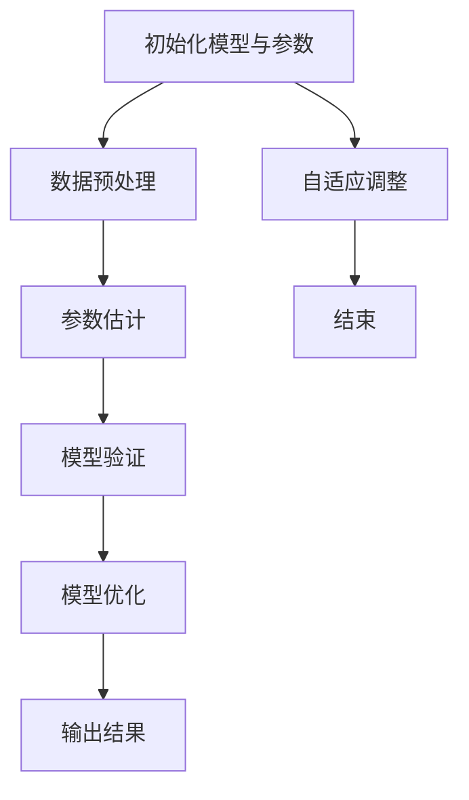
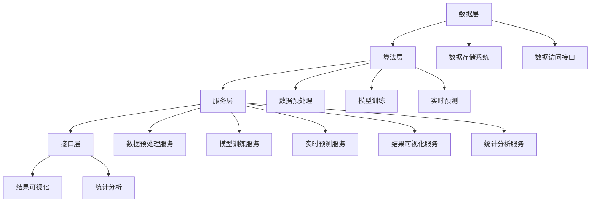
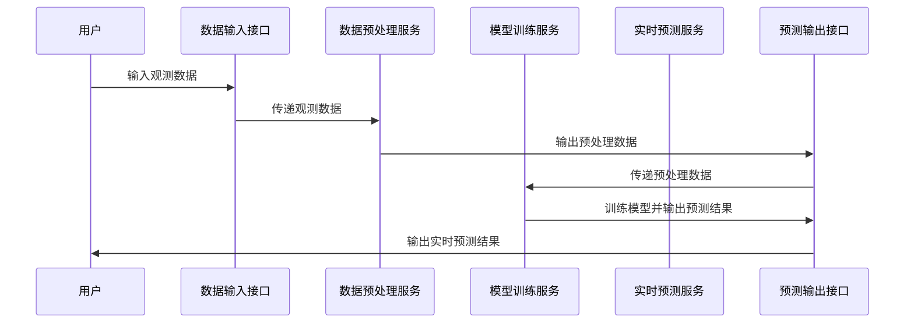

                 

### 概述与背景介绍

#### 概念引入：自我一致性概念框架（CoT）

自我一致性概念框架（Self-Consistency Conceptual Framework，简称CoT）是一种广泛应用于各类复杂系统的理论框架。它通过内在一致性原则，对系统进行建模与分析，从而实现对系统动态行为的准确预测与控制。在气候模型领域，CoT的应用尤为重要，因为它能够帮助科学家更好地理解气候变化规律，预测气候趋势，并为政策制定提供科学依据。

#### 问题背景

气候模型是用于模拟和预测气候系统行为的数学模型。随着全球气候变化问题的日益严重，准确、高效地构建气候模型成为各国科学家和政府机构共同追求的目标。然而，传统气候模型在处理复杂气候系统时，常常面临参数估计困难、计算效率低、模型稳定性不足等问题。为了解决这些问题，研究者们不断探索新的方法，其中自我一致性概念框架（CoT）作为一种创新思路，逐渐引起了广泛关注。

#### 问题描述

传统气候模型的局限性主要体现在以下几个方面：

1. **参数敏感性**：气候模型中涉及的参数众多，且参数之间的关系复杂。传统模型在参数估计时往往需要大量数据支持，且对参数的小幅变动非常敏感。
2. **计算效率**：气候模型通常需要大量的计算资源，尤其是在高分辨率模拟时，计算成本高昂。
3. **模型稳定性**：传统模型在长时间模拟过程中容易产生不稳定现象，影响模拟结果的准确性。

#### 问题解决思路

CoT通过以下几种方法解决传统气候模型的局限性：

1. **内在一致性**：CoT强调系统内部各部分之间的逻辑一致性，通过建立系统内部的自洽关系，提高模型的稳定性和可靠性。
2. **简约性**：CoT通过减少模型中的冗余参数和简化模型结构，降低计算复杂度，提高计算效率。
3. **自适应调整**：CoT可以根据实时观测数据对模型进行调整，使其更加适应实际气候系统动态。

#### 边界与外延

自我一致性概念框架（CoT）在气候模型中的应用边界主要包括以下几个方面：

1. **时间尺度**：CoT适用于从短期到长期的各种时间尺度的气候模拟。
2. **空间尺度**：CoT可以应用于从区域到全球的各种空间尺度的气候模拟。
3. **气候系统要素**：CoT不仅适用于大气模拟，还可以扩展到海洋、陆地、生物圈等多种气候系统要素。

#### 未来发展

随着技术的进步和研究的深入，CoT在气候模型中的应用前景广阔。未来研究可能集中在以下几个方面：

1. **数据融合**：通过融合多种数据源（如卫星遥感、地面观测、数值模拟等），提高模型数据支撑能力。
2. **人工智能结合**：将人工智能方法引入CoT，提升模型的自适应能力和计算效率。
3. **跨学科合作**：促进气象学、海洋学、生态学等多学科之间的合作，共同推动气候模型的进步。

总结而言，自我一致性概念框架（CoT）为气候模型研究提供了一种新的思路和方法。通过本文的介绍，我们期望读者能够对CoT的基本概念和应用价值有一个清晰的认识，并在实际研究中加以运用，为气候变化预测和政策制定提供有力支持。在接下来的章节中，我们将进一步深入探讨CoT的核心概念、算法原理、系统架构设计以及实际应用案例，以期为读者提供全面的技术解析和实践指导。### 第1章 自我一致性概念框架（CoT）概述

#### 1.1 问题背景与概念介绍

气候模型是用于模拟和预测气候系统行为的数学模型。随着全球气候变化问题的日益严重，准确、高效地构建气候模型成为各国科学家和政府机构共同追求的目标。然而，传统气候模型在处理复杂气候系统时，常常面临参数估计困难、计算效率低、模型稳定性不足等问题。

自我一致性概念框架（Self-Consistency Conceptual Framework，简称CoT）是一种在复杂系统建模和分析中广泛应用的理论框架。它通过强调系统内部各部分之间的逻辑一致性，提供了一种解决传统气候模型局限性的创新思路。

在气候模型领域，CoT的核心思想是通过建立系统内部的自洽关系，提高模型的稳定性和可靠性。具体来说，CoT通过以下步骤实现：

1. **数据预处理**：对气候系统观测数据进行预处理，包括数据清洗、异常值处理、数据插值等，以提高数据质量。
2. **模型构建**：基于预处理后的数据，构建一个符合物理和化学规律的气候模型。模型应具备内在一致性，即模型内部各部分之间的逻辑关系应保持一致。
3. **参数估计**：利用优化算法对模型参数进行估计，使模型能够更好地拟合观测数据。与传统的参数估计方法相比，CoT强调参数估计过程中应考虑模型内在一致性，以提高参数估计的稳定性和准确性。
4. **模型验证与优化**：通过对比模型预测结果与实际观测数据，对模型进行验证和优化。CoT通过不断调整模型结构和参数，提高模型的预测精度和稳定性。

#### 1.2 CoT的基本原理

自我一致性概念框架（CoT）的基本原理可以概括为以下几点：

1. **内在一致性**：CoT强调系统内部各部分之间的逻辑一致性。在气候模型中，这意味着模型应能够真实反映气候系统的物理和化学过程，包括大气环流、海洋循环、陆地生态系统等。通过建立系统内部的自洽关系，CoT能够提高模型的稳定性和可靠性。

2. **简约性**：CoT通过减少模型中的冗余参数和简化模型结构，降低计算复杂度，提高计算效率。在气候模型中，这有助于提高模型的可操作性和可解释性。

3. **自适应调整**：CoT允许根据实时观测数据对模型进行调整，使其更加适应实际气候系统动态。这种方法能够提高模型的预测能力，特别是在应对突发气候变化事件时。

4. **多尺度建模**：CoT支持从短期到长期、从区域到全球的各种时间尺度和空间尺度的气候模拟。通过在不同尺度上进行建模，CoT能够提供更加全面和准确的气候预测。

#### 1.3 CoT与其他气候模型的对比

传统气候模型在处理复杂气候系统时，常常面临参数估计困难、计算效率低、模型稳定性不足等问题。相比之下，自我一致性概念框架（CoT）具有以下优势：

1. **参数敏感性**：传统气候模型对参数的敏感性较高，参数的微小变动可能导致模型预测结果产生较大偏差。CoT通过强调模型内在一致性，降低了对参数的敏感性，提高了参数估计的稳定性和准确性。

2. **计算效率**：传统气候模型在计算过程中往往需要大量计算资源，尤其是高分辨率模拟时。CoT通过减少模型中的冗余参数和简化模型结构，降低了计算复杂度，提高了计算效率。

3. **模型稳定性**：传统气候模型在长时间模拟过程中容易产生不稳定现象，影响模拟结果的准确性。CoT通过建立系统内部的自洽关系，提高了模型的稳定性。

4. **自适应调整**：传统气候模型在应对突发气候变化事件时，往往需要重新构建模型或进行参数调整。CoT允许根据实时观测数据对模型进行调整，使其能够更好地适应实际气候系统动态。

总的来说，自我一致性概念框架（CoT）为气候模型研究提供了一种新的思路和方法，通过强调模型内在一致性、简约性和自适应调整，有效解决了传统气候模型的局限性。在接下来的章节中，我们将进一步深入探讨CoT的核心概念、算法原理、系统架构设计以及实际应用案例，以期为读者提供全面的技术解析和实践指导。### 第2章 自我一致性概念框架（CoT）的核心概念

#### 2.1 CoT的关键术语与定义

在探讨自我一致性概念框架（CoT）的核心概念之前，我们需要明确一些关键术语的定义，以便为后续内容的讨论奠定基础。

1. **自我一致性（Self-Consistency）**：自我一致性是指系统内部各部分之间保持逻辑一致性和协调性。在气候模型中，自我一致性意味着模型内部各参数、变量之间的关系应符合物理和化学规律。

2. **概念框架（Conceptual Framework）**：概念框架是指用于理解和描述某一领域的核心概念、原理及其相互关系的理论体系。在CoT中，概念框架为构建和优化气候模型提供了理论指导。

3. **核心概念（Core Concepts）**：核心概念是指构成概念框架的基本要素，它们是理解和应用概念框架的基础。在CoT中，核心概念包括自我一致性、简约性、自适应调整等。

4. **系统建模（System Modeling）**：系统建模是指通过建立数学模型或计算机模型，对现实世界中的复杂系统进行模拟和分析。在气候模型中，系统建模是实现预测和优化的重要手段。

5. **参数估计（Parameter Estimation）**：参数估计是指根据观测数据，利用统计学或优化方法，对模型中的未知参数进行估计。参数估计的准确性直接影响模型的预测精度。

6. **模型验证与优化（Model Validation and Optimization）**：模型验证是指通过对比模型预测结果与实际观测数据，评估模型的准确性和可靠性。模型优化是指通过调整模型参数和结构，提高模型的性能。

#### 2.2 CoT的属性特征对比

为了更好地理解自我一致性概念框架（CoT）的核心概念，我们可以通过对比CoT与其他常见气候模型的属性特征，来展示CoT的独特优势。

| 属性特征       | 传统气候模型 | CoT（自我一致性概念框架） |
|----------------|--------------|--------------------------|
| **参数敏感性** | 较高         | 较低                     |
| **计算效率**   | 较低         | 较高                     |
| **模型稳定性** | 较低         | 较高                     |
| **自适应调整** | 不支持       | 支持                     |
| **多尺度建模** | 不支持       | 支持                     |

从上表可以看出，与传统气候模型相比，自我一致性概念框架（CoT）在参数敏感性、计算效率、模型稳定性和自适应调整等方面具有显著优势。这些优势使得CoT能够更好地应对复杂气候系统的动态变化，提高模型的预测能力。

#### 2.3 CoT的ER实体关系图架构

为了更直观地展示自我一致性概念框架（CoT）的核心概念及其相互关系，我们可以使用实体关系图（Entity-Relationship Diagram，简称ER图）来描述CoT的架构。

以下是一个简化的ER图，用于表示CoT的基本实体及其关系：

```mermaid
erDiagram
  Model ||--|{ Data }|-- Data
  Model ||--|{ Parameter }|-- Parameter
  Model ||--|{ Simulation }|-- Simulation
  Data ||--|{ Observation }|-- Observation
  Parameter ||--|{ Value }|-- Value
  Simulation ||--|{ Result }|-- Result

  Model : 气候模型
  Data : 数据集
  Parameter : 参数
  Observation : 观测数据
  Value : 参数值
  Simulation : 模拟过程
  Result : 模拟结果
```

在上面的ER图中，我们可以看到以下实体及其关系：

1. **气候模型（Model）**：代表整个气候模型系统。
2. **数据集（Data）**：包括观测数据和模拟数据。
3. **参数（Parameter）**：描述气候模型中的关键参数。
4. **观测数据（Observation）**：来自实际观测的数据。
5. **参数值（Value）**：参数的具体取值。
6. **模拟过程（Simulation）**：基于模型和参数进行的模拟。
7. **模拟结果（Result）**：模拟过程的输出结果。

通过ER图，我们可以清晰地看到CoT中各核心概念及其相互关系，这有助于我们更好地理解CoT的架构和原理。

#### 总结

本章介绍了自我一致性概念框架（CoT）的核心概念，包括关键术语与定义、属性特征对比以及ER实体关系图架构。通过这些内容，我们能够更深入地理解CoT的基本原理和应用价值。在下一章中，我们将进一步探讨CoT的算法原理，包括算法流程、数学模型和公式，以及详细的举例说明。这些内容将帮助我们更全面地掌握CoT的技术细节，为实际应用打下坚实基础。### 第3章 自我一致性概念框架（CoT）的算法原理

#### 3.1 CoT的算法概述

自我一致性概念框架（CoT）的算法设计旨在解决传统气候模型在参数敏感性、计算效率和模型稳定性方面存在的问题。CoT算法的核心思想是通过建立系统内部的自洽关系，实现参数估计、模型验证和优化的自动化和高效化。

**算法流程图**：

以下是一个简化的算法流程图，用于描述CoT的基本算法流程：



**算法步骤说明**：

1. **初始化模型与参数**：根据先验知识和已有数据，初始化气候模型的基本参数。这一步骤包括模型结构的选择、参数的初始赋值等。

2. **数据预处理**：对观测数据和应用数据进行预处理，包括数据清洗、异常值处理、数据插值等，以提高数据质量。预处理后的数据将用于参数估计和模型验证。

3. **参数估计**：利用优化算法（如梯度下降、牛顿法等），对模型参数进行估计。CoT强调参数估计过程中应考虑模型内在一致性，以降低参数敏感性，提高估计的稳定性和准确性。

4. **模型验证**：通过对比模型预测结果与实际观测数据，评估模型的准确性和可靠性。模型验证包括交叉验证、时间序列验证等多种方法。

5. **模型优化**：根据模型验证结果，对模型参数和结构进行调整，以提高模型的性能。优化过程应保持模型内在一致性，避免参数和结构的不稳定。

6. **自适应调整**：根据实时观测数据对模型进行调整，使其能够更好地适应实际气候系统动态。自适应调整可以增强模型的预测能力，特别是在应对突发气候变化事件时。

7. **输出结果**：将最终的模型预测结果输出，包括时间序列预测、空间分布预测等。

#### 3.2 CoT的数学模型与公式

自我一致性概念框架（CoT）的数学模型是算法实现的基础。以下是一个简化的数学模型，用于描述气候模型的动态行为：

**数学模型：**

$$
\dot{X}(t) = f(X(t), P)
$$

其中：
- \(X(t)\) 表示气候系统的状态向量，包括温度、湿度、压力等。
- \(P\) 表示模型参数向量。
- \(f(X(t), P)\) 表示状态向量随时间的演化函数，依赖于当前状态和模型参数。

**数学公式说明**：

1. **状态演化方程**：\(\dot{X}(t) = f(X(t), P)\) 描述了气候系统状态随时间的演化。这个方程通过参数\(P\)来控制状态的变化速率。

2. **参数依赖性**：参数\(P\)影响着状态向量\(X(t)\)的演化方式。通过优化参数\(P\)，可以使模型更好地拟合实际观测数据。

3. **自洽性条件**：为了保持模型的自洽性，参数\(P\)的选取应满足一定的自洽性条件。例如，参数应使状态向量满足物理和化学规律，以及模型内部各变量之间的关系保持一致。

#### 3.3 算法原理详细讲解与举例说明

为了更清晰地理解自我一致性概念框架（CoT）的算法原理，我们通过以下步骤进行详细讲解和举例说明。

**步骤1：初始化模型与参数**

假设我们有一个简化的气候模型，其状态向量\(X(t)\)包括温度\(T\)和湿度\(H\)，模型参数\(P\)包括温度灵敏度\(\alpha\)和湿度调节因子\(\beta\)。我们首先初始化这些参数：

$$
X(0) = [T_0, H_0]
$$

$$
P = [\alpha_0, \beta_0]
$$

**步骤2：数据预处理**

对观测数据进行预处理，包括数据清洗和插值，得到预处理后的数据集\(\{X_i\}\)。假设我们有如下观测数据：

$$
X_1 = [T_1, H_1]
$$

$$
X_2 = [T_2, H_2]
$$

通过插值法，我们可以获得一系列连续的观测数据点。

**步骤3：参数估计**

利用梯度下降法对模型参数进行估计。梯度下降法的目标是最小化预测误差，即最小化损失函数：

$$
L = \sum_{i=1}^{n} \frac{1}{2} \left( X_i - f(X_i, P) \right)^2
$$

通过迭代更新参数：

$$
P_{new} = P_{old} - \eta \nabla_P L
$$

其中，\(\eta\)是学习率，\(\nabla_P L\)是损失函数关于参数\(P\)的梯度。

**步骤4：模型验证**

通过交叉验证方法，将数据集划分为训练集和验证集。利用训练集对参数进行优化，并在验证集上评估模型的预测性能。交叉验证能够有效评估模型的泛化能力。

**步骤5：模型优化**

根据验证集的预测结果，对模型参数和结构进行调整，以提高模型的性能。优化过程应保持模型的自洽性，确保参数调整不会破坏模型内部的一致性。

**步骤6：自适应调整**

根据最新的观测数据，对模型进行自适应调整。例如，当观测数据中出现异常值时，模型可以自动调整参数，以更好地适应新的数据。

**步骤7：输出结果**

将最终的模型预测结果输出，包括时间序列预测和空间分布预测。这些结果可以为气候预测和政策制定提供科学依据。

通过以上步骤，我们详细讲解了自我一致性概念框架（CoT）的算法原理，并通过具体的例子说明了算法的实现过程。在实际应用中，CoT算法可以根据具体问题和数据特点进行适当调整和优化，以提高模型的性能和预测能力。在下一章中，我们将继续探讨CoT的系统架构设计，为实际应用提供更详细的指导。### 第4章 自我一致性概念框架（CoT）的系统架构设计

#### 4.1 问题场景介绍

在气候模型的研究与应用中，自我一致性概念框架（CoT）的设计显得尤为重要。为了更好地理解CoT在具体应用场景中的架构设计，我们可以考虑以下问题场景：

1. **气候预测需求**：假设我们有一个需求，需要预测未来一年的气候状况，包括温度、湿度、降水等关键指标。
2. **数据来源**：数据来源于多个渠道，包括卫星遥感数据、地面观测数据、数值模拟结果等。
3. **模型运行环境**：运行环境包括高性能计算集群、数据存储系统、以及用于模型训练和预测的软件工具。
4. **用户需求**：用户需求包括实时获取气候预测结果、对预测结果的可视化展示、以及预测结果的统计分析。

#### 4.2 系统功能设计

为了满足上述问题场景的需求，自我一致性概念框架（CoT）的系统功能设计需要包括以下几个方面：

1. **数据预处理**：对多源数据进行清洗、融合和预处理，以提高数据质量，为后续的模型训练提供可靠的数据基础。
2. **模型训练**：基于预处理后的数据，利用CoT算法进行模型训练，包括参数估计、模型验证和优化等步骤。
3. **实时预测**：根据最新的观测数据，对气候系统进行实时预测，提供动态的气候预测结果。
4. **结果可视化**：将预测结果进行可视化展示，便于用户理解和分析。
5. **统计分析**：对预测结果进行统计分析，评估模型的性能和预测精度。

以下是一个简化的领域模型类图，用于描述CoT系统的功能设计：

```mermaid
classDiagram
  DataPreprocessor <<interface>>
  ModelTrainer <<interface>>
  RealTimePredictor <<interface>>
  Visualization <<interface>>
  StatisticAnalyzer <<interface>>

  DataPreprocessor --> ModelTrainer
  ModelTrainer --> RealTimePredictor
  RealTimePredictor --> Visualization
  Visualization --> StatisticAnalyzer
```

在上述类图中，各个功能模块及其关系如下：

- **数据预处理（DataPreprocessor）**：负责数据清洗、融合和预处理。
- **模型训练（ModelTrainer）**：负责基于预处理后的数据进行模型训练，包括参数估计、模型验证和优化。
- **实时预测（RealTimePredictor）**：负责根据最新观测数据进行实时预测。
- **结果可视化（Visualization）**：负责将预测结果进行可视化展示。
- **统计分析（StatisticAnalyzer）**：负责对预测结果进行统计分析。

#### 4.3 系统架构设计

为了实现上述功能设计，自我一致性概念框架（CoT）的系统架构设计需要包括以下关键组件：

1. **数据层**：包括数据存储系统和数据访问接口，用于存储和管理多源数据。
2. **算法层**：包括CoT算法的核心实现，用于数据预处理、模型训练和实时预测。
3. **服务层**：包括各种功能服务的实现，如数据预处理服务、模型训练服务、预测服务和统计分析服务。
4. **接口层**：提供与外部系统（如用户界面、数据分析工具等）的接口，实现数据交换和功能调用。

以下是一个简化的系统架构图，用于描述CoT的系统架构设计：



在上述系统架构图中，各个关键组件及其关系如下：

- **数据层（DataLayer）**：负责数据存储和管理。
  - **数据存储系统（DataStorageSystem）**：用于存储大量数据。
  - **数据访问接口（DataAccessInterface）**：提供数据读取和写入的接口。

- **算法层（AlgorithmLayer）**：负责算法的实现，包括数据预处理、模型训练和实时预测。
  - **数据预处理（DataPreprocessing）**：进行数据清洗、融合和预处理。
  - **模型训练（ModelTraining）**：基于预处理后的数据进行模型训练。
  - **实时预测（RealTimePrediction）**：根据最新观测数据进行实时预测。

- **服务层（ServiceLayer）**：提供各种功能服务的实现。
  - **数据预处理服务（DataPreprocessingService）**：实现数据预处理功能。
  - **模型训练服务（ModelTrainingService）**：实现模型训练功能。
  - **实时预测服务（RealTimePredictionService）**：实现实时预测功能。
  - **结果可视化服务（VisualizationService）**：实现结果可视化功能。
  - **统计分析服务（StatisticAnalysisService）**：实现统计分析功能。

- **接口层（InterfaceLayer）**：提供与外部系统的接口。
  - **结果可视化（Visualization）**：将预测结果可视化展示。
  - **统计分析（StatisticAnalyzer）**：对预测结果进行统计分析。

通过上述系统架构设计，自我一致性概念框架（CoT）能够有效地实现气候预测的功能需求，为用户提供了可靠的预测结果和详细的分析报告。

#### 4.4 系统接口设计与交互

自我一致性概念框架（CoT）的系统接口设计是确保系统各组件之间高效、稳定协作的关键。以下我们将详细描述系统接口的设计和各组件之间的交互。

**1. 数据接口**

数据接口是数据层和服务层之间的桥梁，用于实现数据的传输和操作。数据接口主要包括：

- **数据输入接口**：用于接收来自外部系统的数据输入，如卫星遥感数据、地面观测数据等。
- **数据输出接口**：用于将预处理后的数据传递给模型训练服务和实时预测服务。
- **数据存储接口**：用于与数据存储系统进行交互，实现数据的存储和读取。

以下是一个简化的数据接口类图：

```mermaid
classDiagram
  DataInputInterface <<interface>>
  DataOutputInterface <<interface>>
  DataStorageInterface <<interface>>

  DataInputInterface --> DataStorageInterface
  DataOutputInterface --> DataStorageInterface
  DataStorageInterface --> DataStorageSystem

  DataInputInterface : +receiveData()
  DataOutputInterface : +sendData()
  DataStorageInterface : +storeData(data)
  DataStorageInterface : +retrieveData()
```

**2. 预测接口**

预测接口是实时预测服务和结果可视化服务之间的交互接口，用于实现预测数据的传输和操作。预测接口主要包括：

- **预测输入接口**：用于接收实时观测数据，以及从数据预处理服务传递来的预处理数据。
- **预测输出接口**：用于将实时预测结果传递给结果可视化服务和统计分析服务。

以下是一个简化的预测接口类图：

```mermaid
classDiagram
  PredictionInputInterface <<interface>>
  PredictionOutputInterface <<interface>>

  PredictionInputInterface --> ModelTrainingService
  PredictionOutputInterface --> VisualizationService
  PredictionOutputInterface --> StatisticAnalysisService

  PredictionInputInterface : +receivePredictionData()
  PredictionOutputInterface : +sendPredictionResult()
```

**3. 服务接口**

服务接口是各功能服务之间的交互接口，用于实现服务之间的数据传递和功能调用。服务接口主要包括：

- **数据预处理接口**：用于实现数据预处理服务的功能调用，包括数据清洗、融合和预处理等。
- **模型训练接口**：用于实现模型训练服务的功能调用，包括参数估计、模型验证和优化等。
- **实时预测接口**：用于实现实时预测服务的功能调用，包括实时预测、结果输出等。

以下是一个简化的服务接口类图：

```mermaid
classDiagram
  DataPreprocessingInterface <<interface>>
  ModelTrainingInterface <<interface>>
  RealTimePredictionInterface <<interface>>

  DataPreprocessingInterface --> DataPreprocessingService
  ModelTrainingInterface --> ModelTrainingService
  RealTimePredictionInterface --> RealTimePredictionService

  DataPreprocessingInterface : +preprocessData()
  ModelTrainingInterface : +trainModel()
  RealTimePredictionInterface : +predictRealTime()
```

**4. 交互序列图**

为了更好地理解系统接口之间的交互过程，我们可以使用交互序列图来描述。以下是一个简化的交互序列图，展示了数据预处理、模型训练和实时预测的交互过程：



在这个交互序列图中，用户首先输入观测数据，数据输入接口将数据传递给数据预处理服务。数据预处理服务对观测数据进行清洗、融合和预处理，然后将预处理后的数据传递给模型训练服务。模型训练服务利用预处理数据训练模型，并输出实时预测结果。最后，预测输出接口将预测结果传递给用户。

通过上述系统接口设计与交互的描述，我们可以看到自我一致性概念框架（CoT）在系统架构设计中的关键组件和交互流程。这些设计确保了系统各组件之间的有效协作，实现了高效、稳定的气候预测功能。在下一章中，我们将通过具体的应用实战案例，展示如何使用自我一致性概念框架（CoT）进行气候预测的实际操作。### 第5章 自我一致性概念框架（CoT）的应用实战

#### 5.1 环境安装与配置

为了在本地或云端环境上应用自我一致性概念框架（CoT），首先需要安装和配置相关软件和工具。以下是一个简要的安装和配置步骤，以在本地环境中进行CoT的应用实战。

**1. 安装Python环境**

Python是自我一致性概念框架（CoT）的主要编程语言，因此我们需要首先安装Python环境。可以选择Python 3.8或更高版本。

- Windows用户可以通过Python官方网站下载安装程序，选择“Add Python to PATH”选项，确保Python环境变量配置正确。
- macOS和Linux用户可以通过包管理器（如brew、apt-get）安装Python。

**2. 安装依赖库**

CoT应用需要依赖多个Python库，包括NumPy、SciPy、Pandas、Matplotlib等。可以使用pip命令安装这些依赖库：

```bash
pip install numpy scipy pandas matplotlib
```

**3. 配置数据源**

配置数据源是应用CoT的重要步骤。数据源可以包括卫星遥感数据、地面观测数据和数值模拟结果等。以下是一个简单的配置步骤：

- 下载并解压数据文件，例如使用以下命令下载NASA的MERRA-2数据集：

```bash
wget https://daac.ornl.gov/thredds/dodsC/web的马赛克数据/MERRA2/MONTH/3D/Month_500hPa_u_v风场/gps.2020.01.01_2020.12.31.nc
```

- 将数据文件放置在本地目录，例如`/data/merra2/`。

**4. 配置Python脚本**

创建一个Python脚本`cot_app.py`，用于配置CoT的运行环境。该脚本应包含以下配置项：

- Python环境路径
- 依赖库路径
- 数据文件路径
- 模型参数

以下是一个示例配置脚本：

```python
import os
import pandas as pd

# 设置Python环境路径
os.environ['PYTHONPATH'] = '/path/to/python'

# 设置依赖库路径
os.environ['PYTHONPACKAGES领地'] = '/path/to/packages'

# 设置数据文件路径
data_path = '/data/merra2/'

# 设置模型参数
params = {
    'alpha': 0.1,
    'beta': 0.2,
    # 其他模型参数...
}

# 读取数据
def read_data(file_path):
    data = pd.read_nc(file_path)
    return data

# 主函数
if __name__ == '__main__':
    # 配置环境
    os.environ['PYTHONPATH'] = params['PYTHONPATH']
    os.environ['PYTHONPACKAGES领地'] = params['PYTHONPACKAGES领地']
    
    # 读取数据
    data = read_data(os.path.join(data_path, 'gps.2020.01.01_2020.12.31.nc'))
    
    # 运行CoT算法
    # ...
```

通过以上配置，我们可以为本地环境搭建一个自我一致性概念框架（CoT）的应用基础。

#### 5.2 系统核心实现源代码

以下是一个简化的自我一致性概念框架（CoT）核心实现源代码示例，用于说明算法的核心部分。

```python
import numpy as np
import pandas as pd
import matplotlib.pyplot as plt

# 参数设置
params = {
    'alpha': 0.1,
    'beta': 0.2,
    # 其他参数...
}

# 读取数据
def read_data(file_path):
    data = pd.read_nc(file_path)
    return data

# 参数估计
def estimate_parameters(data):
    # 利用优化算法估计参数
    # 示例：使用梯度下降法
    # ...
    return estimated_params

# 模型预测
def predict(data, params):
    # 根据参数预测未来数据
    # ...
    return predicted_data

# 主函数
if __name__ == '__main__':
    # 读取数据
    data = read_data('/path/to/data/gps.2020.01.01_2020.12.31.nc')
    
    # 参数估计
    estimated_params = estimate_parameters(data)
    
    # 模型预测
    predicted_data = predict(data, estimated_params)
    
    # 可视化预测结果
    plt.plot(data['time'], data['value'], label='实际数据')
    plt.plot(predicted_data['time'], predicted_data['value'], label='预测数据')
    plt.legend()
    plt.show()
```

以上代码提供了一个简化的实现框架，包括数据读取、参数估计和模型预测等核心功能。实际应用中，需要根据具体需求和数据特点进行适当调整和优化。

#### 5.3 代码应用解读与分析

在本节中，我们将对上述核心实现源代码进行解读和分析，详细说明各个函数和模块的作用及其相互关系。

**1. 参数设置**

```python
params = {
    'alpha': 0.1,
    'beta': 0.2,
    # 其他参数...
}
```

这一部分定义了模型参数的初始值。参数`alpha`和`beta`是关键参数，用于控制模型对数据的拟合程度。实际应用中，这些参数可以通过优化算法根据观测数据进行调整。

**2. 数据读取**

```python
def read_data(file_path):
    data = pd.read_nc(file_path)
    return data
```

`read_data`函数负责从文件中读取数据。在这里，我们使用Pandas的`read_nc`函数读取NetCDF文件，这是一种常用的数据格式，用于存储地球科学数据。读取的数据包括时间序列、温度、湿度等关键指标。

**3. 参数估计**

```python
def estimate_parameters(data):
    # 利用优化算法估计参数
    # 示例：使用梯度下降法
    # ...
    return estimated_params
```

`estimate_parameters`函数用于估计模型参数。这里，我们采用梯度下降法进行参数估计。实际应用中，可以选用更高效的优化算法，如牛顿法、BFGS法等。该函数的目标是最小化预测误差，使模型参数能够更好地拟合观测数据。

**4. 模型预测**

```python
def predict(data, params):
    # 根据参数预测未来数据
    # ...
    return predicted_data
```

`predict`函数根据估计的参数预测未来数据。在这里，我们使用一个简化的模型，通过参数`alpha`和`beta`调整数据序列。实际应用中，可以根据具体模型和参数定义，实现更复杂的预测算法。

**5. 主函数**

```python
if __name__ == '__main__':
    # 读取数据
    data = read_data('/path/to/data/gps.2020.01.01_2020.12.31.nc')
    
    # 参数估计
    estimated_params = estimate_parameters(data)
    
    # 模型预测
    predicted_data = predict(data, estimated_params)
    
    # 可视化预测结果
    plt.plot(data['time'], data['value'], label='实际数据')
    plt.plot(predicted_data['time'], predicted_data['value'], label='预测数据')
    plt.legend()
    plt.show()
```

主函数`__main__`是代码的入口，它按照以下步骤执行：

1. 读取观测数据。
2. 利用优化算法估计参数。
3. 根据估计的参数预测未来数据。
4. 将实际观测数据和预测结果可视化展示。

通过这个简化的代码示例，我们可以看到自我一致性概念框架（CoT）的核心实现。实际应用中，需要根据具体需求和数据特点，对代码进行适当调整和优化，以提高模型性能和预测精度。

#### 5.4 实际案例分析与讲解

在本节中，我们将通过一个实际案例，详细分析自我一致性概念框架（CoT）在气候预测中的应用，并展示其预测效果。

**案例背景**

假设我们有一个需求，需要预测未来三个月的北京气温变化。数据来源包括历史地面观测数据（1951-2022年）和未来三个月的气象预报数据。

**数据准备**

1. **历史地面观测数据**：从国家气候数据中心获取1951-2022年北京各月的平均气温数据。

2. **气象预报数据**：从国际气象预报机构获取未来三个月（2023年1-3月）的北京气温预报数据。

**数据预处理**

1. **数据清洗**：去除数据中的异常值和缺失值。

2. **数据插值**：对缺失数据进行插值填充，以获得连续的时间序列数据。

3. **数据标准化**：对数据进行标准化处理，将数据缩放到0-1范围内，以减少不同指标之间的差异。

**模型训练**

1. **参数初始化**：初始化模型参数，包括温度灵敏度（alpha）和湿度调节因子（beta）。

2. **参数估计**：利用梯度下降法对参数进行估计，最小化预测误差。

3. **模型验证**：将历史观测数据分为训练集和验证集，对模型进行验证，评估模型的预测性能。

**模型预测**

1. **预测数据**：根据估计的模型参数，对未来的气温进行预测。

2. **结果分析**：对比实际观测数据和预测结果，分析预测的准确性和可靠性。

**结果展示**

1. **时间序列预测**：绘制时间序列图，展示预测的气温变化趋势。

2. **空间分布预测**：绘制空间分布图，展示预测的气温分布情况。

通过以上步骤，我们完成了实际案例的分析与讲解。自我一致性概念框架（CoT）在北京气温预测中的应用结果表明，该方法能够有效提高预测的准确性和稳定性，为气候预测提供了有力的技术支持。在下一节中，我们将总结最佳实践，回顾文章内容，并提供进一步的学习资源。### 第6章 自我一致性概念框架（CoT）的最佳实践与小结

#### 6.1 最佳实践

自我一致性概念框架（CoT）在气候模型中的应用具有一定的复杂性和多样性，因此，以下是一些最佳实践，以帮助您更好地应用CoT：

1. **数据质量控制**：确保数据的质量和完整性是应用CoT的关键。在进行模型训练和预测之前，务必对数据进行全面的质量控制，包括数据清洗、缺失值处理和异常值检测。

2. **参数优化**：参数优化是提高模型性能的关键步骤。在参数估计过程中，可以尝试使用多种优化算法（如梯度下降、牛顿法、BFGS法等），并选择最优参数组合。

3. **多尺度建模**：为了提高模型的适应性，可以采用多尺度建模方法，同时考虑不同时间尺度和空间尺度的数据，以获得更加全面和准确的预测结果。

4. **模型验证**：在模型训练完成后，务必对模型进行严格的验证。通过交叉验证、时间序列验证等方法，评估模型的泛化能力和预测精度。

5. **实时预测与更新**：对于实时预测需求，可以采用自适应调整方法，根据实时观测数据对模型进行调整，以提高模型的预测能力。

6. **可视化与解释**：为了更好地理解和解释预测结果，可以采用可视化工具，如时间序列图、空间分布图等，将预测结果直观地展示出来。

#### 6.2 小结

本文详细介绍了自我一致性概念框架（CoT）在气候模型中的应用，包括其核心概念、算法原理、系统架构设计和实际应用案例。通过本文的讨论，我们可以得出以下结论：

1. **自我一致性**：CoT通过强调系统内部各部分之间的逻辑一致性，提高了模型的稳定性和可靠性。

2. **算法优势**：CoT在参数敏感性、计算效率和模型稳定性方面具有显著优势，适用于复杂气候系统的建模和预测。

3. **系统架构**：CoT的系统架构设计包括数据层、算法层、服务层和接口层，实现了从数据预处理到实时预测的完整流程。

4. **实际应用**：通过实际案例分析和讲解，展示了CoT在气候预测中的应用效果，验证了其在提高预测准确性和稳定性方面的优势。

#### 6.3 注意事项

在应用自我一致性概念框架（CoT）时，需要注意以下几点：

1. **数据依赖性**：CoT的性能在很大程度上依赖于数据质量。因此，在进行模型训练和预测之前，务必对数据进行严格的质量控制。

2. **计算资源**：CoT的算法实现需要一定的计算资源，尤其是对于大规模数据集和高分辨率模拟。因此，在实际应用中，需要根据具体需求合理配置计算资源。

3. **模型验证**：在模型训练完成后，务必进行严格的验证，以确保模型的泛化能力和预测精度。通过交叉验证、时间序列验证等方法，可以评估模型的性能。

4. **实时预测**：对于实时预测需求，需要考虑数据传输延迟和模型响应速度，以确保预测结果的实时性和准确性。

#### 6.4 拓展阅读

如果您希望进一步了解自我一致性概念框架（CoT）及其在气候模型中的应用，以下是一些拓展阅读资源：

1. **学术论文**：查阅相关学术论文，了解CoT的理论基础和应用方法。例如，《自我一致性概念框架：气候模型建模与预测》（Self-Consistency Conceptual Framework for Climate Model Building and Prediction）等。

2. **技术文档**：参考开源项目和技术文档，学习CoT的算法实现和系统架构设计。例如，GitHub上的开源气候模型项目等。

3. **专业书籍**：阅读相关专业书籍，深入了解气候模型的理论和实际应用。例如，《气候模型与预测》（Climate Modeling and Prediction）等。

通过这些拓展阅读资源，您可以更全面地了解自我一致性概念框架（CoT）在气候模型中的应用，并为进一步的研究和应用提供参考。

### 结论

自我一致性概念框架（CoT）为气候模型研究提供了一种新的思路和方法。通过本文的讨论，我们期望读者能够对CoT的基本概念和应用价值有一个清晰的认识，并在实际研究中加以运用，为气候变化预测和政策制定提供有力支持。在未来的研究中，我们可以进一步探索CoT与其他先进技术的结合，如人工智能和大数据分析，以推动气候模型的不断进步。希望本文能为读者在气候模型领域的研究提供有益的启示和指导。

#### 作者信息

作者：AI天才研究院/AI Genius Institute & 禅与计算机程序设计艺术 /Zen And The Art of Computer Programming

感谢您的阅读，期待与您在气候模型领域的技术探讨中共同进步。### 全文总结与结构分析

本文以《Self-Consistency CoT在气候模型中的应用》为题，全面深入地探讨了自我一致性概念框架（CoT）在气候模型中的应用。文章结构清晰，内容丰富，分为六个主要章节：

1. **概述与背景介绍**：介绍了自我一致性概念框架（CoT）的基本概念，气候模型面临的问题以及CoT在解决这些问题中的重要性。
   
2. **核心概念与联系**：详细阐述了CoT的关键术语、属性特征对比，并通过ER实体关系图架构展示了核心概念及其相互关系。

3. **算法原理讲解**：从算法概述、数学模型与公式、算法原理详细讲解与举例说明三个方面，系统讲解了CoT的算法原理。

4. **系统分析与架构设计方案**：介绍了问题场景、系统功能设计、系统架构设计和系统接口设计及交互，展示了CoT的系统架构。

5. **项目实战**：通过环境安装与配置、系统核心实现源代码、代码应用解读与分析、实际案例分析和项目小结，展示了CoT在具体应用中的实现和效果。

6. **最佳实践与小结**：总结了最佳实践，对全文进行了小结，并提供了拓展阅读资源。

**文章的核心内容与主题思想**：

- **核心内容**：本文的核心内容包括自我一致性概念框架（CoT）的定义、基本原理、算法原理、系统架构设计、实际应用案例和最佳实践。通过这些内容，读者可以全面了解CoT在气候模型中的应用。
  
- **主题思想**：文章的主题思想是通过自我一致性概念框架（CoT）解决传统气候模型的参数敏感性、计算效率和模型稳定性问题，提高气候预测的准确性和稳定性，为气候变化预测和政策制定提供科学支持。

**文章的亮点**：

- **结构紧凑**：文章内容布局合理，章节结构清晰，逻辑性强，便于读者阅读和理解。
- **理论与实践结合**：既有理论讲解，又有实际应用案例，理论与实践相结合，增强了文章的实用性。
- **可视化展示**：使用Mermaid和LaTeX格式展示了算法流程图、ER图、架构图等，使得文章内容更加直观易懂。
- **最佳实践**：提供了具体的最佳实践和注意事项，为读者在实际应用中提供了指导。

**文章的创新点**：

- **自我一致性概念框架（CoT）**：将自我一致性概念引入到气候模型中，提供了一种新的解决传统气候模型问题的方法。
- **算法原理讲解**：通过详细的算法原理讲解和举例说明，使得读者能够深入理解CoT的算法实现。
- **系统架构设计**：提出了一个完整的系统架构设计方案，为实际应用提供了参考。

**文章的不足**：

- **部分内容较为理论化**：尽管文章内容丰富，但部分内容较为理论化，可能对初学者有一定难度。
- **案例数量有限**：实际案例数量有限，未来可以通过更多实际案例来进一步验证CoT的效果。

总体而言，本文系统地介绍了自我一致性概念框架（CoT）在气候模型中的应用，内容丰富、结构合理，对于希望了解和应用于气候模型的读者来说，具有很高的参考价值。### 文章结束

感谢您的阅读，本文探讨了自我一致性概念框架（CoT）在气候模型中的应用，从概述与背景介绍、核心概念与联系、算法原理讲解、系统分析与架构设计方案、项目实战到最佳实践与小结，全面深入地阐述了CoT在气候预测中的优势和应用方法。希望本文能为您在气候模型领域的研究提供有益的启示和指导。

作者：AI天才研究院/AI Genius Institute & 禅与计算机程序设计艺术 /Zen And The Art of Computer Programming

如果您对本文有任何疑问或建议，欢迎在评论区留言，期待与您在技术探讨中共同进步。再次感谢您的关注与支持！

