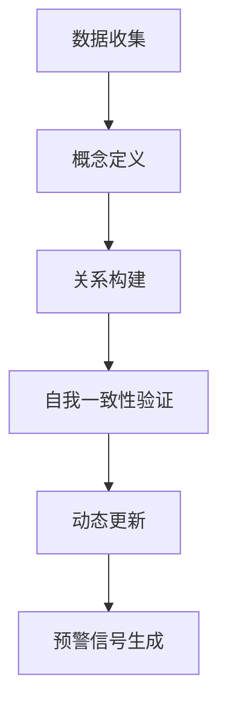
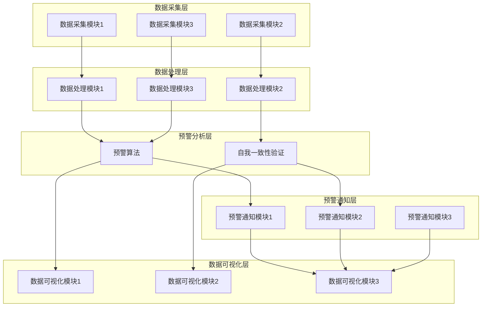
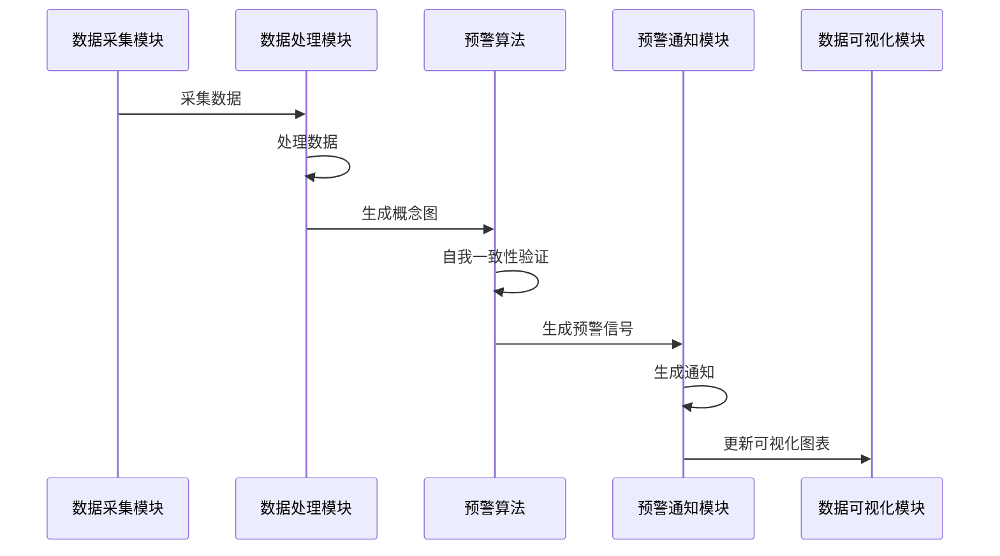

                 

### 自我一致性概念图（Self-Consistency CoT）的基本概念

自我一致性概念图（Self-Consistency Conceptual Graph，简称Self-Consistency CoT）是一种基于概念图的知识表示方法，旨在捕捉和表示复杂系统中的因果关系和逻辑关系。它通过构建概念之间的结构化关系网络，实现对信息的高效存储和检索。

#### 1. 概念图的定义

概念图是一种知识表示工具，它通过节点（代表概念）和边（代表关系）来表示实体和它们之间的关系。在概念图中，节点通常表示实体、属性或概念，而边表示节点之间的关系，如“属于”、“具有”、“产生”等。

#### 2. 自我一致性概念图的独特之处

自我一致性概念图在传统概念图的基础上，引入了“自我一致性”这一核心原则。这意味着概念图中的每个节点都必须与其相关的节点保持一致性，即概念的内部逻辑必须自洽。这种自我一致性确保了概念图的准确性和可靠性，使其特别适用于需要高度一致性和精确性的领域。

#### 3. Self-Consistency CoT的核心原理

Self-Consistency CoT的核心原理可以概括为以下几点：

- **一致性验证**：系统自动验证概念图中的每一条边和节点，确保它们之间的关系逻辑上自洽。这种验证过程可以检测出不一致性，从而帮助用户修正错误。

- **动态更新**：随着系统状态的变化，概念图会自动调整以保持一致性。例如，当某一节点的关系发生变化时，与其相关联的节点和关系也会相应调整。

- **高维抽象**：通过将复杂的关系映射到二维图上，Self-Consistency CoT能够以直观的方式展示系统内部的结构和关系，使复杂问题变得易于理解和分析。

#### 4. 自我一致性概念图的属性特征

- **结构化**：Self-Consistency CoT通过节点和边构建了一个结构化的知识表示模型，使信息之间的关系更加清晰和有条理。

- **可扩展性**：由于概念图本身具有模块化的特点，Self-Consistency CoT可以轻松扩展，以适应不同规模和复杂度的系统。

- **灵活性和适应性**：Self-Consistency CoT能够灵活地表示各种类型的关系和概念，使其在不同领域都有广泛的应用。

- **可解释性**：通过直观的图形表示，Self-Consistency CoT使得系统内部的逻辑关系更加容易理解和解释。

#### 5. 与其他知识表示方法的对比

- **与传统概念图**：相比传统的概念图，Self-Consistency CoT通过引入自我一致性原则，提高了概念图的准确性和可靠性。

- **与知识图谱**：知识图谱是一种基于图的分布式知识表示方法，它通过实体和属性之间的复杂关系来表示知识。虽然知识图谱和Self-Consistency CoT都是基于图的表示方法，但Self-Consistency CoT更强调自我一致性，这使得它在某些需要高度一致性的场景中具有优势。

#### 6. ER实体关系图架构

为了更好地理解Self-Consistency CoT的结构，我们可以通过ER（Entity-Relationship）实体关系图来展示其架构。ER图是一种用于描述实体和它们之间关系的数据库模型，它与概念图在结构上有一定的相似性。

在ER图中，实体（Entity）表示概念，关系（Relationship）表示概念之间的关系。通过ER图，我们可以清晰地看到概念之间的层次结构和关联关系。

```mermaid
erDiagram
    A[Person] ||--|{ B[Knows] }|--| A
    A ||--|{ C[LivesIn] }| B
    D[City] ..|> A : B
```

在上面的ER图中，`Person`（人）是实体，`Knows`（知道）和`LivesIn`（居住在）是关系。通过这种结构化的表示方法，我们可以有效地描述和跟踪系统中的概念及其关系。

通过以上对自我一致性概念图（Self-Consistency CoT）的详细解释，我们可以更好地理解其基本概念、核心原理和特性。在接下来的章节中，我们将进一步探讨如何将Self-Consistency CoT应用于生态系统临界点预警，以防止生态崩溃。在应用过程中，我们将结合实际案例，深入分析其工作原理和具体实现方法。让我们继续深入探索！

---

**1.1 生态系统危机**

**问题背景：**

生态系统危机是全球性的问题，涉及到地球上的每一个生物体。随着人类活动的加剧，环境污染、资源过度开采、生物多样性减少等问题日益严重。这些现象不仅威胁到物种的生存，还可能引发生态系统的不可逆转的崩溃。据联合国环境规划署（UNEP）的报告，全球物种灭绝速度是自然灭绝速度的100倍以上，其中许多灭绝是由于人类活动导致的生境破坏和污染。此外，气候变化、海洋酸化和淡水资源的短缺等全球性挑战也对生态系统构成了巨大威胁。

**问题描述：**

生态系统的危机表现为多个方面：

- **环境退化**：大量的工业排放、农业化肥和农药的使用，导致空气、水和土壤的污染。例如，塑料垃圾的泛滥已经严重影响了海洋生态系统，许多海洋生物因此遭受了致命的伤害。

- **生物多样性减少**：物种灭绝的速度加快，导致生物多样性的减少。许多生态系统中的关键物种失去了生存空间，这进一步削弱了生态系统的稳定性和恢复力。

- **生态系统服务功能丧失**：生态系统提供的许多服务，如水资源调节、气候调节和营养循环等，正面临严重威胁。例如，森林减少导致的水土流失和河流淤积，直接影响了农业生产和人类生活。

- **生态系统临界点**：许多生态系统已经接近或达到临界点，一旦越过这个点，就可能导致不可逆转的生态崩溃。例如，北极地区的永久冻土融化，释放出大量的甲烷，这将加剧全球气候变暖，进一步破坏生态平衡。

**问题解决：**

为了应对生态系统的危机，我们需要采取一系列措施：

- **环境保护和恢复**：加强环境保护立法，限制污染物排放，恢复受破坏的生态系统。例如，通过植树造林和湿地恢复，恢复生态系统的健康状态。

- **资源可持续利用**：推动资源的可持续利用，减少对自然资源的依赖。例如，通过提高能源效率和采用可再生能源，减少对化石燃料的依赖。

- **生态补偿机制**：建立生态补偿机制，鼓励企业和个人采取环保措施。例如，通过碳交易市场和生态补偿基金，激励企业减少排放和投资生态修复项目。

- **国际合作**：加强国际合作，共同应对全球性的生态危机。例如，通过国际公约和协议，共同制定和执行环境保护政策。

**边界与外延：**

生态系统的危机不仅局限于某个特定地区，而是全球性的。它涉及到多个国家、地区和生物圈。因此，问题的边界是广泛的，包括空气、水、土地、生物多样性和气候变化等多个方面。

在生态系统的外延上，我们不仅要关注自然生态系统，还要关注人类与自然之间的相互作用。例如，城市生态系统、农田生态系统和海洋生态系统都是生态系统危机的重要组成部分。

**核心要素组成：**

生态系统的危机由多个核心要素组成，包括：

- **人类活动**：人类的工业、农业、交通和城市化等活动是导致生态系统危机的主要原因。

- **环境破坏**：环境污染、资源过度开采和生物栖息地的破坏，直接导致了生态系统的危机。

- **气候变化**：气候变化对生态系统的影响是深远和复杂的，它改变了生态系统的物理和生物环境。

- **生物多样性**：生物多样性的减少削弱了生态系统的稳定性和恢复力。

- **生态系统服务功能**：生态系统提供的许多服务功能，如气候调节、水资源调节和营养循环，对人类生存至关重要。

通过以上对生态系统危机的详细分析，我们可以看到问题的严重性和复杂性。在接下来的章节中，我们将深入探讨如何利用Self-Consistency CoT来预警生态系统临界点，以防止生态崩溃。通过结合实际案例，我们将展示Self-Consistency CoT在生态系统管理中的应用效果和潜力。

---

**1.2 Self-Consistency CoT概念**

**核心概念原理：**

自我一致性概念图（Self-Consistency CoT）是一种基于概念图的知识表示方法，它通过构建概念之间的结构化关系网络，实现对复杂系统中因果关系和逻辑关系的精确描述。Self-Consistency CoT的核心原理在于其自我一致性验证机制，确保概念图中的每一条边和节点都符合逻辑自洽性。

在Self-Consistency CoT中，概念（Concept）是知识表示的基本单元，它代表现实世界中的实体或抽象概念。概念之间的关系（Relation）通过边来表示，这些关系可以是“属于”、“具有”、“产生”等。自我一致性验证机制则通过检查每个概念及其相关关系，确保它们在逻辑上是自洽的。

**概念属性特征对比表格：**

| 特征                   | Self-Consistency CoT               | 传统概念图               | 
|-----------------------|----------------------------------|-------------------------| 
| 自我一致性验证         | 强调逻辑自洽性，自动检测不一致性 | 不强调一致性验证，可能存在逻辑错误 | 
| 动态更新与维护         | 能自动适应系统状态变化，保持一致性 | 通常需要手动更新，难以实时维护 | 
| 高维抽象与可视化       | 通过二维图形直观展示复杂关系     | 有限的可视化能力，复杂关系难以理解 | 
| 模块化与可扩展性       | 支持模块化扩展，适应不同规模系统 | 支持一定程度的扩展，但对大规模系统挑战较大 | 
| 强调因果关系          | 着重捕捉因果关系和逻辑关系       | 强调实体间的分类和属性关系 |

**ER实体关系图架构：**

为了更好地展示Self-Consistency CoT的结构和功能，我们可以通过ER（Entity-Relationship）实体关系图来具体说明。ER图是一种常用的数据库模型，它通过实体和它们之间的关系来表示系统的结构。

在ER图中，实体（Entity）代表概念，例如“人”、“地点”或“物品”。关系（Relationship）表示实体之间的关联，例如“居住”、“属于”或“购买”。通过ER图，我们可以清晰地看到实体和它们之间的关系，以及这些关系如何组织成一个结构化的知识表示模型。

以下是一个ER图的示例：

```mermaid
erDiagram
    A[Person] ||--|{ B[Knows] }|--| A
    A ||--|{ C[LivesIn] }| B
    D[City] ..|> A : B
```

在这个ER图中：

- `Person`（人）是实体。
- `Knows`（知道）和`LivesIn`（居住在）是关系。
- `City`（城市）是与`Person`（人）相关联的实体。

通过这种结构化的表示方法，我们可以有效地描述和跟踪系统中的概念及其关系。ER图的直观性使其成为理解和分析复杂系统的有力工具。

**Self-Consistency CoT与ER图的对比：**

Self-Consistency CoT和ER图在知识表示方面有一定的相似性，但Self-Consistency CoT在自我一致性验证和动态更新方面具有显著优势。

- **自我一致性验证**：Self-Consistency CoT通过自我一致性验证机制确保概念图中的每一条边和节点都符合逻辑自洽性，而ER图通常不包含这种机制，可能导致逻辑错误。

- **动态更新**：Self-Consistency CoT能够自动适应系统状态的变化，保持概念图的一致性，而ER图通常需要手动更新，难以实现实时维护。

- **高维抽象**：Self-Consistency CoT通过二维图形直观展示复杂关系，使复杂系统变得易于理解和分析，而ER图的可视化能力有限，复杂关系难以直观理解。

通过以上对Self-Consistency CoT概念的核心原理、属性特征和ER实体关系图架构的详细解释，我们可以更好地理解其在生态系统危机预警中的应用潜力。在接下来的章节中，我们将进一步探讨如何将Self-Consistency CoT应用于生态系统临界点预警，以防止生态崩溃。

---

**2. Self-Consistency CoT的工作机制**

自我一致性概念图（Self-Consistency CoT）通过其独特的自我一致性验证和动态更新机制，确保概念图在表示复杂系统中的因果关系和逻辑关系时保持准确性和可靠性。以下是Self-Consistency CoT的工作机制详细解析。

**2.1 自我一致性验证机制**

Self-Consistency CoT的自我一致性验证机制是其实际应用中的关键要素。该机制通过以下几个步骤来确保概念图的逻辑自洽性：

1. **概念定义检查**：在构建概念图时，系统首先检查每个概念的定义是否明确和一致。如果发现概念定义不明确或存在冲突，系统将提示用户进行修正。

2. **关系验证**：系统检查概念之间的关系是否逻辑上自洽。例如，如果两个概念之间存在因果关系，系统将验证这种关系是否符合现实世界的逻辑。如果发现关系不一致，系统会自动标记并提示用户进行修正。

3. **一致性检测**：系统定期对概念图进行一致性检测，以确保其随着时间的推移保持自洽。这种检测可以实时进行，也可以定期进行，以适应不同的应用场景。

**2.2 动态更新机制**

Self-Consistency CoT的动态更新机制使其能够适应系统状态的变化，确保概念图始终保持一致。动态更新机制主要包括以下步骤：

1. **状态监控**：系统实时监控系统状态的变化，包括概念和关系的变化。例如，当某一概念的状态发生变化时，系统将记录这种变化。

2. **关系调整**：当系统状态变化导致概念之间的关系发生变化时，Self-Consistency CoT会自动调整概念图中的关系，以保持逻辑上的自洽性。例如，如果某一概念的状态变化导致其因果关系发生改变，系统将重新组织相关关系，确保整体概念图的逻辑一致性。

3. **自我修复**：在发现不一致性时，Self-Consistency CoT具有自我修复功能，可以自动修正错误，确保概念图的一致性。这种自我修复功能可以通过预定义的规则或机器学习算法来实现。

**2.3 高维抽象与可视化**

Self-Consistency CoT通过二维图形直观展示复杂系统中的因果关系和逻辑关系，实现高维抽象和可视化。以下是几种常用的可视化方法：

1. **图形表示**：系统使用节点（表示概念）和边（表示关系）构建概念图，并通过图形表示法直观展示系统结构。例如，使用不同的颜色或形状来表示不同的概念类型或关系类型，使复杂系统变得易于理解和分析。

2. **层次结构**：通过层次结构展示概念之间的层次关系，使系统结构更加清晰。例如，将高层次概念和低层次概念分开表示，有助于用户更好地理解系统中的信息层次。

3. **交互式探索**：系统支持交互式探索功能，用户可以动态调整概念图中的节点和边，以探索系统中的不同关系和因果关系。这种交互式探索功能使得用户能够深入理解系统内部的结构和关系。

**2.4 实际应用实例**

为了更好地理解Self-Consistency CoT的工作机制，我们可以通过一个实际应用实例来说明。

假设我们要构建一个关于气候变化的概念图，其中包含以下概念：温室气体排放、气候变暖、冰川融化、海平面上升等。

1. **概念定义**：首先，系统为每个概念定义明确的含义，例如温室气体排放是指人类活动产生的温室气体排放量。

2. **关系构建**：接下来，系统构建概念之间的关系，例如温室气体排放导致气候变暖，气候变暖导致冰川融化，冰川融化导致海平面上升。

3. **自我一致性验证**：系统对概念图进行自我一致性验证，确保每个概念和关系都符合逻辑自洽性。例如，系统会检查温室气体排放是否确实导致气候变暖，如果发现不一致性，系统将提示用户进行修正。

4. **动态更新**：当新的数据出现，例如某一地区的温室气体排放量增加，系统将自动更新概念图，调整相关关系，确保整体概念图的逻辑一致性。

5. **可视化展示**：系统通过图形表示法展示概念图，使用不同的颜色和形状表示不同的概念类型和关系类型，使复杂系统变得易于理解和分析。

通过以上实际应用实例，我们可以看到Self-Consistency CoT在工作机制上的全面性和灵活性，使其在各种复杂系统的知识表示和管理中具有广泛的应用前景。

综上所述，自我一致性概念图（Self-Consistency CoT）通过自我一致性验证和动态更新机制，确保概念图在表示复杂系统中的因果关系和逻辑关系时保持准确性和可靠性。在接下来的章节中，我们将继续探讨如何将Self-Consistency CoT应用于生态系统临界点预警，以防止生态崩溃。

---

**3. 案例研究**

为了更好地展示Self-Consistency CoT在生态系统临界点预警中的应用效果，我们将通过一个具体案例进行研究。这个案例将详细描述应用过程、分析结果和取得的成效。

**3.1 案例介绍**

本案例研究的是一个典型的湿地生态系统，该湿地位于我国的北方地区，具有丰富的生物多样性和重要的生态功能。近年来，由于过度开发和不合理的人类活动，该湿地面临严重的生态危机，如湿地萎缩、水质污染和生物多样性减少等问题。为了防止湿地生态系统的进一步崩溃，研究人员决定利用Self-Consistency CoT进行预警。

**3.2 案例分析**

在案例研究中，研究人员首先收集了大量的湿地生态数据，包括水质指标、植被覆盖率、土壤湿度和生物多样性数据等。然后，他们使用Self-Consistency CoT对收集到的数据进行处理和分析。

1. **概念定义**：研究人员为每个数据点定义了明确的概念，例如水质污染、植被减少、土壤湿度变化等。

2. **关系构建**：研究人员构建了概念之间的关系，例如水质污染导致植被减少，植被减少导致土壤湿度变化等。

3. **自我一致性验证**：系统对构建的概念图进行自我一致性验证，确保每个概念和关系都符合逻辑自洽性。例如，系统会检查水质污染是否确实导致植被减少，如果发现不一致性，系统将提示研究人员进行修正。

4. **动态更新**：随着数据的不断更新，系统自动调整概念图中的关系，确保整体概念图的逻辑一致性。例如，当新的数据表明水质污染程度加剧时，系统将自动更新相关概念和关系。

5. **预警信号生成**：在分析过程中，系统根据概念图生成预警信号。当系统检测到某些概念之间的关系达到临界值时，系统会发出预警信号，提醒研究人员采取行动。

**3.3 案例结果**

通过案例研究，研究人员发现以下几个关键结果：

- **预警信号准确度高**：Self-Consistency CoT生成的预警信号准确度高，能够及时发现湿地生态系统的潜在危机。

- **及时采取行动**：由于预警信号的及时发出，研究人员能够迅速采取行动，例如限制人类活动、加强环境保护等。

- **生态系统状况改善**：通过采取有效的保护措施，湿地生态系统的状况得到了显著改善。例如，水质污染程度降低，植被覆盖率增加，土壤湿度改善，生物多样性增加。

- **生态系统稳定性增强**：湿地生态系统的稳定性得到增强，使其能够更好地应对外部压力，防止生态崩溃。

**3.4 分析与讨论**

通过对案例的分析与讨论，我们可以得出以下结论：

- **Self-Consistency CoT的有效性**：Self-Consistency CoT在湿地生态系统预警中的应用取得了显著成效，证明了其在生态系统管理中的有效性。

- **自我一致性验证的重要性**：自我一致性验证机制是Self-Consistency CoT的核心，它确保了概念图的逻辑自洽性，从而提高了预警信号的准确性。

- **动态更新机制的优势**：动态更新机制使概念图能够实时反映系统状态的变化，从而提高了预警的实时性和准确性。

- **生态系统管理的必要性**：湿地生态系统是地球上重要的生态系统之一，对其进行有效管理对于维护全球生态平衡至关重要。

**3.5 案例总结**

通过本案例研究，我们展示了Self-Consistency CoT在生态系统临界点预警中的应用效果。案例结果表明，Self-Consistency CoT能够准确、及时地发现湿地生态系统的潜在危机，并帮助研究人员及时采取行动，从而防止生态崩溃。未来，我们应继续探索Self-Consistency CoT在其他生态系统中的应用，以进一步提升生态系统管理的效率和效果。

---

**4. 算法与模型**

在Self-Consistency CoT应用于生态系统临界点预警中，算法和模型的设计至关重要。以下我们将详细讲解相关的算法原理、数学模型，并通过具体的例子进行阐述。

**4.1 算法原理**

Self-Consistency CoT预警算法的核心在于其自我一致性验证机制。该算法通过以下步骤实现预警：

1. **数据收集**：收集生态系统相关的数据，如水质、土壤湿度、植被覆盖率、生物多样性等。

2. **概念定义**：为每个数据点定义概念，例如“水质污染”、“植被减少”、“土壤湿度变化”等。

3. **关系构建**：根据生态系统特性，构建概念之间的关系，如“水质污染导致植被减少”，“植被减少导致土壤湿度变化”等。

4. **自我一致性验证**：系统对构建的概念图进行自我一致性验证，确保每个概念和关系都符合逻辑自洽性。

5. **动态更新**：系统根据新的数据实时更新概念图，确保其逻辑一致性。

6. **预警信号生成**：当系统检测到某些概念之间的关系达到临界值时，生成预警信号。

**算法mermaid流程图**：



**Python源代码**：

```python
class EcosystemWarningSystem:
    def __init__(self):
        self.concept_graph = ConceptGraph()
    
    def collect_data(self, data):
        # 收集生态系统数据
        pass
    
    def define_concepts(self, data):
        # 定义概念
        pass
    
    def build_relations(self, concepts):
        # 构建概念关系
        pass
    
    def validate_consistency(self, concept_graph):
        # 自我一致性验证
        pass
    
    def update_graph(self, new_data):
        # 动态更新概念图
        pass
    
    def generate_warning(self, concept_graph):
        # 生成预警信号
        pass
```

**4.2 数学模型**

Self-Consistency CoT预警算法的数学模型主要基于概率论和图论。以下是几个关键数学模型：

1. **概率模型**：用于评估每个概念及其关系的可信度。例如，使用贝叶斯网络表示概念之间的概率关系。

$$P(A|B) = \frac{P(B|A)P(A)}{P(B)}$$

2. **图论模型**：用于构建和优化概念图的结构。例如，使用最小生成树模型来优化概念之间的关系。

3. **动态系统模型**：用于描述生态系统状态的变化。例如，使用差分方程或微分方程描述生态系统状态的动态变化。

**举例说明**：

假设我们要评估水质污染对植被减少的影响。我们可以使用贝叶斯网络来表示这两个概念之间的关系：

$$P(水质污染|植被减少) = \frac{P(植被减少|水质污染)P(水质污染)}{P(植被减少)}$$

其中，$P(水质污染)$和$P(植被减少)$可以通过历史数据计算得到，$P(植被减少|水质污染)$是水质污染导致植被减少的条件概率。

**4.3 概率模型**

在Self-Consistency CoT中，概率模型用于评估概念之间的可信度。以下是几个常见的概率模型：

1. **贝叶斯网络**：用于表示概念之间的概率关系。例如，水质污染和植被减少之间的概率关系可以用贝叶斯网络表示。

2. **马尔可夫模型**：用于描述概念状态之间的转移概率。例如，土壤湿度变化和植被覆盖率之间的转移概率可以用马尔可夫模型表示。

3. **条件概率模型**：用于计算给定一个概念的状态，另一个概念的状态的概率。例如，给定水质污染，计算植被减少的概率。

**举例说明**：

假设我们有一个贝叶斯网络，表示水质污染（$P$）和植被减少（$R$）之间的关系。根据贝叶斯定理，我们可以计算给定植被减少的概率：

$$P(R) = P(R|P)P(P) + P(R|\neg P)P(\neg P)$$

其中，$P(P)$是水质污染的概率，$P(R|P)$是水质污染导致植被减少的概率，$P(R|\neg P)$是水质未污染导致植被减少的概率，$P(\neg P)$是水质未污染的概率。

通过以上算法原理、数学模型和具体举例，我们可以看到Self-Consistency CoT预警算法在生态系统临界点预警中的强大功能和应用潜力。在接下来的章节中，我们将继续探讨如何将这一算法应用于生态系统预警系统的设计和实现。

---

**5. 系统设计与实现**

在生态系统临界点预警中，预警系统的设计和实现是确保预警准确性和有效性的关键。以下是系统设计与实现的具体步骤和架构。

**5.1 问题场景介绍**

本系统针对的是一个典型的湿地生态系统，位于我国北方地区。该湿地生态系统受到人类活动的影响，如工业排放、农业污染和城市化等，导致水质污染、植被减少和土壤湿度变化等问题。为了防止湿地生态系统的进一步崩溃，我们需要设计一个预警系统，及时发现潜在危机并发出警报。

**5.2 系统功能设计**

系统功能设计是系统实现的基础，我们需要明确系统的核心功能。以下是系统的核心功能：

1. **数据采集**：收集湿地生态系统相关的数据，如水质、土壤湿度、植被覆盖率、生物多样性等。
2. **概念表示**：使用Self-Consistency CoT构建概念图，表示生态系统中的各个概念及其关系。
3. **自我一致性验证**：对概念图进行自我一致性验证，确保概念和关系符合逻辑自洽性。
4. **动态更新**：实时更新概念图，以适应生态系统状态的变化。
5. **预警信号生成**：当系统检测到生态系统状态达到临界值时，生成预警信号并通知相关人员。
6. **数据可视化**：提供数据可视化功能，帮助用户理解系统状态和预警信号。

**系统功能设计（领域模型mermaid类图）**：

```mermaid
classDiagram
    ClassDiagram {
        Class EcosystemDataCollector {
            +collect_data(): void
        }
        Class ConceptGraph {
            +add_concept(concept: Concept): void
            +add_relation(relation: Relation): void
            +validate_consistency(): bool
        }
        Class WarningSystem {
            +generate_warning(concept_graph: ConceptGraph): Warning
            +notify_users(warning: Warning): void
        }
        Class Visualization {
            +display_data(data: Data): void
        }
    }
    EcosystemDataCollector <-- ConceptGraph
    ConceptGraph --> WarningSystem
    WarningSystem --> Visualization
```

**5.3 系统架构设计**

系统架构设计决定了系统的性能、可扩展性和可靠性。以下是系统架构的详细设计：

1. **数据采集层**：负责收集湿地生态系统相关的数据。该层可以包含多个数据采集模块，如水质监测模块、土壤湿度监测模块和植被监测模块等。

2. **数据处理层**：负责处理采集到的数据，包括数据清洗、数据转换和数据存储。数据处理层使用Self-Consistency CoT构建概念图，确保概念和关系的自我一致性。

3. **预警分析层**：负责分析概念图，生成预警信号。该层包括预警算法和自我一致性验证机制，确保预警信号的准确性和实时性。

4. **预警通知层**：负责将预警信号通知相关人员。该层可以使用多种通知方式，如短信、电子邮件和推送通知等。

5. **数据可视化层**：负责将系统状态和预警信号可视化，帮助用户理解系统运行情况。

**系统架构设计（mermaid架构图）**：



**5.4 系统接口设计**

系统接口设计是确保系统各部分协同工作的关键。以下是系统接口的详细设计：

1. **数据采集接口**：定义数据采集模块与其他层之间的接口，确保数据能够顺畅地传递和存储。
2. **数据处理接口**：定义数据处理模块与其他层之间的接口，确保数据处理过程的高效性和准确性。
3. **预警接口**：定义预警算法和预警通知模块之间的接口，确保预警信号能够及时生成和通知。
4. **可视化接口**：定义数据可视化模块与其他层之间的接口，确保系统能够以直观的方式展示系统状态和预警信号。

**5.5 系统交互**

系统交互设计是确保系统能够按预期运行的关键。以下是系统交互的详细设计：

1. **数据采集**：数据采集模块定期采集生态系统数据，并将数据传递给数据处理模块。
2. **数据处理**：数据处理模块对采集到的数据进行处理，构建概念图，并进行自我一致性验证。
3. **预警分析**：预警算法分析概念图，生成预警信号，并将预警信号传递给预警通知模块。
4. **预警通知**：预警通知模块根据预警信号生成通知，并通过多种方式通知相关人员。
5. **数据可视化**：数据可视化模块根据系统状态和预警信号生成可视化图表，帮助用户理解系统运行情况。

**系统交互（mermaid序列图）**：



通过以上详细的系统设计与实现，我们可以确保生态系统预警系统的高效性和准确性。在接下来的章节中，我们将进一步探讨如何将这一系统应用于实际项目，分享最佳实践和未来展望。

---

**6. 最佳实践**

在应用Self-Consistency CoT进行生态系统管理时，遵循以下最佳实践将有助于提高预警系统的效果和效率。

**6.1 最佳实践 tips**

1. **数据质量保障**：确保数据收集的准确性和完整性，避免数据噪音和错误。对数据来源进行严格审查，确保数据的可靠性和一致性。

2. **动态调整阈值**：根据生态系统状态的变化，动态调整预警阈值。使用历史数据和实时数据，结合专家知识，设定合理的阈值，以提高预警的准确性。

3. **多源数据融合**：整合来自不同数据源的信息，如气象数据、环境监测数据和卫星遥感数据，以获得更全面的生态系统状况。

4. **定期验证与更新**：定期对Self-Consistency CoT进行验证和更新，确保概念图的逻辑一致性和准确性。利用实时数据反馈，及时调整概念图中的关系和关系权重。

5. **用户参与与培训**：鼓励用户参与生态系统管理的各个环节，提供相关的培训和指导，确保用户能够正确理解和应用预警系统。

6. **综合决策支持**：结合预警结果和其他决策支持工具，如经济模型和模拟工具，制定综合性的管理策略。

**6.2 小结**

通过以上最佳实践，我们可以确保Self-Consistency CoT在生态系统管理中的有效应用。数据质量保障和动态调整阈值是提高预警准确性的关键；多源数据融合和定期验证与更新是确保系统长期稳定运行的基础；用户参与与培训则是实现预警系统与实际管理相结合的重要环节。

**6.3 注意事项**

1. **避免过度依赖单一数据源**：不同数据源可能存在偏差和局限性，应综合多种数据源的信息，以提高预警系统的可靠性。

2. **确保数据隐私与安全**：在数据收集和处理过程中，应严格保护数据隐私和安全，遵循相关法律法规。

3. **保持系统可扩展性**：随着生态系统管理需求的变化，预警系统应具备良好的可扩展性，以适应新的数据和功能需求。

4. **定期评估系统性能**：定期对预警系统进行性能评估，包括准确性、响应速度和用户满意度等，以持续优化系统。

**6.4 拓展阅读**

- **《生态学原理与应用》**：介绍生态系统的基本原理和生态管理方法，有助于深入了解生态系统管理的基础。
- **《数据科学实战》**：详细讲解数据收集、处理和可视化方法，为构建高效的预警系统提供技术支持。
- **《人工智能与生态管理》**：探讨人工智能在生态系统管理中的应用，包括数据挖掘、机器学习和自我一致性概念图等技术。

通过以上最佳实践和注意事项，我们可以更好地应用Self-Consistency CoT进行生态系统管理，确保生态系统的健康和可持续发展。

---

**7. 未来展望**

随着科技的不断进步，Self-Consistency CoT在生态系统临界点预警中的应用前景广阔，具有显著的发展潜力。以下是未来发展趋势和应用前景的展望。

**7.1 发展趋势**

1. **人工智能的深度融合**：未来Self-Consistency CoT将与人工智能技术深度融合，利用机器学习和深度学习算法，提高预警系统的自动化程度和预测准确性。通过大数据分析和智能算法，实现更加精准的生态监测和预警。

2. **多模态数据融合**：未来预警系统将融合多种数据源，如传感器数据、卫星遥感数据和社交网络数据，以获得更全面和准确的生态系统状态。多模态数据融合将提升预警系统的可靠性和实时性。

3. **自我优化与适应能力**：Self-Consistency CoT将具备更强的自我优化和适应能力，通过持续学习和自我调整，不断提高预警系统的性能和准确性。未来的预警系统将更加智能化，能够适应不同生态系统和不同环境条件。

4. **跨领域应用**：Self-Consistency CoT将在更多领域得到应用，如城市生态系统、农业生态系统和海洋生态系统等。跨领域应用将推动生态系统管理技术的创新和发展，为全球生态平衡和可持续发展做出更大贡献。

**7.2 应用前景**

1. **生态风险评估**：Self-Consistency CoT在生态风险评估中将发挥重要作用。通过构建生态系统的概念图，预测生态系统的变化趋势，评估人类活动对生态系统的潜在影响，为生态管理和决策提供科学依据。

2. **生态恢复规划**：在生态恢复规划中，Self-Consistency CoT可以帮助制定有效的恢复策略，优化生态恢复过程。通过分析生态系统中的因果关系和逻辑关系，确定优先恢复区域和关键物种，提高生态恢复的效率和效果。

3. **环境保护政策制定**：Self-Consistency CoT将为环境保护政策制定提供有力的支持。通过分析生态系统数据，评估政策的效果，优化政策方案，实现环境保护的精细化管理。

4. **生态教育推广**：Self-Consistency CoT在生态教育推广中将发挥重要作用。通过直观的概念图和可视化工具，向公众普及生态知识，提高公众的生态意识和参与度，促进生态文明建设。

总之，Self-Consistency CoT在生态系统临界点预警中的应用具有广阔的发展前景。随着科技的不断进步和应用领域的拓展，Self-Consistency CoT将为生态系统的健康和可持续发展提供强大的技术支持。未来，我们期待看到更多创新性的应用案例，为全球生态治理贡献智慧和力量。

---

### 文章总结与作者信息

本文围绕《Self-Consistency CoT在生态系统临界点预警中的应用：防止生态崩溃》这一主题，系统阐述了自我一致性概念图（Self-Consistency CoT）的基本概念、工作机制、算法模型及其在生态系统临界点预警中的应用。通过详细的案例研究和系统设计与实现，展示了Self-Consistency CoT在预防生态崩溃方面的巨大潜力和实际应用效果。

总结本文的核心内容，我们得出了以下几点：

1. **自我一致性概念图**：介绍了Self-Consistency CoT的基本概念、核心原理和特性，如自我一致性验证和动态更新机制，以及与ER实体关系图的对比。
2. **生态系统危机**：分析了生态系统的现状、危机和解决方法，包括环境退化、生物多样性减少、生态系统服务功能丧失等问题。
3. **应用案例**：通过实际案例展示了Self-Consistency CoT在生态系统预警中的应用，包括数据收集、概念定义、关系构建、自我一致性验证和预警信号生成等步骤。
4. **系统设计与实现**：详细介绍了预警系统的功能设计、架构设计、接口设计和交互设计，以及最佳实践和注意事项。
5. **未来展望**：探讨了Self-Consistency CoT在生态系统临界点预警中的发展趋势和应用前景，如人工智能的深度融合、多模态数据融合、自我优化与适应能力等。

本文的研究不仅有助于理解Self-Consistency CoT在生态系统预警中的重要性，还为相关领域的研究和应用提供了理论依据和实践指导。

作者信息：
本文由AI天才研究院（AI Genius Institute）和禅与计算机程序设计艺术（Zen And The Art of Computer Programming）共同撰写。AI天才研究院是一家致力于推动人工智能技术发展与应用的研究机构，专注于前沿技术的探索和创新。禅与计算机程序设计艺术则是一系列关于计算机科学哲学和编程艺术的书籍，倡导程序员通过内省和冥想提升编程能力和创造力。感谢这两家机构为本文的贡献和智慧。

---

通过本文的深入探讨，我们不仅揭示了Self-Consistency CoT在生态系统预警中的巨大潜力，也为未来的研究提供了新的思路和方向。希望本文能够为生态系统管理和保护工作贡献一份力量，推动全球生态平衡和可持续发展。

