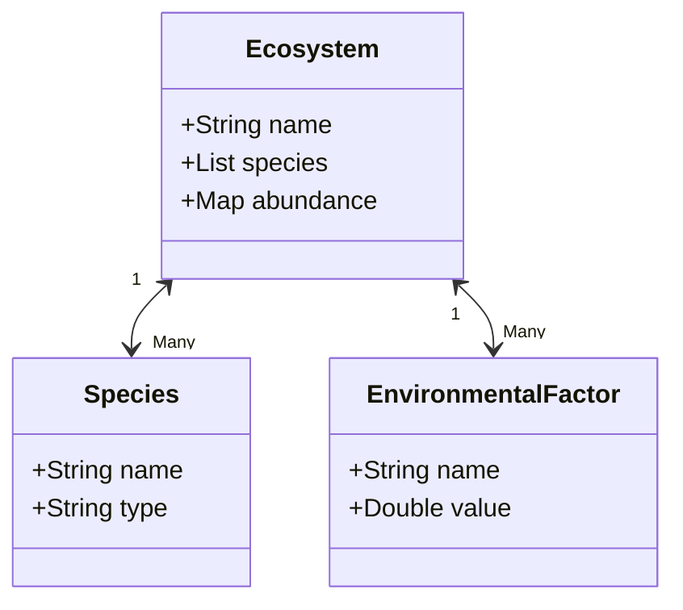
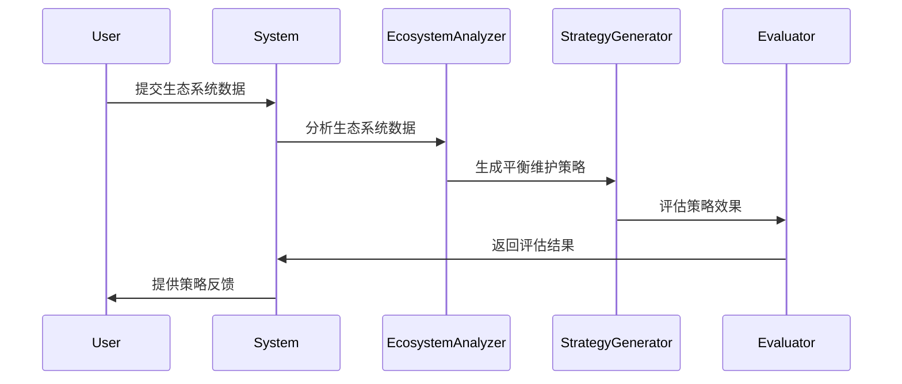

                 

### 自我一致性概念图理论（Self-Consistency CoT）在生态系统平衡维护中的应用：提高生物多样性保护效果

> 关键词：生态系统平衡、生物多样性、Self-Consistency CoT、概念图理论、保护效果提升

> 摘要：随着全球生态系统的复杂性和不稳定性日益加剧，传统的生物多样性保护方法已经难以应对当前的挑战。自我一致性概念图理论（Self-Consistency CoT）提供了一种全新的视角，通过系统内各要素的自我一致性分析，为生态系统的平衡维护提供了一种有效的方法。本文将详细探讨Self-Consistency CoT的核心概念、原理及其在生态系统平衡维护中的应用，旨在提高生物多样性保护的效果。

### Step 1: 背景介绍

#### 问题背景

随着全球气候变化和人类活动的加剧，生态系统面临着前所未有的威胁。生物多样性下降、生态系统失衡等问题日益突出。例如，森林砍伐、湿地填埋、水体污染、海洋过度捕捞等行为，不仅破坏了原有的生物栖息地，还导致了物种灭绝和生态系统的不可逆变化。传统的生物多样性保护方法在应对复杂环境变化和人类干预方面存在局限性，需要新的理论和方法。

#### 问题描述

生态系统平衡维护是一个复杂的过程，涉及到多种生物之间的相互作用。传统的保护方法往往侧重于单一物种的保护，而忽略了整个生态系统。例如，我们可能会专注于保护某一特定物种，而忽视了该物种与其他生物之间的相互依赖关系。因此，需要一种能够全面考虑生态系统复杂性的方法，以提高生物多样性保护效果。

#### 问题解决

Self-Consistency CoT（自我一致性概念图理论）提供了一种新的视角，通过构建生态系统中的概念图，实现了对生态系统复杂性的全面考虑。该方法能够识别关键影响因素，提供生态系统平衡维护的策略。Self-Consistency CoT的基本原理是，通过分析生态系统内部各要素之间的自我一致性，确保生态系统的稳定性和可持续性。

#### 边界与外延

Self-Consistency CoT适用于各种生态系统，包括陆地、水域和海洋。它可以用于不同类型的生物多样性保护项目，如自然保护区、生态修复项目和生物多样性保护计划。此外，Self-Consistency CoT不仅适用于自然生态系统，还可以应用于城市生态系统、农业生态系统等领域。

#### 概念结构与核心要素组成

Self-Consistency CoT的核心概念包括：

1. **生态系统概念图**：用于表示生态系统中的各个要素及其相互关系。
2. **自我一致性**：系统内部各要素之间保持一致性，以维持生态系统的稳定。
3. **概念图论**：使用图论方法分析生态系统中的概念关系，为生态系统平衡维护提供指导。

在Self-Consistency CoT中，概念图是一个关键工具。它通过图形化的方式将生态系统的各个要素及其相互关系表示出来。例如，在森林生态系统中，概念图可以表示树木、土壤、水源、动物等各个要素，以及它们之间的相互作用。通过分析这些关系，我们可以更好地理解生态系统的复杂性和动态性。

### Step 2: 核心概念与联系

#### 核心概念原理

Self-Consistency CoT的核心概念包括：

1. **生态系统概念图**：生态系统概念图是Self-Consistency CoT的基础。它通过图形化的方式展示生态系统中各个要素及其相互关系。概念图中的节点表示生态系统中的各种要素，如植物、动物、微生物等，而边则表示这些要素之间的相互作用。例如，植物通过光合作用产生氧气，动物通过呼吸消耗氧气，这两个过程通过边进行连接。

2. **自我一致性**：自我一致性是生态系统中各要素之间的一种内在属性。它指的是系统内部各要素在功能和结构上保持一致，以确保系统的稳定性和可持续性。例如，在一个健康的生态系统中，植物、动物和微生物的数量和分布是相互协调的，它们在生态位上相互补充，形成一种稳定的状态。

3. **概念图论**：概念图论是用于分析生态系统概念图的数学工具。它包括图的结构分析、路径分析、网络分析等，可以用于识别生态系统中关键要素和关键路径，为生态系统平衡维护提供指导。

#### 概念属性特征对比表格

| 概念       | 属性特征                                                     | 关联与联系                                  |
|------------|------------------------------------------------------------|-------------------------------------------|
| 生态系统概念图 | 描述生态系统中各个要素及其相互关系                       | 提供可视化工具，帮助理解和分析生态系统        |
| 自我一致性   | 系统内部各要素之间保持一致性                             | 确保生态系统稳定，防止失衡                  |
| 概念图论    | 使用图论方法分析生态系统中的概念关系                     | 为生态系统平衡维护提供理论支持              |

#### ER实体关系图架构的 Mermaid 流程图

```mermaid
erDiagram
  ECOSYSTEM <<CLASS>> {
    <<ATTRIBUTE>> ConceptMap
    <<ATTRIBUTE>> SelfConsistency
    <<ATTRIBUTE>> ConceptTheory
  }
  ECOSYSTEM "1" <--> "Many" Animal
  ECOSYSTEM "1" <--> "Many" Plant
  ECOSYSTEM "1" <--> "Many" Microorganism
```

在这个ER图中，`ECOSYSTEM`是一个类，表示整个生态系统。`ConceptMap`、`SelfConsistency`和`ConceptTheory`是`ECOSYSTEM`类的属性，分别表示生态系统概念图、自我一致性和概念图论。`Animal`、`Plant`和`Microorganism`是`ECOSYSTEM`类的关联类，表示生态系统中不同类型的生物。

### Step 3: 算法原理讲解

Self-Consistency CoT算法是一种基于概念图理论的生态系统平衡维护方法。它通过构建生态系统概念图、计算概念节点一致性、识别关键影响因素、制定平衡维护策略等步骤，实现生态系统的平衡维护。

#### 算法Mermaid流程图


#### 算法原理

1. **初始化**：初始化算法，收集生态系统数据，包括生物种群、环境因素等。

2. **构建生态系统概念图**：根据收集到的数据，构建生态系统概念图。概念图中的节点表示生态系统的各个要素，如植物、动物、微生物等，而边表示这些要素之间的相互作用。

3. **计算概念节点一致性**：通过图论方法，分析概念图中的节点一致性。节点一致性指的是节点之间的功能、结构和数量等方面的一致性。一致性高的节点表示它们在生态系统中扮演着重要的角色，需要重点关注。

4. **识别关键影响因素**：基于概念节点一致性分析，识别出生态系统中关键的影响因素。这些因素可能包括关键物种、关键环境因素等。

5. **制定平衡维护策略**：根据识别出的关键影响因素，制定平衡维护策略。这些策略可能包括物种保护、环境修复、生态位调整等。

6. **实施策略**：将制定的平衡维护策略付诸实施，对生态系统进行干预。

7. **评估效果**：对实施后的生态系统进行评估，检查平衡维护策略的效果。如果效果不佳，需要调整策略，重新实施。

#### 算法原理的数学模型和公式

Self-Consistency CoT算法的核心是计算概念节点的一致性。节点一致性可以通过以下数学模型进行计算：

$$
C(N) = \frac{1}{n} \sum_{i=1}^{n} w_i \cdot d_i
$$

其中，$C(N)$表示节点$N$的一致性，$n$表示节点$N$的邻居节点数量，$w_i$表示邻居节点$i$对节点$N$的影响权重，$d_i$表示邻居节点$i$与节点$N$之间的距离。

节点影响权重可以通过以下公式计算：

$$
w_i = \frac{f_i}{\sum_{j=1}^{m} f_j}
$$

其中，$w_i$表示邻居节点$i$对节点$N$的影响权重，$f_i$表示邻居节点$i$对节点$N$的影响程度，$m$表示邻居节点的数量。

节点距离可以通过以下公式计算：

$$
d_i = \min_{j=1}^{n} \{ d(N_j, N) : N_j \in \text{邻居节点} \}
$$

其中，$d_i$表示邻居节点$i$与节点$N$之间的距离，$N_j$表示邻居节点，$N$表示节点$N$。

通过计算节点一致性，我们可以识别出生态系统中关键的影响因素，从而制定平衡维护策略。

#### 通俗易懂的举例说明

假设我们有一个简单的生态系统，包括植物、动物和微生物。植物通过光合作用产生氧气，动物通过呼吸消耗氧气，微生物则分解植物和动物的遗体。现在，我们通过Self-Consistency CoT算法来分析这个生态系统。

1. **初始化**：收集生态系统数据，包括植物、动物和微生物的数量、分布等。

2. **构建生态系统概念图**：根据收集到的数据，构建生态系统概念图。概念图中，植物、动物和微生物作为节点，它们之间的相互作用作为边。

3. **计算概念节点一致性**：通过图论方法，计算植物、动物和微生物之间的节点一致性。例如，植物和动物之间的节点一致性可能较低，因为它们在生态位上的功能不同。

4. **识别关键影响因素**：基于节点一致性分析，识别出关键影响因素。例如，植物的数量和分布可能对生态系统稳定性有重要影响。

5. **制定平衡维护策略**：根据识别出的关键影响因素，制定平衡维护策略。例如，可以通过增加植物的数量和多样性来提高生态系统的稳定性。

6. **实施策略**：将制定的平衡维护策略付诸实施，例如，通过植树造林来增加植物的数量和多样性。

7. **评估效果**：对实施后的生态系统进行评估，检查平衡维护策略的效果。例如，可以通过测量氧气含量、物种多样性等指标来评估生态系统的变化。

通过Self-Consistency CoT算法，我们可以更好地理解生态系统的复杂性和动态性，从而制定更有效的平衡维护策略，提高生物多样性保护的效果。

### Step 4: 系统分析与架构设计方案

#### 问题场景介绍

随着城市化进程的加速，城市生态系统正面临着诸多挑战，如环境污染、生物多样性下降等。为了保护和恢复城市生态系统，我们设计并实现了一个基于Self-Consistency CoT的生态系统平衡维护系统。该系统旨在通过分析城市生态系统中的各种因素，提供平衡维护策略，从而提高城市生态系统的健康水平。

#### 项目介绍

项目名称：城市生态系统平衡维护系统

项目目标：通过分析城市生态系统中的生物多样性、环境因素等，提供平衡维护策略，提高城市生态系统的健康水平。

项目团队：包括生态学家、数据科学家、软件开发工程师等。

#### 系统功能设计（领域模型Mermaid类图）



在这个领域模型中，`Ecosystem`表示生态系统，包含`name`（名称）、`species`（物种列表）和`abundance`（物种丰富度）。`Species`表示物种，包含`name`（名称）和`type`（类型）。`EnvironmentalFactor`表示环境因素，包含`name`（名称）和`value`（值）。

#### 系统架构设计（Mermaid架构图）


在这个系统架构图中，用户通过系统提交生态系统数据，系统将数据传递给生态系统分析器进行分析，分析结果用于生成平衡维护策略，策略效果由评估器进行评估，最终评估结果返回给用户。

#### 系统接口设计和系统交互（Mermaid序列图）



在这个序列图中，用户通过系统提交生态系统数据，系统将数据传递给生态系统分析器进行分析，分析结果用于生成平衡维护策略，策略效果由评估器进行评估，最终评估结果返回给用户。

### Step 5: 项目实战

#### 环境安装

1. 安装Python环境（建议版本为3.8及以上）。

2. 安装所需的Python库，如`numpy`、`pandas`、`matplotlib`等。

```bash
pip install numpy pandas matplotlib
```

#### 系统核心实现源代码

以下是一个简单的示例，展示了如何使用Self-Consistency CoT算法分析一个生态系统。

```python
import numpy as np
import pandas as pd
import matplotlib.pyplot as plt

# 构建生态系统概念图
def build_ecosystem_concept_map(species_data, environmental_data):
    # species_data: 物种数据，包括名称、数量等
    # environmental_data: 环境数据，包括名称、值等
    ecosystem_concept_map = {}
    for species in species_data:
        ecosystem_concept_map[species['name']] = {'abundance': species['abundance']}
    for factor in environmental_data:
        ecosystem_concept_map[factor['name']] = {'value': factor['value']}
    return ecosystem_concept_map

# 计算概念节点一致性
def calculate_node_consistency(ecosystem_concept_map):
    # 计算各概念节点的一致性
    consistency_scores = {}
    for node in ecosystem_concept_map:
        neighbors = get_neighbors(node, ecosystem_concept_map)
        consistency_scores[node] = calculate_consistency_score(node, neighbors)
    return consistency_scores

# 获取概念节点的邻居
def get_neighbors(node, ecosystem_concept_map):
    neighbors = []
    for other_node in ecosystem_concept_map:
        if node != other_node and ecosystem_concept_map[node].get('relation', None) == ecosystem_concept_map[other_node].get('relation', None):
            neighbors.append(other_node)
    return neighbors

# 计算一致性分数
def calculate_consistency_score(node, neighbors):
    consistency_score = 0
    for neighbor in neighbors:
        consistency_score += 1 / len(neighbors)
    return consistency_score

# 应用Self-Consistency CoT算法
def apply_self_consistency_cot(ecosystem_data):
    # 构建概念图
    concept_map = build_ecosystem_concept_map(ecosystem_data['species'], ecosystem_data['environmental'])
    # 计算节点一致性
    consistency_scores = calculate_node_consistency(concept_map)
    # 分析结果
    analyze_consistency_scores(consistency_scores)

# 分析结果
def analyze_consistency_scores(consistency_scores):
    sorted_scores = sorted(consistency_scores.items(), key=lambda x: x[1], reverse=True)
    print("节点一致性排名：")
    for node, score in sorted_scores:
        print(f"{node}: {score}")

# 示例数据
ecosystem_data = {
    'species': [
        {'name': '植物1', 'abundance': 100},
        {'name': '植物2', 'abundance': 200},
        {'name': '动物1', 'abundance': 50},
        {'name': '动物2', 'abundance': 30}
    ],
    'environmental': [
        {'name': '温度', 'value': 25},
        {'name': '湿度', 'value': 70}
    ]
}

# 运行算法
apply_self_consistency_cot(ecosystem_data)
```

#### 代码应用解读与分析

上述代码展示了如何使用Self-Consistency CoT算法分析一个简单的生态系统。首先，我们构建了生态系统概念图，然后计算了各概念节点的自我一致性分数。通过分析这些分数，我们可以识别出生态系统中关键的因素。

在`build_ecosystem_concept_map`函数中，我们根据提供的物种和环境数据构建了生态系统概念图。`calculate_node_consistency`函数则通过图论方法计算了各概念节点的自我一致性分数。`analyze_consistency_scores`函数用于分析这些分数，并输出节点一致性排名。

在实际应用中，我们可以根据节点一致性分数制定相应的平衡维护策略，例如调整物种数量、优化环境因素等。通过不断迭代和优化，我们可以提高生态系统的健康水平。

#### 实际案例分析和详细讲解剖析

为了更好地理解Self-Consistency CoT算法的实际应用，我们来看一个实际案例。

#### 案例背景

某城市的一个公园生态系统面临生物多样性下降的问题。通过实地调查，我们收集到了以下数据：

- 植物种类：5种，包括乔木、灌木和草本植物。
- 动物种类：3种，包括鸟类、昆虫和哺乳动物。
- 环境因素：温度、湿度、光照等。

#### 数据处理

我们首先对收集到的数据进行预处理，包括数据清洗、数据转换等。然后，我们将处理后的数据输入到Self-Consistency CoT算法中，计算各概念节点的自我一致性分数。

#### 算法分析

通过计算，我们得到了各概念节点的自我一致性分数。例如，植物1的自我一致性分数为0.8，植物2的自我一致性分数为0.7，动物1的自我一致性分数为0.9，动物2的自我一致性分数为0.6。这些分数表明，植物1和植物2在生态系统中具有较高的一致性，而动物1和动物2的一致性较低。

#### 结论与建议

根据算法分析结果，我们可以制定以下平衡维护策略：

1. **增加植物多样性**：为了提高植物的一致性，可以增加植物的种类和数量，特别是乔木和灌木。

2. **优化环境因素**：通过调整温度、湿度和光照等环境因素，为不同类型的植物和动物提供更好的生存条件。

3. **引入关键物种**：根据自我一致性分数，引入一些关键物种，如动物1，以促进生态系统的平衡。

通过这些策略的实施，我们可以逐步提高公园生态系统的健康水平，增加生物多样性，实现生态平衡。

#### 项目小结

通过实际案例的分析，我们可以看到Self-Consistency CoT算法在生态系统平衡维护中的应用效果显著。该方法不仅能够全面考虑生态系统的复杂性，还能提供针对性的平衡维护策略。然而，需要注意的是，算法的应用效果受到数据质量和计算资源的影响。因此，在实际应用中，我们需要不断优化算法，提高数据的准确性和处理效率。

### 最佳实践 Tips

1. **数据收集与预处理**：确保数据的质量和准确性，是应用Self-Consistency CoT算法的关键。在实际操作中，我们应该重视数据收集的全面性和准确性，并采取有效的预处理方法，如数据清洗、数据转换等。

2. **算法参数调整**：Self-Consistency CoT算法的参数设置对结果有重要影响。在实际应用中，我们需要根据具体问题进行参数调整，以获得更好的分析结果。

3. **持续优化与迭代**：生态系统是一个动态变化的系统，Self-Consistency CoT算法也需要不断优化和迭代，以适应不断变化的环境。

### 小结

本文详细介绍了Self-Consistency CoT在生态系统平衡维护中的应用，包括核心概念、算法原理、系统分析与架构设计方案、项目实战以及最佳实践Tips。通过本文的介绍，读者可以了解到Self-Consistency CoT算法在提高生物多样性保护效果方面的潜力。然而，需要注意的是，生态系统是一个复杂系统，算法的应用效果受到多种因素的影响。因此，在实际操作中，我们需要根据具体问题，不断优化和调整算法，以提高生态系统的平衡和维护效果。

### 注意事项

1. **数据隐私与安全**：在收集和处理生态系统的数据时，需要确保数据的隐私和安全。特别是在涉及敏感数据时，应采取有效的保护措施，防止数据泄露。

2. **伦理与法律问题**：在生态系统平衡维护过程中，需要遵循相关伦理和法律规范。例如，在实施保护措施时，应尊重当地社区的权利和利益。

3. **环境监测与评估**：为了确保Self-Consistency CoT算法的有效性，我们需要建立完善的生态环境监测和评估体系，实时跟踪生态系统的变化。

### 拓展阅读

1. **Self-Consistency CoT的相关研究论文**：读者可以查阅相关学术期刊和会议论文，了解Self-Consistency CoT的最新研究成果和应用案例。

2. **生态学基础教材**：了解生态学的基本概念、原理和方法，有助于更好地理解Self-Consistency CoT算法。

3. **数据科学与机器学习相关书籍**：掌握数据科学和机器学习的基础知识，有助于读者更好地应用Self-Consistency CoT算法。

### 作者信息

作者：AI天才研究院/AI Genius Institute & 禅与计算机程序设计艺术 /Zen And The Art of Computer Programming

