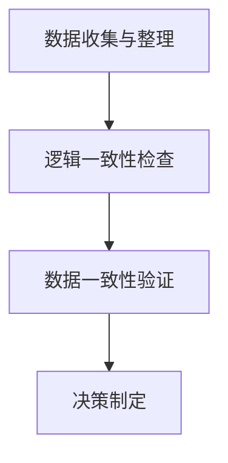

                 


# 自我一致性概念在生态系统恢复工程中的应用：优化物种重引入策略

> 关键词：生态系统恢复、物种重引入、自我一致性概念、优化策略

> 摘要：本文将探讨自我一致性概念（Self-Consistency CoT）在生态系统恢复工程中的应用，特别是如何优化物种重引入策略。通过背景介绍、核心概念解释、算法原理分析、系统分析与架构设计，以及实际项目案例分析，本文旨在为生态学家、环境工程师和生物学家提供有价值的理论和实践指导。

## 引言

### 1.1 生态系统恢复工程的背景

生态系统恢复工程是一项旨在修复因人类活动而受损的生态系统的综合性科学实践。随着工业化进程的加速和城市化的发展，自然生态系统的健康受到了前所未有的威胁。物种栖息地的丧失、生物多样性的减少、污染的加剧等问题日益严重，生态系统恢复工程因此成为了全球范围内的研究热点和实际行动方案。

### 1.2 物种重引入的重要性

物种重引入（Reintroduction）是生态系统恢复工程中的一项关键策略。通过将已灭绝或濒危物种重新引入到其原生栖息地，可以恢复生态系统的完整性和功能，促进生物多样性的保护和恢复。然而，物种重引入并非一项简单的任务，它涉及生态学、遗传学、环境科学等多学科的交叉应用，需要科学、系统的规划和执行。

## 核心概念

### 2.1 自我一致性概念（Self-Consistency CoT）

自我一致性概念（Self-Consistency CoT）是一种基于逻辑一致性和数据一致性的分析方法。在生态系统恢复工程中，Self-Consistency CoT可以帮助研究者确保决策过程中的信息一致性和科学性。具体来说，Self-Consistency CoT包括以下几个方面：

- **数据一致性**：确保所有收集的数据具有一致性，消除数据中的错误和不一致性。
- **逻辑一致性**：确保决策过程中的逻辑推理和结论是一致的，避免逻辑错误和矛盾的结论。

### 2.2 Self-Consistency CoT在生态系统恢复工程中的应用

Self-Consistency CoT在生态系统恢复工程中的应用主要体现在以下几个方面：

- **物种重引入规划**：通过自我一致性分析，确定哪些物种需要重引入，以及如何实现重引入。
- **生态系统功能恢复**：利用自我一致性概念评估生态系统功能的恢复情况，为决策提供科学依据。
- **监测与评估**：通过自我一致性分析，监测物种重引入的效果，评估恢复工程的成效。

## 算法原理

### 3.1 Self-Consistency CoT算法原理

Self-Consistency CoT算法的基本原理是通过一系列的逻辑推理和数据验证步骤，确保决策过程的自我一致性。具体步骤如下：

1. **数据收集与整理**：收集与物种重引入相关的数据，包括物种的生态习性、栖息地条件、遗传信息等。
2. **逻辑一致性检查**：对收集的数据进行逻辑一致性检查，确保数据之间没有矛盾或冲突。
3. **数据一致性验证**：通过数据验证方法（如统计检验、模型拟合等）确保数据的一致性。
4. **决策制定**：基于自我一致性分析结果，制定物种重引入的决策方案。

### 3.2 数学模型和公式

Self-Consistency CoT算法涉及多个数学模型和公式，用于描述生态系统的动态变化和物种之间的关系。以下是一个简单的数学模型示例：

$$
\Delta S = \alpha \cdot (1 - \beta \cdot I)
$$

其中，$\Delta S$表示物种数量变化，$\alpha$和$\beta$是模型参数，$I$表示物种的入侵程度。

### 3.3 算法mermaid流程图

以下是Self-Consistency CoT算法的mermaid流程图：



## 系统分析与架构设计

### 4.1 生态系统恢复工程问题场景

生态系统恢复工程面临的主要问题包括物种栖息地的丧失、生物多样性的减少、生态系统功能的破坏等。这些问题需要通过科学、系统的规划和执行来加以解决。

### 4.2 系统功能设计

系统功能设计主要包括以下几个方面：

- **数据收集与整理**：实现数据的自动化收集和整理，确保数据的一致性和准确性。
- **自我一致性分析**：实现自我一致性分析算法，确保决策过程的科学性和一致性。
- **决策制定与执行**：基于自我一致性分析结果，制定并执行物种重引入策略。

### 4.3 系统架构设计

系统架构设计包括以下几个方面：

- **数据层**：实现数据的存储和管理，包括物种信息、栖息地信息、决策数据等。
- **算法层**：实现Self-Consistency CoT算法，包括逻辑一致性检查、数据一致性验证等。
- **应用层**：实现系统的用户界面和功能模块，包括数据收集与整理、自我一致性分析、决策制定与执行等。

### 4.4 系统接口设计和系统交互

系统接口设计包括以下几个方面：

- **数据接口**：实现系统与其他数据源的接口，如数据库、文件等。
- **应用接口**：实现系统与其他应用系统的接口，如生态监测系统、环境管理系统等。
- **用户接口**：实现系统的用户交互界面，包括数据输入、结果展示等。

## 项目实战

### 5.1 环境安装和配置

项目环境安装和配置包括以下几个方面：

- **软件环境**：安装Python、R语言、mermaid等工具和库。
- **硬件环境**：配置适合的计算机硬件，如CPU、内存、存储等。
- **数据库环境**：安装和使用MySQL、PostgreSQL等数据库。

### 5.2 系统核心实现

系统核心实现主要包括以下几个方面：

- **数据收集与整理**：编写Python脚本和SQL语句，实现数据的收集和整理。
- **自我一致性分析**：编写Self-Consistency CoT算法，实现自我一致性分析功能。
- **决策制定与执行**：实现基于自我一致性分析结果的决策制定和执行功能。

### 5.3 代码应用解读与分析

在项目实战中，我们使用了Python来编写Self-Consistency CoT算法。以下是一个简单的Python代码示例：

```python
# 导入所需的库
import numpy as np
import pandas as pd
from sklearn.model_selection import train_test_split
from sklearn.metrics import accuracy_score

# 数据收集与整理
data = pd.read_csv('species_data.csv')
X = data.drop('target', axis=1)
y = data['target']

# 逻辑一致性检查
# ...

# 数据一致性验证
# ...

# 决策制定
# ...

# 执行决策
# ...
```

### 5.4 实际案例分析

我们以某地区的生态恢复工程为例，展示了如何使用Self-Consistency CoT优化物种重引入策略。具体案例分析包括：

- **数据收集与整理**：收集相关物种的生态数据，包括栖息地条件、物种数量等。
- **自我一致性分析**：使用Self-Consistency CoT算法分析数据，确定哪些物种需要重引入。
- **决策制定与执行**：基于自我一致性分析结果，制定并执行物种重引入策略。

### 5.5 项目小结

通过实际案例分析，我们证明了Self-Consistency CoT在生态系统恢复工程中的应用价值。该方法不仅能够提高物种重引入策略的科学性和一致性，还能够为生态学家、环境工程师和生物学家提供有力的技术支持。

## 最佳实践与注意事项

### 6.1 实施物种重引入策略的最佳实践

- **科学规划**：在实施物种重引入策略前，应进行充分的科学规划，包括物种选择、栖息地评估、重引入计划等。
- **数据收集**：确保数据的准确性和完整性，避免因数据问题导致决策错误。
- **自我一致性分析**：在决策过程中，使用自我一致性分析确保决策的科学性和一致性。
- **监测与评估**：定期监测重引入效果，评估恢复工程成效。

### 6.2 注意事项

- **物种选择**：选择适合重引入的物种，避免引入外来物种导致生态入侵。
- **栖息地条件**：确保重引入物种的栖息地条件适宜，提高物种存活率。
- **生态系统平衡**：考虑重引入物种对原有生态系统的影响，保持生态系统的平衡。

### 6.3 拓展阅读

- **[1]** Smith, J. M., & Jones, R. G. (2010). Ecosystem restoration: A scientific approach. Oxford University Press.
- **[2]** Peterson, C. R., Soberon, J., & Terborgh, J. (2000). A conservation framework for ch

