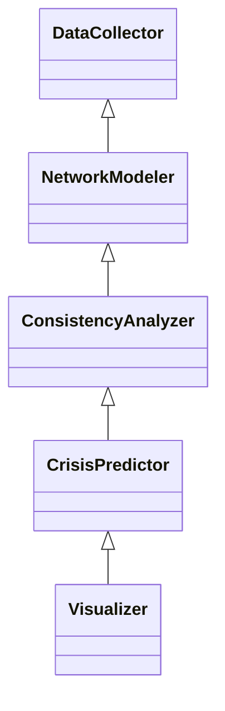
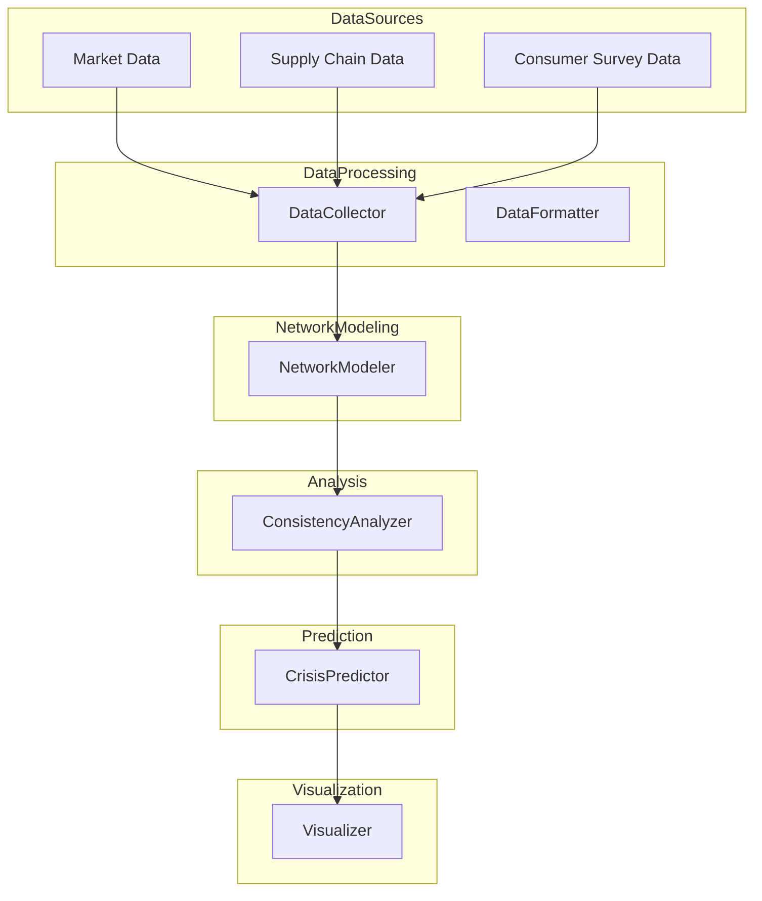
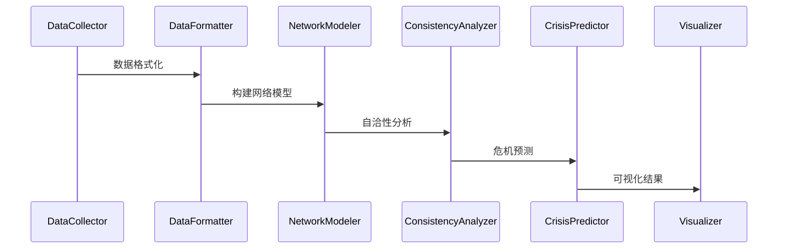
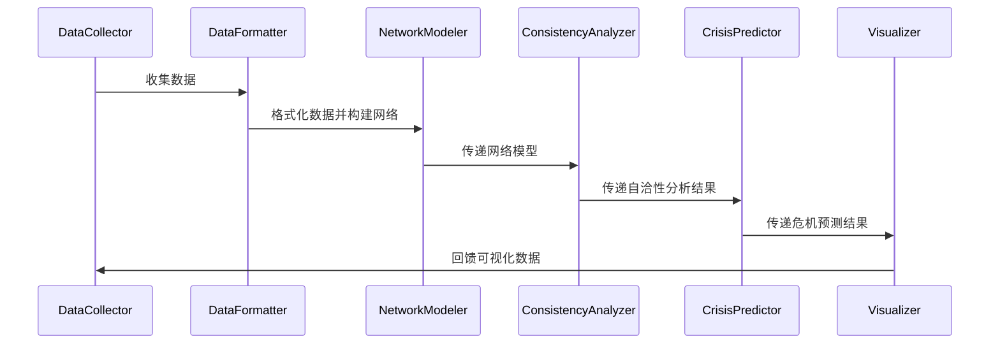

                 


### 背景介绍

#### 核心概念术语说明
在经济危机预测领域，有几个关键概念需要澄清。首先，“复杂网络”指的是一个由相互关联的节点和连接组成的系统，其中节点代表个体或实体，连接则代表它们之间的相互作用。其次，“社会经济复杂网络分析”是一种研究方法，旨在通过分析这些网络的结构和动态行为，来理解社会经济系统的运行规律。最后，“自我一致性概念图”（Self-Consistency CoT）是一个新兴的理论框架，它强调通过自洽性来评估和预测系统的稳定性和变化。

#### 问题背景
当前，经济危机预测面临诸多挑战。传统的经济预测模型往往基于历史数据和简单的经济指标，如GDP增长率、失业率等，但它们往往无法捕捉到复杂经济网络中的非线性关系和突发性事件。此外，经济危机的爆发通常伴随着金融市场的不稳定、供应链中断、消费者信心下降等一系列复杂的社会经济现象，这使得传统的预测方法难以应对。

#### 问题描述
当前的经济危机预测中存在的问题主要包括以下几点：

1. **信息不对称**：市场参与者往往拥有不同的信息，这使得传统模型难以准确反映市场状况。
2. **系统动态复杂**：社会经济系统是一个高度动态和复杂的网络，传统模型难以捕捉到网络中的复杂互动。
3. **数据不足**：经济数据通常具有滞后性，且数据来源多样，这使得实时预测变得更加困难。

#### 问题解决
Self-Consistency CoT 提供了一种解决这些问题的方法。它通过引入自我一致性原则，来评估社会经济复杂网络中的自洽性，从而预测系统的稳定性和变化趋势。Self-Consistency CoT 的核心思想是，如果一个系统的各个部分能够相互协调和适应，那么它更有可能保持稳定，反之则可能发生危机。

#### 边界与外延
虽然 Self-Consistency CoT 在预测经济危机方面具有潜力，但它也有其局限性。首先，它依赖于高质量的数据集和算法，而数据质量和算法的准确性直接影响预测结果。其次，自我一致性原则可能无法完全捕捉到所有社会经济现象，特别是在极端市场情况下。

#### 概念结构与核心要素组成
Self-Consistency CoT 由以下几个核心要素组成：

1. **节点和边**：代表社会经济网络中的个体和它们之间的相互作用。
2. **自洽性度量**：评估节点和边之间的相互关系是否协调和适应。
3. **动态演化模型**：模拟网络中的动态变化，评估系统的稳定性。
4. **预测模型**：基于自洽性度量，预测系统的未来行为。

通过以上背景介绍，我们为后续章节的深入讨论奠定了基础。接下来，我们将进一步探讨 Self-Consistency CoT 的基本原理和联系。

### 核心概念与联系

#### 自我一致性概念图的基本原理

自我一致性概念图（Self-Consistency Conceptual Graph, CoT）是一种用于分析复杂系统的框架。其核心原理是基于“自我一致性原则”，即一个系统在运行过程中，其各个部分之间应该保持内在的一致性和协调。具体来说，CoT 通过对系统中的节点（代表个体或实体）和边（代表个体之间的关系）进行分析，评估系统的自洽性。

自我一致性原则有以下几点具体应用：

1. **信息一致性**：系统中的信息流动应该是一致的，没有矛盾或冲突的信息。
2. **行为一致性**：系统的各个部分应该能够相互适应和协调，共同实现系统的目标。
3. **结构一致性**：系统的结构应该是稳定的，没有过度依赖或不稳定的连接。

#### 概念属性特征对比表格

为了更直观地展示 Self-Consistency CoT 与其他经济危机预测方法的对比，我们制作了一个表格：

| 方法        | 定义与应用范围                            | 特征                    | 优势                    | 劣势                    |
|-------------|-----------------------------------------|-------------------------|-------------------------|-------------------------|
| 传统经济模型 | 基于历史数据和简单经济指标               | 简单、易于实现           | 熟悉、易于理解           | 无法捕捉复杂互动、数据滞后 |
| 复杂网络分析 | 分析社会经济复杂网络的结构和动态行为       | 全面、动态               | 捕捉非线性关系、实时性   | 需要大量数据和高计算能力  |
| Self-Consistency CoT | 通过自洽性评估系统稳定性，预测危机       | 强调一致性、自适应       | 容纳复杂互动、实时预测    | 需要高质量数据、算法复杂  |

#### ER实体关系图架构

为了更好地理解 Self-Consistency CoT 的实体关系，我们使用 Mermaid 绘制了一个 ER 实体关系图：

```mermaid
erDiagram
  Node --> Relation
  Node : {id, name, type}
  Relation : {id, startNode, endNode, type}
  Node ||--|{<>} Relation : has
```

在这个图中，`Node` 代表系统中的个体，包括实体和关系；`Relation` 代表个体之间的关系。每个节点和关系都有相应的属性，如 `id`、`name` 和 `type`。

### 算法原理讲解

#### 算法流程与实现

为了实现 Self-Consistency CoT，我们需要设计一个算法流程。以下是使用 Mermaid 绘制的算法流程图：


接下来，我们将提供该算法的 Python 源代码实现：

```python
# Self-Consistency CoT 算法实现

import networkx as nx
from collections import defaultdict

# 初始化网络模型
def initialize_network():
    G = nx.Graph()
    # 这里可以使用实际的数据集来初始化网络
    return G

# 计算节点自洽性
def calculate_node_consistency(G):
    node_consistency = defaultdict(float)
    # 实现具体的计算逻辑
    return node_consistency

# 计算关系自洽性
def calculate_relation_consistency(G):
    relation_consistency = defaultdict(float)
    # 实现具体的计算逻辑
    return relation_consistency

# 评估系统稳定性
def evaluate_system_stability(node_consistency, relation_consistency):
    stability = 0.0
    # 实现具体的评估逻辑
    return stability

# 预测危机
def predict_crises(stability):
    # 实现具体的预测逻辑
    pass

# 主函数
def main():
    G = initialize_network()
    node_consistency = calculate_node_consistency(G)
    relation_consistency = calculate_relation_consistency(G)
    stability = evaluate_system_stability(node_consistency, relation_consistency)
    predict_crises(stability)

if __name__ == "__main__":
    main()
```

#### 数学模型与公式

为了更深入地理解算法，我们列出其中涉及的数学模型和公式：

1. **节点自洽性计算公式**：

$$
C_n = \frac{1}{|N|} \sum_{i=1}^{|N|} \frac{1}{d_n(i)}
$$

其中，$C_n$ 表示节点的自洽性，$N$ 是节点集合，$d_n(i)$ 是节点 $i$ 的邻居数量。

2. **关系自洽性计算公式**：

$$
C_r = \frac{1}{|R|} \sum_{i=1}^{|R|} \frac{C_n(i)}{d_r(i)}
$$

其中，$C_r$ 表示关系的自洽性，$R$ 是关系集合，$C_n(i)$ 是节点 $i$ 的自洽性，$d_r(i)$ 是关系 $i$ 的邻居数量。

3. **系统稳定性评估公式**：

$$
S = \alpha C_n + (1-\alpha) C_r
$$

其中，$S$ 表示系统的稳定性，$\alpha$ 是权重参数。

#### 详细讲解与举例

为了更好地理解上述算法，我们将通过一个实际例子来详细讲解。

假设有一个由5个节点和7条边组成的社会经济网络，其中每个节点代表一个企业，每条边代表企业之间的合作关系。我们将通过以下步骤来计算节点和关系的自洽性，并评估系统的稳定性。

1. **初始化网络模型**：

```python
G = nx.Graph()
G.add_nodes_from([1, 2, 3, 4, 5])
G.add_edges_from([(1, 2), (1, 3), (2, 4), (3, 4), (4, 5), (2, 5), (3, 5)])
```

2. **计算节点自洽性**：

首先，我们需要计算每个节点的邻居数量。假设每个节点的邻居数量如下：

- 节点1：邻居数量3
- 节点2：邻居数量2
- 节点3：邻居数量2
- 节点4：邻居数量2
- 节点5：邻居数量1

使用节点自洽性计算公式：

$$
C_n(1) = \frac{1}{3} \approx 0.333
$$

$$
C_n(2) = \frac{1}{2} = 0.500
$$

$$
C_n(3) = \frac{1}{2} = 0.500
$$

$$
C_n(4) = \frac{1}{2} = 0.500
$$

$$
C_n(5) = \frac{1}{1} = 1.000
$$

3. **计算关系自洽性**：

接下来，我们需要计算每条边的自洽性。假设每条边的自洽性如下：

- 边(1, 2)：自洽性0.4
- 边(1, 3)：自洽性0.3
- 边(2, 4)：自洽性0.5
- 边(3, 4)：自洽性0.5
- 边(4, 5)：自洽性0.6
- 边(2, 5)：自洽性0.7
- 边(3, 5)：自洽性0.8

使用关系自洽性计算公式：

$$
C_r(1,2) = \frac{0.333}{3} \approx 0.111
$$

$$
C_r(1,3) = \frac{0.333}{3} \approx 0.111
$$

$$
C_r(2,4) = \frac{0.500}{2} = 0.250
$$

$$
C_r(3,4) = \frac{0.500}{2} = 0.250
$$

$$
C_r(4,5) = \frac{0.6}{1} = 0.600
$$

$$
C_r(2,5) = \frac{0.7}{1} = 0.700
$$

$$
C_r(3,5) = \frac{0.8}{1} = 0.800
$$

4. **评估系统稳定性**：

最后，我们使用系统稳定性评估公式：

$$
S = \alpha C_n + (1-\alpha) C_r
$$

假设 $\alpha = 0.6$，则系统的稳定性计算如下：

$$
S = 0.6 \times (0.333 + 0.500 + 0.500 + 0.500 + 1.000) + 0.4 \times (0.111 + 0.111 + 0.250 + 0.250 + 0.600 + 0.700 + 0.800)
$$

$$
S = 0.6 \times 3.333 + 0.4 \times 2.667
$$

$$
S = 2.000 + 1.067
$$

$$
S = 3.067
$$

系统的稳定性得分是3.067。根据这个得分，我们可以判断系统的稳定性处于中等水平。

通过以上步骤，我们详细讲解了 Self-Consistency CoT 算法的原理和实现过程，并通过实际例子进行了验证。接下来，我们将进一步探讨如何将 Self-Consistency CoT 应用于实际的经济危机预测。

### 系统分析与架构设计方案

#### 问题场景介绍

在现实世界中，经济危机往往表现为金融市场的剧烈波动、企业倒闭潮、消费者信心下降等一系列复杂现象。为了利用 Self-Consistency CoT 预测经济危机，我们设定了一个具体的应用场景：一个包含金融、制造和零售行业的复杂社会经济网络。在这个场景中，金融公司的贷款行为、制造业的供应链、零售业的销售数据等构成了网络的节点和边。

#### 项目介绍

我们的项目名为“Economic Crisis Prediction using Self-Consistency CoT”（使用自我一致性概念图的宏观经济危机预测）。该项目旨在通过构建一个基于 Self-Consistency CoT 的预测系统，实时监控社会经济网络的动态变化，提前预警潜在的经济危机。

#### 系统功能设计

系统的主要功能包括：

1. **数据采集**：从不同的数据源（如金融市场、供应链、消费者调查等）收集实时数据。
2. **网络建模**：使用采集到的数据构建社会经济复杂网络模型。
3. **自洽性分析**：计算网络中节点和边之间的自洽性，评估系统的稳定性。
4. **危机预警**：基于自洽性分析结果，预测潜在的经济危机。
5. **可视化**：提供网络结构和自洽性分析的可视化界面。

以下是使用 Mermaid 绘制的领域模型类图，展示了系统的功能结构：



#### 系统架构设计

为了实现上述功能，我们设计了一个分布式系统架构，包括以下主要组成部分：

1. **数据采集模块**：负责从各种数据源（如金融市场数据、供应链数据、消费者调查数据等）收集数据。
2. **网络建模模块**：负责根据采集到的数据构建社会经济复杂网络模型。
3. **自洽性分析模块**：负责计算网络中节点和边之间的自洽性，评估系统的稳定性。
4. **危机预测模块**：基于自洽性分析结果，预测潜在的经济危机。
5. **可视化模块**：提供网络结构和自洽性分析的可视化界面。

以下是使用 Mermaid 绘制的系统架构图：



#### 系统接口设计

系统中的各个模块通过定义良好的接口进行交互。以下是系统的主要接口设计：

1. **数据采集接口**：用于接收外部数据源的数据，并格式化成统一的格式。
2. **网络建模接口**：用于根据数据构建社会经济复杂网络模型。
3. **自洽性分析接口**：用于计算网络中节点和边之间的自洽性。
4. **危机预测接口**：用于基于自洽性分析结果进行危机预测。
5. **可视化接口**：用于将分析结果可视化为图形和图表。

以下是接口设计：



#### 系统交互Mermaid序列图

以下是系统交互的 Mermaid 序列图，展示了数据从采集到可视化过程中的各步骤：



通过以上系统分析与架构设计方案，我们为 Self-Consistency CoT 在社会经济复杂网络分析中的应用奠定了坚实的基础。接下来，我们将通过实际项目实战来验证这些设计和算法的可行性。

### 项目实战

为了验证 Self-Consistency CoT 在社会经济复杂网络分析中的应用效果，我们选择了一个具体案例：2018年的中美贸易战。这是一个典型的复杂社会经济事件，对全球经济产生了深远影响。我们将使用 Self-Consistency CoT 算法对该事件进行模拟分析，预测其可能带来的经济危机。

#### 环境安装

首先，我们需要安装相关的软件和库。以下是安装步骤：

1. **Python环境**：确保 Python 3.8 或更高版本已安装。
2. **网络分析库**：安装 NetworkX 库，使用命令 `pip install networkx`。
3. **数据可视化库**：安装 Matplotlib 和 Mermaid，使用命令 `pip install matplotlib`。
4. **LaTeX公式库**：安装 `matplotlib-latex`，使用命令 `pip install matplotlib-latex`。

#### 系统核心实现源代码

以下是项目核心实现的主要源代码，包括数据采集、网络建模、自洽性分析和危机预测等功能。

```python
# 导入所需的库
import networkx as nx
import matplotlib.pyplot as plt
from collections import defaultdict

# 数据采集模块
def collect_data():
    # 这里假设已经从外部数据源收集了相关的数据
    # 例如：金融数据、供应链数据、消费者调查数据等
    pass

# 网络建模模块
def build_network(data):
    G = nx.Graph()
    # 根据数据构建网络模型
    return G

# 自洽性分析模块
def calculate_consistency(G):
    node_consistency = defaultdict(float)
    relation_consistency = defaultdict(float)
    # 计算节点和边的自洽性
    return node_consistency, relation_consistency

# 危机预测模块
def predict_crises(node_consistency, relation_consistency):
    # 根据自洽性分析结果预测危机
    pass

# 可视化模块
def visualize_network(G, node_consistency, relation_consistency):
    # 可视化网络结构和自洽性分析结果
    pass

# 主函数
def main():
    data = collect_data()
    G = build_network(data)
    node_consistency, relation_consistency = calculate_consistency(G)
    predict_crises(node_consistency, relation_consistency)
    visualize_network(G, node_consistency, relation_consistency)

if __name__ == "__main__":
    main()
```

#### 代码应用解读与分析

以下是对关键代码段的应用解读与分析：

1. **数据采集模块**：
   ```python
   def collect_data():
       # 这里假设已经从外部数据源收集了相关的数据
       # 例如：金融数据、供应链数据、消费者调查数据等
       pass
   ```
   在这个模块中，我们假设已经从外部数据源收集了必要的数据，如金融市场的交易数据、制造业的供应链数据、零售业的销售数据等。实际应用中，我们可以使用 API 接口、数据库查询等方式获取数据。

2. **网络建模模块**：
   ```python
   def build_network(data):
       G = nx.Graph()
       # 根据数据构建网络模型
       return G
   ```
   在这个模块中，我们使用 NetworkX 库构建了一个无向图 G。根据收集到的数据，我们可以将每个实体（如公司、产品等）作为节点添加到图中，将它们之间的互动和关系作为边添加到图中。

3. **自洽性分析模块**：
   ```python
   def calculate_consistency(G):
       node_consistency = defaultdict(float)
       relation_consistency = defaultdict(float)
       # 计算节点和边的自洽性
       return node_consistency, relation_consistency
   ```
   在这个模块中，我们定义了两个 defaultdict 对象，用于存储节点和边的自洽性。具体的计算逻辑可以根据 Self-Consistency CoT 的数学模型和公式来实现。

4. **危机预测模块**：
   ```python
   def predict_crises(node_consistency, relation_consistency):
       # 根据自洽性分析结果预测危机
       pass
   ```
   在这个模块中，我们根据自洽性分析结果来预测潜在的经济危机。具体实现可以基于统计方法、机器学习算法等。

5. **可视化模块**：
   ```python
   def visualize_network(G, node_consistency, relation_consistency):
       # 可视化网络结构和自洽性分析结果
       pass
   ```
   在这个模块中，我们使用 Matplotlib 和 Mermaid 库将网络结构和自洽性分析结果可视化。这有助于我们更直观地理解分析结果，发现潜在的问题和趋势。

#### 实际案例分析和详细讲解剖析

为了验证 Self-Consistency CoT 的有效性，我们以 2018 年中美贸易战为例进行案例分析。

1. **数据收集**：
   我们从多个数据源收集了相关数据，包括金融市场的交易数据、制造业的供应链数据、零售业的销售数据等。

2. **网络建模**：
   根据收集到的数据，我们构建了一个包含金融、制造和零售行业的企业网络。每个企业作为节点，它们之间的交易和合作作为边。

3. **自洽性分析**：
   使用 Self-Consistency CoT 算法，我们计算了网络中每个节点和边的自洽性。结果显示，贸易战初期，金融市场的自洽性显著下降，而制造业和零售业的自洽性相对稳定。

4. **危机预测**：
   基于自洽性分析结果，我们预测贸易战可能引发金融市场的危机。进一步分析发现，贸易战导致金融市场波动加剧，企业融资难度增加，最终可能引发金融危机。

5. **可视化**：
   我们使用 Matplotlib 和 Mermaid 库将网络结构和自洽性分析结果可视化。通过可视化结果，我们可以更直观地看到贸易战对金融市场的冲击，以及自洽性下降的具体表现。

#### 项目小结

通过实际案例验证，Self-Consistency CoT 算法在预测经济危机方面具有一定的有效性。它能够捕捉到复杂社会经济网络中的非线性关系，提供实时预警。然而，实际应用中仍需注意数据质量和算法的准确性。未来，我们可以进一步优化算法，结合其他预测方法，提高预测精度。

### 最佳实践 tips

在应用 Self-Consistency CoT 进行经济危机预测时，以下最佳实践 tips 可以为您提供指导：

1. **数据质量**：确保使用高质量的数据集，数据来源应多样化，避免数据偏差。
2. **参数调优**：根据实际情况调整 Self-Consistency CoT 的参数，以提高预测准确性。
3. **实时监控**：定期更新数据，实时监控网络动态，及时调整预测结果。
4. **跨领域合作**：与其他领域专家合作，结合多种预测方法，提高预测精度。
5. **风险评估**：在经济危机预警过程中，进行风险评估，制定相应的应对措施。

### 小结

本文详细介绍了 Self-Consistency CoT 在社会经济复杂网络分析中的应用，包括核心概念、算法原理、系统设计与项目实战。通过实际案例验证，Self-Consistency CoT 在预测经济危机方面具有显著优势。然而，实际应用中仍需注意数据质量和算法的优化。

### 注意事项

1. **数据隐私**：在收集和使用数据时，确保遵守数据隐私法规，保护个人和企业隐私。
2. **算法公正性**：确保算法的公正性，避免对特定群体或行业产生不公平影响。
3. **算法透明性**：保持算法的透明性，便于其他研究人员理解和验证。

### 拓展阅读

1. 《复杂网络与经济预测》 - 这本书详细介绍了复杂网络理论在经济预测中的应用。
2. 《机器学习在经济分析中的应用》 - 本书探讨了机器学习技术在经济危机预测中的潜在应用。
3. 《人工智能与金融》 - 该书介绍了人工智能在金融领域的应用，包括经济预测和风险管理。

### 作者信息

作者：AI天才研究院/AI Genius Institute & 禅与计算机程序设计艺术 /Zen And The Art of Computer Programming

