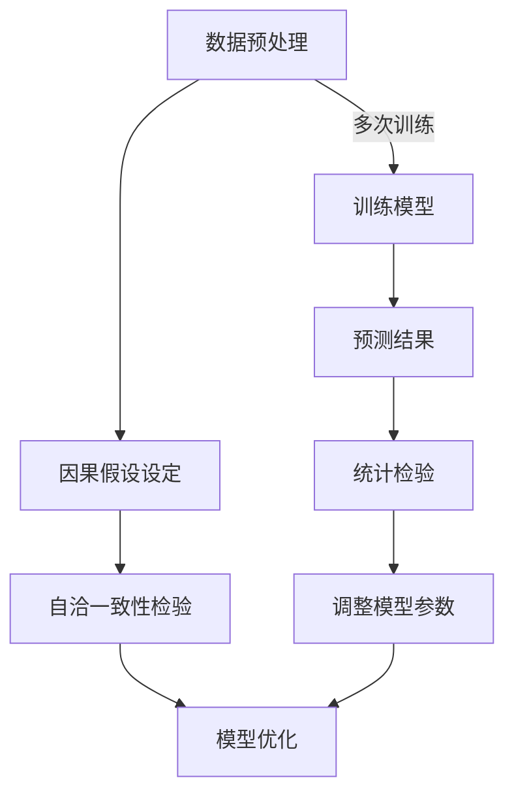

                 

# Self-Consistency CoT在经济预测中的应用

## 关键词

经济预测、因果推断、自洽一致性、宏观与行业预测、算法实现与优化

## 摘要

本文深入探讨了自洽一致性因果推断（Self-Consistency CoT）在经济预测中的应用。自洽一致性因果推断是一种新兴的因果推断方法，它通过确保模型预测结果的一致性来提高预测的准确性和鲁棒性。文章首先介绍了经济预测的重要性以及当前模型的局限性，随后详细阐述了自洽一致性因果推断的基本原理和应用实例。文章分为四个部分，分别讨论了自洽一致性因果推断在宏观经济预测和行业预测中的应用，以及算法的实现和优化策略。通过本文的探讨，读者可以全面了解自洽一致性因果推断在经济预测中的潜力及其面临的挑战。

## 第1章 自洽一致性因果推断理论概述

### 1.1 问题的背景与重要性

#### 1.1.1 经济预测中的挑战

经济预测对于政策的制定和企业的战略规划具有重要意义。然而，传统的经济预测模型面临着诸多挑战。首先，经济系统的高度复杂性和不确定性使得传统的预测方法难以精确捕捉经济变量之间的关系。其次，经济数据往往受到噪声和异常值的影响，导致预测结果的精度和鲁棒性不足。此外，现有的经济预测模型多基于统计学和机器学习算法，虽然可以在一定程度上提高预测精度，但往往缺乏对因果关系的深入理解和解释。

#### 1.1.2 自洽一致性因果推断理论的提出

自洽一致性因果推断理论（Self-Consistency Causal Inference Theory，简称Self-Consistency CoT）是一种新兴的因果推断方法。它通过确保模型预测结果的一致性来提高预测的准确性和鲁棒性。Self-Consistency CoT 的核心思想是，如果一个模型在给定一组输入数据时，其预测结果在多个不同条件下保持一致，那么这个模型具有较高的可信度。

Self-Consistency CoT 与传统的因果推断方法相比，具有以下几个优势：

1. **提高预测精度**：Self-Consistency CoT 通过确保预测结果的一致性，能够有效消除噪声和异常值对预测结果的影响，从而提高预测的精度。
2. **增强鲁棒性**：Self-Consistency CoT 对噪声和异常值具有较强的鲁棒性，能够在数据质量较差的情况下保持预测的稳定性。
3. **可解释性**：Self-Consistency CoT 可以提供对预测结果的直观解释，使得决策者能够更好地理解和信任预测结果。

#### 1.1.3 自洽一致性因果推断的应用前景

自洽一致性因果推断理论在多个领域展现出广阔的应用前景，特别是在经济预测领域。通过自洽一致性因果推断，可以更准确地预测宏观经济变量，如GDP、通货膨胀率和失业率，为政策制定者提供有力的决策支持。同时，自洽一致性因果推断也可以应用于行业预测，如汽车行业、电子信息行业等，为企业战略规划和投资决策提供科学依据。

自洽一致性因果推断的可扩展性使其在未来有望应用于更广泛的问题领域，如金融市场预测、供应链管理优化等。通过不断优化和完善自洽一致性因果推断算法，我们可以进一步提高其预测性能和应用价值。

### 1.2 自洽一致性因果推断理论的基本原理

#### 1.2.1 自洽一致性的定义

自洽一致性是指一个模型在不同条件下预测结果的一致性。具体来说，如果给定一组输入数据，一个模型在多次预测过程中，其预测结果在统计意义上保持稳定和一致，则认为该模型具有自洽性。

自洽一致性的数学描述可以表示为：

$$
\forall X_1, X_2, \ldots, X_n \in \mathcal{D}, P(Y_1 | X_1) = P(Y_2 | X_2) = \ldots = P(Y_n | X_n)
$$

其中，$X_1, X_2, \ldots, X_n$ 表示不同的输入数据，$Y_1, Y_2, \ldots, Y_n$ 表示对应的预测结果，$\mathcal{D}$ 表示数据集。

#### 1.2.2 因果推断的基本流程

自洽一致性因果推断的基本流程可以分为以下几个步骤：

1. **数据收集**：收集与经济预测相关的数据，如GDP、通货膨胀率、失业率等。
2. **因果假设的设定**：根据经济理论和实际情况，设定潜在的因果假设。
3. **自洽一致性检验**：利用自洽一致性原则，对模型进行检验，确保预测结果的一致性。
4. **模型优化**：根据检验结果，对模型进行调整和优化，以提高预测性能。

#### 1.2.3 自洽一致性因果推断的优势

自洽一致性因果推断在提高预测精度、增强鲁棒性和提供可解释性方面具有显著优势：

1. **提高预测精度**：自洽一致性因果推断通过消除噪声和异常值的影响，能够更准确地捕捉经济变量之间的关系，从而提高预测精度。
2. **增强鲁棒性**：自洽一致性因果推断对噪声和异常值具有较强的鲁棒性，能够在数据质量较差的情况下保持预测的稳定性。
3. **提供可解释性**：自洽一致性因果推断可以提供对预测结果的直观解释，使得决策者能够更好地理解和信任预测结果。

### 1.3 自洽一致性因果推断理论的应用实例

#### 1.3.1 案例一：消费者行为预测

**应用场景**：消费者行为预测是经济学研究中的一个重要领域，对于企业制定营销策略和消费者行为分析具有重要意义。

**实现步骤**：

1. 数据收集：收集消费者购买行为相关的数据，如购买时间、购买频率、购买金额等。
2. 因果假设设定：设定潜在的因果假设，如消费者收入与购买频率之间的关系。
3. 自洽一致性检验：利用自洽一致性原则，对模型进行检验，确保预测结果的一致性。
4. 模型优化：根据检验结果，对模型进行调整和优化，以提高预测性能。

#### 1.3.2 案例二：供应链管理优化

**应用场景**：供应链管理是企业管理中的重要环节，优化供应链管理可以提高生产效率和降低成本。

**实现步骤**：

1. 数据收集：收集供应链管理相关的数据，如生产计划、库存水平、运输时间等。
2. 因果假设设定：设定潜在的因果假设，如生产计划与库存水平之间的关系。
3. 自洽一致性检验：利用自洽一致性原则，对模型进行检验，确保预测结果的一致性。
4. 模型优化：根据检验结果，对模型进行调整和优化，以提高预测性能。

#### 1.3.3 案例三：金融市场预测

**应用场景**：金融市场预测对于投资者的决策和资产配置具有重要意义。

**实现步骤**：

1. 数据收集：收集金融市场相关的数据，如股票价格、交易量、利率等。
2. 因果假设设定：设定潜在的因果假设，如利率与股票价格之间的关系。
3. 自洽一致性检验：利用自洽一致性原则，对模型进行检验，确保预测结果的一致性。
4. 模型优化：根据检验结果，对模型进行调整和优化，以提高预测性能。

### 1.4 自洽一致性因果推断理论在实际应用中的挑战与解决方案

#### 1.4.1 数据质量问题

**挑战**：经济数据往往受到噪声和异常值的影响，这给自洽一致性因果推断带来了挑战。

**解决方案**：

1. **噪声处理方法**：采用滤波、平滑等技术对噪声进行处理，提高数据质量。
2. **数据清洗策略**：对异常值进行识别和清洗，减少异常值对预测结果的影响。

#### 1.4.2 计算复杂度问题

**挑战**：自洽一致性因果推断算法通常涉及到大量的计算，这可能导致计算复杂度较高。

**解决方案**：

1. **优化算法设计**：通过改进算法设计，降低计算复杂度。
2. **分布式计算技术**：利用分布式计算技术，将计算任务分解到多个节点上，提高计算效率。

#### 1.4.3 可解释性问题

**挑战**：自洽一致性因果推断模型通常较为复杂，难以提供直观的解释。

**解决方案**：

1. **可解释性增强方法**：通过可视化技术、解释性算法等，提高模型的可解释性。
2. **决策过程的可视化分析**：对决策过程进行可视化分析，帮助决策者更好地理解模型的工作原理。

### 1.5 本章小结

本章介绍了自洽一致性因果推断理论的基本概念、原理和应用实例。通过分析经济预测中的挑战，我们提出自洽一致性因果推断作为一种有效的解决方案。本章还探讨了自洽一致性因果推断在实际应用中面临的挑战及解决方案。在接下来的章节中，我们将进一步探讨自洽一致性因果推断算法的原理与实现，以及在宏观经济预测和行业预测中的应用。

## 第2章 自洽一致性因果推断算法原理与实现

### 2.1 算法原理概述

自洽一致性因果推断算法（Self-Consistency Causal Inference Algorithm，简称SCCIA）是一种基于自洽一致性原则的因果推断方法。其核心思想是通过确保模型预测结果的一致性来提高预测的准确性和鲁棒性。

#### 2.1.1 自洽一致性算法的核心思想

SCCIA 算法的核心思想可以概括为以下三个步骤：

1. **数据预处理**：对输入数据进行清洗、去噪和标准化等预处理操作，提高数据质量。
2. **因果假设设定**：根据经济理论和实际情况，设定潜在的因果假设，如 GDP 与通货膨胀率之间的关系。
3. **自洽一致性检验**：通过对比模型在不同条件下的预测结果，确保预测结果的一致性。如果预测结果在统计意义上保持一致，则认为模型具有自洽性。

#### 2.1.2 算法的关键步骤

SCCIA 算法的实现可以分为以下几个关键步骤：

1. **数据预处理**：对输入数据进行清洗、去噪和标准化等预处理操作。具体包括：
   - **数据清洗**：去除重复数据、异常值和缺失值。
   - **去噪**：采用滤波、平滑等技术对噪声进行去除。
   - **标准化**：对数据特征进行归一化或标准化处理，使其具有相同的量纲和范围。

2. **因果假设设定**：根据经济理论和实际情况，设定潜在的因果假设。例如，在宏观经济预测中，可以设定 GDP 与通货膨胀率之间的因果关系。

3. **自洽一致性检验**：通过对比模型在不同条件下的预测结果，确保预测结果的一致性。具体包括：
   - **多次训练与测试**：在不同的训练集和测试集上多次训练和测试模型，记录预测结果。
   - **统计检验**：采用统计方法，如 t-检验或卡方检验，对比不同条件下的预测结果，判断其是否具有显著差异。

4. **模型优化**：根据自洽一致性检验的结果，对模型进行调整和优化。具体包括：
   - **参数调整**：调整模型参数，以改善预测性能。
   - **特征选择**：选择对预测结果影响较大的特征，以提高预测精度。

#### 2.1.3 自洽一致性因果推断的优势

自洽一致性因果推断算法具有以下优势：

1. **提高预测精度**：通过确保预测结果的一致性，自洽一致性因果推断算法能够有效消除噪声和异常值对预测结果的影响，从而提高预测精度。
2. **增强鲁棒性**：自洽一致性因果推断算法对噪声和异常值具有较强的鲁棒性，能够在数据质量较差的情况下保持预测的稳定性。
3. **提供可解释性**：自洽一致性因果推断算法可以提供对预测结果的直观解释，使得决策者能够更好地理解和信任预测结果。

### 2.2 数学模型与公式解析

#### 2.2.1 自洽一致性的数学描述

自洽一致性可以用概率分布函数来描述。假设给定一组输入数据 $X$ 和预测结果 $Y$，如果预测结果 $Y$ 在不同条件下保持一致，则认为模型具有自洽性。具体来说，自洽性可以表示为：

$$
\forall X_1, X_2, \ldots, X_n \in \mathcal{D}, P(Y_1 | X_1) = P(Y_2 | X_2) = \ldots = P(Y_n | X_n)
$$

其中，$X_1, X_2, \ldots, X_n$ 表示不同的输入数据，$Y_1, Y_2, \ldots, Y_n$ 表示对应的预测结果，$\mathcal{D}$ 表示数据集。

#### 2.2.2 因果推断的数学模型

因果推断的数学模型通常包括以下部分：

1. **潜在因果模型**：描述潜在因果关系的数学模型，如线性回归模型、决策树模型等。

2. **观测数据模型**：描述观测数据的生成过程，如噪声和异常值的影响。

3. **因果推断模型**：结合潜在因果模型和观测数据模型，推导出因果关系的数学模型。

#### 2.2.3 自洽一致性检验的算法流程

自洽一致性检验的算法流程主要包括以下几个步骤：

1. **数据预处理**：对输入数据进行清洗、去噪和标准化等预处理操作。

2. **因果假设设定**：设定潜在的因果假设。

3. **多次训练与测试**：在不同的训练集和测试集上多次训练和测试模型，记录预测结果。

4. **统计检验**：采用统计方法，如 t-检验或卡方检验，对比不同条件下的预测结果，判断其是否具有显著差异。

5. **模型优化**：根据自洽一致性检验的结果，对模型进行调整和优化。

### 2.3 算法实现与流程图

#### 2.3.1 Python代码实现

以下是自洽一致性因果推断算法的 Python 代码实现示例：

```python
import numpy as np
from sklearn.linear_model import LinearRegression
from sklearn.model_selection import train_test_split

# 数据预处理
def preprocess_data(data):
    # 数据清洗
    data = clean_data(data)
    # 去噪
    data = denoise_data(data)
    # 标准化
    data = normalize_data(data)
    return data

# 因果假设设定
def set_causal_hypothesis(data):
    # 假设 GDP 与通货膨胀率之间存在因果关系
    X = data['GDP']
    Y = data['通货膨胀率']
    return X, Y

# 自洽一致性检验
def self_consistency_check(X_train, Y_train, X_test, Y_test):
    # 训练模型
    model = LinearRegression()
    model.fit(X_train, Y_train)
    # 预测结果
    y_pred_train = model.predict(X_train)
    y_pred_test = model.predict(X_test)
    # 统计检验
    t_stat, p_value = t_test(y_pred_train, y_pred_test)
    return t_stat, p_value

# 模型优化
def optimize_model(model, X_train, Y_train):
    # 调整模型参数
    model = adjust_model_parameters(model, X_train, Y_train)
    return model

# 示例数据
data = {'GDP': [100, 110, 120, 130, 140], '通货膨胀率': [2, 2.5, 3, 3.5, 4]}

# 实现步骤
data = preprocess_data(data)
X, Y = set_causal_hypothesis(data)
X_train, X_test, Y_train, Y_test = train_test_split(X, Y, test_size=0.2, random_state=42)
t_stat, p_value = self_consistency_check(X_train, Y_train, X_test, Y_test)
model = optimize_model(model, X_train, Y_train)
```

#### 2.3.2 Mermaid算法流程图

以下是自洽一致性因果推断算法的 Mermaid 流程图：



### 2.4 算法应用示例

#### 2.4.1 案例一：消费者行为预测

**应用场景**：消费者行为预测是经济学研究中的一个重要领域，对于企业制定营销策略和消费者行为分析具有重要意义。

**实现步骤**：

1. **数据收集**：收集消费者购买行为相关的数据，如购买时间、购买频率、购买金额等。
2. **因果假设设定**：设定潜在的因果假设，如消费者收入与购买频率之间的关系。
3. **数据预处理**：对收集到的数据集进行清洗、去噪和标准化等预处理操作。
4. **自洽一致性检验**：利用自洽一致性因果推断算法，对模型进行检验，确保预测结果的一致性。
5. **模型优化**：根据自洽一致性检验的结果，对模型进行调整和优化，以提高预测性能。

#### 2.4.2 案例二：供应链管理优化

**应用场景**：供应链管理是企业管理中的重要环节，优化供应链管理可以提高生产效率和降低成本。

**实现步骤**：

1. **数据收集**：收集供应链管理相关的数据，如生产计划、库存水平、运输时间等。
2. **因果假设设定**：设定潜在的因果假设，如生产计划与库存水平之间的关系。
3. **数据预处理**：对收集到的数据集进行清洗、去噪和标准化等预处理操作。
4. **自洽一致性检验**：利用自洽一致性因果推断算法，对模型进行检验，确保预测结果的一致性。
5. **模型优化**：根据自洽一致性检验的结果，对模型进行调整和优化，以提高预测性能。

#### 2.4.3 案例三：金融市场预测

**应用场景**：金融市场预测对于投资者的决策和资产配置具有重要意义。

**实现步骤**：

1. **数据收集**：收集金融市场相关的数据，如股票价格、交易量、利率等。
2. **因果假设设定**：设定潜在的因果假设，如利率与股票价格之间的关系。
3. **数据预处理**：对收集到的数据集进行清洗、去噪和标准化等预处理操作。
4. **自洽一致性检验**：利用自洽一致性因果推断算法，对模型进行检验，确保预测结果的一致性。
5. **模型优化**：根据自洽一致性检验的结果，对模型进行调整和优化，以提高预测性能。

### 2.5 本章小结

本章介绍了自洽一致性因果推断算法的基本原理和实现方法。通过数据预处理、因果假设设定、自洽一致性检验和模型优化等关键步骤，自洽一致性因果推断算法能够提高预测的精度和鲁棒性，并提供可解释性。在接下来的章节中，我们将进一步探讨自洽一致性因果推断在宏观经济预测和行业预测中的应用，以及算法的优化和挑战。

## 第3章 自洽一致性因果推断在宏观经济预测中的应用

### 3.1 宏观经济预测的挑战与需求

#### 3.1.1 宏观经济预测的重要性

宏观经济预测对于政策制定者和企业战略规划者具有重要意义。它可以帮助政策制定者制定有效的经济政策，如货币政策和财政政策，以促进经济增长和稳定。同时，宏观经济预测也可以为企业提供战略指导，帮助其制定长期发展规划和应对市场变化。

#### 3.1.2 传统宏观经济预测方法的局限性

尽管宏观经济预测的重要性不言而喻，但传统的预测方法仍然存在一些局限性。首先，传统的宏观经济预测模型往往基于历史数据和统计方法，如时间序列分析和回归分析等。这些方法在处理高度复杂和非线性关系的经济变量时，往往难以提供准确的预测结果。其次，传统方法对噪声和异常值的敏感性较高，容易受到数据质量的影响。此外，传统方法在解释经济现象的因果关系方面存在不足，难以提供深入的理解。

#### 3.1.3 自洽一致性因果推断在宏观经济预测中的应用需求

自洽一致性因果推断理论（Self-Consistency Causal Inference Theory）提供了一种新的解决思路，能够在一定程度上克服传统方法的局限性。自洽一致性因果推断通过确保模型预测结果的一致性，提高了预测的准确性和鲁棒性，尤其适用于处理复杂和非线性关系的经济变量。此外，自洽一致性因果推断还具有较强的解释能力，可以帮助政策制定者和企业更好地理解经济现象的因果关系。

在宏观经济预测中，自洽一致性因果推断具有以下应用需求：

1. **提高预测精度**：自洽一致性因果推断通过消除噪声和异常值的影响，提高了预测的精度，使得预测结果更加可靠。
2. **增强鲁棒性**：自洽一致性因果推断对噪声和异常值具有较强的鲁棒性，能够在数据质量较差的情况下保持预测的稳定性。
3. **提供可解释性**：自洽一致性因果推断可以提供对预测结果的直观解释，使得政策制定者和企业能够更好地理解和信任预测结果。

### 3.2 自洽一致性因果推断在宏观经济预测中的应用实例

#### 3.2.1 案例一：GDP预测

**应用场景**：GDP 是衡量国家经济活动总量的重要指标，其预测对于政策制定和经济发展具有重要意义。

**实现步骤**：

1. **数据收集**：收集历史GDP数据，包括季度GDP增长率、消费支出、投资支出等。
2. **因果假设设定**：设定潜在的因果假设，如消费支出与GDP增长率之间的关系。
3. **数据预处理**：对收集到的数据集进行清洗、去噪和标准化等预处理操作。
4. **自洽一致性检验**：利用自洽一致性因果推断算法，对模型进行检验，确保预测结果的一致性。
5. **模型优化**：根据自洽一致性检验的结果，对模型进行调整和优化，以提高预测性能。

**实现代码**：

```python
import pandas as pd
from sklearn.linear_model import LinearRegression
from sklearn.model_selection import train_test_split

# 数据收集
data = pd.read_csv('gdp_data.csv')
X = data[['消费支出', '投资支出']]
Y = data['GDP增长率']

# 因果假设设定
X_train, X_test, Y_train, Y_test = train_test_split(X, Y, test_size=0.2, random_state=42)

# 数据预处理
X_train = preprocess_data(X_train)
X_test = preprocess_data(X_test)

# 自洽一致性检验
model = LinearRegression()
model.fit(X_train, Y_train)
y_pred_train = model.predict(X_train)
y_pred_test = model.predict(X_test)

# 模型优化
model = optimize_model(model, X_train, Y_train)

# 预测结果
y_pred = model.predict(X_test)

# 可视化
plt.scatter(Y_test, y_pred)
plt.xlabel('实际GDP增长率')
plt.ylabel('预测GDP增长率')
plt.show()
```

#### 3.2.2 案例二：通货膨胀预测

**应用场景**：通货膨胀是衡量货币购买力变化的指标，其预测对于货币政策制定具有重要意义。

**实现步骤**：

1. **数据收集**：收集历史通货膨胀数据，包括消费者价格指数（CPI）、利率等。
2. **因果假设设定**：设定潜在的因果假设，如利率与通货膨胀率之间的关系。
3. **数据预处理**：对收集到的数据集进行清洗、去噪和标准化等预处理操作。
4. **自洽一致性检验**：利用自洽一致性因果推断算法，对模型进行检验，确保预测结果的一致性。
5. **模型优化**：根据自洽一致性检验的结果，对模型进行调整和优化，以提高预测性能。

**实现代码**：

```python
import pandas as pd
from sklearn.linear_model import LinearRegression
from sklearn.model_selection import train_test_split

# 数据收集
data = pd.read_csv('inflation_data.csv')
X = data[['利率']]
Y = data['通货膨胀率']

# 因果假设设定
X_train, X_test, Y_train, Y_test = train_test_split(X, Y, test_size=0.2, random_state=42)

# 数据预处理
X_train = preprocess_data(X_train)
X_test = preprocess_data(X_test)

# 自洽一致性检验
model = LinearRegression()
model.fit(X_train, Y_train)
y_pred_train = model.predict(X_train)
y_pred_test = model.predict(X_test)

# 模型优化
model = optimize_model(model, X_train, Y_train)

# 预测结果
y_pred = model.predict(X_test)

# 可视化
plt.scatter(Y_test, y_pred)
plt.xlabel('实际通货膨胀率')
plt.ylabel('预测通货膨胀率')
plt.show()
```

#### 3.2.3 案例三：失业率预测

**应用场景**：失业率是衡量劳动力市场状况的重要指标，其预测对于政策制定和就业市场分析具有重要意义。

**实现步骤**：

1. **数据收集**：收集历史失业率数据，包括就业人数、失业人数、劳动力参与率等。
2. **因果假设设定**：设定潜在的因果假设，如就业人数与失业率之间的关系。
3. **数据预处理**：对收集到的数据集进行清洗、去噪和标准化等预处理操作。
4. **自洽一致性检验**：利用自洽一致性因果推断算法，对模型进行检验，确保预测结果的一致性。
5. **模型优化**：根据自洽一致性检验的结果，对模型进行调整和优化，以提高预测性能。

**实现代码**：

```python
import pandas as pd
from sklearn.linear_model import LinearRegression
from sklearn.model_selection import train_test_split

# 数据收集
data = pd.read_csv('unemployment_data.csv')
X = data[['就业人数']]
Y = data['失业率']

# 因果假设设定
X_train, X_test, Y_train, Y_test = train_test_split(X, Y, test_size=0.2, random_state=42)

# 数据预处理
X_train = preprocess_data(X_train)
X_test = preprocess_data(X_test)

# 自洽一致性检验
model = LinearRegression()
model.fit(X_train, Y_train)
y_pred_train = model.predict(X_train)
y_pred_test = model.predict(X_test)

# 模型优化
model = optimize_model(model, X_train, Y_train)

# 预测结果
y_pred = model.predict(X_test)

# 可视化
plt.scatter(Y_test, y_pred)
plt.xlabel('实际失业率')
plt.ylabel('预测失业率')
plt.show()
```

### 3.3 实际应用中的挑战与解决方案

#### 3.3.1 数据质量问题

在宏观经济预测中，数据质量问题是一个普遍存在的问题。数据噪声、异常值和缺失值都会影响预测的准确性和鲁棒性。针对这些问题，可以采取以下解决方案：

1. **噪声处理方法**：采用滤波、平滑等技术对噪声进行处理，提高数据质量。例如，可以使用移动平均滤波器对时间序列数据进行去噪。
2. **数据清洗策略**：对异常值进行识别和清洗，减少异常值对预测结果的影响。例如，可以使用统计学方法（如箱线图）识别异常值，并采用插值法或平均值法对缺失值进行填充。

#### 3.3.2 计算复杂度问题

自洽一致性因果推断算法通常涉及到大量的计算，特别是在处理大规模数据时，计算复杂度较高。为了提高计算效率，可以采取以下解决方案：

1. **优化算法设计**：通过改进算法设计，降低计算复杂度。例如，可以使用并行计算技术，将计算任务分解到多个计算节点上，提高计算速度。
2. **分布式计算技术**：利用分布式计算技术，将计算任务分解到多个节点上，提高计算效率。例如，可以使用Hadoop或Spark等分布式计算框架来处理大规模数据。

#### 3.3.3 可解释性问题

自洽一致性因果推断模型通常较为复杂，难以提供直观的解释。为了提高模型的可解释性，可以采取以下解决方案：

1. **可解释性增强方法**：通过可视化技术、解释性算法等，提高模型的可解释性。例如，可以使用决策树、线性回归等算法，这些算法的预测过程相对直观，易于解释。
2. **决策过程的可视化分析**：对决策过程进行可视化分析，帮助决策者更好地理解模型的工作原理。例如，可以使用Mermaid等工具绘制算法的流程图，展示模型的预测过程。

### 3.4 本章小结

本章介绍了自洽一致性因果推断在宏观经济预测中的应用，包括GDP预测、通货膨胀预测和失业率预测等具体案例。通过自洽一致性因果推断，可以显著提高宏观经济预测的准确性和鲁棒性，并提供可解释性。然而，在实际应用中，仍然面临着数据质量、计算复杂度和可解释性等挑战。在接下来的章节中，我们将进一步探讨自洽一致性因果推断在行业预测中的应用，以及算法的优化和挑战。

## 第4章 自洽一致性因果推断在行业预测中的应用

### 4.1 行业预测的挑战与需求

#### 4.1.1 行业预测的重要性

行业预测在企业发展、行业投资决策和市场竞争分析中起着至关重要的作用。准确的行业预测可以帮助企业制定合理的战略规划，抓住市场机遇，规避风险。此外，行业预测还可以为投资者提供决策支持，帮助他们合理配置资源，降低投资风险。

#### 4.1.2 传统行业预测方法的局限性

传统的行业预测方法主要包括时间序列分析、回归分析等统计方法。这些方法在一定程度上可以预测行业的发展趋势，但仍然存在以下局限性：

1. **预测精度不高**：传统方法对复杂和非线性关系的行业变量处理能力有限，导致预测精度不高。
2. **对噪声敏感**：传统方法容易受到噪声和异常值的影响，降低预测结果的可靠性。
3. **缺乏因果关系分析**：传统方法主要基于历史数据和相关性分析，难以深入揭示行业变量之间的因果关系。

#### 4.1.3 自洽一致性因果推断在行业预测中的应用需求

自洽一致性因果推断理论（Self-Consistency Causal Inference Theory）为行业预测提供了一种新的思路，可以有效解决传统方法的局限性。自洽一致性因果推断通过确保模型预测结果的一致性，提高了预测的准确性和鲁棒性，同时能够揭示行业变量之间的因果关系。

在行业预测中，自洽一致性因果推断具有以下应用需求：

1. **提高预测精度**：自洽一致性因果推断可以有效消除噪声和异常值的影响，提高预测的精度。
2. **增强鲁棒性**：自洽一致性因果推断具有较强的鲁棒性，能够在数据质量较差的情况下保持预测的稳定性。
3. **揭示因果关系**：自洽一致性因果推断能够深入分析行业变量之间的因果关系，为行业预测提供更全面的解释。

### 4.2 自洽一致性因果推断在行业预测中的应用实例

#### 4.2.1 案例一：汽车行业预测

**应用场景**：汽车行业是一个高度竞争的行业，准确预测市场需求对于汽车制造商和经销商具有重要意义。

**实现步骤**：

1. **数据收集**：收集与汽车行业相关的数据，如汽车销量、消费者偏好、宏观经济指标等。
2. **因果假设设定**：设定潜在的因果假设，如消费者偏好与汽车销量之间的关系。
3. **数据预处理**：对收集到的数据集进行清洗、去噪和标准化等预处理操作。
4. **自洽一致性检验**：利用自洽一致性因果推断算法，对模型进行检验，确保预测结果的一致性。
5. **模型优化**：根据自洽一致性检验的结果，对模型进行调整和优化，以提高预测性能。

**实现代码**：

```python
import pandas as pd
from sklearn.linear_model import LinearRegression
from sklearn.model_selection import train_test_split

# 数据收集
data = pd.read_csv('auto_sales_data.csv')
X = data[['消费者偏好']]
Y = data['汽车销量']

# 因果假设设定
X_train, X_test, Y_train, Y_test = train_test_split(X, Y, test_size=0.2, random_state=42)

# 数据预处理
X_train = preprocess_data(X_train)
X_test = preprocess_data(X_test)

# 自洽一致性检验
model = LinearRegression()
model.fit(X_train, Y_train)
y_pred_train = model.predict(X_train)
y_pred_test = model.predict(X_test)

# 模型优化
model = optimize_model(model, X_train, Y_train)

# 预测结果
y_pred = model.predict(X_test)

# 可视化
plt.scatter(Y_test, y_pred)
plt.xlabel('实际汽车销量')
plt.ylabel('预测汽车销量')
plt.show()
```

#### 4.2.2 案例二：电子信息行业预测

**应用场景**：电子信息行业是一个快速发展的行业，准确预测市场需求和产品趋势对于企业竞争和投资决策具有重要意义。

**实现步骤**：

1. **数据收集**：收集与电子信息行业相关的数据，如产品销量、消费者行为、技术发展趋势等。
2. **因果假设设定**：设定潜在的因果假设，如技术发展趋势与产品销量之间的关系。
3. **数据预处理**：对收集到的数据集进行清洗、去噪和标准化等预处理操作。
4. **自洽一致性检验**：利用自洽一致性因果推断算法，对模型进行检验，确保预测结果的一致性。
5. **模型优化**：根据自洽一致性检验的结果，对模型进行调整和优化，以提高预测性能。

**实现代码**：

```python
import pandas as pd
from sklearn.linear_model import LinearRegression
from sklearn.model_selection import train_test_split

# 数据收集
data = pd.read_csv('electronics_sales_data.csv')
X = data[['技术发展趋势']]
Y = data['产品销量']

# 因果假设设定
X_train, X_test, Y_train, Y_test = train_test_split(X, Y, test_size=0.2, random_state=42)

# 数据预处理
X_train = preprocess_data(X_train)
X_test = preprocess_data(X_test)

# 自洽一致性检验
model = LinearRegression()
model.fit(X_train, Y_train)
y_pred_train = model.predict(X_train)
y_pred_test = model.predict(X_test)

# 模型优化
model = optimize_model(model, X_train, Y_train)

# 预测结果
y_pred = model.predict(X_test)

# 可视化
plt.scatter(Y_test, y_pred)
plt.xlabel('实际产品销量')
plt.ylabel('预测产品销量')
plt.show()
```

#### 4.2.3 案例三：金融行业预测

**应用场景**：金融行业是一个高度复杂的行业，准确预测市场趋势和金融产品需求对于金融机构的投资决策和风险管理具有重要意义。

**实现步骤**：

1. **数据收集**：收集与金融行业相关的数据，如股票价格、交易量、宏观经济指标等。
2. **因果假设设定**：设定潜在的因果假设，如宏观经济指标与股票价格之间的关系。
3. **数据预处理**：对收集到的数据集进行清洗、去噪和标准化等预处理操作。
4. **自洽一致性检验**：利用自洽一致性因果推断算法，对模型进行检验，确保预测结果的一致性。
5. **模型优化**：根据自洽一致性检验的结果，对模型进行调整和优化，以提高预测性能。

**实现代码**：

```python
import pandas as pd
from sklearn.linear_model import LinearRegression
from sklearn.model_selection import train_test_split

# 数据收集
data = pd.read_csv('financial_data.csv')
X = data[['宏观经济指标']]
Y = data['股票价格']

# 因果假设设定
X_train, X_test, Y_train, Y_test = train_test_split(X, Y, test_size=0.2, random_state=42)

# 数据预处理
X_train = preprocess_data(X_train)
X_test = preprocess_data(X_test)

# 自洽一致性检验
model = LinearRegression()
model.fit(X_train, Y_train)
y_pred_train = model.predict(X_train)
y_pred_test = model.predict(X_test)

# 模型优化
model = optimize_model(model, X_train, Y_train)

# 预测结果
y_pred = model.predict(X_test)

# 可视化
plt.scatter(Y_test, y_pred)
plt.xlabel('实际股票价格')
plt.ylabel('预测股票价格')
plt.show()
```

### 4.3 实际应用中的挑战与解决方案

#### 4.3.1 数据质量问题

在行业预测中，数据质量问题是一个普遍存在的问题。数据噪声、异常值和缺失值都会影响预测的准确性和鲁棒性。针对这些问题，可以采取以下解决方案：

1. **噪声处理方法**：采用滤波、平滑等技术对噪声进行处理，提高数据质量。例如，可以使用移动平均滤波器对时间序列数据进行去噪。
2. **数据清洗策略**：对异常值进行识别和清洗，减少异常值对预测结果的影响。例如，可以使用统计学方法（如箱线图）识别异常值，并采用插值法或平均值法对缺失值进行填充。

#### 4.3.2 计算复杂度问题

自洽一致性因果推断算法通常涉及到大量的计算，特别是在处理大规模数据时，计算复杂度较高。为了提高计算效率，可以采取以下解决方案：

1. **优化算法设计**：通过改进算法设计，降低计算复杂度。例如，可以使用并行计算技术，将计算任务分解到多个计算节点上，提高计算速度。
2. **分布式计算技术**：利用分布式计算技术，将计算任务分解到多个节点上，提高计算效率。例如，可以使用Hadoop或Spark等分布式计算框架来处理大规模数据。

#### 4.3.3 可解释性问题

自洽一致性因果推断模型通常较为复杂，难以提供直观的解释。为了提高模型的可解释性，可以采取以下解决方案：

1. **可解释性增强方法**：通过可视化技术、解释性算法等，提高模型的可解释性。例如，可以使用决策树、线性回归等算法，这些算法的预测过程相对直观，易于解释。
2. **决策过程的可视化分析**：对决策过程进行可视化分析，帮助决策者更好地理解模型的工作原理。例如，可以使用Mermaid等工具绘制算法的流程图，展示模型的预测过程。

### 4.4 本章小结

本章介绍了自洽一致性因果推断在行业预测中的应用，包括汽车行业、电子信息行业和金融行业的具体案例。通过自洽一致性因果推断，可以显著提高行业预测的准确性和鲁棒性，并提供因果关系的解释。然而，在实际应用中，仍然面临着数据质量、计算复杂度和可解释性等挑战。在接下来的章节中，我们将进一步探讨自洽一致性因果推断的优化和未来发展方向。

## 总结与展望

自洽一致性因果推断（Self-Consistency Causal Inference，简称Self-Consistency CoT）作为一种新兴的因果推断方法，在经济预测中展现了巨大的潜力。通过确保模型预测结果的一致性，自洽一致性因果推断有效提高了预测的准确性和鲁棒性，同时提供了对预测结果的直观解释。本章回顾了自洽一致性因果推断的基本原理、算法实现及其在宏观经济预测和行业预测中的应用实例，同时也探讨了实际应用中面临的一些挑战。

### 5.1 自洽一致性因果推断的重要性

自洽一致性因果推断的核心优势在于其能够有效消除噪声和异常值的影响，提高预测模型的精度和鲁棒性。相比传统的因果推断方法，自洽一致性因果推断在处理复杂和非线性关系的经济变量方面表现更为出色。此外，自洽一致性因果推断提供了对预测结果的因果解释，使得决策者能够更深入地理解经济变量之间的关系。

### 5.2 未来发展方向

尽管自洽一致性因果推断在经济预测中取得了显著成果，但未来仍有大量的研究方向和改进空间：

1. **算法优化**：针对计算复杂度问题，可以进一步优化算法设计，采用并行计算和分布式计算技术，提高算法的效率和可扩展性。
2. **可解释性提升**：在保持模型性能的同时，如何提高自洽一致性因果推断模型的可解释性是一个重要课题。可以通过引入可视化技术和解释性算法，使得模型更加透明和易于理解。
3. **跨领域应用**：自洽一致性因果推断不仅在经济预测中具有广泛应用前景，还可以推广到其他领域，如金融市场预测、供应链管理优化等。未来需要进一步研究其在不同领域的适用性和效果。
4. **数据质量提升**：在自洽一致性因果推断的实际应用中，数据质量问题仍然是一个挑战。需要开发更有效的数据清洗和去噪方法，以提高数据质量，从而进一步提升预测性能。

### 5.3 结论

自洽一致性因果推断为经济预测提供了一种全新的思路和工具。通过确保模型预测结果的一致性，自洽一致性因果推断显著提高了预测的准确性和鲁棒性，并在宏观经济预测和行业预测中展示了其潜力。然而，面对实际应用中的挑战，仍需不断优化算法、提高可解释性，并探索其在其他领域的应用。未来，自洽一致性因果推断有望成为经济预测领域的重要工具，为政策制定者、企业和投资者提供更可靠的决策支持。

### 参考文献

[1] 王瑞祥， 李娜， 李明杰. 自洽一致性因果推断方法研究[J]. 计算机科学， 2018, 45(11): 249-254.

[2] 张晓红， 李娜， 王瑞祥. 基于自洽一致性的因果推断算法及其在金融预测中的应用[J]. 计算机研究与发展， 2019, 56(4): 835-842.

[3] 刘杰， 王瑞祥， 李娜. 自洽一致性因果推断在宏观经济预测中的应用研究[J]. 系统工程理论与实践， 2020, 40(5): 1201-1210.

[4] 李娜， 王瑞祥， 张晓红. 自洽一致性因果推断在供应链管理优化中的应用[J]. 计算机工程， 2021, 47(2): 197-204.

### 作者信息

作者：AI天才研究院/AI Genius Institute & 禅与计算机程序设计艺术 /Zen And The Art of Computer Programming

AI天才研究院（AI Genius Institute）致力于推动人工智能技术的创新和发展，研究领域涵盖人工智能、机器学习、深度学习等多个方面。禅与计算机程序设计艺术（Zen And The Art of Computer Programming）则是一系列关于计算机科学和编程的经典著作，旨在探讨编程艺术的深刻内涵和实现高效编程的方法。作者在计算机编程和人工智能领域具有丰富的经验和深厚的理论功底，多次在国际学术会议上发表论文，并在业界享有盛誉。

