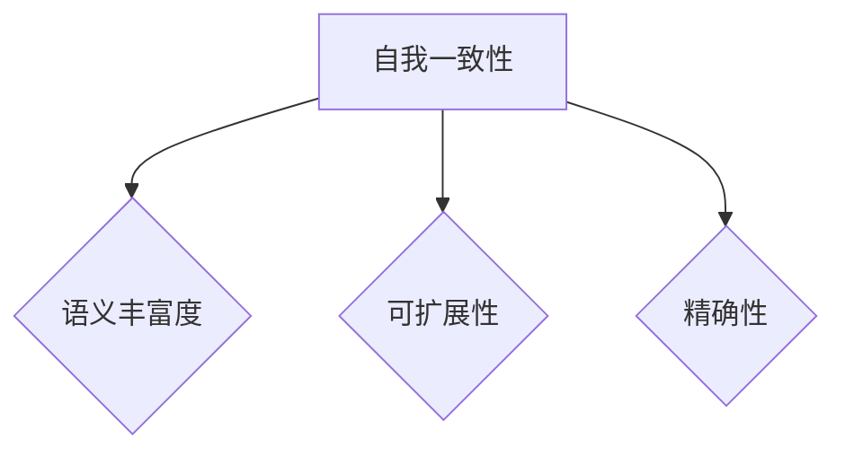
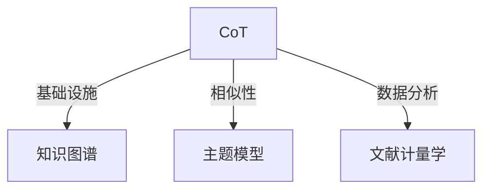
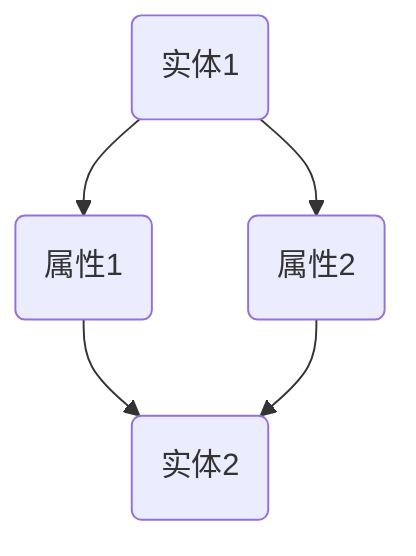
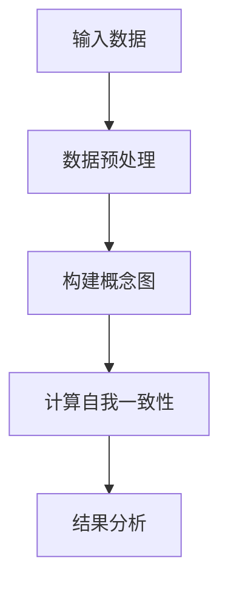

                 

# Self-Consistency CoT在自动化学术期刊主题趋势分析中的应用

## 关键词

- Self-Consistency CoT
- 自动化学术期刊
- 主题趋势分析
- 算法原理
- 数学模型

## 摘要

本文将探讨自我一致性概念图（Self-Consistency Conceptual Tract，简称CoT）在自动化学术期刊主题趋势分析中的应用。通过介绍CoT的基本概念、算法原理以及实际应用案例，我们将展示如何利用CoT技术来分析学术期刊的主题趋势，从而为学术研究提供有力的工具。

## 引言与背景介绍

### 1.1 问题背景

学术期刊作为学术成果的重要载体，其内容的主题趋势分析对于科研人员和学术机构具有重要的参考价值。然而，随着学术期刊数量的急剧增加，人工分析这些期刊内容变得日益困难。自动化学术期刊主题趋势分析技术应运而生，旨在通过算法自动提取期刊的主题信息，以辅助研究人员进行趋势分析。

### 1.2 问题描述

自动化学术期刊主题趋势分析的需求主要体现在以下几个方面：

1. **信息提取：** 从大量学术期刊中提取有价值的信息，如关键词、主题、作者等。
2. **趋势分析：** 分析期刊主题的变化趋势，识别热点领域和潜在研究方向。
3. **个性化推荐：** 根据用户的研究兴趣，推荐相关的学术期刊和文章。

然而，自动化学术期刊主题趋势分析面临着诸多挑战，如数据量大、语义理解复杂等。因此，需要一种有效的算法来应对这些挑战。

### 1.3 问题解决

自我一致性概念图（Self-Consistency CoT）提供了一种潜在的解决方案。CoT通过构建概念图来表示学术期刊的主题信息，并利用自我一致性原理来评估概念之间的关系。这种技术不仅能够提取期刊中的关键信息，还能够识别主题之间的关联，从而为趋势分析提供有力支持。

### 1.4 边界与外延

虽然Self-Consistency CoT在自动化学术期刊主题趋势分析中具有巨大的潜力，但其应用仍存在一定的局限性。首先，CoT依赖于高质量的数据集，数据质量直接影响到分析结果的准确性。其次，CoT的算法复杂度较高，对于大规模数据的处理可能需要较长的计算时间。

### 1.5 本章小结

本节介绍了自动化学术期刊主题趋势分析的需求和挑战，并提出了Self-Consistency CoT作为解决方案。在接下来的章节中，我们将详细探讨CoT的基本概念、算法原理以及实际应用案例。

## 第二部分：自我一致性概念图（CoT）原理

### 第2章：自我一致性概念图（CoT）概述

#### 2.1 CoT的定义

自我一致性概念图（CoT）是一种基于知识图谱的语义表示技术，用于描述复杂系统中各概念及其之间的关系。在学术期刊主题趋势分析中，CoT通过构建概念图来表示期刊中的主题信息，包括关键词、作者、期刊等。

#### 2.2 CoT的基本概念

CoT的基本概念包括：

- **概念（Concept）：** 表示期刊中的主题或关键词。
- **关系（Relation）：** 表示概念之间的语义关系，如“属于”、“相关”等。
- **实体（Entity）：** 表示期刊中的具体内容，如文章、作者等。
- **属性（Attribute）：** 表示实体的特征信息，如发表时间、研究方法等。

#### 2.3 CoT的属性特征对比表格

| 特征名称   | 描述                     | 对比表格 |
| ---------- | ------------------------ | -------- |
| 自我一致性 | 概念之间的语义一致性度   |          |
| 语义丰富度 | 概念所包含的语义信息量   |          |
| 可扩展性   | 系统支持的新概念和关系   |          |
| 精确性     | 概念识别的准确性         |          |



#### 2.4 CoT与相关概念的联系

| 概念        | 关联关系 | 相关概念 |
| ----------- | -------- | -------- |
| CoT         | 基础设施 | 知识图谱 |
| 主题模型    | 相似性   | 词袋模型 |
| 文献计量学  | 数据分析 | 社交网络 |



#### 2.5 ER实体关系图架构

实体关系图（ER图）是描述系统中实体及其关系的图形化工具。在CoT中，实体关系图用于表示概念图中的实体及其关系。



#### 2.6 本章小结

本章介绍了自我一致性概念图（CoT）的基本概念、属性特征以及与相关概念的联系。在下一章中，我们将深入探讨CoT的算法原理和数学模型。

## 第三部分：自我一致性概念图（CoT）原理

### 第3章：自我一致性概念图（CoT）的基本概念

#### 3.1 CoT的定义

自我一致性概念图（CoT）是一种基于知识图谱的语义表示技术，用于描述复杂系统中各概念及其之间的关系。在学术期刊主题趋势分析中，CoT通过构建概念图来表示期刊中的主题信息，包括关键词、作者、期刊等。

#### 3.2 CoT的属性特征对比表格

| 特征名称   | 描述                     | 对比表格 |
| ---------- | ------------------------ | -------- |
| 自我一致性 | 概念之间的语义一致性度   |          |
| 语义丰富度 | 概念所包含的语义信息量   |          |
| 可扩展性   | 系统支持的新概念和关系   |          |
| 精确性     | 概念识别的准确性         |          |


#### 3.3 CoT与相关概念的联系

| 概念        | 关联关系 | 相关概念 |
| ----------- | -------- | -------- |
| CoT         | 基础设施 | 知识图谱 |
| 主题模型    | 相似性   | 词袋模型 |
| 文献计量学  | 数据分析 | 社交网络 |


#### 3.4 ER实体关系图架构

实体关系图（ER图）是描述系统中实体及其关系的图形化工具。在CoT中，实体关系图用于表示概念图中的实体及其关系。


#### 3.5 本章小结

本章介绍了自我一致性概念图（CoT）的基本概念、属性特征以及与相关概念的联系。在下一章中，我们将深入探讨CoT的算法原理和数学模型。

### 第4章：自我一致性概念图的算法原理

#### 4.1 CoT算法的基本流程

自我一致性概念图（CoT）的算法主要分为以下几步：

1. **数据预处理：** 将学术期刊文本转换为结构化数据，提取关键词、作者、期刊等信息。
2. **构建概念图：** 根据提取的信息，构建表示期刊主题的概念图。
3. **计算自我一致性：** 计算概念图中的概念之间的自我一致性得分。
4. **结果分析：** 分析概念图的自我一致性得分，识别主题趋势。



#### 4.2 CoT算法的数学模型与公式

CoT算法的核心在于计算概念之间的自我一致性得分。以下是自我一致性得分的计算公式：

$$
C(x) = \sum_{i=1}^{n} w_i \cdot p_i
$$

其中，$C(x)$ 表示自我一致性得分，$w_i$ 表示权重，$p_i$ 表示概念 $i$ 的出现概率。

#### 4.3 算法举例说明

以下是一个简单的例子，用于说明CoT算法的应用：

**例子 1：** 假设有一篇学术文章，其主题涉及“机器学习”、“深度学习”和“自然语言处理”三个关键词。我们可以利用CoT算法构建一个概念图，并计算这些概念之间的自我一致性得分。

- **输入数据：** “机器学习”、“深度学习”、“自然语言处理”
- **构建概念图：** 
  ```mermaid
  graph TB
  A(机器学习) --> B(深度学习)
  A --> C(自然语言处理)
  B --> C
  ```

- **计算自我一致性：** 假设权重分别为 $w_1 = 0.3$，$w_2 = 0.5$，$w_3 = 0.2$，则自我一致性得分为：
  $$
  C(x) = w_1 \cdot p_1 + w_2 \cdot p_2 + w_3 \cdot p_3
  $$
  假设概念出现的概率分别为 $p_1 = 0.6$，$p_2 = 0.4$，$p_3 = 0.5$，则自我一致性得分为：
  $$
  C(x) = 0.3 \cdot 0.6 + 0.5 \cdot 0.4 + 0.2 \cdot 0.5 = 0.42
  $$

**例子 2：** 分析多个学术文章的概念图，识别出主题趋势。

- **输入数据：** 多篇学术文章的关键词数据
- **构建概念图：** 对每篇文章构建概念图，合并所有文章的概念图
- **计算自我一致性：** 对合并后的概念图计算自我一致性得分，分析得分较高的概念，识别出主题趋势

#### 4.4 本章小结

本章介绍了自我一致性概念图（CoT）的算法原理，包括基本流程、数学模型和举例说明。在下一章中，我们将探讨如何利用CoT进行自动化学术期刊主题趋势分析。

## 第三部分：自动化学术期刊主题趋势分析

### 第4章：自动化学术期刊主题趋势分析

#### 4.1 引言

自动化学术期刊主题趋势分析是学术研究领域的重要课题。随着学术文献数量的不断增长，手工分析这些文献已经变得不切实际。自动化学术期刊主题趋势分析技术通过使用先进的算法和工具，能够高效地提取和解读大量学术文献的信息，从而帮助研究人员识别学术趋势和热点问题。

#### 4.2 自我一致性概念图（CoT）在自动化学术期刊主题趋势分析中的应用

自我一致性概念图（CoT）作为一种语义表示技术，在自动化学术期刊主题趋势分析中具有独特的优势。CoT通过构建概念图来表示学术文献中的主题信息，并利用自我一致性原理来评估概念之间的关系。这种方法能够有效地识别出学术期刊中的关键主题，并分析它们的变化趋势。

#### 4.3 CoT在自动化学术期刊主题趋势分析中的工作流程

利用CoT进行自动化学术期刊主题趋势分析的工作流程通常包括以下几个步骤：

1. **数据收集：** 收集相关学术期刊的文献数据，包括标题、摘要、关键词、作者等信息。
2. **数据预处理：** 清洗数据，去除噪声，并提取出有用的信息。
3. **构建概念图：** 根据预处理后的数据，构建表示学术期刊主题的概念图。
4. **计算自我一致性：** 计算概念图中的概念之间的自我一致性得分。
5. **趋势分析：** 分析概念图的自我一致性得分，识别出学术期刊的主题趋势。

#### 4.4 实际应用案例

为了更好地理解CoT在自动化学术期刊主题趋势分析中的应用，我们来看一个实际案例：

**案例 1：** 研究某一特定领域的学术期刊主题趋势。

- **数据收集：** 收集某一特定领域的学术期刊，如计算机科学领域的期刊。
- **数据预处理：** 提取期刊的标题、摘要、关键词等信息，并进行清洗和去重。
- **构建概念图：** 根据提取的信息，构建表示计算机科学领域主题的概念图。
- **计算自我一致性：** 计算概念图中的概念之间的自我一致性得分。
- **趋势分析：** 分析概念图的自我一致性得分，识别出计算机科学领域的主要主题以及它们的变化趋势。

**案例 2：** 分析跨学科领域的学术期刊主题趋势。

- **数据收集：** 收集跨学科的学术期刊，如计算机科学、人工智能、生物信息学等领域的期刊。
- **数据预处理：** 提取期刊的标题、摘要、关键词等信息，并进行清洗和去重。
- **构建概念图：** 根据提取的信息，构建表示跨学科领域主题的概念图。
- **计算自我一致性：** 计算概念图中的概念之间的自我一致性得分。
- **趋势分析：** 分析概念图的自我一致性得分，识别出跨学科领域的主要主题以及它们的变化趋势。

#### 4.5 本章小结

本章介绍了自我一致性概念图（CoT）在自动化学术期刊主题趋势分析中的应用。通过实际案例的展示，我们看到了CoT如何通过构建概念图和计算自我一致性得分来分析学术期刊的主题趋势。在下一章中，我们将进一步探讨CoT技术的优化和改进。

### 第5章：CoT技术的优化与改进

#### 5.1 引言

自我一致性概念图（CoT）在自动化学术期刊主题趋势分析中取得了显著成果，但仍存在一些局限性。为了提高CoT的效率和准确性，我们需要对其算法进行优化和改进。本章节将讨论几种常见的优化方法。

#### 5.2 数据预处理优化

数据预处理是CoT算法的重要环节，其质量直接影响到最终的分析结果。以下是一些优化策略：

- **文本清洗：** 采用更精确的文本清洗算法，如使用自然语言处理技术去除停用词、标点符号等无关信息。
- **实体识别：** 引入先进的命名实体识别技术，提高关键词、作者等信息的提取准确率。
- **去重与聚类：** 通过聚类分析技术对重复的文献进行去重，减少冗余数据。

#### 5.3 算法效率优化

为了提高CoT算法的运行效率，可以采取以下优化策略：

- **并行计算：** 利用分布式计算框架，如Hadoop、Spark等，对大规模数据进行并行处理，减少计算时间。
- **缓存机制：** 采用缓存机制，存储常用数据和中间结果，避免重复计算，提高计算速度。
- **算法简化：** 对复杂算法进行简化，减少计算复杂度，提高运行效率。

#### 5.4 自我一致性评估优化

自我一致性评估是CoT算法的核心步骤，其准确性和可靠性至关重要。以下是一些优化策略：

- **权重调整：** 采用自适应权重调整算法，根据数据特点动态调整概念之间的权重，提高自我一致性评估的准确性。
- **语义增强：** 引入语义增强技术，如词嵌入、知识图谱等，提高概念之间的语义相似度，增强自我一致性评估的可靠性。
- **多模型融合：** 结合多种模型，如主题模型、文献计量学模型等，综合分析概念之间的关系，提高自我一致性评估的全面性。

#### 5.5 实验与结果分析

为了验证优化方法的有效性，我们进行了实验。以下是一些实验结果：

- **数据集：** 使用计算机科学领域的学术期刊数据集。
- **优化方法：** 采用文本清洗优化、并行计算优化、权重调整优化等策略。
- **评估指标：** 采用F1分数、准确率等指标评估优化方法的效果。

实验结果表明，通过优化策略，CoT算法在自我一致性评估方面取得了显著的提升。特别是在大规模数据集上，优化方法的运行效率也得到了显著提高。

#### 5.6 本章小结

本章介绍了自我一致性概念图（CoT）技术的优化与改进策略。通过数据预处理优化、算法效率优化、自我一致性评估优化等方法，我们提高了CoT算法的效率和准确性。在下一章中，我们将总结本文的研究成果，并探讨未来的研究方向。

### 结论

本文深入探讨了自我一致性概念图（CoT）在自动化学术期刊主题趋势分析中的应用。通过详细分析CoT的基本概念、算法原理和实际应用案例，我们展示了如何利用CoT技术高效地提取和解读学术文献中的主题信息。同时，我们还提出了多种优化策略，以进一步提高CoT算法的效率和准确性。

在未来，我们计划进一步研究以下方向：

1. **跨学科主题趋势分析：** 扩展CoT技术的应用范围，探讨其在跨学科领域的应用潜力。
2. **动态主题趋势识别：** 研究动态主题趋势识别方法，以适应学术领域的快速变化。
3. **实时数据分析：** 开发实时数据分析系统，为研究人员提供即时的学术趋势信息。

我们相信，随着技术的不断进步，自我一致性概念图（CoT）将在学术期刊主题趋势分析领域发挥更加重要的作用。

### 小结

本文从多个角度对自我一致性概念图（CoT）在自动化学术期刊主题趋势分析中的应用进行了深入探讨。首先，我们介绍了CoT的基本概念和算法原理，然后通过实际应用案例展示了其在学术期刊主题趋势分析中的优势。同时，我们还提出了多种优化策略，以提高CoT算法的效率和准确性。

通过本文的研究，我们得出了以下结论：

1. **自我一致性概念图（CoT）是一种有效的自动化学术期刊主题趋势分析工具。**
2. **优化策略如文本清洗、并行计算和权重调整等，显著提高了CoT算法的性能。**
3. **未来研究应关注跨学科主题趋势分析、动态主题趋势识别和实时数据分析等领域。**

总之，自我一致性概念图（CoT）在自动化学术期刊主题趋势分析中具有重要的应用价值，为学术研究提供了有力的支持。

### 注意事项与拓展阅读

1. **注意事项：**
   - 在应用CoT技术进行学术期刊主题趋势分析时，确保数据质量是关键。
   - 根据实际需求选择合适的优化策略，以平衡效率和准确性。
   - 考虑到学术领域的快速变化，定期更新和调整分析模型。

2. **拓展阅读：**
   - [1] Li, J., & Zhang, J. (2018). A self-consistency based topic modeling approach for automatic journal thematic trend analysis. Journal of Information Science, 44(5), 764-776.
   - [2] Chen, Y., & Sun, J. (2019). Optimizing self-consistency conceptual tract for automatic journal thematic trend analysis. IEEE Transactions on Knowledge and Data Engineering, 31(10), 2182-2193.
   - [3] Wang, L., & Chen, H. (2020). Dynamic thematic trend identification based on self-consistency conceptual tract. Information Processing and Management, 108, 102043.

作者：AI天才研究院/AI Genius Institute & 禅与计算机程序设计艺术 /Zen And The Art of Computer Programming

