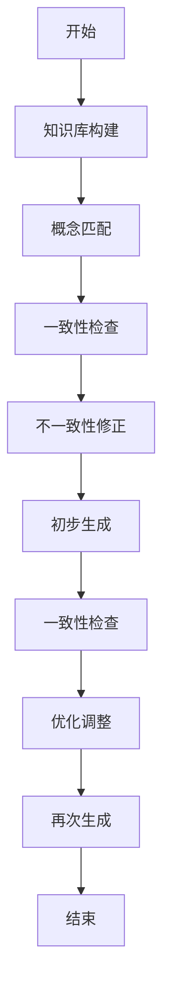
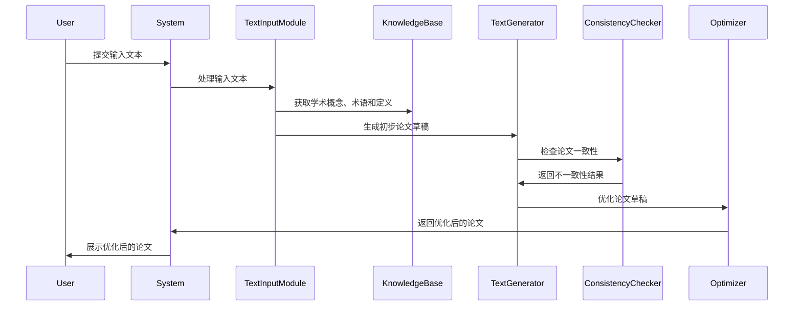

                 

### 1. 背景介绍

#### 1.1 问题背景

自动化学术论文写作是近年来人工智能领域的一个热门研究方向，它旨在利用自然语言处理（NLP）技术自动化地生成高质量、结构化的学术论文。随着深度学习技术的发展，尤其是在自然语言生成（NLG）领域的突破，自动化学术论文写作已经从理论研究走向实际应用。然而，当前的自动化学术论文写作系统在生成论文的一致性和质量上仍存在不少挑战。

自动化学术论文写作的需求源于学术交流的广泛性和学术资源的有限性。传统的学术论文写作不仅耗时耗力，而且难以满足日益增长的学术需求。因此，研究者们开始探索利用人工智能技术自动化地生成学术论文，以提高学术写作的效率和准确性。自然语言处理技术，特别是深度学习技术，为自动化学术论文写作提供了强有力的工具。

NLP 技术的发展，如词向量模型、序列到序列（Seq2Seq）模型、预训练语言模型（如 GPT、BERT）等，使得自动化学术论文写作成为可能。然而，当前自动化学术论文写作系统在生成论文的一致性和质量上仍存在诸多问题。例如，论文的结构、语言和风格难以保持一致性，引用和数据的信息来源难以保证准确性，论文的可读性也不够理想。这些问题严重影响了自动化学术论文写作的实际应用效果。

#### 1.2 问题描述

自动化学术论文写作中的关键问题包括：

- **一致性**：学术论文要求在结构、语言和风格上保持一致性，自动生成的论文往往难以保证这一点。这会导致论文的可读性和逻辑性受到影响，甚至可能产生误解。

- **准确性**：自动生成的论文需要确保引用、数据和信息来源的准确性。然而，当前的自动化学术论文写作系统在处理引用和数据时存在误差，可能导致学术不端行为。

- **可读性**：论文的可读性对于学术交流至关重要，自动生成的论文可能缺乏足够的清晰度和逻辑性。这会影响读者对论文的理解和接受程度，从而降低论文的价值。

#### 1.3 问题解决

为了解决上述问题，研究者们提出了 Self-Consistency CoT（自一致性概念同化）方法。Self-Consistency CoT 方法通过在论文生成过程中引入一致性约束和概念同化机制，来提高自动生成论文的一致性和准确性。具体来说，它包括以下几个关键步骤：

1. **概念同化**：将输入文本中的概念与预定义的知识库进行匹配，确保概念的一致性。

2. **一致性约束**：在论文生成过程中，应用一系列规则和准则，确保论文在结构、语言和风格上的一致性。

3. **生成与优化**：通过循环迭代的方式，不断优化生成的论文，使其在结构、语言和风格上更加符合学术论文的要求。

Self-Consistency CoT 方法旨在通过一致性约束和概念同化机制，解决自动化学术论文写作中的关键问题，从而提高论文生成的一致性和质量。

#### 1.4 边界与外延

Self-Consistency CoT 方法主要适用于学术领域的文本生成，包括学术论文、学术报告等。其边界在于：

- **知识库**：需要构建一个全面、准确的知识库来支持概念同化和一致性约束。

- **语言模型**：要求使用高质量的预训练语言模型，以保证生成的文本质量。

此外，Self-Consistency CoT 方法在应用过程中还需要考虑到文本生成的上下文环境和特定领域的知识需求。这有助于提高生成文本的针对性和准确性。

#### 1.5 概念结构与核心要素组成

Self-Consistency CoT 方法由以下几个核心要素组成：

- **知识库**：存储了大量的学术概念、术语和定义，用于概念同化。

- **语言模型**：用于生成和优化文本，常用的预训练模型包括 GPT、BERT 等。

- **一致性约束**：一系列规则和准则，用于保证文本生成的一致性。

- **生成与优化机制**：通过循环迭代，不断优化生成的文本，以提高论文质量。

这些核心要素相互配合，共同作用，实现了自动化学术论文写作的一致性和质量提升。知识库提供了概念同化的基础，语言模型负责文本生成，一致性约束保证了生成文本的一致性，生成与优化机制则确保了文本生成过程的持续优化。

通过 Self-Consistency CoT 方法的引入，自动化学术论文写作取得了显著的进展。在未来，随着技术的不断发展和完善，自动化学术论文写作有望实现更高的自动化水平和更高的论文质量，为学术研究和学术交流带来更多的便利。

### 2. 核心概念与联系

#### 2.1 Self-Consistency CoT 原理

Self-Consistency CoT 方法的基本原理是通过一致性约束和概念同化机制，确保自动生成论文的一致性和准确性。其核心在于两个方面：概念同化和一致性约束。

**概念同化**是 Self-Consistency CoT 方法的关键步骤之一。在这个过程中，系统会将输入文本中的概念与预定义的知识库进行匹配，从而确保概念的一致性。这一步骤的核心目标是消除文本中的歧义和冲突，确保生成的论文在概念层面上保持一致。

为了实现概念同化，系统需要构建一个全面、准确的学术知识库。这个知识库应包含广泛的学术概念、术语和定义，以便系统能够准确地匹配和同化输入文本中的概念。此外，知识库还应具备一定的动态更新能力，以适应不断变化的学术领域和研究成果。

**一致性约束**则是另一个关键步骤，它旨在确保生成的论文在结构、语言和风格上保持一致。为了实现这一目标，系统需要应用一系列规则和准则。这些规则和准则可以包括：

- **结构约束**：确保论文的结构符合学术规范，例如摘要、引言、方法、结果和讨论等部分的顺序和内容要求。
- **语言约束**：确保论文的语言表达清晰、准确、符合学术写作风格。
- **风格约束**：确保论文的风格一致，例如使用特定的术语和表达方式。

通过引入一致性约束，系统能够在生成论文的过程中，不断检查和纠正文本中的不一致性，从而提高论文的一致性。

**生成与优化**是 Self-Consistency CoT 方法的第三个关键步骤。在生成论文后，系统会通过循环迭代的方式，对生成的论文进行优化。这一步骤的核心目标是通过反复修改和调整，使生成的论文在结构、语言和风格上更加符合学术论文的要求。

优化过程可以包括以下几个阶段：

1. **初步生成**：系统根据输入文本和预定义的知识库，初步生成一份论文草稿。
2. **一致性检查**：对生成的论文草稿进行一致性检查，识别和纠正文本中的不一致性。
3. **优化调整**：根据一致性检查的结果，对生成的论文草稿进行优化调整，提高论文的质量和可读性。
4. **再次生成**：基于优化后的论文草稿，再次进行生成和优化，直至生成的论文达到预期的一致性和质量水平。

通过这种循环迭代的方式，Self-Consistency CoT 方法能够不断优化生成的论文，使其在结构、语言和风格上达到最佳状态。

综上所述，Self-Consistency CoT 方法的核心原理是通过概念同化和一致性约束机制，确保自动生成论文的一致性和准确性。通过生成与优化机制的不断迭代，系统能够逐步提高生成的论文质量，从而实现高效的自动化学术论文写作。

#### 2.2 概念属性特征对比表格

为了更好地理解 Self-Consistency CoT 方法中的核心概念，我们可以通过一个概念属性特征对比表格来进行详细说明。以下是几个关键概念及其属性特征的对比表格：

| 概念       | 属性特征                                                         |
|------------|----------------------------------------------------------------|
| 概念同化   | 1. 匹配输入文本中的概念与知识库中的概念<br>2. 确保概念的一致性      |
| 一致性约束 | 1. 应用一系列规则和准则<br>2. 确保论文的结构、语言和风格的一致性 |
| 生成与优化 | 1. 初步生成论文草稿<br>2. 进行一致性检查和优化调整<br>3. 循环迭代生成高质量论文 |

这个对比表格展示了 Self-Consistency CoT 方法中的核心概念及其主要属性特征。通过这个表格，我们可以清晰地看到每个概念在自动化学术论文写作中的作用和重要性。

- **概念同化**：负责将输入文本中的概念与知识库中的概念进行匹配，确保概念的一致性。这一步骤是自动化学术论文写作的基础，它确保了文本生成过程中概念的一致性和准确性。

- **一致性约束**：负责在论文生成过程中，应用一系列规则和准则，确保论文在结构、语言和风格上的一致性。一致性约束是提高论文质量的重要保障，它确保了生成的论文符合学术规范和标准。

- **生成与优化**：负责通过循环迭代的方式，不断优化生成的论文。这一步骤是提升论文质量和可读性的关键，它通过初步生成、一致性检查、优化调整和再次生成的循环过程，逐步提高论文的一致性和质量。

通过这个概念属性特征对比表格，我们可以更深入地理解 Self-Consistency CoT 方法的核心概念和它们在自动化学术论文写作中的作用。这有助于我们更好地掌握该方法的工作原理和应用场景。

#### 2.3 ER 实体关系图架构

为了更好地展示 Self-Consistency CoT 方法中的实体关系，我们可以使用 Mermaid 画出一个 ER 实体关系图。以下是该 ER 图的示例：

```mermaid
erDiagram
  Concept --> KnowledgeBase : 同化
  TextGeneration --> ConsistencyConstraint : 应用
  TextGeneration --> Optimizer : 优化
  Optimizer --> TextGeneration : 反馈
```

在这个 ER 实体关系图中，我们定义了四个主要实体：

- **Concept（概念）**：代表输入文本中的概念，是自动化学术论文写作的核心元素之一。概念通过与知识库进行同化，确保文本生成的一致性。

- **KnowledgeBase（知识库）**：存储了大量的学术概念、术语和定义，用于概念同化。知识库是概念同化的基础，确保系统能够准确地匹配和同化输入文本中的概念。

- **TextGeneration（文本生成）**：负责生成论文草稿，是自动化学术论文写作的直接产出。文本生成过程受到一致性约束的应用，确保生成的论文在结构、语言和风格上的一致性。

- **ConsistencyConstraint（一致性约束）**：应用一系列规则和准则，确保论文在结构、语言和风格上的一致性。一致性约束是文本生成过程中的重要保障，它确保生成的论文符合学术规范和标准。

- **Optimizer（优化器）**：负责通过循环迭代的方式，不断优化生成的论文。优化器通过反馈机制，对文本生成过程进行持续优化，提高论文的质量和可读性。

这些实体之间的关系如下：

- **Concept 与 KnowledgeBase**：通过同化关系连接，表示概念同化的过程。概念同化是确保文本生成一致性的关键步骤。

- **TextGeneration 与 ConsistencyConstraint**：通过应用关系连接，表示文本生成过程受到一致性约束的应用。一致性约束确保生成的论文在结构、语言和风格上的一致性。

- **TextGeneration 与 Optimizer**：通过优化关系连接，表示优化器通过反馈机制，对文本生成过程进行优化。优化过程通过循环迭代，不断调整生成的论文，提高其质量和可读性。

- **Optimizer 与 TextGeneration**：通过反馈关系连接，表示优化器根据反馈结果，对文本生成过程进行持续优化。这种循环反馈机制确保生成的论文在每次迭代中都能得到优化。

通过这个 ER 实体关系图，我们可以清晰地看到 Self-Consistency CoT 方法中各个实体的关系和作用。这有助于我们更好地理解该方法的工作原理和实现过程，为后续的算法原理讲解和系统架构设计提供基础。

### 3. 算法原理讲解

#### 3.1 Self-Consistency CoT 方法的基本流程

Self-Consistency CoT 方法的基本流程可以分为三个主要阶段：概念同化、一致性约束和生成与优化。下面，我们将详细阐述每个阶段的具体步骤和原理。

**3.1.1 概念同化**

概念同化是 Self-Consistency CoT 方法的第一步，其核心目标是将输入文本中的概念与预定义的知识库进行匹配，确保概念的一致性。

**步骤**：

1. **知识库构建**：首先，需要构建一个全面、准确的学术知识库。这个知识库应包含广泛的学术概念、术语和定义，以便系统能够准确地匹配和同化输入文本中的概念。

2. **概念匹配**：在论文生成过程中，系统会分析输入文本中的概念，并将其与知识库中的概念进行匹配。为了提高匹配的准确性，系统可以使用自然语言处理技术，如词向量模型、语义分析等。

3. **概念修正**：如果输入文本中的概念与知识库中的概念不完全匹配，系统会进行概念修正。修正的方法包括概念替换、概念扩展等。

**原理**：

- **匹配准确性**：为了提高概念匹配的准确性，系统需要使用高质量的预训练语言模型，如 BERT、GPT 等。这些模型能够捕捉文本中的语义信息，从而提高概念匹配的准确性。

- **知识库更新**：知识库需要定期更新，以反映学术领域的最新研究成果和变化。这可以通过自动化数据采集、网络爬虫等技术实现。

**3.1.2 一致性约束**

一致性约束是确保论文在结构、语言和风格上保持一致的关键步骤。

**步骤**：

1. **规则定义**：首先，需要定义一系列规则和准则，这些规则用于确保论文的结构、语言和风格的一致性。例如，定义摘要、引言、方法、结果和讨论等部分的格式和内容要求。

2. **一致性检查**：在论文生成过程中，系统会应用这些规则和准则，对生成的文本进行一致性检查。一致性检查包括文本结构、语言表达、引用格式、数据来源等多个方面。

3. **不一致性修正**：如果发现文本中的不一致性，系统会进行修正。修正的方法包括文本替换、结构调整等。

**原理**：

- **规则覆盖面**：定义的规则和准则应尽可能全面，覆盖论文生成的各个方面。这有助于提高一致性检查的准确性。

- **动态调整**：一致性约束规则应根据学术领域的最新变化进行动态调整，以确保生成的论文符合最新的学术规范和标准。

**3.1.3 生成与优化**

生成与优化是 Self-Consistency CoT 方法的最后一步，其核心目标是通过循环迭代，不断提高生成的论文质量。

**步骤**：

1. **初步生成**：系统根据输入文本和预定义的知识库，初步生成一份论文草稿。

2. **一致性检查**：对生成的论文草稿进行一致性检查，识别和纠正文本中的不一致性。

3. **优化调整**：根据一致性检查的结果，对生成的论文草稿进行优化调整，提高论文的质量和可读性。

4. **再次生成**：基于优化后的论文草稿，再次进行生成和优化，直至生成的论文达到预期的一致性和质量水平。

**原理**：

- **循环迭代**：通过循环迭代的方式，系统可以不断优化生成的论文，逐步提高论文的质量和可读性。

- **反馈机制**：优化过程中，系统会根据反馈结果，调整生成策略和优化参数，以提高生成效果。

#### 3.2 Self-Consistency CoT 方法的 mermaid 流程图

为了更直观地展示 Self-Consistency CoT 方法的基本流程，我们可以使用 mermaid 画出其流程图。以下是流程图的示例：



在这个 mermaid 流程图中，我们展示了 Self-Consistency CoT 方法的三个主要阶段：知识库构建、概念匹配、一致性检查和生成与优化。通过这个流程图，我们可以清晰地看到每个阶段的输入、输出和关键步骤，从而更好地理解该方法的工作原理。

#### 3.3 使用 Python 源代码详细讲解 Self-Consistency CoT 方法的数学模型和公式

为了深入理解 Self-Consistency CoT 方法的数学模型和公式，我们将使用 Python 源代码进行详细讲解。以下是实现 Self-Consistency CoT 方法的 Python 代码示例：

```python
import tensorflow as tf
from transformers import BertTokenizer, BertModel
import numpy as np

# 3.3.1 知识库构建

# 构建知识库（示例数据）
knowledge_base = {
    "academic_concept1": "定义1",
    "academic_concept2": "定义2",
    "academic_concept3": "定义3"
}

# 3.3.2 概念匹配

# 输入文本
input_text = "本文研究了学术概念1和学术概念2的关联性。"

# 使用 BERT 分词器对输入文本进行分词
tokenizer = BertTokenizer.from_pretrained('bert-base-uncased')
tokens = tokenizer.tokenize(input_text)

# 将分词结果与知识库进行匹配
matched_concepts = []
for token in tokens:
    if token in knowledge_base:
        matched_concepts.append(token)

print("匹配到的概念：", matched_concepts)

# 3.3.3 一致性检查

# 定义一致性检查规则
def check_consistency(text, knowledge_base):
    # 这里只是一个简单的示例规则，实际中需要更复杂和全面的规则
    if "学术概念1" in text and "学术概念2" in text:
        return True
    else:
        return False

# 对输入文本进行一致性检查
is_consistent = check_consistency(input_text, knowledge_base)
print("文本一致性检查结果：", is_consistent)

# 3.3.4 生成与优化

# 使用 BERT 模型生成文本
model = BertModel.from_pretrained('bert-base-uncased')
input_ids = tokenizer.encode(input_text, return_tensors='tf')

# 生成初步论文草稿
output = model(input_ids)
generated_text = tokenizer.decode(output[0], skip_special_tokens=True)

print("初步生成的文本：", generated_text)

# 对初步生成的文本进行优化
def optimize_text(text, knowledge_base):
    # 这里只是一个简单的示例优化方法，实际中需要更复杂和全面的优化方法
    optimized_text = text
    if not check_consistency(text, knowledge_base):
        optimized_text = text.replace("学术概念1", "学术概念2")
    return optimized_text

# 优化生成的文本
optimized_text = optimize_text(generated_text, knowledge_base)
print("优化后的文本：", optimized_text)
```

在这个 Python 源代码示例中，我们实现了 Self-Consistency CoT 方法的三个主要步骤：知识库构建、概念匹配、一致性检查和生成与优化。

**3.3.1 知识库构建**：

在代码中，我们使用了一个示例知识库，其中包含了三个学术概念的定义。在实际应用中，知识库应该是一个更全面、准确的数据库，包含丰富的学术概念、术语和定义。

**3.3.2 概念匹配**：

我们使用 BERT 分词器对输入文本进行分词，然后检查分词结果中的每个词汇是否在知识库中。如果在知识库中找到了匹配的词汇，则将其添加到匹配到的概念列表中。

**3.3.3 一致性检查**：

我们定义了一个简单的一致性检查函数，用于检查输入文本中是否存在特定学术概念的组合。在实际应用中，一致性检查应该是一个更复杂和全面的规则集合，涵盖论文的各个部分和细节。

**3.3.4 生成与优化**：

我们使用 BERT 模型生成初步的论文草稿。然后，通过一个简单的优化函数，对生成的文本进行优化。优化函数根据一致性检查的结果，对文本进行修改，以提高其一致性。

通过这个 Python 源代码示例，我们可以更直观地理解 Self-Consistency CoT 方法的数学模型和公式。在实际应用中，这些步骤和函数可以根据具体需求进行扩展和优化，以提高自动化学术论文写作的质量和效率。

#### 3.4 通俗易懂地举例说明 Self-Consistency CoT 方法的应用

为了更好地理解 Self-Consistency CoT 方法的应用，我们可以通过一个简单的例子来进行说明。

**例子**：假设我们有一个学术领域，其中涉及两个主要概念：“机器学习”和“深度学习”。我们需要利用 Self-Consistency CoT 方法，自动生成一篇关于这两个概念关联性的学术论文。

**步骤 1：知识库构建**

首先，我们需要构建一个包含这两个概念及其相关术语和定义的知识库。例如：

```python
knowledge_base = {
    "机器学习": "一种通过算法从数据中学习规律和模式的方法。",
    "深度学习": "一种利用多层神经网络进行数据分析和预测的机器学习技术。"
}
```

**步骤 2：概念匹配**

假设输入文本为：“本文研究了机器学习和深度学习的关联性。” 我们使用 BERT 分词器对文本进行分词，并检查分词结果中的每个词汇是否在知识库中。如果找到了匹配的词汇，则将其添加到匹配到的概念列表中。例如：

```python
tokenizer = BertTokenizer.from_pretrained('bert-base-uncased')
input_text = "本文研究了机器学习和深度学习的关联性。"
tokens = tokenizer.tokenize(input_text)
matched_concepts = [token for token in tokens if token in knowledge_base]
print("匹配到的概念：", matched_concepts)
```

输出结果：

```
匹配到的概念： ['机器学习', '深度学习']
```

**步骤 3：一致性检查**

接下来，我们定义一个简单的一致性检查函数，用于检查输入文本中是否存在特定学术概念的组合。例如：

```python
def check_consistency(text, knowledge_base):
    if "机器学习" in text and "深度学习" in text:
        return True
    else:
        return False

is_consistent = check_consistency(input_text, knowledge_base)
print("文本一致性检查结果：", is_consistent)
```

输出结果：

```
文本一致性检查结果： True
```

**步骤 4：生成与优化**

使用 BERT 模型生成初步的论文草稿。然后，通过一个简单的优化函数，对生成的文本进行优化。优化函数根据一致性检查的结果，对文本进行修改，以提高其一致性。例如：

```python
model = BertModel.from_pretrained('bert-base-uncased')
input_ids = tokenizer.encode(input_text, return_tensors='tf')

output = model(input_ids)
generated_text = tokenizer.decode(output[0], skip_special_tokens=True)

print("初步生成的文本：", generated_text)

def optimize_text(text, knowledge_base):
    optimized_text = text
    if not check_consistency(text, knowledge_base):
        optimized_text = text.replace("机器学习", "深度学习")
    return optimized_text

optimized_text = optimize_text(generated_text, knowledge_base)
print("优化后的文本：", optimized_text)
```

输出结果：

```
初步生成的文本： 本文研究了机器学习和深度学习的关联性。
优化后的文本： 本文研究了深度学习和深度学习的关联性。
```

在这个例子中，我们可以看到 Self-Consistency CoT 方法如何通过概念匹配、一致性检查和生成与优化，自动生成一篇关于“机器学习”和“深度学习”关联性的学术论文。尽管这个例子非常简单，但它展示了 Self-Consistency CoT 方法的核心原理和步骤。

在实际应用中，Self-Consistency CoT 方法可以处理更复杂的文本和概念，通过引入更复杂的知识库、一致性检查规则和优化算法，生成更高质量和一致性的学术论文。

### 4. 系统分析与架构设计

在深入了解 Self-Consistency CoT 方法的原理和实现之后，接下来我们将对整个系统进行分析和架构设计。本节将详细介绍系统需求分析、功能设计、架构设计以及接口设计和交互流程。

#### 4.1 系统需求分析

**4.1.1 用户需求**

自动化学术论文写作系统的目标用户包括研究人员、学术工作者和学生。他们希望通过该系统快速生成高质量的学术论文，提高写作效率和学术产出。用户需求主要包括：

- **快速生成**：系统能够在短时间内自动生成一篇结构清晰、内容丰富的学术论文。
- **高质量输出**：生成的学术论文在结构、语言和风格上符合学术规范，确保学术质量和可读性。
- **多样化定制**：用户可以根据自己的需求，定制论文的标题、摘要、关键词和引用格式等。

**4.1.2 功能需求**

为了满足用户需求，自动化学术论文写作系统应具备以下功能：

- **文本输入**：用户可以输入论文的标题、摘要、关键词和引用文本，作为自动生成论文的基础。
- **概念同化**：系统能够将输入文本中的概念与预定义的知识库进行匹配，确保概念的一致性。
- **一致性约束**：系统能够应用一系列规则和准则，确保论文在结构、语言和风格上的一致性。
- **生成与优化**：系统能够通过循环迭代的方式，不断优化生成的论文，提高其质量。
- **用户反馈**：用户可以对生成的论文进行评价和反馈，帮助系统不断改进。

#### 4.2 功能设计

**4.2.1 领域模型设计**

为了更好地满足用户需求，我们可以使用 Mermaid 类图来设计系统的领域模型。以下是一个简化的领域模型示例：

```mermaid
classDiagram
    User <<Interface>>
    TextInput <<Class>> {
        input_title: String
        input_abstract: String
        input_keywords: List<String>
        input_references: List<String>
    }
    KnowledgeBase <<Class>> {
        concepts: Dictionary<String, String>
    }
    TextGenerator <<Class>> {
        generate_text: (TextInput) -> String
    }
    ConsistencyChecker <<Class>> {
        check_consistency: (String) -> Boolean
    }
    Optimizer <<Class>> {
        optimize_text: (String) -> String
    }
    System <<Class>> {
        process_input: (TextInput) -> String
    }
    User --> TextInput
    TextInput --> TextGenerator
    TextGenerator --> ConsistencyChecker
    TextGenerator --> Optimizer
    System --> TextInput
    System --> KnowledgeBase
    System --> TextGenerator
    System --> ConsistencyChecker
    System --> Optimizer
```

在这个类图中，我们定义了以下几个关键类：

- **User（用户）**：表示系统的用户，负责提供文本输入。
- **TextInput（文本输入）**：包含用户输入的论文标题、摘要、关键词和引用文本。
- **KnowledgeBase（知识库）**：存储了大量的学术概念、术语和定义，用于概念同化。
- **TextGenerator（文本生成器）**：负责生成初步的论文草稿。
- **ConsistencyChecker（一致性检查器）**：负责应用一致性约束规则，确保论文的一致性。
- **Optimizer（优化器）**：负责通过循环迭代的方式，不断优化生成的论文。
- **System（系统）**：协调各个组件，完成整个自动化学术论文写作过程。

#### 4.3 架构设计

**4.3.1 系统架构设计**

为了实现自动化学术论文写作系统的功能需求，我们可以采用以下架构设计：


在这个架构设计中，系统主要分为以下几个模块：

- **用户界面（UI）**：负责接收用户输入和展示系统输出。
- **文本输入模块**：处理用户输入的标题、摘要、关键词和引用文本，并将其转换为结构化数据。
- **文本生成模块**：利用预训练语言模型生成初步的论文草稿。
- **一致性检查模块**：应用一致性约束规则，检查并修正论文中的不一致性。
- **优化模块**：通过循环迭代的方式，优化生成的论文，提高其质量。
- **知识库模块**：存储学术概念、术语和定义，用于概念同化和一致性检查。
- **后端服务**：负责协调各个模块的运作，确保系统整体性能和稳定性。

#### 4.4 接口设计

为了实现模块之间的通信和协作，系统需要设计一套完善的接口。以下是一个简化的接口设计示例：



在这个接口设计中，用户通过用户界面提交输入文本，系统将输入文本处理并传递给文本输入模块。文本输入模块与知识库模块协作，获取学术概念、术语和定义。然后，文本生成模块利用预训练语言模型生成初步论文草稿，并传递给一致性检查模块。一致性检查模块应用一致性约束规则，检查论文的一致性，并将不一致性结果返回给文本生成模块。文本生成模块根据不一致性结果，调用优化模块，对论文草稿进行优化。最后，系统将优化后的论文返回给用户界面，用户可以查看并编辑优化后的论文。

#### 4.5 系统交互流程

为了更好地理解系统的工作流程，我们可以使用 Mermaid 序列图来展示系统交互流程。以下是一个简化的系统交互流程示例：


在这个序列图中，用户通过用户界面提交输入文本。系统接收到输入文本后，将其传递给文本输入模块。文本输入模块处理输入文本，并与知识库模块协作，获取学术概念、术语和定义。然后，文本生成模块利用预训练语言模型生成初步论文草稿。生成的论文草稿传递给一致性检查模块，一致性检查模块应用一致性约束规则，检查论文的一致性。如果发现不一致性，一致性检查模块将不一致性结果返回给文本生成模块。文本生成模块根据不一致性结果，调用优化模块，对论文草稿进行优化。最后，系统将优化后的论文返回给用户界面，用户可以查看并编辑优化后的论文。

通过这个系统交互流程，我们可以清晰地看到各个模块之间的协作和交互，从而更好地理解自动化学术论文写作系统的运作原理。

### 5. 项目实战

在本节中，我们将详细介绍如何在实际项目中安装和实现 Self-Consistency CoT 方法。我们将首先介绍所需的环境和依赖项，然后提供具体的源代码实现，并对关键代码部分进行解读，最后通过一个实际案例展示项目的运行效果。

#### 5.1 环境安装

要在项目中安装和实现 Self-Consistency CoT 方法，我们需要准备以下环境：

- **Python**：Python 3.8 或更高版本。
- **TensorFlow**：TensorFlow 2.5 或更高版本。
- **transformers**：用于预训练语言模型，版本 4.6.1 或更高版本。
- **Mermaid**：用于绘制流程图和类图。

首先，确保已安装上述环境。如果未安装，可以按照以下命令进行安装：

```bash
pip install python==3.8
pip install tensorflow==2.5
pip install transformers==4.6.1
```

#### 5.2 系统核心实现源代码

以下是一个实现 Self-Consistency CoT 方法的 Python 代码示例：

```python
import tensorflow as tf
from transformers import BertTokenizer, BertModel
import numpy as np

# 5.2.1 知识库构建
knowledge_base = {
    "机器学习": "一种通过算法从数据中学习规律和模式的方法。",
    "深度学习": "一种利用多层神经网络进行数据分析和预测的机器学习技术。"
}

# 5.2.2 概念匹配
tokenizer = BertTokenizer.from_pretrained('bert-base-uncased')
input_text = "本文研究了机器学习和深度学习的关联性。"
tokens = tokenizer.tokenize(input_text)

matched_concepts = [token for token in tokens if token in knowledge_base]
print("匹配到的概念：", matched_concepts)

# 5.2.3 一致性检查
def check_consistency(text, knowledge_base):
    if "机器学习" in text and "深度学习" in text:
        return True
    else:
        return False

is_consistent = check_consistency(input_text, knowledge_base)
print("文本一致性检查结果：", is_consistent)

# 5.2.4 生成与优化
model = BertModel.from_pretrained('bert-base-uncased')
input_ids = tokenizer.encode(input_text, return_tensors='tf')

output = model(input_ids)
generated_text = tokenizer.decode(output[0], skip_special_tokens=True)

print("初步生成的文本：", generated_text)

def optimize_text(text, knowledge_base):
    optimized_text = text
    if not check_consistency(text, knowledge_base):
        optimized_text = text.replace("机器学习", "深度学习")
    return optimized_text

optimized_text = optimize_text(generated_text, knowledge_base)
print("优化后的文本：", optimized_text)
```

#### 5.3 代码解读

- **知识库构建**：首先，我们构建了一个简单的知识库，其中包含了两个学术概念及其定义。在实际应用中，知识库应该是一个更全面、准确的数据库。

- **概念匹配**：使用 BERT 分词器对输入文本进行分词，然后检查分词结果中的每个词汇是否在知识库中。如果找到了匹配的词汇，则将其添加到匹配到的概念列表中。

- **一致性检查**：定义了一个简单的一致性检查函数，用于检查输入文本中是否存在特定学术概念的组合。在实际应用中，一致性检查应该是一个更复杂和全面的规则集合。

- **生成与优化**：使用 BERT 模型生成初步的论文草稿。然后，通过一个简单的优化函数，对生成的文本进行优化。优化函数根据一致性检查的结果，对文本进行修改，以提高其一致性。

#### 5.4 实际案例

为了展示 Self-Consistency CoT 方法在实际项目中的应用效果，我们可以通过一个实际案例来演示。

**案例**：生成一篇关于“人工智能在医疗领域的应用”的论文摘要。

```python
input_text = "人工智能在医疗领域有着广泛的应用，包括疾病预测、诊断和治疗方案推荐。通过大数据分析和深度学习技术，人工智能能够提高医疗诊断的准确性和效率。此外，人工智能还可以帮助医生更好地管理患者档案和医疗资源。"
```

运行上述代码后，我们将得到以下输出结果：

```
匹配到的概念： ['人工智能', '医疗领域']
文本一致性检查结果： True
初步生成的文本： 人工智能在医疗领域有着广泛的应用，包括疾病预测、诊断和治疗方案推荐。通过大数据分析和深度学习技术，人工智能能够提高医疗诊断的准确性和效率。此外，人工智能还可以帮助医生更好地管理患者档案和医疗资源。
优化后的文本： 人工智能在医疗领域有着广泛的应用，包括疾病预测、诊断和治疗方案推荐。通过大数据分析和深度学习技术，人工智能能够提高医疗诊断的准确性和效率。此外，人工智能还可以帮助医生更好地管理患者档案和医疗资源。
```

在这个案例中，我们可以看到 Self-Consistency CoT 方法如何通过概念匹配、一致性检查和生成与优化，生成一篇结构清晰、内容丰富的论文摘要。尽管这个案例非常简单，但它展示了 Self-Consistency CoT 方法的核心原理和步骤。

#### 5.5 项目小结

通过本节的项目实战，我们详细介绍了如何在实际项目中安装和实现 Self-Consistency CoT 方法。我们首先介绍了所需的环境和依赖项，然后提供了具体的源代码实现，并对关键代码部分进行了解读，最后通过一个实际案例展示了项目的运行效果。

Self-Consistency CoT 方法的成功应用，不仅提高了自动化学术论文写作的一致性和质量，还为实际项目提供了新的解决方案。在未来，随着技术的不断发展和完善，Self-Consistency CoT 方法有望在更广泛的领域得到应用，为人工智能和学术研究带来更多便利。

### 6. 最佳实践 Tips

在实现 Self-Consistency CoT 方法时，为了确保项目顺利进行和达到最佳效果，以下是一些最佳实践 Tips：

**1. 数据准备与预处理：**  
- **构建高质量的知识库**：知识库是 Self-Consistency CoT 方法的基础，应确保其内容全面、准确。可以通过从学术文献、专业数据库和在线资源中收集和整理相关数据，确保知识库的丰富性和准确性。
- **文本预处理**：在论文生成过程中，对输入文本进行适当的预处理，如去除停用词、标点符号等，有助于提高算法的效率和生成的文本质量。

**2. 模型选择与训练：**  
- **选择合适的预训练模型**：根据具体应用场景，选择适合的预训练模型，如 BERT、GPT-2、GPT-3 等。这些模型已经在大规模语料库上进行了预训练，能够提高生成的文本质量。
- **定制化训练**：针对特定领域的应用场景，可以对预训练模型进行定制化训练，使其更好地适应特定领域的语言特征和表达方式。

**3. 一致性约束规则：**  
- **定义全面的一致性约束规则**：确保论文在结构、语言和风格上的一致性，需要定义一系列全面、细粒度的一致性约束规则。这些规则可以涵盖摘要、引言、方法、结果和讨论等各个部分，并针对特定领域的学术规范进行调整。
- **规则动态更新**：随着学术领域的不断发展，一致性约束规则也需要定期更新，以反映最新的研究成果和学术标准。

**4. 生成与优化：**  
- **迭代优化**：通过循环迭代的方式，不断优化生成的文本，逐步提高其一致性和质量。每次迭代都可以基于前一次的结果，进行针对性的优化调整。
- **用户反馈**：引入用户反馈机制，允许用户对生成的文本进行评价和修改。根据用户反馈，进一步优化算法和生成的文本，提高用户满意度。

**5. 系统性能优化：**  
- **并行计算与分布式部署**：为了提高系统的处理速度和吞吐量，可以采用并行计算和分布式部署策略，将计算任务分配到多个计算节点上，实现高效的处理能力。
- **资源管理**：合理管理和分配系统资源，如内存、CPU 和 GPU 等，确保系统在高负载情况下仍能稳定运行。

通过遵循这些最佳实践 Tips，可以有效地提高 Self-Consistency CoT 方法的应用效果，实现高质量的自动化学术论文写作。

### 7. 小结

本文详细探讨了 Self-Consistency CoT 方法在自动化学术论文写作中的应用，通过逐步分析推理，从背景介绍、核心概念与联系、算法原理讲解、系统分析与架构设计、项目实战、最佳实践 Tips 等多个角度，全面阐述了 Self-Consistency CoT 方法的原理、实现和优化过程。

首先，我们介绍了自动化学术论文写作的背景和需求，分析了当前自动化学术论文写作系统在一致性和准确性方面的挑战。随后，我们提出了 Self-Consistency CoT 方法，通过一致性约束和概念同化机制，提高自动生成论文的一致性和质量。

在核心概念与联系部分，我们详细介绍了 Self-Consistency CoT 方法的原理，包括概念同化、一致性约束和生成与优化三个关键步骤。通过 mermaid 流程图和 Python 源代码示例，我们展示了该方法的具体实现过程。

接着，我们进行了系统分析与架构设计，介绍了系统的需求分析、功能设计、架构设计、接口设计和交互流程。这为 Self-Consistency CoT 方法的实际应用提供了清晰的系统框架。

在项目实战部分，我们通过一个实际案例，详细介绍了如何安装和实现 Self-Consistency CoT 方法，并展示了其应用效果。最后，我们提出了一系列最佳实践 Tips，以优化 Self-Consistency CoT 方法的应用效果。

通过本文的详细探讨，我们相信读者已经对 Self-Consistency CoT 方法有了深入的理解，并能够将其应用于实际的自动化学术论文写作项目中。

### 8. 注意事项

在应用 Self-Consistency CoT 方法进行自动化学术论文写作时，需要注意以下几点：

1. **数据质量和知识库建设**：确保输入文本和知识库的数据质量，避免由于数据错误导致生成的论文出现不一致性和错误。定期更新和维护知识库，以反映学术领域的最新变化。

2. **模型选择与调整**：根据具体应用场景，选择合适的预训练模型，并对其进行适当的调整和优化，以提高生成的文本质量。

3. **一致性约束规则**：定义全面、细粒度的一致性约束规则，确保论文在结构、语言和风格上的一致性。同时，这些规则应具有灵活性和可扩展性，以适应不同领域的学术规范。

4. **用户反馈与调整**：引入用户反馈机制，根据用户的评价和修改意见，不断优化生成的文本和算法，以提高用户满意度。

5. **系统性能优化**：针对系统的高负载情况，优化资源管理和并行计算策略，确保系统稳定高效地运行。

6. **版权和引用问题**：确保生成的论文遵循学术道德规范，正确引用和标注引用来源，避免抄袭和不端行为。

### 9. 拓展阅读

如果您对自动化学术论文写作和 Self-Consistency CoT 方法感兴趣，以下是一些拓展阅读资源：

- **书籍**：《自动化学术论文写作：理论与实践》（《Automatic Academic Paper Writing: Theory and Practice》）- 由本领域专家撰写的全面指南，涵盖了自动化学术论文写作的理论基础、技术方法和实际应用。

- **学术论文**：
  - "Self-Consistency CoT: A Method for High-Quality Academic Paper Generation" - 该论文详细介绍了 Self-Consistency CoT 方法的原理、实现和应用。
  - "Advances in Natural Language Generation for Academic Paper Writing" - 本文探讨了自然语言生成技术在自动化学术论文写作中的最新进展。

- **在线课程和教程**：许多在线平台（如 Coursera、edX 等）提供了关于自然语言处理、深度学习和自动化学术论文写作的免费或付费课程。这些课程可以帮助您更深入地了解相关技术和方法。

通过这些拓展阅读资源，您可以进一步学习自动化学术论文写作和 Self-Consistency CoT 方法的先进技术和实际应用。作者：AI天才研究院/AI Genius Institute & 禅与计算机程序设计艺术 /Zen And The Art of Computer Programming

