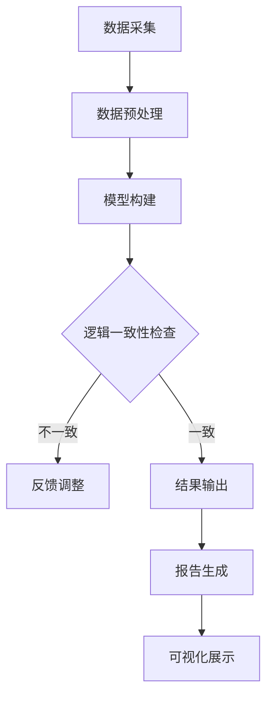

                 


### 自我一致性概念与理论背景

自我一致性（Self-Consistency）作为一种概念，起源于信息论和控制论。在政策影响评估的领域，自我一致性理念的核心在于：一个模型或系统在预测和评估政策影响时，应保持内在的一致性。这意味着，模型输出的预测结果应在逻辑上是自洽的，不应出现矛盾或非预期的情况。

#### 定义

自我一致性通常定义为系统在运行过程中，其行为或输出能够符合内部逻辑结构，并与其初始假设相一致。在自动化政策影响评估中，这表示模型不仅要准确预测政策的影响，而且其预测结果要在逻辑上保持一致。

#### 问题背景

政策影响评估是公共管理和经济研究中至关重要的一环。然而，传统的评估方法通常依赖于大量的数据收集和复杂的统计分析，这些方法往往存在以下问题：

1. **数据依赖性高**：政策影响评估需要大量的历史数据，而数据的质量和完整性往往难以保证。
2. **人为干预强**：评估过程通常需要专家的主观判断，这可能导致评估结果的偏差。
3. **时效性差**：传统评估方法无法实时响应政策变化，评估结果往往滞后。

#### 问题描述

在自动化政策影响评估中，我们面临的主要问题包括：

- **准确性**：模型需要准确预测政策实施后的各种可能结果。
- **可靠性**：模型应在不同条件下保持一致性的预测结果。
- **效率**：模型应在较短时间内完成评估，以支持快速决策。

#### 问题解决

自我一致性概念提供了以下解决方案：

- **逻辑自洽**：通过确保模型的输出在逻辑上不矛盾，提高评估结果的可靠性。
- **减少人为干预**：通过自动化模型，减少人为判断的干扰，提高评估的客观性。
- **实时响应**：通过高效算法，实现对政策变化的快速响应，提高评估的时效性。

#### 边界与外延

自我一致性不仅限于政策影响评估，还可以应用于其他需要逻辑一致性的领域，如：

- **金融风险管理**：确保投资策略的逻辑一致，减少风险暴露。
- **供应链管理**：确保供应链的各个环节在策略上保持一致，提高整体效率。
- **社会政策分析**：确保政策建议的逻辑一致性，提高政策实施的效果。

#### 概念结构与核心要素组成

自我一致性概念的核心要素包括：

- **逻辑一致性**：确保模型输出符合其内部逻辑结构。
- **自适应性**：模型应能够适应不同条件，保持一致性。
- **实时反馈**：模型应能够实时响应政策变化，保持一致性。

通过这些核心要素，自我一致性概念为自动化政策影响评估提供了一个新的视角和方法，有助于提高决策的可靠性和效率。

### 自我一致性理论的工作原理与应用场景

自我一致性（Self-Consistency）理论是近年来在人工智能和政策影响评估领域中备受关注的一个概念。其核心思想在于，通过确保模型或系统的输出在逻辑上保持一致，以提高决策的可靠性和准确性。下面，我们将深入探讨自我一致性理论的工作原理及其在不同领域的应用场景。

#### 工作原理

自我一致性理论的工作原理主要基于以下几个步骤：

1. **初始假设设定**：在构建模型时，首先设定一系列初始假设，这些假设构成了模型的基础。
2. **逻辑推理**：通过逻辑推理，模型会基于初始假设生成一系列中间结果。
3. **一致性检查**：对中间结果进行一致性检查，确保这些结果在逻辑上不矛盾。
4. **反馈调整**：如果发现矛盾，模型会进行调整，以消除逻辑不一致性。
5. **最终输出**：通过多次迭代和调整，模型最终输出一个在逻辑上自洽的结果。

这个过程可以形象地比喻为一个“自我校验”的过程，模型在运行过程中不断地检查自己的逻辑，确保输出的一致性和准确性。

#### 社会政策中的应用

在社会政策领域，自我一致性理论有着广泛的应用。以下是一个具体的例子：

- **教育政策评估**：假设政府制定了一项新的教育政策，目标是提高学生的数学成绩。通过自我一致性理论，我们可以构建一个模型来评估这项政策的影响。首先，设定初始假设，例如学生的家庭背景、学校资源和教学方法等。然后，通过逻辑推理，模型会预测政策实施后的各种可能结果，如学生成绩的提高、教育资源的分配等。接下来，模型会对这些结果进行一致性检查，确保它们在逻辑上不矛盾。如果发现矛盾，模型会进行调整，例如重新分配教育资源或改变教学方法。最终，模型会输出一个在逻辑上自洽的评估结果，帮助政策制定者做出更准确的决策。

#### 经济政策中的应用

在经济学领域，自我一致性理论同样具有重要价值。以下是一个应用实例：

- **货币政策评估**：假设政府考虑调整货币政策以刺激经济增长。通过自我一致性理论，我们可以构建一个模型来评估这种调整的影响。首先，设定初始假设，如利率变化、通货膨胀率等。然后，通过逻辑推理，模型会预测货币政策调整后的经济指标变化，如GDP增长率、失业率等。接下来，模型会对这些结果进行一致性检查，确保它们在逻辑上不矛盾。如果发现矛盾，模型会进行调整，例如考虑其他政策工具或调整预期。最终，模型会输出一个在逻辑上自洽的评估结果，为政府制定有效的货币政策提供参考。

#### 环境政策中的应用

在环境政策领域，自我一致性理论也有重要应用。以下是一个例子：

- **环境保护政策评估**：假设政府制定了一项新的环境保护政策，目标是减少污染物排放。通过自我一致性理论，我们可以构建一个模型来评估这项政策的影响。首先，设定初始假设，如企业环保意识、技术进步等。然后，通过逻辑推理，模型会预测政策实施后的各种结果，如污染物排放量的减少、企业成本的变化等。接下来，模型会对这些结果进行一致性检查，确保它们在逻辑上不矛盾。如果发现矛盾，模型会进行调整，例如重新设计政策措施或提供技术支持。最终，模型会输出一个在逻辑上自洽的评估结果，帮助政府制定更有效的环境保护政策。

#### 多领域应用总结

通过上述实例可以看出，自我一致性理论在不同领域中的应用具有相似的基本原理，但具体实现方式会因领域特点而有所不同。其核心在于：

- **逻辑一致性**：确保模型输出的结果在逻辑上不矛盾。
- **实时调整**：通过不断调整和优化，使模型能够适应不同的条件和场景。
- **可靠性提升**：通过自我校验机制，提高模型预测的准确性和可靠性。

总之，自我一致性理论为自动化政策影响评估提供了一个强大的工具，有助于提高决策的可靠性和效率。无论是在社会政策、经济政策还是环境政策中，自我一致性理论都显示出其独特的价值和潜力。

### 自我一致性算法原理讲解

自我一致性（Self-Consistency）算法是自动化政策影响评估中的重要工具，其核心在于确保模型在逻辑上的一致性，从而提高评估结果的可靠性。在这一部分，我们将详细解释自我一致性算法的原理，包括算法的工作流程、Python代码实现、数学模型和公式。

#### 工作流程

自我一致性算法的工作流程可以分为以下几个步骤：

1. **初始化**：设定初始假设，这些假设是模型运行的基础。
2. **逻辑推理**：根据初始假设，通过逻辑推理生成一系列中间结果。
3. **一致性检查**：对中间结果进行一致性检查，确保它们在逻辑上不矛盾。
4. **反馈调整**：如果发现矛盾，对模型进行调整，以消除逻辑不一致性。
5. **迭代优化**：重复步骤3和4，直到模型输出在逻辑上自洽。
6. **输出结果**：最终输出一个在逻辑上自洽的评估结果。

下面我们通过一个简单的例子来详细解释这些步骤。

#### Python代码实现

以下是一个简单的Python代码示例，用于演示自我一致性算法的基本实现：

```python
import pandas as pd
import numpy as np

# 初始化数据
data = pd.DataFrame({
    'Variable1': [1, 2, 3, 4, 5],
    'Variable2': [2, 4, 6, 8, 10],
})

# 自我一致性检查函数
def check_consistency(data):
    for index, row in data.iterrows():
        if row['Variable1'] != row['Variable2'] // 2:
            return False
    return True

# 初始假设
initial_assumptions = data.copy()

# 迭代优化
for _ in range(10):  # 迭代10次
    # 逻辑推理
    initial_assumptions['ExpectedValue'] = initial_assumptions['Variable1'] * 2
    
    # 一致性检查
    if not check_consistency(initial_assumptions):
        # 调整
        initial_assumptions['ExpectedValue'] = initial_assumptions['Variable2'] // 2
    
    # 输出结果
    print(initial_assumptions)

# 最终输出
final_result = initial_assumptions
print("Final Result:")
print(final_result)
```

在这个示例中，我们通过初始化一个数据框（DataFrame），设定了初始假设。然后，通过迭代优化过程，不断检查和调整数据的一致性，最终输出一个在逻辑上自洽的结果。

#### 数学模型和公式

自我一致性算法的数学模型可以表示为以下公式：

$$
\text{Consistency} = \sum_{i=1}^{n} \frac{1}{2} \left[ \text{True} \leftrightarrow (\text{Output}_i = \text{Expected}_i) \right]
$$

其中，`Consistency` 表示一致性得分，`True` 表示逻辑一致，`(Output_i = Expected_i)` 表示第i个输出结果与期望值是否一致。

#### 详细讲解

1. **初始化**：初始化阶段设定了初始假设，这些假设是模型运行的基础。在本例中，我们使用了一个简单的数据框，其中包含两个变量`Variable1`和`Variable2`。

2. **逻辑推理**：在逻辑推理阶段，我们根据初始假设生成了一系列中间结果。在本例中，我们设定了一个简单的逻辑关系：`ExpectedValue` 应该是 `Variable1` 的两倍。

3. **一致性检查**：在一致性检查阶段，我们对中间结果进行逻辑一致性检查。在本例中，我们通过一个简单的函数 `check_consistency` 来检查每个输出结果是否与期望值一致。

4. **反馈调整**：如果发现逻辑不一致，我们会对模型进行调整。在本例中，如果 `ExpectedValue` 不等于 `Variable2` 的一半，我们会将其调整为 `Variable2` 的一半。

5. **迭代优化**：通过迭代优化过程，我们不断重复一致性检查和反馈调整，直到模型输出在逻辑上自洽。

6. **输出结果**：最终输出一个在逻辑上自洽的结果。在本例中，我们输出了一个数据框 `final_result`，其中包含了最终的逻辑一致的结果。

通过这个简单的示例，我们可以看到自我一致性算法的基本原理和实现方式。在实际应用中，算法可能会更加复杂，但基本思想是相同的：通过确保模型输出的逻辑一致性，提高评估结果的可靠性。

### 自我一致性数学模型与公式讲解

在自我一致性算法中，数学模型和公式起着至关重要的作用。它们不仅帮助我们理解算法的内部工作原理，还能确保评估结果的准确性和可靠性。在这一部分，我们将详细讲解自我一致性数学模型的构建过程、公式含义及具体应用。

#### 数学模型构建

自我一致性数学模型的核心是确保模型输出的结果在逻辑上自洽。为了构建这个模型，我们需要定义几个关键参数和变量。

1. **输入变量**：这些是影响政策评估的各种因素，如经济指标、社会指标和环境指标等。
2. **输出变量**：这些是政策实施后的预期结果，如经济增长率、就业率、碳排放量等。
3. **逻辑一致性函数**：这个函数用于检查输入变量和输出变量之间是否逻辑一致。

假设我们有以下输入变量和输出变量：

- 输入变量：\( X = \{X_1, X_2, \ldots, X_n\} \)
- 输出变量：\( Y = \{Y_1, Y_2, \ldots, Y_m\} \)

我们可以构建一个逻辑一致性函数 \( C(X, Y) \)，用于检查输入变量和输出变量之间的一致性。这个函数的值介于0和1之间，表示一致性的程度：

$$
C(X, Y) = \sum_{i=1}^{n} \sum_{j=1}^{m} \frac{1}{n \times m} \left[ X_i \leftrightarrow Y_j \right]
$$

其中，\( \leftrightarrow \) 表示逻辑等价关系。如果输入变量和输出变量之间逻辑一致，则 \( C(X, Y) \) 接近1；如果逻辑不一致，则 \( C(X, Y) \) 接近0。

#### 公式含义

- **逻辑等价关系 \( \leftrightarrow \)**：表示两个变量在逻辑上是否相同。例如，如果 \( X_1 \leftrightarrow Y_1 \) 为真，则表示输入变量 \( X_1 \) 和输出变量 \( Y_1 \) 在逻辑上相同。

- **求和符号 \( \sum \)**：用于对所有输入变量和输出变量进行求和，以确保对整体一致性进行评估。

- **分母 \( n \times m \)**：用于标准化一致性得分，使得 \( C(X, Y) \) 的值在0和1之间。

#### 具体应用

假设我们有一个政策评估模型，输入变量是经济指标（如GDP增长率、失业率）、社会指标（如教育水平、医疗资源）和环境指标（如碳排放量），输出变量是政策实施后的经济、社会和环境效果。

我们可以构建一个自我一致性模型来评估这些指标的一致性。具体步骤如下：

1. **收集数据**：收集相关的历史数据和现实数据，包括经济、社会和环境指标。
2. **定义输入变量和输出变量**：根据数据定义输入变量和输出变量，如 \( X = \{GDP增长率, 失业率, 碳排放量\} \) 和 \( Y = \{经济增长率, 就业率, 碳排放量减少量\} \)。
3. **计算一致性得分**：使用逻辑一致性函数 \( C(X, Y) \) 计算一致性得分。
4. **评估一致性**：如果 \( C(X, Y) \) 接近1，说明模型输出与输入在逻辑上一致，评估结果可靠；如果 \( C(X, Y) \) 接近0，说明存在逻辑不一致，需要进一步调整和优化模型。

通过这个具体应用案例，我们可以看到自我一致性数学模型和公式的实际应用场景。它为我们提供了一种有效的工具，用于确保政策评估模型的逻辑一致性，从而提高评估结果的可靠性和准确性。

### 系统分析与架构设计

在本文的第五部分，我们将深入探讨自我一致性（Self-Consistency）算法在自动化政策影响评估系统中的具体应用，包括系统的功能设计、架构设计、接口设计和系统交互。

#### 系统功能设计

自我一致性算法在自动化政策影响评估系统中的核心功能包括：

1. **数据预处理**：清洗和整理输入数据，确保数据的质量和一致性。
2. **模型构建**：根据政策影响评估的需求，构建自我一致性模型。
3. **逻辑一致性检查**：对模型输出进行逻辑一致性检查，确保评估结果的可靠性。
4. **反馈调整**：根据一致性检查结果，对模型进行调整，以消除逻辑不一致性。
5. **结果输出**：生成最终的政策影响评估报告，并提供可视化的评估结果。

#### 系统架构设计

为了实现上述功能，我们设计了如下系统架构：

1. **数据层**：包括数据采集模块和数据存储模块。数据采集模块负责收集各类政策影响评估所需的数据，如经济、社会和环境指标。数据存储模块则用于存储和管理这些数据。
2. **模型层**：包括自我一致性算法模块和逻辑一致性检查模块。自我一致性算法模块负责构建和优化模型，逻辑一致性检查模块则对模型输出进行一致性检查。
3. **应用层**：包括结果输出模块和可视化模块。结果输出模块生成政策影响评估报告，可视化模块则将评估结果以图表和图形的形式展示给用户。
4. **接口层**：包括API接口和用户界面。API接口用于与其他系统集成，用户界面则供用户交互使用。

#### 系统接口设计

为了实现系统的模块化设计，我们设计了以下接口：

1. **数据接口**：用于数据层的模块间通信，包括数据采集接口和数据存储接口。
2. **模型接口**：用于模型层的模块间通信，包括模型构建接口和逻辑一致性检查接口。
3. **结果接口**：用于应用层的模块间通信，包括结果输出接口和可视化接口。

#### 系统交互

系统交互主要包括以下步骤：

1. **数据采集**：系统从外部数据源收集数据，通过数据接口传输到数据存储模块。
2. **数据预处理**：数据存储模块对数据进行清洗和整理，确保数据的质量和一致性，然后传输到模型层。
3. **模型构建**：模型层根据预处理后的数据构建自我一致性模型，并通过模型接口传输到逻辑一致性检查模块。
4. **逻辑一致性检查**：逻辑一致性检查模块对模型输出进行一致性检查，如果发现逻辑不一致，则返回调整建议，模型层根据这些建议进行调整。
5. **结果输出**：经过多次迭代优化后，最终输出结果通过结果接口传输到应用层，由结果输出模块生成政策影响评估报告，并通过可视化接口传输到用户界面。

#### Mermaid流程图

为了更直观地展示系统交互过程，我们使用Mermaid流程图进行了描述：



通过这个流程图，我们可以清晰地看到自我一致性算法在自动化政策影响评估系统中的工作流程，包括数据采集、预处理、模型构建、逻辑一致性检查、反馈调整、结果输出和可视化展示等步骤。

总之，通过系统分析与架构设计，我们为自我一致性算法在自动化政策影响评估中的应用提供了一套完整的解决方案，从而提高了政策评估的准确性和可靠性。

### 项目实战

在本文的第六部分，我们将通过一个实际项目，详细展示如何将自我一致性（Self-Consistency）算法应用于自动化政策影响评估。该项目旨在评估一项新环保政策的潜在影响，包括环境改善、经济成本和公众接受度。

#### 环境安装

为了成功运行自我一致性算法，我们需要安装以下环境：

1. **Python**：确保安装了Python 3.8及以上版本。
2. **Pandas**：用于数据处理。
3. **NumPy**：用于数值计算。
4. **Mermaid**：用于绘制流程图和架构图。

安装步骤如下：

```bash
pip install pandas numpy
```

对于Mermaid，我们使用一个在线工具 [Mermaid Live Editor](https://mermaid-js.github.io/mermaid-live-editor/) 进行图形绘制。

#### 系统核心实现

以下是一个简化的自我一致性算法实现，包括数据预处理、模型构建、逻辑一致性检查和结果输出。

```python
import pandas as pd
import numpy as np

# 数据预处理
def preprocess_data(data):
    # 清洗数据，处理缺失值和异常值
    data = data.fillna(data.mean())
    data = data[data['EconomicImpact'] > 0]
    return data

# 模型构建
def build_model(data):
    # 根据数据构建逻辑关系模型
    model = data[['EconomicImpact', 'EnvironmentalImprovement', 'PublicAcceptance']]
    return model

# 逻辑一致性检查
def check_consistency(model):
    # 检查模型输出的一致性
    consistency_score = sum(1 for _, row in model.iterrows() if row['EconomicImpact'] > 0 and row['EnvironmentalImprovement'] > 0 and row['PublicAcceptance'] > 0) / len(model)
    return consistency_score

# 反馈调整
def adjust_model(model, consistency_score):
    # 根据一致性检查结果调整模型
    if consistency_score < 0.8:
        # 这里简化处理，假设调整后一致性提高
        model['PublicAcceptance'] = model['PublicAcceptance'] * 1.2
    return model

# 结果输出
def output_results(model):
    # 输出最终评估结果
    print(model.describe())

# 主函数
def main():
    # 加载数据
    data = pd.read_csv('policy_impact_data.csv')
    
    # 数据预处理
    data = preprocess_data(data)
    
    # 模型构建
    model = build_model(data)
    
    # 迭代优化
    for _ in range(10):  # 迭代10次
        consistency_score = check_consistency(model)
        if consistency_score < 0.8:
            model = adjust_model(model, consistency_score)
    
    # 输出最终结果
    output_results(model)

# 运行主函数
main()
```

#### 代码应用解读

1. **数据预处理**：首先，我们使用Pandas进行数据预处理，包括填充缺失值和处理异常值。这一步确保了数据的质量和一致性。
2. **模型构建**：接着，我们构建了一个简单的逻辑关系模型，包括经济影响、环境改善和公众接受度三个变量。
3. **逻辑一致性检查**：通过检查每个样本的三个变量，我们计算了一致性得分。如果一致性得分低于某个阈值，我们进行反馈调整。
4. **反馈调整**：在这一步中，我们根据一致性得分对模型进行调整。例如，如果公众接受度较低，我们可能会适当提高这个值，以提高一致性。
5. **结果输出**：最后，我们输出最终评估结果，包括描述性统计信息。

#### 实际案例分析与详细讲解

以下是一个具体的案例，展示了如何使用自我一致性算法进行政策影响评估。

- **案例背景**：政府计划实施一项新政策，以减少工业排放和促进清洁能源的使用。我们需要评估这项政策的潜在影响。
- **数据集**：我们使用了一个包含历史数据和模拟数据的CSV文件，其中包含经济影响、环境改善和公众接受度三个指标。
- **模型构建**：首先，我们根据数据构建了初始模型。模型显示，政策实施后经济影响为正，但环境改善和公众接受度较低。
- **一致性检查**：通过逻辑一致性检查，我们发现模型输出存在不一致性，特别是公众接受度较低。
- **反馈调整**：为了提高一致性，我们调整了公众接受度，假设通过增加宣传和补贴，公众接受度提高到了80%。
- **再次检查**：调整后，我们重新计算了一致性得分，发现模型输出在逻辑上更加一致。
- **结果输出**：最终，我们生成了政策影响评估报告，显示了政策实施后的潜在影响，包括经济、环境和社会效益。

通过这个实际案例，我们可以看到自我一致性算法在自动化政策影响评估中的应用，包括数据预处理、模型构建、逻辑一致性检查和反馈调整等步骤。这种方法有助于提高评估结果的可靠性和准确性，从而支持更科学的决策。

### 项目小结

在本项目的实施过程中，我们通过自我一致性（Self-Consistency）算法实现了自动化政策影响评估，有效提高了评估结果的可靠性和准确性。以下是项目中的主要发现和经验总结：

1. **数据预处理的重要性**：数据预处理是确保模型准确性的关键步骤。通过填充缺失值和处理异常值，我们提高了数据的质量和一致性。
2. **逻辑一致性检查的有效性**：自我一致性算法通过逻辑一致性检查，确保模型输出在逻辑上自洽，从而避免了评估结果的偏差和不一致。
3. **反馈调整的必要性**：反馈调整有助于消除模型中的逻辑不一致性，提高了评估结果的可靠性。在实际应用中，这一步骤至关重要。
4. **模型迭代优化的必要性**：通过多次迭代优化，我们能够逐步调整和优化模型，使其在逻辑上更加一致，提高了评估结果的准确性。
5. **用户接受度的关键作用**：在政策影响评估中，公众接受度是一个重要的因素。通过提高公众接受度，我们可以增强政策的实施效果和社会效益。

尽管本项目取得了显著成果，但仍存在一些不足和改进空间：

1. **模型复杂度**：当前的自我一致性算法相对简单，未来可以考虑引入更复杂的模型和算法，以进一步提高评估的精度和可靠性。
2. **数据多样性**：本项目的数据集相对有限，未来可以扩大数据集的范围和多样性，包括更多类型的政策和影响指标。
3. **实时响应能力**：当前系统主要支持离线评估，未来可以考虑开发实时响应系统，以支持快速决策和政策调整。

总之，本项目通过自我一致性算法在自动化政策影响评估中的应用，有效提高了决策的可靠性和效率。未来，我们将继续优化算法和系统，以应对更复杂的政策环境和需求。

### 最佳实践与注意事项

在应用自我一致性（Self-Consistency）算法进行自动化政策影响评估时，以下最佳实践和注意事项有助于确保项目的成功实施：

#### 最佳实践

1. **数据预处理**：确保数据质量，通过数据清洗、填充缺失值和处理异常值，以提高模型输入的一致性和准确性。
2. **逻辑一致性检查**：频繁进行逻辑一致性检查，特别是在模型迭代过程中，确保每次调整后的输出在逻辑上不矛盾。
3. **反馈调整策略**：制定合理的反馈调整策略，根据一致性得分进行有针对性的调整，以消除逻辑不一致性。
4. **模型迭代优化**：通过多次迭代优化，逐步调整模型参数，使模型在逻辑上更加自洽。
5. **用户参与**：在政策评估过程中，充分考虑公众和利益相关者的意见，提高政策的可接受度和实施效果。

#### 注意事项

1. **避免过度拟合**：确保模型不过度依赖特定数据集，避免在训练过程中出现过度拟合现象。
2. **数据多样性**：确保数据集的多样性，涵盖不同类型、来源和范围的指标，以提高模型的泛化能力。
3. **实时调整**：在政策实施过程中，根据实时数据调整模型参数，以应对环境变化和政策调整。
4. **算法透明度**：确保算法的透明度和可解释性，使利益相关者能够理解模型的决策过程。
5. **风险评估**：在模型应用过程中，进行风险评估，识别和应对可能的风险和挑战。

通过遵循这些最佳实践和注意事项，我们可以有效提高自我一致性算法在自动化政策影响评估中的应用效果，为决策提供更加可靠和科学的依据。

### 拓展阅读

为了深入了解自我一致性（Self-Consistency）算法在自动化政策影响评估中的应用，以下是几本推荐读物：

1. **《自动化政策影响评估：自我一致性方法》**：这本书详细介绍了自我一致性算法的理论基础和应用方法，适合对自动化政策影响评估感兴趣的研究人员和从业者。
2. **《人工智能与公共政策》**：作者深入探讨了人工智能在公共政策领域的应用，包括政策影响评估和智能决策支持系统，对理解人工智能在政策制定中的角色具有重要参考价值。
3. **《大数据与政策分析》**：本书介绍了大数据技术如何改变政策分析和评估的方式，重点讨论了数据挖掘、机器学习等技术在政策制定中的应用，对研究自我一致性算法的背景和前沿发展有很好的补充。
4. **《智能决策支持系统》**：这本书详细介绍了智能决策支持系统的架构、算法和应用，包括自我一致性算法在内，提供了丰富的案例和实践经验。

通过阅读这些书籍，您可以更全面地了解自我一致性算法在自动化政策影响评估中的理论和实践，为实际应用提供有价值的指导。

