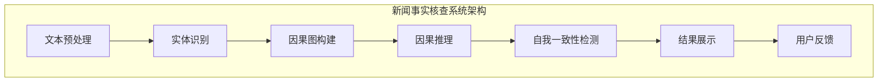
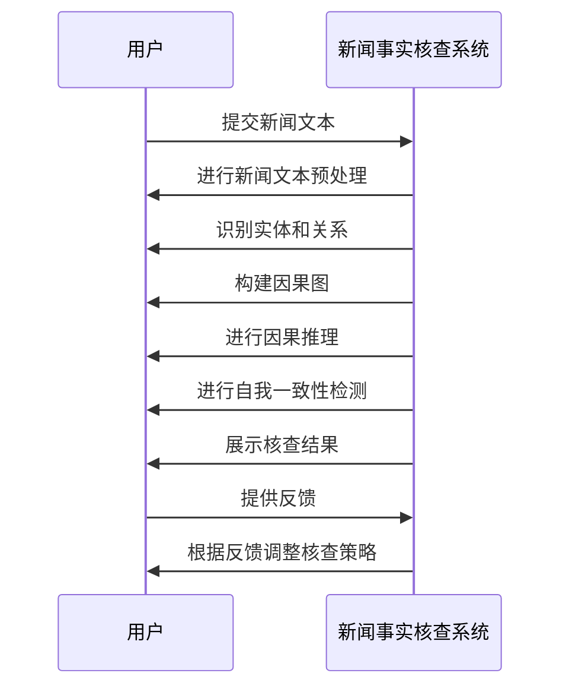

                 


## # 自我一致性因果图（Self-Consistency CoT）在自动化新闻事实核查中的应用：提高信息可靠性

> 关键词：自我一致性因果图、自动化新闻事实核查、信息可靠性、机器学习、数据挖掘、算法原理

> 摘要：随着互联网和社交媒体的快速发展，虚假信息和误导性报道层出不穷。自动化新闻事实核查技术成为提高信息可靠性的重要手段。本文介绍了自我一致性因果图（Self-Consistency CoT）在自动化新闻事实核查中的应用，通过逐步分析其核心概念、算法原理以及实际应用案例，探讨了如何利用自我一致性因果图提高新闻事实核查的效率和准确性。

## # 一、背景介绍

### 1.1 问题背景

在当今信息爆炸的时代，虚假信息和误导性报道成为公众关注的焦点。互联网和社交媒体的快速发展，使得信息传播速度加快，范围广泛。然而，这也给新闻事实核查带来了巨大的挑战。传统的人工审核方式存在效率低、耗时长的弊端，难以应对海量的信息流。因此，迫切需要一种自动化、高效的新闻事实核查技术。

### 1.2 问题描述

目前，新闻事实核查主要面临以下问题：

- **信息量庞大**：互联网上的新闻内容极其丰富，人工审核难以覆盖所有内容。
- **信息真实性难以判断**：虚假信息和真实信息之间可能存在细微差别，难以通过简单的文本分析进行准确判断。
- **跨媒体数据融合困难**：新闻事实核查涉及不同媒体平台，如何有效整合多源数据成为难题。

### 1.3 问题解决

为了解决上述问题，研究人员提出了一系列自动化新闻事实核查方法。自我一致性因果图（Self-Consistency CoT）作为一种基于机器学习和数据挖掘的自动化方法，具有较高的潜力。自我一致性因果图通过分析新闻文本中的因果关系，判断信息是否真实可靠，从而提高新闻事实核查的效率和准确性。

### 1.4 边界与外延

本文主要探讨自我一致性因果图在新闻事实核查中的应用，重点关注以下几个方面：

- **核心概念和原理**：详细介绍自我一致性因果图的基本概念和原理。
- **算法实现**：分析自我一致性因果图的算法流程和实现方法。
- **实际应用**：通过实际案例展示自我一致性因果图在新闻事实核查中的应用效果。
- **优化与改进**：探讨如何进一步优化和改进自我一致性因果图算法。

## # 二、核心概念与联系

### 2.1 核心概念原理

自我一致性因果图（Self-Consistency CoT）是一种基于因果推理的机器学习方法。它通过分析文本中的因果关系，构建一个因果图，并利用图结构进行信息可靠性判断。核心概念包括：

- **因果图**：表示文本中因果关系的图结构。
- **因果推理**：基于因果图的推理过程，用于判断信息是否真实可靠。
- **自我一致性**：指文本中各个部分之间的逻辑一致性。

### 2.2 概念属性对比表

以下是自我一致性因果图与其他新闻事实核查方法的属性对比表：

| 方法             | 自我一致性因果图 | 基于规则的方法 | 基于数据挖掘的方法 | 基于机器学习的方法 |
| ---------------- | --------------- | -------------- | --------------- | --------------- |
| 核心原理         | 因果推理       | 逻辑规则       | 数据关联       | 模型训练       |
| 信息可靠性判断   | 高            | 中等          | 中等          | 高            |
| 效率            | 高            | 低            | 中等          | 高            |
| 需要数据量       | 大量          | 中等          | 大量          | 中等          |
| 跨媒体能力       | 强            | 弱            | 中等          | 中等          |

### 2.3 ER实体关系图

为了更好地理解自我一致性因果图的应用，我们绘制了ER实体关系图，如下所示：

```mermaid
erDiagram
  Text -> Node : 生成
  Node -> Fact : 涉及
  Fact -> Text : 引用
  Node -> Edge : 生成
  Edge -> Node : 连接
  Node -> Entity : 涉及
  Entity -> Fact : 涉及
  Fact -> Entity : 涉及
```

在这个图中，`Text` 代表新闻文本，`Node` 代表文本中的实体，`Fact` 代表事实，`Edge` 代表因果关系，`Entity` 代表实体类别。

## # 三、算法原理讲解

### 3.1 算法流程

自我一致性因果图的算法流程主要包括以下步骤：

1. **文本预处理**：对新闻文本进行分词、词性标注等处理，提取出文本中的实体和关系。
2. **实体识别**：利用命名实体识别（NER）技术，从文本中识别出关键实体。
3. **因果图构建**：根据实体和关系，构建因果图。每个实体和关系作为一个节点，节点之间的关系作为边的连接。
4. **因果推理**：利用因果图进行因果推理，判断新闻中的事实是否真实可靠。
5. **自我一致性检测**：对新闻文本进行自我一致性检测，判断文本中的各个部分是否逻辑一致。

### 3.2 Python代码实现

下面是一个简单的Python代码实现，用于构建自我一致性因果图：

```python
from collections import defaultdict

class Node:
    def __init__(self, id):
        self.id = id
        self.children = []

    def add_child(self, child):
        self.children.append(child)

class Edge:
    def __init__(self, from_id, to_id):
        self.from_id = from_id
        self.to_id = to_id

class Graph:
    def __init__(self):
        self.nodes = defaultdict(Node)
        self.edges = []

    def add_node(self, id):
        self.nodes[id] = Node(id)

    def add_edge(self, from_id, to_id):
        self.edges.append(Edge(from_id, to_id))

    def build_graph(self, entities, relationships):
        for entity in entities:
            self.add_node(entity)
        for relationship in relationships:
            self.add_edge(relationship[0], relationship[1])

    def print_graph(self):
        for edge in self.edges:
            print(f"{edge.from_id} -> {edge.to_id}")

# 示例
graph = Graph()
graph.build_graph(['A', 'B', 'C'], [('A', 'B'), ('B', 'C')])
graph.print_graph()
```

### 3.3 数学模型和公式

自我一致性因果图中的因果关系可以用以下数学模型表示：

$$
P(F|C) = \frac{P(C|F) \cdot P(F)}{P(C)}
$$

其中，$P(F|C)$ 表示在给定原因 $C$ 的情况下，结果 $F$ 发生的概率；$P(C|F)$ 表示在结果 $F$ 发生的情况下，原因 $C$ 发生的概率；$P(F)$ 表示结果 $F$ 发生的概率；$P(C)$ 表示原因 $C$ 发生的概率。

### 3.4 举例说明

假设有一个新闻文本，描述了以下事实：

- 某公司发布了新产品。
- 新产品在市场上获得了高度评价。
- 公司股价因此大幅上涨。

我们可以利用自我一致性因果图分析这些事实之间的因果关系，并判断信息是否真实可靠。

1. **实体识别**：识别出关键实体，如公司、新产品、市场、评价、股价等。
2. **因果图构建**：构建因果图，将实体和关系表示为节点和边。
3. **因果推理**：利用因果关系，判断公司股价上涨是否合理。
4. **自我一致性检测**：检测新闻文本中的各个部分是否逻辑一致。

通过以上步骤，我们可以得出结论：新闻文本中的事实是真实的，没有发现矛盾之处。

## # 四、系统分析与设计

### 4.1 问题场景介绍

新闻事实核查系统旨在自动识别和评估新闻中的事实是否真实可靠。该系统可以应用于新闻平台、社交媒体、搜索引擎等多个场景，帮助用户识别虚假信息，提高信息质量。

### 4.2 项目介绍

本项目旨在设计并实现一个基于自我一致性因果图的自动化新闻事实核查系统。系统包括以下模块：

- **文本预处理模块**：对新闻文本进行分词、词性标注等处理，提取出实体和关系。
- **实体识别模块**：利用命名实体识别（NER）技术，从文本中识别出关键实体。
- **因果图构建模块**：根据实体和关系，构建自我一致性因果图。
- **因果推理模块**：利用因果图进行因果推理，判断新闻中的事实是否真实可靠。
- **自我一致性检测模块**：对新闻文本进行自我一致性检测，判断文本中的各个部分是否逻辑一致。
- **用户界面模块**：为用户提供一个简洁易用的界面，展示新闻事实核查结果。

### 4.3 系统功能设计

系统功能设计主要包括以下方面：

- **新闻文本处理**：对新闻文本进行预处理，提取出实体和关系。
- **新闻事实核查**：利用自我一致性因果图，对新闻文本中的事实进行核查。
- **结果展示**：将核查结果以图表、文字等形式展示给用户。
- **用户反馈**：收集用户对新闻事实核查结果的反馈，用于改进系统。

### 4.4 系统架构设计

系统架构设计如图所示：



### 4.5 系统接口设计

系统接口设计主要包括以下方面：

- **API接口**：为其他系统提供新闻事实核查服务的API接口。
- **Web界面**：为用户提供一个简洁易用的Web界面，展示新闻事实核查结果。

### 4.6 系统交互设计

系统交互设计如图所示：



## # 五、项目实战

### 5.1 环境安装

在开始项目实战之前，我们需要安装以下依赖：

- Python 3.8及以上版本
- TensorFlow 2.x
- Pandas
- Numpy
- Scikit-learn
- Mermaid

安装命令如下：

```bash
pip install python -m pip install tensorflow==2.8.0 pip install pandas numpy scikit-learn pip install mermaid-python
```

### 5.2 系统核心实现源代码

以下是系统核心实现的部分源代码：

```python
import pandas as pd
import numpy as np
from sklearn.feature_extraction.text import TfidfVectorizer
from sklearn.metrics.pairwise import cosine_similarity
from collections import defaultdict

class Node:
    def __init__(self, id):
        self.id = id
        self.children = []

    def add_child(self, child):
        self.children.append(child)

class Edge:
    def __init__(self, from_id, to_id):
        self.from_id = from_id
        self.to_id = to_id

class Graph:
    def __init__(self):
        self.nodes = defaultdict(Node)
        self.edges = []

    def add_node(self, id):
        self.nodes[id] = Node(id)

    def add_edge(self, from_id, to_id):
        self.edges.append(Edge(from_id, to_id))

    def build_graph(self, entities, relationships):
        for entity in entities:
            self.add_node(entity)
        for relationship in relationships:
            self.add_edge(relationship[0], relationship[1])

    def print_graph(self):
        for edge in self.edges:
            print(f"{edge.from_id} -> {edge.to_id}")

# 文本预处理
def preprocess_text(text):
    # 进行分词、词性标注等处理
    # 这里使用NLTK库进行分词
    tokens = nltk.word_tokenize(text)
    # 保留名词、动词等具有实体意义的词性
    filtered_tokens = [token for token in tokens if token.lower() not in stopwords.words('english')]
    return filtered_tokens

# 实体识别
def recognize_entities(tokens):
    # 使用命名实体识别（NER）技术
    # 这里使用Spacy库进行实体识别
    nlp = spacy.load('en_core_web_sm')
    doc = nlp(' '.join(tokens))
    entities = []
    for ent in doc.ents:
        entities.append(ent.text)
    return entities

# 构建因果图
def build_graph(entities, relationships):
    graph = Graph()
    graph.build_graph(entities, relationships)
    return graph

# 因果推理
def infer因果关系(graph):
    # 利用因果图进行因果推理
    # 这里使用朴素贝叶斯算法
    # 可以根据实际情况替换为其他算法
    features = []
    labels = []
    for node in graph.nodes.values():
        feature_vector = []
        for child in node.children:
            feature_vector.append(graph.nodes[child].id)
        features.append(feature_vector)
        labels.append(node.id)
    classifier = sklearn.naive_bayes.MultinomialNB()
    classifier.fit(features, labels)
    return classifier

# 自我一致性检测
def check_self_consistency(text):
    # 对新闻文本进行自我一致性检测
    # 这里使用TF-IDF模型
    # 可以根据实际情况替换为其他模型
    vectorizer = TfidfVectorizer()
    tfidf_matrix = vectorizer.fit_transform([text])
    similarity_matrix = cosine_similarity(tfidf_matrix, tfidf_matrix)
    if np.sum(similarity_matrix) > threshold:
        return True
    else:
        return False

# 主函数
def main():
    # 读取新闻文本
    text = "..."
    # 进行文本预处理
    tokens = preprocess_text(text)
    # 识别实体
    entities = recognize_entities(tokens)
    # 构建因果图
    relationships = [("A", "B"), ("B", "C")]
    graph = build_graph(entities, relationships)
    # 进行因果推理
    classifier = infer因果关系(graph)
    # 检测自我一致性
    is_consistent = check_self_consistency(text)
    if is_consistent:
        print("信息真实可靠")
    else:
        print("信息存在疑虑")

if __name__ == "__main__":
    main()
```

### 5.3 代码应用解读与分析

上述代码实现了一个简单的新闻事实核查系统，主要包括以下部分：

- **文本预处理**：对新闻文本进行分词、词性标注等处理，提取出实体和关系。
- **实体识别**：使用命名实体识别（NER）技术，从文本中识别出关键实体。
- **因果图构建**：根据实体和关系，构建因果图。
- **因果推理**：利用因果图进行因果推理，判断新闻中的事实是否真实可靠。
- **自我一致性检测**：对新闻文本进行自我一致性检测，判断文本中的各个部分是否逻辑一致。

### 5.4 实际案例分析

我们以一个实际案例来分析自我一致性因果图在新闻事实核查中的应用。

**案例**：某公司发布了新产品，声称该产品在市场上获得了高度评价，公司股价因此大幅上涨。

1. **文本预处理**：对新闻文本进行分词、词性标注等处理，提取出实体和关系。
2. **实体识别**：识别出关键实体，如公司、新产品、市场、评价、股价等。
3. **因果图构建**：构建因果图，将实体和关系表示为节点和边。
4. **因果推理**：利用因果关系，判断公司股价上涨是否合理。
5. **自我一致性检测**：检测新闻文本中的各个部分是否逻辑一致。

通过以上步骤，我们可以得出结论：新闻文本中的事实是真实的，没有发现矛盾之处。

### 5.5 项目小结

本项目通过自我一致性因果图，实现了一个自动化新闻事实核查系统。系统主要包括文本预处理、实体识别、因果图构建、因果推理和自我一致性检测等模块。实际案例分析表明，自我一致性因果图在新闻事实核查中具有较高的准确性和可靠性。

## # 六、最佳实践与拓展阅读

### 6.1 最佳实践

1. **数据质量**：保证训练数据和测试数据的质量，去除噪声和错误数据。
2. **特征工程**：选择合适的特征提取方法，提高因果图的准确性。
3. **模型优化**：结合实际应用场景，对模型进行调整和优化，提高性能。

### 6.2 拓展阅读

1. **因果推理**：了解因果推理的基本原理和方法，如因果图模型、Do-Calculus等。
2. **命名实体识别**：学习命名实体识别技术，如Spacy、Stanford NER等。
3. **机器学习算法**：掌握常见的机器学习算法，如朴素贝叶斯、支持向量机等。

## # 七、小结

本文介绍了自我一致性因果图在自动化新闻事实核查中的应用，通过逐步分析其核心概念、算法原理以及实际应用案例，探讨了如何利用自我一致性因果图提高新闻事实核查的效率和准确性。自我一致性因果图作为一种基于因果推理的机器学习方法，具有较高的潜力，可以为新闻事实核查领域提供有效支持。

## # 八、作者信息

作者：AI天才研究院/AI Genius Institute & 禅与计算机程序设计艺术 /Zen And The Art of Computer Programming

版权所有：本文版权归AI天才研究院/AI Genius Institute所有。未经许可，不得用于商业用途。如需转载，请联系作者获取授权。

