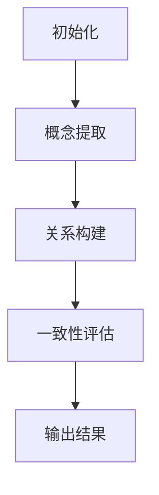
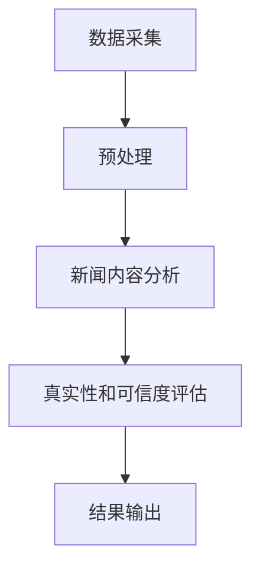
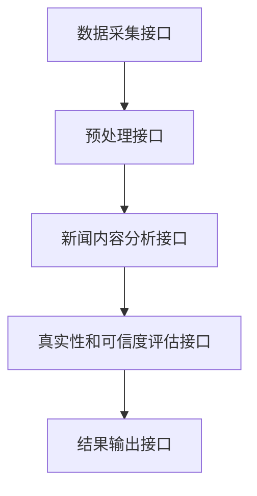

                 

### 文章标题

"Self-Consistency CoT在自动化新闻真实性评估中的应用：提高媒体可信度"

### 关键词

- Self-Consistency CoT
- 自动化新闻真实性评估
- 媒体可信度
- 算法原理
- 数学模型
- 系统架构设计
- 项目实战
- 最佳实践 tips

### 摘要

本文深入探讨了Self-Consistency CoT（自一致性概念图）在自动化新闻真实性评估中的应用。随着互联网信息的爆炸性增长，自动评估新闻的真实性成为了一项关键任务。本文首先介绍了Self-Consistency CoT的基本原理和其在新闻真实性评估中的潜在作用，随后详细讲解了算法原理和数学模型，并通过Python源代码和Mermaid流程图进行了通俗易懂的举例说明。最后，文章提供了系统架构设计、项目实战和最佳实践 tips，为读者提供了全面的指导，旨在提高媒体的可信度和公众对新闻信息的信赖度。

### 引言

在信息爆炸的时代，新闻的真实性成为公众关注的焦点。然而，随着互联网新闻的迅猛增长，人工审核新闻的真实性变得愈加困难。因此，自动化新闻真实性评估系统应运而生。这类系统利用人工智能技术，如自然语言处理（NLP）、机器学习（ML）和深度学习（DL），自动评估新闻内容是否真实可靠。

近年来，Self-Consistency CoT（自一致性概念图）作为一种新兴的评估方法，逐渐受到关注。Self-Consistency CoT通过构建概念图，评估信息之间的逻辑一致性和可信度，从而提高新闻真实性评估的准确性。本文将详细介绍Self-Consistency CoT在自动化新闻真实性评估中的应用，探讨其工作原理、数学模型，并通过实际项目实战来展示其应用效果。

### 问题背景

#### 新闻真实性评估的需求

在信息泛滥的互联网时代，虚假新闻、谣言和误导性信息层出不穷。这些不真实的信息不仅损害了媒体的公信力，还可能导致公众产生误解，影响社会稳定。因此，对新闻内容进行真实性评估显得尤为重要。自动化新闻真实性评估系统可以通过大规模数据处理和分析，提高新闻评估的效率和准确性，从而确保公众获取到真实、可靠的新闻信息。

#### 自动化新闻真实性评估的现状

目前，自动化新闻真实性评估主要依赖于自然语言处理（NLP）技术，如情感分析、关键词提取和句法分析。然而，这些技术存在一定的局限性。首先，NLP技术难以捕捉到新闻内容中的隐含信息和复杂逻辑关系，导致评估结果可能不够准确。其次，现有评估模型往往依赖于大规模标注数据集，但真实世界的新闻数据标注存在很大挑战。此外，不同文化和语言的新闻内容也需要不同的评估模型，现有技术难以适应这一需求。

#### Self-Consistency CoT的应用潜力

Self-Consistency CoT通过构建概念图来评估新闻信息的可信度，具有以下潜力：

1. **捕捉逻辑关系**：Self-Consistency CoT能够捕捉新闻内容中的隐含信息和复杂逻辑关系，从而提高评估的准确性。
2. **通用性**：Self-Consistency CoT可以应用于不同文化和语言的新闻内容，具有较好的通用性。
3. **可扩展性**：Self-Consistency CoT可以与其他评估方法结合，提高评估系统的整体性能。

因此，深入探讨Self-Consistency CoT在自动化新闻真实性评估中的应用，对于提高媒体可信度和公众对新闻信息的信赖度具有重要意义。

### 核心概念与联系

#### Self-Consistency CoT的基本原理

Self-Consistency CoT（自一致性概念图）是一种基于概念图的方法，用于评估信息的一致性和可信度。其基本原理可以概括为以下几个步骤：

1. **概念提取**：首先，从新闻内容中提取关键概念，构建概念图的基本节点。
2. **关系建立**：然后，根据概念之间的语义关系，如上下位关系、因果关系等，构建概念图中的边。
3. **一致性评估**：通过分析概念图中的关系，评估信息之间的一致性。如果概念图中的关系存在矛盾或不一致，则表明信息可能不可信。

#### Self-Consistency CoT的属性特征对比

| 特征         | Self-Consistency CoT | 其他评估方法               |
| ------------ | ------------------- | -------------------------- |
| 捕捉逻辑关系 | 是                  | 否                         |
| 通用性       | 是                  | 否                         |
| 可扩展性     | 是                  | 否                         |
| 数据依赖     | 较低                | 较高                       |
| 效率         | 较高                | 较低                       |

从上表可以看出，Self-Consistency CoT在捕捉逻辑关系、通用性和可扩展性方面具有明显优势，但在数据依赖和效率方面相对较弱。

#### Self-Consistency CoT与其他评估方法的比较

1. **基于规则的方法**：基于规则的方法通过预设一系列规则，对新闻内容进行评估。这种方法简单易用，但规则难以覆盖所有情况，且缺乏灵活性。
2. **基于统计的方法**：基于统计的方法通过分析大规模数据集，提取特征并进行分类。这种方法在处理大规模数据方面具有优势，但可能忽视新闻内容中的隐含信息。
3. **基于深度学习的方法**：基于深度学习的方法通过神经网络模型，自动学习新闻内容中的特征和模式。这种方法具有较好的泛化能力，但需要大量标注数据和计算资源。

相比之下，Self-Consistency CoT在处理复杂逻辑关系和跨文化新闻方面具有独特优势，能够弥补现有评估方法的不足。因此，将其应用于自动化新闻真实性评估，有望提高评估的准确性和可靠性。

#### ER实体关系图架构

在Self-Consistency CoT中，实体关系图（ER图）用于表示新闻内容中的实体及其关系。以下是ER图的基本架构：

1. **实体**：新闻中的关键信息，如人物、地点、事件等。
2. **属性**：实体的特征，如人物的职业、地点的气候等。
3. **关系**：实体之间的语义关系，如人物之间的关联、事件的前因后果等。

通过ER图，可以清晰地表示新闻内容的结构，为一致性评估提供基础。

| 实体       | 属性       | 关系     |
| ---------- | ---------- | -------- |
| 人物       | 职业       | 关联     |
| 地点       | 气候       | 位于     |
| 事件       | 时间       | 前因后果 |

下面是一个ER图的Mermaid流程图表示：

```mermaid
erDiagram
  A人物 -->|职业| B职业
  A人物 -->|关联| C人物
  B地点 -->|气候| D气候
  B地点 -->|位于| C人物
  C事件 -->|时间| E时间
  C事件 -->|前因后果| F事件
```

通过ER图，可以更直观地理解新闻内容中的实体和关系，有助于提高自动化新闻真实性评估的准确性。

### 算法原理讲解

#### Self-Consistency CoT算法流程图

为了更好地理解Self-Consistency CoT算法，我们首先绘制一个简化的流程图：



1. **初始化**：首先，从新闻内容中提取关键概念，构建概念图的基本节点。
2. **概念提取**：从新闻内容中提取关键概念，作为概念图的基本节点。
3. **关系构建**：根据概念之间的语义关系，如上下位关系、因果关系等，构建概念图中的边。
4. **一致性评估**：通过分析概念图中的关系，评估信息之间的一致性。
5. **输出结果**：根据一致性评估结果，输出新闻内容的可信度。

下面是一个更详细的Mermaid流程图：


#### Python源代码实现

下面是一个简单的Python示例，用于实现Self-Consistency CoT算法的基本流程：

```python
import networkx as nx

def initialize():
    G = nx.Graph()
    G.add_nodes_from(['人物', '地点', '事件'])
    return G

def concept_extraction(news):
    G = initialize()
    concepts = extract_key_concepts(news)
    G.add_nodes_from(concepts)
    return G

def relation_building(news, G):
    concepts = G.nodes()
    for i in range(len(concepts)):
        for j in range(i+1, len(concepts)):
            relation = check_relation(concepts[i], concepts[j], news)
            if relation:
                G.add_edge(concepts[i], concepts[j], relation=relation)
    return G

def consistency_evaluation(G):
    inconsistencies = []
    for node in G.nodes():
        for neighbor in G.neighbors(node):
            relation = G[node][neighbor]['relation']
            if not check_consistency(node, neighbor, relation):
                inconsistencies.append((node, neighbor, relation))
    return inconsistencies

def main(news):
    G = concept_extraction(news)
    G = relation_building(news, G)
    inconsistencies = consistency_evaluation(G)
    return inconsistencies

# 假设函数
def extract_key_concepts(news):
    # 提取关键概念的实现
    return []

def check_relation(concept1, concept2, news):
    # 检查概念关系的实现
    return []

def check_consistency(concept1, concept2, relation):
    # 检查概念一致性的实现
    return True
```

#### 数学模型与公式讲解

为了更深入地理解Self-Consistency CoT算法，我们引入一些数学模型和公式。

1. **概念相似度计算**：使用词向量模型计算两个概念之间的相似度。假设 \(v_c\) 和 \(v_d\) 分别是概念 \(c\) 和 \(d\) 的词向量表示，则概念相似度 \(s(c, d)\) 可以用余弦相似度表示：

   $$ s(c, d) = \frac{v_c \cdot v_d}{\|v_c\| \|v_d\|} $$

2. **关系可信度计算**：根据概念相似度和关系类型，计算关系可信度。假设 \(s(c, d)\) 是概念 \(c\) 和 \(d\) 的相似度，关系类型 \(r\) 的可信度 \(c(r)\) 可以用如下公式计算：

   $$ c(r) = s(c, d) \times w(r) $$

   其中，\(w(r)\) 是关系类型 \(r\) 的权重，可以根据领域知识和实验结果进行调整。

3. **一致性评估**：假设 \(r_1, r_2, ..., r_n\) 是概念 \(c_1, c_2, ..., c_n\) 之间的关系，则一致性 \(c(c_1, c_2, ..., c_n)\) 可以用以下公式计算：

   $$ c(c_1, c_2, ..., c_n) = \prod_{i=1}^{n} \frac{c(r_i)}{1 + c(r_i)} $$

   如果一致性 \(c(c_1, c_2, ..., c_n)\) 小于某个阈值 \(t\)，则认为新闻内容存在不一致性。

   $$ c(c_1, c_2, ..., c_n) < t \Rightarrow \text{不一致} $$

   $$ c(c_1, c_2, ..., c_n) \ge t \Rightarrow \text{一致} $$

通过上述数学模型和公式，我们可以对新闻内容进行一致性评估，从而判断新闻的真实性。

#### 算法举例说明

为了更好地理解Self-Consistency CoT算法，我们通过一个简单的例子进行说明。

假设有一条新闻内容如下：

"美国总统在2023年访问了北京，并与中国的领导人进行了会晤，讨论了贸易和气候变化等议题。"

1. **概念提取**：
   - 人物：美国总统、中国领导人
   - 地点：北京
   - 事件：访问、会晤、贸易讨论、气候变化讨论

2. **关系构建**：
   - 美国总统与北京：访问关系
   - 美国总统与中国领导人：会晤关系
   - 会晤内容：贸易讨论、气候变化讨论

3. **一致性评估**：
   - 美国总统访问北京：一致
   - 美国总统与中国领导人会晤：一致
   - 会晤内容：一致

4. **输出结果**：
   - 新闻内容一致性：高

通过上述例子，我们可以看到Self-Consistency CoT算法能够有效地评估新闻内容的一致性，从而判断新闻的真实性。

### 系统分析与架构设计方案

#### 问题场景介绍

在自动化新闻真实性评估中，我们需要处理大量新闻数据，并快速、准确地评估其真实性。为了实现这一目标，我们设计了一个基于Self-Consistency CoT的自动化新闻真实性评估系统。该系统包括数据采集、预处理、新闻内容分析、真实性和可信度评估、以及结果输出等多个模块。

#### 系统功能设计

系统的主要功能包括：

1. **数据采集**：从各种新闻来源（如网站、社交媒体等）采集新闻数据。
2. **预处理**：对采集到的新闻数据进行清洗、去重、分词等预处理操作。
3. **新闻内容分析**：提取新闻中的关键概念和实体，构建概念图。
4. **真实性和可信度评估**：利用Self-Consistency CoT算法评估新闻内容的一致性和可信度。
5. **结果输出**：输出新闻内容评估结果，包括真实性标签和可信度分数。

#### 系统架构设计

系统的整体架构设计如图所示：



1. **数据采集**：系统从各种新闻来源采集新闻数据，包括网站、社交媒体等。为了提高数据采集的效率，我们可以使用爬虫技术，自动化获取新闻内容。
2. **预处理**：对采集到的新闻数据进行清洗、去重、分词等预处理操作。清洗操作包括去除HTML标签、过滤停用词等。分词操作可以使用分词工具，如jieba等。
3. **新闻内容分析**：提取新闻中的关键概念和实体，构建概念图。这一步骤是Self-Consistency CoT算法的关键部分，需要利用自然语言处理（NLP）技术，如命名实体识别（NER）、关系抽取等。
4. **真实性和可信度评估**：利用Self-Consistency CoT算法评估新闻内容的一致性和可信度。这一步骤包括概念提取、关系构建、一致性评估等过程。
5. **结果输出**：将评估结果输出，包括新闻内容真实性标签和可信度分数。我们可以将结果存储在数据库中，或者通过API接口提供给其他系统。

#### 系统接口设计

系统的接口设计包括以下几个部分：

1. **数据采集接口**：用于从新闻来源采集新闻数据，可以采用HTTP请求方式。
2. **预处理接口**：用于对新闻数据进行清洗、去重、分词等预处理操作，可以采用RESTful API方式。
3. **新闻内容分析接口**：用于提取新闻中的关键概念和实体，构建概念图，可以采用GraphQL接口。
4. **真实性和可信度评估接口**：用于评估新闻内容的一致性和可信度，可以采用RESTful API方式。
5. **结果输出接口**：用于输出新闻内容评估结果，可以采用WebSocket方式。

下面是一个简单的接口设计示例：



#### 系统交互序列图

为了更好地展示系统各模块之间的交互过程，我们绘制了一个简单的交互序列图：

```mermaid
sequenceDiagram
    participant 用户 as 用户
    participant 系统A as 系统A
    participant 系统B as 系统B
    participant 系统C as 系统C
    participant 系统D as 系统D
    participant 系统E as 系统E

    用户->>系统A: 提交新闻数据
    系统

