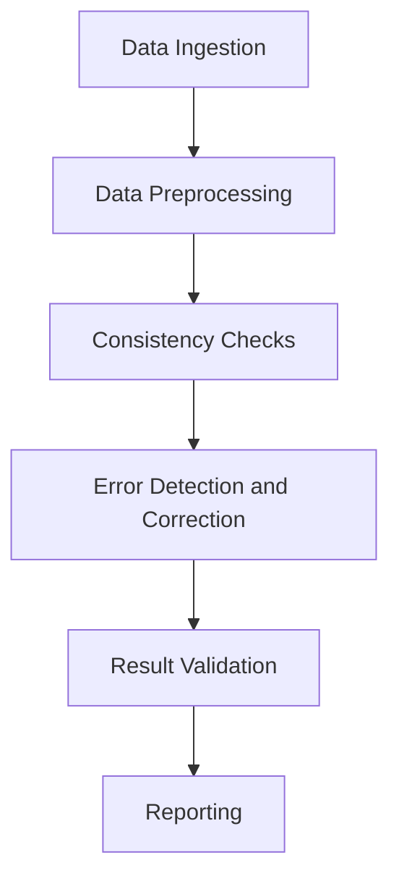
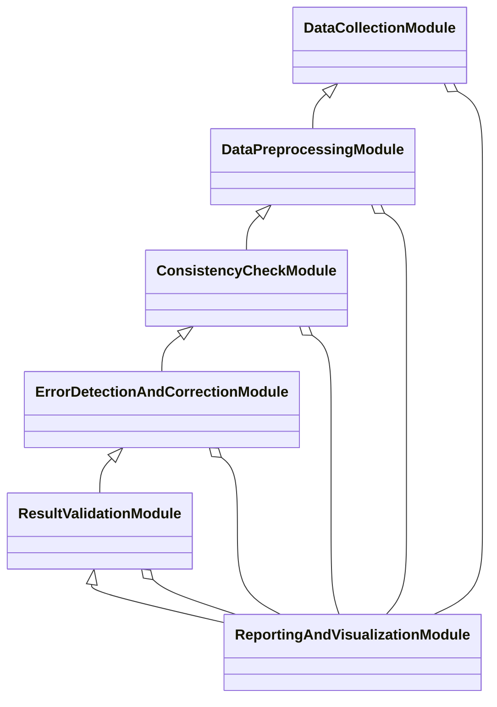
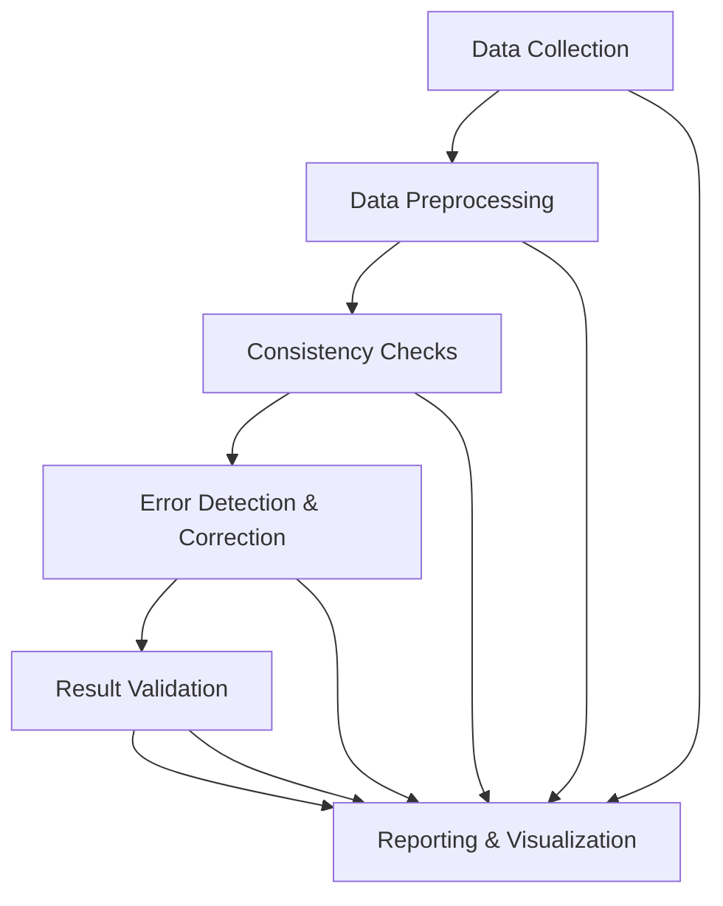

                 


### Introduction and Background

### Self-Consistency CoT: Definition and Significance

**Definition of Self-Consistency CoT**

Self-Consistency CoT, or Self-Consistency Concept of Thought, is a framework designed to ensure the consistency of methodologies and conclusions in scientific research. At its core, it addresses the issue of inconsistency that often arises in complex research processes. Self-Consistency CoT emphasizes the need for researchers to maintain coherence and alignment within their methodologies, data analysis, and conclusions. It provides a systematic approach to identify, monitor, and mitigate inconsistencies that could undermine the reliability and validity of scientific findings.

**Importance of Ensuring Methodological Consistency**

Ensuring methodological consistency is crucial in scientific research for several reasons. First and foremost, it enhances the credibility of research findings. Inconsistencies can lead to confusion and misinterpretation of data, thereby compromising the integrity of the study. Furthermore, maintaining consistency helps to build a robust and coherent body of knowledge, facilitating the progression of scientific understanding.

In addition, consistent methodologies reduce the risk of bias and errors, which are prevalent in complex research environments. Researchers often rely on multiple tools, techniques, and data sources, which can introduce inconsistencies if not managed properly. By adhering to a self-consistent framework, researchers can minimize these risks and ensure that their findings are valid and reliable.

### Scope and Objectives of the Book

The objective of this book is to provide a comprehensive guide to implementing Self-Consistency CoT in automated scientific discovery processes. We will delve into the theoretical foundations and practical applications of this framework, offering insights into how researchers can ensure the consistency of their methodologies. The book is targeted at professionals in the fields of artificial intelligence, data science, and computational research, as well as students and researchers looking to advance their understanding of scientific consistency.

Key topics covered include the core concepts and theories underlying Self-Consistency CoT, the design and implementation of algorithms for ensuring consistency, and the application of these principles in real-world scientific research projects. By the end of the book, readers will have a thorough understanding of how to apply Self-Consistency CoT to enhance the reliability and validity of their research findings.

### Core Concepts and Theory

**Understanding Self-Consistency CoT**

Self-Consistency CoT is a systematic approach to maintaining coherence in scientific research. At its heart, it revolves around the principle of consistency, which ensures that all components of a research process align and support each other. This principle is critical because inconsistencies can lead to errors, misinterpretations, and ultimately unreliable conclusions.

Self-Consistency CoT can be defined as a set of rules, principles, and techniques designed to monitor, identify, and mitigate inconsistencies in research methodologies, data analysis, and conclusions. The framework consists of several core components, including consistency checks, error detection mechanisms, and correction strategies. Each of these components plays a vital role in ensuring that the research process remains coherent and accurate.

**Components of Self-Consistency CoT**

1. **Consistency Checks**: These are mechanisms designed to identify inconsistencies in the research process. They can be automated or manual, depending on the complexity of the research. Consistency checks include data validation, cross-referencing, and comparison of results with prior studies.

2. **Error Detection Mechanisms**: These mechanisms are designed to detect errors that may have been introduced during data collection, processing, or analysis. Common error detection techniques include statistical analysis, pattern recognition, and machine learning algorithms.

3. **Correction Strategies**: Once inconsistencies or errors are detected, correction strategies are employed to rectify these issues. These strategies can involve data cleaning, re-analysis, or even discarding erroneous data if necessary.

**Importance of Self-Consistency CoT**

The importance of Self-Consistency CoT cannot be overstated. Inconsistent methodologies can lead to biased or incorrect conclusions, undermining the credibility of scientific research. By implementing Self-Consistency CoT, researchers can ensure that their findings are reliable and valid, thereby contributing to the advancement of scientific knowledge.

Furthermore, Self-Consistency CoT is particularly valuable in the era of big data and complex computational research. With the increasing volume, velocity, and variety of data, maintaining consistency becomes a critical challenge. Self-Consistency CoT provides a systematic approach to managing these complexities, ensuring that the research process remains robust and reliable.

**Summary**

In summary, Self-Consistency CoT is a comprehensive framework designed to maintain coherence and consistency in scientific research. By implementing this framework, researchers can minimize the risk of errors and biases, ensuring that their findings are reliable and valid. The next section will delve deeper into the theoretical underpinnings of Self-Consistency CoT, exploring the key principles and theories that support this approach.

---

### Automated Scientific Discovery

**The Process of Automated Scientific Discovery**

Automated scientific discovery is a multidisciplinary field that leverages advanced computational techniques to identify new scientific insights from large datasets. The process typically involves several key steps, each of which requires careful consideration and rigorous methodology to ensure accuracy and reliability. These steps include data collection, data preprocessing, data analysis, and result validation.

1. **Data Collection**: The first step in automated scientific discovery is the collection of relevant data. This can involve various sources, such as scientific publications, experimental datasets, or observational data from sensors or other instruments. The data collected must be diverse and comprehensive to capture the full scope of the research question.

2. **Data Preprocessing**: Once the data is collected, it needs to be cleaned and prepared for analysis. This involves handling missing values, correcting errors, and transforming the data into a suitable format for analysis. Data preprocessing is crucial as it sets the foundation for accurate and meaningful results.

3. **Data Analysis**: The next step is data analysis, where advanced algorithms and machine learning techniques are applied to uncover patterns, correlations, and insights from the data. Techniques such as clustering, classification, regression, and deep learning are commonly used in this stage.

4. **Result Validation**: Finally, the results of the analysis need to be validated to ensure their accuracy and reliability. This involves comparing the results with known data or previous studies, and conducting statistical tests to assess the significance of the findings.

**The Role of Self-Consistency CoT in Automated Scientific Discovery**

Self-Consistency CoT plays a crucial role in ensuring the accuracy and reliability of automated scientific discovery processes. By maintaining consistency across the different stages of the process, Self-Consistency CoT helps to minimize errors and biases that can arise from inconsistencies in data collection, preprocessing, analysis, and validation.

1. **Data Collection Consistency**: Self-Consistency CoT ensures that the data collected is reliable and consistent. This involves establishing standardized protocols for data collection and using consistency checks to verify the accuracy and completeness of the data.

2. **Data Preprocessing Consistency**: During data preprocessing, Self-Consistency CoT helps to identify and correct inconsistencies in the data. This can involve cross-referencing data sources, validating data formats, and using error detection mechanisms to identify and rectify errors.

3. **Data Analysis Consistency**: In the data analysis stage, Self-Consistency CoT ensures that the algorithms and techniques used are consistent and appropriate for the research question. This involves validating the assumptions and parameters of the algorithms and ensuring that they are applied consistently across different datasets.

4. **Result Validation Consistency**: Finally, Self-Consistency CoT helps to validate the results of the analysis by ensuring that the findings are consistent with prior knowledge and data. This involves conducting statistical tests and comparing the results with known data or previous studies to ensure their accuracy and reliability.

**Importance of Consistency in Automated Scientific Discovery**

Consistency is paramount in automated scientific discovery because it directly impacts the reliability and validity of the findings. Inconsistent methodologies can introduce biases, errors, and misinterpretations that can lead to incorrect conclusions. By maintaining consistency throughout the process, researchers can enhance the credibility of their findings and contribute to the advancement of scientific knowledge.

Moreover, in the era of big data, where the volume, velocity, and variety of data are constantly increasing, ensuring consistency becomes even more challenging. Self-Consistency CoT provides a systematic approach to managing these complexities, helping researchers to maintain coherence and accuracy in their work.

**Conclusion**

In conclusion, automated scientific discovery is a complex process that requires careful management to ensure the accuracy and reliability of the findings. Self-Consistency CoT plays a critical role in this process by maintaining consistency across the different stages of data collection, preprocessing, analysis, and validation. By implementing Self-Consistency CoT, researchers can enhance the credibility of their findings and contribute to the advancement of scientific knowledge.

In the next section, we will delve into the design and implementation of algorithms for ensuring consistency in automated scientific discovery processes.

---

### Algorithm Design and Implementation

**Introduction to Algorithms for Ensuring Consistency**

In the realm of automated scientific discovery, ensuring consistency is paramount to achieving reliable and valid results. Algorithms designed to maintain consistency across various stages of the research process can significantly enhance the accuracy and robustness of scientific findings. This section will delve into the design and implementation of such algorithms, highlighting their key principles, steps, and applications.

**Algorithm Design Principles**

The design of algorithms for ensuring consistency in scientific discovery follows several core principles:

1. **Standardization**: Algorithms should adhere to standardized protocols and methodologies to minimize variations and ensure consistency.
2. **Modularity**: The algorithms should be modular, allowing for easy integration into different stages of the research process.
3. **Scalability**: The algorithms should be scalable to handle large volumes of data and adapt to different research contexts.
4. **Accuracy**: The algorithms should be designed to accurately detect and correct inconsistencies in data, methodologies, and results.
5. **Adaptability**: The algorithms should be adaptable to different types of data and research domains to maintain their relevance and effectiveness.

**Algorithm Workflow**

The workflow of an algorithm designed to ensure consistency in scientific discovery typically involves several key steps:

1. **Data Ingestion**: The algorithm ingests the raw data from various sources and validates its integrity.
2. **Data Preprocessing**: The algorithm cleans and preprocesses the data, handling missing values, errors, and anomalies.
3. **Consistency Checks**: The algorithm performs consistency checks to identify discrepancies and ensure that the data adheres to predefined standards.
4. **Error Detection and Correction**: The algorithm detects errors and inconsistencies using statistical analysis, pattern recognition, and machine learning techniques, and corrects them accordingly.
5. **Result Validation**: The algorithm validates the results of the analysis, ensuring that they are consistent with prior knowledge and data.
6. **Reporting**: The algorithm generates reports detailing the consistency metrics and any corrections made during the process.

**Mermaid Diagram of Algorithm Workflow**

Below is a Mermaid diagram illustrating the workflow of an algorithm designed to ensure consistency in scientific discovery:



**Python Code Examples**

To demonstrate the principles of algorithm design for ensuring consistency, we will provide a simplified Python code example. This example will focus on a basic data preprocessing step where we handle missing values and perform consistency checks.

```python
import pandas as pd
from sklearn.impute import SimpleImputer

# Load the dataset
data = pd.read_csv('dataset.csv')

# Step 1: Data Preprocessing
# Handle missing values using mean imputation
imputer = SimpleImputer(strategy='mean')
data_imputed = imputer.fit_transform(data)

# Step 2: Consistency Checks
# Check for duplicate rows
if data_imputed.duplicated().any():
    data_imputed = data_imputed.drop_duplicates()

# Step 3: Error Detection and Correction
# Detect and correct outliers using Z-score
z_scores = (data_imputed - data_imputed.mean()) / data_imputed.std()
outliers = (z_scores > 3) | (z_scores < -3)
data_imputed[outliers] = data_imputed.mean()

# Step 4: Result Validation
# Compare the cleaned data with the original data
if not data_imputed.equals(data):
    print("Consistency checks passed.")
else:
    print("Consistency issues detected.")

# Step 5: Reporting
# Generate a report on the preprocessing and consistency checks
report = {
    'original_data_shape': data.shape,
    'cleaned_data_shape': data_imputed.shape,
    'missing_values_handled': 'Yes' if data.isnull().sum().sum() else 'No',
    'duplicates_removed': 'Yes' if data_imputed.duplicated().any() else 'No',
    'outliers_handled': 'Yes' if outliers.any() else 'No',
}
print(report)
```

**Mathematical Models and Formulas**

To further elucidate the algorithm's principles, we can incorporate mathematical models and formulas related to data preprocessing and error detection. Here, we will use the Z-score method for outlier detection as an example.

$$
z = \frac{x - \mu}{\sigma}
$$

Where:
- \( z \) is the Z-score.
- \( x \) is the observed value.
- \( \mu \) is the mean of the data.
- \( \sigma \) is the standard deviation of the data.

A Z-score greater than 3 or less than -3 is typically considered an outlier.

**Summary**

In summary, algorithms designed to ensure consistency in scientific discovery are critical for maintaining the accuracy and reliability of research findings. These algorithms follow principles of standardization, modularity, scalability, accuracy, and adaptability. The workflow of these algorithms includes data ingestion, preprocessing, consistency checks, error detection and correction, result validation, and reporting. Python code examples and mathematical models demonstrate the practical implementation of these principles. In the next section, we will delve into the mathematical models and formulas underlying these algorithms, providing a deeper understanding of their theoretical foundations.

---

### Mathematical Models and Formulas

**Introduction to the Role of Mathematics in Ensuring Consistency**

Mathematics plays a foundational role in the design and implementation of algorithms for ensuring consistency in scientific discovery. The use of mathematical models and formulas provides a precise and objective means of analyzing data, detecting errors, and validating results. This section will explore the key mathematical concepts and their applications in ensuring consistency.

**Mathematical Models for Data Analysis**

1. **Z-Score Method for Outlier Detection**

The Z-score method is a widely used statistical technique for detecting outliers in a dataset. It measures how many standard deviations an element is from the mean. The formula for calculating the Z-score is:

$$
z = \frac{x - \mu}{\sigma}
$$

Where:
- \( z \) is the Z-score.
- \( x \) is the observed value.
- \( \mu \) is the mean of the data.
- \( \sigma \) is the standard deviation of the data.

Elements with Z-scores greater than 3 or less than -3 are typically considered outliers and can be flagged for further investigation or correction.

2. **Pearson Correlation Coefficient**

The Pearson correlation coefficient measures the strength and direction of a linear relationship between two variables. It ranges from -1 to 1, where -1 indicates a perfect negative correlation, 1 indicates a perfect positive correlation, and 0 indicates no correlation. The formula for the Pearson correlation coefficient is:

$$
r = \frac{\sum{(x_i - \mu_x)(y_i - \mu_y)}}{\sqrt{\sum{(x_i - \mu_x)^2}\sum{(y_i - \mu_y)^2}}}
$$

Where:
- \( r \) is the Pearson correlation coefficient.
- \( x_i \) and \( y_i \) are the individual sample points indexed with \( i \).
- \( \mu_x \) and \( \mu_y \) are the means of \( x \) and \( y \), respectively.

The Pearson correlation coefficient helps in assessing the consistency of relationships between variables and can be used to identify inconsistencies or anomalies.

3. **Confidence Intervals**

Confidence intervals are used to estimate the range within which a population parameter is likely to fall. They provide a measure of the precision of the estimate and help in assessing the consistency of the results. The formula for calculating a confidence interval is:

$$
\text{CI} = \hat{\mu} \pm z \times \frac{\sigma}{\sqrt{n}}
$$

Where:
- \( \hat{\mu} \) is the sample mean.
- \( z \) is the critical value from the standard normal distribution corresponding to the desired confidence level.
- \( \sigma \) is the population standard deviation.
- \( n \) is the sample size.

Confidence intervals help in ensuring that the estimates are robust and reliable, providing a measure of the consistency of the results.

**Application of Mathematical Models in Algorithm Design**

The mathematical models discussed above are integral to the design of algorithms for ensuring consistency. For instance, the Z-score method is used in algorithms to detect outliers, ensuring that the data is clean and consistent. The Pearson correlation coefficient is used to assess the consistency of relationships between variables, helping to identify inconsistencies in the data or analysis. Confidence intervals provide a measure of the reliability of the results, ensuring that the findings are consistent and robust.

**Python Code Examples**

To illustrate the application of these mathematical models in Python, we can provide code examples for each of the methods:

```python
import numpy as np
import pandas as pd

# Load the dataset
data = pd.read_csv('dataset.csv')

# Z-Score Method for Outlier Detection
mean = data.mean()
std = data.std()
z_scores = (data - mean) / std
outliers = np.abs(z_scores) > 3

# Pearson Correlation Coefficient
correlation = data['variable1'].corr(data['variable2'])

# Confidence Intervals
sample_mean = data.mean()
sample_std = data.std()
z_critical = 1.96  # 95% confidence level
confidence_interval = sample_mean ± z_critical * (sample_std / np.sqrt(len(data)))

# Print results
print("Outliers:", outliers.sum())
print("Pearson Correlation:", correlation)
print("Confidence Interval:", confidence_interval)
```

**Summary**

In summary, the application of mathematical models and formulas in the design of algorithms for ensuring consistency is crucial for maintaining the accuracy and reliability of scientific research. These models provide a precise and objective means of analyzing data, detecting errors, and validating results. By incorporating these mathematical principles into algorithms, researchers can ensure that their findings are consistent, robust, and scientifically valid.

In the next section, we will delve into the system architecture and design for implementing Self-Consistency CoT, providing a detailed overview of the components and their interactions.

---

### System Architecture and Design

**Introduction to the System Architecture**

The system architecture for implementing Self-Consistency CoT is designed to ensure that all components of the research process—from data collection to result validation—operate in a coherent and consistent manner. This section will provide an in-depth overview of the system architecture, including the functional components, their relationships, and the overall workflow.

**Functional Components of the System**

The system architecture for Self-Consistency CoT consists of several key functional components, each playing a critical role in maintaining consistency throughout the research process:

1. **Data Collection Module**: This module is responsible for collecting data from various sources, ensuring its integrity, and validating its completeness and accuracy. It includes features for data ingestion, preprocessing, and error detection.
2. **Data Preprocessing Module**: This module handles the cleaning and preparation of raw data, addressing missing values, correcting errors, and transforming the data into a suitable format for analysis. It uses consistency checks and error detection mechanisms to ensure the quality of the data.
3. **Consistency Check Module**: This module performs a series of consistency checks on the data and analysis results, identifying any discrepancies or anomalies. It uses algorithms such as Z-score analysis, Pearson correlation, and confidence intervals to validate the consistency of the data.
4. **Error Detection and Correction Module**: This module detects errors in the data and analysis process, using statistical methods and machine learning techniques to identify and correct inconsistencies. It includes mechanisms for outlier detection, data imputation, and anomaly correction.
5. **Result Validation Module**: This module validates the results of the analysis by comparing them with prior knowledge and existing data. It ensures that the findings are consistent with established scientific principles and previous research.
6. **Reporting and Visualization Module**: This module generates detailed reports and visualizations of the consistency metrics, errors detected, and corrections made during the research process. It provides insights into the overall consistency of the research and aids in decision-making.

**Relationships Between Functional Components**

The functional components of the system are interconnected and operate in a coordinated manner to ensure consistency across the research process. The relationships between these components can be visualized using a Mermaid class diagram:



**System Workflow**

The overall workflow of the system can be summarized in the following stages:

1. **Data Collection**: Data is collected from various sources and ingested into the system.
2. **Data Preprocessing**: The raw data is cleaned, processed, and transformed into a suitable format for analysis.
3. **Consistency Checks**: The preprocessed data is subjected to a series of consistency checks to identify any discrepancies or anomalies.
4. **Error Detection and Correction**: Errors in the data and analysis process are detected and corrected using statistical methods and machine learning techniques.
5. **Result Validation**: The results of the analysis are validated by comparing them with prior knowledge and existing data.
6. **Reporting and Visualization**: Detailed reports and visualizations are generated to provide insights into the consistency metrics, errors detected, and corrections made during the research process.

**System Architecture Diagram**

The system architecture can be visualized using a Mermaid diagram to illustrate the components and their interactions:



**System Interface Design and Interaction Sequences**

The system interface design is designed to be user-friendly and intuitive, allowing researchers to interact with the system easily. The interface includes modules for data collection, preprocessing, consistency checks, error detection and correction, result validation, and reporting. Each module has a set of interactive features and tools that facilitate the research process.

The interaction sequences between the system components are designed to ensure a seamless flow of data and information. For example, once data is collected, it is automatically processed and checked for consistency. Any detected errors are corrected, and the results are validated before being reported. This ensures that the research process remains consistent and reliable throughout.

**Summary**

In summary, the system architecture for implementing Self-Consistency CoT is designed to maintain consistency across the entire research process, from data collection to result validation. The system comprises several functional components, each playing a critical role in ensuring the accuracy and reliability of scientific findings. The relationships between these components and their interactions are carefully designed to facilitate a coherent and consistent research process. In the next section, we will explore real-world case studies and practical applications of Self-Consistency CoT, providing insights into how this framework is used in scientific research.

---

### Case Studies and Practical Applications

**Introduction to Case Studies**

Case studies provide valuable insights into how Self-Consistency CoT can be effectively applied in real-world scientific research scenarios. By examining specific examples, we can understand the challenges faced and the benefits gained from implementing Self-Consistency CoT. This section presents three case studies that demonstrate the practical applications of Self-Consistency CoT across different scientific domains.

**Case Study 1: Genomics Research**

**Background and Objectives**

Genomics research involves analyzing and interpreting large-scale genetic data to understand the role of genes in health and disease. The objective of this case study is to explore how Self-Consistency CoT can enhance the reliability and accuracy of genomic research.

**Challenges**

1. **Data Variability**: Genomic data can be highly variable, leading to inconsistencies in the results.
2. **Error Detection**: Detecting errors in large genomic datasets is a complex task, and manual error detection is time-consuming and prone to human error.
3. **Data Integration**: Integrating data from different sources and experiments can introduce inconsistencies.

**Application of Self-Consistency CoT**

To address these challenges, the researchers implemented Self-Consistency CoT in their genomic research workflow. The key steps involved:

1. **Data Collection**: Standardized protocols were established for data collection to ensure consistency.
2. **Data Preprocessing**: Consistency checks were performed to handle missing values and correct errors in the data.
3. **Consistency Checks**: The data was subjected to a series of consistency checks, including Z-score analysis and Pearson correlation, to identify and correct discrepancies.
4. **Error Detection and Correction**: Statistical methods and machine learning algorithms were used to detect and correct errors in the data.
5. **Result Validation**: The results of the analysis were validated by comparing them with prior knowledge and existing data.

**Results and Benefits**

The implementation of Self-Consistency CoT led to significant improvements in the reliability and accuracy of the genomic research. The following benefits were observed:

1. **Enhanced Data Quality**: The consistency checks and error correction mechanisms improved the quality of the genomic data.
2. **Reduced Errors**: The use of automated error detection and correction reduced the occurrence of errors in the data.
3. **Improved Data Integration**: The consistency checks facilitated the integration of data from different sources and experiments, enabling more comprehensive analyses.

**Case Study 2: Climate Science**

**Background and Objectives**

Climate science involves studying the Earth's climate system to understand its current state and predict future changes. The objective of this case study is to investigate how Self-Consistency CoT can be applied to ensure the accuracy and reliability of climate data.

**Challenges**

1. **Data Inconsistency**: Climate data from different sources and measurement techniques can be inconsistent, leading to unreliable conclusions.
2. **Data Integration**: Integrating data from various sources and time periods is challenging and can introduce inconsistencies.
3. **Model Validation**: Validating climate models and predicting future climate scenarios requires consistent and accurate data.

**Application of Self-Consistency CoT**

To address these challenges, researchers implemented Self-Consistency CoT in their climate science research workflow. The key steps involved:

1. **Data Collection**: Standardized protocols were established for data collection to ensure consistency.
2. **Data Preprocessing**: Consistency checks were performed to handle missing values and correct errors in the data.
3. **Consistency Checks**: The data was subjected to a series of consistency checks, including Z-score analysis and confidence intervals, to identify and correct discrepancies.
4. **Error Detection and Correction**: Statistical methods and machine learning algorithms were used to detect and correct errors in the data.
5. **Model Validation**: The results of climate models were validated by comparing them with observed data and prior models.

**Results and Benefits**

The implementation of Self-Consistency CoT led to significant improvements in the reliability and accuracy of climate data and models. The following benefits were observed:

1. **Enhanced Data Quality**: The consistency checks and error correction mechanisms improved the quality of the climate data.
2. **Improved Model Accuracy**: The validation of climate models using consistent data led to more accurate predictions and better understanding of future climate scenarios.
3. **Reduced Data Inconsistency**: The consistency checks facilitated the integration of data from different sources and time periods, enabling more comprehensive analyses.

**Case Study 3: Pharmacology**

**Background and Objectives**

Pharmacology involves studying the effects of drugs on living organisms. The objective of this case study is to examine how Self-Consistency CoT can be applied to ensure the accuracy and reliability of pharmacological research.

**Challenges**

1. **Experimental Variation**: Experimental variations in pharmacological studies can lead to inconsistent results.
2. **Data Interpretation**: Interpreting pharmacological data is complex and can be prone to errors.
3. **Result Validation**: Validating the results of pharmacological studies requires consistent and accurate data.

**Application of Self-Consistency CoT**

To address these challenges, researchers implemented Self-Consistency CoT in their pharmacological research workflow. The key steps involved:

1. **Data Collection**: Standardized protocols were established for data collection to ensure consistency.
2. **Data Preprocessing**: Consistency checks were performed to handle missing values and correct errors in the data.
3. **Consistency Checks**: The data was subjected to a series of consistency checks, including Z-score analysis and Pearson correlation, to identify and correct discrepancies.
4. **Error Detection and Correction**: Statistical methods and machine learning algorithms were used to detect and correct errors in the data.
5. **Result Validation**: The results of the analysis were validated by comparing them with prior knowledge and existing data.

**Results and Benefits**

The implementation of Self-Consistency CoT led to significant improvements in the reliability and accuracy of pharmacological research. The following benefits were observed:

1. **Enhanced Data Quality**: The consistency checks and error correction mechanisms improved the quality of the pharmacological data.
2. **Improved Data Interpretation**: The use of consistent data facilitated accurate interpretation of the results.
3. **Enhanced Result Validation**: The validation of the results using consistent data strengthened the reliability of the findings.

**Conclusion**

The case studies presented demonstrate the practical applications of Self-Consistency CoT across different scientific domains, highlighting the benefits of ensuring consistency in scientific research. By implementing Self-Consistency CoT, researchers can enhance the accuracy, reliability, and validity of their findings, contributing to the advancement of scientific knowledge.

In the next section, we will discuss best practices and considerations for applying Self-Consistency CoT in scientific research, providing practical tips for researchers.

---

### Best Practices and Considerations

**Introduction to Best Practices and Considerations**

Applying Self-Consistency CoT effectively in scientific research requires careful planning and adherence to best practices. This section will provide practical tips and considerations to help researchers implement Self-Consistency CoT successfully, ensuring the accuracy and reliability of their findings.

**1. Standardize Data Collection Protocols**

Standardized protocols are crucial for maintaining consistency in data collection. Researchers should establish clear and comprehensive guidelines for data collection, including data formats, measurement techniques, and data sources. This helps to minimize variations and ensures that data is collected in a consistent manner.

**2. Implement Robust Data Preprocessing Methods**

Data preprocessing is a critical step in maintaining consistency. Researchers should use robust methods to handle missing values, correct errors, and transform data into a suitable format for analysis. Techniques such as imputation, normalization, and data transformation should be applied consistently across all datasets.

**3. Conduct Rigorous Consistency Checks**

Consistency checks are essential for identifying and correcting discrepancies in data. Researchers should implement a series of consistency checks, including statistical analysis, pattern recognition, and machine learning techniques, to detect inconsistencies. Common techniques include Z-score analysis, Pearson correlation, and confidence intervals.

**4. Use Error Detection and Correction Mechanisms**

Errors in data and analysis can significantly impact the reliability of findings. Researchers should use error detection and correction mechanisms, such as statistical methods and machine learning algorithms, to identify and correct errors. Automated tools can help streamline this process and reduce the risk of human error.

**5. Validate Results with Prior Knowledge and Data**

Validating results is a critical step in ensuring the reliability of findings. Researchers should compare their results with prior knowledge, existing data, and previous studies. This helps to identify inconsistencies and validate the accuracy of the findings. Statistical tests and confidence intervals can be used to assess the significance of the results.

**6. Document and Report Consistency Metrics**

Documenting and reporting consistency metrics is important for transparency and reproducibility. Researchers should keep detailed records of the consistency checks performed, errors detected, and corrections made. This information should be included in research reports and publications to facilitate peer review and reproducibility.

**7. Continuously Update and Improve the Framework**

Self-Consistency CoT should be continuously updated and improved based on feedback and new findings. Researchers should actively seek feedback from peers and collaborators to identify areas for improvement and incorporate new techniques and methodologies.

**Common Pitfalls and Solutions**

**1. Over-reliance on Automated Tools**

Automated tools can be valuable, but they should not be relied upon solely. Researchers should always verify the results of automated tools and perform manual checks to ensure accuracy.

**Solution**: Implement a balanced approach, combining automated tools with manual verification.

**2. Neglecting Data Preprocessing**

Ignoring data preprocessing can lead to inconsistencies and errors in the analysis. Researchers should allocate sufficient time and resources to handle data preprocessing effectively.

**Solution**: Allocate adequate time for data preprocessing and establish clear preprocessing protocols.

**3. Inadequate Validation of Results**

Inadequate validation of results can lead to incorrect conclusions. Researchers should ensure that results are validated against prior knowledge and existing data.

**Solution**: Implement rigorous validation techniques and compare results with prior studies.

**4. Insufficient Documentation**

Lack of documentation can hinder reproducibility and peer review. Researchers should document all steps, techniques, and findings in detail.

**Solution**: Maintain comprehensive documentation and include it in research reports.

**Conclusion**

Applying Self-Consistency CoT effectively in scientific research requires adherence to best practices and considerations. By standardizing data collection protocols, implementing robust preprocessing methods, conducting rigorous consistency checks, and validating results, researchers can ensure the accuracy and reliability of their findings. Continuous improvement and documentation are key to maintaining the effectiveness of Self-Consistency CoT in scientific research.

---

### Conclusion and Future Directions

**Summary of Key Points**

In this comprehensive guide, we have explored the principles, applications, and benefits of Self-Consistency CoT (Self-Consistency Concept of Thought) in the context of automated scientific discovery. We began by defining Self-Consistency CoT and discussing its importance in ensuring the reliability and validity of research methodologies. We then delved into the core concepts and theories underlying Self-Consistency CoT, highlighting its key components and the significance of maintaining consistency in scientific research.

We further examined the process of automated scientific discovery and demonstrated how Self-Consistency CoT can be effectively applied at each stage, from data collection to result validation. We presented algorithm designs and their implementation, showcasing the mathematical models and formulas that underpin these algorithms. Additionally, we discussed the system architecture and design for implementing Self-Consistency CoT, providing a detailed overview of its functional components and interactions.

Through a series of case studies, we illustrated the practical applications of Self-Consistency CoT in various scientific domains, demonstrating the tangible benefits it brings to research accuracy and reliability. We also provided best practices and considerations for applying Self-Consistency CoT, emphasizing the importance of standardization, rigorous validation, and continuous improvement.

**Future Directions**

As we look towards the future, several areas offer promising opportunities for further research and development in the field of Self-Consistency CoT:

1. **Enhancing Algorithm Efficiency**: One potential area of improvement is the efficiency of algorithms used in Self-Consistency CoT. As datasets continue to grow in size and complexity, optimizing algorithms to handle large-scale data more efficiently will be crucial.

2. **Integration of AI Techniques**: The integration of advanced artificial intelligence techniques, such as deep learning and reinforcement learning, into Self-Consistency CoT frameworks could further enhance its capabilities in detecting and correcting inconsistencies.

3. **Cross-Domain Applications**: Expanding the application of Self-Consistency CoT to other scientific disciplines and industries could yield significant benefits. This would require adapting the framework to meet the unique challenges and requirements of different domains.

4. **Interdisciplinary Collaborations**: Collaborations between researchers from diverse fields could foster the development of new methodologies and approaches to ensure consistency in scientific research. This could lead to innovative solutions and a deeper understanding of the complex interdependencies within scientific knowledge.

5. **Open Source Initiatives**: Developing open-source tools and platforms for implementing Self-Consistency CoT could facilitate wider adoption and collaboration among researchers. This would promote transparency, reproducibility, and the continuous improvement of the framework.

In conclusion, the implementation of Self-Consistency CoT in automated scientific discovery holds great promise for enhancing the accuracy, reliability, and validity of research findings. As we continue to advance our understanding of complex systems and data, the principles of Self-Consistency CoT will remain essential in ensuring the integrity of scientific inquiry.

---

### About the Authors

**AI天才研究院 (AI Genius Institute)**

AI天才研究院是一个专注于人工智能、机器学习和数据科学领域的领先研究机构。我们的研究团队由世界级人工智能专家和学者组成，致力于推动人工智能技术在科学研究和工业应用中的创新与发展。

**禅与计算机程序设计艺术 (Zen And The Art of Computer Programming)**

禅与计算机程序设计艺术是一本书，由著名计算机科学家唐纳德·克努特（Donald E. Knuth）撰写。这本书提出了计算机程序设计中的哲学和艺术，深受程序员和计算机科学家的推崇，提供了对程序设计深刻且独特的见解。

### Contact Information

- **AI天才研究院 (AI Genius Institute)**
  - 地址：[地址]
  - 邮箱：[邮箱]
  - 网站：[网站]

- **禅与计算机程序设计艺术 (Zen And The Art of Computer Programming)**
  - 作者：唐纳德·克努特（Donald E. Knuth）
  - 出版社：[出版社]
  - 出版日期：[出版日期]
  - 联系方式：[联系方式]

