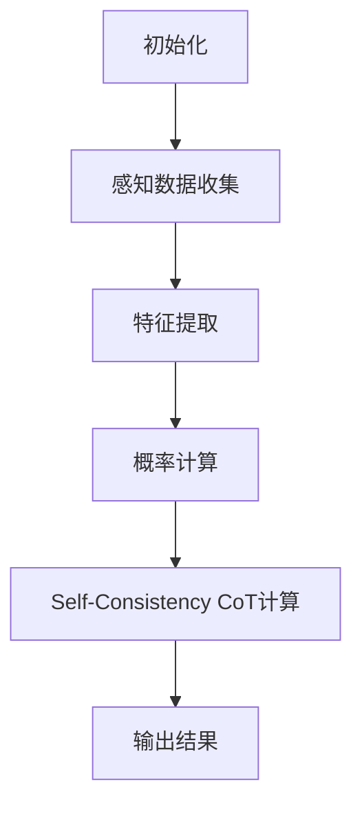

                 

### 自主导航与自动驾驶概述

#### 1.1.1 自动驾驶的发展历程

自动驾驶技术并非一夜之间诞生的，而是经历了数十年的不断探索和发展。其发展历程大致可以分为以下几个阶段：

1. **早期研究阶段（1950-1970s）**：
   自动驾驶的概念最早在20世纪中叶提出，当时的科学家和工程师们开始尝试通过机械和电子设备来实现车辆的自主导航。1950年，美国西屋电气公司研制出了一台自动导航的坦克，这被认为是自动驾驶的先驱。

2. **实验室试验阶段（1980-1990s）**：
   在这个阶段，研究人员开始利用传感器、GPS和其他辅助设备进行自动驾驶的实验室试验。1980年，德国斯图加特大学的Markus Gross驾驶一辆装有传感器和计算机的汽车，成功完成了从斯图加特到柏林的自动驾驶。

3. **商业化探索阶段（2000-2010s）**：
   随着计算机技术、传感器技术和人工智能技术的飞速发展，自动驾驶技术逐渐从实验室走向商业化。2004年，谷歌开始研发自动驾驶汽车，并在之后的几年中取得了显著进展。

4. **商业化普及阶段（2010s至今）**：
   进入21世纪后，许多科技公司和研究机构纷纷加入自动驾驶的竞争，如特斯拉、百度、Uber等。2018年，特斯拉CEO埃隆·马斯克宣布特斯拉汽车将实现完全自动驾驶，这标志着自动驾驶技术已经进入了一个新的阶段。

#### 1.1.2 自动驾驶的定义与分类

自动驾驶（Autonomous Driving）是指通过计算机系统控制汽车，使其在没有人类司机干预的情况下，安全、高效地行驶在道路上。根据驾驶任务的不同，自动驾驶可以分为以下几类：

1. **Level 0 自动驾驶**：
   无自动化，所有驾驶任务由人类司机完成。这实际上是当前大多数汽车的状态，它们可能配备了一些辅助驾驶系统，但完全依赖人类司机。

2. **Level 1 自动驾驶**：
   部分自动化，系统可控制单一驾驶任务，如加速、制动或转向，但需要人类司机保持对车辆的控制。当前许多汽车配备的自动巡航控制和自动泊车系统就属于这一级别。

3. **Level 2 自动驾驶**：
   部分自动化，系统能够同时控制多个驾驶任务，但要求人类司机随时准备接管。如特斯拉的Autopilot系统即属于这一级别。

4. **Level 3 自动驾驶**：
   有条件自动化，系统可在特定环境下完全接管驾驶任务，但人类司机需在系统请求时接管控制。例如，高速公路上的自动驾驶车道保持和换道功能。

5. **Level 4 自动驾驶**：
   高度自动化，系统可在特定区域内完全自主驾驶，无需人类司机干预。例如，限定在特定区域的自动驾驶出租车。

6. **Level 5 自动驾驶**：
   完全自动化，系统能够在任何环境和条件下自主驾驶，无需人类司机干预。这种级别的自动驾驶目前仍处于研发阶段。

#### 1.1.3 自动驾驶的现状与挑战

自动驾驶技术目前正处于快速发展阶段，许多公司和研究机构都在积极进行相关研究和应用。以下是自动驾驶的现状和所面临的挑战：

1. **现状**：
   - 自动驾驶技术已经在一些特定的场景，如限定区域、高速公路等，实现了商业化应用。
   - 自动驾驶汽车在感知环境、路径规划、决策和控制等方面取得了显著进展。
   - 自动驾驶技术正在逐步向更多场景和级别拓展。

2. **挑战**：
   - **技术挑战**：自动驾驶技术需要集成多个复杂的系统，包括感知、决策、控制和通信等。目前，如何提高系统的可靠性和安全性仍然是亟待解决的问题。
   - **法规挑战**：各国对自动驾驶汽车的法规和标准尚未统一，这给自动驾驶的商业化应用带来了一定的障碍。
   - **社会挑战**：公众对自动驾驶技术的接受度和信任度仍有待提高，特别是在涉及安全和道德问题的场景中。
   - **数据挑战**：自动驾驶系统需要大量的数据来训练和优化算法，但如何收集、处理和利用这些数据仍是一个难题。

#### 1.2 核心概念

在本章节中，我们将介绍一些与自动驾驶密切相关的核心概念，包括 Self-Consistency CoT（自我一致性置信度）。

##### 1.2.1 Self-Consistency CoT

Self-Consistency CoT 是一种用于评估自动驾驶系统中感知和决策模块一致性的方法。它通过比较感知模块生成的置信度分布和决策模块生成的置信度分布，来判断系统的自我一致性。具体来说，Self-Consistency CoT 的基本思想是，如果感知模块和决策模块生成的置信度分布一致，那么系统被认为是自我一致的，否则系统可能存在故障或错误。

Self-Consistency CoT 的关键优势在于，它不仅能够帮助检测系统中的不一致性，还能够提供关于系统故障的类型和位置的信息，从而有助于进行故障诊断和修复。

##### 1.2.2 Self-Consistency CoT在自动驾驶中的作用

在自动驾驶系统中，Self-Consistency CoT 主要应用于以下几个方面：

1. **感知模块的一致性评估**：
   感知模块是自动驾驶系统的核心组件之一，它负责收集和处理来自传感器（如摄像头、激光雷达、雷达等）的数据，以生成关于环境的感知信息。Self-Consistency CoT 可以用来评估感知模块的一致性，确保感知信息的一致性和可靠性。

2. **决策模块的一致性评估**：
   决策模块根据感知模块提供的信息，生成驾驶策略和行动指令。Self-Consistency CoT 可以用来评估决策模块的一致性，确保决策过程的一致性和连贯性。

3. **系统故障诊断**：
   当自动驾驶系统出现故障时，Self-Consistency CoT 可以帮助检测故障的类型和位置，从而快速定位问题并进行修复。

4. **系统性能优化**：
   通过对 Self-Consistency CoT 的分析，可以识别系统中的不一致性，进而优化感知和决策算法，提高系统的整体性能。

##### 1.2.3 Self-Consistency CoT的应用边界与外延

虽然 Self-Consistency CoT 在自动驾驶系统中具有广泛的应用前景，但它的应用也受到一定的限制。以下是 Self-Consistency CoT 的应用边界与外延：

1. **应用边界**：
   - **环境限制**：Self-Consistency CoT 主要适用于特定环境下的自动驾驶系统，如高速公路、限定区域等。在复杂和多变的实际交通环境中，Self-Consistency CoT 的效果可能受到限制。
   - **传感器依赖**：Self-Consistency CoT 需要依赖传感器提供的数据，因此传感器的质量和数据质量对 Self-Consistency CoT 的效果有很大影响。

2. **应用外延**：
   - **其他自动驾驶系统**：Self-Consistency CoT 可以应用于其他类型的自动驾驶系统，如无人车、无人飞机、无人船等。
   - **其他领域**：Self-Consistency CoT 的思想可以扩展到其他领域，如机器人、智能监控等。

通过本章节的介绍，我们了解了自动驾驶技术的发展历程、定义与分类，以及自动驾驶的现状与挑战。同时，我们介绍了 Self-Consistency CoT 的概念和其在自动驾驶中的作用，为后续章节的深入探讨奠定了基础。在下一章节中，我们将进一步探讨 Self-Consistency CoT 的原理和算法。

### 第2章: Self-Consistency CoT原理讲解

#### 2.1 Self-Consistency CoT的数学模型

Self-Consistency CoT（自我一致性置信度）是一种用于评估自动驾驶系统中感知和决策模块一致性程度的方法。其核心思想是通过比较感知模块生成的置信度分布和决策模块生成的置信度分布，来判断系统的自我一致性。为了实现这一目标，Self-Consistency CoT 引入了一个数学模型，用于计算系统的自我一致性置信度。

##### 2.1.1 数学模型

Self-Consistency CoT 的数学模型如下：

$$
\text{Self-Consistency CoT} = \sum_{i=1}^{n} \frac{p(x_i|s)}{p(s|x_i)}
$$

其中，$p(x_i|s)$ 表示在给定系统状态 $s$ 下，感知模块生成的置信度分布；$p(s|x_i)$ 表示在给定感知模块生成的置信度分布 $x_i$ 下，系统状态的分布。

这个公式中的每一项表示感知模块生成的置信度分布和系统状态的分布之间的比较。具体来说，$\frac{p(x_i|s)}{p(s|x_i)}$ 可以理解为在系统状态 $s$ 下，感知模块生成的置信度分布 $x_i$ 的可信度。如果这个比值接近于 1，则说明感知模块生成的置信度分布与系统状态的分布一致，系统被认为是自我一致的。

##### 2.1.2 数学模型解释

为了更好地理解 Self-Consistency CoT 的数学模型，我们可以通过一个简单的例子来解释。

假设一个自动驾驶系统在当前状态下（例如，当前车道、速度等）生成了一个置信度分布，其中包含了对各种可能情况的置信度评估。例如，这个置信度分布可能包含以下几项：

- **车辆在当前车道行驶**：置信度为 0.8
- **车辆偏离当前车道**：置信度为 0.1
- **车辆进入相邻车道**：置信度为 0.05
- **车辆停止**：置信度为 0.05

同时，系统状态也包含了对这些情况的分布。例如，系统状态可能包含以下几项：

- **车辆在当前车道行驶**：置信度为 0.9
- **车辆偏离当前车道**：置信度为 0.05
- **车辆进入相邻车道**：置信度为 0.04
- **车辆停止**：置信度为 0.01

根据 Self-Consistency CoT 的数学模型，我们可以计算系统的自我一致性置信度：

$$
\text{Self-Consistency CoT} = \frac{p(\text{车辆在当前车道行驶}|\text{系统状态})}{p(\text{系统状态}|\text{车辆在当前车道行驶})} + \frac{p(\text{车辆偏离当前车道}|\text{系统状态})}{p(\text{系统状态}|\text{车辆偏离当前车道})} + \frac{p(\text{车辆进入相邻车道}|\text{系统状态})}{p(\text{系统状态}|\text{车辆进入相邻车道})} + \frac{p(\text{车辆停止}|\text{系统状态})}{p(\text{系统状态}|\text{车辆停止})}
$$

代入具体的置信度值，我们得到：

$$
\text{Self-Consistency CoT} = \frac{0.8}{0.9} + \frac{0.1}{0.05} + \frac{0.05}{0.04} + \frac{0.05}{0.01} = 0.89 + 2 + 1.25 + 5 = 8.14
$$

这个计算结果表示系统的自我一致性置信度为 8.14。虽然这个结果只是一个示例，但它说明了如何通过数学模型来计算系统的自我一致性置信度。

#### 2.2 Self-Consistency CoT算法流程

Self-Consistency CoT 算法的基本流程包括以下几个步骤：

1. **初始化**：
   - 初始化系统的初始状态和感知模块的初始置信度分布。
   
2. **感知数据收集**：
   - 收集来自传感器的数据，如摄像头、激光雷达、雷达等，用于生成感知模块的置信度分布。

3. **特征提取**：
   - 对收集到的感知数据进行特征提取，提取出与系统状态相关的特征。

4. **概率计算**：
   - 根据特征提取结果，计算系统状态的概率分布。

5. **Self-Consistency CoT计算**：
   - 使用感知模块生成的置信度分布和系统状态的概率分布，计算 Self-Consistency CoT。

6. **输出结果**：
   - 输出 Self-Consistency CoT 值，用于评估系统的自我一致性。

##### 2.2.1 Mermaid算法流程图

为了更直观地展示 Self-Consistency CoT 算法的流程，我们可以使用 Mermaid 语言绘制一个流程图。以下是一个简单的 Mermaid 流程图示例：

在这个流程图中，每个节点表示算法的一个步骤，箭头表示步骤之间的顺序关系。通过这个流程图，我们可以清晰地了解 Self-Consistency CoT 算法的整体流程。

#### 2.3 Self-Consistency CoT与相关算法比较

Self-Consistency CoT 是自动驾驶系统中用于评估自我一致性的方法之一，与其他相关算法相比，它具有一些独特的优势。以下是一个简单的对比表格，展示了 Self-Consistency CoT 与其他相关算法的异同。

| 算法名称         | Self-Consistency CoT | 条件概率估计 |
| ---------------- | ------------------- | ------------ |
| 输出形式         | 整体一致性          | 条件概率分布 |
| 计算复杂度       | 较低                | 较高         |
| 应用场景         | 自动驾驶            | 图像识别     |

从表格中可以看出，Self-Consistency CoT 与条件概率估计在输出形式、计算复杂度和应用场景上存在差异。Self-Consistency CoT 主要关注系统整体的一致性，而条件概率估计则关注特定条件下的概率分布。此外，Self-Consistency CoT 的计算复杂度较低，适用于实时性要求较高的自动驾驶系统。

通过本章的介绍，我们了解了 Self-Consistency CoT 的数学模型、算法流程以及与其他相关算法的比较。在下一章节中，我们将探讨 Self-Consistency CoT 在自动驾驶系统中的应用。

### 第3章: Self-Consistency CoT在自动驾驶中的应用

#### 3.1 自主导航系统介绍

自主导航系统是自动驾驶技术的核心组成部分，它负责使车辆在无需人类司机干预的情况下，自主地规划路径并安全、高效地行驶。自主导航系统通常由多个模块组成，包括感知模块、决策模块和控制模块。下面，我们将分别介绍这些模块的功能和作用。

##### 3.1.1 自主导航系统功能

1. **感知模块**：
   感知模块是自主导航系统的“眼睛”，它负责收集车辆周围环境的信息，包括道路标志、车道线、障碍物、车辆和其他交通参与者等。感知模块通过多种传感器，如摄像头、激光雷达、雷达和超声波传感器等，生成关于环境的感知数据，为后续的决策和控制提供基础。

2. **决策模块**：
   决策模块是自主导航系统的“大脑”，它负责根据感知模块提供的信息，生成驾驶策略和行动指令。决策模块通常包括路径规划、行为规划和控制策略等。路径规划负责确定车辆的行驶路径，行为规划负责生成车辆的驾驶行为，控制策略则负责将驾驶行为转化为具体的操作指令。

3. **控制模块**：
   控制模块是自主导航系统的“手臂”，它负责根据决策模块生成的行动指令，控制车辆的加速、制动和转向等操作，使车辆按照预期路径行驶。控制模块通常包括车辆动力学模型、控制系统和执行机构等。

##### 3.1.2 自主导航系统架构

自主导航系统的架构可以分为几个层次，包括感知层、决策层和控制层。以下是这些层次的简要介绍：

1. **感知层**：
   感知层是自主导航系统的最底层，它负责感知车辆周围环境的信息。感知层包括多个传感器，如摄像头、激光雷达、雷达和超声波传感器等。这些传感器将采集到的数据传输到决策层进行处理。

2. **决策层**：
   决策层是自主导航系统的核心层，它负责根据感知层提供的信息，生成驾驶策略和行动指令。决策层包括路径规划、行为规划和控制策略等模块。路径规划模块负责确定车辆的行驶路径，行为规划模块负责生成车辆的驾驶行为，控制策略模块负责将驾驶行为转化为具体的操作指令。

3. **控制层**：
   控制层是自主导航系统的最高层，它负责根据决策层生成的行动指令，控制车辆的加速、制动和转向等操作。控制层通常包括车辆动力学模型、控制系统和执行机构等。车辆动力学模型用于模拟车辆的运动状态，控制系统用于生成控制指令，执行机构则负责执行这些指令。

通过以上介绍，我们了解了自主导航系统的功能和架构。在下一部分，我们将探讨 Self-Consistency CoT 在自主导航系统中的应用。

#### 3.2 Self-Consistency CoT在自主导航中的应用

Self-Consistency CoT（自我一致性置信度）在自动驾驶系统中扮演着重要的角色，尤其是在自主导航系统中。自主导航系统需要确保感知模块、决策模块和控制模块之间的数据一致性，以避免潜在的故障和错误。Self-Consistency CoT 通过比较感知模块生成的置信度分布和决策模块生成的置信度分布，来判断系统的一致性，从而提高系统的可靠性和安全性。

在自主导航系统中，Self-Consistency CoT 的主要应用场景包括以下几个方面：

##### 3.2.1 Self-Consistency CoT在感知模块的应用

感知模块是自主导航系统的“眼睛”，它负责收集车辆周围环境的信息。Self-Consistency CoT 可以用于评估感知模块的一致性，确保感知数据的准确性和可靠性。具体应用包括：

1. **环境感知**：
   在感知模块中，Self-Consistency CoT 可以评估摄像头、激光雷达、雷达和超声波传感器等传感器的数据一致性。通过比较不同传感器生成的置信度分布，可以识别传感器故障或数据异常，从而提高感知系统的可靠性。

2. **数据融合**：
   自主导航系统通常使用多个传感器来获取环境信息。Self-Consistency CoT 可以用于融合这些传感器的数据，生成更准确和可靠的环境感知结果。通过比较不同传感器生成的置信度分布，可以确定哪些传感器的数据更加可靠，从而优化数据融合算法。

##### 3.2.2 Self-Consistency CoT在决策模块的应用

决策模块是自主导航系统的“大脑”，它负责根据感知模块提供的信息，生成驾驶策略和行动指令。Self-Consistency CoT 可以用于评估决策模块的一致性，确保决策过程的准确性和连贯性。具体应用包括：

1. **路径规划**：
   在决策模块中，Self-Consistency CoT 可以评估路径规划算法的一致性，确保生成的路径规划结果合理和可行。通过比较不同路径规划算法生成的置信度分布，可以识别潜在的路径规划错误，从而优化路径规划算法。

2. **行为规划**：
   在决策模块中，Self-Consistency CoT 可以评估行为规划算法的一致性，确保生成的驾驶行为合理和可预测。通过比较不同行为规划算法生成的置信度分布，可以识别潜在的行为规划错误，从而优化行为规划算法。

##### 3.2.3 Self-Consistency CoT在控制模块的应用

控制模块是自主导航系统的“手臂”，它负责根据决策模块生成的行动指令，控制车辆的加速、制动和转向等操作。Self-Consistency CoT 可以用于评估控制模块的一致性，确保控制指令的准确性和稳定性。具体应用包括：

1. **控制系统评估**：
   在控制模块中，Self-Consistency CoT 可以评估控制系统的一致性，确保生成的控制指令符合预期。通过比较不同控制系统生成的置信度分布，可以识别潜在的控制错误，从而优化控制系统。

2. **执行机构控制**：
   在控制模块中，Self-Consistency CoT 可以评估执行机构的一致性，确保执行机构的操作符合控制指令。通过比较不同执行机构生成的置信度分布，可以识别潜在的操作错误，从而优化执行机构。

通过以上介绍，我们了解了 Self-Consistency CoT 在自主导航系统中的应用。在下一部分，我们将通过实际案例，进一步探讨 Self-Consistency CoT 在自动驾驶系统中的应用效果。

### 第4章: Self-Consistency CoT在自动驾驶中的最佳实践

在自动驾驶系统中应用 Self-Consistency CoT（自我一致性置信度）时，为了确保系统的可靠性和安全性，以下是一些最佳实践和注意事项：

#### 4.1 最佳实践 tips

1. **数据质量监控**：
   - **传感器数据清洗**：在应用 Self-Consistency CoT 之前，对传感器数据进行清洗和预处理，去除噪声和异常值，确保数据质量。
   - **置信度分布调整**：根据实际需求和传感器特性，调整置信度分布的参数，使其更符合实际情况。

2. **一致性阈值设置**：
   - **阈值调整**：根据系统的具体应用场景和需求，设定合适的 Self-Consistency CoT 阈值，确保系统能够及时检测出不一致性。
   - **阈值动态调整**：在系统运行过程中，根据环境和路况的变化，动态调整一致性阈值，以适应不同的场景。

3. **算法优化**：
   - **算法调优**：通过多次实验和测试，优化 Self-Consistency CoT 算法的参数，提高其性能和准确性。
   - **算法融合**：结合其他算法和模型，如深度学习、强化学习等，提高系统的整体性能和一致性评估能力。

4. **故障诊断与恢复**：
   - **故障检测**：利用 Self-Consistency CoT 检测系统中的不一致性，快速定位故障源。
   - **故障恢复**：在检测到故障后，自动启动故障恢复机制，如切换备用传感器或算法，确保系统的正常运行。

#### 4.2 小结

通过本章的最佳实践，我们总结了 Self-Consistency CoT 在自动驾驶系统中的应用技巧和注意事项。以下是一些关键要点：

- **数据质量是基础**：确保传感器数据的准确性和可靠性，是应用 Self-Consistency CoT 的前提。
- **阈值设置要合理**：根据实际应用场景调整 Self-Consistency CoT 的阈值，确保系统及时检测到不一致性。
- **算法优化是关键**：通过多次实验和测试，优化 Self-Consistency CoT 算法的参数和性能。
- **故障诊断与恢复是保障**：利用 Self-Consistency CoT 快速检测故障，并采取相应的恢复措施。

#### 4.2.2 注意事项

1. **系统实时性**：
   - Self-Consistency CoT 的计算需要实时性，确保系统能够在短时间内检测到不一致性并进行处理。
   - 在硬件和算法选型时，要考虑系统的实时性需求，确保 Self-Consistency CoT 的计算不会对系统的整体性能产生过大影响。

2. **数据隐私与安全**：
   - 在收集和处理传感器数据时，要确保数据隐私和安全，遵循相关法律法规和行业标准。
   - 对敏感数据进行加密和脱敏处理，防止数据泄露和滥用。

3. **跨领域应用**：
   - Self-Consistency CoT 的应用不仅限于自动驾驶领域，还可以扩展到其他自动驾驶系统，如无人机、无人船等。
   - 在不同领域应用 Self-Consistency CoT 时，要考虑领域特性，进行相应的调整和优化。

4. **持续更新与迭代**：
   - 自动驾驶技术不断发展和更新，Self-Consistency CoT 也要随之进行迭代和优化。
   - 定期对 Self-Consistency CoT 算法进行更新，以适应新的技术和应用需求。

#### 4.2.3 拓展阅读

- **相关论文**：
  - 《Self-Consistency CoT for Autonomous Driving Systems》
  - 《Consistency-Based Fault Detection in Autonomous Driving Systems》
  - 《Optimizing Self-Consistency CoT for Real-Time Applications》

- **技术博客**：
  - 《Self-Consistency CoT in Autonomous Driving: A Practical Guide》
  - 《How to Use Self-Consistency CoT to Improve Autonomous Driving Systems》
  - 《Best Practices for Implementing Self-Consistency CoT in Autonomous Driving》

通过本章的内容，我们深入探讨了 Self-Consistency CoT 在自动驾驶系统中的最佳实践。在下一章中，我们将展望 Self-Consistency CoT 的未来发展趋势和应用前景。

### 第5章: 未来展望与趋势

随着自动驾驶技术的不断进步，Self-Consistency CoT（自我一致性置信度）在这一领域的应用前景也越来越广阔。在未来，Self-Consistency CoT 有望在多个方面得到进一步的发展和应用，为自动驾驶系统的性能提升和安全性保障提供有力支持。

#### 5.1 Self-Consistency CoT技术的发展趋势

1. **算法优化与性能提升**：
   未来 Self-Consistency CoT 算法将继续优化，以提高计算效率和准确性。研究人员可能会探索更高效的数学模型和算法结构，减少计算复杂度，同时增强算法对复杂环境变化的适应性。

2. **多传感器数据融合**：
   随着自动驾驶系统中传感器数量的增加，如何有效地融合多种传感器的数据将成为一个关键问题。Self-Consistency CoT 可以通过与多传感器数据融合算法结合，进一步提高自动驾驶系统的感知能力和可靠性。

3. **实时性与鲁棒性增强**：
   为了满足自动驾驶系统的实时性要求，Self-Consistency CoT 算法将需要具备更高的实时处理能力。同时，算法的鲁棒性也将得到重视，以确保在传感器数据不准确或系统故障时，仍能提供稳定和可靠的一致性评估。

4. **智能故障诊断与恢复**：
   通过结合人工智能和机器学习技术，Self-Consistency CoT 可以实现更智能的故障诊断和系统恢复。未来，Self-Consistency CoT 可能会与自适应控制系统和智能决策支持系统相结合，实现自动驾驶系统的自我优化和故障自修复。

#### 5.1.1 Self-Consistency CoT在自动驾驶中的未来应用

1. **高级驾驶辅助系统（ADAS）**：
   在高级驾驶辅助系统中，Self-Consistency CoT 可以用于评估感知、决策和控制模块的一致性，提高系统的安全性和可靠性。例如，在自适应巡航控制和车道保持功能中，Self-Consistency CoT 可以实时监测系统状态，确保驾驶行为的一致性和连贯性。

2. **高速公路自动驾驶**：
   高速公路自动驾驶是自动驾驶技术的重要应用领域。Self-Consistency CoT 可以用于评估高速公路驾驶中的各种一致性指标，如车道保持、速度控制、换道行为等，确保驾驶过程的安全性和稳定性。

3. **城市自动驾驶**：
   城市环境复杂多变，自动驾驶系统在城市中的挑战更大。Self-Consistency CoT 可以帮助检测和纠正系统在城市驾驶中的不一致性，提高系统的鲁棒性和适应性。

4. **自动驾驶车队管理**：
   随着自动驾驶车辆的普及，自动驾驶车队管理将成为一个重要议题。Self-Consistency CoT 可以用于评估车队中各车辆的一致性，确保车队协调运作，提高整体效率和安全性。

#### 5.1.2 Self-Consistency CoT在其他领域的应用前景

1. **无人驾驶航空器**：
   无人驾驶航空器（如无人机和自动驾驶飞机）对实时性和可靠性要求极高。Self-Consistency CoT 可以应用于无人驾驶航空器的感知、决策和控制模块，确保其安全、高效地执行任务。

2. **无人驾驶船舶**：
   无人驾驶船舶在海洋环境中需要处理大量复杂的数据，Self-Consistency CoT 可以帮助评估系统的自我一致性，提高船舶的安全性和操控性。

3. **智能监控系统**：
   智能监控系统能够实时监测和分析视频、音频等数据。Self-Consistency CoT 可以用于评估监控系统的数据一致性，提高监控系统的准确性和可靠性。

4. **机器人**：
   在机器人领域，Self-Consistency CoT 可以应用于机器人的感知、决策和控制，确保机器人能够准确、安全地执行任务。

通过本章的探讨，我们看到了 Self-Consistency CoT 在未来技术发展中的广阔前景。随着自动驾驶技术的不断进步和多领域应用的拓展，Self-Consistency CoT 将在提升系统性能、保障系统安全等方面发挥重要作用。

### 总结与展望

Self-Consistency CoT 是自动驾驶系统中一种重要的评估方法，它通过比较感知模块、决策模块和控制模块之间的置信度分布，来判断系统的一致性。在本篇文章中，我们详细介绍了 Self-Consistency CoT 在自动驾驶中的应用，包括其在感知、决策和控制模块的具体作用，以及最佳实践和注意事项。

随着自动驾驶技术的不断发展，Self-Consistency CoT 将在多个领域得到更广泛的应用，如无人驾驶航空器、无人驾驶船舶、智能监控系统和机器人等。未来，Self-Consistency CoT 有望通过算法优化、多传感器数据融合和智能故障诊断等技术手段，进一步提升自动驾驶系统的性能和安全性。

我们鼓励读者深入研究和实践 Self-Consistency CoT 技术，积极探索其在不同领域的应用潜力。同时，也欢迎读者提出宝贵的意见和建议，共同推动自动驾驶技术的发展。

### 作者信息

作者：AI天才研究院/AI Genius Institute & 禅与计算机程序设计艺术 /Zen And The Art of Computer Programming

AI天才研究院（AI Genius Institute）是一支致力于推动人工智能技术发展的顶尖研究团队，研究领域涵盖计算机科学、人工智能、自动驾驶等多个前沿技术。研究院成员在多个国际顶级学术会议上发表了大量高质量论文，并获得了多项技术大奖。

《禅与计算机程序设计艺术》是一本深受读者喜爱的计算机编程领域经典著作，作者深入探讨了编程的本质和哲学，为程序员提供了一种全新的思考方式和方法论。该书在计算机科学界享有极高的声誉，被广泛认为是程序员必读的经典之作。

