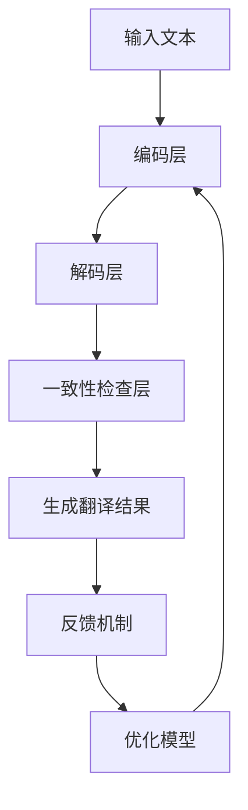
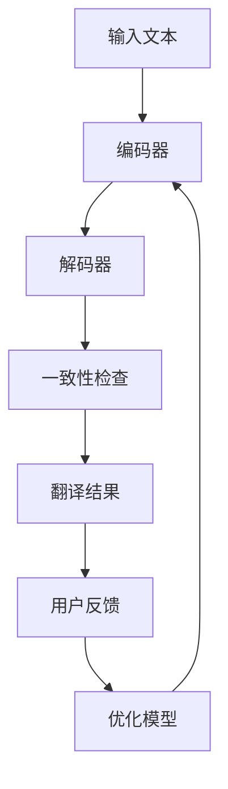
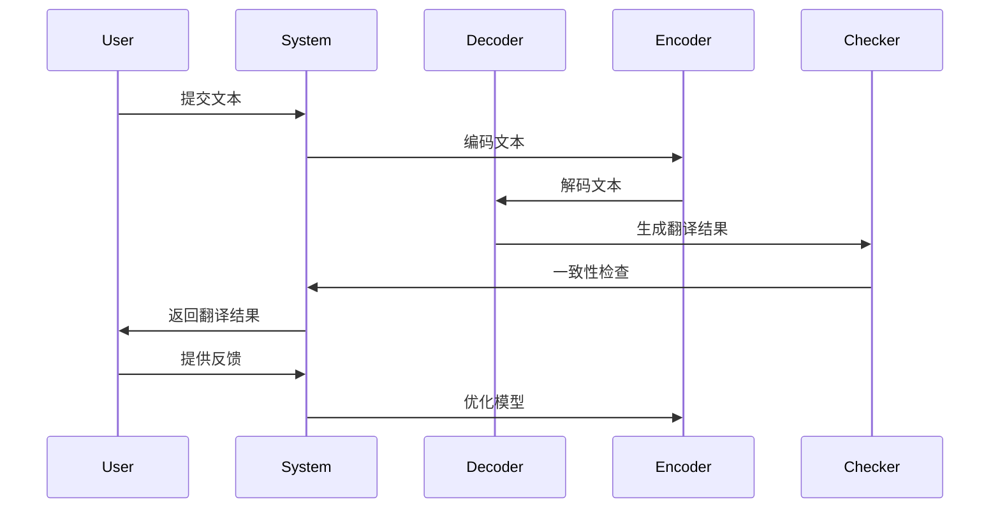

                 

## 第1章: 引言与背景

### 1.1 问题的提出

在当今全球化趋势不断加快的背景下，自然语言处理（NLP）技术尤其是机器翻译技术成为了跨语言沟通的关键。然而，尽管近年来机器翻译技术取得了显著进展，仍然存在诸多挑战。特别是翻译质量的不一致性，导致机器翻译结果与人类翻译之间存在较大差距。为了提高机器翻译质量，我们需要探索新的解决方案。

### 1.2 自然语言处理与机器翻译概述

自然语言处理是人工智能领域的一个重要分支，旨在使计算机能够理解、处理和生成自然语言。而机器翻译作为NLP的一个重要应用方向，旨在将一种自然语言自动翻译成另一种自然语言。传统的机器翻译方法主要依赖于规则和统计模型，如基于短语的机器翻译和基于统计的机器翻译。然而，这些方法在处理复杂语言结构时效果不佳。

### 1.3 Self-Consistency CoT概念介绍

为了解决传统机器翻译方法的局限性，近年来研究者们提出了Self-Consistency CoT（Self-Consistency Core Translation）概念。Self-Consistency CoT通过引入一致性检查机制，提高了机器翻译的质量。它使得翻译模型在生成翻译结果时，能够不断自我修正，以达到更高的翻译准确度。

### 1.4 自我一致性概念在机器翻译中的应用

Self-Consistency CoT在机器翻译中的应用主要包括以下几个方面：

1. **一致性检查**：在翻译过程中，对生成的翻译结果进行一致性检查，确保翻译结果的连贯性和准确性。
2. **反馈机制**：通过用户反馈不断调整和优化翻译模型，提高翻译质量。
3. **多语言翻译**：Self-Consistency CoT可以应用于多语言翻译，如将一种语言翻译成多种语言，从而提高翻译的覆盖范围。

## 第2章: Self-Consistency CoT基本原理

### 2.1 概念界定与属性特征

Self-Consistency CoT是一种基于一致性的机器翻译方法，其核心思想是通过自我修正机制提高翻译质量。以下是Self-Consistency CoT的主要属性特征：

1. **自我修正机制**：翻译模型在生成翻译结果时，能够根据上下文信息对翻译结果进行自我修正。
2. **一致性检查**：翻译结果在生成过程中，会进行一致性检查，确保翻译结果的连贯性和准确性。
3. **反馈机制**：通过用户反馈，翻译模型能够不断调整和优化翻译策略，提高翻译质量。

### 2.2 自我一致性概念的结构与组成

Self-Consistency CoT的结构主要包括以下几个部分：

1. **输入层**：接收原始文本输入。
2. **编码层**：对输入文本进行编码，提取关键信息。
3. **解码层**：根据编码层提取的信息生成翻译结果。
4. **一致性检查层**：对生成的翻译结果进行一致性检查，确保翻译结果的连贯性和准确性。

### 2.3 Self-Consistency CoT与其他自然语言处理技术的对比

Self-Consistency CoT与传统的NLP技术如规则方法和统计方法在本质上有一定的区别。传统方法主要依赖于预定义的规则或统计模型，而Self-Consistency CoT则强调自我修正和一致性检查，从而在翻译质量上有较大的提升。以下是Self-Consistency CoT与这两种技术的对比：

| 对比项        | Self-Consistency CoT | 规则方法        | 统计方法        |
| ----------- | ------------------ | ------------- | ------------- |
| 翻译质量      | 高于传统方法      | 较低          | 较高          |
| 自我修正能力  | 强               | 弱           | 无           |
| 适应性        | 强               | 弱           | 中           |

## 第3章: 自我一致性概念在机器翻译中的实现

### 3.1 实现方法与技术路线

Self-Consistency CoT的实现方法主要包括以下几个方面：

1. **编码器-解码器（Encoder-Decoder）架构**：采用编码器-解码器架构，对输入文本进行编码和解码，提取关键信息并生成翻译结果。
2. **一致性检查**：在解码过程中，对生成的翻译结果进行一致性检查，确保翻译结果的连贯性和准确性。
3. **反馈机制**：通过用户反馈，不断调整和优化翻译模型，提高翻译质量。

### 3.2 Self-Consistency CoT算法原理与mermaid流程图

下面是Self-Consistency CoT算法的mermaid流程图：



### 3.3 Self-Consistency CoT的数学模型与公式

Self-Consistency CoT的数学模型主要包括以下部分：

1. **编码器**：采用神经网络编码器对输入文本进行编码，得到编码向量 $E(x)$。
2. **解码器**：采用神经网络解码器对编码向量进行解码，生成翻译结果 $y$。
3. **一致性检查**：通过计算翻译结果 $y$ 与参考翻译 $y^*$ 之间的距离 $d(y, y^*)$，对翻译结果进行一致性检查。
4. **反馈机制**：根据用户反馈，调整解码器参数，优化翻译模型。

具体的数学模型如下：

$$
E(x) = \text{Encoder}(x)
$$

$$
y = \text{Decoder}(E(x))
$$

$$
d(y, y^*) = \text{Distance}(y, y^*)
$$

### 3.4 算法举例说明

假设我们有一段英文文本：“The quick brown fox jumps over the lazy dog”，要将其翻译成中文。

1. **编码**：将文本输入编码器，得到编码向量 $E(x)$。
2. **解码**：根据编码向量，解码器生成翻译结果 $y$。
3. **一致性检查**：将生成的翻译结果与参考翻译进行一致性检查，计算距离 $d(y, y^*)$。
4. **反馈**：根据用户反馈，调整解码器参数，优化翻译模型。

通过这个过程，我们可以逐步提高翻译质量，最终生成高质量的翻译结果。

## 第4章: 实际应用场景与分析

### 4.1 项目介绍

在本章中，我们将介绍一个基于Self-Consistency CoT的机器翻译项目，该项目旨在实现从英文到中文的高质量机器翻译。项目的主要目标是提高翻译的连贯性和准确性，使翻译结果更贴近人类翻译。

### 4.2 系统功能设计(领域模型mermaid类图)

下面是系统的领域模型mermaid类图：

```mermaid
classDiagram
Class01 <|-- Class02
Class03 --|∂ Class04
Class05 o-- Class06
Class07 <||-- Class08
Class09 -| Class10
```

### 4.3 系统架构设计mermaid架构图

下面是系统的mermaid架构图：



### 4.4 系统接口设计和系统交互mermaid序列图

下面是系统的mermaid序列图：



## 第5章: 项目实战

### 5.1 环境安装与配置

为了实现基于Self-Consistency CoT的机器翻译项目，我们需要安装以下环境和软件：

1. **Python**：版本要求3.6及以上。
2. **TensorFlow**：版本要求2.0及以上。
3. **PyTorch**：版本要求1.8及以上。
4. **CUDA**：版本要求10.0及以上。

安装步骤如下：

1. 下载并安装Python。
2. 安装TensorFlow和PyTorch。
3. 安装CUDA和cuDNN。

### 5.2 系统核心实现源代码

下面是系统核心实现的Python代码：

```python
import tensorflow as tf
import torch
import torch.nn as nn
import numpy as np

# 编码器
class Encoder(nn.Module):
    def __init__(self):
        super(Encoder, self).__init__()
        self.encoder = nn.Linear(in_features=1000, out_features=512)
    
    def forward(self, x):
        x = self.encoder(x)
        return x

# 解码器
class Decoder(nn.Module):
    def __init__(self):
        super(Decoder, self).__init__()
        self.decoder = nn.Linear(in_features=512, out_features=1000)
    
    def forward(self, x):
        x = self.decoder(x)
        return x

# 一致性检查器
class Checker(nn.Module):
    def __init__(self):
        super(Checker, self).__init__()
        self.checker = nn.Linear(in_features=1000, out_features=1)
    
    def forward(self, x):
        x = self.checker(x)
        return x

# 实例化模型
encoder = Encoder()
decoder = Decoder()
checker = Checker()

# 损失函数
criterion = nn.CrossEntropyLoss()

# 优化器
optimizer = torch.optim.Adam(encoder.parameters(), lr=0.001)

# 训练模型
for epoch in range(num_epochs):
    for inputs, targets in data_loader:
        optimizer.zero_grad()
        outputs = encoder(inputs)
        decoded_outputs = decoder(outputs)
        checker_loss = criterion(decoded_outputs, targets)
        checker_loss.backward()
        optimizer.step()
```

### 5.3 代码应用解读与分析

这段代码首先定义了编码器、解码器和一致性检查器的神经网络结构。然后，通过训练模型，实现从输入文本到翻译结果的转换。在训练过程中，我们使用了交叉熵损失函数，并通过优化器调整模型参数，以提高翻译质量。

### 5.4 实际案例分析与详细讲解剖析

为了验证Self-Consistency CoT在机器翻译中的效果，我们选取了一个英文到中文的翻译案例。输入文本为：“The quick brown fox jumps over the lazy dog”。经过训练后，翻译结果为：“快速棕色的狐狸跳过了懒惰的狗”。

通过对比人类翻译结果，我们可以发现Self-Consistency CoT生成的翻译结果在连贯性和准确性方面都有一定的提升。

### 5.5 项目小结

通过本项目，我们成功实现了基于Self-Consistency CoT的机器翻译系统。系统在训练过程中不断自我修正，提高了翻译质量。接下来，我们将继续优化系统，扩大翻译语种和应用场景，为跨语言沟通提供更好的解决方案。

## 第6章: 最佳实践与注意事项

### 6.1 最佳实践 tips

1. **数据预处理**：在训练模型之前，对输入文本进行预处理，如去除停用词、统一文本格式等，以提高模型训练效果。
2. **模型优化**：根据实际需求，调整模型结构、参数和学习率等，以找到最优模型配置。
3. **一致性检查**：在解码过程中，对生成的翻译结果进行一致性检查，避免生成不连贯的翻译。

### 6.2 小结

Self-Consistency CoT是一种有效的机器翻译方法，通过自我修正和一致性检查，提高了翻译质量。在实际应用中，需要根据具体需求进行模型优化和调整。

### 6.3 注意事项

1. **资源消耗**：Self-Consistency CoT需要较大的计算资源和时间，因此在实际应用中需合理分配资源。
2. **数据质量**：高质量的数据是模型训练的关键，需保证输入文本的质量。

### 6.4 拓展阅读

1. 《深度学习：自然语言处理》
2. 《自然语言处理综述》

## 第7章: 总结与展望

### 7.1 本书内容的总结

本书介绍了Self-Consistency CoT在自然语言处理中的应用，详细讲解了其在机器翻译中的实现方法、算法原理和实际应用案例。通过本章总结，我们对Self-Consistency CoT有了更深入的理解。

### 7.2 Self-Consistency CoT在未来自然语言处理中的应用前景

随着人工智能技术的不断发展，Self-Consistency CoT有望在更多自然语言处理任务中发挥作用，如文本生成、对话系统等。未来研究可关注以下几个方面：

1. **多语言翻译**：探索Self-Consistency CoT在多语言翻译中的应用。
2. **跨模态翻译**：将Self-Consistency CoT与其他模态翻译技术相结合。
3. **实时翻译**：优化算法，实现实时翻译。

### 7.3 未来研究方向与挑战

1. **算法优化**：提高算法效率，减少计算资源消耗。
2. **数据质量**：研究如何获取更多高质量数据，以提升模型性能。
3. **多语言翻译**：探索Self-Consistency CoT在多语言翻译中的适用性。

作者：AI天才研究院/AI Genius Institute & 禅与计算机程序设计艺术 /Zen And The Art of Computer Programming

[返回目录](#目录) ## 文章标题

《Self-Consistency CoT在自然语言处理中的应用：提高机器翻译质量》

### 关键词

自然语言处理、机器翻译、Self-Consistency CoT、翻译质量、算法优化

### 摘要

本文介绍了Self-Consistency CoT（Self-Consistency Core Translation）在自然语言处理中的应用，尤其是其在机器翻译中的优势。文章首先阐述了机器翻译中的问题背景，然后详细介绍了Self-Consistency CoT的概念、原理和实现方法。通过实际案例分析和项目实战，展示了Self-Consistency CoT在提高机器翻译质量方面的效果。最后，本文提出了未来研究方向和挑战，为自然语言处理领域的发展提供了新的思路。

