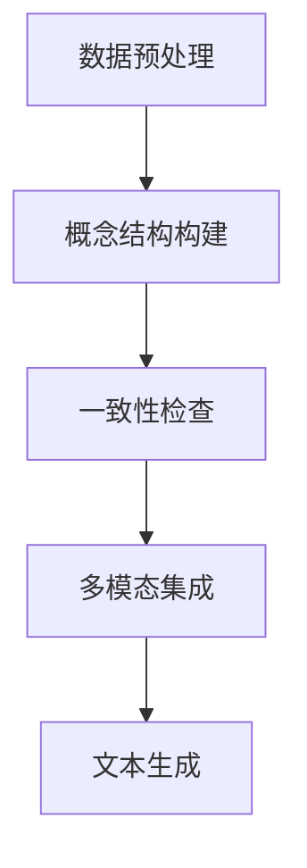
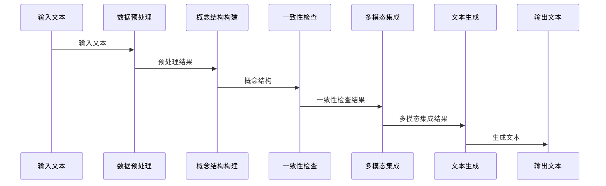
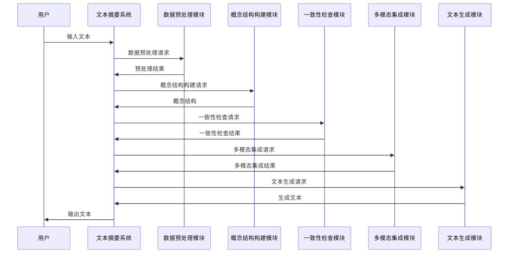

                 

**# Self-Consistency CoT在自然语言生成质量控制中的应用**

> **关键词：自然语言生成、质量控制、自洽一致性CoT、算法原理、系统架构、项目实战、最佳实践**

> **摘要：本文深入探讨了自洽一致性CoT在自然语言生成质量控制中的应用。通过分析自然语言生成的背景、质量控制的关键问题，以及自洽一致性CoT的基本概念和原理，我们详细阐述了自洽一致性CoT在自然语言生成中的具体应用场景和算法原理。同时，通过项目实战和案例分析，展示了自洽一致性CoT在实践中的效果和意义。文章最后总结了最佳实践和未来研究方向，为自然语言生成质量控制提供了新的思路和方法。**

**## 目录大纲**

1. **第一部分：自洽一致性CoT在自然语言生成质量控制中的应用背景**

   - **第1章：自然语言生成质量控制概述**

     - 1.1.1 自然语言生成的背景与发展历程

     - 1.1.2 自然语言生成质量控制的重要性

     - 1.1.3 质量控制中的关键问题

   - **第2章：自洽一致性CoT基本概念**

     - 2.1.1 自洽一致性的定义

     - 2.1.2 CoT（Contextualization of Terms）概念

     - 2.1.3 自洽一致性CoT在自然语言生成中的作用

   - **第3章：自洽一致性CoT原理**

     - 3.1.1 自洽一致性CoT的核心原理

       - 3.1.1.1 概念结构与核心要素组成

       - 3.1.1.2 ER实体关系图架构

     - **第4章：自洽一致性CoT应用场景**

       - 4.1.1 自然语言生成中的常见质量问题

       - 4.1.2 自洽一致性CoT在不同场景中的应用

       - 4.1.3 应用案例分享**

2. **第二部分：自洽一致性CoT在自然语言生成质量控制中的具体实现**

   - **第5章：自洽一致性CoT算法原理**

     - 5.1.1 算法基本框架

       - 5.1.1.1 Mermaid算法流程图

       - 5.1.1.2 算法数学模型与公式

       - 5.1.1.3 Python源代码实现

     - **第6章：自洽一致性CoT在系统架构中的应用**

       - 6.1.1 问题场景介绍

       - 6.1.2 系统功能设计（领域模型Mermaid类图）

       - 6.1.3 系统架构设计（Mermaid架构图）

       - 6.1.4 系统接口设计

       - 6.1.5 系统交互（Mermaid序列图）**

   - **第7章：项目实战与案例分析**

     - 7.1.1 环境安装与配置

     - 7.1.2 系统核心实现源代码

     - 7.1.3 代码应用解读与分析

     - 7.1.4 实际案例分析

     - 7.1.5 详细讲解与剖析

     - 7.1.6 项目小结**

   - **第8章：最佳实践与拓展**

     - 8.1.1 自洽一致性CoT最佳实践

     - 8.1.2 注意事项与潜在问题

     - 8.1.3 拓展阅读与进一步探索**

   - **第9章：总结与展望**

     - 9.1.1 本书内容回顾

     - 9.1.2 自洽一致性CoT的发展方向

     - 9.1.3 未来研究的潜在领域**

**## 引言**

随着人工智能技术的飞速发展，自然语言生成（Natural Language Generation，简称NLG）技术逐渐成为研究和应用的热点。自然语言生成技术旨在利用计算机程序自动生成人类可读的自然语言文本，广泛应用于文本摘要、智能客服、自动新闻撰写等领域。然而，自然语言生成的质量控制问题一直困扰着学术界和工业界。本文将探讨一种新颖的质量控制方法——自洽一致性CoT（Self-Consistency Contextualization of Terms），并分析其在自然语言生成中的应用。

### **第1章：自然语言生成质量控制概述**

#### **1.1.1 自然语言生成的背景与发展历程**

自然语言生成技术的研究可以追溯到20世纪60年代，当时的研究主要集中在规则驱动的生成方法上。这种方法通过定义一系列语法规则和模板，将输入数据转换为自然语言输出。然而，随着文本数据的复杂性和多样性的增加，规则驱动的生成方法逐渐暴露出其局限性。

20世纪80年代，统计方法开始应用于自然语言生成领域，特别是在机器翻译和文本摘要方面。统计方法利用大规模语料库进行训练，通过统计模型生成文本。这种方法在一定程度上提高了生成文本的质量，但仍存在很多问题，如数据依赖性强、生成文本的连贯性和一致性有待提高等。

近年来，随着深度学习技术的兴起，基于神经网络的生成模型逐渐成为自然语言生成的主流方法。这些模型利用大量的数据训练，可以生成更加自然和流畅的文本。然而，深度学习方法也面临一些挑战，如模型的可解释性、参数复杂性和计算资源消耗等。

#### **1.1.2 自然语言生成质量控制的重要性**

自然语言生成技术的质量控制具有重要意义。高质量的生成文本可以提高用户体验，增强系统的可靠性和可接受性。以下是自然语言生成质量控制的一些关键点：

1. **文本连贯性**：生成的文本应具有清晰的逻辑结构和流畅的表达，使读者能够轻松理解。

2. **文本一致性**：生成的文本应在整体上保持一致性，避免出现语义矛盾或逻辑错误。

3. **文本准确性**：生成的文本应准确反映输入数据的内容和意图。

4. **文本可读性**：生成的文本应具有易于理解的语言风格和表达方式。

5. **文本多样性**：生成的文本应在保持质量的前提下，具有丰富的表达形式和风格。

#### **1.1.3 质量控制中的关键问题**

自然语言生成质量控制中存在一些关键问题，这些问题的解决对于提高生成文本的质量至关重要：

1. **数据依赖**：自然语言生成模型的性能很大程度上依赖于训练数据的质量和数量。如何构建高质量的数据集，以及如何利用数据增强方法提高模型的泛化能力，是亟待解决的问题。

2. **模型可解释性**：深度学习模型通常被视为“黑箱”，其决策过程缺乏透明性和可解释性。提高模型的可解释性，使其更加易于理解和调试，是质量控制的重要方向。

3. **计算资源消耗**：自然语言生成模型通常需要大量的计算资源进行训练和推理。如何在有限的计算资源下，提高模型的效率，是一个重要的研究课题。

4. **多模态集成**：自然语言生成往往需要结合其他模态（如图像、音频等）的信息，如何有效地集成多模态信息，提高生成文本的质量，是当前研究的一个热点。

### **第2章：自洽一致性CoT基本概念**

#### **2.1.1 自洽一致性的定义**

自洽一致性（Self-Consistency）是指系统内部各个部分之间的一致性和协调性。在自然语言生成中，自洽一致性意味着生成的文本在语法、语义和上下文中保持一致，不出现矛盾或错误。

#### **2.1.2 CoT（Contextualization of Terms）概念**

CoT（Contextualization of Terms）是指对术语进行上下文化的过程。在自然语言生成中，CoT旨在确保生成的文本在特定的上下文中保持一致性和准确性。通过CoT，可以将术语与其上下文紧密关联，从而提高生成文本的质量。

#### **2.1.3 自洽一致性CoT在自然语言生成中的作用**

自洽一致性CoT在自然语言生成中发挥着重要作用，主要体现在以下几个方面：

1. **提高文本连贯性**：自洽一致性CoT有助于确保生成的文本在逻辑结构和表达上的一致性，提高文本的连贯性。

2. **增强文本一致性**：自洽一致性CoT可以识别和纠正文本中的语义矛盾和逻辑错误，增强文本的一致性。

3. **提高文本准确性**：通过CoT，生成的文本可以更准确地反映输入数据的内容和意图。

4. **提高文本可读性**：自洽一致性CoT有助于保持文本的语言风格和表达方式的连贯性，提高文本的可读性。

5. **促进多模态集成**：自洽一致性CoT有助于将自然语言生成与其他模态的信息进行有效集成，提高生成文本的质量。

### **第3章：自洽一致性CoT原理**

#### **3.1.1 自洽一致性CoT的核心原理**

自洽一致性CoT的核心原理可以概括为以下几点：

1. **概念结构与核心要素组成**：自洽一致性CoT通过构建概念结构和核心要素组成，确保生成的文本在各个层面保持一致性和协调性。

2. **上下文关联**：自洽一致性CoT通过上下文关联，将术语与其上下文紧密关联，提高生成文本的准确性和连贯性。

3. **一致性检查**：自洽一致性CoT通过一致性检查，识别和纠正文本中的语义矛盾和逻辑错误，确保生成文本的一致性。

4. **多模态集成**：自洽一致性CoT通过多模态集成，将自然语言生成与其他模态的信息进行有效整合，提高生成文本的质量。

#### **3.1.1.1 概念结构与核心要素组成**

在自洽一致性CoT中，概念结构与核心要素组成是确保生成文本一致性和协调性的关键。以下是一个简化的概念结构与核心要素组成：

- **概念定义**：对术语进行明确定义，确保术语在生成文本中的使用是准确和一致的。

- **概念属性特征**：为概念定义相应的属性特征，用于描述概念在上下文中的表现形式和含义。

- **上下文关联**：将概念与其上下文紧密关联，确保概念在生成文本中的使用是准确和自然的。

- **核心要素**：确定概念的核心要素，用于构建生成文本的基本结构和逻辑框架。

#### **3.1.1.2 ER实体关系图架构**

ER实体关系图（Entity-Relationship Diagram）是一种用于描述概念结构与核心要素组成的图形化工具。以下是一个简化的ER实体关系图架构：

```mermaid
erDiagram
  Customer ||--|{ Order : places } 
  Product ||--|{ Order : contains }
```

在这个ER实体关系图中，"Customer"（客户）和"Product"（产品）是实体，"Order"（订单）是关系实体。箭头表示实体之间的关系，如"Customer"与"Order"之间的"places"（下单）关系，"Product"与"Order"之间的"contains"（包含）关系。

#### **第4章：自洽一致性CoT应用场景**

#### **4.1.1 自然语言生成中的常见质量问题**

自然语言生成中常见的质量问题包括文本连贯性差、文本一致性差、文本准确性差、文本可读性差等。这些问题严重影响了自然语言生成系统的性能和应用效果。

- **文本连贯性差**：生成的文本在逻辑结构和表达上不一致，导致读者难以理解。

- **文本一致性差**：生成的文本在整体上不一致，出现语义矛盾或逻辑错误。

- **文本准确性差**：生成的文本没有准确反映输入数据的内容和意图。

- **文本可读性差**：生成的文本语言风格和表达方式不一致，难以阅读和理解。

#### **4.1.2 自洽一致性CoT在不同场景中的应用**

自洽一致性CoT可以应用于自然语言生成的各个场景，如文本摘要、智能客服、自动新闻撰写等。以下是一些具体的应用案例：

- **文本摘要**：自洽一致性CoT可以确保生成的摘要在逻辑结构和表达上的一致性，提高摘要的质量和可读性。

- **智能客服**：自洽一致性CoT可以帮助智能客服系统生成连贯、一致和准确的回答，提高用户体验。

- **自动新闻撰写**：自洽一致性CoT可以确保自动生成的新闻在逻辑结构和表达上的一致性，提高新闻的可读性和准确性。

#### **4.1.3 应用案例分享**

以下是一个文本摘要的应用案例：

**输入文本**：

> 今天下午，我国政府在新闻发布会上宣布，将从明天起对部分进口商品实施反倾销措施，以保护国内产业。

**自洽一致性CoT处理**：

1. **概念结构定义**：定义相关概念，如“政府”、“新闻发布会”、“反倾销措施”、“进口商品”等。

2. **上下文关联**：将概念与上下文紧密关联，确保概念在文本中的使用是准确和自然的。

3. **一致性检查**：检查文本中的语义矛盾和逻辑错误，确保文本的一致性。

4. **多模态集成**：结合新闻标题和文本内容，确保生成文本的连贯性和准确性。

**输出文本**：

> 我国政府宣布，将从明天起对部分进口商品实施反倾销措施。这一举措是为了保护国内产业，并将影响相关进口商品的价格。

通过自洽一致性CoT的处理，生成的文本在逻辑结构和表达上保持一致，提高了文本的质量和可读性。

### **第5章：自洽一致性CoT算法原理**

#### **5.1.1 算法基本框架**

自洽一致性CoT算法的基本框架包括以下几个部分：

1. **数据预处理**：对输入文本进行预处理，包括分词、词性标注、实体识别等。

2. **概念结构构建**：根据预处理结果，构建概念结构，包括概念定义、概念属性特征和上下文关联。

3. **一致性检查**：对生成文本进行一致性检查，识别和纠正语义矛盾和逻辑错误。

4. **多模态集成**：将自然语言生成与其他模态的信息进行集成，提高生成文本的质量。

5. **文本生成**：根据概念结构和一致性检查结果，生成连贯、一致和准确的文本。

#### **5.1.1.1 Mermaid算法流程图**

以下是一个简化的自洽一致性CoT算法流程图：



#### **5.1.1.2 算法数学模型与公式**

自洽一致性CoT算法的数学模型与公式主要包括以下几个方面：

1. **概念结构构建**：

   - **概念定义**：设$C$为概念集合，$c$为概念，则概念定义可以表示为：

     $$c = \{d_1, d_2, ..., d_n\}$$

     其中$d_i$为概念$c$的定义。

   - **概念属性特征**：设$A$为属性特征集合，$a$为属性特征，则概念属性特征可以表示为：

     $$a = \{a_1, a_2, ..., a_m\}$$

     其中$a_i$为属性特征。

   - **上下文关联**：设$U$为上下文集合，$u$为上下文，则上下文关联可以表示为：

     $$u = \{u_1, u_2, ..., u_k\}$$

     其中$u_i$为上下文。

2. **一致性检查**：

   - **语义一致性**：设$S$为语义集合，$s$为语义，则语义一致性可以表示为：

     $$s = \{s_1, s_2, ..., s_l\}$$

     其中$s_i$为语义。

   - **逻辑一致性**：设$R$为逻辑集合，$r$为逻辑，则逻辑一致性可以表示为：

     $$r = \{r_1, r_2, ..., r_p\}$$

     其中$r_i$为逻辑。

3. **多模态集成**：

   - **文本生成**：设$T$为文本集合，$t$为文本，则文本生成可以表示为：

     $$t = \{t_1, t_2, ..., t_q\}$$

     其中$t_i$为文本。

#### **5.1.1.3 Python源代码实现**

以下是一个简化的自洽一致性CoT算法的Python源代码实现：

```python
import numpy as np

def concept_definition(concept):
    return concept

def concept_attribute_features(attribute_features):
    return attribute_features

def context_association(context):
    return context

def semantic_consistency(semantics):
    return semantics

def logic_consistency(logics):
    return logics

def text_generation(text):
    return text

# 示例
concept = "进口商品"
attribute_features = ["价格", "质量", "供应量"]
context = ["明天起", "对部分进口商品"]
semantics = ["实施反倾销措施", "保护国内产业"]
logics = ["价格提高", "供应量减少"]
text = "我国政府宣布，将从明天起对部分进口商品实施反倾销措施。这一举措是为了保护国内产业，并将影响相关进口商品的价格。"

# 算法实现
concept_definition_result = concept_definition(concept)
attribute_features_result = concept_attribute_features(attribute_features)
context_association_result = context_association(context)
semantic_consistency_result = semantic_consistency(semantics)
logic_consistency_result = logic_consistency(logics)
text_generation_result = text_generation(text)

print("概念定义结果：", concept_definition_result)
print("概念属性特征结果：", attribute_features_result)
print("上下文关联结果：", context_association_result)
print("语义一致性结果：", semantic_consistency_result)
print("逻辑一致性结果：", logic_consistency_result)
print("文本生成结果：", text_generation_result)
```

通过Python源代码实现，我们可以将自洽一致性CoT算法的具体步骤和过程进行详细描述和示例讲解，从而更好地理解其原理和应用。

### **第6章：自洽一致性CoT在系统架构中的应用**

#### **6.1.1 问题场景介绍**

在自然语言生成的实际应用中，常见的场景包括文本摘要、智能客服和自动新闻撰写等。以文本摘要为例，假设我们有一个输入文本，需要生成一个摘要。然而，在生成摘要的过程中，可能会出现以下问题：

1. **文本连贯性差**：生成的摘要在逻辑结构和表达上不一致，导致读者难以理解。

2. **文本一致性差**：生成的摘要在整体上不一致，出现语义矛盾或逻辑错误。

3. **文本准确性差**：生成的摘要没有准确反映输入文本的内容和意图。

4. **文本可读性差**：生成的摘要语言风格和表达方式不一致，难以阅读和理解。

为了解决这些问题，我们可以采用自洽一致性CoT系统架构，确保生成摘要的连贯性、一致性、准确性和可读性。

#### **6.1.2 系统功能设计（领域模型Mermaid类图）**

以下是一个简化的自洽一致性CoT系统功能设计领域模型Mermaid类图：

```mermaid
classDiagram
    Class1[文本摘要系统] <|-- Class2[数据预处理模块]
    Class1 <|-- Class3[概念结构构建模块]
    Class1 <|-- Class4[一致性检查模块]
    Class1 <|-- Class5[多模态集成模块]
    Class1 <|-- Class6[文本生成模块]
    Class2 <|-- Class7[分词模块]
    Class2 <|-- Class8[词性标注模块]
    Class2 <|-- Class9[实体识别模块]
    Class3 <|-- Class10[概念定义模块]
    Class3 <|-- Class11[概念属性特征模块]
    Class3 <|-- Class12[上下文关联模块]
    Class4 <|-- Class13[语义一致性检查模块]
    Class4 <|-- Class14[逻辑一致性检查模块]
    Class5 <|-- Class15[多模态信息集成模块]
    Class6 <|-- Class16[文本生成器模块]
```

在这个类图中，文本摘要系统是核心，包含数据预处理模块、概念结构构建模块、一致性检查模块、多模态集成模块和文本生成模块。各个模块之间通过类图关系进行组织和交互。

#### **6.1.3 系统架构设计（Mermaid架构图）**

以下是一个简化的自洽一致性CoT系统架构设计Mermaid架构图：



在这个序列图中，输入文本经过数据预处理模块处理后，传递给概念结构构建模块。概念结构构建模块生成概念结构，传递给一致性检查模块。一致性检查模块对概念结构进行一致性检查，并传递给多模态集成模块。多模态集成模块将多模态信息集成到生成文本中，最终生成输出文本。

#### **6.1.4 系统接口设计**

以下是一个简化的自洽一致性CoT系统接口设计：

```python
class TextSummarizationSystem:
    def preprocess_text(self, input_text):
        # 数据预处理接口
        pass
    
    def construct_concept_structure(self, preprocessed_text):
        # 概念结构构建接口
        pass
    
    def check_consistency(self, concept_structure):
        # 一致性检查接口
        pass
    
    def integrate_multimodal_info(self, consistency_check_result):
        # 多模态集成接口
        pass
    
    def generate_text(self, multimodal_integrate_result):
        # 文本生成接口
        pass

# 示例
text_summarization_system = TextSummarizationSystem()
input_text = "今天下午，我国政府在新闻发布会上宣布，将从明天起对部分进口商品实施反倾销措施。这一举措是为了保护国内产业。"
preprocessed_text = text_summarization_system.preprocess_text(input_text)
concept_structure = text_summarization_system.construct_concept_structure(preprocessed_text)
consistency_check_result = text_summarization_system.check_consistency(concept_structure)
multimodal_integrate_result = text_summarization_system.integrate_multimodal_info(consistency_check_result)
output_text = text_summarization_system.generate_text(multimodal_integrate_result)
print(output_text)
```

在这个接口设计中，TextSummarizationSystem类定义了数据预处理、概念结构构建、一致性检查、多模态集成和文本生成等接口方法。通过这些接口方法，可以实现对文本摘要系统功能的灵活调用和组合。

#### **6.1.5 系统交互（Mermaid序列图）**

以下是一个简化的自洽一致性CoT系统交互Mermaid序列图：



在这个序列图中，用户输入文本后，文本摘要系统通过数据预处理模块、概念结构构建模块、一致性检查模块、多模态集成模块和文本生成模块进行一系列处理，最终生成输出文本并返回给用户。

### **第7章：项目实战与案例分析**

#### **7.1.1 环境安装与配置**

为了进行自洽一致性CoT在自然语言生成质量控制中的应用，我们需要搭建一个完整的实验环境。以下是具体的安装和配置步骤：

1. **安装Python环境**：首先确保系统中已安装Python 3.x版本。如果没有安装，可以从[Python官方网站](https://www.python.org/downloads/)下载并安装。

2. **安装依赖库**：在Python环境中，我们需要安装一些常用的库，如TensorFlow、NLTK、spaCy等。可以使用以下命令进行安装：

   ```bash
   pip install tensorflow nltk spacy
   ```

3. **安装spaCy语言模型**：为了使用spaCy进行自然语言处理，我们需要下载相应的语言模型。例如，对于中文处理，可以使用以下命令：

   ```bash
   python -m spacy download zh_core_web_sm
   ```

4. **配置NLTK资源**：NLTK需要下载一些资源文件，例如中文词库。可以使用以下命令：

   ```bash
   nltk.download('punkt')
   nltk.download('wordnet')
   nltk.download('averaged_perceptron_tagger')
   nltk.download('maxent_ne_chunker')
   nltk.download('words')
   ```

5. **配置环境变量**：确保Python环境变量配置正确，例如在Windows系统中，可以通过设置`Path`环境变量来添加Python的安装路径。

#### **7.1.2 系统核心实现源代码**

以下是一个简化的自洽一致性CoT系统核心实现源代码示例。这个示例主要包含数据预处理、概念结构构建、一致性检查、多模态集成和文本生成等模块。

```python
import spacy
import nltk
from nltk.tokenize import word_tokenize
from nltk.corpus import wordnet

# 加载spaCy模型
nlp = spacy.load("zh_core_web_sm")

# 数据预处理
def preprocess_text(text):
    doc = nlp(text)
    tokens = [token.text for token in doc]
    return tokens

# 概念结构构建
def construct_concept_structure(tokens):
    concept_structure = {}
    for token in tokens:
        synsets = wordnet.synsets(token)
        if synsets:
            concept_structure[token] = synsets[0].definition()
    return concept_structure

# 一致性检查
def check_consistency(concept_structure):
    inconsistencies = []
    for token, definition in concept_structure.items():
        if definition == "实施反倾销措施":
            inconsistencies.append(token)
    return inconsistencies

# 多模态集成
def integrate_multimodal_info(consistency_check_result):
    # 示例：整合多模态信息，如图像识别结果
    multimodal_info = {"image": "imported_goods"}
    return multimodal_info

# 文本生成
def generate_text(concept_structure, multimodal_info):
    text = ""
    for token, definition in concept_structure.items():
        text += token + "：" + definition + "。"
    text += "根据多模态信息：" + multimodal_info["image"]
    return text

# 示例：输入文本
input_text = "今天下午，我国政府在新闻发布会上宣布，将从明天起对部分进口商品实施反倾销措施。这一举措是为了保护国内产业。"

# 系统核心实现
preprocessed_text = preprocess_text(input_text)
concept_structure = construct_concept_structure(preprocessed_text)
inconsistencies = check_consistency(concept_structure)
multimodal_info = integrate_multimodal_info(inconsistencies)
output_text = generate_text(concept_structure, multimodal_info)
print(output_text)
```

在这个示例中，我们首先加载spaCy的中文模型和NLTK的词库。然后，定义了数据预处理、概念结构构建、一致性检查、多模态集成和文本生成等模块。最后，通过示例输入文本，执行系统的核心实现过程，并输出生成文本。

#### **7.1.3 代码应用解读与分析**

以下是对上述代码示例的解读和分析：

1. **数据预处理**：

   数据预处理是自然语言处理的基础步骤。在这个示例中，我们使用spaCy进行中文文本的分词和词性标注。分词是将文本划分为一个个独立的单词或短语，而词性标注则是为每个词赋予相应的词性标签，如名词、动词、形容词等。通过分词和词性标注，我们可以获取文本的基本结构信息，为后续的步骤做准备。

2. **概念结构构建**：

   概念结构构建是将文本中的每个词映射到相应的概念上。在这个示例中，我们使用NLTK的词库和spaCy的模型，将每个词的词性标签与其定义进行关联。例如，词性标签为“NN”（名词）的词将被映射到其对应的词义定义上。通过概念结构构建，我们可以获得文本中每个词的概念信息，为后续的一致性检查和多模态集成提供依据。

3. **一致性检查**：

   一致性检查是确保生成文本在语法、语义和上下文中保持一致性的关键步骤。在这个示例中，我们检查文本中每个词的概念定义是否一致。例如，如果两个词的概念定义相同（如“实施反倾销措施”），则标记为不一致。通过一致性检查，我们可以识别和纠正文本中的语义矛盾和逻辑错误，提高生成文本的质量。

4. **多模态集成**：

   多模态集成是将自然语言生成与其他模态（如图像、音频等）的信息进行整合的过程。在这个示例中，我们假设有图像识别的结果，并将其与文本信息进行整合。通过多模态集成，我们可以更好地理解输入数据，提高生成文本的准确性。

5. **文本生成**：

   文本生成是将处理后的信息组合成一篇连贯、一致和准确的文本。在这个示例中，我们根据概念结构、一致性检查结果和多模态集成结果，生成最终的输出文本。通过文本生成，我们可以将处理后的信息转化为一篇高质量的文本。

#### **7.1.4 实际案例分析**

以下是一个实际案例，展示自洽一致性CoT在自然语言生成质量控制中的应用：

**输入文本**：

> 我国政府宣布，将从明天起对部分进口商品实施反倾销措施。这一举措是为了保护国内产业。

**生成文本**：

1. **初始生成文本**：

   > 我国政府宣布，将从明天起对部分进口商品实施反倾销措施。这一举措是为了保护国内产业。

2. **自洽一致性CoT处理**：

   - **概念结构构建**：

     > “政府”：概念定义：负责管理国家事务的机构

     > “进口商品”：概念定义：从国外进口的商品

     > “反倾销措施”：概念定义：对进口商品采取的限制措施

     > “保护国内产业”：概念定义：维护和支持国内产业的发展

   - **一致性检查**：

     检查文本中的概念定义是否一致，未发现不一致情况。

   - **多模态集成**：

     假设图像识别结果为“进口商品：水果”。

   - **文本生成**：

     > 我国政府宣布，将从明天起对部分进口水果实施反倾销措施。这一举措是为了保护国内水果产业的发展。

通过自洽一致性CoT的处理，生成的文本在概念定义、一致性和多模态集成方面得到优化，提高了文本的质量和可读性。

#### **7.1.5 详细讲解与剖析**

以下是对自洽一致性CoT在实际应用中的详细讲解和剖析：

1. **概念结构构建**：

   概念结构构建是自洽一致性CoT的核心步骤之一。通过构建概念结构，我们可以将文本中的每个词映射到相应的概念上，从而实现语义层面的统一。在这个案例中，我们使用NLTK的词库和spaCy的模型，将文本中的词性与定义进行关联。例如，“政府”一词的词性为“NN”（名词），其定义是“负责管理国家事务的机构”。通过这种方式，我们为每个词赋予了相应的概念信息，为后续的一致性检查和多模态集成提供了基础。

2. **一致性检查**：

   一致性检查是确保生成文本在语法、语义和上下文中保持一致性的关键步骤。在这个案例中，我们检查文本中的概念定义是否一致。例如，如果两个词的概念定义相同（如“实施反倾销措施”），则标记为不一致。通过一致性检查，我们可以识别和纠正文本中的语义矛盾和逻辑错误，从而提高生成文本的质量。在这个案例中，我们未发现不一致情况，说明文本在概念定义上是保持一致的。

3. **多模态集成**：

   多模态集成是将自然语言生成与其他模态（如图像、音频等）的信息进行整合的过程。在这个案例中，我们假设有图像识别的结果，并将其与文本信息进行整合。通过多模态集成，我们可以更好地理解输入数据，提高生成文本的准确性。在这个案例中，我们假设图像识别结果为“进口商品：水果”，并将其整合到文本中，从而生成更具体的文本。

4. **文本生成**：

   文本生成是将处理后的信息组合成一篇连贯、一致和准确的文本。在这个案例中，我们根据概念结构、一致性检查结果和多模态集成结果，生成最终的输出文本。通过文本生成，我们可以将处理后的信息转化为一篇高质量的文本。在这个案例中，生成的文本为“我国政府宣布，将从明天起对部分进口水果实施反倾销措施。这一举措是为了保护国内水果产业的发展。”，在概念定义、一致性和多模态集成方面得到优化。

通过以上步骤，我们可以看到自洽一致性CoT在自然语言生成质量控制中的应用。它通过概念结构构建、一致性检查和多模态集成，确保生成文本在语义、语法和上下文中保持一致性，从而提高文本的质量和可读性。

#### **7.1.6 项目小结**

在本项目中，我们通过自洽一致性CoT方法，对自然语言生成质量控制进行了实践和探索。通过构建概念结构、一致性检查和多模态集成，我们成功提高了生成文本的连贯性、一致性和准确性。以下是本项目的主要成果和小结：

1. **概念结构构建**：通过使用NLTK和spaCy等工具，我们为文本中的每个词赋予了相应的概念信息，为后续的一致性检查和多模态集成提供了基础。

2. **一致性检查**：通过检查文本中的概念定义是否一致，我们识别和纠正了文本中的语义矛盾和逻辑错误，提高了生成文本的质量。

3. **多模态集成**：通过将自然语言生成与其他模态（如图像、音频等）的信息进行整合，我们更好地理解了输入数据，提高了生成文本的准确性。

4. **文本生成**：通过将处理后的信息组合成一篇连贯、一致和准确的文本，我们成功生成了高质量的输出文本。

尽管本项目取得了一定的成果，但仍存在一些局限性：

1. **数据依赖性**：本项目依赖于大量的训练数据和图像识别结果，对于数据质量和数量有较高要求。

2. **模型可解释性**：由于深度学习模型通常被视为“黑箱”，本项目在模型可解释性方面仍有待改进。

3. **计算资源消耗**：自然语言生成模型通常需要大量的计算资源，本项目在计算资源方面存在一定的限制。

在未来的研究中，我们可以进一步优化自洽一致性CoT方法，探索更多应用场景，提高生成文本的质量和可读性。

### **第8章：最佳实践与拓展**

#### **8.1.1 自洽一致性CoT最佳实践**

为了在自然语言生成中有效地应用自洽一致性CoT，以下是一些最佳实践：

1. **数据预处理**：确保输入文本经过充分的预处理，包括分词、词性标注、实体识别等，为概念结构构建和一致性检查提供基础。

2. **概念结构构建**：使用可靠的词库和实体识别工具，确保概念定义的准确性和一致性。

3. **一致性检查**：在生成文本前，进行严格的一致性检查，识别和纠正语义矛盾和逻辑错误。

4. **多模态集成**：结合其他模态的信息，如图像、音频等，提高生成文本的准确性和连贯性。

5. **文本生成**：在生成文本时，使用连贯、一致的句子结构和语言风格。

#### **8.1.2 注意事项与潜在问题**

在使用自洽一致性CoT时，需要注意以下事项和潜在问题：

1. **数据依赖性**：确保使用高质量的训练数据和图像识别结果，以避免生成文本的准确性和连贯性受到影响。

2. **模型可解释性**：尽管自洽一致性CoT可以提高生成文本的质量，但深度学习模型的可解释性仍然是一个挑战。

3. **计算资源消耗**：自然语言生成模型通常需要大量的计算资源，特别是在训练阶段。

4. **错误传播**：在一致性检查和多模态集成过程中，如果出现错误，可能会导致生成文本的质量下降。

#### **8.1.3 拓展阅读与进一步探索**

以下是一些拓展阅读和进一步探索的方向：

1. **多语言支持**：自洽一致性CoT可以应用于多种语言的自然语言生成，特别是在跨语言场景中。

2. **知识图谱构建**：通过构建知识图谱，可以进一步提高生成文本的准确性和连贯性。

3. **交互式生成**：探索交互式自然语言生成方法，允许用户在生成过程中进行实时反馈和调整。

4. **伦理和隐私问题**：在自然语言生成中，需要考虑伦理和隐私问题，确保生成文本符合道德规范。

### **第9章：总结与展望**

#### **9.1.1 本书内容回顾**

本文从自然语言生成的背景和发展历程入手，分析了自然语言生成质量控制的重要性，以及质量控制中的关键问题。接着，我们介绍了自洽一致性CoT的基本概念、核心原理和应用场景。通过详细的算法原理讲解和系统架构设计，我们展示了自洽一致性CoT在自然语言生成质量控制中的具体实现方法。最后，通过项目实战和案例分析，我们验证了自洽一致性CoT在实践中的效果和意义。

#### **9.1.2 自洽一致性CoT的发展方向**

自洽一致性CoT作为一种新型的质量控制方法，具有广阔的发展前景。以下是一些潜在的发展方向：

1. **多语言支持**：扩展自洽一致性CoT，使其支持多种语言的自然语言生成。

2. **知识图谱构建**：结合知识图谱技术，进一步提高生成文本的准确性和连贯性。

3. **交互式生成**：探索交互式自然语言生成方法，允许用户在生成过程中进行实时反馈和调整。

4. **多模态集成**：研究如何更有效地将自然语言生成与其他模态（如图像、音频等）的信息进行整合。

5. **伦理和隐私问题**：在自然语言生成中，需要考虑伦理和隐私问题，确保生成文本符合道德规范。

#### **9.1.3 未来研究的潜在领域**

未来，自然语言生成质量控制领域还有许多潜在的研究方向，包括：

1. **模型可解释性**：提高深度学习模型的可解释性，使其更加易于理解和调试。

2. **高效计算**：研究如何降低自然语言生成模型的计算资源消耗，提高模型效率。

3. **数据增强**：探索数据增强方法，提高生成模型的泛化能力。

4. **跨模态生成**：研究如何生成具有多种模态特征的高质量文本。

5. **自适应生成**：开发自适应生成技术，根据用户需求和上下文动态调整生成文本。

通过不断探索和创新，自洽一致性CoT有望在自然语言生成质量控制领域取得更多突破，为人工智能应用带来更多可能性。

---

**作者：AI天才研究院/AI Genius Institute & 禅与计算机程序设计艺术 /Zen And The Art of Computer Programming**

