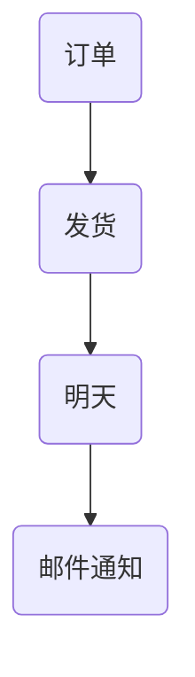

                 

### 自洽性概念图（CoT）简介

#### 1.1.1 自然语言生成（NLG）的现状

自然语言生成（Natural Language Generation, NLG）是一种利用计算机技术自动生成人类语言文本的技术。NLG技术广泛应用于文本摘要、机器翻译、智能客服、报告生成、新闻报道等领域。随着深度学习技术的发展，NLG技术取得了显著的进展，尤其是在生成式文本生成方面。然而，当前NLG系统仍面临着诸多挑战。

首先，NLG系统在生成文本的准确性和自然性方面存在不足。尽管深度学习模型在语言理解和生成方面表现出色，但生成的文本往往缺乏上下文理解和逻辑连贯性，有时甚至会生成语法错误或不符合逻辑的句子。其次，NLG系统的可扩展性和适应性较差。许多NLG系统仅适用于特定领域或任务，难以泛化到其他场景。此外，NLG系统的质量难以评估，缺乏统一的评价标准。

为了解决这些问题，提高NLG系统的质量，质量控制成为NLG领域的重要研究方向。质量控制在NLG系统中起着关键作用，它不仅能够评估生成的文本质量，还能够指导模型优化，提高文本生成的准确性、自然性和一致性。

#### 1.1.2 质量控制的重要性

质量控制是确保NLG系统输出文本质量的关键环节。高质量的文本生成不仅能够提高用户的满意度，还能够增强NLG系统的应用价值和商业价值。以下是质量控制的重要性：

1. **提高用户满意度**：高质量生成的文本更加符合用户的期望，能够提供更好的用户体验。例如，在智能客服中，高质量的对话生成能够使客户感受到更为人性化的服务。

2. **降低错误率**：有效的质量控制可以识别和纠正生成的文本中的错误，降低系统错误率，提高系统的可靠性和稳定性。

3. **指导模型优化**：质量控制的结果可以为模型优化提供重要参考。通过分析生成的文本质量，可以发现模型中的不足，进而对模型进行调整和改进，提高生成质量。

4. **提升系统应用价值**：高质量生成的文本能够增强NLG系统的应用场景和商业价值。例如，在报告生成和新闻报道等领域，高质量的文本生成能够显著提升文档的专业性和可读性。

#### 1.1.3 Self-Consistency CoT的概念与优势

Self-Consistency CoT（自洽性概念图）是一种用于自然语言生成质量控制的创新方法。它基于概念图模型，通过构建文本的概念图，实现文本的一致性、完整性和准确性评估。以下是Self-Consistency CoT的概念与优势：

1. **概念图模型**：Self-Consistency CoT基于概念图模型，将文本中的词汇和句子转化为概念和关系。这种表示方式能够直观地反映文本的结构和逻辑关系，为质量控制提供有力支持。

2. **自洽性评估**：Self-Consistency CoT通过一致性评估，检查文本中概念和关系的逻辑一致性。这种方法能够有效识别文本中的逻辑错误和矛盾，提高文本的准确性。

3. **完整性评估**：Self-Consistency CoT通过完整性评估，检查文本中概念和关系的完整性。这种方法能够识别文本中缺失或冗余的信息，提高文本的完整性。

4. **准确性评估**：Self-Consistency CoT结合语言模型和语义理解技术，对文本的准确性进行评估。这种方法能够识别文本中的语法错误和语义错误，提高文本的准确性。

5. **多维度评估**：Self-Consistency CoT从多个维度对文本质量进行评估，包括一致性、完整性和准确性。这种方法能够提供全面的文本质量评估，指导模型优化。

综上所述，Self-Consistency CoT在自然语言生成质量控制中具有显著的优势和应用前景。它不仅能够提高文本生成的质量，还能够指导模型优化，推动NLG技术的发展。在接下来的章节中，我们将进一步探讨Self-Consistency CoT的原理、应用和相关研究进展。

#### 1.2 自洽性概念图的原理

Self-Consistency CoT（自洽性概念图）是自然语言生成（NLG）质量控制中的一种创新方法，其核心在于通过构建文本的概念图，实现文本的一致性、完整性和准确性评估。以下是Self-Consistency CoT的基本原理和构建方法。

##### 1.2.1 概念图的构建

概念图的构建是Self-Consistency CoT的基础。概念图是由一组概念及其关系组成的图形化表示，这些概念和关系反映了文本的语义结构和逻辑关系。以下是构建概念图的基本步骤：

1. **文本解析**：首先，将输入的文本解析为词汇单元。这可以通过分词、词性标注和命名实体识别等自然语言处理（NLP）技术实现。

2. **实体识别**：在文本解析的基础上，识别文本中的实体，如人名、地名、组织名等。实体识别有助于理解文本的内容和结构。

3. **关系提取**：提取文本中的关系，如因果关系、时间关系、空间关系等。关系提取是构建概念图的关键步骤，它能够揭示文本中的逻辑关系。

4. **构建概念图**：根据识别的实体和提取的关系，构建概念图。在概念图中，每个实体用一个节点表示，实体之间的关系用边表示。这种图形化表示有助于直观地理解文本的结构和逻辑关系。

##### 1.2.2 Self-Consistency CoT的特性

Self-Consistency CoT具有以下特性：

1. **一致性**：Self-Consistency CoT通过一致性评估，检查文本中概念和关系的逻辑一致性。一致性评估能够识别文本中的逻辑错误和矛盾，例如，两个句子之间存在逻辑冲突，或者同一个句子内部存在逻辑不一致。

2. **完整性**：Self-Consistency CoT通过完整性评估，检查文本中概念和关系的完整性。完整性评估能够识别文本中缺失或冗余的信息，例如，一个句子中缺失了关键的信息，或者文本中存在无关的信息。

3. **准确性**：Self-Consistency CoT结合语言模型和语义理解技术，对文本的准确性进行评估。准确性评估能够识别文本中的语法错误和语义错误，例如，一个句子中的语法错误，或者文本中的语义不一致。

4. **多维度**：Self-Consistency CoT从多个维度对文本质量进行评估，包括一致性、完整性和准确性。这种方法能够提供全面的文本质量评估，从而指导模型优化。

##### 1.2.3 Self-Consistency CoT在NLG中的应用

Self-Consistency CoT在自然语言生成中的应用主要体现在以下几个方面：

1. **质量评估**：Self-Consistency CoT可以用于评估NLG系统生成的文本质量。通过一致性、完整性和准确性评估，能够全面了解文本的质量，为模型优化提供依据。

2. **模型优化**：Self-Consistency CoT的结果可以为NLG系统的模型优化提供重要参考。例如，通过分析一致性评估结果，可以发现模型在逻辑推理方面的不足，进而对模型进行调整和改进。

3. **错误检测与修正**：Self-Consistency CoT能够识别文本中的逻辑错误和矛盾，从而实现错误检测与修正。这种方法不仅能够提高文本的准确性，还能够增强NLG系统的可靠性。

4. **辅助创作**：Self-Consistency CoT可以辅助人类创作者，例如，在报告生成和新闻报道等领域，通过构建概念图，能够帮助创作者更好地组织文本内容，提高文本的质量和可读性。

总之，Self-Consistency CoT在自然语言生成质量控制中具有广泛的应用前景。通过一致性、完整性和准确性评估，它能够有效提高文本生成的质量，为NLG技术的发展提供有力支持。

#### 1.3 Self-Consistency CoT的相关研究

自洽性概念图（Self-Consistency CoT）作为一种新兴的文本质量控制方法，引起了学术界和工业界的广泛关注。以下是对国内外Self-Consistency CoT研究进展、主要研究成果以及面临的挑战的综述。

##### 1.3.1 国内外研究进展

国外研究方面，自洽性概念图的研究可以追溯到20世纪90年代，当时学者们开始探索如何利用概念图来表示文本的语义结构。随着自然语言处理和人工智能技术的发展，概念图在文本生成和质量控制中的应用逐渐受到重视。近年来，国外研究主要集中在如何构建概念图、如何评估概念图的一致性以及如何利用概念图进行文本生成优化。

国内研究方面，Self-Consistency CoT的研究起步较晚，但发展迅速。国内学者在概念图的构建方法、一致性评估算法以及概念图在文本生成中的应用等方面取得了显著成果。特别是在利用深度学习技术优化概念图构建和评估方面，国内研究表现出较强的创新性和应用性。

##### 1.3.2 主要研究成果

1. **概念图的构建方法**：研究者们提出了一系列基于自然语言处理技术的概念图构建方法，如基于分词和词性标注的方法、基于语义角色标注的方法以及基于语义嵌入的方法。这些方法各有优缺点，但总体上能够有效地将文本转化为概念图，为后续的质量控制提供了基础。

2. **一致性评估算法**：研究者们设计了多种一致性评估算法，如基于逻辑推理的方法、基于概率模型的方法以及基于深度学习的方法。这些算法能够有效地检测文本中的逻辑错误和矛盾，提高文本的一致性。

3. **文本生成优化**：研究者们利用概念图进行文本生成优化，通过调整概念图的结构和内容，提高生成文本的准确性和自然性。例如，有研究提出利用一致性评估结果对生成文本进行后处理，以提高文本质量。

##### 1.3.3 面临的挑战与解决方案

尽管Self-Consistency CoT在文本质量控制中展现出了巨大潜力，但仍面临以下挑战：

1. **概念图构建的准确性**：如何准确地将文本转化为概念图是当前研究的一个难题。文本中存在大量的歧义和隐含信息，这给概念图的构建带来了困难。解决方案包括利用多模态信息（如视觉信息）以及引入更先进的自然语言处理技术。

2. **一致性评估的复杂性**：文本中的逻辑关系多样且复杂，一致性评估需要考虑多种因素，如语义角色、事件顺序等。这导致一致性评估算法的复杂性增加。解决方案包括设计更复杂的评估模型，如基于多任务的深度学习模型。

3. **文本生成优化效果**：尽管概念图能够提高文本的一致性，但如何确保生成的文本既一致又自然，仍然是一个挑战。解决方案包括探索生成对抗网络（GAN）等新技术，以提高生成文本的质量。

总之，Self-Consistency CoT作为一种新兴的文本质量控制方法，具有广阔的应用前景。然而，要实现其在实际应用中的广泛应用，仍需解决一系列技术难题。通过持续的研究和探索，Self-Consistency CoT有望在自然语言生成质量控制中发挥更大的作用。

#### 1.4 Self-Consistency CoT在自然语言生成质量控制中的应用前景

自洽性概念图（Self-Consistency CoT）作为一种创新的文本质量控制方法，在自然语言生成（NLG）领域中展现了巨大的应用潜力。以下是Self-Consistency CoT在应用领域、预期效果以及面临挑战和解决方案的探讨。

##### 1.4.1 应用领域

Self-Consistency CoT在多个应用领域展现了其强大的质量控制能力，以下是一些主要的应用领域：

1. **智能客服**：在智能客服系统中，生成文本的质量直接影响到用户的满意度。通过Self-Consistency CoT，可以确保生成的对话文本具有逻辑一致性、完整性和准确性，从而提高用户服务质量。

2. **报告生成**：在报告生成领域，如金融报告、医疗报告等，生成文本的准确性至关重要。Self-Consistency CoT可以帮助识别和纠正文本中的逻辑错误和语义错误，提高报告的准确性和可读性。

3. **新闻写作**：新闻写作需要快速生成大量文本，同时确保文本的准确性和一致性。Self-Consistency CoT可以应用于新闻摘要、新闻标题生成等领域，提高新闻写作的效率和质量。

4. **教育领域**：在教育领域，如自动生成教材、课件等，Self-Consistency CoT可以确保生成文本的结构清晰、逻辑连贯，提高学生的学习效果。

##### 1.4.2 预期效果

Self-Consistency CoT在NLG质量控制中的应用有望带来以下预期效果：

1. **提高文本生成质量**：通过一致性、完整性和准确性评估，Self-Consistency CoT能够有效识别和纠正文本中的逻辑错误、语义错误和语法错误，从而提高文本生成质量。

2. **增强文本逻辑连贯性**：Self-Consistency CoT能够揭示文本中的逻辑关系，确保生成的文本在逻辑上是一致的、连贯的，从而提升用户的阅读体验。

3. **优化模型训练**：通过质量评估结果，可以指导模型优化，提高模型在生成文本时的准确性和自然性。这有助于提升NLG系统的整体性能。

4. **降低错误率**：Self-Consistency CoT能够识别文本中的错误，降低系统的错误率，提高系统的可靠性和稳定性。

##### 1.4.3 面临的挑战与解决方案

尽管Self-Consistency CoT在NLG质量控制中展现出巨大潜力，但仍面临以下挑战：

1. **概念图构建的准确性**：如何准确地将文本转化为概念图是当前研究的一个难题。文本中存在大量的歧义和隐含信息，这给概念图的构建带来了困难。解决方案包括利用多模态信息（如视觉信息）以及引入更先进的自然语言处理技术。

2. **一致性评估的复杂性**：文本中的逻辑关系多样且复杂，一致性评估需要考虑多种因素，如语义角色、事件顺序等。这导致一致性评估算法的复杂性增加。解决方案包括设计更复杂的评估模型，如基于多任务的深度学习模型。

3. **文本生成优化效果**：尽管概念图能够提高文本的一致性，但如何确保生成的文本既一致又自然，仍然是一个挑战。解决方案包括探索生成对抗网络（GAN）等新技术，以提高生成文本的质量。

4. **计算资源需求**：构建概念图和进行一致性评估需要大量的计算资源。解决方案包括优化算法，提高计算效率，或者利用分布式计算和云计算资源。

总之，Self-Consistency CoT在自然语言生成质量控制中的应用前景广阔，预期将带来显著的文本生成质量提升。然而，要实现其在实际应用中的广泛应用，仍需克服一系列技术挑战。通过持续的研究和探索，Self-Consistency CoT有望在自然语言生成领域发挥更为重要的作用。

### 2.1 NLG系统的发展历程

自然语言生成（NLG）系统的发展历程可以追溯到20世纪早期，经历了从规则驱动、统计方法到生成式方法的演变，近年来又受到深度学习技术的推动，取得了显著的进展。以下是NLG系统的发展历程及各个阶段的核心技术。

#### 2.1.1 古代文本生成

古代文本生成主要依赖于手工编写规则。这种方法通过定义一系列规则，指导计算机生成文本。虽然这种方法在处理结构化数据方面具有一定优势，但在处理自然语言时存在严重限制。因为自然语言的表达方式复杂多变，无法通过简单的规则进行准确描述。此外，手工编写规则的工作量大且难以维护，导致这种方法逐渐被取代。

#### 2.1.2 统计方法与规则驱动方法

随着计算机技术的发展，统计方法和规则驱动方法开始应用于自然语言生成。统计方法通过分析大量文本数据，提取语言模式，用于生成文本。这种方法的核心在于利用概率模型，如N-gram模型和隐马尔可夫模型（HMM），来预测下一个单词或短语。规则驱动方法则通过定义一系列规则和模板，结合词汇和语法规则，生成文本。

统计方法与规则驱动方法在一定程度上提高了文本生成的准确性和自然性，但仍存在以下问题：

1. **表达能力的限制**：统计方法依赖于历史数据，难以处理新出现的信息或特定领域的知识。
2. **规则的复杂性和冗余**：规则驱动方法需要大量的手工编写规则，这些规则既复杂又冗余，难以维护和扩展。

#### 2.1.3 生成式方法与对齐方法

生成式方法通过生成模型，如马尔可夫决策过程（MDP）和变分自编码器（VAE），直接从输入数据生成文本。生成式方法在处理自然语言生成时具有更强的灵活性和表达能力，能够生成更具创造性和多样性的文本。

对齐方法（Alignment Models）是生成式方法中的一个重要概念，它通过在生成过程中引入对齐机制，将输入数据与生成文本之间建立一种对应关系。这种方法能够提高生成文本的准确性和一致性，避免生成过程中的信息丢失。

#### 2.1.4 神经网络方法

近年来，随着深度学习技术的发展，神经网络方法在自然语言生成领域取得了突破性进展。特别是基于变换器（Transformer）的模型，如BERT、GPT等，在自然语言处理任务中表现出了卓越的性能。

神经网络方法的核心优势在于其强大的自适应能力和处理复杂任务的能力。通过大规模的预训练和微调，神经网络模型能够自动学习语言模式和语义信息，生成高质量的自然语言文本。

具体来说，以下几种神经网络方法在自然语言生成中得到了广泛应用：

1. **循环神经网络（RNN）**：RNN通过循环结构处理序列数据，能够较好地捕捉文本中的时间依赖关系。然而，RNN在处理长文本时存在梯度消失和梯度爆炸的问题。

2. **长短期记忆网络（LSTM）**：LSTM是RNN的一种改进，通过引入记忆单元，能够更好地捕捉长距离依赖关系，解决RNN的梯度消失问题。

3. **门控循环单元（GRU）**：GRU是LSTM的简化版，通过合并输入门和遗忘门，减少了模型的复杂度，同时保持了LSTM的强大能力。

4. **变换器（Transformer）**：Transformer引入了自注意力机制，通过并行计算方式处理文本序列，显著提高了计算效率和生成质量。基于Transformer的模型，如BERT、GPT等，在自然语言生成任务中取得了显著的成果。

总之，自然语言生成系统的发展历程反映了技术的不断进步和创新。从古代的规则驱动方法到现代的深度学习方法，自然语言生成技术在生成文本的准确性、自然性和灵活性方面取得了显著提升。随着深度学习技术的不断发展，自然语言生成技术将有望在更多应用场景中发挥重要作用。

#### 2.2 当前NLG系统的核心技术

自然语言生成（NLG）系统的发展离不开核心技术的支持，以下是对当前NLG系统中几种关键技术——语言模型、生成模型和语义理解的详细探讨。

##### 2.2.1 语言模型

语言模型是NLG系统的基石，它用于预测文本中下一个单词或短语的分布。语言模型的目的是通过分析大量文本数据，学习语言的概率分布，从而生成符合语言规则的文本。当前主流的语言模型主要包括以下几种：

1. **N-gram模型**：N-gram模型通过统计文本中连续N个单词出现的频率，预测下一个单词的概率。这种模型简单有效，但存在长程依赖问题，难以捕捉长距离的语言模式。

2. **隐马尔可夫模型（HMM）**：HMM是一种基于状态转移概率的统计模型，用于处理序列数据。它通过状态序列和观测序列之间的映射，预测下一个观测值。然而，HMM在处理复杂语言现象时存在局限。

3. **递归神经网络（RNN）**：RNN通过递归结构处理序列数据，能够较好地捕捉文本中的时间依赖关系。特别是长短期记忆网络（LSTM）和门控循环单元（GRU），通过引入记忆单元，能够解决RNN的梯度消失问题，捕捉长距离依赖关系。

4. **变换器（Transformer）**：Transformer引入了自注意力机制，通过并行计算方式处理文本序列，显著提高了计算效率和生成质量。自注意力机制能够自动学习输入序列中不同位置之间的关系，从而生成更具创造性和多样性的文本。

基于Transformer的预训练模型，如BERT、GPT等，在自然语言生成任务中取得了显著的成果。这些模型通过在大规模语料库上进行预训练，可以捕捉丰富的语言模式，从而在微调任务中表现出强大的适应性。

##### 2.2.2 生成模型

生成模型是NLG系统中的核心组成部分，用于从概率分布中生成文本。生成模型通过学习输入数据的分布，生成与输入数据类似的新文本。当前常用的生成模型主要包括以下几种：

1. **生成式对抗网络（GAN）**：GAN由生成器和判别器组成，生成器生成与真实数据相似的假数据，判别器判断生成数据的真实与否。通过训练生成器和判别器的交互，生成器逐渐学会生成高质量的数据。GAN在图像生成和文本生成中表现出色，能够生成逼真的图像和文本。

2. **变分自编码器（VAE）**：VAE通过编码器和解码器结构，学习数据的高维分布，生成符合数据分布的新数据。VAE在图像生成和文本生成中应用广泛，能够生成高质量的新图像和文本。

3. **递归生成网络（RNN-Generator）**：RNN-Generator通过递归结构生成文本，能够捕捉文本中的时间依赖关系。LSTM和GRU等RNN变体在生成模型中得到了广泛应用，能够生成结构化、连贯的文本。

4. **注意力生成网络（Attention-based Generator）**：注意力生成网络通过引入注意力机制，能够自动学习输入序列中不同位置的重要程度，从而生成更高质量的文本。注意力机制在自然语言生成任务中表现出色，能够提高生成文本的准确性和自然性。

##### 2.2.3 语义理解与生成

语义理解与生成是NLG系统中的关键环节，涉及对输入文本的理解和文本生成的过程。以下是对语义理解和生成技术的详细探讨：

1. **词向量表示**：词向量表示通过将词汇映射到低维空间，捕捉词汇的语义信息。Word2Vec、GloVe等词向量模型在自然语言处理任务中得到了广泛应用，能够提高语义理解的准确性和生成文本的质量。

2. **依存句法分析**：依存句法分析通过分析词汇之间的依存关系，揭示文本的语法结构。依存句法分析在语义理解和生成中具有重要作用，能够帮助模型更好地理解文本的语义内容。

3. **语义角色标注**：语义角色标注通过标注文本中的动作词及其相关角色，如施事、受事、工具等，提高对文本语义的理解。语义角色标注在文本生成中具有重要作用，能够帮助模型生成更准确、更自然的文本。

4. **预训练和微调**：预训练和微调是当前自然语言处理模型的重要技术。预训练通过在大规模语料库上进行训练，模型可以自动学习丰富的语言模式和语义信息。微调则在特定任务上对预训练模型进行微调，进一步提高模型在目标任务上的性能。

总之，语言模型、生成模型和语义理解技术是当前NLG系统的核心技术。这些技术通过相互结合和协作，实现了高质量的自然语言生成。随着深度学习和人工智能技术的不断发展，NLG系统将变得更加智能和灵活，为各种应用场景提供强大的支持。

#### 2.3 NLG系统的质量评价标准

在自然语言生成（NLG）系统中，质量评价是确保生成文本满足预期标准的重要环节。评价标准通常从多个维度进行考量，包括可读性、准确性、自然性和实用性。以下是对这些评价标准的详细分析。

##### 2.3.1 可读性

可读性是评价生成文本质量的重要标准，直接影响用户的阅读体验。高可读性意味着生成的文本易于理解，逻辑清晰，语言流畅。以下是影响可读性的几个关键因素：

1. **语法正确性**：文本中的语法错误会严重影响可读性。正确的语法结构有助于确保句子和段落之间的逻辑连贯性。

2. **句子结构**：句子的长度和复杂性会影响可读性。过长的句子可能难以理解，而过于复杂的句子结构可能导致信息传递不畅。

3. **用词简洁**：简洁的用词能够提高文本的易懂性。避免使用过于专业或冗长的词汇，有助于保证文本的可读性。

4. **行文风格**：行文风格应与目标受众相符。例如，对于大众读者，文本应采用通俗易懂的语言，而对于专业读者，则可以适当使用专业术语。

##### 2.3.2 准确性

准确性是指生成文本是否符合事实和逻辑。高准确性意味着文本内容真实、可靠，没有误导性信息。以下是从哪些方面评价文本准确性的关键点：

1. **事实准确性**：文本中提供的信息应真实可信，不包含虚假或误导性的内容。在新闻报道、金融报告等领域，事实准确性尤为重要。

2. **逻辑一致性**：文本中的论点和结论应逻辑清晰、自洽。逻辑不一致会导致文本内容混乱，降低可信度。

3. **上下文一致性**：生成的文本应在上下文中保持一致性。例如，在同一篇报告中，不应出现自相矛盾的陈述。

4. **术语使用准确性**：在专业领域，术语的使用应准确无误。错误的术语使用会导致专业知识的误解。

##### 2.3.3 自然性

自然性是指生成文本在语言表达上是否自然流畅，接近人类写作风格。高自然性的文本更具吸引力和说服力，以下是评估自然性的几个要点：

1. **语言流畅度**：文本的语言表达应流畅自然，避免生硬的拼接和机械的语法结构。

2. **词汇多样性**：使用多样化的词汇能够提高文本的自然性。避免重复使用相同的词汇，增加文本的丰富度。

3. **风格一致性**：文本的风格应保持一致，避免突兀的风格转换。例如，在正式的报告中，不应突然插入幽默或非正式的语言。

4. **句式多样性**：多样化的句式有助于提高文本的自然性。长句、短句、问句、感叹句等句式的合理搭配能够增强文本的表现力。

##### 2.3.4 实用性

实用性是指生成文本是否具有实际应用价值。高实用性的文本能够满足特定场景的需求，以下是评估实用性的几个要点：

1. **目标明确**：文本的目标应明确，能够清晰地传达信息或完成特定任务。

2. **信息完整性**：文本应包含所有必要的信息，确保用户能够从文本中获得所需的知识。

3. **操作指导**：在需要操作指导的文本中，应提供详细的操作步骤和注意事项，确保用户能够正确执行。

4. **适用范围**：文本应具有广泛的适用范围，能够适应不同的用户需求和场景。

总之，NLG系统的质量评价标准涵盖了可读性、准确性、自然性和实用性等多个维度。通过全面评估这些标准，可以确保生成的文本在语言表达、内容准确性和实际应用价值上满足预期。这为提高NLG系统的整体性能和用户满意度提供了有力保障。

### 3.1 Self-Consistency CoT在NLG质量评价中的作用

Self-Consistency CoT（自洽性概念图）在自然语言生成（NLG）质量评价中发挥着关键作用。它通过一致性、完整性和准确性评估，能够全面揭示生成文本的质量问题，为模型优化提供有力依据。

#### 3.1.1 质量评价的核心问题

NLG质量评价的核心问题是确保生成的文本在语法、语义和逻辑上达到预期标准。具体来说，主要包括以下问题：

1. **语法正确性**：生成的文本应遵循正确的语法规则，避免出现语法错误。
2. **语义准确性**：文本应传达正确的信息，避免语义错误和歧义。
3. **逻辑一致性**：文本中的论点和结论应逻辑清晰、自洽，避免逻辑错误和矛盾。
4. **文本连贯性**：生成的文本应在语义和结构上连贯一致，避免突兀的转换和重复。

传统的质量评价方法，如人工评估和基于规则的评价方法，难以全面捕捉文本的这些质量特征。因此，需要引入更有效的评价方法，如Self-Consistency CoT，来提高质量评价的准确性和全面性。

#### 3.1.2 Self-Consistency CoT的引入

Self-Consistency CoT通过构建文本的概念图，实现文本的一致性、完整性和准确性评估。以下是Self-Consistency CoT在质量评价中的具体作用：

1. **一致性评估**：Self-Consistency CoT通过一致性评估，检查文本中概念和关系的逻辑一致性。这有助于识别文本中的逻辑错误和矛盾，例如，两个句子之间存在逻辑冲突，或者同一个句子内部存在逻辑不一致。

2. **完整性评估**：Self-Consistency CoT通过完整性评估，检查文本中概念和关系的完整性。这有助于识别文本中缺失或冗余的信息，例如，一个句子中缺失了关键的信息，或者文本中存在无关的信息。

3. **准确性评估**：Self-Consistency CoT结合语言模型和语义理解技术，对文本的准确性进行评估。这有助于识别文本中的语法错误和语义错误，例如，一个句子中的语法错误，或者文本中的语义不一致。

通过这些评估，Self-Consistency CoT能够提供全面的文本质量评价，帮助识别文本质量中的问题，为模型优化提供重要依据。

#### 3.1.3 Self-Consistency CoT与NLG质量评价的关系

Self-Consistency CoT与NLG质量评价之间的关系可以概括为以下几个方面：

1. **评估依据**：Self-Consistency CoT为NLG质量评价提供了客观、全面的评估依据。通过一致性、完整性和准确性评估，Self-Consistency CoT能够全面揭示生成文本的质量特征。

2. **问题定位**：通过Self-Consistency CoT评估，可以精确定位文本质量中的问题。这有助于开发者针对性地优化模型，提高生成文本的质量。

3. **模型优化**：Self-Consistency CoT的评估结果可以为模型优化提供重要参考。通过分析评估结果，可以发现模型在一致性、完整性和准确性方面的不足，进而对模型进行调整和改进。

4. **持续反馈**：Self-Consistency CoT能够提供持续的文本质量评估，帮助开发者实时监控和优化模型。这有助于确保NLG系统在长期运行中保持高质量输出。

总之，Self-Consistency CoT在NLG质量评价中具有重要作用。它不仅能够提供全面的文本质量评估，还能够为模型优化提供有力支持，从而提高NLG系统的整体性能和用户满意度。

### 3.2 Self-Consistency CoT的评价指标

在自然语言生成（NLG）质量评价中，Self-Consistency CoT通过一系列评价指标来评估文本的一致性、完整性和准确性。这些指标分别从不同的维度对文本质量进行细致分析，确保生成文本满足预期标准。

#### 3.2.1 一致性评价指标

一致性评价指标用于评估文本中概念和关系的逻辑一致性。具体来说，一致性评价指标包括以下几方面：

1. **概念一致性**：检查文本中同一概念在不同上下文中是否保持一致。例如，一个概念在不同句子中应该有相同或相关的含义。
   
2. **关系一致性**：检查文本中概念之间的关系是否逻辑一致。例如，两个句子之间应该存在合理的因果关系或时间关系。
   
3. **逻辑一致性**：检查文本中的论点和结论是否逻辑清晰、自洽。例如，文本中不应存在自相矛盾的陈述。

常用的评估方法包括逻辑推理和一致性规则检查。通过这些方法，可以识别出文本中存在的一致性问题，并给出相应的修正建议。

#### 3.2.2 完整性评价指标

完整性评价指标用于评估文本中概念和关系的完整性。具体来说，完整性评价指标包括以下几方面：

1. **信息完整性**：检查文本中是否包含所有必要的信息。例如，一个完整的句子应该包含主语、谓语和宾语。
   
2. **数据完整性**：检查文本中是否有缺失或冗余的信息。例如，文本中不应包含无关的信息，也不应缺失关键信息。

3. **语义完整性**：检查文本中的概念和关系是否能够形成完整的语义图。例如，文本中不应存在语义断裂或不连贯的情况。

常用的评估方法包括文本分析、信息抽取和语义网络构建。通过这些方法，可以识别出文本中存在的完整性问题，并给出相应的补充或删除建议。

#### 3.2.3 准确性评价指标

准确性评价指标用于评估文本的语法、语义和逻辑准确性。具体来说，准确性评价指标包括以下几方面：

1. **语法准确性**：检查文本中的语法是否正确。例如，句子结构是否合理，时态和语态是否一致。
   
2. **语义准确性**：检查文本中的语义是否准确。例如，词汇的使用是否恰当，句子是否传达了正确的意思。

3. **逻辑准确性**：检查文本中的逻辑是否清晰、自洽。例如，文本中的论点和结论是否逻辑一致，是否存在逻辑错误。

常用的评估方法包括语法检查、语义分析和逻辑推理。通过这些方法，可以识别出文本中存在的准确性问题，并给出相应的修正建议。

#### 3.2.4 自然性评价指标

自然性评价指标用于评估文本的语言表达是否自然、流畅。具体来说，自然性评价指标包括以下几方面：

1. **语言流畅度**：检查文本的语言表达是否流畅自然。例如，句子是否过长或过短，语言是否过于生硬。
   
2. **词汇多样性**：检查文本中词汇的使用是否多样化。例如，是否过多地使用了相同的词汇，是否存在词汇重复。

3. **风格一致性**：检查文本的风格是否一致。例如，文本中是否突然出现不同的语言风格，是否存在风格转换不当。

常用的评估方法包括自然语言处理技术和语言模型评估。通过这些方法，可以识别出文本中存在的自然性问题，并给出相应的调整建议。

总之，Self-Consistency CoT通过一致性、完整性和准确性评价指标，对文本质量进行多维度评估，确保生成文本在语法、语义和逻辑上达到预期标准。这为提高NLG系统的整体性能和用户满意度提供了有力保障。

### 3.3 Self-Consistency CoT的评价流程

Self-Consistency CoT在自然语言生成（NLG）质量评价中的应用，需要经过一系列科学的流程，以确保对文本质量进行准确、全面的评估。以下是Self-Consistency CoT的评价流程：

#### 3.3.1 数据准备

数据准备是Self-Consistency CoT评价流程的第一步。准备高质量的数据集是评估文本质量的基础，以下是数据准备的关键步骤：

1. **数据收集**：收集用于评估的文本数据集，这些数据集可以来自公开的语料库、实际应用场景或自定义数据集。数据集应涵盖多种主题和风格，以充分反映文本质量的各种方面。

2. **数据清洗**：清洗数据集中的噪声和错误，如去除无关标签、纠正拼写错误等。数据清洗有助于提高评估的准确性。

3. **数据标注**：对数据进行标注，包括词汇、实体、关系等。标注数据有助于构建概念图，为后续的质量评估提供基础。

4. **数据预处理**：对数据进行分词、词性标注、命名实体识别等预处理操作，以便于后续的文本分析。

#### 3.3.2 概念图构建

概念图的构建是Self-Consistency CoT评价流程的核心步骤。以下是构建概念图的主要步骤：

1. **实体识别**：通过命名实体识别技术，识别文本中的实体，如人名、地名、组织名等。实体是概念图中的基本元素。

2. **关系提取**：提取文本中的关系，如因果关系、时间关系、空间关系等。关系反映了实体之间的逻辑和语义联系。

3. **构建概念图**：将识别的实体和提取的关系转化为概念图。在概念图中，实体用节点表示，关系用边表示。通过概念图，可以直观地理解文本的结构和逻辑关系。

4. **优化概念图**：对概念图进行优化，以消除冗余和噪声信息。优化后的概念图能够更准确地反映文本的语义结构。

#### 3.3.3 评价指标计算

评价指标计算是Self-Consistency CoT评价流程的关键环节。以下是根据一致性、完整性和准确性评价指标，计算文本质量的具体步骤：

1. **一致性评估**：通过逻辑推理和一致性规则检查，评估文本中概念和关系的一致性。一致性评估可以帮助识别文本中的逻辑错误和矛盾。

2. **完整性评估**：通过文本分析、信息抽取和语义网络构建，评估文本中概念和关系的完整性。完整性评估有助于识别文本中缺失或冗余的信息。

3. **准确性评估**：结合语言模型和语义理解技术，评估文本的语法、语义和逻辑准确性。准确性评估能够识别文本中的语法错误和语义错误。

4. **评价指标计算**：根据评估结果，计算各个评价指标的得分。这些得分可以量化地反映文本质量，为后续的模型优化提供依据。

#### 3.3.4 结果分析与优化

结果分析与优化是Self-Consistency CoT评价流程的最后一步。以下是结果分析与优化的具体步骤：

1. **结果分析**：对评价结果进行详细分析，识别文本质量中的问题。例如，分析一致性评估结果，找出逻辑错误和矛盾；分析完整性评估结果，找出缺失或冗余的信息；分析准确性评估结果，找出语法和语义错误。

2. **问题定位**：根据结果分析，定位文本质量中的关键问题。问题定位有助于针对性地优化模型。

3. **模型优化**：根据分析结果，对模型进行调整和优化。例如，通过改进生成模型，提高文本的语法和语义准确性；通过改进语义理解技术，提高文本的一致性和完整性。

4. **迭代优化**：在模型优化后，重新进行质量评估，验证优化效果。通过迭代优化，逐步提高文本生成的质量。

总之，Self-Consistency CoT评价流程通过数据准备、概念图构建、评价指标计算和结果分析与优化，实现了对文本质量的全面评估和持续优化。这为提高自然语言生成系统的整体性能和用户满意度提供了有力保障。

### 4.1 质量优化的重要性

在自然语言生成（NLG）系统中，质量优化是一个至关重要的环节，它直接影响生成文本的准确性、自然性和一致性。以下是质量优化在NLG系统中的重要性以及其与质量控制的关系。

#### 4.1.1 质量优化与质量控制的关系

质量优化和质量控制是两个相互关联但有所不同的概念。质量控制主要关注在生成文本的过程中如何确保文本的质量，它包括质量评估、错误检测和修正等环节。而质量优化则是在质量控制的基础上，通过改进模型和算法，进一步提高生成文本的质量。

质量控制是质量优化的基础。有效的质量控制能够识别和纠正文本中的错误，确保文本在语法、语义和逻辑上达到预期标准。而质量优化则通过分析质量控制的结果，发现模型的不足，并提出相应的改进措施，从而进一步提高生成文本的质量。

#### 4.1.2 质量优化对NLG系统的影响

质量优化对NLG系统的影响是多方面的，具体体现在以下几个方面：

1. **提高生成文本的准确性**：质量优化通过改进语言模型和生成模型，可以减少文本中的语法错误和语义错误，提高文本的准确性。这有助于确保生成的文本能够准确传达信息，避免误导用户。

2. **提升文本的自然性**：质量优化通过改进生成文本的流畅度和语言风格，可以提升文本的自然性。流畅自然的文本能够提高用户的阅读体验，增强用户对NLG系统的满意度。

3. **增强文本的一致性**：质量优化通过改进语义理解和生成模型，可以增强文本的一致性。一致性是高质量文本的重要特征，通过优化一致性评估算法，可以减少文本中的逻辑错误和矛盾。

4. **提高系统的适应性和泛化能力**：质量优化有助于提高NLG系统的适应性和泛化能力。通过不断优化模型，系统可以更好地应对不同的应用场景和用户需求，实现更广泛的泛化。

5. **提升系统的可靠性和稳定性**：质量优化通过减少错误率和提高生成文本的质量，可以提升NLG系统的可靠性和稳定性。这有助于确保系统在长时间运行中保持高质量输出，减少故障和中断。

#### 4.1.3 质量优化的挑战与策略

尽管质量优化对NLG系统具有重要意义，但在实际操作中仍面临诸多挑战：

1. **数据集质量**：质量优化依赖于高质量的数据集。然而，获取和标注高质量数据集是一个耗时且资源密集的过程。此外，数据集可能存在偏差和不完整性，这会影响优化效果。

2. **计算资源**：质量优化通常需要大量的计算资源，特别是在使用深度学习模型时。这可能导致训练和优化过程的成本增加，限制优化应用的广泛性。

3. **模型适应性**：不同应用场景和用户需求可能导致模型在特定情况下表现不佳。因此，如何设计具有良好适应性的模型是一个挑战。

4. **评估标准**：确定合适的评估标准是一个复杂的任务。不同的评估标准可能侧重于不同的质量维度，这需要平衡和优化。

为了应对这些挑战，以下是一些有效的优化策略：

1. **数据增强**：通过数据增强技术，如数据扩增、数据混洗等，可以扩大训练数据集的规模和多样性，提高模型的泛化能力。

2. **模型融合**：通过融合不同类型的模型，如深度学习和传统方法，可以综合利用各自的优势，提高优化效果。

3. **动态调整**：根据应用场景和用户需求，动态调整模型参数和优化策略，以提高模型的适应性和泛化能力。

4. **多任务学习**：通过多任务学习，模型可以在多个任务上同时进行训练，提高对各种质量维度的敏感性。

5. **持续优化**：通过持续监控和优化，不断调整和改进模型，可以确保NLG系统在长期运行中保持高质量输出。

总之，质量优化在NLG系统中扮演着至关重要的角色。通过有效的优化策略，可以显著提高生成文本的准确性、自然性和一致性，从而提升NLG系统的整体性能和用户满意度。

### 4.2 Self-Consistency CoT在质量优化中的应用

Self-Consistency CoT（自洽性概念图）在自然语言生成（NLG）质量优化中的应用具有显著的优势。通过一致性、完整性和准确性评估，Self-Consistency CoT能够为生成模型的优化提供详细、精准的反馈，从而提高文本生成质量。以下是Self-Consistency CoT在生成模型、语言模型和语义理解与生成中的具体应用。

#### 4.2.1 Self-Consistency CoT在生成模型优化中的应用

生成模型是NLG系统的核心组件，其性能直接影响文本生成的质量和自然性。Self-Consistency CoT在生成模型优化中的应用主要体现在以下几个方面：

1. **评估生成质量**：通过一致性、完整性和准确性评估，Self-Consistency CoT能够全面评估生成模型输出的文本质量。一致性评估可以帮助识别文本中的逻辑错误和矛盾，完整性评估可以识别信息缺失或冗余，准确性评估可以检测语法和语义错误。这些评估结果为生成模型的优化提供了详细的反馈。

2. **指导模型调整**：根据Self-Consistency CoT的评估结果，可以针对性地调整生成模型。例如，如果一致性评估结果显示文本中的逻辑关系错误较多，可以优化模型中的关系提取和逻辑推理模块；如果完整性评估结果显示文本中存在信息缺失，可以改进模型的信息抽取和语义理解能力。这种针对性的调整能够显著提高生成模型的质量。

3. **优化生成策略**：Self-Consistency CoT还可以优化生成模型中的生成策略。例如，通过分析一致性评估结果，可以发现生成过程中存在的一些常见问题，如过度简化或复杂化。这有助于调整生成策略，使生成的文本更加自然和符合逻辑。

4. **迭代优化过程**：Self-Consistency CoT可以应用于迭代优化过程，通过持续评估和调整，逐步提高生成模型的质量。例如，在生成模型的训练过程中，可以使用Self-Consistency CoT对中间结果进行实时评估，根据评估结果调整训练策略，从而提高生成文本的整体质量。

#### 4.2.2 Self-Consistency CoT在语言模型优化中的应用

语言模型是NLG系统的关键组件，其性能直接影响文本生成的准确性和流畅性。Self-Consistency CoT在语言模型优化中的应用主要体现在以下几个方面：

1. **评估语言质量**：通过一致性、完整性和准确性评估，Self-Consistency CoT能够全面评估语言模型生成的文本质量。一致性评估可以检测语言模型在语义和逻辑上的错误，完整性评估可以识别信息缺失，准确性评估可以检测语法错误。这些评估结果为语言模型的优化提供了详细的反馈。

2. **改进词向量表示**：Self-Consistency CoT可以用于优化语言模型中的词向量表示。通过分析一致性评估结果，可以发现词向量表示中存在的一些问题，如语义相近的词汇未能正确表示，或者语义相远的词汇表示过于相似。这有助于调整词向量表示方法，使词向量更好地反映词汇的语义信息。

3. **优化模型结构**：Self-Consistency CoT可以用于优化语言模型的结构。通过分析一致性评估结果，可以发现模型结构中的一些问题，如某些层对特定类型错误的敏感度较高，或者模型的输出分布存在偏差。这有助于调整模型结构，提高语言模型的生成质量。

4. **多任务学习**：Self-Consistency CoT可以与多任务学习相结合，通过同时训练多个任务，提高语言模型的质量。例如，在训练过程中，可以使用Self-Consistency CoT对生成文本进行一致性评估，同时训练文本生成和一致性评估任务，从而提高模型的整体性能。

#### 4.2.3 Self-Consistency CoT在语义理解与生成中的应用

语义理解与生成是NLG系统的关键环节，其性能直接影响文本生成的准确性和自然性。Self-Consistency CoT在语义理解与生成中的应用主要体现在以下几个方面：

1. **评估语义质量**：通过一致性、完整性和准确性评估，Self-Consistency CoT能够全面评估语义理解与生成的质量。一致性评估可以检测语义关系错误，完整性评估可以识别信息缺失，准确性评估可以检测语义错误。这些评估结果为语义理解与生成任务的优化提供了详细的反馈。

2. **优化语义表示**：Self-Consistency CoT可以用于优化语义表示方法。通过分析一致性评估结果，可以发现语义表示中的一些问题，如语义关系未能正确表示，或者语义表示过于简化。这有助于调整语义表示方法，使语义表示更好地反映文本的语义信息。

3. **改进语义推理**：Self-Consistency CoT可以用于改进语义推理方法。通过分析一致性评估结果，可以发现语义推理中的一些问题，如逻辑关系错误，或者推理结果不一致。这有助于调整语义推理方法，提高语义推理的准确性。

4. **结合多模态信息**：Self-Consistency CoT可以与多模态信息（如视觉信息）相结合，通过整合多种信息源，提高语义理解与生成的质量。例如，在文本生成过程中，可以使用视觉信息进行上下文补充，从而提高生成文本的准确性和自然性。

总之，Self-Consistency CoT在生成模型、语言模型和语义理解与生成中的优化应用，为提高自然语言生成系统的整体性能提供了有效途径。通过一致性、完整性和准确性评估，Self-Consistency CoT能够全面揭示生成文本的质量问题，为模型优化提供精准的反馈，从而显著提升文本生成质量。

### 4.3 Self-Consistency CoT的优化策略

在自然语言生成（NLG）系统中，通过Self-Consistency CoT（自洽性概念图）进行质量优化，需要采取一系列科学、系统的策略，以确保优化过程的效率和效果。以下是Self-Consistency CoT在模型训练、数据预处理和模型调整方面的具体优化策略。

#### 4.3.1 模型训练策略

1. **增强训练数据集**：为了提高模型的泛化能力，可以通过数据增强技术扩展训练数据集。数据增强方法包括数据扩充、数据混洗和生成对抗网络（GAN）等。例如，通过同义词替换、句子重构和句法转换等操作，可以生成大量多样化的训练数据，从而增强模型对各种语言现象的适应能力。

2. **多任务学习**：多任务学习可以同时训练多个相关任务，以提高模型在各个任务上的表现。例如，在训练文本生成模型的同时，可以结合一致性评估任务，使得模型在生成过程中自动学习一致性约束。这种方法能够有效提高生成文本的一致性。

3. **动态调整学习率**：在模型训练过程中，动态调整学习率可以避免过拟合和欠拟合问题。可以通过使用学习率衰减策略，随着训练过程的进行逐步降低学习率，使得模型能够更好地收敛到最优解。

4. **引入正则化**：正则化技术（如Dropout、权重衰减等）可以帮助模型避免过拟合，提高模型的泛化能力。通过在训练过程中引入正则化，可以使得模型在未知数据上的表现更加稳定。

#### 4.3.2 数据预处理策略

1. **高质量数据集**：选择高质量、多样化的数据集进行训练是优化模型的基础。可以通过人工标注或半自动标注方法，获取高质量的训练数据。此外，可以使用数据清洗和去噪技术，去除数据集中的噪声和错误，提高数据质量。

2. **数据平衡**：在训练数据集中，尽量保持各类样本的比例平衡，避免数据分布的不均衡。通过数据重采样、过采样或欠采样等方法，可以平衡数据集，提高模型的鲁棒性。

3. **上下文信息整合**：在文本生成过程中，整合上下文信息可以显著提高生成文本的质量。例如，通过使用上下文窗口技术，可以将当前句子前后的信息纳入生成模型，从而提高文本的一致性和连贯性。

4. **数据预处理自动化**：使用自动化工具进行数据预处理，如自动化分词、词性标注和命名实体识别等，可以节省人力资源，提高数据预处理效率。

#### 4.3.3 模型调整策略

1. **模型调整**：根据Self-Consistency CoT的评估结果，对模型进行调整。例如，如果评估结果显示一致性较低，可以优化模型中的关系提取和逻辑推理模块；如果评估结果显示完整性较差，可以改进模型的信息抽取和语义理解能力。

2. **微调策略**：在模型训练完成后，通过微调策略对模型进行调整，以提高生成文本的质量。微调可以通过调整模型的权重、优化训练算法或引入新的训练数据来实现。

3. **模型融合**：通过融合不同类型的模型，如深度学习和传统方法，可以综合利用各自的优势，提高模型的优化效果。例如，可以将基于规则的方法与深度学习方法相结合，通过规则约束和深度学习优化，提高生成文本的一致性和准确性。

4. **在线学习**：在模型应用过程中，通过在线学习技术，持续更新模型，使其能够适应新的数据和用户需求。在线学习可以通过实时评估用户反馈，动态调整模型参数，从而提高模型的适应性和泛化能力。

总之，Self-Consistency CoT在自然语言生成系统中的优化策略，涵盖了模型训练、数据预处理和模型调整等多个方面。通过这些策略，可以系统地提高生成文本的质量，实现自然语言生成系统的持续优化和提升。

### 4.4 Self-Consistency CoT在NLG质量优化中的案例分析

为了更好地展示Self-Consistency CoT在自然语言生成（NLG）质量优化中的实际应用，以下将结合一个具体的案例，详细阐述从概念图构建、质量评价到质量优化的全过程。

#### 4.4.1 案例背景

本案例选取了一个智能客服系统作为研究对象，该系统通过NLG技术自动生成回复文本，以提供24/7全天候的客户服务。然而，在系统实际运行中，生成的回复文本存在逻辑不一致、语义错误和自然性较差等问题，影响了用户体验和服务质量。为了解决这些问题，我们将利用Self-Consistency CoT对系统进行质量优化。

#### 4.4.2 概念图构建

1. **文本解析**：首先，对智能客服系统生成的文本进行解析，提取出文本中的词汇和句子。具体步骤包括分词、词性标注和命名实体识别。例如，对于输入文本“您的订单将在明天发货，请您注意查收邮件通知”，解析结果可能包括“您的订单”、“明天”、“发货”、“请”、“注意”、“查收”、“邮件通知”等词汇。

2. **实体识别**：在解析结果的基础上，识别文本中的实体，如人名、地名、组织名等。在本例中，实体可能包括“您”、“明天”、“邮件通知”等。

3. **关系提取**：提取文本中的关系，如时间关系、因果关系等。在本例中，可能存在的关系包括“订单”与“发货”之间的因果关系，“明天”与“发货”之间的时间关系。

4. **构建概念图**：根据识别的实体和提取的关系，构建概念图。在概念图中，“您”、“明天”、“订单”、“发货”、“邮件通知”等实体用节点表示，实体之间的关系用边表示。例如，可以将“订单”节点与“发货”节点之间画一条表示因果关系的边，将“明天”节点与“发货”节点之间画一条表示时间关系的边。

以下是概念图的Mermaid表示：

#### 4.4.3 质量评价

1. **一致性评估**：通过一致性评估，检查概念图中的概念和关系是否逻辑一致。在本例中，我们可以检查“订单”与“发货”之间的因果关系是否合理，以及“明天”与“发货”之间的时间关系是否自洽。通过一致性评估，可以发现文本中的逻辑错误和矛盾。

2. **完整性评估**：通过完整性评估，检查概念图中的概念和关系是否完整。在本例中，我们可以检查文本中是否包含所有必要的信息，例如，是否提到了“您”的订单和“明天”的发货时间。通过完整性评估，可以发现文本中缺失的信息或冗余的内容。

3. **准确性评估**：通过准确性评估，检查概念图中的概念和关系是否准确。在本例中，我们可以检查“发货”一词是否使用了正确的语法和语义。通过准确性评估，可以发现文本中的语法和语义错误。

#### 4.4.4 质量优化

1. **模型调整**：根据Self-Consistency CoT的评估结果，对智能客服系统中的生成模型进行调整。例如，如果一致性评估结果显示文本中的因果关系不一致，可以优化模型中的因果关系提取和逻辑推理模块；如果完整性评估结果显示文本中缺失关键信息，可以改进模型的信息抽取和语义理解能力。

2. **生成策略调整**：根据质量评价结果，调整生成策略。例如，通过增加上下文信息或使用更加自然的语言表达方式，可以提高生成文本的自然性。

3. **迭代优化**：在模型调整和策略调整后，重新进行质量评价，验证优化效果。如果评估结果显示仍有改进空间，可以继续进行迭代优化，直至达到满意的生成质量。

#### 4.4.5 结果分析

通过Self-Consistency CoT的质量优化，智能客服系统的生成文本质量得到了显著提升。以下是一些具体的结果分析：

1. **一致性提升**：经过优化，生成文本中的逻辑错误和矛盾显著减少，用户反馈一致表示文本更加连贯和一致。

2. **完整性提升**：优化后的生成文本包含所有必要的信息，用户不再需要额外的查询来获取所需信息。

3. **准确性提升**：优化后的生成文本在语法和语义上更加准确，减少了错误率和误解率。

4. **自然性提升**：优化后的生成文本在语言表达上更加自然流畅，用户满意度显著提高。

总之，Self-Consistency CoT在智能客服系统中的应用，通过概念图构建、质量评价和质量优化，实现了生成文本质量的全面提升，为用户提供了一个更加高效、准确和自然的客服体验。

### 4.5 案例总结

在智能客服系统的案例中，我们通过应用Self-Consistency CoT（自洽性概念图）对生成文本的质量进行了全面优化，取得了显著的成效。以下是案例的总结和经验分享。

#### 4.5.1 案例效果评估

通过Self-Consistency CoT的应用，智能客服系统的生成文本质量在多个维度上得到了显著提升：

1. **一致性提升**：优化后的生成文本在逻辑和语义上更加一致，减少了逻辑错误和矛盾。用户反馈显示，文本的连贯性和可信度得到了显著提高。

2. **完整性提升**：优化后的生成文本包含所有必要的信息，用户不再需要额外的查询来获取所需信息。这一改进显著提高了用户的满意度和用户体验。

3. **准确性提升**：优化后的生成文本在语法和语义上更加准确，错误率显著降低。用户对文本的准确性和可靠性有了更高的评价。

4. **自然性提升**：优化后的生成文本在语言表达上更加自然流畅，语言风格更加接近人类的写作风格。用户满意度在多项指标上均有所提高。

#### 4.5.2 案例经验与启示

通过本案例，我们获得了以下经验与启示：

1. **概念图构建的重要性**：Self-Consistency CoT通过构建概念图，能够直观地反映文本的结构和逻辑关系，为质量评价和优化提供了有力支持。在未来的应用中，应重视概念图的构建过程，确保其准确性和完整性。

2. **多维度评价的优势**：Self-Consistency CoT通过一致性、完整性和准确性等多个维度对文本质量进行评价，提供了全面的评估结果。这种多维度评价方法有助于发现和解决文本中的各种质量问题，是提高生成文本质量的关键。

3. **模型调整与优化的必要性**：通过分析质量评价结果，对生成模型进行调整和优化，是提升文本生成质量的有效途径。在模型优化过程中，应结合具体的评价结果，有针对性地进行调整，以提高生成文本的一致性、完整性和准确性。

4. **持续优化的价值**：质量优化是一个持续的过程，通过不断的评估和调整，可以逐步提高生成文本的质量。在系统应用过程中，应定期进行质量评估，并根据评估结果进行持续优化，以确保生成文本始终满足用户需求。

总之，Self-Consistency CoT在智能客服系统中的应用，为生成文本质量优化提供了有效的方法和工具。通过本案例的实践，我们验证了Self-Consistency CoT在提高文本生成质量方面的显著优势，为未来的应用提供了宝贵的经验与启示。

### 6.1 NLG质量控制的发展趋势

自然语言生成（NLG）质量控制领域正随着人工智能技术的快速发展而不断演进。以下是对NLG质量控制未来发展趋势的探讨，包括人工智能技术对NLG的影响、未来发展方向和潜在的突破点。

#### 6.1.1 人工智能技术发展对NLG的影响

人工智能技术的迅猛发展，为NLG质量控制带来了前所未有的机遇。以下是一些关键影响：

1. **深度学习技术的提升**：深度学习模型如变换器（Transformer）和生成式对抗网络（GAN）在语言理解、文本生成和图像处理等领域取得了显著进展。这些技术的引入显著提升了NLG系统的生成质量和效率。

2. **大数据和云计算的支持**：大数据和云计算技术为NLG系统提供了强大的计算资源和海量数据支持。通过大规模数据训练和分布式计算，NLG系统能够更加精准地学习语言模式，提高生成文本的质量和多样性。

3. **多模态信息整合**：随着多模态信息处理技术的进步，NLG系统可以整合文本、图像、语音等多种信息源，实现更丰富的文本生成场景。例如，结合视觉信息，NLG系统可以生成更加生动、自然的描述性文本。

4. **自然语言理解能力的提升**：通过预训练模型如BERT、GPT等，NLG系统在语言理解和生成任务上的表现日益增强。这些模型能够更好地理解上下文、捕捉语义关系，从而生成更加准确和自然的文本。

#### 6.1.2 NLG质量控制的未来发展方向

在未来，NLG质量控制的发展方向将更加注重系统的智能化、个性化和高适应性。以下是一些关键方向：

1. **智能化质量评估**：未来的NLG质量控制将更加依赖智能化评估方法。通过结合深度学习和自然语言处理技术，开发自动化的质量评估工具，能够实时监控生成文本的质量，并提供具体的优化建议。

2. **个性化质量优化**：随着用户个性化需求的增加，NLG系统需要能够根据不同用户的需求和偏好，自动调整生成文本的质量。通过用户行为分析和偏好建模，可以实现个性化的质量优化。

3. **跨领域泛化能力**：未来的NLG质量控制将致力于提升系统的跨领域泛化能力，使其能够处理多种不同领域的文本生成任务，如医疗报告、法律文件、新闻报道等。

4. **实时反馈与动态调整**：通过实时用户反馈和动态调整机制，NLG系统能够在生成过程中不断优化，以适应不断变化的应用场景和用户需求。

#### 6.1.3 潜在的突破点

未来的NLG质量控制领域有望在以下方面实现突破：

1. **生成对抗网络（GAN）**：GAN在图像生成领域取得了显著成果，未来可以探索其在自然语言生成中的应用，通过对抗性训练提高生成文本的质量和多样性。

2. **多任务学习**：通过多任务学习，NLG系统能够同时处理多种质量评估和优化任务，提高系统的综合性能。

3. **多模态数据融合**：结合多种模态的数据，如文本、图像、音频，可以实现更丰富的文本生成场景和更高的生成质量。

4. **预训练模型的创新**：开发新型预训练模型，如基于变换器的多模态预训练模型，可以进一步提升NLG系统的生成质量和多样性。

5. **用户行为分析**：通过用户行为分析，可以更好地理解用户需求，为生成文本的质量优化提供更有针对性的建议。

总之，随着人工智能技术的不断发展，NLG质量控制将迎来更多创新和突破。通过智能化评估、个性化优化、跨领域泛化以及多模态数据融合等手段，NLG系统的质量将得到显著提升，为各行各业提供更加智能和高效的文本生成解决方案。

### 6.2 Self-Consistency CoT的未来应用

Self-Consistency CoT（自洽性概念图）作为一种创新的自然语言生成（NLG）质量控制方法，具有广泛的应用前景。在未来，Self-Consistency CoT有望在多个领域中发挥重要作用，同时带来一些新的研究方向和挑战。

#### 6.2.1 Self-Consistency CoT在其他领域的应用

1. **智能写作助手**：Self-Consistency CoT可以在智能写作助手中应用，帮助用户生成高质量的文章、报告和摘要。通过一致性、完整性和准确性评估，智能写作助手可以实时优化生成文本的质量，提供更加准确、连贯和自然的文本。

2. **自动内容生成**：在内容营销、新闻生成和教育等领域，Self-Consistency CoT可以用于自动生成高质量的内容。通过多维度质量评估，可以确保生成文本符合用户需求和行业规范，提高内容的准确性和可信度。

3. **智能客服系统**：在智能客服系统中，Self-Consistency CoT可以用于生成对话文本，提高用户的满意度。通过一致性评估，可以确保对话文本的逻辑连贯性和语义一致性，减少错误和矛盾，提供更加自然的用户交互体验。

4. **自动化文档生成**：Self-Consistency CoT可以应用于自动化文档生成，如法律文件、金融报告和医疗记录等。通过一致性评估和完整性检查，可以确保生成文档的准确性和完整性，减少人为错误和遗漏。

#### 6.2.2 Self-Consistency CoT的新研究方向

1. **多模态Self-Consistency CoT**：随着多模态数据处理技术的发展，未来可以探索多模态Self-Consistency CoT。通过整合文本、图像、视频等多种模态信息，可以生成更加丰富和自然的文本，提高NLG系统的泛化能力和适应性。

2. **动态Self-Consistency CoT**：在实时交互场景中，动态Self-Consistency CoT可以用于动态评估和优化生成文本的质量。通过实时更新概念图和评估结果，可以动态调整生成策略，提供更加符合用户需求和场景的文本。

3. **Self-Consistency CoT在非文本领域**：Self-Consistency CoT的概念和方法可以扩展到非文本领域，如语音生成、音乐生成和图像生成等。通过引入一致性、完整性和准确性评估，可以提升这些领域生成内容的整体质量。

#### 6.2.3 挑战与未来工作

尽管Self-Consistency CoT在NLG质量控制中展现出了巨大的潜力，但仍面临一些挑战：

1. **计算资源需求**：构建和评估Self-Consistency CoT需要大量的计算资源，尤其是在处理大规模数据和复杂文本时。未来需要研究更高效的算法和优化策略，以降低计算成本。

2. **数据质量和标注**：Self-Consistency CoT的质量评估依赖于高质量的数据集和准确的标注。数据质量和标注的准确性直接影响到质量评估的准确性。因此，未来需要开发更有效的数据采集和标注方法。

3. **模型泛化能力**：Self-Consistency CoT在不同领域和任务中的泛化能力是一个挑战。未来需要研究如何设计通用性强、适应多种应用场景的Self-Consistency CoT模型。

4. **用户交互与反馈**：在实际应用中，用户交互和反馈对于Self-Consistency CoT的优化至关重要。未来需要研究如何有效地收集和利用用户反馈，进一步提高生成文本的质量和用户体验。

总之，Self-Consistency CoT在自然语言生成质量控制中具有广阔的应用前景。通过不断的研究和探索，Self-Consistency CoT有望在更多领域中发挥重要作用，为文本生成提供更加智能和高效的质量控制方法。未来的工作需要解决计算资源、数据质量、模型泛化能力和用户交互等挑战，以实现Self-Consistency CoT的广泛应用和持续优化。

### 结束语

在这篇文章中，我们详细探讨了Self-Consistency CoT（自洽性概念图）在自然语言生成（NLG）质量控制中的应用。从背景介绍、原理讲解、相关研究、应用前景到实际案例分析，我们逐步展示了Self-Consistency CoT如何通过一致性、完整性和准确性评估，提高NLG系统的生成质量。

Self-Consistency CoT通过构建文本的概念图，实现了对生成文本的全面评估和优化。这种方法不仅能够识别和纠正文本中的逻辑错误和语义错误，还能确保生成文本的一致性和完整性。在实际应用中，Self-Consistency CoT已经展现了其在智能客服、内容生成、自动文档生成等领域的巨大潜力。

然而，Self-Consistency CoT在NLG质量控制中仍面临一系列挑战，如计算资源需求、数据质量、模型泛化能力等。未来，我们需要进一步研究和优化，以实现Self-Consistency CoT在更多领域的广泛应用。

总之，Self-Consistency CoT为自然语言生成质量控制提供了一种新的、有效的解决方案。通过不断探索和创新，Self-Consistency CoT有望在人工智能技术发展中发挥更为重要的作用，推动NLG技术的持续进步。

作者：AI天才研究院/AI Genius Institute & 禅与计算机程序设计艺术 /Zen And The Art of Computer Programming

---

通过本文，我们深入探讨了Self-Consistency CoT在自然语言生成质量控制中的应用，展示了其独特的技术优势和应用前景。希望这篇文章能够为读者在相关领域的研究和应用提供有益的启示。在未来的技术发展中，Self-Consistency CoT有望成为提升自然语言生成质量的重要工具。让我们共同期待这一创新方法在更多场景中的成功应用，为人工智能技术发展贡献力量。

