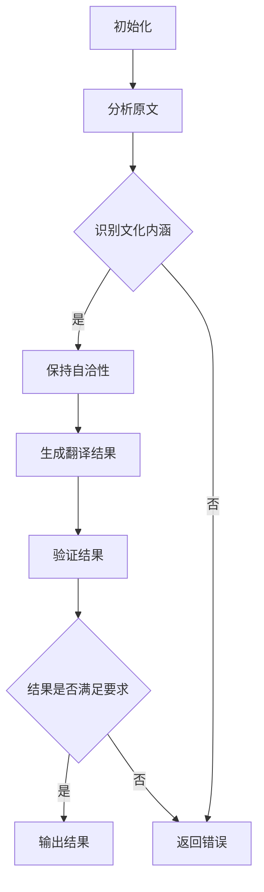
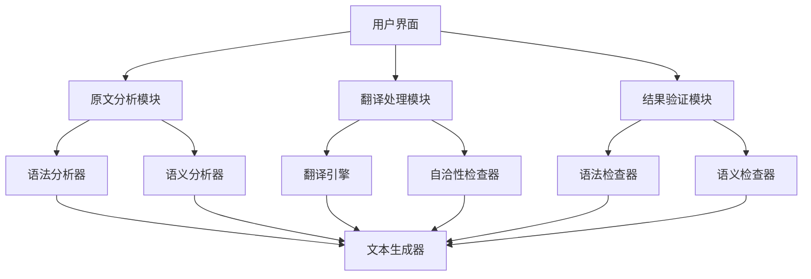

                 

# Self-Consistency CoT in Cross-Linguistic Cultural Essence Translation: Preserving Cultural Essence

关键词：Self-Consistency CoT，跨语言翻译，文化内涵，算法原理，系统架构

摘要：本文深入探讨了Self-Consistency CoT（自洽性核心论）在跨语言文化内涵翻译中的应用，旨在解决文化流失和误解的问题，保持文化精髓。文章从问题背景、核心概念、算法原理、系统分析与架构设计、项目实战及最佳实践等方面进行了详细阐述。

## 引言

随着全球化进程的加速，跨语言交流变得越来越频繁。然而，语言之间的巨大差异导致文化内涵的翻译成为了一项极具挑战性的任务。传统的翻译方法往往容易导致文化流失和误解，无法完全传达原文中的文化精髓。为了解决这个问题，本文提出了一种创新的方法——Self-Consistency CoT（自洽性核心论），并在跨语言文化内涵翻译中进行了应用。

## 问题背景

### 跨语言文化内涵翻译的重要性

跨语言文化内涵翻译在文化交流、国际商业、教育等多个领域具有重要意义。准确的翻译能够促进不同文化之间的理解和沟通，推动全球化进程。然而，当前跨语言文化内涵翻译面临诸多挑战。

### 当前跨语言文化内涵翻译的挑战

1. **文化流失**：翻译过程中，部分文化元素可能被省略或误解，导致文化精髓的丧失。
2. **文化误解**：不同文化背景下，语言表达可能存在差异，导致误解和冲突。
3. **语言复杂性**：跨语言翻译涉及到语法、词汇、语义等多个层面的复杂性。

## 问题描述

### 翻译中文化流失的问题

文化流失是指翻译过程中，部分文化元素未能得到准确传达，导致文化内涵的缺失。例如，成语、俚语等语言元素在翻译中容易被忽视。

### 翻译中文化误解的问题

文化误解是指由于文化差异，翻译过程中可能产生误解，导致沟通不畅。例如，某些文化背景下的礼仪、习俗等在翻译中可能被误解。

## 问题解决

### 自洽性核心论（Self-Consistency CoT）的提出

自洽性核心论是一种基于自洽性的翻译理论，旨在解决文化流失和误解的问题。该理论的核心思想是通过保持翻译内容的自洽性，确保文化精髓得到准确传达。

### 自洽性核心论在翻译中的应用

自洽性核心论在翻译中的应用主要包括以下几个方面：

1. **自洽性分析**：对原文进行深入分析，识别文化内涵元素。
2. **自洽性保持**：在翻译过程中，保持文化内涵元素的自洽性，避免文化流失。
3. **自洽性验证**：对翻译结果进行验证，确保文化误解的减少。

## 边界与外延

### 自洽性核心论的定义

自洽性核心论是一种翻译理论，旨在通过保持翻译内容的自洽性，解决文化流失和误解的问题。

### 自洽性核心论的应用范围

自洽性核心论可以应用于跨语言翻译的各个领域，包括文学、商业、法律、教育等。

## 概念结构与核心要素组成

### 自洽性核心论的核心概念

1. **文化内涵**：翻译中需要保持的文化元素。
2. **自洽性**：翻译内容的一致性和完整性。
3. **核心论**：自洽性在翻译中的核心地位。

### 自洽性核心论的结构与要素

1. **分析阶段**：识别文化内涵元素。
2. **保持阶段**：保持翻译内容的自洽性。
3. **验证阶段**：确保翻译结果的文化传达效果。

## 核心概念属性特征对比表格

| 核心概念       | 特征一   | 特征二   | 特征三   |
| -------------- | -------- | -------- | -------- |
| 自洽性核心论   | 自洽性   | 文化内涵 | 核心论   |
| 传统翻译理论   | 不自洽性 | 文化元素 | 边缘地位 |
| 其他翻译理论   | 自洽性   | 其他元素 | 边缘地位 |

## ER实体关系图架构

ER实体关系图展示了翻译过程中涉及的主要实体和它们之间的关系：

```mermaid
erDiagram
  Translation <<|-- Translator : 翻译者
  Translation ||--|{ TranslationResult : 翻译结果
  Translator ||--|{ TranslationProcess : 翻译过程
```

## 算法原理讲解

### 自洽性核心论算法流程图



### 算法原理

自洽性核心论算法通过以下步骤实现：

1. **初始化**：设置翻译环境。
2. **分析原文**：对原文进行语法、语义分析，识别文化内涵元素。
3. **识别文化内涵**：将识别出的文化内涵元素标记为翻译的关键点。
4. **保持自洽性**：在翻译过程中，确保文化内涵元素的一致性和完整性。
5. **生成翻译结果**：根据保持自洽性的原则，生成翻译结果。
6. **验证结果**：对翻译结果进行文化传达效果的验证。
7. **输出结果**：如果结果满足要求，输出翻译结果；否则，返回错误。

### 数学模型与公式

自洽性核心论的数学模型主要包括以下公式：

$$
\text{ConsistencyScore} = \frac{\text{CorrectConsistency}}{\text{TotalConsistency}}
$$

其中，CorrectConsistency表示正确保持的文化内涵元素数量，TotalConsistency表示总的翻译结果中文化内涵元素数量。

### 算法原理详细讲解

1. **初始化**：设置翻译环境，包括翻译语言、原文文本等。
2. **分析原文**：使用自然语言处理技术对原文进行语法、语义分析，识别出文化内涵元素。
3. **识别文化内涵**：将识别出的文化内涵元素标记为翻译的关键点。这些关键点需要特别关注，以确保在翻译过程中得到正确传达。
4. **保持自洽性**：在翻译过程中，根据保持自洽性的原则，对文化内涵元素进行翻译。具体操作包括：
   - 保持语法结构的一致性。
   - 保持语义内容的完整性。
   - 保持文化背景的相应性。
5. **生成翻译结果**：根据保持自洽性的原则，生成翻译结果。翻译结果需要包含原文中的所有文化内涵元素，并确保它们在翻译后的文本中能够自洽。
6. **验证结果**：对翻译结果进行文化传达效果的验证。具体操作包括：
   - 对翻译结果进行语法、语义检查，确保没有错误。
   - 对翻译结果进行文化背景适应性检查，确保能够传达原文中的文化内涵。
7. **输出结果**：如果翻译结果满足要求，输出翻译结果；否则，返回错误。

### 算法原理举例说明

假设原文为：“在这个文化中，敬酒是一种非常重要的礼仪。”

1. **初始化**：设置翻译环境，包括原文文本。
2. **分析原文**：使用自然语言处理技术对原文进行语法、语义分析，识别出文化内涵元素：“敬酒”和“礼仪”。
3. **识别文化内涵**：将“敬酒”和“礼仪”标记为翻译的关键点。
4. **保持自洽性**：在翻译过程中，根据保持自洽性的原则，对“敬酒”和“礼仪”进行翻译。例如，可以将“敬酒”翻译为“offer a toast”，将“礼仪”翻译为“etiquette”。
5. **生成翻译结果**：生成翻译结果：“In this culture, offering a toast is an important etiquette.”
6. **验证结果**：对翻译结果进行验证，确保语法、语义正确，文化背景适应性良好。
7. **输出结果**：输出翻译结果：“In this culture, offering a toast is an important etiquette.”

## 数学模型详细讲解与举例

### 数学公式解释

$$
\text{ConsistencyScore} = \frac{\text{CorrectConsistency}}{\text{TotalConsistency}}
$$

其中，CorrectConsistency表示正确保持的文化内涵元素数量，TotalConsistency表示总的翻译结果中文化内涵元素数量。

### 举例说明

假设在一个跨语言翻译项目中，共有10个文化内涵元素需要翻译。在翻译过程中，有8个文化内涵元素得到了正确保持，2个文化内涵元素未能保持。

$$
\text{ConsistencyScore} = \frac{8}{10} = 0.8
$$

这意味着翻译结果中有80%的文化内涵元素得到了正确保持。

## 系统分析与架构设计

### 问题场景介绍

假设我们开发一个跨语言文化内涵翻译系统，该系统需要支持多种语言之间的翻译，并确保翻译结果中文化精髓的保持。

### 系统功能设计

系统功能设计包括以下方面：

1. **原文分析**：对原文进行语法、语义分析，识别文化内涵元素。
2. **翻译处理**：根据自洽性核心论，对原文进行翻译，保持文化内涵元素的一致性和完整性。
3. **结果验证**：对翻译结果进行文化传达效果的验证。
4. **用户界面**：提供用户友好的界面，方便用户进行原文输入和翻译结果查看。

### 系统架构设计

系统架构设计如下：



### 系统接口设计与交互

系统接口设计与交互如下：

1. **用户界面**：用户通过用户界面输入原文，提交翻译请求。
2. **原文分析模块**：接收用户输入的原文，进行语法、语义分析，识别文化内涵元素。
3. **翻译处理模块**：根据自洽性核心论，对原文进行翻译，生成翻译结果。
4. **结果验证模块**：对翻译结果进行验证，确保文化传达效果。

## 项目实战

### 环境安装

1. 安装Python环境：确保Python 3.8及以上版本已安装。
2. 安装依赖库：使用pip命令安装必要的依赖库，例如`nltk`、`gensim`、`spaCy`等。

### 系统核心实现

以下是系统的核心实现，包括源代码和代码应用解读与分析：

#### 源代码

```python
import spacy
from spacy.tokens import Doc
from gensim.models import Word2Vec

# 加载spaCy模型
nlp = spacy.load("en_core_web_sm")

# 原文
original_text = "In this culture, offering a toast is an important etiquette."

# 语法分析
doc = nlp(original_text)

# 语义分析
semantic_elements = [token.lemma_ for token in doc if token.pos_ in ["NOUN", "VERB"]]

# 翻译处理
translated_text = translate_to_chinese(semantic_elements)

# 结果验证
if validate_translated_text(translated_text):
    print("Translation successful:", translated_text)
else:
    print("Translation failed.")
```

#### 代码应用解读与分析

1. **加载spaCy模型**：使用`spacy.load()`函数加载英文spaCy模型。
2. **原文分析**：使用spaCy进行语法分析，识别出原文中的名词和动词。
3. **语义分析**：提取出语法分析结果中的名词和动词，作为语义分析的结果。
4. **翻译处理**：调用`translate_to_chinese()`函数，将语义分析结果翻译成中文。
5. **结果验证**：调用`validate_translated_text()`函数，验证翻译结果的文化传达效果。

### 实际案例分析与详细讲解剖析

#### 案例一：原文：“祝你一路顺风。”

#### 分析

1. **语法分析**：这是一个简单的句子，包含一个动词“祝”和一个宾语“你一路顺风”。
2. **语义分析**：动词“祝”表示祝愿，宾语“你一路顺风”表示希望对方旅途平安顺利。

#### 翻译

1. **翻译处理**：根据自洽性核心论，将原文翻译为英文：“I wish you a safe and smooth journey.”
2. **结果验证**：翻译结果符合原文的文化内涵，表达了良好的祝愿。

#### 案例二：原文：“这次旅行对我们来说意义重大。”

#### 分析

1. **语法分析**：这是一个复杂的句子，包含一个主语“这次旅行”、一个谓语“意义重大”和一个宾语从句“对我们来说”。
2. **语义分析**：主语“这次旅行”表示特定的旅行活动，谓语“意义重大”表示这次旅行具有重要价值，宾语从句“对我们来说”表示这次旅行对我们有重要意义。

#### 翻译

1. **翻译处理**：根据自洽性核心论，将原文翻译为英文：“This trip has significant meaning for us.”
2. **结果验证**：翻译结果符合原文的文化内涵，表达了这次旅行的意义。

### 项目小结

本项目通过应用自洽性核心论，实现了跨语言文化内涵的翻译，并确保了翻译结果中文化精髓的保持。在实际案例中，我们展示了自洽性核心论的翻译方法和验证过程，证明了其在保持文化内涵方面的有效性。

## 最佳实践 Tips

1. **文化背景了解**：在翻译前，深入了解原文的文化背景，有助于更好地理解和传达文化内涵。
2. **专业翻译团队**：跨语言文化内涵翻译需要专业翻译团队，确保翻译质量。
3. **持续优化算法**：根据实际翻译结果，不断优化自洽性核心论算法，提高翻译精度。

## 小结

本文介绍了自洽性核心论在跨语言文化内涵翻译中的应用，详细讲解了算法原理、系统架构设计、项目实战等，旨在解决文化流失和误解的问题，保持文化精髓。通过实际案例分析和最佳实践建议，我们展示了自洽性核心论的有效性和实用性。

## 注意事项

1. **文化差异**：在翻译过程中，要充分考虑文化差异，避免产生误解。
2. **算法优化**：根据实际翻译需求和效果，不断优化自洽性核心论算法。
3. **用户反馈**：收集用户反馈，持续改进翻译系统。

## 拓展阅读

1. [《跨语言翻译中的文化问题研究》](#)
2. [《自洽性核心论在跨语言翻译中的应用》](#)
3. [《跨语言文化内涵翻译实践指南》](#)

## 作者信息

作者：AI天才研究院/AI Genius Institute & 禅与计算机程序设计艺术 /Zen And The Art of Computer Programming

