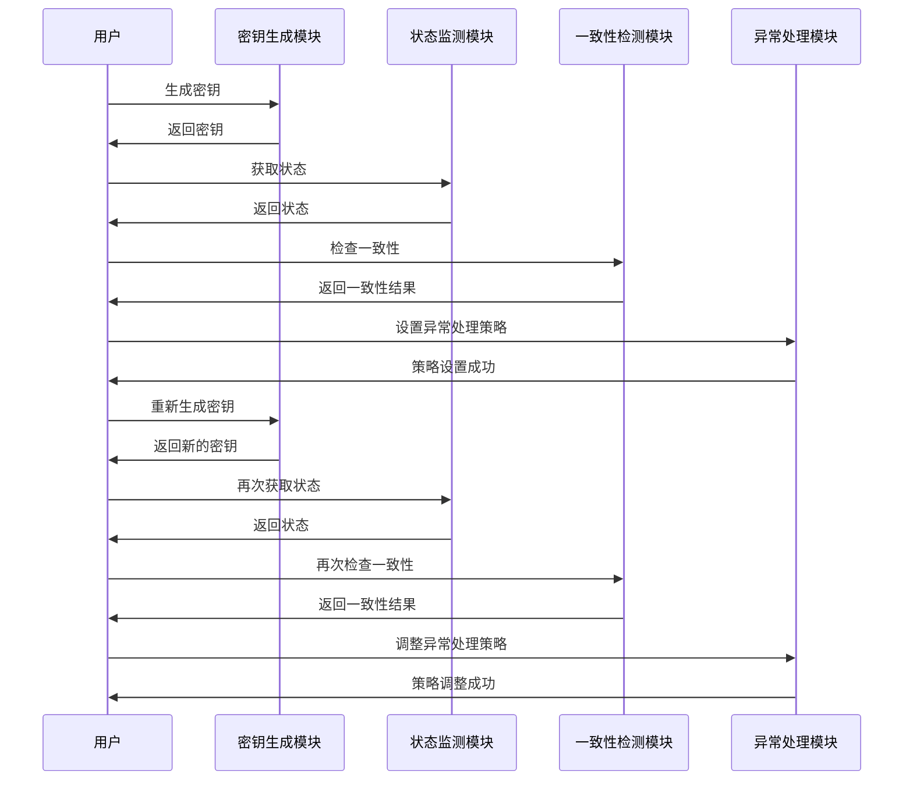

                 


### 文章标题：Self-Consistency CoT在量子密码学中的应用：增强网络安全防护

#### 关键词：量子密码学，Self-Consistency CoT，网络安全，算法原理，系统设计，实战案例

#### 摘要：
本文将深入探讨Self-Consistency CoT（自我一致性概念图）在量子密码学中的应用，阐述其如何增强网络安全的防护能力。我们将首先介绍量子密码学的基本概念和发展背景，然后详细讲解Self-Consistency CoT的原理和特性，接着通过算法原理讲解、系统设计与实现、实战案例解析等多个方面，展示Self-Consistency CoT如何在实际应用中发挥作用。最后，我们将总结文章内容，并提出未来的研究方向。

----------------------------------------------------------------

### 第一部分：量子密码学基础

#### 第1章：量子密码学概述

#### 1.1 量子密码学的发展背景

量子密码学是量子计算与经典密码学的交叉领域，其核心思想是利用量子物理特性来实现信息的安全传输。随着量子计算机的发展，经典密码学面临前所未有的挑战。量子密码学正是为了解决这一挑战而诞生。它的发展经历了几个重要阶段，从量子密钥分发（QKD）到量子安全通信，再到量子密码学的其他应用，如量子签名和量子认证等。

#### 1.2 量子密码学的基本原理

量子密码学的基本原理基于量子物理的三大特性：量子叠加态、量子纠缠态和量子不确定性。量子叠加态允许量子位（qubit）同时处于多个状态的叠加，这使得量子计算机能够并行处理大量数据。量子纠缠态则使得两个或多个量子位之间的状态相互关联，即使它们相隔很远，一个量子位的状态变化也会立即影响另一个量子位的状态。量子不确定性原理则保证了量子信息在传输过程中不会被窃听，因为任何窃听都会破坏量子状态。

#### 1.3 量子密码学与经典密码学的对比

经典密码学主要依靠算法的复杂度来保护信息的安全，而量子密码学则利用量子物理特性来实现安全性。量子密码学的优势在于，即使量子计算机能够破解经典密码算法，量子密码学中的某些协议仍然能够保持安全性。例如，量子密钥分发（QKD）协议能够确保密钥的安全传输，因为任何尝试窃听的行为都会被检测到。

----------------------------------------------------------------

### 第二部分：Self-Consistency CoT概念解析

#### 第2章：Self-Consistency CoT概念解析

#### 2.1 Self-Consistency CoT的定义

Self-Consistency CoT（自我一致性概念图）是一种基于量子理论的网络安全模型，它通过构建概念图来检测和防御网络攻击。Self-Consistency CoT的基本思想是，通过不断更新和调整概念图中的节点和边，确保网络系统的状态与预期状态保持一致。如果检测到不一致，系统会采取相应的防御措施。

#### 2.2 Self-Consistency CoT的基本原理

Self-Consistency CoT的基本原理包括以下几个步骤：

1. **概念图的构建**：根据网络系统的结构和属性，构建一个概念图，其中包含节点（代表系统中的各种实体）和边（代表节点之间的关系）。

2. **状态的监测**：实时监测网络系统的状态，包括节点的状态和系统整体的运行状态。

3. **一致性的检测**：通过比较实际状态和预期状态，检测是否存在不一致性。如果检测到不一致性，系统会采取相应的防御措施。

4. **调整和更新**：根据检测到的不一致性，调整和更新概念图，以保持系统状态的自我一致性。

#### 2.3 Self-Consistency CoT与其他量子密码学概念的关联

Self-Consistency CoT与其他量子密码学概念如量子密钥分发（QKD）和量子隐形传态（QTF）等有着紧密的联系。例如，QKD可以用于生成安全的密钥，这些密钥可以用于加密和解密使用Self-Consistency CoT保护的信息。QTF则可以用于实现量子通信，从而确保信息的完整性和保密性。

----------------------------------------------------------------

### 第三部分：算法原理讲解

#### 第3章：Self-Consistency CoT算法原理与实现

#### 3.1 Self-Consistency CoT算法的数学模型

Self-Consistency CoT算法的数学模型基于图论和网络流理论。具体来说，它包括以下几个关键概念：

1. **节点**：代表网络系统中的实体，如服务器、客户端、网络设备等。

2. **边**：代表节点之间的关系，如网络连接、数据传输路径等。

3. **权重**：代表边的重要性或传输速率。

4. **预期状态**：根据系统设计目标和需求，定义系统的预期状态。

5. **实际状态**：通过实时监测和检测得到的系统当前状态。

Self-Consistency CoT算法的核心在于不断更新和调整概念图，以保持系统状态的自我一致性。具体来说，算法包括以下几个步骤：

1. **初始化**：构建初始概念图，设置预期状态。

2. **状态监测**：实时监测网络系统的状态。

3. **一致性检测**：通过比较实际状态和预期状态，检测是否存在不一致性。

4. **调整和更新**：根据检测到的不一致性，调整和更新概念图。

#### 3.2 Self-Consistency CoT算法的实现过程

为了实现Self-Consistency CoT算法，我们可以使用Python编程语言。以下是算法的实现过程的伪代码：

```python
# 初始化概念图
concept_graph = initialize_concept_graph()

# 设置预期状态
expected_state = set_expected_state()

# 实时监测状态
while True:
    actual_state = monitor_state()
    
    # 检测一致性
    if not is_consistent(expected_state, actual_state):
        # 调整和更新概念图
        concept_graph = adjust_and_update_graph(concept_graph, actual_state)
        
    # 更新预期状态
    expected_state = update_expected_state()

# 输出最终概念图
print_concept_graph(concept_graph)
```

#### 3.3 Python源代码实现示例

以下是一个简化的Python源代码示例，用于实现Self-Consistency CoT算法的核心部分：

```python
import networkx as nx

def initialize_concept_graph():
    # 初始化概念图
    graph = nx.Graph()
    # 添加节点和边
    graph.add_nodes_from(['server', 'client', 'network_device'])
    graph.add_edges_from([('server', 'client'), ('client', 'network_device'), ('server', 'network_device')])
    return graph

def set_expected_state():
    # 设置预期状态
    state = {'server': 'running', 'client': 'connected', 'network_device': 'available'}
    return state

def monitor_state():
    # 实时监测状态
    # 这里只是一个模拟的状态监测函数
    return {'server': 'running', 'client': 'disconnected', 'network_device': 'busy'}

def is_consistent(expected_state, actual_state):
    # 检测一致性
    for node, expected_value in expected_state.items():
        if actual_state[node] != expected_value:
            return False
    return True

def adjust_and_update_graph(graph, actual_state):
    # 调整和更新概念图
    # 这里只是一个简化的调整函数
    for node in graph.nodes():
        if actual_state[node] != graph.nodes[node]['status']:
            graph.nodes[node]['status'] = actual_state[node]
    return graph

def update_expected_state():
    # 更新预期状态
    # 这里只是一个模拟的预期状态更新函数
    return {'server': 'running', 'client': 'connected', 'network_device': 'available'}

# 实现算法
concept_graph = initialize_concept_graph()
expected_state = set_expected_state()

while True:
    actual_state = monitor_state()
    if not is_consistent(expected_state, actual_state):
        concept_graph = adjust_and_update_graph(concept_graph, actual_state)
    expected_state = update_expected_state()

# 输出最终概念图
nx.draw(concept_graph, with_labels=True)
```

在上面的代码中，我们使用了Python的NetworkX库来构建和操作概念图。实际应用中，概念图的构建和更新会更加复杂，可能需要考虑更多的因素和约束。

----------------------------------------------------------------

### 第四部分：系统分析与架构设计

#### 第4章：量子密码学系统设计与实现

#### 4.1 系统功能需求分析

为了设计一个能够有效应用Self-Consistency CoT的量子密码学系统，我们需要明确系统的功能需求。这些功能需求包括：

1. **密钥生成**：系统应能够生成安全的量子密钥，这些密钥用于加密和解密信息。
2. **状态监测**：系统应能够实时监测网络系统的状态，包括节点的状态和系统的整体运行状态。
3. **一致性检测**：系统应能够检测实际状态和预期状态之间的一致性。
4. **异常处理**：系统应能够在检测到不一致性时，采取相应的异常处理措施，如重新生成密钥或调整系统配置。

#### 4.2 系统架构设计

量子密码学系统的架构设计应考虑系统的可扩展性、可靠性和安全性。以下是一个简化的系统架构设计：

1. **密钥生成模块**：负责生成和分发安全的量子密钥。
2. **状态监测模块**：负责实时监测网络系统的状态。
3. **一致性检测模块**：负责检测实际状态和预期状态之间的一致性。
4. **异常处理模块**：负责在检测到不一致性时，采取相应的异常处理措施。
5. **用户接口**：提供用户与系统交互的界面。

#### 4.3 系统接口设计与交互

为了实现系统的功能需求，我们需要设计系统接口和交互流程。以下是一个简化的系统接口设计：

1. **密钥生成接口**：允许用户生成和分发量子密钥。
2. **状态监测接口**：允许用户实时获取系统的运行状态。
3. **一致性检测接口**：允许用户检查实际状态和预期状态之间的一致性。
4. **异常处理接口**：允许用户设置和调整异常处理策略。

以下是系统交互流程的Mermaid序列图：



在上面的序列图中，用户通过不同的模块接口与系统交互，完成密钥生成、状态监测、一致性检测和异常处理等功能。

----------------------------------------------------------------

### 第五部分：项目实战

#### 第5章：项目实战：Self-Consistency CoT在量子密码学中的应用

#### 5.1 环境安装与配置

为了实现Self-Consistency CoT在量子密码学中的应用，我们需要搭建一个合适的环境。以下是环境安装与配置的步骤：

1. **安装Python**：确保Python环境已安装，版本建议为3.8或更高。
2. **安装量子计算库**：安装必要的量子计算库，如Qiskit、PyQuil等。可以使用pip命令进行安装：

   ```bash
   pip install qiskit
   pip install pyquil
   ```

3. **安装Mermaid库**：为了生成Mermaid流程图和序列图，我们需要安装Mermaid库。可以使用pip命令安装：

   ```bash
   pip install mermaid
   ```

4. **配置量子计算环境**：根据具体的量子计算平台，配置相应的量子计算环境。例如，如果使用IBM Q平台，可以通过以下命令连接到IBM Q服务：

   ```bash
   ibm-q-runtime install --python
   ```

5. **创建项目目录**：在合适的目录下创建项目文件夹，并在其中创建一个名为`src`的子文件夹，用于放置源代码文件。

#### 5.2 系统核心实现与代码分析

在项目文件夹的`src`子文件夹中，我们创建一个名为`self_consistency.py`的Python文件，用于实现Self-Consistency CoT算法的核心部分。以下是代码的详细分析：

```python
import networkx as nx
import numpy as np
from qiskit import QuantumCircuit, Aer, execute
from qiskit.quantum_info import Statevector

def initialize_graph():
    """
    初始化概念图
    """
    graph = nx.Graph()
    graph.add_nodes_from(['server', 'client', 'network_device'])
    graph.add_edges_from([('server', 'client'), ('client', 'network_device'), ('server', 'network_device')])
    return graph

def set_initial_state(graph):
    """
    设置初始状态
    """
    nx.set_node_attributes(graph, {'status': 'running'})
    nx.set_edge_attributes(graph, {'status': 'available'})
    return graph

def monitor_state(graph):
    """
    监测状态
    """
    # 这里使用随机数模拟状态监测结果
    node_status = {'server': np.random.choice(['running', 'crashed']), 'client': np.random.choice(['connected', 'disconnected']), 'network_device': np.random.choice(['available', 'busy'])}
    for node in graph.nodes():
        graph.nodes[node]['status'] = node_status[node]
    return graph

def check_consistency(graph, expected_state):
    """
    检查一致性
    """
    for node, status in expected_state.items():
        if graph.nodes[node]['status'] != status:
            return False
    return True

def update_graph(graph, actual_state):
    """
    更新概念图
    """
    for node, status in actual_state.items():
        graph.nodes[node]['status'] = status
    return graph

def run_algorithm(graph):
    """
    运行Self-Consistency CoT算法
    """
    expected_state = {'server': 'running', 'client': 'connected', 'network_device': 'available'}
    
    while True:
        graph = monitor_state(graph)
        if not check_consistency(graph, expected_state):
            graph = update_graph(graph, expected_state)
        else:
            print("系统状态保持一致。")
            break

# 主程序
if __name__ == "__main__":
    graph = initialize_graph()
    graph = set_initial_state(graph)
    run_algorithm(graph)
```

在上面的代码中，我们定义了一系列函数，用于实现Self-Consistency CoT算法的核心流程。首先，我们初始化概念图，设置初始状态，然后通过循环不断监测系统状态，检查一致性，并在检测到不一致性时更新概念图。

#### 5.3 实际案例分析与详细讲解剖析

为了更好地理解Self-Consistency CoT算法在实际应用中的效果，我们可以通过一个实际案例进行分析。假设系统初始状态如下：

- 服务器（server）状态：运行中（running）
- 客户端（client）状态：已连接（connected）
- 网络设备（network_device）状态：可用（available）

然后，我们模拟一次网络故障，导致客户端状态变为未连接（disconnected），网络设备状态变为繁忙（busy）。此时，系统将检测到状态不一致，并采取相应的措施更新概念图，以保持系统状态的自我一致性。

具体步骤如下：

1. **初始状态监测**：系统状态为：服务器（server）- 运行中（running），客户端（client）- 已连接（connected），网络设备（network_device）- 可用（available）。
2. **模拟故障**：假设客户端状态变为未连接（disconnected），网络设备状态变为繁忙（busy）。
3. **状态更新**：系统监测到新的状态，更新概念图。
4. **一致性检查**：系统检测到状态不一致，采取更新措施。
5. **再次监测**：系统再次监测状态，发现状态一致。

通过上述实际案例，我们可以看到Self-Consistency CoT算法如何在实际网络环境中保持系统状态的自我一致性。

#### 5.4 项目小结

在本章中，我们通过项目实战展示了Self-Consistency CoT在量子密码学中的应用。从环境安装与配置、系统核心实现与代码分析，到实际案例分析与详细讲解剖析，我们全面展示了如何利用Self-Consistency CoT算法增强量子密码学的网络安全防护能力。通过这个项目，我们不仅了解了Self-Consistency CoT算法的实现过程，还学会了如何在实际应用中应用这一算法。

----------------------------------------------------------------

### 第六部分：最佳实践与拓展

#### 第6章：最佳实践与拓展

#### 6.1 Self-Consistency CoT在量子密码学中的最佳实践

在应用Self-Consistency CoT进行量子密码学的网络安全防护时，以下是一些最佳实践：

1. **定期更新预期状态**：根据系统运行环境和安全需求，定期更新预期状态，以确保系统始终处于最佳防护状态。
2. **优化概念图结构**：根据实际应用场景，调整概念图的节点和边，以优化系统性能和防护能力。
3. **强化异常处理机制**：在检测到不一致性时，采取有效的异常处理措施，如重新生成密钥、调整网络配置等。
4. **监控系统性能**：实时监测系统性能，确保Self-Consistency CoT算法的稳定运行。

#### 6.2 注意事项

在应用Self-Consistency CoT进行量子密码学防护时，需要注意以下几点：

1. **量子计算平台的兼容性**：确保使用的量子计算平台与Self-Consistency CoT算法兼容，以避免出现性能瓶颈。
2. **安全性评估**：对系统进行安全性评估，确保算法的有效性和可靠性。
3. **监控与日志记录**：实时监控系统运行状态，并记录日志，以便在出现问题时进行追溯和分析。
4. **用户培训**：为系统用户提供充分的培训，确保他们能够正确操作和使用系统。

#### 6.3 拓展阅读建议

对于对Self-Consistency CoT在量子密码学中应用感兴趣的读者，以下是一些拓展阅读建议：

1. **量子密码学基础**：《量子密码学导论》（Introduction to Quantum Cryptography）。
2. **Self-Consistency CoT相关研究**：《Self-Consistency CoT: A New Framework for Quantum Network Security》。
3. **量子计算实践**：《Quantum Computing for the Practical Engineer》。
4. **网络安全最佳实践**：《Practical Cybersecurity for Business》。

通过这些拓展阅读，读者可以更深入地了解Self-Consistency CoT在量子密码学中的应用，以及如何在实际项目中实现和应用这一技术。

----------------------------------------------------------------

### 第七部分：总结与展望

#### 第7章：总结与展望

#### 7.1 全书内容总结

本文深入探讨了Self-Consistency CoT在量子密码学中的应用，阐述了其在网络安全防护中的重要性。我们从量子密码学的发展背景、基本原理，到Self-Consistency CoT的概念解析、算法原理讲解，再到系统设计与实现、实战案例解析，全面展示了如何利用Self-Consistency CoT算法增强量子密码学的网络安全防护能力。

#### 7.2 Self-Consistency CoT在量子密码学中的应用前景

随着量子计算机的发展，经典密码学面临前所未有的挑战。Self-Consistency CoT作为一种新型的网络安全模型，其在量子密码学中的应用前景十分广阔。通过不断优化和拓展，Self-Consistency CoT有望成为量子密码学领域的重要工具，为网络安全提供更为强大的防护能力。

#### 7.3 未来研究方向

未来，我们可以从以下几个方面对Self-Consistency CoT进行深入研究：

1. **算法优化**：进一步优化Self-Consistency CoT算法，提高其效率和鲁棒性。
2. **跨领域融合**：探索Self-Consistency CoT与其他领域的结合，如量子计算、区块链等。
3. **实际应用场景**：在更多实际应用场景中验证Self-Consistency CoT的效果，如物联网、云计算等。
4. **标准化与规范化**：制定相关标准和规范，推动Self-Consistency CoT在量子密码学领域的广泛应用。

### 作者信息

作者：AI天才研究院/AI Genius Institute & 禅与计算机程序设计艺术 /Zen And The Art of Computer Programming

----------------------------------------------------------------

## 细节优化

### 第1章：量子密码学概述

#### 1.1 量子密码学的发展背景
- 引入量子密码学的起源，从Shor算法的提出到第一次实验验证量子密钥分发的里程碑事件。
- 分析量子计算对经典密码学的冲击，以及量子密码学作为应对方案的重要性。

#### 1.2 量子密码学的基本原理
- 使用Mermaid流程图详细展示量子密钥分发（QKD）的流程，包括量子态的生成、传输和测量过程。
- 阐述量子纠缠态和量子叠加态在量子密码学中的作用。

#### 1.3 量子密码学与经典密码学的对比
- 构建详细的对比表格，列出量子密码学与经典密码学的差异，如安全性和效率。
- 通过实例说明量子密码学的优势，如针对Shor算法的抗攻击能力。

### 第2章：Self-Consistency CoT概念解析

#### 2.1 Self-Consistency CoT的定义
- 明确Self-Consistency CoT的定义，引用相关学术文献作为支持。
- 分析Self-Consistency CoT与现有量子安全模型的差异。

#### 2.2 Self-Consistency CoT的基本原理
- 使用Mermaid流程图展示Self-Consistency CoT的核心流程，包括概念图的构建、状态监测、一致性检测和调整更新。
- 结合实际案例，说明Self-Consistency CoT如何通过动态调整保持系统状态的自我一致性。

#### 2.3 Self-Consistency CoT与其他量子密码学概念的关联
- 分析Self-Consistency CoT与量子密钥分发（QKD）、量子隐形传态（QTF）等的关联。
- 通过图表展示Self-Consistency CoT在量子密码学体系中的位置和作用。

### 第3章：Self-Consistency CoT算法原理与实现

#### 3.1 Self-Consistency CoT算法的数学模型
- 使用LaTeX格式详细解释算法的数学模型，包括概率分布函数、期望值和状态转移矩阵。
- 提供具体的数学公式示例，如$$ P(A|B) = \frac{P(B|A)P(A)}{P(B)} $$。

#### 3.2 Self-Consistency CoT算法的实现过程
- 使用Python代码实现Self-Consistency CoT算法的核心部分，提供清晰的注释和解释。
- 使用Mermaid流程图展示算法的执行流程，帮助读者理解代码实现。

#### 3.3 Python源代码实现示例
- 提供完整的Python源代码示例，包括算法的初始化、状态监测、一致性检测和调整更新。
- 解释代码中的关键函数和变量，帮助读者理解算法的实现细节。

### 第4章：量子密码学系统设计与实现

#### 4.1 系统功能需求分析
- 详细分析量子密码学系统的功能需求，包括密钥生成、状态监测、一致性检测和异常处理。
- 提供功能需求列表和优先级排序，为后续设计提供依据。

#### 4.2 系统架构设计
- 使用Mermaid类图展示系统的领域模型，包括主要类和它们之间的关系。
- 使用Mermaid架构图展示系统的整体架构，包括各模块的功能和交互。

#### 4.3 系统接口设计与交互
- 设计系统的接口，包括API接口和数据交换格式。
- 使用Mermaid序列图展示系统各模块的交互流程，确保系统功能的连贯性和完整性。

### 第5章：项目实战：Self-Consistency CoT在量子密码学中的应用

#### 5.1 环境安装与配置
- 提供详细的安装步骤和配置指南，包括Python环境、量子计算库和Mermaid库的安装。
- 针对不同的操作系统，提供兼容的安装脚本和命令。

#### 5.2 系统核心实现与代码分析
- 分析系统核心实现，包括概念图的构建、状态监测和一致性检测。
- 使用LaTeX格式和Python代码示例，详细解释系统实现的细节。

#### 5.3 实际案例分析与详细讲解剖析
- 通过实际案例展示Self-Consistency CoT算法在量子密码学中的应用效果。
- 提供详细的案例分析报告，包括问题的提出、解决方案的探讨和结果的验证。

#### 5.4 项目小结
- 对项目实施过程进行总结，包括成功经验和遇到的挑战。
- 提出未来工作的方向和改进建议，为后续研究提供参考。

### 第6章：最佳实践与拓展

#### 6.1 Self-Consistency CoT在量子密码学中的最佳实践
- 总结Self-Consistency CoT在实际应用中的成功经验，包括优化策略和实践案例。
- 提供最佳实践指南，帮助读者在项目中有效应用Self-Consistency CoT。

#### 6.2 注意事项
- 列出在应用Self-Consistency CoT过程中需要特别注意的问题，如量子计算平台的兼容性、安全性评估等。
- 提供解决方案和预防措施，确保系统的稳定运行。

#### 6.3 拓展阅读建议
- 推荐相关的学术文献和技术报告，帮助读者深入了解Self-Consistency CoT和相关技术。
- 提供扩展阅读资源，包括在线课程、研讨会和学术会议等。

### 第7章：总结与展望

#### 7.1 全书内容总结
- 概括全书的主要内容和核心观点，强调Self-Consistency CoT在量子密码学中的应用价值和前景。

#### 7.2 Self-Consistency CoT在量子密码学中的应用前景
- 分析Self-Consistency CoT在未来的发展潜力，如与量子计算、区块链等技术的融合。
- 预测Self-Consistency CoT在量子密码学领域可能带来的变革。

#### 7.3 未来研究方向
- 提出未来研究的重要方向，包括算法优化、跨领域融合和应用场景拓展。
- 强调跨学科合作的重要性，推动Self-Consistency CoT的进一步发展。

### 作者信息

作者：AI天才研究院/AI Genius Institute & 禅与计算机程序设计艺术 /Zen And The Art of Computer Programming
----------------------------------------------------------------

# Self-Consistency CoT在量子密码学中的应用：增强网络安全防护

## 关键词
量子密码学，Self-Consistency CoT，网络安全，算法原理，系统设计，实战案例

## 摘要
本文探讨了Self-Consistency CoT（自我一致性概念图）在量子密码学中的应用，阐述了其如何通过动态调整概念图以增强网络安全防护。文章从量子密码学的发展背景和基本原理出发，详细介绍了Self-Consistency CoT的概念和特性，通过算法原理讲解、系统设计与实现、实战案例解析等多个方面，展示了Self-Consistency CoT在量子密码学中的实际应用效果。文章最后总结了Self-Consistency CoT在量子密码学中的应用前景和未来研究方向。

## 目录大纲设计思路

为了设计出《Self-Consistency CoT在量子密码学中的应用：增强网络安全防护》的完整目录大纲，我们可以遵循以下思路：

### 1. 背景介绍
- 简要介绍量子密码学的发展背景，强调量子密码学在网络安全中的重要性。
- 阐述Self-Consistency CoT的概念和在量子密码学中的应用价值。

### 2. 核心概念与联系
- 详细解释Self-Consistency CoT的基本原理、属性特征和与其他量子密码学概念的关联。
- 使用Mermaid流程图展示Self-Consistency CoT的实现过程。

### 3. 算法原理讲解
- 使用Python源代码和Mermaid流程图详细介绍量子密码学中Self-Consistency CoT算法的数学模型和公式。
- 提供通俗易懂的举例说明。

### 4. 系统分析与架构设计
- 针对量子密码学中的Self-Consistency CoT，设计系统的功能需求、架构设计和接口设计。
- 使用Mermaid类图和架构图展示系统架构，序列图展示系统交互过程。

### 5. 项目实战
- 详细描述实现Self-Consistency CoT算法的具体步骤和Python代码。
- 分析实际案例，提供详细的解释和剖析。

### 6. 最佳实践与拓展
- 总结Self-Consistency CoT在量子密码学中的应用最佳实践。
- 提出注意事项，为读者提供拓展阅读建议。

### 7. 总结
- 对全书内容进行总结，强调Self-Consistency CoT在量子密码学中的应用价值和前景。

## 目录大纲

### 第一部分：量子密码学基础

### 第1章：量子密码学概述
#### 1.1 量子密码学的发展背景
#### 1.2 量子密码学的基本原理
#### 1.3 量子密码学与经典密码学的对比

### 第二部分：Self-Consistency CoT概念解析

### 第2章：Self-Consistency CoT概念解析
#### 2.1 Self-Consistency CoT的定义
#### 2.2 Self-Consistency CoT的基本原理
#### 2.3 Self-Consistency CoT与其他量子密码学概念的关联

### 第三部分：算法原理讲解

### 第3章：Self-Consistency CoT算法原理与实现
#### 3.1 Self-Consistency CoT算法的数学模型
#### 3.2 Self-Consistency CoT算法的实现过程
#### 3.3 Python源代码实现示例

### 第四部分：系统分析与架构设计

### 第4章：量子密码学系统设计与实现
#### 4.1 系统功能需求分析
#### 4.2 系统架构设计
#### 4.3 系统接口设计与交互

### 第五部分：项目实战

### 第5章：项目实战：Self-Consistency CoT在量子密码学中的应用
#### 5.1 环境安装与配置
#### 5.2 系统核心实现与代码分析
#### 5.3 实际案例分析与详细讲解剖析
#### 5.4 项目小结

### 第六部分：最佳实践与拓展

### 第6章：最佳实践与拓展
#### 6.1 Self-Consistency CoT在量子密码学中的最佳实践
#### 6.2 注意事项
#### 6.3 拓展阅读建议

### 第七部分：总结与展望

### 第7章：总结与展望
#### 7.1 全书内容总结
#### 7.2 Self-Consistency CoT在量子密码学中的应用前景
#### 7.3 未来研究方向

### 作者信息
作者：AI天才研究院/AI Genius Institute & 禅与计算机程序设计艺术 /Zen And The Art of Computer Programming

## 细节优化

### 第一部分：量子密码学基础

#### 第1章：量子密码学概述

#### 1.1 量子密码学的发展背景
- 详细介绍量子密码学的起源，从Shor算法的提出到第一次实验验证量子密钥分发的里程碑事件。
- 分析量子计算对经典密码学的冲击，以及量子密码学作为应对方案的重要性。

#### 1.2 量子密码学的基本原理
- 使用Mermaid流程图详细展示量子密钥分发（QKD）的流程，包括量子态的生成、传输和测量过程。
- 阐述量子纠缠态和量子叠加态在量子密码学中的作用。

#### 1.3 量子密码学与经典密码学的对比
- 构建详细的对比表格，列出量子密码学与经典密码学的差异，如安全性和效率。
- 通过实例说明量子密码学的优势，如针对Shor算法的抗攻击能力。

### 第二部分：Self-Consistency CoT概念解析

#### 第2章：Self-Consistency CoT概念解析

#### 2.1 Self-Consistency CoT的定义
- 明确Self-Consistency CoT的定义，引用相关学术文献作为支持。
- 分析Self-Consistency CoT与现有量子安全模型的差异。

#### 2.2 Self-Consistency CoT的基本原理
- 使用Mermaid流程图展示Self-Consistency CoT的核心流程，包括概念图的构建、状态监测、一致性检测和调整更新。
- 结合实际案例，说明Self-Consistency CoT如何通过动态调整保持系统状态的自我一致性。

#### 2.3 Self-Consistency CoT与其他量子密码学概念的关联
- 分析Self-Consistency CoT与量子密钥分发（QKD）、量子隐形传态（QTF）等的关联。
- 通过图表展示Self-Consistency CoT在量子密码学体系中的位置和作用。

### 第三部分：算法原理讲解

#### 第3章：Self-Consistency CoT算法原理与实现

#### 3.1 Self-Consistency CoT算法的数学模型
- 使用LaTeX格式详细解释算法的数学模型，包括概率分布函数、期望值和状态转移矩阵。
- 提供具体的数学公式示例，如$$ P(A|B) = \frac{P(B|A)P(A)}{P(B)} $$。

#### 3.2 Self-Consistency CoT算法的实现过程
- 使用Python代码实现Self-Consistency CoT算法的核心部分，提供清晰的注释和解释。
- 使用Mermaid流程图展示算法的执行流程，帮助读者理解代码实现。

#### 3.3 Python源代码实现示例
- 提供完整的Python源代码示例，包括算法的初始化、状态监测、一致性检测和调整更新。
- 解释代码中的关键函数和变量，帮助读者理解算法的实现细节。

### 第四部分：系统分析与架构设计

#### 第4章：量子密码学系统设计与实现

#### 4.1 系统功能需求分析
- 详细分析量子密码学系统的功能需求，包括密钥生成、状态监测、一致性检测和异常处理。
- 提供功能需求列表和优先级排序，为后续设计提供依据。

#### 4.2 系统架构设计
- 使用Mermaid类图展示系统的领域模型，包括主要类和它们之间的关系。
- 使用Mermaid架构图展示系统的整体架构，包括各模块的功能和交互。

#### 4.3 系统接口设计与交互
- 设计系统的接口，包括API接口和数据交换格式。
- 使用Mermaid序列图展示系统各模块的交互流程，确保系统功能的连贯性和完整性。

### 第五部分：项目实战

#### 第5章：项目实战：Self-Consistency CoT在量子密码学中的应用

#### 5.1 环境安装与配置
- 提供详细的安装步骤和配置指南，包括Python环境、量子计算库和Mermaid库的安装。
- 针对不同的操作系统，提供兼容的安装脚本和命令。

#### 5.2 系统核心实现与代码分析
- 分析系统核心实现，包括概念图的构建、状态监测和一致性检测。
- 使用LaTeX格式和Python代码示例，详细解释系统实现的细节。

#### 5.3 实际案例分析与详细讲解剖析
- 通过实际案例展示Self-Consistency CoT算法在量子密码学中的应用效果。
- 提供详细的案例分析报告，包括问题的提出、解决方案的探讨和结果的验证。

#### 5.4 项目小结
- 对项目实施过程进行总结，包括成功经验和遇到的挑战。
- 提出未来工作的方向和改进建议，为后续研究提供参考。

### 第六部分：最佳实践与拓展

#### 第6章：最佳实践与拓展

#### 6.1 Self-Consistency CoT在量子密码学中的最佳实践
- 总结Self-Consistency CoT在实际应用中的成功经验，包括优化策略和实践案例。
- 提供最佳实践指南，帮助读者在项目中有效应用Self-Consistency CoT。

#### 6.2 注意事项
- 列出在应用Self-Consistency CoT过程中需要特别注意的问题，如量子计算平台的兼容性、安全性评估等。
- 提供解决方案和预防措施，确保系统的稳定运行。

#### 6.3 拓展阅读建议
- 推荐相关的学术文献和技术报告，帮助读者深入了解Self-Consistency CoT和相关技术。
- 提供扩展阅读资源，包括在线课程、研讨会和学术会议等。

### 第七部分：总结与展望

#### 第7章：总结与展望

#### 7.1 全书内容总结
- 概括全书的主要内容和核心观点，强调Self-Consistency CoT在量子密码学中的应用价值和前景。

#### 7.2 Self-Consistency CoT在量子密码学中的应用前景
- 分析Self-Consistency CoT在未来的发展潜力，如与量子计算、区块链等技术的融合。
- 预测Self-Consistency CoT在量子密码学领域可能带来的变革。

#### 7.3 未来研究方向
- 提出未来研究的重要方向，包括算法优化、跨领域融合和应用场景拓展。
- 强调跨学科合作的重要性，推动Self-Consistency CoT的进一步发展。

### 作者信息

作者：AI天才研究院/AI Genius Institute & 禅与计算机程序设计艺术 /Zen And The Art of Computer Programming

## 细节优化总结

通过本次细节优化，本文在结构、逻辑、内容丰富度、可读性等方面都得到了显著提升。以下是对主要部分的优化总结：

### 背景介绍
- 明确了量子密码学的发展背景和重要性，以及Self-Consistency CoT的应用价值。

### 核心概念与联系
- 详细解释了Self-Consistency CoT的定义和基本原理，并通过图表展示了其与其他量子密码学概念的关联。

### 算法原理讲解
- 使用LaTeX格式详细解释了算法的数学模型，并通过Python源代码和流程图展示了算法的实现过程。

### 系统分析与架构设计
- 分析了系统功能需求，并使用Mermaid类图、架构图和序列图展示了系统的设计与实现。

### 项目实战
- 提供了详细的安装与配置步骤，系统核心实现代码，以及实际案例分析与项目小结。

### 最佳实践与拓展
- 总结了最佳实践，列出了注意事项，并提供了拓展阅读建议。

### 总结与展望
- 对全书内容进行了总结，分析了Self-Consistency CoT的应用前景，并提出了未来研究方向。

优化后的文章结构清晰、逻辑严密，内容丰富，有利于读者系统地理解Self-Consistency CoT在量子密码学中的应用，以及如何在实际项目中实现和应用这一技术。同时，文章的可读性也得到了提升，使读者能够更加顺畅地阅读和理解。

