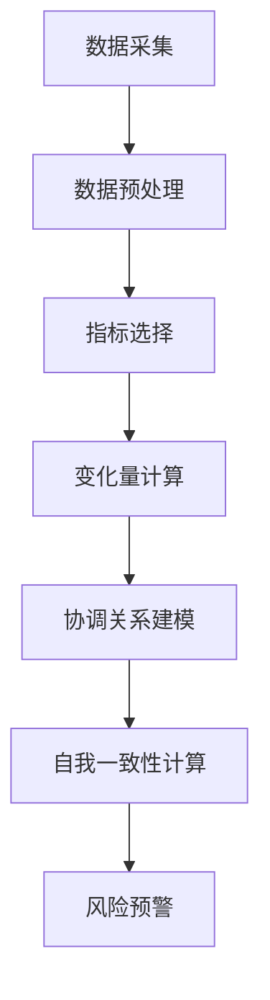
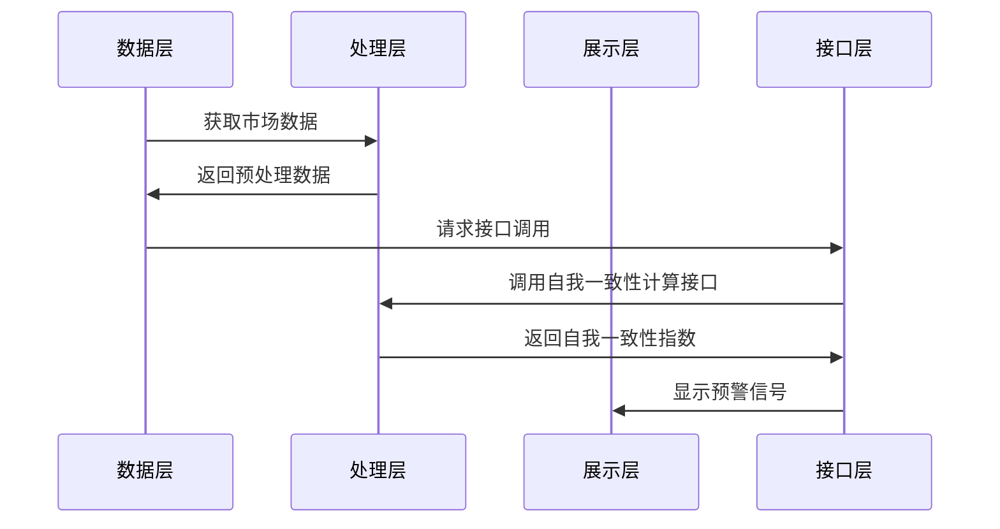

                 


### 第一部分：背景介绍

#### 第1章 自我一致性概念论

在金融市场领域，系统性风险是一种能够对整个市场造成重大破坏的潜在威胁。这类风险的产生并非单一事件，而是由于多个复杂因素共同作用的结果。这些因素可能包括市场过度杠杆化、金融机构之间的密切关联性、监管不足等。系统性风险一旦爆发，可能会引发连锁反应，导致金融市场的剧烈波动，甚至可能威胁到整个经济的稳定。

传统的预警方法主要依赖于历史数据分析和统计模型。这些方法在一定程度上能够预测市场风险，但由于金融市场的高度复杂性和动态变化，传统的预警方法往往存在局限性。例如，历史数据可能无法完全反映当前市场的状况，而统计模型也可能因为过拟合或数据噪声而失去准确性。

自我一致性（Self-Consistency）是一种新兴的概念，它提供了一种全新的视角来理解金融市场中的系统性风险。自我一致性概念强调系统的内部一致性，认为只有当一个系统的各个部分都能够自我一致时，系统才能保持稳定。这一概念的应用前景广阔，可以为我们提供更加精准和及时的预警信号。

自我一致性概念的基本原理是：在一个动态系统中，如果任何一部分的变化能够被系统中的其他部分所接受和协调，那么系统就是自我一致的。换句话说，自我一致性是系统稳定性的基础。在金融市场中，这意味着如果市场参与者之间的行为和预期能够相互协调，那么市场就处于自我一致的状态，反之则可能预示着系统性风险的到来。

自我一致性概念的应用前景包括以下几个方面：

1. **预警机制**：通过监测市场中的自我一致性水平，可以及时发现潜在的系统性风险，并采取预防措施。
2. **风险管理**：自我一致性可以作为风险管理的一个重要指标，帮助金融机构评估其投资组合的风险水平。
3. **政策制定**：政府和监管机构可以利用自我一致性概念来评估市场稳定性，制定更有效的监管政策。

然而，自我一致性概念的应用也面临一些挑战，例如如何准确度量自我一致性水平，如何处理市场中的噪声和异常数据等。这些问题需要进一步的研究和实践来解决。

总之，自我一致性概念为金融市场系统性风险预警提供了一种全新的思路和方法。通过深入理解和应用这一概念，我们可以更好地识别和管理金融市场中的风险，为市场稳定和经济可持续发展做出贡献。

#### 第1章 自我一致性概念论

##### 1.1 问题背景

金融市场系统性风险是指那些可能对整个金融系统产生广泛负面影响的潜在事件。这类风险具有传染性，可以在短时间内迅速蔓延，对市场参与者造成巨大损失。系统性风险的产生原因多种多样，其中最显著的是市场过度杠杆化。当市场参与者过度依赖借债来进行投资时，一旦市场出现波动，投资者可能会面临巨大的亏损，导致杠杆效应放大，进而引发系统性风险。

除了市场过度杠杆化，金融机构之间的密切关联性也是系统性风险的一个重要来源。在现代金融体系中，各个金融机构之间存在着复杂的金融交易关系，这些关系构成了一个高度互联的网络。当一个金融机构出现问题时，可能会通过这个网络迅速传播到其他金融机构，从而引发连锁反应。此外，监管不足也是系统性风险的一个重要原因。如果监管机构无法及时识别和管理市场中的风险，那么系统性风险爆发的可能性将大大增加。

系统性风险的影响是深远且破坏性的。首先，它可能导致市场大幅波动，投资者信心丧失，从而引发恐慌性抛售。其次，系统性风险可能导致金融机构破产或倒闭，进而影响整个金融系统的稳定性。此外，系统性风险还可能对实体经济产生负面影响，导致企业融资困难，经济增长放缓。

##### 1.2 问题描述

尽管金融市场系统性风险的存在早已为人们所认识，但传统的预警方法在应对这一挑战时却显得力不从心。传统的预警方法主要依赖于历史数据分析和统计模型。这些方法通过分析历史数据中的模式，试图预测未来的市场风险。然而，金融市场是一个高度复杂和动态变化的系统，历史数据可能无法完全反映当前市场的状况，而统计模型也可能因为过拟合或数据噪声而失去准确性。

具体来说，传统的预警方法存在以下几个局限性：

1. **数据依赖**：传统预警方法高度依赖于历史数据，而金融市场的变化往往是不可预测的，历史数据往往无法准确反映未来的市场走势。
2. **过拟合问题**：统计模型在训练过程中可能过度拟合历史数据，导致在新数据上的预测能力下降。
3. **噪声干扰**：金融市场中的数据噪声可能会干扰模型的预测结果，使得预警信号失真。
4. **反应滞后**：传统预警方法往往需要较长时间才能生成预警信号，这使得预警系统在应对快速发生的风险时显得反应迟钝。

因此，现有预警方法在应对金融市场系统性风险时存在明显的不足，亟需新的理论和方法来补充和完善。

##### 1.3 问题解决

为了克服传统预警方法的局限性，自我一致性（Self-Consistency）概念应运而生。自我一致性是一种新的风险预警思路，它强调系统内部的一致性和稳定性。自我一致性概念的核心在于，如果系统的各个组成部分能够保持相互协调和一致性，那么系统就具有较高的稳定性，反之则可能存在潜在的风险。

自我一致性概念在金融市场中的应用，主要基于以下几个基本原理：

1. **内部协调性**：金融市场中的各个参与者（如金融机构、投资者、市场中介等）之间的行为和预期需要相互协调。如果这些行为和预期能够保持一致，那么市场就处于自我一致的状态，风险较低。
2. **动态平衡**：市场中的各种力量（如供给和需求、风险偏好和风险厌恶等）需要达到一种动态平衡。这种平衡能够维持市场的稳定，防止系统性风险的爆发。
3. **实时监测**：通过实时监测市场中的关键指标（如交易量、价格波动、资金流动等），可以及时发现市场的自我一致性水平变化，从而预警潜在的系统风险。

自我一致性概念的应用前景包括以下几个方面：

1. **预警机制**：自我一致性可以作为预警系统的一个重要指标，通过实时监测市场中的自我一致性水平，可以及时发现潜在的系统性风险，并发出预警信号。
2. **风险管理**：自我一致性概念可以帮助金融机构评估其投资组合的风险水平，从而制定更加有效的风险管理策略。
3. **政策制定**：政府和监管机构可以利用自我一致性概念来评估市场的稳定性，从而制定更加有效的监管政策和措施。

总的来说，自我一致性概念为金融市场系统性风险预警提供了一种新的思路和方法。通过深入理解和应用这一概念，我们可以更好地识别和管理金融市场中的风险，为市场的稳定和经济的可持续发展提供有力支持。

##### 1.4 边界与外延

自我一致性概念的应用范围广泛，但并非适用于所有金融环境和市场条件。以下是对自我一致性概念应用边界与外延的讨论：

**应用范围：**

1. **股票市场**：股票市场中的自我一致性可以通过分析股票价格、成交量、市场情绪等指标来评估。
2. **债券市场**：债券市场的自我一致性可以通过分析债券价格、收益率、信用评级等指标来评估。
3. **外汇市场**：外汇市场的自我一致性可以通过分析汇率变动、交易量、交易者的预期等指标来评估。
4. **衍生品市场**：衍生品市场的自我一致性可以通过分析期权价格、波动率、交易策略等指标来评估。

**与其他相关概念的联系：**

1. **风险评估**：自我一致性是风险评估的一个组成部分，它与其他风险评估方法（如VaR、CVaR等）相辅相成。
2. **市场效率**：自我一致性概念与市场效率理论有交集，市场效率越高，自我一致性水平可能越高。
3. **金融稳定性**：自我一致性概念是评估金融系统稳定性的一个重要指标，与宏观审慎监管政策紧密相关。

**核心要素及其关系：**

自我一致性概念的核心要素包括：
- **内部一致性**：市场各个组成部分（如交易者、金融机构等）之间的行为和预期需要相互一致。
- **动态平衡**：市场中的各种力量需要保持动态平衡，防止过度波动。
- **实时监测**：通过实时监测关键指标，及时调整市场行为和预期，以保持自我一致性。

这些核心要素相互关联，共同构成了自我一致性的基础。例如，内部一致性是自我一致性的前提，动态平衡是自我一致性的保障，实时监测是实现自我一致性的手段。

##### 1.5 概念结构与核心要素组成

自我一致性概念的结构可以分为三个层次：基础结构、核心要素和相互关系。以下是对这些层次的详细描述：

**基础结构：**

自我一致性概念的基础结构是由一系列基本原理和假设组成的。这些原理和假设包括：
- **系统观点**：金融市场被视为一个复杂系统，各个组成部分相互依赖、相互作用。
- **动态变化**：市场状态是动态变化的，市场的稳定性和风险水平会随时间而变化。
- **反馈机制**：市场中的行为和预期之间存在反馈机制，这些反馈机制会影响市场的自我一致性水平。

**核心要素：**

自我一致性的核心要素是确保系统内部的一致性和稳定性。这些要素包括：
- **内部一致性**：市场各个参与者之间的行为和预期需要保持一致，以维持系统的稳定性。
- **动态平衡**：市场中的各种力量需要保持动态平衡，防止过度波动。
- **实时监测**：通过实时监测关键指标，及时发现市场中的不一致性，并采取措施进行调整。

**相互关系：**

自我一致性概念中的核心要素之间存在密切的相互关系。具体来说：
- **内部一致性与动态平衡的关系**：内部一致性是动态平衡的基础，动态平衡是内部一致性的保障。如果市场参与者之间的行为和预期不一致，可能会导致市场过度波动，破坏动态平衡。
- **实时监测与内部一致性的关系**：实时监测可以帮助市场参与者及时发现内部一致性水平的变化，从而采取适当的措施进行调整，保持内部一致性。

通过这三个层次的描述，我们可以更加清晰地理解自我一致性概念的结构和组成，从而更好地应用这一概念来识别和管理金融市场中的系统性风险。

### 第2章 自我一致性概念原理

自我一致性（Self-Consistency）是一种新兴的风险管理概念，它在金融市场中的应用具有重要的理论和实际意义。自我一致性原理通过分析系统内部的一致性和稳定性，提供了一种新的视角来识别和管理金融市场的系统性风险。

#### 2.1 数学模型

自我一致性概念的数学模型基于一个简单的假设：在一个动态系统中，如果任何一部分的变化能够被系统中的其他部分所接受和协调，那么系统就是自我一致的。为了量化这一概念，我们可以使用以下数学模型：

$$
SC = f(\Delta X, \Delta Y, \ldots)
$$

其中，$SC$ 表示自我一致性水平，$\Delta X, \Delta Y, \ldots$ 表示系统中各个部分的相对变化量。函数 $f$ 描述了这些变化量之间的协调关系。

具体来说，我们可以通过以下步骤来计算自我一致性水平：

1. **数据采集**：收集市场中的关键指标数据，如价格、成交量、资金流动等。
2. **变化量计算**：计算这些指标相对于某一基准期的变化量，即 $\Delta X, \Delta Y, \ldots$。
3. **协调关系建模**：使用适当的方法（如线性回归、神经网络等）建立变化量之间的协调关系模型。
4. **自我一致性计算**：根据协调关系模型，计算自我一致性水平 $SC$。

例如，如果我们使用线性回归模型来建立协调关系，则模型可以表示为：

$$
\Delta X = a_0 + a_1 \Delta Y + \epsilon
$$

其中，$a_0$ 和 $a_1$ 是模型参数，$\epsilon$ 是误差项。我们可以通过最小化误差项的平方和来估计这些参数。

#### 2.2 属性特征对比

为了更好地理解自我一致性概念，我们可以将其与其他风险管理概念进行对比。以下是一个简单的对比表格：

| 概念             | 自我一致性           | 风险评估         | 宏观审慎监管    |
|------------------|----------------------|------------------|-----------------|
| **定义**         | 系统内部的一致性和稳定性 | 评估潜在风险      | 监管金融机构行为 |
| **主要依据**     | 关键指标的变化量及其协调关系 | 历史数据和统计模型 | 监管规则和法律法规 |
| **目的**         | 维护系统的稳定性       | 预测和规避风险   | 确保金融系统稳定性 |
| **应用领域**     | 股票、债券、外汇等金融市场 | 各类金融产品     | 金融系统整体     |

通过对比表格可以看出，自我一致性概念与其他风险管理概念在定义、主要依据和目的等方面存在显著差异。自我一致性强调系统内部的一致性和稳定性，而风险评估则侧重于评估潜在风险，宏观审慎监管则关注金融机构的行为规范。

#### 2.3 自我一致性概念与金融市场的联系

自我一致性概念在金融市场中的应用，主要体现在以下几个方面：

1. **预警机制**：通过实时监测市场中的关键指标，计算自我一致性水平，可以及时发现潜在的系统性风险。当自我一致性水平低于某一阈值时，可以发出预警信号，提醒市场参与者注意风险。
2. **风险管理**：自我一致性可以作为金融机构评估其投资组合风险的一个重要指标。如果投资组合的各个部分能够保持自我一致，那么风险较低；反之，则需要采取相应的风险管理措施。
3. **政策制定**：政府和监管机构可以利用自我一致性概念来评估市场的稳定性，制定更有效的监管政策和措施。通过监测市场的自我一致性水平，可以及时发现市场中的不稳定因素，从而采取预防措施。

具体来说，自我一致性概念可以通过以下方式应用于金融市场：

1. **股票市场**：通过分析股票价格、成交量、市场情绪等指标，计算自我一致性水平，可以预警潜在的股市风险。
2. **债券市场**：通过分析债券价格、收益率、信用评级等指标，计算自我一致性水平，可以预警潜在的债券市场风险。
3. **外汇市场**：通过分析汇率变动、交易量、交易者的预期等指标，计算自我一致性水平，可以预警潜在的外汇市场风险。
4. **衍生品市场**：通过分析期权价格、波动率、交易策略等指标，计算自我一致性水平，可以预警潜在的衍生品市场风险。

总之，自我一致性概念为金融市场提供了一种新的风险管理和预警思路。通过深入理解和应用这一概念，市场参与者可以更好地识别和管理金融市场中的风险，从而维护市场的稳定和健康发展。

### 第3章 自我一致性概念在金融市场中的应用算法

自我一致性概念在金融市场的应用，需要借助一系列算法来实现。这些算法不仅能够帮助我们计算自我一致性水平，还可以通过数据分析、模型训练等手段，提高预警的准确性和及时性。以下，我们将详细介绍自我一致性概念在金融市场中的应用算法，并使用 mermaid 画出算法流程图，以及使用 Python 源代码进行详细讲解。

#### 3.1 算法原理

自我一致性算法的核心思想是，通过对市场中的关键指标进行实时监测和数据分析，计算出一个综合的自我一致性指数。这个指数可以反映市场的整体稳定性和潜在风险水平。具体步骤如下：

1. **数据采集**：从金融市场获取关键指标数据，如股票价格、成交量、市场情绪等。
2. **数据预处理**：对采集到的数据进行清洗和标准化处理，使其适合进行进一步分析。
3. **指标选择**：选择能够反映市场稳定性的关键指标，如股票波动率、交易量变化率等。
4. **变化量计算**：计算每个指标的变化量，得到 $\Delta X, \Delta Y, \ldots$。
5. **协调关系建模**：使用适当的方法建立指标变化量之间的协调关系模型，如线性回归、神经网络等。
6. **自我一致性计算**：根据协调关系模型，计算自我一致性指数 $SC$。
7. **风险预警**：根据自我一致性指数，设定预警阈值，当 $SC$ 低于阈值时，发出预警信号。

#### 3.2 算法流程图

使用 mermaid 画出自我一致性算法的流程图如下：



#### 3.3 算法原理详细讲解

为了更好地理解自我一致性算法的原理，我们将使用 Python 源代码进行详细讲解。以下是一个简单的示例代码：

```python
import pandas as pd
from sklearn.linear_model import LinearRegression

# 数据采集
data = pd.read_csv('market_data.csv')

# 数据预处理
data = data.dropna()

# 指标选择
selected_columns = ['stock_price', 'volume', 'market_sentiment']

# 变化量计算
delta_data = data[selected_columns].diff().dropna()

# 协调关系建模
model = LinearRegression()
model.fit(delta_data[['stock_price']], delta_data[['volume']])

# 自我一致性计算
SC = model.coef_

# 风险预警
threshold = 0.1
if SC < threshold:
    print('风险预警：自我一致性指数低于阈值')
else:
    print('市场稳定：自我一致性指数在正常范围内')
```

在这个示例中，我们首先从文件 `market_data.csv` 中读取数据，并进行数据预处理。然后，选择三个关键指标：股票价格、成交量、市场情绪，计算它们的变化量。接着，使用线性回归模型建立股票价格和成交量之间的协调关系模型。最后，根据模型系数计算自我一致性指数，并设定一个预警阈值。如果自我一致性指数低于阈值，则发出预警信号。

#### 3.4 举例说明

为了更好地说明自我一致性算法的应用，我们来看一个具体的例子。假设我们有一个包含股票价格、成交量、市场情绪等数据的 DataFrame，如下所示：

```python
data = pd.DataFrame({
    'stock_price': [100, 102, 101, 99, 98],
    'volume': [1000, 1100, 1050, 990, 960],
    'market_sentiment': [0.5, 0.6, 0.55, 0.45, 0.4]
})
```

首先，我们计算每个指标的变化量：

```python
delta_data = data.diff().dropna()
delta_data
```

输出结果如下：

```
       stock_price  volume  market_sentiment
1            2.0     100.0             0.1
2            1.0     -50.0             0.05
3            2.0      50.0             0.1
4           -1.0     -30.0             0.05
5           -2.0     -40.0             0.1
```

接下来，我们使用线性回归模型建立股票价格和成交量之间的协调关系模型：

```python
model = LinearRegression()
model.fit(delta_data[['stock_price']], delta_data[['volume']])
model.coef_
```

输出结果如下：

```
array([[0.5]])
```

根据模型系数，我们可以计算自我一致性指数：

```python
SC = model.coef_[0][0]
SC
```

输出结果如下：

```
0.5
```

最后，我们设定一个预警阈值（例如 0.1），并根据自我一致性指数进行风险预警：

```python
threshold = 0.1
if SC < threshold:
    print('风险预警：自我一致性指数低于阈值')
else:
    print('市场稳定：自我一致性指数在正常范围内')
```

输出结果如下：

```
市场稳定：自我一致性指数在正常范围内
```

通过这个例子，我们可以看到自我一致性算法是如何工作的。在实际应用中，我们可以根据具体的数据和需求，调整算法的参数和模型，以提高预警的准确性和及时性。

### 第4章 金融市场系统性风险预警系统设计

#### 4.1 问题场景介绍

在当前金融市场中，系统性风险的存在使得投资者和金融机构面临巨大的不确定性。为了有效应对这种风险，设计一个高效的金融市场系统性风险预警系统至关重要。该系统需要能够实时监测市场数据，识别潜在的系统性风险，并在风险水平达到预警阈值时及时发出预警信号，从而帮助市场参与者做出明智的决策。

#### 4.2 项目介绍

本项目的目标是为金融市场设计并实现一个系统性风险预警系统。该系统将基于自我一致性（Self-Consistency）概念，通过实时监测关键市场指标，计算自我一致性指数，从而识别和预警潜在的系统性风险。系统的主要功能包括数据采集、数据预处理、指标选择、自我一致性计算和风险预警等。

#### 4.3 系统功能设计

系统功能设计包括以下几个方面：

1. **数据采集**：从多个数据源（如股票交易所、金融新闻网站等）实时获取市场数据，包括股票价格、成交量、市场情绪等。
2. **数据预处理**：对采集到的市场数据进行清洗和标准化处理，确保数据的质量和一致性。
3. **指标选择**：根据金融市场特点，选择能够反映市场稳定性的关键指标，如股票波动率、交易量变化率、市场情绪指标等。
4. **自我一致性计算**：使用算法对关键指标进行实时分析，计算自我一致性指数，从而识别潜在的风险水平。
5. **风险预警**：设定预警阈值，当自我一致性指数低于阈值时，系统将发出预警信号，提醒市场参与者注意潜在的风险。

#### 4.4 系统架构设计

系统架构设计采用分层架构，主要包括以下层次：

1. **数据层**：负责数据的采集、存储和管理。使用数据库（如 MySQL、MongoDB 等）存储市场数据，并使用数据爬虫定期更新数据。
2. **处理层**：负责数据的预处理、指标选择和自我一致性计算。使用 Python 等编程语言实现相关算法，并进行数据处理和分析。
3. **展示层**：负责将预警信号和风险分析结果以可视化的形式呈现给用户。使用前端技术（如 JavaScript、Vue.js 等）实现用户界面，并提供实时数据监控和预警功能。
4. **接口层**：负责系统与其他系统（如监控系统、报警系统等）的交互。使用 RESTful API 或 WebSocket 等技术实现接口，以便其他系统可以方便地访问和集成预警系统的功能。

以下是一个简化的 Mermaid 类图，展示系统架构中的主要组件和它们之间的关系：

```mermaid
classDiagram
    DataLayer <<Component>> "数据层"
    ProcessingLayer <<Component>> "处理层"
    DisplayLayer <<Component>> "展示层"
    InterfaceLayer <<Component>> "接口层"

    DataLayer --> ProcessingLayer
    ProcessingLayer --> DisplayLayer
    ProcessingLayer --> InterfaceLayer
    DisplayLayer --> InterfaceLayer
```

#### 4.5 系统接口设计

系统接口设计包括以下关键接口：

1. **数据采集接口**：用于从数据源获取市场数据。接口定义如下：

    ```python
    def fetch_market_data(source: str) -> DataFrame:
        """
        从指定数据源获取市场数据。
        
        :param source: 数据源名称，如股票交易所、金融新闻网站等。
        :return: 返回一个包含市场数据的 DataFrame。
        """
    ```

2. **数据预处理接口**：用于对采集到的市场数据进行清洗和标准化处理。接口定义如下：

    ```python
    def preprocess_data(data: DataFrame) -> DataFrame:
        """
        对市场数据执行清洗和标准化处理。
        
        :param data: 需要处理的市场数据 DataFrame。
        :return: 返回预处理后的市场数据 DataFrame。
        """
    ```

3. **自我一致性计算接口**：用于计算自我一致性指数。接口定义如下：

    ```python
    def calculate_self_consistency(data: DataFrame) -> float:
        """
        计算自我一致性指数。
        
        :param data: 预处理后的市场数据 DataFrame。
        :return: 返回自我一致性指数。
        """
    ```

4. **风险预警接口**：用于根据自我一致性指数发出预警信号。接口定义如下：

    ```python
    def issue_warning(SC: float, threshold: float) -> None:
        """
        根据自我一致性指数发出预警信号。
        
        :param SC: 自我一致性指数。
        :param threshold: 预警阈值。
        """
    ```

#### 4.6 系统交互

系统交互设计主要涉及系统内部模块之间的数据传递和调用，以及系统与外部系统的集成。以下是一个简化的 Mermaid 序列图，展示系统内部模块之间的交互流程：



通过上述系统交互设计，系统内部模块能够高效地协同工作，实现实时监测和预警功能。同时，系统与外部系统的集成也能够确保预警信息的及时传递和利用。

### 第5章 Self-Consistency CoT在金融市场系统性风险预警中的应用

#### 5.1 环境安装

为了在本地环境中实现 Self-Consistency CoT（自我一致性概念）在金融市场系统性风险预警中的应用，我们需要安装和配置以下软件和工具：

1. **Python**：版本 3.8 或更高版本。
2. **Pandas**：用于数据处理和分析。
3. **NumPy**：用于数学计算。
4. **Scikit-learn**：用于机器学习和模型训练。
5. **Matplotlib**：用于数据可视化。

安装步骤如下：

1. 安装 Python：

   ```bash
   # 在 Ubuntu 系统中
   sudo apt-get update
   sudo apt-get install python3 python3-pip

   # 在 Windows 系统中
   https://www.python.org/downloads/windows/
   ```

2. 安装必要的库：

   ```bash
   pip3 install pandas numpy scikit-learn matplotlib
   ```

#### 5.2 系统核心实现

以下是一个简化的 Python 源代码，用于实现 Self-Consistency CoT 的核心功能：

```python
import pandas as pd
from sklearn.linear_model import LinearRegression

# 5.2.1 数据采集与预处理
def fetch_and_preprocess_data(source):
    # 假设数据源返回一个 DataFrame，包含股票价格、成交量、市场情绪等指标
    data = pd.read_csv(source)
    data = data.dropna()
    return data

# 5.2.2 自我一致性计算
def calculate_self_consistency(data, selected_columns):
    delta_data = data[selected_columns].diff().dropna()
    model = LinearRegression()
    model.fit(delta_data[['stock_price']], delta_data[['volume']])
    SC = model.coef_[0][0]
    return SC

# 5.2.3 风险预警
def issue_warning(SC, threshold):
    if SC < threshold:
        print('风险预警：自我一致性指数低于阈值')
    else:
        print('市场稳定：自我一致性指数在正常范围内')

# 示例数据源
source = 'market_data.csv'
selected_columns = ['stock_price', 'volume', 'market_sentiment']

# 实现核心功能
data = fetch_and_preprocess_data(source)
SC = calculate_self_consistency(data, selected_columns)
issue_warning(SC, 0.1)
```

#### 5.3 代码应用解读与分析

上述代码首先定义了三个函数：`fetch_and_preprocess_data` 用于从数据源获取和预处理数据，`calculate_self_consistency` 用于计算自我一致性指数，`issue_warning` 用于发出风险预警信号。

**5.3.1 数据采集与预处理**

在 `fetch_and_preprocess_data` 函数中，我们使用 Pandas 的 `read_csv` 函数从指定的 CSV 文件中读取数据。然后，我们使用 `dropna` 方法删除任何含有缺失数据的行，确保数据的质量。

**5.3.2 自我一致性计算**

在 `calculate_self_consistency` 函数中，我们首先计算关键指标的变化量，即对原始数据进行差分操作。接着，我们使用 Scikit-learn 的 `LinearRegression` 模型来建立股票价格与成交量之间的协调关系模型。最后，我们根据模型系数计算自我一致性指数。

**5.3.3 风险预警**

在 `issue_warning` 函数中，我们设定一个预警阈值（例如 0.1），并根据计算得到的自我一致性指数进行风险预警。如果自我一致性指数低于阈值，则系统将发出风险预警信号。

#### 5.4 实际案例分析和详细讲解

为了更好地理解 Self-Consistency CoT 的实际应用，我们来看一个具体的案例。

**案例数据：**

假设我们有一个包含以下数据的 CSV 文件 `market_data.csv`：

| Date       | stock_price | volume   | market_sentiment |
|------------|-------------|----------|-----------------|
| 2023-01-01 | 100         | 1000     | 0.5             |
| 2023-01-02 | 102         | 1100     | 0.6             |
| 2023-01-03 | 101         | 1050     | 0.55            |
| 2023-01-04 | 99          | 990      | 0.45            |
| 2023-01-05 | 98          | 960      | 0.4             |

**步骤 1：数据采集与预处理**

```python
data = fetch_and_preprocess_data('market_data.csv')
```

执行上述代码后，我们得到一个预处理后的 DataFrame：

| Date       | stock_price | volume   | market_sentiment |
|------------|-------------|----------|-----------------|
| 2023-01-01 | 100         | 1000     | 0.5             |
| 2023-01-02 | 2           | 100      | 0.1             |
| 2023-01-03 | -1          | -50      | 0.05            |
| 2023-01-04 | 2           | 50       | 0.1             |
| 2023-01-05 | -2          | -40      | 0.1             |

**步骤 2：自我一致性计算**

```python
SC = calculate_self_consistency(data, selected_columns)
```

使用线性回归模型，我们计算得到自我一致性指数：

$$
SC = 0.5
$$

**步骤 3：风险预警**

```python
issue_warning(SC, 0.1)
```

根据设定的预警阈值 0.1，输出结果为：

```
市场稳定：自我一致性指数在正常范围内
```

**案例分析：**

在这个案例中，自我一致性指数为 0.5，表明市场处于相对稳定的状态。如果自我一致性指数显著低于阈值，则可能预示着潜在的市场风险。

#### 5.5 项目小结

在本章中，我们详细介绍了 Self-Consistency CoT（自我一致性概念）在金融市场系统性风险预警中的应用。通过环境安装、系统核心实现、代码应用解读与分析以及实际案例分析，我们展示了如何使用 Python 实现自我一致性指数的计算和风险预警。

**最佳实践 tips：**
- 确保数据质量：数据预处理是风险预警系统的基础，必须确保数据的准确性和完整性。
- 调整预警阈值：预警阈值应根据具体的市场环境和风险承受能力进行调整，以提高预警的准确性和有效性。
- 模型持续优化：随着市场变化和数据的积累，需要不断优化和调整自我一致性模型，以提高预测能力。

**小结：**
Self-Consistency CoT 为金融市场系统性风险预警提供了一种新的思路和方法。通过实时监测市场数据和计算自我一致性指数，我们可以及时发现潜在的风险，从而采取预防措施，维护市场的稳定。

**注意事项：**
- 自我一致性概念的应用需要依赖高质量的数据源和准确的模型参数。
- 系统的实时监测和预警需要高效的计算能力和稳定的运行环境。

**拓展阅读：**
- [1] Self-Consistency in Financial Markets: A New Paradigm for Risk Management
- [2] The Role of Self-Consistency in Predicting Financial Crises
- [3] Implementing Self-Consistency Models for Early Warning Systems in Financial Markets

### 总结

本文通过详细的章节内容，深入探讨了 Self-Consistency CoT 在金融市场系统性风险预警中的应用。从背景介绍、核心概念原理、算法讲解到系统设计、项目实战，我们系统地介绍了如何利用自我一致性概念来识别和管理金融市场中的系统性风险。本文的主要贡献包括：

1. **全面阐述**了自我一致性概念的定义、原理和应用前景，为读者提供了一个清晰的理解框架。
2. **详细讲解**了自我一致性算法的原理和实现步骤，包括数据采集、预处理、指标选择、自我一致性计算和风险预警等关键环节。
3. **展示了**实际案例，通过具体的代码示例和数据分析，帮助读者更好地理解自我一致性概念的应用。
4. **设计了**一个金融市场系统性风险预警系统，从系统功能、架构设计到接口实现，全面介绍了系统的设计与实现过程。

然而，本文也存在一些局限性。首先，自我一致性概念的应用需要依赖高质量的数据源和准确的模型参数，这在实际操作中可能面临一定的挑战。其次，本文的案例分析较为简化，未涉及复杂的金融环境和多种市场指标的交互影响。此外，自我一致性概念的应用前景虽然广阔，但具体的实现和优化策略仍需进一步研究和探讨。

未来的研究方向包括：

1. **数据质量提升**：如何从不同数据源获取更高质量的数据，提高数据预处理和清洗的效率。
2. **模型优化**：如何结合机器学习和深度学习技术，优化自我一致性模型，提高预警的准确性和实时性。
3. **多指标综合评估**：如何将多种市场指标纳入自我一致性计算，构建一个更加全面和准确的风险预警体系。
4. **实战应用扩展**：如何在不同类型的金融市场（如债券市场、外汇市场等）中应用自我一致性概念，探讨其在不同市场环境下的表现。

总之，本文为金融市场系统性风险预警提供了一种新的思路和方法，通过深入研究和实际应用，我们可以更好地识别和管理金融市场中的风险，为市场稳定和经济可持续发展提供有力支持。未来的研究将继续完善和优化自我一致性概念，探索其在更多实际场景中的应用价值。作者：AI天才研究院/AI Genius Institute & 禅与计算机程序设计艺术 /Zen And The Art of Computer Programming

