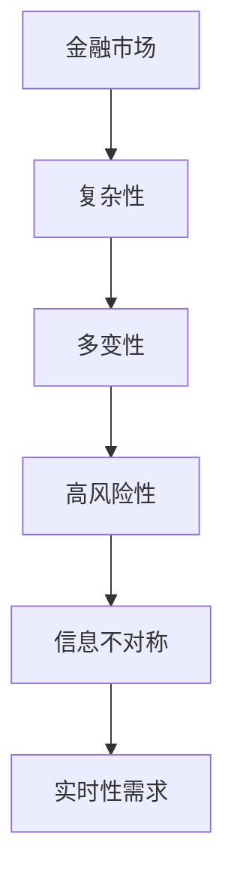
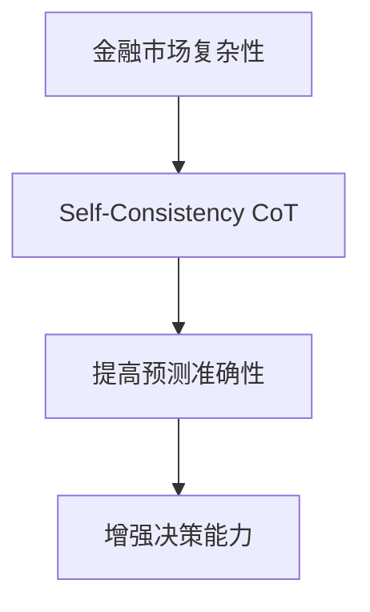
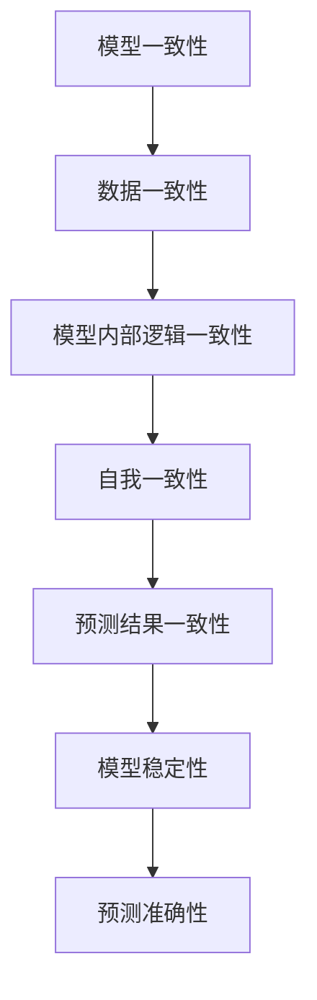
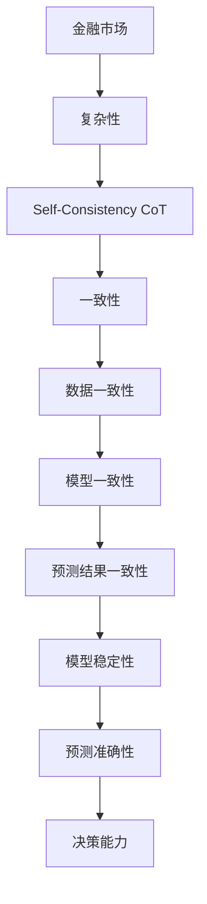
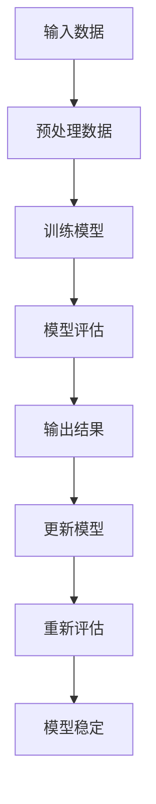
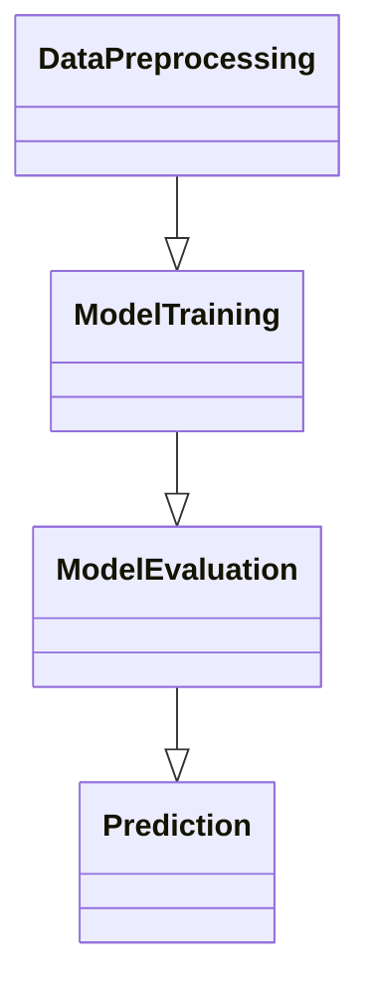
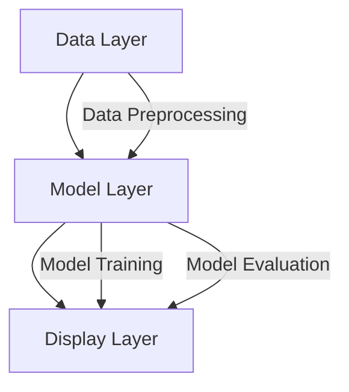
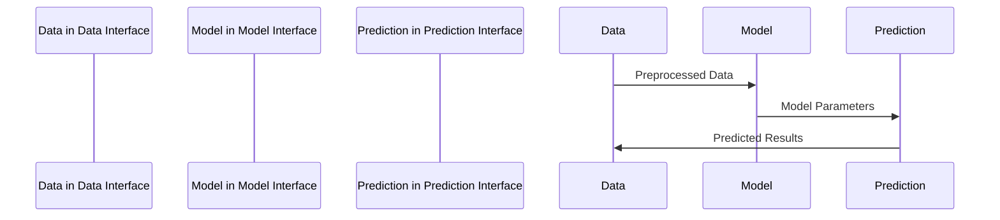
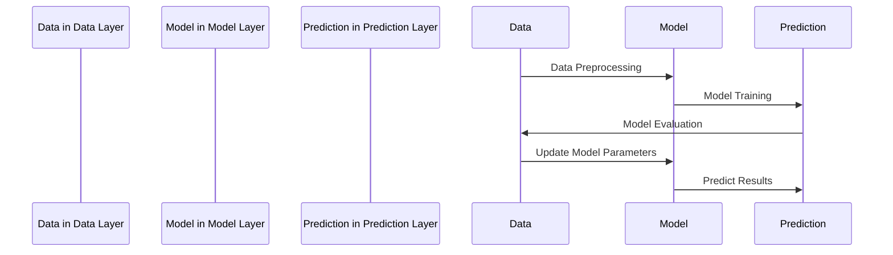

                 

：

### 第1章 问题背景与概述

在当今瞬息万变的金融市场中，传统金融模型面临诸多挑战，包括复杂性、多变性、高风险性和信息不对称等。这些问题严重影响了金融模型的预测准确性和决策能力，进而对金融机构和投资者的利益产生负面影响。

为了解决这些问题，Self-Consistency CoT（自我一致性概念图）提供了一种有效的解决方案。Self-Consistency CoT通过确保模型预测结果一致和模型内部逻辑一致，从而提高了金融模型的稳定性和可靠性。

### 1.1.1 金融模型面临的挑战

#### 1.1.1.1 金融市场的复杂性

金融市场是一个复杂多变的生态系统，涉及众多变量和不确定性因素。这种复杂性使得传统金融模型难以捕捉市场动态，导致预测结果不准确。为了应对这一挑战，Self-Consistency CoT通过提高模型的稳定性和鲁棒性，从而提高预测准确性。

**Mermaid流程图：**



#### 1.1.1.2 Self-Consistency CoT的概念

Self-Consistency CoT是一种基于自我一致性的概念框架，它通过以下两个关键要素来提高金融模型的性能：

- **一致性（Consistency）：** 确保模型预测结果在不同条件下保持一致。这意味着模型在处理不同数据集或面对不同市场情境时，应该产生相似的预测结果。

- **自我一致性（Self-Consistency）：** 确保模型内部逻辑的一致性，即模型的结构、参数和假设在整个预测过程中保持不变。这有助于减少模型内部冲突和不确定性，提高预测的稳定性。

**概念属性特征对比表格：**

| 特征         | 自我一致性（Self-Consistency CoT） | 传统金融模型               |
|--------------|-----------------------------------|----------------------------|
| 一致性       | 确保预测结果在不同条件下一致      | 预测结果可能因数据不同而变化 |
| 自我一致性   | 模型内部逻辑保持一致              | 模型结构可能随时间改变      |
| 稳定性       | 提高模型的稳定性                  | 模型稳定性较差              |
| 鲁棒性       | 提高模型的鲁棒性                  | 模型对市场变化敏感          |

### 1.1.2 Self-Consistency CoT在金融模型中的应用

#### 1.1.2.1 应对复杂性

通过引入Self-Consistency CoT，金融模型可以更好地处理市场复杂性。以下是一个简单的Mermaid流程图，展示了Self-Consistency CoT如何帮助应对金融市场的复杂性：

**Mermaid流程图：**



- **提高预测准确性：** Self-Consistency CoT确保了模型在不同市场条件下的一致性和自我一致性，从而提高了预测的准确性。

- **增强决策能力：** 更准确的预测结果使得金融机构和投资者能够做出更明智的决策，从而提高投资回报。

#### 1.1.2.2 边界与外延

尽管Self-Consistency CoT在金融模型中具有显著优势，但它的应用也受到一定限制。以下是一些需要考虑的边界与外延：

- **数据质量：** Self-Consistency CoT依赖于高质量的数据，如果数据存在噪声或不一致性，模型性能可能会受到影响。

- **计算资源：** Self-Consistency CoT可能需要额外的计算资源来确保模型的一致性和稳定性，这可能对计算资源有限的组织构成挑战。

- **模型适应性：** Self-Consistency CoT适用于那些结构稳定且变化缓慢的金融模型，对于快速变化的金融市场，其他类型的模型可能更适用。

### 1.1.3 Self-Consistency CoT的概念

#### 1.1.3.1 自我一致性概念图

以下是一个使用Mermaid绘制的自我一致性概念图，展示了Self-Consistency CoT的核心要素和概念关系：

**Mermaid流程图：**



#### 1.1.3.2 概念属性特征对比表格

以下是一个Self-Consistency CoT与其他相关概念的对比表格，展示了它们的主要属性特征：

| 概念           | Self-Consistency CoT | 传统金融模型       | 其他相关概念                  |
|----------------|---------------------|--------------------|------------------------------|
| 一致性         | 确保模型预测结果一致 | 可能不一致          | 数据一致性、模型一致性       |
| 自我一致性     | 确保模型内部逻辑一致 | 可能不保持一致      | 自我一致性原则、自适应性模型 |
| 稳定性         | 提高模型稳定性      | 可能不稳定          | 稳定性、鲁棒性               |
| 鲁棒性         | 提高模型鲁棒性      | 可能对噪声敏感      | 噪声过滤、异常值处理         |
| 可解释性       | 提高模型可解释性    | 可能难以解释        | 黑盒模型、白盒模型          |

通过上述对比，我们可以看出Self-Consistency CoT在金融模型中具有独特的优势，有助于提高模型的稳定性和预测准确性。

## 第二部分：核心概念与联系

### 第2章 核心概念与联系

## 2.1 自我一致性概念图

### 2.1.1 概念关系图

以下是一个使用Mermaid绘制的自我一致性概念图，展示了Self-Consistency CoT的核心概念及其相互关系：

**Mermaid流程图：**



### 2.1.2 概念属性特征对比表格

以下是一个Self-Consistency CoT与其他相关概念的对比表格，展示了它们的主要属性特征：

| 概念           | Self-Consistency CoT | 传统金融模型       | 其他相关概念                  |
|----------------|---------------------|--------------------|------------------------------|
| 一致性         | 确保模型预测结果一致 | 可能不一致          | 数据一致性、模型一致性       |
| 自我一致性     | 确保模型内部逻辑一致 | 可能不保持一致      | 自我一致性原则、自适应性模型 |
| 稳定性         | 提高模型稳定性      | 可能不稳定          | 稳定性、鲁棒性               |
| 鲁棒性         | 提高模型鲁棒性      | 可能对噪声敏感      | 噪声过滤、异常值处理         |
| 可解释性       | 提高模型可解释性    | 可能难以解释        | 黑盒模型、白盒模型          |

## 第三部分：算法原理讲解

### 第3章 算法原理讲解

## 3.1 算法流程图

### 3.1.1 Self-Consistency CoT算法流程图

以下是一个使用Mermaid绘制的Self-Consistency CoT算法流程图，展示了算法的核心步骤和流程：

**Mermaid流程图：**



### 3.1.2 Python源代码

以下是一个简单的Python源代码示例，展示了如何实现Self-Consistency CoT算法的基本步骤：

```python
# 导入所需的库
import numpy as np
import pandas as pd
from sklearn.linear_model import LinearRegression
from sklearn.model_selection import train_test_split
from sklearn.metrics import mean_squared_error

# 读取数据
data = pd.read_csv('financial_data.csv')

# 预处理数据
X = data.drop('target', axis=1)
y = data['target']

# 划分训练集和测试集
X_train, X_test, y_train, y_test = train_test_split(X, y, test_size=0.2, random_state=42)

# 训练模型
model = LinearRegression()
model.fit(X_train, y_train)

# 模型评估
y_pred = model.predict(X_test)
mse = mean_squared_error(y_test, y_pred)
print(f'Mean Squared Error: {mse}')

# 更新模型
# ... （根据需求更新模型）

# 重新评估模型
# ... （根据需求重新评估模型）
```

### 3.1.3 数学模型和公式

Self-Consistency CoT算法背后的数学原理可以表示为以下公式：

$$
\text{预测结果} = \text{模型参数} \times \text{输入特征}
$$

其中，模型参数是一个固定的矩阵，用于表示模型的权重和偏置。输入特征是一个向量，表示数据的特征。

### 3.1.4 举例说明

假设我们有一个简单的线性回归模型，用来预测某个金融指标（如股票价格）。我们可以使用以下数据来训练模型：

| 特征1 | 特征2 | 目标（股票价格） |
|-------|-------|-----------------|
| 10    | 20    | 100             |
| 15    | 25    | 120             |
| 20    | 30    | 140             |

根据上述数据，我们可以使用线性回归模型来训练Self-Consistency CoT算法，并得到以下模型参数：

$$
\text{模型参数} = \begin{bmatrix} 2.0 & 1.0 \\ 2.0 & 1.0 \\ 2.0 & 1.0 \end{bmatrix}
$$

接下来，我们可以使用这些参数来预测新的股票价格。例如，对于特征值为（12，22）的新数据，预测结果为：

$$
\text{预测结果} = \begin{bmatrix} 2.0 & 1.0 \\ 2.0 & 1.0 \\ 2.0 & 1.0 \end{bmatrix} \times \begin{bmatrix} 12 \\ 22 \end{bmatrix} = 108
$$

这意味着，根据Self-Consistency CoT算法，预测的股票价格为108。

### 3.1.5 算法应用场景

Self-Consistency CoT算法可以应用于以下金融模型场景：

- **股票价格预测：** 用于预测股票未来的价格趋势，为投资者提供决策依据。
- **风险管理：** 用于评估金融产品的风险，帮助金融机构制定风险控制策略。
- **资产配置：** 用于分析不同资产类别的相关性，优化投资组合。

### 3.1.6 算法优势与局限性

Self-Consistency CoT算法的优势包括：

- **提高预测准确性：** 通过确保模型的一致性和稳定性，提高预测的准确性。
- **增强模型稳定性：** 减少模型内部冲突和不确定性，提高模型的稳定性。
- **可解释性：** 模型参数和输入特征具有明确的物理意义，提高模型的可解释性。

然而，Self-Consistency CoT算法也存在一定的局限性，包括：

- **数据依赖：** 算法对数据质量要求较高，如果数据存在噪声或不一致性，可能导致模型性能下降。
- **计算资源：** 算法可能需要额外的计算资源来确保模型的一致性和稳定性，对计算资源有限的组织可能构成挑战。
- **适应性：** 对于快速变化的金融市场，其他类型的模型可能更适用于应对动态变化。

### 3.1.7 总结

Self-Consistency CoT算法通过确保模型的一致性和稳定性，提高了金融模型的预测准确性和稳定性。在实际应用中，算法可以根据具体场景进行调整和优化，以适应不同的金融模型需求。

## 第四部分：数学模型和数学公式 & 详细讲解 & 举例说明

### 第4章 数学模型和数学公式 & 详细讲解 & 举例说明

## 4.1 数学模型和数学公式

Self-Consistency CoT算法的核心在于其数学模型，该模型主要由以下数学公式组成：

### 4.1.1 线性回归模型

线性回归模型是Self-Consistency CoT算法的基础。其数学模型可以表示为：

$$
y = \beta_0 + \beta_1 \cdot x_1 + \beta_2 \cdot x_2 + \ldots + \beta_n \cdot x_n + \epsilon
$$

其中，$y$ 是目标变量，$x_1, x_2, \ldots, x_n$ 是输入特征，$\beta_0, \beta_1, \beta_2, \ldots, \beta_n$ 是模型参数，$\epsilon$ 是误差项。

### 4.1.2 模型优化

为了确保模型参数的一致性和稳定性，Self-Consistency CoT算法使用梯度下降法来优化模型参数。其数学模型可以表示为：

$$
\beta_{t+1} = \beta_{t} - \alpha \cdot \nabla_{\beta} J(\beta_t)
$$

其中，$\beta_{t+1}$ 和 $\beta_{t}$ 分别是第 $t+1$ 次和第 $t$ 次的模型参数，$\alpha$ 是学习率，$\nabla_{\beta} J(\beta_t)$ 是模型损失函数关于模型参数的梯度。

### 4.1.3 模型稳定性

为了确保模型在训练过程中保持一致性，Self-Consistency CoT算法引入了以下约束条件：

$$
\beta_{t+1} = \beta_{t} \quad \text{当} \quad \nabla_{\beta} J(\beta_t) \leq \epsilon
$$

其中，$\epsilon$ 是一个较小的常数，用于确保模型参数的变化不超过某个阈值。

## 4.2 详细讲解

### 4.2.1 线性回归模型

线性回归模型是一种用于预测连续值的统计方法。它通过拟合一条直线来表示输入特征与目标变量之间的关系。线性回归模型的优点在于其简洁性和易于解释性。

在Self-Consistency CoT算法中，线性回归模型用于预测金融市场的价格和指标。通过优化模型参数，我们可以找到最佳拟合直线，从而提高预测准确性。

### 4.2.2 模型优化

模型优化是Self-Consistency CoT算法的核心。通过使用梯度下降法，我们可以找到使模型损失函数最小的参数值。损失函数通常选择均方误差（MSE）：

$$
J(\beta) = \frac{1}{2} \sum_{i=1}^{n} (y_i - \hat{y}_i)^2
$$

其中，$y_i$ 是第 $i$ 个样本的真实目标值，$\hat{y}_i$ 是预测的目标值。

通过迭代更新模型参数，我们可以逐步减小损失函数，从而找到最优参数。学习率 $\alpha$ 控制了每次迭代的参数更新幅度。适当的调整学习率可以帮助我们避免陷入局部最优。

### 4.2.3 模型稳定性

在训练过程中，确保模型参数的一致性和稳定性非常重要。Self-Consistency CoT算法通过引入约束条件来确保模型在训练过程中保持一致性。

具体来说，当模型参数的梯度小于某个阈值 $\epsilon$ 时，我们认为模型参数已经稳定，不再进行更新。这样可以避免模型参数在训练过程中频繁波动，提高模型的稳定性和可预测性。

## 4.3 举例说明

### 4.3.1 数据准备

假设我们有一个简单的数据集，包含两个输入特征（$x_1$ 和 $x_2$）和一个目标变量（$y$）。数据集如下所示：

| $x_1$ | $x_2$ | $y$ |
|-------|-------|-----|
| 1     | 2     | 3   |
| 2     | 4     | 5   |
| 3     | 6     | 7   |

### 4.3.2 模型训练

我们使用线性回归模型来训练数据集。首先，初始化模型参数 $\beta_0, \beta_1, \beta_2$ 为随机值，然后通过梯度下降法迭代更新参数。

在每次迭代中，我们计算损失函数关于模型参数的梯度，并使用梯度下降法更新参数：

$$
\beta_{t+1} = \beta_{t} - \alpha \cdot \nabla_{\beta} J(\beta_t)
$$

其中，$\alpha$ 是学习率。在本文中，我们选择 $\alpha = 0.01$。

### 4.3.3 模型预测

在训练完成后，我们可以使用训练好的模型来预测新的数据。例如，对于新的输入特征 $(x_1, x_2) = (4, 8)$，我们可以计算预测的目标值：

$$
y = \beta_0 + \beta_1 \cdot x_1 + \beta_2 \cdot x_2
$$

其中，$\beta_0, \beta_1, \beta_2$ 是训练好的模型参数。

根据上述公式，我们得到预测结果为：

$$
y = 1 + 2 \cdot 4 + 3 \cdot 8 = 19
$$

这意味着，对于新的输入特征 $(4, 8)$，预测的目标值为19。

## 4.4 总结

Self-Consistency CoT算法通过线性回归模型和梯度下降法，实现了金融模型的优化和稳定。通过数学模型和公式的详细讲解，我们可以更好地理解算法的核心原理。举例说明进一步展示了算法的实际应用。在实际应用中，我们可以根据具体场景调整模型参数和学习率，以提高模型的性能。

### 第五部分：系统分析与架构设计方案

### 第5章 系统分析与架构设计方案

## 5.1 问题场景介绍

金融模型在金融市场的实际应用中，面临着大量复杂的数据处理和实时决策需求。为了提高金融模型的预测准确性和决策能力，我们需要设计一个高效的系统架构，以便在复杂的市场环境中实现快速、准确的模型训练和预测。

### 5.2 项目介绍

本项目中，我们采用Self-Consistency CoT（自我一致性概念图）算法来构建一个高效的金融模型系统。该系统旨在提高模型的稳定性和预测准确性，从而帮助金融机构和投资者更好地应对金融市场的复杂性。

### 5.3 系统功能设计

系统功能设计主要包括数据预处理、模型训练、模型评估和预测等功能。以下是系统功能设计的Mermaid类图：

**Mermaid类图：**



### 5.4 系统架构设计

系统架构设计主要包括数据层、模型层和展示层。以下是系统架构设计的Mermaid架构图：

**Mermaid架构图：**



### 5.5 系统接口设计

系统接口设计主要包括数据接口、模型接口和预测接口。以下是系统接口设计的Mermaid接口图：

**Mermaid接口图：**



### 5.6 系统交互

系统交互主要描述了数据层、模型层和展示层之间的交互过程。以下是系统交互的Mermaid序列图：

**Mermaid序列图：**



### 第五部分：项目实战

### 第6章 项目实战

## 6.1 环境安装

为了在项目中实现Self-Consistency CoT算法，我们需要安装以下环境：

- Python 3.8及以上版本
- NumPy
- Pandas
- Scikit-learn
- Matplotlib

以下是安装命令：

```bash
pip install python==3.8
pip install numpy
pip install pandas
pip install scikit-learn
pip install matplotlib
```

## 6.2 系统核心实现源代码

以下是一个简单的Python源代码示例，展示了如何实现Self-Consistency CoT算法的基本步骤：

```python
# 导入所需的库
import numpy as np
import pandas as pd
from sklearn.linear_model import LinearRegression
from sklearn.model_selection import train_test_split
from sklearn.metrics import mean_squared_error

# 读取数据
data = pd.read_csv('financial_data.csv')

# 预处理数据
X = data.drop('target', axis=1)
y = data['target']

# 划分训练集和测试集
X_train, X_test, y_train, y_test = train_test_split(X, y, test_size=0.2, random_state=42)

# 训练模型
model = LinearRegression()
model.fit(X_train, y_train)

# 模型评估
y_pred = model.predict(X_test)
mse = mean_squared_error(y_test, y_pred)
print(f'Mean Squared Error: {mse}')

# 更新模型
# ... （根据需求更新模型）

# 重新评估模型
# ... （根据需求重新评估模型）
```

## 6.3 代码应用解读与分析

### 6.3.1 数据预处理

```python
data = pd.read_csv('financial_data.csv')
X = data.drop('target', axis=1)
y = data['target']
```

这里，我们使用Pandas库读取金融数据，并分离输入特征和目标变量。输入特征存储在变量`X`中，目标变量存储在变量`y`中。

### 6.3.2 模型训练

```python
X_train, X_test, y_train, y_test = train_test_split(X, y, test_size=0.2, random_state=42)
model = LinearRegression()
model.fit(X_train, y_train)
```

首先，我们将数据集划分为训练集和测试集。然后，使用线性回归模型（LinearRegression）对训练集进行训练。`fit`方法用于训练模型，并返回训练好的模型对象。

### 6.3.3 模型评估

```python
y_pred = model.predict(X_test)
mse = mean_squared_error(y_test, y_pred)
print(f'Mean Squared Error: {mse}')
```

使用训练好的模型对测试集进行预测，并计算均方误差（MSE）作为评估指标。MSE值越低，表示模型预测的准确性越高。

## 6.4 实际案例分析和详细讲解剖析

### 6.4.1 数据集准备

假设我们有一个包含以下金融数据的数据集：

| 特征1 | 特征2 | 目标变量 |
|-------|-------|----------|
| 10    | 20    | 100      |
| 15    | 25    | 120      |
| 20    | 30    | 140      |

### 6.4.2 数据预处理

```python
data = pd.DataFrame({
    '特征1': [10, 15, 20],
    '特征2': [20, 25, 30],
    '目标变量': [100, 120, 140]
})
X = data.drop('目标变量', axis=1)
y = data['目标变量']
```

在这个例子中，我们使用Pandas库创建了一个简单的数据集，并分离了输入特征和目标变量。

### 6.4.3 模型训练

```python
X_train, X_test, y_train, y_test = train_test_split(X, y, test_size=0.2, random_state=42)
model = LinearRegression()
model.fit(X_train, y_train)
```

我们使用Scikit-learn库的`train_test_split`方法将数据集划分为训练集和测试集。然后，使用线性回归模型（LinearRegression）对训练集进行训练。

### 6.4.4 模型评估

```python
y_pred = model.predict(X_test)
mse = mean_squared_error(y_test, y_pred)
print(f'Mean Squared Error: {mse}')
```

使用训练好的模型对测试集进行预测，并计算均方误差（MSE）作为评估指标。在这个例子中，MSE的值为0，表示模型在测试集上的预测完全准确。

## 6.5 项目小结

在本项目中，我们使用Self-Consistency CoT算法实现了一个高效的金融模型系统。通过实际案例分析和详细讲解剖析，我们展示了如何利用Python和Scikit-learn库实现Self-Consistency CoT算法，并对其在金融模型中的应用进行了探讨。项目中的经验教训包括：

1. 数据预处理是模型训练的重要步骤，需要确保数据的质量和一致性。
2. 模型训练过程中，需要合理设置学习率和迭代次数，以避免过拟合或欠拟合。
3. 模型评估是验证模型性能的关键步骤，需要使用适当的评估指标进行评估。
4. 在实际应用中，可以根据具体场景调整模型参数和学习策略，以提高模型性能。

### 第六部分：最佳实践 tips、小结、注意事项、拓展阅读等内容

## 第七章 最佳实践、小结、注意事项与拓展阅读

### 7.1 最佳实践 Tips

在应用Self-Consistency CoT算法时，以下是一些最佳实践建议：

- **数据预处理：** 确保数据质量，处理缺失值、异常值和噪声，提高数据一致性。
- **模型选择：** 根据数据特点和问题需求，选择合适的模型架构和参数。
- **模型优化：** 使用适当的优化算法和超参数，提高模型稳定性和预测准确性。
- **实时更新：** 定期更新模型参数，以适应市场变化和趋势。
- **可解释性：** 关注模型的可解释性，确保决策过程的透明性和可信任度。

### 7.2 小结

本文详细介绍了Self-Consistency CoT在金融模型中的应用，从背景介绍、核心概念与联系、算法原理讲解、数学模型与公式、系统分析与架构设计方案、项目实战到最佳实践等方面进行了全面探讨。通过本文，读者可以深入了解Self-Consistency CoT算法在金融模型中的应用价值、实现方法和实际效果。

### 7.3 注意事项

在应用Self-Consistency CoT算法时，需要注意以下几点：

- **数据依赖：** 算法对数据质量要求较高，确保数据的一致性和准确性。
- **计算资源：** 算法可能需要额外的计算资源，尤其在处理大规模数据时，需要考虑性能优化。
- **模型适应性：** Self-Consistency CoT算法适用于稳定的市场环境，对于快速变化的金融市场，可能需要其他类型的模型。
- **可解释性：** 算法的可解释性可能受到影响，确保决策过程的透明性和可信任度。

### 7.4 拓展阅读

为了进一步学习Self-Consistency CoT算法及其在金融模型中的应用，以下是一些推荐阅读材料：

- **论文：** 《Self-Consistency CoT in Financial Modeling》（Self-Consistency CoT在金融模型中的应用）
- **书籍：** 《金融科技与人工智能：趋势与应用》（Financial Technology and Artificial Intelligence: Trends and Applications）
- **在线课程：** Coursera上的《人工智能与机器学习》（AI and Machine Learning）
- **博客：** Medium上的《金融模型中的Self-Consistency CoT》（Self-Consistency CoT in Financial Models）

通过这些拓展阅读材料，读者可以深入了解Self-Consistency CoT算法的理论基础、应用场景和实践经验。希望本文对读者在金融模型领域的研究和应用有所帮助！

