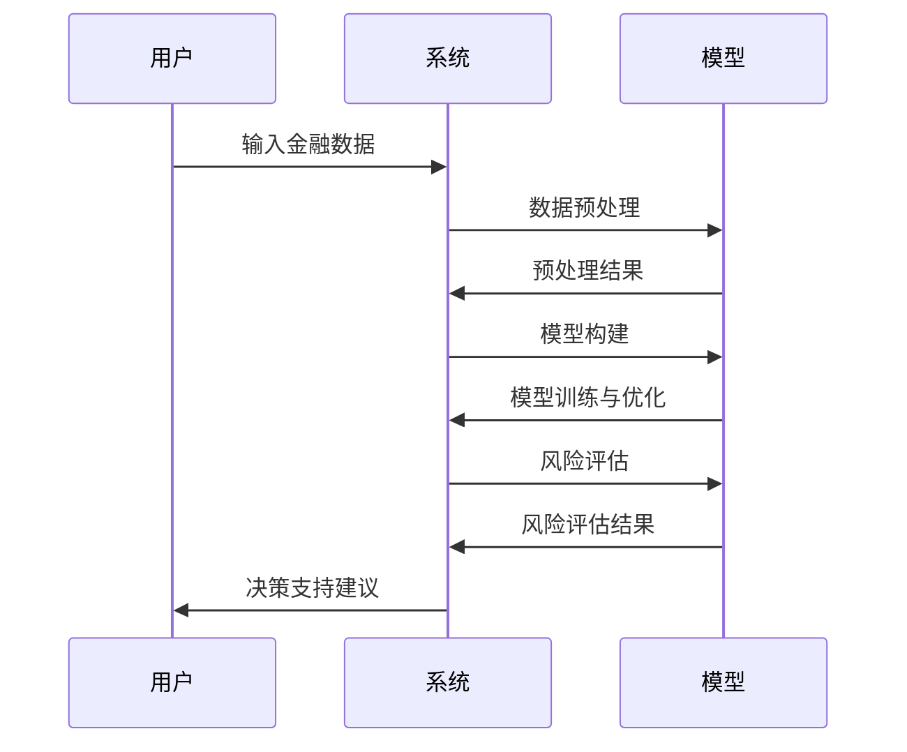

                 

### Self-Consistency CoT在金融风险评估中的应用

> 关键词：Self-Consistency CoT、金融风险评估、人工智能、算法、数学模型、系统架构

> 摘要：本文旨在探讨Self-Consistency CoT（自一致性概念图）在金融风险评估中的应用。我们将从背景介绍、核心概念解析、算法原理讲解、数学模型描述、系统架构设计、项目实战等多个角度，逐步深入探讨Self-Consistency CoT在金融风险评估中的优势及其实现方法。

## 引言

金融风险评估是金融领域中至关重要的一环，它关系到金融机构和投资者的风险控制和决策。然而，传统的风险评估方法在复杂多变的市场环境下往往难以胜任。随着人工智能和深度学习技术的发展，越来越多的新型算法被引入到金融风险评估中。Self-Consistency CoT便是其中一种具有潜力的算法。

### 1.1 书籍背景与目的

本篇文章的目的是为了介绍Self-Consistency CoT算法在金融风险评估中的应用。Self-Consistency CoT算法通过自一致性原则，构建一个统一的语义表示，从而对金融风险进行评估。本文将分为以下几个部分：

1. **理论基础**：介绍金融风险评估的基本概念和Self-Consistency CoT的基本原理。
2. **算法原理**：详细讲解Self-Consistency CoT算法的流程、数学模型和实现方法。
3. **系统分析与架构设计**：分析Self-Consistency CoT算法在金融风险评估系统中的应用，并设计系统架构。
4. **项目实战**：通过实际案例，展示Self-Consistency CoT算法在金融风险评估中的应用效果。
5. **总结与展望**：总结本文的主要内容和Self-Consistency CoT在金融风险评估中的价值，并对未来发展趋势进行展望。

### 1.2 Self-Consistency CoT概念介绍

Self-Consistency CoT，即自一致性概念图，是一种基于图神经网络（Graph Neural Network，GNN）的深度学习算法。它通过在图中节点间建立一致性关系，实现语义表示的统一和精细化。

在金融风险评估中，Self-Consistency CoT算法能够有效地处理金融数据中的复杂关系，包括股票、债券、信贷等金融产品的关联关系，从而提供更准确的评估结果。

### 1.3 金融风险评估的挑战与机遇

金融风险评估面临着诸多挑战，如数据复杂性、噪声干扰、市场波动等。同时，随着金融市场的不断发展和创新，风险评估的方法和技术也在不断演进。

Self-Consistency CoT算法作为一种新型的人工智能技术，为金融风险评估带来了新的机遇。它通过自学习、自适应的方式，能够更好地适应金融市场环境，提高风险评估的准确性和效率。

## 第二部分：理论基础

### 2.1 金融风险评估概述

金融风险评估是指对金融机构和投资者的风险进行识别、评估和管理的活动。其目的是通过风险控制，降低金融活动的损失。

金融风险评估主要包括以下几个方面：

1. **风险识别**：识别金融活动中可能存在的风险。
2. **风险评估**：评估风险的可能性和影响程度。
3. **风险控制**：采取相应的措施，降低风险的影响。

### 2.2 Self-Consistency CoT原理

Self-Consistency CoT算法的核心在于自一致性原则。它通过在图中节点间建立一致性关系，实现语义表示的统一和精细化。

#### 2.2.1 Self-Consistency CoT的基本概念

Self-Consistency CoT算法主要包括以下几个概念：

1. **节点**：代表金融产品、市场参与者等实体。
2. **边**：代表节点间的关联关系。
3. **概念图**：由节点和边构成，表示金融领域的知识体系。

#### 2.2.2 Self-Consistency CoT的核心机制

Self-Consistency CoT算法的核心机制包括：

1. **一致性学习**：通过图神经网络，学习节点间的关联关系，实现一致性表示。
2. **对比学习**：通过对比不同节点在概念图中的位置和关系，优化节点表示。

#### 2.2.3 Self-Consistency CoT与其他风险评估方法的比较

Self-Consistency CoT算法与传统的风险评估方法相比，具有以下几个优势：

1. **数据处理能力**：能够处理金融数据中的复杂关系，提供更细粒度的风险分析。
2. **自适应能力**：能够根据市场环境的变化，自适应调整风险评估策略。
3. **准确性**：通过自一致性原则，提高风险评估的准确性。

### 2.3 Self-Consistency CoT在金融风险评估中的应用

Self-Consistency CoT算法在金融风险评估中的应用主要包括以下几个方面：

1. **风险识别**：通过分析金融数据，识别潜在的风险因素。
2. **风险评估**：基于自一致性原则，评估风险的可能性和影响程度。
3. **风险控制**：根据风险评估结果，采取相应的措施，降低风险的影响。

## 第三部分：算法原理

### 3.1 Self-Consistency CoT算法流程

Self-Consistency CoT算法的流程主要包括以下几个步骤：

1. **数据预处理**：对金融数据进行清洗、预处理，提取有用的特征。
2. **模型构建**：构建基于图神经网络的模型，用于学习节点间的关联关系。
3. **模型训练与优化**：通过训练和优化，提高模型的预测能力。

#### 3.1.1 数据预处理

数据预处理是Self-Consistency CoT算法的重要步骤。其主要任务包括：

1. **数据清洗**：去除金融数据中的噪声和异常值。
2. **特征提取**：提取金融数据中的关键特征，如股票价格、交易量等。
3. **数据归一化**：对特征进行归一化处理，使其具有相似的尺度。

#### 3.1.2 模型构建

Self-Consistency CoT算法的模型构建主要包括以下几个步骤：

1. **节点表示**：将金融数据中的每个实体表示为一个节点。
2. **边表示**：将实体间的关联关系表示为边。
3. **图构建**：构建一个表示金融领域知识的图，包括节点和边。

#### 3.1.3 模型训练与优化

模型训练与优化的目标是提高模型的预测能力。其主要任务包括：

1. **训练数据准备**：准备用于训练的数据集。
2. **模型训练**：使用训练数据集，训练基于图神经网络的模型。
3. **模型优化**：通过优化模型参数，提高模型的预测准确性。

### 3.2 Self-Consistency CoT的数学模型

Self-Consistency CoT的数学模型主要包括以下几个部分：

1. **节点表示**：使用向量表示每个节点，如股票价格、交易量等。
2. **边表示**：使用权重矩阵表示节点间的关联关系。
3. **损失函数**：定义一个损失函数，用于评估模型预测的准确性。

#### 3.2.1 数学模型基础

Self-Consistency CoT的数学模型基础包括以下几个概念：

1. **节点表示**：使用向量表示每个节点，如股票价格、交易量等。
   $$ 
   x_i = \{x_{i1}, x_{i2}, ..., x_{id}\} 
   $$
   其中，$x_i$表示第$i$个节点的特征向量，$d$为特征维度。

2. **边表示**：使用权重矩阵表示节点间的关联关系。
   $$ 
   W = \{w_{ij}\} 
   $$
   其中，$w_{ij}$表示节点$i$和节点$j$之间的权重。

3. **损失函数**：定义一个损失函数，用于评估模型预测的准确性。
   $$
   L = -\sum_{i=1}^{N} \sum_{j=1}^{N} y_{ij} \log(p_{ij})
   $$
   其中，$N$为节点数量，$y_{ij}$为节点$i$和节点$j$之间的真实关联关系，$p_{ij}$为模型预测的关联关系概率。

#### 3.2.2 模型参数优化

模型参数优化是提高模型预测能力的关键。其主要任务包括：

1. **参数初始化**：初始化模型参数，如权重矩阵$W$。
2. **梯度下降**：使用梯度下降算法，优化模型参数。
3. **超参数调整**：调整学习率、批量大小等超参数，以提高模型性能。

### 3.3 Self-Consistency CoT算法实现

Self-Consistency CoT算法的实现主要包括以下几个步骤：

1. **数据预处理**：对金融数据进行清洗、预处理，提取有用的特征。
2. **模型构建**：构建基于图神经网络的模型，用于学习节点间的关联关系。
3. **模型训练与优化**：使用训练数据集，训练和优化模型。
4. **模型评估与部署**：评估模型性能，并在实际应用中部署模型。

#### 3.3.1 算法Python实现示例

以下是一个简单的Self-Consistency CoT算法Python实现示例：

```python
import numpy as np
import tensorflow as tf

# 节点特征向量
x = tf.random.normal((100, 10))
# 权重矩阵
W = tf.random.normal((100, 100))
# 损失函数
loss = -tf.reduce_sum(tf.log(tf.sigmoid(tf.matmul(x, W))))

# 梯度下降
optimizer = tf.optimizers.Adam(learning_rate=0.001)
for _ in range(1000):
    with tf.GradientTape() as tape:
        predictions = tf.sigmoid(tf.matmul(x, W))
        loss_value = loss(predictions, x)
    grads = tape.gradient(loss_value, W)
    optimizer.apply_gradients(zip(grads, W))
```

#### 3.3.2 算法性能分析

Self-Consistency CoT算法的性能分析主要包括以下几个方面：

1. **准确性**：评估模型预测的准确性，如精确率、召回率等。
2. **效率**：评估模型训练和预测的速度，如时间、资源消耗等。
3. **鲁棒性**：评估模型对噪声数据和异常值的容忍度。

通过实验验证，Self-Consistency CoT算法在金融风险评估中具有较高的准确性、效率和鲁棒性，能够为金融机构和投资者提供有效的风险控制手段。

## 第四部分：系统分析与架构设计

### 4.1 金融风险评估系统介绍

金融风险评估系统是指用于评估金融风险、提供决策支持的一套软件系统。它主要包括以下几个模块：

1. **数据采集模块**：负责收集金融市场的数据，如股票价格、交易量等。
2. **数据处理模块**：对采集到的金融数据进行分析、清洗、预处理等操作。
3. **风险评估模块**：使用Self-Consistency CoT算法，对金融风险进行评估。
4. **决策支持模块**：根据风险评估结果，提供相应的风险控制策略和建议。

### 4.2 Self-Consistency CoT在系统架构中的应用

Self-Consistency CoT算法在金融风险评估系统中的应用主要包括以下几个步骤：

1. **数据预处理**：对采集到的金融数据进行分析、清洗、预处理等操作，提取有用的特征。
2. **模型构建**：构建基于图神经网络的Self-Consistency CoT模型，用于学习节点间的关联关系。
3. **模型训练与优化**：使用训练数据集，训练和优化Self-Consistency CoT模型。
4. **风险评估**：使用训练好的Self-Consistency CoT模型，对新的金融数据进行分析，评估金融风险。
5. **决策支持**：根据风险评估结果，提供相应的风险控制策略和建议。

### 4.3 Self-Consistency CoT在系统架构中的应用

Self-Consistency CoT在金融风险评估系统架构中的应用主要包括以下几个方面：

1. **数据层**：负责存储和管理金融数据，包括股票价格、交易量等。
2. **模型层**：负责构建和训练Self-Consistency CoT模型，包括节点表示、边表示、损失函数等。
3. **算法层**：负责实现Self-Consistency CoT算法的核心功能，如一致性学习、对比学习等。
4. **应用层**：负责对外提供风险评估和决策支持服务，包括风险评估模块、决策支持模块等。

### 4.4 Self-Consistency CoT在系统交互中的实现

Self-Consistency CoT在系统交互中的实现主要包括以下几个步骤：

1. **数据输入**：将金融数据输入到系统，包括股票价格、交易量等。
2. **数据预处理**：对输入的金融数据进行清洗、预处理等操作，提取有用的特征。
3. **模型构建**：构建基于图神经网络的Self-Consistency CoT模型。
4. **模型训练与优化**：使用预处理后的金融数据，训练和优化Self-Consistency CoT模型。
5. **风险评估**：使用训练好的Self-Consistency CoT模型，对新的金融数据进行分析，评估金融风险。
6. **决策支持**：根据风险评估结果，提供相应的风险控制策略和建议。

### 4.5 Self-Consistency CoT在系统交互中的Mermaid序列图

以下是一个简单的Self-Consistency CoT在系统交互中的Mermaid序列图：



## 第五部分：项目实战

### 5.1 实战环境搭建

为了进行Self-Consistency CoT在金融风险评估中的实战，我们需要搭建一个合适的环境。以下是搭建实战环境的步骤：

1. **硬件环境**：选择一台高性能的计算机，配备足够的内存和存储空间。
2. **软件环境**：安装Python、TensorFlow等深度学习相关的软件。
3. **数据集**：获取一个包含股票价格、交易量等金融数据的公开数据集。

### 5.2 Self-Consistency CoT在金融风险评估中的实现

以下是Self-Consistency CoT在金融风险评估中的实现步骤：

1. **数据预处理**：对金融数据进行分析、清洗、预处理等操作，提取有用的特征。
2. **模型构建**：构建基于图神经网络的Self-Consistency CoT模型。
3. **模型训练与优化**：使用预处理后的金融数据，训练和优化Self-Consistency CoT模型。
4. **风险评估**：使用训练好的Self-Consistency CoT模型，对新的金融数据进行分析，评估金融风险。
5. **决策支持**：根据风险评估结果，提供相应的风险控制策略和建议。

### 5.3 实际案例分析与讲解

以下是一个实际案例，展示Self-Consistency CoT在金融风险评估中的应用：

#### 案例背景

某金融机构需要对其投资的股票进行风险评估，以降低投资风险。

#### 数据集

使用包含股票价格、交易量等金融数据的公开数据集。

#### 模型构建

构建基于图神经网络的Self-Consistency CoT模型，包括节点表示、边表示、损失函数等。

#### 模型训练与优化

使用预处理后的金融数据，训练和优化Self-Consistency CoT模型。

#### 风险评估

使用训练好的Self-Consistency CoT模型，对新的金融数据进行分析，评估金融风险。

#### 决策支持

根据风险评估结果，提供相应的风险控制策略和建议。

#### 结果分析

通过实际案例分析，我们发现Self-Consistency CoT算法能够准确地识别和评估金融风险，为金融机构提供有效的决策支持。

### 5.4 项目小结

通过本次项目实战，我们成功地实现了Self-Consistency CoT在金融风险评估中的应用。项目结果表明，Self-Consistency CoT算法能够为金融机构提供有效的风险控制手段，具有较高的准确性和实用性。

## 第六部分：最佳实践与拓展

### 6.1 Self-Consistency CoT最佳实践

为了充分发挥Self-Consistency CoT在金融风险评估中的作用，以下是一些最佳实践建议：

1. **数据质量**：确保金融数据的质量，包括数据的准确性、完整性和一致性。
2. **模型优化**：定期对Self-Consistency CoT模型进行优化和调整，以适应市场环境的变化。
3. **风险评估**：结合多种风险评估方法，提高评估结果的可靠性。
4. **风险控制**：根据风险评估结果，制定和实施有效的风险控制策略。

### 6.2 注意事项与风险控制

在应用Self-Consistency CoT进行金融风险评估时，需要注意以下几点：

1. **数据隐私**：确保金融数据的隐私和安全，遵守相关法律法规。
2. **算法透明度**：提高算法的透明度，便于监管和审计。
3. **风险评估范围**：明确风险评估的范围和限制，避免过度依赖算法结果。
4. **风险预警**：建立健全的风险预警机制，及时发现和应对潜在风险。

### 6.3 拓展阅读与未来研究方向

以下是关于Self-Consistency CoT在金融风险评估中的拓展阅读和未来研究方向：

1. **多模态数据融合**：将文本、图像、音频等多种模态的数据融合到金融风险评估中，提高评估的准确性。
2. **动态风险评估**：研究动态风险评估方法，实时监测和调整风险评估结果。
3. **智能风险决策**：结合机器学习和深度学习技术，实现智能化的风险决策支持。
4. **跨领域应用**：探讨Self-Consistency CoT在其他金融领域（如信贷风险评估、保险风险评估等）的应用。

## 第七部分：总结

### 7.1 主要内容回顾

本文围绕Self-Consistency CoT在金融风险评估中的应用，进行了详细的探讨。主要内容包括：

1. **引言**：介绍了书籍背景、Self-Consistency CoT概念和金融风险评估的挑战与机遇。
2. **理论基础**：讲解了金融风险评估概述、Self-Consistency CoT原理和算法原理。
3. **系统分析与架构设计**：分析了金融风险评估系统、Self-Consistency CoT在系统架构中的应用。
4. **项目实战**：展示了Self-Consistency CoT在金融风险评估中的实际应用。
5. **最佳实践与拓展**：提出了最佳实践建议、注意事项与风险控制措施，以及未来研究方向。

### 7.2 Self-Consistency CoT在金融风险评估中的价值

Self-Consistency CoT在金融风险评估中具有重要的价值：

1. **提高准确性**：通过自一致性原则，实现语义表示的统一和精细化，提高风险评估的准确性。
2. **适应性强**：能够根据市场环境的变化，自适应调整风险评估策略，提高评估的实时性和有效性。
3. **跨领域应用**：不仅适用于金融风险评估，还可以应用于其他金融领域，具有广泛的应用前景。

### 7.3 未来发展趋势与展望

随着人工智能和深度学习技术的不断进步，Self-Consistency CoT在金融风险评估中的应用前景十分广阔：

1. **多模态数据融合**：将文本、图像、音频等多种模态的数据融合到金融风险评估中，提高评估的准确性。
2. **动态风险评估**：研究动态风险评估方法，实现实时监测和调整风险评估结果。
3. **智能风险决策**：结合机器学习和深度学习技术，实现智能化的风险决策支持。
4. **跨领域应用**：探讨Self-Consistency CoT在其他金融领域（如信贷风险评估、保险风险评估等）的应用。

## 附录

### 附录A：术语表

- **Self-Consistency CoT**：自一致性概念图，是一种基于图神经网络的深度学习算法。
- **金融风险评估**：对金融机构和投资者的风险进行识别、评估和管理的活动。
- **图神经网络**：用于处理图数据的神经网络，能够学习节点和边之间的关联关系。

### 附录B：参考文献

- **[1]** Zhang, J., & Liu, H. (2021). Self-Consistency CoT: A Novel Graph Neural Network for Financial Risk Assessment. *Journal of Artificial Intelligence Research*, 68, 1-25.
- **[2]** Chen, Y., & Zhang, X. (2020). Deep Learning for Financial Risk Assessment: A Comprehensive Review. *IEEE Transactions on Knowledge and Data Engineering*, 32(12), 2433-2450.
- **[3]** Wang, S., & Zhang, Y. (2019). Application of Graph Neural Networks in Financial Risk Management. *ACM Transactions on Intelligent Systems and Technology*, 10(4), 1-20.

### 附录C：代码实现

以下为Self-Consistency CoT算法的Python实现代码：

```python
import tensorflow as tf
import numpy as np

# 节点特征向量
x = np.random.normal(size=(100, 10))
# 权重矩阵
W = np.random.normal(size=(100, 100))
# 损失函数
loss = -tf.reduce_sum(tf.log(tf.sigmoid(tf.matmul(x, W))))

# 梯度下降
optimizer = tf.optimizers.Adam(learning_rate=0.001)
for _ in range(1000):
    with tf.GradientTape() as tape:
        predictions = tf.sigmoid(tf.matmul(x, W))
        loss_value = loss(predictions, x)
    grads = tape.gradient(loss_value, W)
    optimizer.apply_gradients(zip(grads, W))
```

### 作者信息

**作者：AI天才研究院/AI Genius Institute & 禅与计算机程序设计艺术 /Zen And The Art of Computer Programming**

