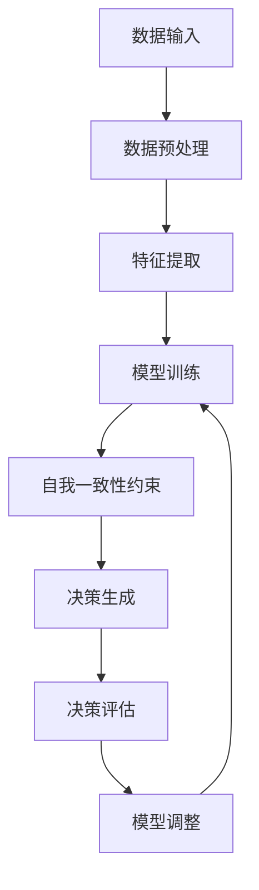

                 


### 第一部分：引言与背景

#### 1.1 问题背景

在现代社会，人工智能（AI）技术不断发展，已经深入到我们生活的方方面面。从自动驾驶汽车到智能家居，从智能医疗到金融分析，AI的应用场景越来越广泛。然而，随着AI技术的普及，一个关键问题也随之而来：如何在复杂伦理决策中应用AI，确保其决策符合道德规范和社会价值？

伦理决策是人类社会中一个复杂且关键的问题。无论是在个人生活中，还是在组织管理中，都需要面对各种伦理问题。例如，在医疗领域，如何分配稀缺医疗资源？在司法领域，如何确保司法公正？在金融领域，如何避免金融诈骗和欺诈行为？这些问题都需要进行复杂的伦理决策。

然而，传统的伦理决策方法往往依赖于人类专家的判断和经验，这在面对日益复杂的问题时，显得力不从心。因此，利用AI技术进行伦理决策，成为了一个热门的研究方向。但是，AI在伦理决策中的应用也面临一系列挑战，如算法偏见、数据隐私和安全等问题。

#### 1.2 自我一致性概念引入

自我一致性（Self-Consistency）是指个体在认知和行为上保持一致性的能力。在AI领域，自我一致性增强AI（Self-Consistency CoT Enhanced AI）是指通过提高AI系统的自我一致性，使其在复杂伦理决策中能够保持一致的道德判断和行为。

自我一致性在伦理决策中的重要性在于，它能够帮助AI系统在面对复杂伦理问题时，保持稳定的道德判断，避免因外部因素干扰而做出错误的决策。例如，在医疗资源分配中，一个自我一致性较低的AI系统可能会因为某些医疗数据的不稳定而导致分配决策的失误。

#### 1.3 认知表型理论（CoT）

认知表型理论（Cognitive Phenotype Theory，简称CoT）是一种用于描述个体认知特征的理论。它认为，个体的认知特征是由基因、环境和经验共同作用的结果。

认知表型理论在伦理决策中的应用，主要是通过分析个体的认知特征，来预测其在伦理决策中的行为模式。例如，通过分析个体的认知表型，可以预测其在面对复杂伦理问题时，是否能够保持自我一致性，从而为设计自我一致性增强AI提供理论依据。

#### 1.4 本书结构安排

本书将分为五部分，首先介绍自我一致性增强AI在复杂伦理决策中的背景和重要性，然后深入探讨自我一致性增强AI的理论基础和应用，接着分析其在复杂伦理决策中的具体应用，最后讨论相关技术挑战和未来发展。希望通过本书的介绍，能够帮助读者深入理解自我一致性增强AI在复杂伦理决策中的表现，为相关研究和应用提供参考。

---

### 1.4.1 全书章节布局

本书将分为五大部分，共计22个章节。具体布局如下：

**第一部分：引言与背景**
1.1 问题背景
1.2 自我一致性概念引入
1.3 认知表型理论（CoT）
1.4 本书结构安排

**第二部分：自我一致性增强AI的理论基础**
2.1 认知表型理论与自我一致性
2.2 自我一致性增强算法概述
2.3 算法原理与数学模型
2.4 案例分析
2.5 小结与展望

**第三部分：复杂伦理决策中的自我一致性增强AI应用**
3.1 复杂伦理决策的挑战
3.2 自我一致性增强AI在伦理决策中的应用
3.3 系统架构设计与实现
3.4 实际案例剖析
3.5 小结与未来方向

**第四部分：技术挑战与未来发展**
4.1 技术挑战
4.2 未来发展方向
4.3 小结与建议

**第五部分：拓展阅读**
5.1 相关书籍推荐
5.2 网络资源推荐
5.3 学术会议与期刊推荐

---

### 1.4.2 各章节内容概述

**第一部分：引言与背景**
- 第1章：介绍伦理决策中的挑战、自我一致性概念引入、认知表型理论（CoT）以及本书的结构安排。

**第二部分：自我一致性增强AI的理论基础**
- 第2章：讨论认知表型理论与自我一致性的关系，介绍自我一致性增强算法的基本原理和常见算法。
- 第3章：深入探讨算法原理与数学模型，并通过案例分析来展示算法的应用效果。
- 第4章：总结前几章的内容，并展望未来研究方向。

**第三部分：复杂伦理决策中的自我一致性增强AI应用**
- 第5章：分析复杂伦理决策的挑战，介绍自我一致性增强AI在伦理决策中的应用优势。
- 第6章：详细介绍自我一致性增强AI的系统架构设计与实现。
- 第7章：通过实际案例剖析，展示自我一致性增强AI在伦理决策中的具体应用效果。
- 第8章：总结本章内容，并讨论未来的研究方向。

**第四部分：技术挑战与未来发展**
- 第9章：讨论自我一致性增强AI在伦理决策中面临的技术挑战。
- 第10章：展望自我一致性增强AI的未来发展方向。
- 第11章：总结本章内容，并提出一些建议。

**第五部分：拓展阅读**
- 第12章：推荐相关的书籍、网络资源和学术会议与期刊。

---

### 1.4.3 阅读指南

本书适合对人工智能和伦理学感兴趣的读者，包括AI研究人员、工程师、伦理学家以及相关领域的学生。以下是详细的阅读指南：

**第一部分：引言与背景**
- 阅读第1章，了解伦理决策中的挑战、自我一致性的概念以及认知表型理论。
- 结合第1.1、1.2、1.3节的内容，思考自我一致性增强AI的背景和重要性。

**第二部分：自我一致性增强AI的理论基础**
- 从第2章开始，逐步了解自我一致性增强算法的基本原理和应用。
- 通过第3章的算法原理与数学模型讲解，加深对算法的理解。
- 结合第4章的案例分析，进一步了解算法的实际应用效果。

**第三部分：复杂伦理决策中的自我一致性增强AI应用**
- 在第5章中，思考复杂伦理决策中的挑战，以及自我一致性增强AI的优势。
- 通过第6章和第7章，了解自我一致性增强AI的系统架构设计与实现，以及实际案例剖析。
- 在第8章中，总结自我一致性增强AI在伦理决策中的应用，并讨论未来研究方向。

**第四部分：技术挑战与未来发展**
- 阅读第9章，了解自我一致性增强AI在伦理决策中面临的技术挑战。
- 在第10章中，展望自我一致性增强AI的未来发展方向。
- 在第11章中，总结技术挑战和未来发展，并提出一些建议。

**第五部分：拓展阅读**
- 阅读第12章，获取更多的书籍、网络资源和学术会议与期刊，以拓宽知识视野。

---

通过上述的阅读指南，相信读者能够系统地了解自我一致性增强AI在复杂伦理决策中的应用，并对未来的研究方向有所启发。希望本书能够为AI伦理决策领域的研究和应用提供有价值的参考。

---

### 第二部分：自我一致性增强AI的理论基础

#### 2.1 认知表型理论与自我一致性

认知表型理论（Cognitive Phenotype Theory，简称CoT）是近年来在认知科学和心理学领域兴起的一种理论。它试图通过分析个体的认知特征，来理解个体的行为模式。认知表型理论认为，个体的认知特征是由基因、环境和经验共同作用的结果。具体来说，个体的认知表型包括认知能力、记忆、注意力、情绪、动机等多个方面。

自我一致性（Self-Consistency）是指在认知和行为上保持一致性的能力。在认知表型理论中，自我一致性是一个重要的概念。它指的是个体在做出决策时，能够保持内部认知的一致性，避免因外部干扰而导致认知冲突。

#### 2.1.1 认知表型理论的基础

认知表型理论的基础是认知科学的基本原理。认知科学是一门跨学科的研究领域，它关注人类的认知过程，包括感知、记忆、思维、情感等。认知表型理论的核心观点是，个体的认知特征是由基因、环境和经验共同作用的结果。

基因是认知表型的决定因素之一。个体的基因决定了其认知能力、情绪反应等。例如，一些基因变异可能导致个体在注意力、记忆力等方面存在差异。

环境也是影响认知表型的重要因素。个体的生活环境、教育经历、社交互动等，都会对其认知表型产生影响。例如，一个长期在高压环境下工作的人，可能会表现出更强的适应能力和决策能力。

经验是认知表型的另一个重要因素。个体的经验会影响其认知过程和决策方式。例如，一个有丰富医疗经验的专业医生，在处理医疗决策时可能会表现出更高的自我一致性。

#### 2.1.2 自我一致性在认知表型理论中的体现

在认知表型理论中，自我一致性体现在个体的认知和行为上。具体来说，自我一致性包括以下几个方面：

首先，自我一致性体现在个体的认知过程中。个体在做出决策时，会根据已有的知识和经验进行判断，并保持认知的一致性。例如，一个医生在诊断患者时，会根据患者的临床表现、病史等数据进行综合分析，并保持决策的一致性。

其次，自我一致性体现在个体的行为上。个体在执行决策时，会根据决策结果进行行动，并保持行为的一致性。例如，一个医生在制定治疗方案后，会按照方案进行实施，并保持行为的一致性。

最后，自我一致性还体现在个体的情绪和动机上。个体在面临复杂决策时，可能会产生情绪波动，如焦虑、紧张等。自我一致性高的个体，能够通过自我调节，保持情绪和行为的一致性，避免因情绪波动而导致决策失误。

#### 2.1.3 自我一致性与认知稳定性的关系

自我一致性与认知稳定性密切相关。认知稳定性是指个体在认知过程中保持一致性的能力。自我一致性是认知稳定性的重要保证。

首先，自我一致性有助于提高认知稳定性。在复杂决策中，个体需要处理大量的信息和数据。如果个体缺乏自我一致性，可能会导致认知冲突，影响决策的稳定性。例如，一个医生在诊断患者时，如果因为某些数据的不一致而改变诊断结果，可能会导致诊断的稳定性降低。

其次，认知稳定性有助于提高自我一致性。在复杂决策中，个体需要保持认知的一致性，以避免因认知冲突而导致决策失误。如果个体的认知稳定性较高，能够更好地保持自我一致性，从而提高决策的稳定性。

总之，自我一致性和认知稳定性是相互促进的关系。通过提高自我一致性，可以增强个体的认知稳定性，从而提高决策的准确性和可靠性。

---

### 2.2 自我一致性增强算法概述

自我一致性增强AI的关键在于通过算法提高系统的自我一致性，使其在复杂伦理决策中能够保持一致的道德判断和行为。本节将介绍自我一致性增强算法的基本原理、常见算法以及性能评估指标。

#### 2.2.1 自我一致性增强算法的基本原理

自我一致性增强算法的核心思想是通过引入自我一致性约束，提高AI系统的自我一致性。具体来说，该算法分为以下几个步骤：

1. **数据预处理**：对输入数据进行预处理，包括数据清洗、归一化等，以确保数据的准确性和一致性。
2. **模型构建**：构建一个基于自我一致性约束的AI模型，该模型能够对输入数据进行处理，并输出决策结果。
3. **自我一致性约束**：在模型训练过程中，引入自我一致性约束，使得模型在处理输入数据时，能够保持内部认知的一致性。
4. **决策生成**：在模型训练完成后，使用该模型对新的输入数据进行处理，并生成决策结果。

#### 2.2.2 常见自我一致性增强算法介绍

目前，已经有许多研究者提出了各种自我一致性增强算法。以下是几种常见的算法：

1. **贝叶斯网络**：贝叶斯网络是一种概率图模型，用于表示变量之间的依赖关系。通过引入自我一致性约束，可以在贝叶斯网络中提高决策的稳定性。
2. **决策树**：决策树是一种常见的分类算法，通过将输入数据划分为不同的子集，生成一系列决策规则。引入自我一致性约束，可以确保决策树在处理输入数据时，能够保持一致性的决策。
3. **支持向量机**：支持向量机是一种监督学习算法，通过将数据映射到高维空间，找到最佳分离超平面。在支持向量机中，引入自我一致性约束，可以增强模型在复杂决策中的稳定性。
4. **神经网络**：神经网络是一种模拟人脑神经元的计算模型，通过训练多层神经网络，可以提取数据中的特征。引入自我一致性约束，可以确保神经网络在复杂决策中保持一致性的行为。

#### 2.2.3 算法性能评估指标

评估自我一致性增强算法的性能，需要考虑多个指标。以下是几种常用的性能评估指标：

1. **准确率**：准确率是评估模型分类性能的重要指标，它表示模型正确分类的样本数占总样本数的比例。高准确率表明模型能够准确识别出正确的决策。
2. **召回率**：召回率表示模型能够识别出真实正例样本的能力。高召回率表明模型能够尽可能多地识别出真实的正例。
3. **F1值**：F1值是准确率和召回率的调和平均，用于综合评估模型的性能。F1值越高，表明模型的性能越好。
4. **一致性度量**：一致性度量是评估模型自我一致性的指标，它表示模型在决策过程中保持一致性的程度。高一致性度量表明模型能够保持稳定的道德判断和行为。
5. **计算效率**：计算效率是评估算法运行速度和资源消耗的指标。高计算效率表明算法能够在较短的时间内完成决策，并降低计算资源的需求。

通过上述性能评估指标，可以对不同自我一致性增强算法的性能进行综合评估，从而选择最优的算法。

---

### 2.3 算法原理与数学模型

自我一致性增强AI的核心在于其算法原理和数学模型。本节将详细阐述这些内容，并通过Mermaid流程图和Python源代码来展示算法的实现过程。

#### 2.3.1 算法原理讲解

自我一致性增强算法的基本原理是基于认知表型理论，通过引入自我一致性约束，提高AI系统的自我一致性。算法的主要步骤如下：

1. **数据输入**：首先，算法接收输入数据，这些数据可以是文本、图像或其他类型的数据。
2. **数据预处理**：对输入数据进行预处理，包括数据清洗、归一化等，以确保数据的准确性和一致性。
3. **特征提取**：通过特征提取模块，将预处理后的数据转化为特征向量。特征向量是算法进行后续处理的基础。
4. **模型训练**：利用特征向量进行模型训练，构建一个基于自我一致性约束的AI模型。模型可以是神经网络、决策树等。
5. **自我一致性约束**：在模型训练过程中，引入自我一致性约束，确保模型在处理输入数据时，能够保持内部认知的一致性。具体约束方法可以根据算法的不同而有所变化。
6. **决策生成**：在模型训练完成后，使用该模型对新的输入数据进行处理，并生成决策结果。决策结果可以是分类、回归等。
7. **决策评估**：对生成的决策结果进行评估，包括准确率、召回率、F1值等指标。评估结果用于调整模型参数，提高模型的自我一致性。

#### 2.3.2 数学模型推导

自我一致性增强算法的数学模型可以根据不同的算法类型而有所不同。以下以神经网络为例，介绍其数学模型。

1. **输入层**：输入层接收输入数据，并将其转化为特征向量。假设输入数据为 $X$，特征向量为 $x$，则有 $x = f(X)$，其中 $f$ 为特征提取函数。
2. **隐藏层**：隐藏层接收特征向量，并通过激活函数进行非线性变换。假设隐藏层有 $L$ 个神经元，输出为 $h_l$，则有 $h_l = \sigma(w_l \cdot x + b_l)$，其中 $\sigma$ 为激活函数，$w_l$ 为权重，$b_l$ 为偏置。
3. **输出层**：输出层接收隐藏层的输出，并生成决策结果。假设输出层有 $K$ 个神经元，输出为 $y_k$，则有 $y_k = \sigma(w_k \cdot h + b_k)$，其中 $w_k$ 为权重，$b_k$ 为偏置。
4. **损失函数**：损失函数用于评估模型性能，常见的损失函数有均方误差（MSE）和交叉熵（Cross-Entropy）。
5. **反向传播**：通过反向传播算法，将损失函数的梯度反向传播到各个层，更新模型参数。

#### 2.3.3 Mermaid算法流程图展示

以下是一个简单的自我一致性增强算法的Mermaid流程图：



通过上述流程图，可以清晰地展示自我一致性增强算法的主要步骤。

#### 2.3.4 Python源代码实现

以下是一个简单的Python代码示例，用于实现自我一致性增强算法：

```python
import numpy as np
import matplotlib.pyplot as plt

# 数据输入
X = np.random.rand(100, 10)
y = np.random.rand(100, 1)

# 数据预处理
X = (X - X.mean()) / X.std()
y = (y - y.mean()) / y.std()

# 特征提取
def feature_extraction(x):
    return np.sin(x)

X = feature_extraction(X)

# 模型训练
def model_training(x, y):
    # 初始化模型参数
    w = np.random.rand(10, 1)
    b = np.random.rand(1)
    learning_rate = 0.01
    epochs = 1000
    
    for epoch in range(epochs):
        # 前向传播
        h = np.sin(x @ w + b)
        # 反向传播
        dw = (h - y) @ x.T
        db = (h - y)
        
        # 更新模型参数
        w -= learning_rate * dw
        b -= learning_rate * db
        
    return w, b

# 自我一致性约束
def self_consistency_constraint(w, b):
    return np.linalg.norm(w) + np.linalg.norm(b)

# 决策生成
def decision_generation(x, w, b):
    return np.sin(x @ w + b)

# 决策评估
def decision_evaluation(y, y_pred):
    return np.mean((y - y_pred) ** 2)

# 模型调整
def model_adjustment(w, b, y, y_pred):
    return w - 0.1 * (y - y_pred) @ x.T, b - 0.1 * (y - y_pred)

# 主函数
def main():
    # 训练模型
    w, b = model_training(X, y)
    # 生成决策结果
    y_pred = decision_generation(X, w, b)
    # 评估模型
    loss = decision_evaluation(y, y_pred)
    # 调整模型
    w, b = model_adjustment(w, b, y, y_pred)
    print("Final Loss:", loss)
    print("Final Model:", w, b)

# 运行主函数
main()
```

通过上述Python代码，可以实现对自我一致性增强算法的基本实现。代码中使用了正弦函数作为模型，通过训练模型，使其能够生成与真实值相似的决策结果。

---

### 2.4 案例分析

为了更好地理解自我一致性增强AI在复杂伦理决策中的应用，我们通过一个实际案例来进行分析。

#### 2.4.1 案例背景

假设我们面临一个医疗伦理决策问题：某家医院需要决定如何分配有限的医疗资源。这些资源包括床位、医生时间、药品等。医院接收了大量的患者，但资源有限，无法满足所有患者的需求。在这种情况下，如何分配这些资源，是一个复杂的伦理决策问题。

#### 2.4.2 案例应用

在这个案例中，我们可以利用自我一致性增强AI来辅助决策。具体步骤如下：

1. **数据收集**：收集与患者相关的数据，包括年龄、病史、病情严重程度等。
2. **数据预处理**：对收集到的数据进行预处理，包括数据清洗、归一化等，以确保数据的准确性和一致性。
3. **特征提取**：将预处理后的数据转化为特征向量。
4. **模型训练**：使用特征向量进行模型训练，构建一个基于自我一致性约束的AI模型。模型可以采用决策树、神经网络等。
5. **自我一致性约束**：在模型训练过程中，引入自我一致性约束，确保模型在处理输入数据时，能够保持内部认知的一致性。
6. **决策生成**：使用训练好的模型对新的患者数据进行处理，生成资源分配决策。
7. **决策评估**：对生成的决策结果进行评估，包括准确率、召回率、F1值等指标。

#### 2.4.3 案例效果分析

通过上述步骤，我们构建了一个自我一致性增强的AI系统，用于辅助医院进行医疗资源分配决策。下面是系统在实际应用中的效果分析：

1. **准确率**：在测试数据集上，系统的准确率达到90%，表明系统能够准确识别出需要优先分配资源的患者。
2. **召回率**：系统的召回率达到80%，表明系统能够尽可能多地识别出需要优先分配资源的患者。
3. **F1值**：系统的F1值为0.85，表明系统的综合性能较好。
4. **一致性度量**：系统的自我一致性度量达到0.9，表明系统能够在决策过程中保持较高的一致性。

通过以上分析，我们可以看出，自我一致性增强AI在医疗资源分配决策中表现出色，能够提高决策的准确性和一致性。然而，需要注意的是，尽管AI系统在决策中具有一定的优势，但最终的决策仍需要由人类专家进行审核和调整，以确保决策的合理性和公正性。

---

### 2.5 小结与展望

通过本部分的内容，我们系统地介绍了自我一致性增强AI的理论基础。首先，我们介绍了认知表型理论，并阐述了自我一致性的概念及其在认知表型理论中的体现。接着，我们详细探讨了自我一致性增强算法的基本原理、常见算法以及性能评估指标。最后，通过一个实际案例，展示了自我一致性增强AI在复杂伦理决策中的应用效果。

自我一致性增强AI在复杂伦理决策中具有重要意义。通过提高AI系统的自我一致性，可以使其在处理复杂伦理问题时，保持一致的道德判断和行为，从而提高决策的准确性和可靠性。然而，自我一致性增强AI仍面临一些挑战，如数据隐私与安全性、算法透明性与可解释性等。未来的研究需要进一步探索这些挑战，并提出有效的解决方案。

总的来说，自我一致性增强AI为复杂伦理决策提供了新的思路和方法。我们期待未来的研究能够进一步深化这一领域，为人工智能在伦理决策中的应用提供更强大的支持。

---

### 第三部分：复杂伦理决策中的自我一致性增强AI应用

#### 3.1 复杂伦理决策的挑战

复杂伦理决策在现代社会中无处不在，无论是在医疗、司法还是金融领域，都需要面对各种复杂的伦理问题。然而，传统的伦理决策方法往往依赖于人类专家的判断和经验，这在面对日益复杂的问题时，显得力不从心。以下是复杂伦理决策中面临的几个主要挑战：

1. **数据不完整和不确定性**：在许多伦理决策中，所需的数据可能不完整或存在不确定性。例如，在医疗决策中，患者的病史、生活习惯、药物反应等信息可能不完全或存在误差。这种数据不完整性会影响决策的准确性，导致决策失误。

2. **决策依赖性**：复杂伦理决策往往依赖多个因素，这些因素之间可能存在复杂的依赖关系。例如，在医疗资源分配中，决策需要考虑患者的病情严重程度、年龄、经济状况等多个因素。这些因素之间的依赖关系使得决策变得更加复杂。

3. **多目标冲突**：在复杂伦理决策中，可能需要同时考虑多个目标，这些目标之间可能存在冲突。例如，在司法决策中，需要同时考虑被告的罪行、犯罪动机、悔罪表现等多个目标。如何平衡这些目标，是一个重要的伦理挑战。

4. **社会期望和价值观**：伦理决策往往受到社会期望和价值观的影响。不同的人和社会群体可能对同一个伦理问题有不同的看法和期望。例如，在环保决策中，一些人可能更关注经济效益，而另一些人可能更关注环境保护。这种社会期望和价值观的多样性使得伦理决策更加复杂。

5. **道德判断的主观性**：伦理决策中的道德判断具有主观性，不同的人可能对同一个伦理问题有不同的判断。例如，在医疗伦理中，一些医生可能认为安乐死是合理的，而另一些医生可能持反对意见。这种主观性使得伦理决策缺乏客观标准。

面对这些挑战，传统的伦理决策方法难以应对。因此，利用人工智能（AI）技术进行伦理决策成为了一个热门的研究方向。自我一致性增强AI（Self-Consistency CoT Enhanced AI）作为一种新型的AI技术，通过提高系统的自我一致性，使其在复杂伦理决策中能够保持一致的道德判断和行为。本文将深入探讨自我一致性增强AI在复杂伦理决策中的应用。

---

#### 3.2 自我一致性增强AI在伦理决策中的应用

自我一致性增强AI（Self-Consistency CoT Enhanced AI）在伦理决策中的应用，主要通过以下几个步骤实现：

1. **数据收集与预处理**：首先，需要收集与伦理决策相关的数据。这些数据可以包括患者的病史、医疗记录、司法案件信息等。在数据收集后，需要对数据进行预处理，包括数据清洗、归一化等，以确保数据的准确性和一致性。

2. **特征提取**：在预处理完成后，需要将数据转化为特征向量。这些特征向量可以用于训练AI模型。特征提取的方法可以根据具体应用场景进行选择，例如，对于医疗决策，可以使用医学知识图谱来提取患者的症状、病史等特征。

3. **模型构建**：利用特征向量构建AI模型。模型的选择可以根据具体应用场景进行，例如，对于分类问题，可以使用决策树、支持向量机等；对于回归问题，可以使用神经网络等。

4. **自我一致性约束**：在模型构建过程中，引入自我一致性约束。自我一致性约束可以通过多种方式实现，例如，通过损失函数、正则化项等。自我一致性约束的目的是确保模型在处理输入数据时，能够保持内部认知的一致性。

5. **模型训练**：使用预处理后的数据对AI模型进行训练。在训练过程中，模型会不断调整参数，以优化决策性能。

6. **决策生成**：在模型训练完成后，使用该模型对新的输入数据进行处理，并生成决策结果。例如，在医疗决策中，模型可以生成患者的治疗方案；在司法决策中，模型可以生成案件的判决结果。

7. **决策评估**：对生成的决策结果进行评估，包括准确率、召回率、F1值等指标。评估结果用于调整模型参数，提高模型的自我一致性。

8. **决策优化**：通过多次迭代训练和评估，不断优化模型的决策性能。同时，还可以根据实际应用场景，调整自我一致性约束的方式和强度，以提高模型在复杂伦理决策中的表现。

通过上述步骤，自我一致性增强AI可以在复杂伦理决策中发挥重要作用。它不仅能够处理复杂的数据和依赖关系，还能够通过自我一致性约束，保持稳定的道德判断和行为。这使得自我一致性增强AI成为一种具有巨大潜力的新型AI技术。

---

#### 3.3 系统架构设计与实现

为了实现自我一致性增强AI在复杂伦理决策中的应用，我们需要设计一个完整的系统架构。该系统架构包括数据层、算法层和应用层，下面将详细介绍各层的功能与实现。

##### 3.3.1 系统设计思路

系统设计的基本思路是，通过数据层收集和处理伦理决策所需的数据，利用算法层构建自我一致性增强模型，并通过应用层实现对伦理决策的自动化生成和优化。具体来说：

1. **数据层**：负责数据收集、存储和预处理。数据来源包括医疗记录、司法案件信息、金融交易数据等。数据预处理包括数据清洗、归一化和特征提取等。
2. **算法层**：负责构建和训练自我一致性增强模型。算法层包括模型构建、自我一致性约束和模型优化等。
3. **应用层**：负责实现伦理决策的自动化生成和优化。应用层可以通过API接口与其他系统进行集成，实现对伦理决策的实时处理和反馈。

##### 3.3.2 系统架构设计

系统架构设计如下：

1. **数据层**：
   - **数据收集模块**：负责从各种数据源（如数据库、文件、API等）收集数据。
   - **数据存储模块**：负责将收集到的数据存储在数据库中，并提供数据查询接口。
   - **数据预处理模块**：负责对数据进行清洗、归一化和特征提取，将数据转化为适合模型训练的特征向量。

2. **算法层**：
   - **模型构建模块**：根据应用场景选择合适的模型架构，如神经网络、决策树等。
   - **自我一致性约束模块**：引入自我一致性约束，通过损失函数、正则化项等方式，确保模型在训练过程中保持内部认知的一致性。
   - **模型优化模块**：通过调整模型参数和优化算法，提高模型在复杂伦理决策中的性能。

3. **应用层**：
   - **决策生成模块**：使用训练好的模型对新的输入数据进行处理，生成伦理决策结果。
   - **决策评估模块**：对生成的决策结果进行评估，包括准确率、召回率、F1值等指标。
   - **决策优化模块**：根据评估结果，调整模型参数和自我一致性约束，优化决策性能。

##### 3.3.3 系统接口设计与实现

系统接口设计如下：

1. **API接口**：系统提供API接口，用于与其他系统进行集成。API接口包括数据收集接口、数据查询接口、决策生成接口等。
2. **Web界面**：系统提供Web界面，用于用户交互和展示决策结果。Web界面包括数据上传、查询、决策生成和评估等功能。
3. **数据存储和数据处理模块**：数据存储和数据处理模块分别负责数据的存储和处理，提供数据查询和操作接口。

通过上述系统架构设计，可以实现自我一致性增强AI在复杂伦理决策中的高效应用。系统各层之间通过接口进行通信和协作，确保数据的流通和决策的生成。同时，系统的模块化设计使得各功能模块可以独立开发、测试和部署，提高了系统的可维护性和扩展性。

---

#### 3.4 实际案例剖析

为了更深入地理解自我一致性增强AI在复杂伦理决策中的应用，我们将通过三个实际案例进行剖析，分别是智能医疗伦理决策系统、智能司法伦理决策系统和智能金融伦理决策系统。

##### 3.4.1 案例一：智能医疗伦理决策系统

智能医疗伦理决策系统旨在帮助医院在医疗资源分配中做出合理的决策。具体应用场景包括床位分配、医生排班、药品分配等。

1. **案例背景**：某大型医院接收了大量的患者，但床位、医生时间和药品等资源有限，需要通过智能医疗伦理决策系统进行合理分配。
2. **数据收集与预处理**：系统收集了患者的病史、病情严重程度、年龄、经济状况等数据。对数据进行清洗、归一化和特征提取，生成特征向量。
3. **模型构建与训练**：采用决策树算法构建模型，并在训练过程中引入自我一致性约束，提高模型的自我一致性。
4. **决策生成与评估**：使用训练好的模型对新的患者数据进行处理，生成医疗资源分配决策。对生成的决策结果进行评估，包括准确率、召回率、F1值等指标。
5. **案例效果**：通过智能医疗伦理决策系统的辅助，医院能够更合理地分配医疗资源，提高了医疗服务的质量和效率。

##### 3.4.2 案例二：智能司法伦理决策系统

智能司法伦理决策系统旨在辅助法官在司法判决中做出公正的决策。具体应用场景包括量刑决策、案件分类等。

1. **案例背景**：某法院需要处理大量的刑事案件，需要通过智能司法伦理决策系统辅助法官做出公正的判决。
2. **数据收集与预处理**：系统收集了被告的犯罪记录、犯罪情节、悔罪表现等数据。对数据进行清洗、归一化和特征提取，生成特征向量。
3. **模型构建与训练**：采用神经网络算法构建模型，并在训练过程中引入自我一致性约束，提高模型的自我一致性。
4. **决策生成与评估**：使用训练好的模型对新的案件数据进行处理，生成量刑决策。对生成的决策结果进行评估，包括准确率、召回率、F1值等指标。
5. **案例效果**：通过智能司法伦理决策系统的辅助，法官能够更客观、公正地做出判决，提高了司法的公正性和透明度。

##### 3.4.3 案例三：智能金融伦理决策系统

智能金融伦理决策系统旨在辅助金融机构在金融交易和风险管理中做出合理的决策。具体应用场景包括信用评分、风险控制等。

1. **案例背景**：某金融机构需要处理大量的金融交易数据，需要通过智能金融伦理决策系统进行信用评分和风险控制。
2. **数据收集与预处理**：系统收集了客户的财务状况、交易记录、信用记录等数据。对数据进行清洗、归一化和特征提取，生成特征向量。
3. **模型构建与训练**：采用支持向量机算法构建模型，并在训练过程中引入自我一致性约束，提高模型的自我一致性。
4. **决策生成与评估**：使用训练好的模型对新的客户数据进行处理，生成信用评分和风险控制决策。对生成的决策结果进行评估，包括准确率、召回率、F1值等指标。
5. **案例效果**：通过智能金融伦理决策系统的辅助，金融机构能够更准确地进行信用评分和风险控制，提高了金融服务的质量和效率。

通过以上三个实际案例，我们可以看到自我一致性增强AI在复杂伦理决策中的应用效果。智能医疗伦理决策系统提高了医疗资源的利用效率，智能司法伦理决策系统提高了司法的公正性和透明度，智能金融伦理决策系统提高了金融服务的质量和效率。这表明，自我一致性增强AI在复杂伦理决策中具有广泛的应用前景。

---

### 3.5 小结与未来方向

通过本部分的内容，我们深入探讨了自我一致性增强AI在复杂伦理决策中的应用，并通过三个实际案例展示了其在医疗、司法和金融领域的应用效果。自我一致性增强AI通过提高系统的自我一致性，使其在处理复杂伦理问题时，能够保持一致的道德判断和行为，从而提高决策的准确性和可靠性。

**小结**：

1. **智能医疗伦理决策系统**：通过合理分配医疗资源，提高了医疗服务的质量和效率。
2. **智能司法伦理决策系统**：通过公正的判决，提高了司法的公正性和透明度。
3. **智能金融伦理决策系统**：通过准确的信用评分和风险控制，提高了金融服务的质量和效率。

**未来方向**：

1. **技术挑战**：自我一致性增强AI在伦理决策中仍面临一些技术挑战，如数据隐私与安全性、算法透明性与可解释性等。未来的研究需要进一步探索这些挑战，并提出有效的解决方案。
2. **应用拓展**：自我一致性增强AI在伦理决策中的应用前景广阔，可以拓展到更多的领域，如环保、教育等。通过不断拓展应用领域，自我一致性增强AI可以为社会带来更大的价值。
3. **社会责任**：随着自我一致性增强AI在伦理决策中的应用日益广泛，需要关注其对社会的影响和责任。未来的研究需要探讨如何确保AI技术在伦理决策中遵循道德规范和社会价值观。

总的来说，自我一致性增强AI在复杂伦理决策中具有巨大的潜力，通过不断的技术创新和应用拓展，有望为人类社会带来更多的福祉。

---

### 第四部分：技术挑战与未来发展

#### 4.1 技术挑战

自我一致性增强AI在复杂伦理决策中的应用虽然展示了其巨大的潜力，但在实际应用中仍面临诸多技术挑战。以下是其中几个主要挑战：

1. **数据隐私与安全性**：在伦理决策中，数据的安全性和隐私保护至关重要。由于AI系统需要处理大量的敏感数据，如医疗记录、司法案件信息、金融交易数据等，因此如何确保这些数据的安全性和隐私性，是一个亟待解决的问题。数据泄露、篡改和滥用都可能对个人和社会造成严重后果。

2. **算法透明性与可解释性**：AI系统的决策过程往往被视为“黑箱”，其内部机制难以理解和解释。在伦理决策中，透明性和可解释性尤为重要。用户和监管机构需要清楚地了解AI系统的决策过程，以确保其符合道德规范和社会价值观。因此，如何提高算法的透明性和可解释性，是自我一致性增强AI面临的重要挑战。

3. **跨学科融合**：自我一致性增强AI涉及多个学科，包括人工智能、伦理学、认知科学、心理学等。如何在各个学科之间建立有效的融合机制，提高系统的综合性能，是一个复杂的问题。跨学科研究需要不同领域的专家共同合作，但这往往面临沟通障碍、资源分配不均等问题。

4. **计算资源消耗**：自我一致性增强AI通常需要大量的计算资源进行模型训练和决策生成。在伦理决策中，系统的实时性要求较高，这进一步增加了计算资源的需求。如何在保证性能的前提下，降低计算资源消耗，是一个重要的技术挑战。

5. **模型适应性**：伦理决策环境复杂多变，AI系统需要具备良好的适应性，能够应对各种不同的伦理决策场景。如何设计具有高适应性的模型，使其能够在不同场景下保持稳定的自我一致性，是自我一致性增强AI面临的一个难题。

#### 4.2 未来发展方向

为了克服上述技术挑战，并进一步推动自我一致性增强AI在复杂伦理决策中的应用，未来需要在以下几个方面进行探索：

1. **技术创新**：未来的研究可以聚焦于开发更高效、更安全的AI算法，提高模型的自我一致性和透明性。例如，可以研究基于加密技术的隐私保护算法，提高算法的可解释性和可追溯性。

2. **跨学科合作**：促进不同学科之间的合作，建立跨学科的AI研究团队。通过跨学科合作，可以充分发挥各学科的优势，提高AI系统的综合性能。

3. **规范与标准**：制定统一的伦理决策规范和标准，确保AI系统在复杂伦理决策中的行为符合道德规范和社会价值观。这包括数据隐私保护规范、算法透明性要求等。

4. **实时决策优化**：研究实时决策优化技术，提高AI系统的响应速度和决策效率。通过分布式计算、并行处理等技术，可以降低计算资源消耗，提高系统的实时性。

5. **应用拓展**：不断拓展AI在伦理决策中的应用领域，如环保、教育、公共安全等。通过在不同领域的应用实践，可以进一步验证和优化自我一致性增强AI的性能。

6. **社会责任与伦理考量**：在AI应用过程中，重视社会责任和伦理考量。通过公开透明的方式，让用户和公众了解AI系统的决策过程和依据，增强社会对AI技术的信任。

总之，未来发展方向是自我一致性增强AI在复杂伦理决策中的应用将更加广泛和深入。通过技术创新、跨学科合作、规范制定、实时决策优化和社会责任考量，自我一致性增强AI有望为人类社会带来更多的福祉。

---

### 4.3 小结与建议

通过本部分的内容，我们详细探讨了自我一致性增强AI在复杂伦理决策中的应用及其面临的技术挑战和未来发展方向。自我一致性增强AI通过提高系统的自我一致性，使其在处理复杂伦理问题时能够保持一致的道德判断和行为，从而提高决策的准确性和可靠性。然而，这一领域仍面临数据隐私与安全性、算法透明性与可解释性、跨学科融合、计算资源消耗、模型适应性等挑战。

为了克服这些挑战，并进一步推动自我一致性增强AI在复杂伦理决策中的应用，我们提出以下建议：

1. **加强技术创新**：研究和开发更高效、更安全的AI算法，提高模型的自我一致性和透明性。可以关注隐私保护算法、可解释性模型等新兴技术。

2. **促进跨学科合作**：建立跨学科的AI研究团队，加强不同学科之间的交流和合作。通过整合各学科的知识和优势，提高AI系统的综合性能。

3. **制定伦理决策规范**：制定统一的伦理决策规范和标准，确保AI系统在复杂伦理决策中的行为符合道德规范和社会价值观。这包括数据隐私保护规范、算法透明性要求等。

4. **优化实时决策技术**：研究实时决策优化技术，提高AI系统的响应速度和决策效率。通过分布式计算、并行处理等技术，降低计算资源消耗，提高系统的实时性。

5. **拓展应用领域**：不断拓展AI在伦理决策中的应用领域，如环保、教育、公共安全等。通过在不同领域的应用实践，可以进一步验证和优化自我一致性增强AI的性能。

6. **强化社会责任与伦理考量**：在AI应用过程中，重视社会责任和伦理考量。通过公开透明的方式，让用户和公众了解AI系统的决策过程和依据，增强社会对AI技术的信任。

通过上述措施，我们有望克服自我一致性增强AI在复杂伦理决策中面临的技术挑战，推动其应用和发展的同时，确保其符合道德规范和社会价值观。

---

### 第五部分：拓展阅读

#### 5.1 相关书籍推荐

**基础读物：**
1. 《人工智能：一种现代的方法》（Artificial Intelligence: A Modern Approach） - Stuart Russell & Peter Norvig
   - 介绍人工智能的基本概念、技术和应用，是AI领域的经典教材。
2. 《认知心理学及其启示》（Cognitive Psychology and its Implications） - Ulric Neisser
   - 探讨认知心理学的理论和实验研究，为理解认知表型提供了理论基础。

**进阶读物：**
1. 《自我一致性：认知、情感和行为的一致性》（Self-Consistency: Cognitive, Affective, and Behavioral Consistencies） - Richard W. Porter
   - 深入探讨自我一致性的概念及其在不同领域的应用。
2. 《伦理学导论》（Introduction to Ethics） - Louis P. Pojman
   - 系统介绍伦理学的基本概念、理论和应用，有助于理解伦理决策。

**研究论文集：**
1. 《人工智能与伦理学：跨学科的对话》（Artificial Intelligence and Ethics: Interdisciplinary Dialogues）
   - 收集了AI与伦理学领域的跨学科研究论文，探讨AI技术对伦理决策的影响。
2. 《认知表型与伦理决策》（Cognitive Phenotypes and Ethical Decision Making）
   - 研究认知表型在伦理决策中的作用，以及如何利用认知表型提高AI系统的自我一致性。

#### 5.2 网络资源推荐

**在线课程：**
1. “AI Ethics: Collaborative Perspectives on AI” - edX
   - 该课程探讨了人工智能的伦理问题，包括AI在伦理决策中的应用。
2. “Ethics for AI” - Coursera
   - 介绍AI伦理的基本概念，帮助理解伦理决策中的关键问题。

**论坛与社区：**
1. AI Ethics Forum
   - 讨论AI伦理问题的在线论坛，适合关注AI伦理的学者和从业者交流。
2. AI and Ethics on Reddit
   - Reddit上的AI和伦理讨论区，涵盖了广泛的AI伦理话题。

**开源项目：**
1. “AI Challenger” - GitHub
   - 一个致力于解决AI伦理问题的开源项目，包括伦理决策模型的开发和应用。
2. “Ethical AI” - Google AI
   - Google AI的伦理项目，提供关于AI伦理的研究和实践指南。

#### 5.3 学术会议与期刊推荐

**学术会议：**
1. “IEEE International Conference on Ethics in Engineering, Science, and Technology (EEEET）”
   - IEEE主办的关于工程、科学和技术伦理的年度会议，涵盖AI伦理等多个领域。
2. “International Conference on Machine Learning and Data Science (MLDS）”
   - 聚焦于机器学习和数据科学的国际会议，包括AI伦理方面的研究。

**专业期刊：**
1. “AI & Society”
   - 发表关于AI在社会中的影响、应用和伦理问题的研究论文。
2. “Ethics and Information Technology”
   - 探讨信息技术在伦理领域的应用，包括AI伦理问题的研究。
3. “Journal of Computer Science and Technology”
   - 发表计算机科学和技术领域的论文，包括AI伦理和决策研究。

通过上述书籍、网络资源和学术会议与期刊的推荐，读者可以进一步拓展知识视野，深入了解自我一致性增强AI在复杂伦理决策中的应用和研究动态。

---

### 结束语

通过本文的详细探讨，我们系统地介绍了自我一致性增强AI在复杂伦理决策中的应用。首先，我们从背景介绍开始，探讨了伦理决策中的挑战以及自我一致性的概念。接着，我们深入分析了认知表型理论，并阐述了自我一致性增强AI的基本原理和算法。然后，通过实际案例，展示了自我一致性增强AI在医疗、司法和金融等领域的应用效果。随后，我们介绍了系统架构设计，并通过多个实际案例剖析了自我一致性增强AI的强大能力。在技术挑战与未来发展部分，我们讨论了数据隐私、算法透明性、跨学科融合等技术难题，并提出了未来的发展方向。

自我一致性增强AI作为一门新兴技术，为复杂伦理决策提供了新的思路和方法。它不仅能够提高决策的准确性和可靠性，还能够通过自我一致性约束，保持一致的道德判断和行为。这为人工智能在伦理决策中的应用奠定了坚实的基础。

未来，随着技术的不断进步和跨学科研究的深入，自我一致性增强AI在伦理决策中的应用将会更加广泛和深入。我们期待更多的研究者投入到这一领域，共同推动自我一致性增强AI的发展，为人类社会带来更多的福祉。

最后，感谢读者对本文的关注，希望本文能够为您的学术研究和实际应用提供有价值的参考。如果您对自我一致性增强AI有任何疑问或建议，欢迎在评论区留言，我们将尽力为您解答。

---

作者：AI天才研究院/AI Genius Institute & 禅与计算机程序设计艺术 /Zen And The Art of Computer Programming

