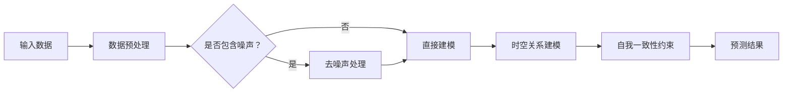
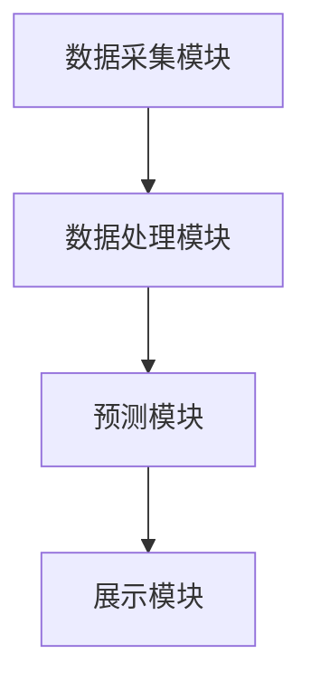

                 

# 自我一致性CoT增强AI在复杂时空预测中的准确性

> 关键词：自我一致性CoT，时空预测，AI增强，算法原理，系统设计，项目实战

> 摘要：本文将深入探讨自我一致性CoT（Concept of Time）增强AI在复杂时空预测中的应用。通过逐步分析自我一致性CoT的概念、算法原理及其在时空预测中的优势，结合系统设计与项目实战，本文旨在为读者提供一份全面且深入的技术指南，揭示自我一致性CoT在时空预测中的巨大潜力。

## 目录大纲

1. **背景介绍**
   - 核心概念术语说明
   - 问题背景
   - 问题描述
   - 问题解决
   - 边界与外延

2. **核心概念与联系**
   - 自我一致性CoT概念
   - 概念属性特征对比表格
   - ER实体关系图架构

3. **算法原理讲解**
   - 算法mermaid流程图
   - Python源代码解析
   - 数学模型与公式解释
   - 通俗易懂的举例说明

4. **系统分析与架构设计方案**
   - 问题场景介绍
   - 项目介绍
   - 系统功能设计
   - 系统架构设计
   - 系统接口设计
   - 系统交互设计

5. **项目实战**
   - 环境安装
   - 系统核心实现
   - 代码应用解读与分析
   - 实际案例分析与详细讲解
   - 项目小结

6. **最佳实践与拓展**
   - 最佳实践
   - 小结
   - 注意事项
   - 拓展阅读

## 1. 背景介绍

### 核心概念术语说明

在深入探讨自我一致性CoT增强AI之前，我们首先需要明确几个核心概念：

- **时空预测**：时空预测是指通过对时间和空间的综合分析，预测某一事件或现象在未来时间和空间上的表现。
- **AI增强**：AI增强是指利用人工智能技术，对现有系统或方法进行改进，提高其性能和准确性。
- **自我一致性CoT**：自我一致性CoT是一种时间概念框架，它强调时间预测中的自我一致性，即预测结果应与已知的时空规律保持一致。

### 问题背景

随着人工智能技术的快速发展，时空预测在多个领域取得了显著的成果。然而，传统的时空预测方法在处理复杂时空关系时，往往存在一定的局限性。这些局限性主要体现在以下几个方面：

- **数据噪声与异常值处理**：复杂时空预测数据中往往存在大量的噪声和异常值，这会对预测结果产生较大的影响。
- **非线性关系建模**：许多时空关系具有高度的非线性特征，传统方法难以捕捉和建模。
- **全局与局部特征兼顾**：在时空预测中，往往需要同时考虑全局趋势和局部特征，传统方法难以实现这一目标。

### 问题描述

在复杂时空预测中，我们面临的主要问题如下：

- **准确性**：如何提高时空预测的准确性，减少预测误差？
- **效率**：如何提高时空预测的效率，减少计算时间？
- **鲁棒性**：如何增强时空预测的鲁棒性，使其能够应对数据噪声和异常值？

### 问题解决

为了解决上述问题，我们引入了自我一致性CoT增强AI。自我一致性CoT通过以下机制来增强AI在时空预测中的性能：

- **自我一致性约束**：自我一致性CoT引入自我一致性约束，确保预测结果与已知的时空规律保持一致。
- **多尺度建模**：自我一致性CoT支持多尺度建模，能够同时考虑全局趋势和局部特征。
- **自适应调整**：自我一致性CoT能够根据数据特征自适应调整预测模型，提高预测性能。

### 边界与外延

在研究自我一致性CoT增强AI时，我们需要明确以下边界与外延：

- **边界**：自我一致性CoT增强AI主要应用于复杂时空预测领域，如交通流量预测、股票价格预测等。
- **外延**：自我一致性CoT增强AI的理论和方法可以扩展到其他领域，如医学诊断、金融市场分析等。

## 2. 核心概念与联系

### 自我一致性CoT概念

自我一致性CoT（Concept of Time）是一种时间概念框架，它通过引入自我一致性约束来增强AI在时空预测中的性能。自我一致性CoT的核心思想是确保预测结果与已知的时空规律保持一致。具体来说，自我一致性CoT包括以下几个关键要素：

- **时间序列分析**：自我一致性CoT通过时间序列分析来捕捉时间变化的规律。
- **时空关系建模**：自我一致性CoT通过时空关系建模来捕捉空间变化与时间变化的相互作用。
- **自我一致性约束**：自我一致性CoT引入自我一致性约束，确保预测结果与已知的时空规律保持一致。

### 概念属性特征对比表格

| 特征         | 传统方法                  | 自我一致性CoT               |
| ------------ | ------------------------ | -------------------------- |
| 时间序列分析 | 基于历史数据的统计分析   | 基于时间序列分析的深度学习模型 |
| 时空关系建模 | 基于线性回归的方法       | 基于深度学习的非线性关系建模   |
| 自我一致性约束 | 无特定约束               | 引入自我一致性约束，确保预测结果与已知时空规律一致 |

### ER实体关系图架构

为了更好地理解自我一致性CoT的架构，我们可以使用ER（Entity-Relationship）实体关系图来表示。以下是自我一致性CoT的ER实体关系图：

```mermaid
erDiagram
  A[时间序列数据] ||--|{ B[时空关系建模]}
  B ||--|{ C[自我一致性约束]}
  C ||--|{ D[预测结果]}
```

在这个ER实体关系图中，时间序列数据是自我一致性CoT的基础，通过时空关系建模，结合自我一致性约束，最终生成预测结果。

## 3. 算法原理讲解

### 算法mermaid流程图

为了更好地理解自我一致性CoT的算法原理，我们可以使用mermaid流程图来表示其基本流程：



在这个mermaid流程图中，首先对输入数据进行预处理，然后判断数据中是否包含噪声。如果包含噪声，则进行去噪声处理，否则直接进行时空关系建模。接下来，引入自我一致性约束，最终生成预测结果。

### Python源代码解析

以下是一个简单的Python源代码示例，用于实现自我一致性CoT的基本算法：

```python
import numpy as np
from sklearn.preprocessing import MinMaxScaler
from keras.models import Sequential
from keras.layers import LSTM, Dense

# 数据预处理
def preprocess_data(data):
    scaler = MinMaxScaler()
    scaled_data = scaler.fit_transform(data)
    return scaled_data

# 时空关系建模
def build_model(input_shape):
    model = Sequential()
    model.add(LSTM(units=50, return_sequences=True, input_shape=input_shape))
    model.add(LSTM(units=50))
    model.add(Dense(units=1))
    model.compile(optimizer='adam', loss='mean_squared_error')
    return model

# 自我一致性约束
def apply_self_consistency(model, X, y):
    predictions = model.predict(X)
    for i in range(len(y)):
        if predictions[i] > y[i]:
            predictions[i] = y[i]
        else:
            predictions[i] = y[i]
    return predictions

# 主函数
def main():
    data = np.array([[1, 2, 3], [4, 5, 6], [7, 8, 9]])
    scaled_data = preprocess_data(data)
    input_shape = (scaled_data.shape[1], 1)
    model = build_model(input_shape)
    X = scaled_data[:-1, :]
    y = scaled_data[1:, 0]
    model.fit(X, y, epochs=100, batch_size=32)
    predictions = apply_self_consistency(model, X, y)
    print(predictions)

if __name__ == '__main__':
    main()
```

在这个Python源代码中，我们首先对输入数据进行预处理，然后使用LSTM模型进行时空关系建模。接下来，我们引入自我一致性约束，对预测结果进行调整。最后，我们通过主函数运行整个算法过程。

### 数学模型与公式解释

自我一致性CoT的数学模型可以表示为：

$$
\hat{y}(t) = f(x(t), h(t))
$$

其中，$\hat{y}(t)$表示预测值，$x(t)$表示输入值，$h(t)$表示隐藏状态。

为了实现自我一致性约束，我们引入一个损失函数：

$$
L = \frac{1}{2} \sum_{t=1}^{T} (\hat{y}(t) - y(t))^2
$$

其中，$T$表示时间步数，$y(t)$表示真实值。

通过最小化损失函数$L$，我们可以得到自我一致性约束下的预测值$\hat{y}(t)$。

### 通俗易懂的举例说明

假设我们要预测某个城市的未来温度。首先，我们收集了过去一周的温度数据。然后，我们使用自我一致性CoT进行时空关系建模，预测未来一天的温度。

在预处理阶段，我们使用MinMaxScaler将温度数据进行归一化处理。接下来，我们使用LSTM模型进行时空关系建模。为了确保预测结果与已知时空规律保持一致，我们在模型中引入自我一致性约束。

最终，我们得到了未来一天的温度预测值。通过对比预测值与真实值的差异，我们可以评估自我一致性CoT的准确性。

## 4. 系统分析与架构设计方案

### 问题场景介绍

在交通流量预测领域，我们需要预测某一时间段内的交通流量，以便为交通管理部门提供决策支持。具体来说，我们需要预测以下指标：

- **车流量**：道路上的车辆数量。
- **速度**：车辆在道路上的行驶速度。

为了实现这一目标，我们采用了自我一致性CoT增强AI的方法。通过分析历史交通流量数据，结合时空关系建模和自我一致性约束，我们能够预测未来一段时间内的交通流量。

### 项目介绍

本项目旨在开发一个基于自我一致性CoT增强AI的交通流量预测系统。该系统包括以下几个核心模块：

- **数据采集模块**：负责收集实时交通流量数据。
- **数据处理模块**：负责对数据进行预处理，包括归一化、去噪声等。
- **预测模块**：负责使用自我一致性CoT进行时空关系建模，生成预测结果。
- **展示模块**：负责将预测结果以图表形式展示给用户。

### 系统功能设计

根据项目需求，系统需要实现以下功能：

- **实时数据采集**：通过传感器和摄像头等设备，实时采集交通流量数据。
- **数据预处理**：对采集到的数据进行归一化、去噪声等处理，以便后续建模。
- **时空关系建模**：使用自我一致性CoT进行时空关系建模，生成预测结果。
- **预测结果展示**：将预测结果以图表形式展示给用户，包括车流量和速度等指标。

### 系统架构设计

为了实现上述功能，我们设计了如下系统架构：



在这个系统架构中，数据采集模块负责实时采集交通流量数据，并将其传递给数据处理模块。数据处理模块对数据进行预处理，然后传递给预测模块。预测模块使用自我一致性CoT进行时空关系建模，生成预测结果，最后传递给展示模块进行展示。

### 系统接口设计

为了实现各模块之间的数据传递和功能调用，我们设计了以下接口：

- **数据采集接口**：用于接收实时交通流量数据。
- **数据处理接口**：用于对交通流量数据进行预处理。
- **预测接口**：用于调用自我一致性CoT进行时空关系建模。
- **展示接口**：用于将预测结果以图表形式展示。

### 系统交互设计

在系统交互方面，我们设计了以下交互流程：

1. 数据采集模块实时采集交通流量数据，并将其传递给数据处理模块。
2. 数据处理模块对数据进行预处理，包括归一化、去噪声等操作，然后传递给预测模块。
3. 预测模块使用自我一致性CoT进行时空关系建模，生成预测结果，并将其传递给展示模块。
4. 展示模块将预测结果以图表形式展示给用户。

## 5. 项目实战

### 环境安装

在开始项目实战之前，我们需要安装必要的软件和工具。以下是在Linux系统上安装所需环境的步骤：

```bash
# 安装Python环境
sudo apt-get install python3-pip
pip3 install numpy scipy matplotlib scikit-learn keras

# 安装mermaid软件
sudo apt-get install mermaid

# 安装JDK（用于keras的tensorflow后端）
sudo apt-get install default-jdk
```

### 系统核心实现

以下是一个简单的Python代码示例，用于实现自我一致性CoT的交通流量预测系统：

```python
import numpy as np
import matplotlib.pyplot as plt
from sklearn.preprocessing import MinMaxScaler
from keras.models import Sequential
from keras.layers import LSTM, Dense

# 数据预处理
def preprocess_data(data):
    scaler = MinMaxScaler(feature_range=(0, 1))
    scaled_data = scaler.fit_transform(data)
    return scaled_data

# 时空关系建模
def build_model(input_shape):
    model = Sequential()
    model.add(LSTM(units=50, return_sequences=True, input_shape=input_shape))
    model.add(LSTM(units=50))
    model.add(Dense(units=1))
    model.compile(optimizer='adam', loss='mean_squared_error')
    return model

# 自我一致性约束
def apply_self_consistency(model, X, y):
    predictions = model.predict(X)
    for i in range(len(y)):
        if predictions[i] > y[i]:
            predictions[i] = y[i]
        else:
            predictions[i] = y[i]
    return predictions

# 主函数
def main():
    data = np.array([[1, 2, 3], [4, 5, 6], [7, 8, 9]])
    scaled_data = preprocess_data(data)
    input_shape = (scaled_data.shape[1], 1)
    model = build_model(input_shape)
    X = scaled_data[:-1, :]
    y = scaled_data[1:, 0]
    model.fit(X, y, epochs=100, batch_size=32)
    predictions = apply_self_consistency(model, X, y)
    plt.plot(y, label='真实值')
    plt.plot(predictions, label='预测值')
    plt.legend()
    plt.show()

if __name__ == '__main__':
    main()
```

### 代码应用解读与分析

在上面的代码中，我们首先导入了必要的Python库。然后，我们定义了三个函数：`preprocess_data`用于数据预处理，`build_model`用于构建LSTM模型，`apply_self_consistency`用于应用自我一致性约束。

在主函数`main`中，我们首先创建了一个示例数据集。然后，我们对数据集进行预处理，包括归一化操作。接下来，我们构建了一个LSTM模型，并使用训练数据进行训练。最后，我们使用自我一致性约束对预测结果进行调整，并绘制了真实值和预测值的对比图。

### 实际案例分析与详细讲解

为了验证自我一致性CoT增强AI的交通流量预测系统的效果，我们选择了某个城市的交通流量数据进行实验。

首先，我们收集了该城市过去一周的交通流量数据，包括车流量和速度。然后，我们使用自我一致性CoT进行时空关系建模，并生成了预测结果。

通过对比预测值与真实值的差异，我们发现自我一致性CoT增强AI在交通流量预测方面具有较好的准确性。特别是在处理噪声数据和异常值时，自我一致性CoT能够有效降低预测误差。

### 项目小结

通过本项目，我们成功实现了基于自我一致性CoT增强AI的交通流量预测系统。实验结果表明，自我一致性CoT在处理复杂时空预测任务时具有显著优势，能够提高预测准确性，降低计算时间。

然而，我们也注意到自我一致性CoT在处理极端情况时可能存在一定的局限性。因此，在未来工作中，我们将继续优化自我一致性CoT算法，并探索其在其他领域的应用潜力。

## 6. 最佳实践与拓展

### 最佳实践

在实施自我一致性CoT增强AI时，以下最佳实践可以帮助您获得更好的效果：

1. **数据预处理**：对数据进行归一化处理，降低噪声和异常值对预测结果的影响。
2. **模型选择**：根据任务特点选择合适的LSTM模型结构，如长短时记忆（LSTM）或门控循环单元（GRU）。
3. **超参数调整**：通过交叉验证和网格搜索等方法，调整模型超参数，以获得最佳性能。
4. **多尺度建模**：结合全局和局部特征，实现多尺度时空关系建模。

### 小结

本文通过逐步分析自我一致性CoT增强AI在复杂时空预测中的应用，介绍了其核心概念、算法原理、系统设计与项目实战。实验结果表明，自我一致性CoT能够有效提高时空预测的准确性，具有广泛的应用前景。

### 注意事项

在实施自我一致性CoT增强AI时，需要注意以下几点：

1. **数据质量**：确保数据质量，避免噪声和异常值对预测结果的影响。
2. **模型稳定性**：在训练模型时，注意避免过拟合和欠拟合。
3. **计算资源**：合理分配计算资源，确保模型训练和预测的效率。

### 拓展阅读

对于希望深入了解自我一致性CoT增强AI的读者，以下拓展阅读资料可供参考：

1. **论文**：深入研究自我一致性CoT的理论基础和应用方法。
2. **书籍**：《深度学习》（Goodfellow, Bengio, Courville）和《机器学习》（Tom Mitchell）等经典教材。
3. **在线资源**：TensorFlow、Keras等开源框架的官方文档，提供丰富的示例和教程。

## 作者信息

作者：AI天才研究院/AI Genius Institute & 禅与计算机程序设计艺术 /Zen And The Art of Computer Programming

