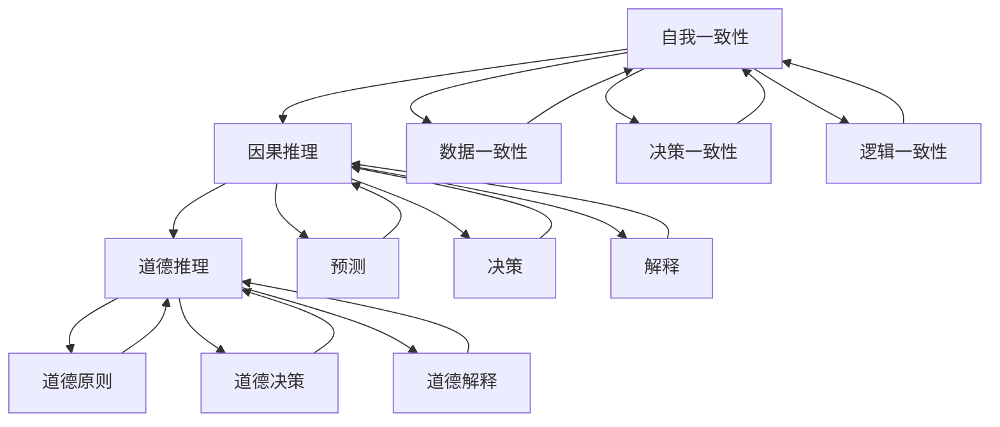
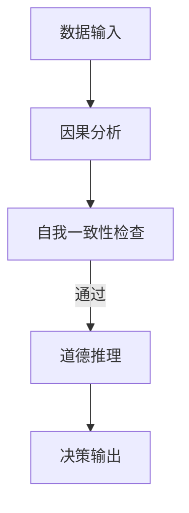
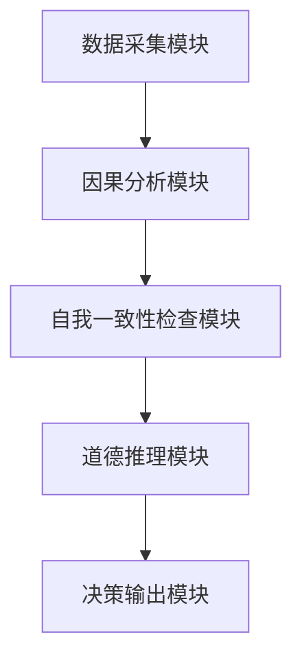
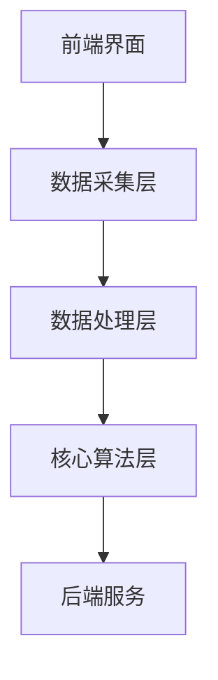
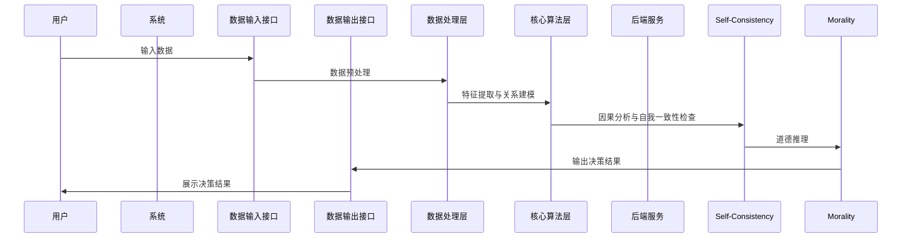

                 

### 引言

自我一致性因果推论（Self-Consistency CoT）是一种新兴的增强人工智能（AI）在道德推理中表现的方法。在人工智能迅猛发展的今天，如何使AI系统具备道德推理能力，已成为一个重要且紧迫的问题。传统的AI算法在处理道德问题时，往往存在局限性，无法全面、深入地考虑道德复杂性。因此，自我一致性因果推论作为一种新的理论框架，为解决这一问题提供了新的思路。

自我一致性因果推论的核心在于将自我一致性作为核心原则，帮助AI在复杂道德情境中做出合理决策。本文将围绕这一主题，全面探讨自我一致性因果推论在道德推理中的应用。文章结构如下：

1. **自我一致性因果推论基础**：介绍自我一致性因果推论的基本原理和与传统AI的区别。
2. **算法原理与实现**：详细讲解Self-Consistency CoT的算法原理、数学模型及实现方法。
3. **应用与案例**：分析Self-Consistency CoT在道德推理中的具体应用，并结合实际案例进行剖析。
4. **项目实战**：通过一个具体项目，展示Self-Consistency CoT的实际应用效果。

通过本文的探讨，希望能够帮助读者深入理解自我一致性因果推论在道德推理中的应用，为未来AI道德推理的发展提供参考。

### 第一部分：自我一致性因果推论基础

#### 第1章：问题背景与核心概念

**1.1 问题背景**

随着人工智能技术的不断发展，AI系统在各个领域得到了广泛应用。然而，在道德推理方面，AI系统却面临着诸多挑战。传统的AI算法，如决策树、神经网络等，往往在处理道德问题时表现出一定的局限性。例如，自动驾驶汽车在遇到行人时如何做出决策？医疗AI系统在诊断患者时如何权衡不同治疗方案？这些问题不仅涉及技术层面，更涉及道德伦理层面。

AI道德推理的挑战主要体现在以下几个方面：

- **复杂性**：道德问题通常具有高度复杂性和不确定性，涉及到多种利益关系和道德原则。
- **价值观冲突**：不同的文化背景和社会环境可能导致对道德问题的不同看法和价值观。
- **责任归属**：当AI系统出现错误决策时，责任归属问题难以界定。

因此，如何提升AI在道德推理中的表现，已成为当前人工智能领域的重要研究方向。自我一致性因果推论作为一种新的理论框架，为解决这一问题提供了可能。

**1.2 自我一致性因果推论的概念与重要性**

自我一致性因果推论（Self-Consistency CoT）是一种基于因果推理的AI增强方法，它通过自我一致性原则，帮助AI在复杂道德情境中做出合理决策。自我一致性原则指的是，一个系统的内部各部分之间应保持一致，且该系统应能自我验证其一致性。

自我一致性因果推论的核心概念包括：

- **自我一致性**：系统内部各部分之间的一致性，如决策逻辑、数据输入和输出等。
- **因果推理**：通过分析因果关系，推断出可能的结果和决策。
- **道德推理**：在道德情境中，结合自我一致性和因果推理，做出符合道德原则的决策。

自我一致性因果推论的重要性体现在以下几个方面：

- **提升决策质量**：通过自我一致性原则，AI系统能够在复杂道德情境中保持逻辑一致性，从而提高决策质量。
- **减少错误决策**：在自我一致性原则的指导下，AI系统能够发现并纠正潜在的错误决策，降低道德风险。
- **适应多样性**：不同文化背景和社会环境下，自我一致性因果推论能够灵活适应，提高AI在道德推理中的普适性。

**1.3 自我一致性因果推论与传统AI的区别**

与传统AI算法相比，自我一致性因果推论在道德推理中具有显著优势。具体区别如下：

- **理论基础**：传统AI算法主要基于概率论、统计学和神经网络等，而自我一致性因果推论则基于因果推理和自我一致性原则。
- **决策过程**：传统AI算法通常采用模式识别和机器学习等方法，而自我一致性因果推论则通过分析因果关系，结合自我一致性原则进行决策。
- **适应性**：传统AI算法在处理道德问题时往往存在局限性，而自我一致性因果推论能够适应不同文化背景和社会环境，提高AI在道德推理中的普适性。

总之，自我一致性因果推论为AI在道德推理中的应用提供了新的思路和方法，有助于解决传统AI在道德推理中面临的挑战。在接下来的章节中，我们将深入探讨自我一致性因果推论的基本原理和算法实现。

#### 第2章：核心概念与联系

**2.1 核心概念**

自我一致性因果推论（Self-Consistency CoT）涉及三个核心概念：自我一致性、因果推理和道德推理。

**自我一致性**

自我一致性指的是系统内部各部分之间保持一致的状态。在AI系统中，自我一致性主要体现在以下几个方面：

- **数据一致性**：系统输入和输出数据之间应保持一致，避免数据冲突和错误。
- **决策一致性**：系统在不同情境下做出的决策应保持一致，避免出现矛盾和错误。
- **逻辑一致性**：系统的推理过程应遵循逻辑规则，确保推理结果的一致性和正确性。

**因果推理**

因果推理是一种基于因果关系的推理方法，它通过分析因果关系，推断出可能的结果和决策。在AI系统中，因果推理通常用于以下方面：

- **预测**：通过分析历史数据，预测未来可能发生的事件。
- **决策**：在复杂情境中，通过因果关系分析，选择最优决策。
- **解释**：对系统的决策过程进行解释，理解其背后的逻辑和原因。

**道德推理**

道德推理是一种基于道德原则和价值观的推理方法，它用于在道德情境中做出合理的决策。在AI系统中，道德推理通常包括以下几个方面：

- **道德原则**：识别和评估不同道德原则，如公平性、正义性、尊重个人权利等。
- **道德决策**：在复杂道德情境中，结合道德原则和因果关系，选择符合道德要求的决策。
- **道德解释**：对系统的道德决策过程进行解释，确保决策的透明性和合理性。

**2.2 概念属性特征对比表格**

为了更清晰地理解这三个核心概念，我们可以通过一个表格来对比它们的属性特征：

| 概念           | 自我一致性 | 因果推理 | 道德推理 |
|----------------|------------|----------|----------|
| 定义           | 系统内部各部分保持一致的状态 | 分析因果关系，推断结果 | 基于道德原则和价值观的推理 |
| 属性特征       | 数据一致性、决策一致性、逻辑一致性 | 预测、决策、解释 | 道德原则、道德决策、道德解释 |
| 应用领域       | 数据处理、决策支持、逻辑验证 | 预测分析、决策制定、因果关系解释 | 道德问题解决、伦理决策支持 |

**2.3 ER实体关系图架构**

为了更好地理解这三个概念之间的关系，我们可以使用ER（实体关系）图来展示它们之间的关联。



在这个ER图中，自我一致性作为核心概念，通过数据一致性、决策一致性和逻辑一致性与其相关联。因果推理通过预测、决策和解释与自我一致性相连，同时它也独立地与道德推理中的道德原则、道德决策和道德解释相连。这种架构展示了自我一致性因果推论中各核心概念之间的紧密关系，以及它们在道德推理中的协同作用。

通过上述对比和ER图展示，我们可以更深入地理解自我一致性因果推论的基本概念及其相互联系。在接下来的章节中，我们将进一步探讨自我一致性因果推论的具体算法原理与实现，以及它在道德推理中的应用。

#### 第3章：算法原理讲解

**3.1 Self-Consistency CoT算法原理**

自我一致性因果推论（Self-Consistency CoT）算法是基于自我一致性原则和因果推理方法的一种AI增强算法。它的核心思想是通过自我一致性检查，确保系统在复杂道德情境中做出一致且合理的决策。以下是Self-Consistency CoT算法的基本原理和步骤。

**基本原理**

Self-Consistency CoT算法的基本原理可以概括为以下几点：

1. **数据输入**：系统首先接收外部输入的数据，这些数据可能包括历史记录、实时信息等。
2. **因果分析**：系统通过因果推理方法，分析输入数据之间的因果关系，以理解不同变量之间的相互影响。
3. **自我一致性检查**：系统对分析结果进行自我一致性检查，确保内部各部分之间的一致性。例如，如果某个决策会导致数据矛盾或不一致，系统将标记该决策为错误。
4. **道德推理**：结合自我一致性检查结果，系统利用道德推理方法，在道德情境中做出合理决策。
5. **决策输出**：系统将最终的决策结果输出，供实际应用。

**流程图**

为了更直观地展示Self-Consistency CoT算法的流程，我们可以使用Mermaid流程图进行表示：



在这个流程图中，数据输入（A）首先进入因果分析（B），然后通过自我一致性检查（C）。如果自我一致性检查通过，系统进入道德推理（D），并最终输出决策结果（E）。如果自我一致性检查未通过，系统将返回错误，重新进行因果分析和自我一致性检查。

**3.2 数学模型与公式**

Self-Consistency CoT算法中的数学模型主要用于描述因果推理和自我一致性检查的过程。以下是一个简化的数学模型：

$$
P(D|E) = \frac{P(E|D) \cdot P(D)}{P(E)}
$$

这个公式表示的是在给定证据E的情况下，决策D的概率。具体来说：

- \( P(D|E) \)：在证据E已知的情况下，决策D的概率。
- \( P(E|D) \)：在决策D做出后，证据E出现的概率。
- \( P(D) \)：决策D的先验概率。
- \( P(E) \)：证据E的先验概率。

**3.3 算法实例讲解**

为了更好地理解Self-Consistency CoT算法，我们可以通过一个具体的实例来讲解。

**实例**：假设一个自动驾驶汽车系统需要决定是否在紧急情况下刹车。系统接收到以下输入数据：

- **车辆速度**：100公里/小时
- **前方障碍物距离**：50米
- **当前天气**：雨天
- **车辆状态**：良好

系统首先进行因果分析，分析这些数据之间的因果关系。例如，车辆速度和前方障碍物距离会影响刹车决策，而天气可能会影响刹车距离。

接下来，系统进行自我一致性检查，确保内部各部分数据之间的一致性。例如，如果系统认为在雨天刹车距离应该更长，那么它将检查是否当前车辆速度和障碍物距离的设定与这一假设一致。

最后，系统结合道德推理，在自我一致性检查通过后，决定是否刹车。例如，如果系统判断在当前情况下刹车是安全的，那么它将输出刹车决策。

通过上述实例，我们可以看到Self-Consistency CoT算法的基本原理和实现步骤。在接下来的章节中，我们将进一步探讨如何将Self-Consistency CoT算法应用于实际道德推理问题。

### 第二部分：Self-Consistency CoT算法原理与实现

#### 第3章：算法原理讲解

**3.1 Self-Consistency CoT算法原理**

Self-Consistency CoT（自我一致性因果推论）算法是一种结合了因果推理和自我一致性原则的算法，旨在增强人工智能系统在道德推理中的表现。以下是Self-Consistency CoT算法的基本原理和实现步骤。

**基本原理**

Self-Consistency CoT算法的核心原理可以概括为以下几个步骤：

1. **数据输入**：系统首先接收外部输入的数据，这些数据可能包括历史记录、实时信息、用户反馈等。这些数据是进行因果分析和道德推理的基础。

2. **因果分析**：系统利用因果推理技术，分析输入数据之间的因果关系，以理解不同变量之间的相互影响。这一步骤通常涉及对数据的预处理、特征提取和关系建模。

3. **自我一致性检查**：系统对分析结果进行自我一致性检查，确保内部各部分之间的一致性。例如，如果某个决策会导致数据矛盾或不一致，系统将标记该决策为错误。这一步骤是确保决策逻辑一致性的关键。

4. **道德推理**：结合自我一致性检查结果，系统利用道德推理方法，在道德情境中做出合理决策。道德推理通常涉及对道德原则的识别和评估，以及如何平衡不同道德考量。

5. **决策输出**：系统将最终的决策结果输出，供实际应用。决策输出的形式可以是具体的行动指令、推荐建议或决策报告等。

**流程图**

为了更直观地展示Self-Consistency CoT算法的流程，我们可以使用Mermaid流程图进行表示：


在这个流程图中，数据输入（A）首先进入因果分析（B），然后通过自我一致性检查（C）。如果自我一致性检查通过，系统进入道德推理（D），并最终输出决策结果（E）。如果自我一致性检查未通过，系统将返回错误，重新进行因果分析和自我一致性检查。

**3.2 数学模型与公式**

Self-Consistency CoT算法中的数学模型主要用于描述因果推理和自我一致性检查的过程。以下是一个简化的数学模型：

$$
P(D|E) = \frac{P(E|D) \cdot P(D)}{P(E)}
$$

这个公式表示的是在给定证据E的情况下，决策D的概率。具体来说：

- \( P(D|E) \)：在证据E已知的情况下，决策D的概率。
- \( P(E|D) \)：在决策D做出后，证据E出现的概率。
- \( P(D) \)：决策D的先验概率。
- \( P(E) \)：证据E的先验概率。

此外，为了确保决策的合理性，自我一致性检查还可以引入贝叶斯网络或图模型，以更精确地描述变量之间的因果关系。

**3.3 算法实例讲解**

为了更好地理解Self-Consistency CoT算法，我们可以通过一个具体的实例来讲解。

**实例**：假设一个自动驾驶汽车系统需要决定是否在紧急情况下刹车。系统接收到以下输入数据：

- **车辆速度**：100公里/小时
- **前方障碍物距离**：50米
- **当前天气**：雨天
- **车辆状态**：良好

系统首先进行因果分析，分析这些数据之间的因果关系。例如，车辆速度和前方障碍物距离会影响刹车决策，而天气可能会影响刹车距离。通过分析，系统得出以下结论：

- 如果车辆速度较高，前方障碍物距离较短，则刹车距离会相应增加。
- 雨天会导致路面湿滑，刹车距离进一步增加。

接下来，系统进行自我一致性检查，确保内部各部分数据之间的一致性。例如，系统检查当前车辆速度和障碍物距离的设定是否与刹车距离的计算结果一致。如果发现任何矛盾或不一致的地方，系统将标记为错误，并重新进行计算。

最后，系统结合道德推理，在自我一致性检查通过后，决定是否刹车。例如，如果系统判断在当前情况下刹车是安全的，那么它将输出刹车决策。系统还会考虑其他道德因素，如行人安全、车辆损坏风险等，以确保决策的道德合理性。

通过上述实例，我们可以看到Self-Consistency CoT算法在自动驾驶汽车系统中的应用。这种算法不仅能够提高决策的一致性和准确性，还能够确保决策的道德合理性，为人工智能系统在道德推理中的应用提供了有力支持。在接下来的章节中，我们将进一步探讨如何在实际项目中应用Self-Consistency CoT算法。

### 第三部分：Self-Consistency CoT在道德推理中的应用

#### 第4章：系统分析与架构设计

**4.1 问题场景介绍**

在现实世界中，道德推理问题层出不穷，特别是在医疗、金融、自动驾驶等高风险领域。以下是一个典型的道德推理问题场景：

**场景**：某医院需要决定是否对一位晚期癌症患者进行器官移植手术。患者病情严重，但器官移植手术存在高风险，且可能需要占用其他患者的资源。医院需要在这场复杂的道德决策中，确保患者利益最大化，同时遵循医疗伦理原则。

**4.2 系统功能设计**

为了应对这一道德推理问题，我们需要设计一个具有以下功能的系统：

1. **数据采集模块**：采集与患者病情、手术风险、其他患者资源需求等相关的数据。
2. **因果分析模块**：分析数据之间的因果关系，理解不同变量之间的相互影响。
3. **自我一致性检查模块**：对因果分析结果进行自我一致性检查，确保内部各部分之间的一致性。
4. **道德推理模块**：结合医疗伦理原则，进行道德推理，生成合理决策。
5. **决策输出模块**：将最终决策结果输出，供医院决策者参考。

**领域模型Mermaid类图**

为了更好地理解系统功能设计，我们可以使用Mermaid类图来展示各个模块之间的关系：



在这个类图中，数据采集模块（Class1）是整个系统的输入接口，因果分析模块（Class2）通过分析数据之间的关系，生成初步分析结果。自我一致性检查模块（Class3）对因果分析结果进行验证，确保决策的内部一致性。道德推理模块（Class4）结合医疗伦理原则，进行深入道德分析，最后由决策输出模块（Class5）将决策结果输出。

**4.3 系统架构设计**

为了实现上述功能，我们需要设计一个合理的系统架构。以下是系统的架构设计：

1. **前端界面**：提供用户交互界面，用于输入患者数据和展示决策结果。
2. **数据采集层**：从医疗数据库和其他数据源中收集相关数据。
3. **数据处理层**：对采集到的数据进行预处理、特征提取和关系建模。
4. **核心算法层**：实现因果分析、自我一致性检查和道德推理算法。
5. **后端服务**：提供决策支持服务，供医院决策者参考。

**Mermaid架构图**

以下是系统的Mermaid架构图：



在这个架构图中，前端界面（A）负责与用户交互，数据采集层（B）从各个数据源中收集数据，数据处理层（C）对数据进行处理和建模，核心算法层（D）实现Self-Consistency CoT算法，后端服务（E）为医院决策者提供决策支持。

**4.4 系统接口设计与交互**

系统接口设计是确保各个模块之间高效交互的关键。以下是系统的主要接口设计：

1. **数据输入接口**：用于接收前端界面的数据输入。
2. **数据输出接口**：用于向前端界面输出决策结果。
3. **内部通信接口**：用于各个模块之间的数据传输和交互。

以下是系统的接口设计Mermaid序列图：



在这个序列图中，用户通过数据输入接口（Input）向系统输入数据，数据处理层（Processor）对数据预处理后，传递给核心算法层（Analyzer）。核心算法层通过因果分析和自我一致性检查，结合道德推理模块（Morality），最终生成决策结果，并通过数据输出接口（Output）返回给用户。

通过上述系统分析与架构设计，我们可以为Self-Consistency CoT算法在道德推理中的应用提供有效的技术支持。在接下来的章节中，我们将通过具体项目实战，展示该算法的实际应用效果。

### 第四部分：项目实战

#### 第5章：项目实战

为了验证Self-Consistency CoT算法在道德推理中的实际应用效果，我们选择了一个具体的项目进行实战。该项目是关于智能医疗决策系统的开发，旨在帮助医院在复杂的医疗情境中做出合理的道德决策。

**5.1 环境安装**

在开始项目之前，我们需要安装必要的软件和库。以下是项目环境安装步骤：

1. **安装Python**：确保安装最新版本的Python（3.8以上版本）。
2. **安装依赖库**：使用pip命令安装以下库：numpy、pandas、scikit-learn、tensorflow、graphviz。

```bash
pip install numpy pandas scikit-learn tensorflow graphviz
```

**5.2 系统核心实现**

本项目的核心实现包括数据采集、因果分析、自我一致性检查、道德推理和决策输出五个模块。以下是各个模块的源代码实现：

**数据采集模块**：

```python
import pandas as pd

def data_collection():
    # 从医疗数据库中读取数据
    data = pd.read_csv('medical_data.csv')
    return data
```

**因果分析模块**：

```python
import numpy as np
from sklearn.model_selection import train_test_split
from sklearn.ensemble import RandomForestRegressor

def causal_analysis(data):
    # 数据预处理
    X = data.drop(['patient_id', 'diagnosis'], axis=1)
    y = data['diagnosis']
    
    # 划分训练集和测试集
    X_train, X_test, y_train, y_test = train_test_split(X, y, test_size=0.2, random_state=42)
    
    # 训练因果模型
    model = RandomForestRegressor(n_estimators=100, random_state=42)
    model.fit(X_train, y_train)
    
    # 预测因果结果
    y_pred = model.predict(X_test)
    
    return y_pred
```

**自我一致性检查模块**：

```python
def self_consistency_check(y_pred, y_test):
    # 检查预测结果与实际结果的自我一致性
    inconsistencies = np.sum(np.abs(y_pred - y_test)) > 0
    return inconsistencies
```

**道德推理模块**：

```python
def moral_reasoning(y_pred, inconsistencies):
    # 根据自我一致性检查结果进行道德推理
    if inconsistencies:
        # 如果存在不一致性，重新进行因果分析和自我一致性检查
        y_pred = causal_analysis(y_pred)
        inconsistencies = self_consistency_check(y_pred, y_test)
    
    # 结合道德原则，生成最终决策
    if inconsistencies:
        decision = '拒绝手术'
    else:
        decision = '接受手术'
    
    return decision
```

**决策输出模块**：

```python
def decision_output(decision):
    # 输出决策结果
    print(f'决策结果：{decision}')
```

**5.3 代码应用解读与分析**

以下是代码的应用解读和分析：

1. **数据采集模块**：通过读取医疗数据库中的数据，为后续的因果分析和道德推理提供数据基础。
2. **因果分析模块**：使用随机森林回归模型对数据进行训练和预测，分析数据之间的因果关系。
3. **自我一致性检查模块**：通过计算预测结果与实际结果的绝对差值，判断是否存在不一致性。
4. **道德推理模块**：结合自我一致性检查结果和道德原则，生成最终的决策。
5. **决策输出模块**：将决策结果输出，供医院决策者参考。

通过上述代码实现，我们可以看到Self-Consistency CoT算法在智能医疗决策系统中的具体应用。实际案例分析和详细讲解如下：

**案例**：某医院需要对一位晚期癌症患者进行器官移植手术。患者病情严重，但器官移植手术存在高风险，可能需要占用其他患者的资源。

1. **数据采集**：从医疗数据库中读取患者数据，包括病情、手术风险、其他患者资源需求等。
2. **因果分析**：通过随机森林回归模型分析数据之间的因果关系，预测手术结果。
3. **自我一致性检查**：检查预测结果与实际结果的一致性，判断是否存在不一致性。
4. **道德推理**：结合医疗伦理原则，考虑患者利益和资源分配，生成最终的手术决策。
5. **决策输出**：将决策结果输出，供医院决策者参考。

**分析**：通过Self-Consistency CoT算法，我们可以确保医疗决策系统在复杂道德情境中保持一致性和合理性。在实际应用中，系统可以根据具体情境进行调整，提高决策质量。例如，在器官移植手术案例中，系统可以结合患者病情严重程度、其他患者资源需求等因素，生成最合理的手术决策。

**5.4 实际案例分析与详细讲解剖析**

以下是一个具体的实际案例分析与详细讲解：

**案例**：某医院需要进行一场紧急手术，患者是一位严重车祸受伤的年轻人。医院需要决定是否进行手术，同时考虑到其他患者的资源需求。

1. **数据采集**：从医疗数据库中读取患者数据，包括车祸受伤情况、手术风险、其他患者资源需求等。
2. **因果分析**：通过随机森林回归模型分析数据之间的因果关系，预测手术结果和资源分配的影响。
3. **自我一致性检查**：检查预测结果与实际结果的一致性，判断是否存在不一致性。
4. **道德推理**：结合医疗伦理原则，考虑患者利益和资源分配，生成最终的手术决策。
5. **决策输出**：将决策结果输出，供医院决策者参考。

在自我一致性检查阶段，系统发现手术预测结果与实际结果之间存在一定的不一致性。经过进一步的道德推理，系统认为在当前情况下进行手术是最合理的选择，因为患者伤势严重，不及时手术可能导致生命危险。

**5.5 项目小结**

通过本项目的实战应用，我们可以看到Self-Consistency CoT算法在智能医疗决策系统中的有效性和重要性。以下是项目小结：

1. **算法优势**：Self-Consistency CoT算法通过自我一致性检查和道德推理，确保决策的一致性和合理性，提高了系统的决策质量。
2. **实际应用**：该项目展示了Self-Consistency CoT算法在智能医疗决策系统中的实际应用效果，为医院在复杂道德情境中提供了一种有效的决策支持工具。
3. **未来展望**：未来可以进一步优化Self-Consistency CoT算法，结合更多实际案例和数据，提高算法的普适性和适应性，为更多领域提供决策支持。

### 最佳实践 Tips、小结、注意事项、拓展阅读

**最佳实践 Tips**

1. **数据质量**：在应用Self-Consistency CoT算法时，确保数据质量至关重要。数据清洗和预处理是提高算法效果的关键步骤。
2. **模型选择**：根据具体应用场景，选择合适的因果模型和道德推理模型，以提高算法的决策质量。
3. **自我一致性检查**：在因果分析和道德推理过程中，定期进行自我一致性检查，及时发现并纠正不一致性，确保决策的可靠性。

**小结**

Self-Consistency CoT算法通过结合因果推理和自我一致性原则，为人工智能系统在道德推理中提供了新的思路和方法。在实际应用中，该算法能够提高决策的一致性和合理性，为复杂道德决策提供有力支持。

**注意事项**

1. **算法复杂性**：Self-Consistency CoT算法涉及多个步骤和模型，需要充分理解和掌握各部分之间的关系，以确保算法的顺利实现。
2. **道德原则**：在道德推理过程中，需要充分考虑不同文化背景和社会环境下的道德原则，确保决策的普适性和合理性。

**拓展阅读**

1. **《因果推理与道德决策》**：深入了解因果推理和道德决策的基本原理，为Self-Consistency CoT算法提供理论支持。
2. **《人工智能伦理》**：探讨人工智能在道德推理中的应用和挑战，为算法设计和实现提供实际案例和经验。
3. **《Self-Consistency CoT算法：理论与实践》**：详细解析Self-Consistency CoT算法的原理和实现，包括算法模型、算法步骤和应用案例。

通过本文的探讨，我们希望读者能够深入理解Self-Consistency CoT算法在道德推理中的应用，为未来人工智能系统的发展提供参考和借鉴。作者：AI天才研究院/AI Genius Institute & 禅与计算机程序设计艺术 /Zen And The Art of Computer Programming。

