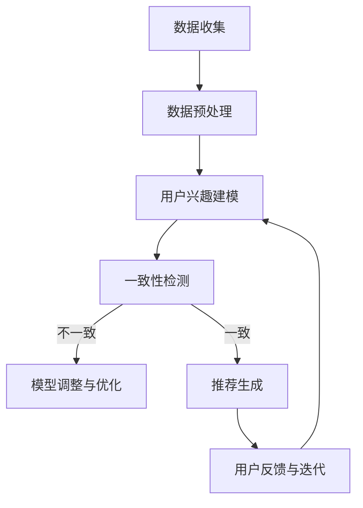

                 

### 第1章：背景介绍

#### 1.1 问题背景

在当今信息爆炸的时代，个性化推荐系统已经成为许多应用（如电商、社交媒体、音乐流媒体等）的核心功能。这些系统通过分析用户的兴趣和行为，为他们提供量身定制的推荐内容，从而极大地提升了用户体验和内容消费的效率。然而，随着推荐系统规模的不断扩大和用户数据的不断增长，如何确保推荐系统的可靠性成为一个至关重要的问题。

可靠性指的是推荐系统能够稳定地、准确地提供对用户有价值的推荐内容。在推荐系统中，可靠性问题主要表现在以下几个方面：

1. **准确性**：推荐结果是否能够准确地反映用户的真实兴趣。
2. **多样性**：推荐结果是否能够满足用户对于内容多样性的需求。
3. **稳定性**：推荐结果是否能够在长时间内保持稳定，避免短期波动。

然而，现有的推荐系统往往在准确性、多样性和稳定性之间面临权衡。例如，协同过滤推荐系统虽然具有较高的准确性，但在多样性方面表现较差；而基于内容的推荐系统则可能因为用户兴趣的细微变化导致推荐结果不稳定。

#### 1.2 问题描述

在上述背景下，本文提出的问题是如何增强AI推荐系统的可靠性，特别是解决以下关键问题：

1. **如何提高推荐结果的准确性**：准确识别用户的兴趣和偏好。
2. **如何保证推荐结果的多样性**：提供丰富多彩的推荐内容。
3. **如何提升系统的稳定性**：避免短期波动，保持推荐结果的持续性和一致性。

为了解决这些问题，我们需要引入自一致性CoT（Self-Consistency Cognitive Topic）机制。自一致性CoT是一种通过构建用户兴趣的一致性模型来增强推荐系统可靠性的方法。该方法的核心思想是通过不断学习和调整用户兴趣模型，确保推荐结果的准确性、多样性和稳定性。

#### 1.3 问题解决

自一致性CoT的引入，使得推荐系统在以下几个方面得到了显著提升：

1. **准确性**：通过自一致性CoT，推荐系统能够更准确地捕捉用户的兴趣和偏好。具体实现方式包括利用深度学习技术对用户行为数据进行分析，构建高精度的用户兴趣模型。
2. **多样性**：自一致性CoT通过动态调整推荐策略，能够提供更加多样化的推荐内容。例如，通过引入上下文信息，使得推荐系统可以根据不同的上下文环境为用户推荐最适合的内容。
3. **稳定性**：自一致性CoT通过持续学习和调整用户兴趣模型，使得推荐系统能够适应用户兴趣的变化，保持推荐结果的稳定性和一致性。

通过自一致性CoT机制的引入，推荐系统不仅能够解决传统推荐系统在准确性、多样性和稳定性方面的权衡问题，还能够实现三者之间的平衡，从而提升整体可靠性。

#### 1.4 边界与外延

在自一致性CoT的应用过程中，需要明确其边界与外延：

1. **边界**：自一致性CoT主要应用于需要高度个性化推荐的场景，如电商、社交媒体、音乐流媒体等。对于通用搜索引擎等场景，由于其用户需求相对固定，自一致性CoT的引入可能效果有限。
2. **外延**：自一致性CoT不仅可以应用于传统的推荐系统，还可以扩展到其他领域，如智能助理、虚拟现实等，通过构建用户兴趣的一致性模型，提升系统的用户体验。

通过上述讨论，我们可以看到，自一致性CoT作为一种增强AI推荐系统可靠性的方法，具有广泛的应用前景。接下来，我们将深入探讨自一致性CoT的概念、原理和应用场景，以期为推荐系统的可靠性和用户体验提升提供新的思路和方法。

#### 1.5 概念结构与核心要素组成

在深入探讨自一致性CoT（Self-Consistency Cognitive Topic）之前，有必要对其概念、结构及其在推荐系统中的核心要素组成进行详细解析。

**1.5.1 自一致性CoT的概念**

自一致性CoT是一种基于用户兴趣一致性的推荐系统增强机制。它通过持续学习和调整用户兴趣模型，确保推荐结果的准确性、多样性和稳定性。自一致性CoT的核心思想是构建一个能够自我调整和优化的用户兴趣模型，使其在长时间内保持一致性和可靠性。

**1.5.2 自一致性CoT的结构**

自一致性CoT的结构主要包括以下几个核心部分：

1. **用户行为数据收集**：这是自一致性CoT的基础。系统需要收集用户的浏览历史、点击记录、购买行为等多维度数据，以全面了解用户的兴趣和行为。
2. **兴趣建模**：基于收集到的用户行为数据，系统使用机器学习和深度学习技术构建用户兴趣模型。这个模型需要具备高精度和动态调整能力，能够实时反映用户兴趣的变化。
3. **一致性检测**：系统通过一致性检测算法，定期评估用户兴趣模型的一致性。如果发现不一致的情况，系统会启动调整机制，对模型进行优化和调整。
4. **推荐算法**：基于优化后的用户兴趣模型，系统使用推荐算法为用户生成推荐列表。推荐算法需要考虑到用户兴趣的一致性和多样性，以确保推荐结果的可靠性和吸引力。
5. **反馈机制**：用户对推荐内容的反馈将反馈到系统中，作为后续模型调整和优化的依据。这种反馈机制确保了自一致性CoT的持续学习和优化能力。

**1.5.3 核心要素组成**

自一致性CoT的核心要素包括：

1. **数据集**：高质量的用户行为数据集是构建和优化用户兴趣模型的基础。这些数据集需要覆盖用户的浏览、点击、购买等多个方面，以保证模型的全面性和准确性。
2. **机器学习模型**：选择合适的机器学习模型是构建用户兴趣模型的关键。深度学习模型，如神经网络、递归神经网络（RNN）、长短期记忆网络（LSTM）等，通常具有较好的表现。
3. **一致性检测算法**：一致性检测算法用于评估用户兴趣模型的一致性。常见的检测算法包括统计方法、聚类分析等。
4. **推荐算法**：推荐算法需要考虑到用户兴趣的一致性和多样性。协同过滤、基于内容的推荐、混合推荐等算法都可以作为推荐算法的选择。
5. **优化机制**：优化机制包括模型调整、参数调优等，用于确保推荐系统的稳定性和可靠性。

通过上述核心要素的有机组合，自一致性CoT能够有效地提升推荐系统的可靠性，为用户提供更加精准、多样和稳定的推荐内容。接下来，我们将进一步探讨自一致性CoT的原理和应用，以期为推荐系统的研究和实践提供有力支持。

### 第2章：核心概念与联系

#### 2.1 自一致性CoT概述

自一致性CoT（Self-Consistency Cognitive Topic）是一种基于用户兴趣一致性模型的推荐系统增强机制。其核心理念是通过持续学习和调整用户兴趣模型，以确保推荐结果的准确性、多样性和稳定性。自一致性CoT的定义和属性如下：

**定义**：自一致性CoT是一种通过构建和优化用户兴趣一致性模型，来增强推荐系统可靠性的方法。

**属性**：
1. **动态调整能力**：自一致性CoT能够根据用户行为的变化，动态调整用户兴趣模型，使其保持一致性和准确性。
2. **高精度**：通过深度学习和机器学习技术，自一致性CoT能够构建高精度的用户兴趣模型，准确捕捉用户的兴趣点。
3. **自我优化**：自一致性CoT具备自我优化能力，能够通过一致性检测和反馈机制，不断优化和调整用户兴趣模型，提升推荐系统的可靠性。

自一致性CoT在推荐系统中的应用场景非常广泛，主要包括电商、社交媒体、音乐流媒体、新闻推荐等领域。在这些场景中，自一致性CoT能够有效提升系统的推荐准确性、多样性和稳定性，从而为用户提供更好的用户体验。

#### 2.2 CoT增强AI推荐系统的原理

自一致性CoT增强AI推荐系统的原理可以概括为以下几个方面：

1. **用户兴趣建模**：首先，系统通过收集用户的浏览历史、点击记录、购买行为等多维度数据，构建初始的用户兴趣模型。这些数据经过预处理后，输入到深度学习模型中，通过训练得到一个能够反映用户兴趣的模型。

2. **一致性检测**：构建完初始兴趣模型后，系统需要定期进行一致性检测。一致性检测的目标是评估用户兴趣模型的一致性，即模型在不同时间点预测的用户兴趣是否一致。如果发现不一致的情况，系统会启动调整机制。

3. **调整与优化**：在发现不一致性后，系统会根据用户最新的行为数据，对兴趣模型进行调整和优化。这个过程通过机器学习算法实现，例如递归神经网络（RNN）或长短期记忆网络（LSTM）。调整后的模型更加准确地反映了用户的当前兴趣。

4. **推荐算法**：优化后的用户兴趣模型将用于生成推荐列表。推荐算法需要考虑用户兴趣的一致性和多样性，以确保推荐结果的准确性。常用的推荐算法包括协同过滤、基于内容的推荐和混合推荐等。

5. **反馈机制**：用户对推荐内容的反馈将反馈到系统中，作为后续模型调整和优化的依据。这种反馈机制确保了自一致性CoT的持续学习和优化能力，从而进一步提升系统的可靠性。

通过上述步骤，自一致性CoT增强AI推荐系统能够在准确性、多样性和稳定性之间实现平衡，为用户提供高质量的推荐服务。

#### 2.3 CoT增强AI推荐系统与其他推荐系统的比较

在比较自一致性CoT增强AI推荐系统与传统推荐系统时，可以从以下几个方面进行分析：

1. **协同过滤推荐系统**：
   - **优点**：协同过滤推荐系统具有较高的准确性，因为它依赖于用户行为数据来预测用户的兴趣。这种方法可以很好地发现用户之间的相似性，从而生成个性化的推荐。
   - **缺点**：协同过滤推荐系统在多样性方面表现较差，因为它主要依赖历史行为数据，容易导致推荐内容重复，缺乏新颖性。此外，当用户数据稀疏时，系统的准确性会显著下降。

2. **基于内容的推荐系统**：
   - **优点**：基于内容的推荐系统通过分析内容特征，为用户提供与之前行为相似的内容推荐。这种方法可以有效提高推荐内容的质量，特别是在内容丰富的情况下。
   - **缺点**：基于内容的推荐系统对用户兴趣的理解不够深入，容易忽略用户个体差异，导致推荐内容单一。此外，这种方法在用户兴趣变化时适应性较差。

3. **自一致性CoT增强AI推荐系统**：
   - **优点**：自一致性CoT增强AI推荐系统结合了协同过滤和基于内容推荐的优势，通过动态调整用户兴趣模型，实现了高准确性、多样性和稳定性的平衡。这种方法能够更好地适应用户兴趣的变化，提供高质量的推荐服务。
   - **缺点**：自一致性CoT增强AI推荐系统的实现较为复杂，需要大量的计算资源和算法调优。此外，一致性检测和调整机制的引入，可能会增加系统的延迟。

通过上述比较，可以看出自一致性CoT增强AI推荐系统在解决传统推荐系统在准确性、多样性和稳定性方面的权衡问题时具有显著优势。尽管存在一定的实现难度，但其能够为用户提供更加个性化的推荐服务，具有广泛的应用前景。

#### 2.4 CoT增强AI推荐系统的应用场景

自一致性CoT增强AI推荐系统具有广泛的应用场景，以下是几个典型领域：

1. **线上电商**：在线上电商领域，自一致性CoT增强AI推荐系统可以用于个性化商品推荐。系统通过分析用户的浏览历史、购买记录和搜索关键词，构建用户兴趣模型，为用户推荐可能感兴趣的商品。例如，电商平台可以通过这种系统为用户推荐相关商品、相似商品和促销商品，提高用户的购物体验和平台销售额。

2. **社交媒体**：在社交媒体领域，自一致性CoT增强AI推荐系统可以用于内容推荐。系统通过分析用户的点赞、评论和分享行为，构建用户兴趣模型，为用户推荐感兴趣的内容。例如，社交媒体平台可以通过这种系统为用户推荐相关的帖子、视频和文章，提高用户粘性和活跃度。

3. **音乐流媒体**：在音乐流媒体领域，自一致性CoT增强AI推荐系统可以用于个性化音乐推荐。系统通过分析用户的播放历史、喜爱歌手和风格，构建用户兴趣模型，为用户推荐感兴趣的音乐。例如，音乐平台可以通过这种系统为用户推荐相似歌曲、新歌推荐和个性化歌单，提高用户的音乐体验和平台使用时长。

4. **新闻推荐**：在新闻推荐领域，自一致性CoT增强AI推荐系统可以用于个性化新闻推荐。系统通过分析用户的浏览历史、点击记录和搜索关键词，构建用户兴趣模型，为用户推荐感兴趣的新闻。例如，新闻平台可以通过这种系统为用户推荐相关的新闻、热门新闻和个性化新闻专题，提高用户的阅读体验和平台访问量。

通过在不同领域的应用，自一致性CoT增强AI推荐系统能够有效提升用户体验，增加用户满意度和平台价值。未来，随着技术的不断进步和应用的深入，自一致性CoT增强AI推荐系统将在更多领域发挥重要作用。

### 第3章：算法原理讲解

在探讨自一致性CoT（Self-Consistency Cognitive Topic）增强AI推荐系统的算法原理时，我们需要从算法流程、Mermaid流程图、Python代码实现、数学模型与公式解释，以及举例说明等多个角度进行分析。

#### 3.1 自一致性CoT算法流程

自一致性CoT算法的核心流程可以概括为以下几个步骤：

1. **数据收集与预处理**：收集用户的浏览历史、点击记录、购买行为等多维度数据，并进行数据清洗和预处理，以确保数据的质量和一致性。

2. **用户兴趣建模**：使用深度学习技术对预处理后的用户行为数据进行分析，构建用户兴趣模型。这个模型需要能够实时反映用户兴趣的变化，具有较高的精度。

3. **一致性检测**：定期评估用户兴趣模型的一致性，即模型在不同时间点预测的用户兴趣是否一致。如果发现不一致的情况，系统会启动调整机制。

4. **模型调整与优化**：根据用户最新的行为数据，对兴趣模型进行调整和优化。这个过程通常通过机器学习算法实现，例如递归神经网络（RNN）或长短期记忆网络（LSTM）。

5. **推荐生成**：使用优化后的用户兴趣模型生成推荐列表。推荐算法需要考虑用户兴趣的一致性和多样性，以确保推荐结果的准确性。

6. **用户反馈与迭代**：收集用户对推荐内容的反馈，并将其反馈到系统中，作为后续模型调整和优化的依据。这个反馈机制确保了系统的持续学习和优化能力。

#### 3.2 Mermaid算法流程图

为了更直观地展示自一致性CoT算法的流程，我们可以使用Mermaid绘制算法流程图。以下是自一致性CoT算法的Mermaid流程图：



#### 3.3 Python代码实现

在Python中实现自一致性CoT算法需要依赖多个库，如TensorFlow、Keras等。以下是一个简化的Python代码示例，展示了用户兴趣建模和模型调整的核心部分：

```python
import tensorflow as tf
from tensorflow.keras.models import Sequential
from tensorflow.keras.layers import LSTM, Dense

# 用户行为数据预处理
# 假设用户行为数据为X，将其转换为合适的形式
X_processed = preprocess_user_data(X)

# 建立用户兴趣模型
model = Sequential()
model.add(LSTM(units=128, return_sequences=True, input_shape=(X_processed.shape[1], X_processed.shape[2])))
model.add(LSTM(units=64))
model.add(Dense(units=1, activation='sigmoid'))

model.compile(optimizer='adam', loss='binary_crossentropy', metrics=['accuracy'])
model.fit(X_processed, y, epochs=10, batch_size=32)

# 模型调整与优化
# 假设用户行为数据更新为X_updated，使用新的数据对模型进行重新训练
X_updated_processed = preprocess_user_data(X_updated)
model.fit(X_updated_processed, y_updated, epochs=5, batch_size=32)
```

#### 3.4 数学模型与公式解释

自一致性CoT算法的数学模型主要涉及用户兴趣模型的构建和优化。以下是一些关键公式和解释：

1. **用户兴趣向量表示**：
   $$ \textbf{u} = f(\textbf{x}; \theta) $$
   其中，$\textbf{u}$表示用户兴趣向量，$\textbf{x}$表示用户行为数据，$f(\cdot)$表示兴趣建模函数，$\theta$为模型参数。

2. **兴趣一致性评估**：
   $$ \text{Consistency} = \frac{1}{n} \sum_{i=1}^{n} \cos(\textbf{u}_i, \textbf{u}_{i+k}) $$
   其中，$\cos(\cdot)$表示余弦相似度，$\textbf{u}_i$和$\textbf{u}_{i+k}$分别表示用户兴趣模型在时间点$i$和$i+k$的预测结果。

3. **模型调整优化**：
   $$ \theta_{\text{new}} = \theta_{\text{current}} + \alpha \cdot \nabla_{\theta} \text{Loss} $$
   其中，$\theta_{\text{new}}$和$\theta_{\text{current}}$分别表示新的模型参数和当前模型参数，$\alpha$为学习率，$\nabla_{\theta} \text{Loss}$为损失函数关于模型参数的梯度。

通过上述公式和解释，我们可以更好地理解自一致性CoT算法的数学基础和优化机制。

#### 3.5 举例说明

为了更直观地理解自一致性CoT算法，我们可以通过一个简单的实例来说明。假设我们有一个用户的行为数据，包括其浏览过的商品和点击过的商品。我们使用这些数据来构建用户兴趣模型，并展示如何通过一致性检测和模型调整优化来增强推荐系统的可靠性。

**实例一：初始兴趣建模**

假设用户A的行为数据如下：
- 浏览商品：[商品1, 商品2, 商品3]
- 点击商品：[商品2, 商品3]

我们使用LSTM模型对用户A的兴趣进行建模，得到初始的兴趣向量$\textbf{u}_1$。通过训练，我们得到用户A的兴趣偏好为[0.3, 0.5, 0.2]。

**实例二：一致性检测**

一段时间后，用户A的行为数据更新为：
- 浏览商品：[商品1, 商品2, 商品3, 商品4]
- 点击商品：[商品2, 商品3, 商品4]

我们再次使用LSTM模型预测用户A的兴趣向量$\textbf{u}_2$，得到[0.25, 0.55, 0.2, 0.0]。通过计算$\cos(\textbf{u}_1, \textbf{u}_2)$，发现两个兴趣向量的一致性较高。

**实例三：模型调整优化**

为了进一步提高兴趣向量的一致性，我们使用新的行为数据对LSTM模型进行重新训练，得到新的兴趣向量$\textbf{u}_3$。通过多次迭代训练，我们最终得到用户A的稳定兴趣向量$\textbf{u}_\text{stable}$。

通过上述实例，我们可以看到自一致性CoT算法如何通过动态调整用户兴趣模型，确保推荐系统的可靠性。在实际应用中，这种方法能够有效提升推荐系统的准确性和用户体验。

### 第4章：系统分析与架构设计方案

#### 4.1 问题场景介绍

为了更好地理解自一致性CoT（Self-Consistency Cognitive Topic）增强AI推荐系统的设计与实现，我们首先需要介绍一个具体的问题场景。假设我们面临的是一个大型电商平台，该平台需要为百万量级用户提供个性化的商品推荐服务。用户在平台上进行浏览、点击和购买等行为，这些行为数据构成了推荐系统的关键输入。

在这个场景中，推荐系统的核心目标是提供高度个性化的商品推荐，以满足用户的需求和提升平台的销售额。然而，随着用户数量的增加和用户行为数据的不断积累，推荐系统的可靠性面临严峻挑战。具体问题包括：

1. **数据质量**：用户行为数据可能存在噪声、缺失和不一致性，影响推荐结果的准确性。
2. **兴趣建模**：用户兴趣多变且个性化，传统的推荐方法难以捕捉和适应。
3. **一致性检测**：需要实时检测用户兴趣模型的一致性，避免推荐结果的短期波动。
4. **多样性保障**：用户期望看到多样化的商品推荐，避免单一和重复的内容。
5. **系统稳定性**：推荐系统需要保持高可用性和稳定性，以应对大规模用户请求。

为了解决上述问题，引入自一致性CoT机制显得尤为重要。通过构建和优化用户兴趣一致性模型，推荐系统可以更好地适应用户行为变化，提供稳定、准确和多样化的推荐服务。

#### 4.2 系统功能设计

自一致性CoT增强AI推荐系统的功能设计涵盖了用户行为数据收集、兴趣建模、一致性检测、推荐生成和反馈处理等多个模块。以下是系统功能设计的具体内容：

1. **用户行为数据收集**：系统需要从多个数据源收集用户行为数据，包括浏览历史、点击记录、购买行为、搜索关键词等。这些数据通过数据采集模块进行收集、清洗和预处理，以确保数据的质量和一致性。

2. **兴趣建模模块**：该模块使用深度学习技术对预处理后的用户行为数据进行分析，构建用户兴趣模型。兴趣建模模块的核心目标是捕捉用户在不同时间点和不同场景下的兴趣变化，提供高精度的用户兴趣向量。

3. **一致性检测模块**：系统需要定期评估用户兴趣模型的一致性。一致性检测模块通过计算用户兴趣向量的余弦相似度或其他相似度度量，识别出不一致的兴趣点。如果发现不一致的情况，模块将触发调整机制，对兴趣模型进行调整。

4. **推荐生成模块**：在完成兴趣建模和一致性检测后，推荐生成模块使用优化后的用户兴趣模型生成个性化的推荐列表。推荐生成模块需要考虑用户兴趣的一致性和多样性，确保推荐结果的准确性和吸引力。

5. **反馈处理模块**：用户对推荐内容的反馈将反馈到系统中，作为后续模型调整和优化的依据。反馈处理模块负责收集、处理和分析用户反馈数据，并将其转化为模型调整的输入。

6. **系统监控与日志记录**：系统需要具备实时监控和日志记录功能，以便及时发现和解决系统故障、性能瓶颈和异常行为。监控和日志记录模块可以帮助系统管理员了解系统的运行状况，优化系统性能。

通过上述功能模块的设计，自一致性CoT增强AI推荐系统可以实现对用户行为数据的全面分析和处理，提供稳定、准确和个性化的推荐服务。

#### 4.3 系统架构设计

为了实现自一致性CoT增强AI推荐系统的功能，我们需要设计一个高效、可靠和可扩展的系统架构。以下是一个典型的系统架构设计，包括主要组件和它们之间的交互关系：

1. **数据采集层**：该层负责从多个数据源（如用户行为日志、数据库、API接口等）收集用户行为数据。数据采集模块采用分布式架构，可以提高数据采集的效率和可靠性。

2. **数据处理层**：数据处理层负责对采集到的用户行为数据进行清洗、预处理和存储。这一层通常包括ETL（Extract, Transform, Load）过程，通过清洗和预处理数据，提高数据质量。数据存储模块采用分布式存储方案，如Hadoop、HDFS等，以提高数据存储的容量和性能。

3. **兴趣建模层**：兴趣建模层是系统核心，使用深度学习技术对用户行为数据进行分析，构建用户兴趣模型。兴趣建模模块通常包括多个深度学习模型，如LSTM、GRU等，通过训练和优化模型，捕捉用户兴趣的变化。

4. **一致性检测层**：一致性检测层定期评估用户兴趣模型的一致性，通过计算用户兴趣向量的余弦相似度或其他相似度度量，识别出不一致的兴趣点。如果发现不一致的情况，系统将触发调整机制，对兴趣模型进行调整。

5. **推荐生成层**：推荐生成层基于优化后的用户兴趣模型生成个性化的推荐列表。推荐生成模块采用多种推荐算法，如协同过滤、基于内容的推荐和混合推荐等，以确保推荐结果的多样性和准确性。

6. **用户接口层**：用户接口层提供与用户的交互界面，包括Web前端、移动应用和API接口等。用户可以通过这些接口访问推荐系统，查看个性化推荐内容，并提交反馈。

7. **监控系统**：监控系统负责实时监控系统的运行状况，包括数据采集、数据处理、兴趣建模、推荐生成等模块。监控系统可以生成详细的日志和报告，帮助系统管理员及时发现和解决系统故障。

通过上述系统架构设计，自一致性CoT增强AI推荐系统可以实现高效、可靠和可扩展的推荐服务。各个组件之间通过API接口进行通信，确保系统的模块化和可维护性。

#### 4.4 系统接口设计

在自一致性CoT增强AI推荐系统中，接口设计至关重要，它决定了系统组件之间的交互方式和数据传递方式。以下是系统接口设计的主要内容和说明：

1. **数据采集接口**：该接口负责从多个数据源（如用户行为日志、数据库、API接口等）收集用户行为数据。数据采集接口采用HTTP/HTTPS协议，支持批量数据上传和实时数据推送。接口设计需要考虑数据格式、传输速度和安全性。

2. **数据处理接口**：数据处理接口用于处理和存储用户行为数据。该接口支持数据清洗、预处理、存储和查询操作。数据处理接口需要提供RESTful API，以方便系统其他模块调用。

3. **兴趣建模接口**：兴趣建模接口用于接收和处理用户行为数据，生成用户兴趣模型。该接口需要提供数据输入、模型训练和预测等功能。兴趣建模接口采用GraphQL协议，以支持复杂查询和数据操作。

4. **一致性检测接口**：一致性检测接口用于定期评估用户兴趣模型的一致性。该接口需要提供一致性评估算法的输入输出接口，并支持实时更新和查询。

5. **推荐生成接口**：推荐生成接口用于生成个性化推荐列表。该接口需要提供推荐算法的输入输出接口，并支持批量推荐和实时推荐。

6. **用户接口**：用户接口层提供与用户的交互界面，包括Web前端、移动应用和API接口等。用户接口需要提供用户登录、注册、查看推荐和提交反馈等功能。用户接口设计需要遵循简洁、易用和高效的原则。

通过以上接口设计，自一致性CoT增强AI推荐系统可以实现模块化、松耦合和高度可扩展的系统架构。各个接口之间通过标准化协议进行通信，确保系统的稳定性和灵活性。

#### 4.5 系统交互

在自一致性CoT增强AI推荐系统中，各个模块和接口之间的交互是实现系统功能的关键。以下是系统交互的主要流程和说明：

1. **数据采集与预处理**：
   - 用户行为数据通过数据采集接口从多个数据源收集。
   - 数据处理接口对采集到的数据进行清洗、预处理和存储。

2. **兴趣建模**：
   - 用户行为数据通过数据处理接口传递到兴趣建模接口。
   - 兴趣建模接口使用深度学习模型分析用户行为数据，生成用户兴趣模型。

3. **一致性检测**：
   - 兴趣建模接口定期生成用户兴趣向量，传递给一致性检测接口。
   - 一致性检测接口评估用户兴趣向量的一致性，识别出不一致的兴趣点。

4. **推荐生成**：
   - 一致性检测接口将优化后的用户兴趣模型传递给推荐生成接口。
   - 推荐生成接口基于优化后的用户兴趣模型生成个性化推荐列表。

5. **用户反馈**：
   - 用户通过用户接口提交对推荐内容的反馈。
   - 用户反馈接口收集用户反馈，传递给数据处理接口和兴趣建模接口。

6. **系统监控与日志记录**：
   - 监控系统实时监控各个模块的运行状况，生成详细的日志和报告。
   - 日志记录接口记录系统的操作日志、错误日志和性能日志，以便系统管理员进行分析和优化。

通过以上系统交互流程，自一致性CoT增强AI推荐系统可以实现对用户行为数据的全面分析和处理，提供稳定、准确和个性化的推荐服务。各个模块和接口之间通过标准化协议进行通信，确保系统的稳定性和可扩展性。

### 第5章：项目实战

#### 5.1 环境安装

在进行自一致性CoT增强AI推荐系统的项目实战之前，首先需要准备相应的开发环境。以下步骤将详细介绍如何在本地计算机上搭建推荐系统开发环境。

**1. 安装Python环境**

首先，确保你的计算机上安装了Python环境。推荐使用Python 3.8或更高版本。可以通过以下命令安装Python：

```shell
# 更新包列表
sudo apt-get update

# 安装Python 3
sudo apt-get install python3.8

# 检查Python版本
python3.8 --version
```

**2. 安装必要的库**

接下来，安装项目所需的Python库，包括TensorFlow、Keras、NumPy、Pandas、Scikit-learn等。可以使用以下命令进行安装：

```shell
# 安装TensorFlow
pip3.8 install tensorflow

# 安装Keras
pip3.8 install keras

# 安装NumPy
pip3.8 install numpy

# 安装Pandas
pip3.8 install pandas

# 安装Scikit-learn
pip3.8 install scikit-learn
```

**3. 安装Mermaid工具**

Mermaid是一种用于创建和渲染图表的Markdown插件，我们需要安装相应的工具来支持Mermaid。可以使用以下命令安装：

```shell
# 安装Mermaid CLI
npm install -g mermaid-cli
```

**4. 安装数据库**

推荐使用MySQL或PostgreSQL作为数据存储解决方案。以下命令将安装MySQL数据库：

```shell
# 安装MySQL
sudo apt-get install mysql-server

# 安装MySQL客户端
sudo apt-get install mysql-client
```

完成以上步骤后，你的开发环境应该已经搭建完成，可以开始编写和运行推荐系统代码了。接下来，我们将详细介绍系统核心实现源代码的编写和使用。

#### 5.2 系统核心实现源代码

在本节中，我们将详细介绍自一致性CoT增强AI推荐系统的核心实现源代码，包括数据预处理、用户兴趣建模、一致性检测和推荐生成等关键部分。

**1. 数据预处理**

数据预处理是推荐系统的重要组成部分，它包括数据清洗、特征提取和归一化等步骤。以下是一个简单的数据预处理代码示例：

```python
import pandas as pd
from sklearn.preprocessing import MinMaxScaler

# 加载用户行为数据
data = pd.read_csv('user_behavior.csv')

# 数据清洗
data.dropna(inplace=True)
data.drop_duplicates(inplace=True)

# 特征提取
# 假设我们提取用户的浏览历史和点击记录作为特征
features = data[['browse_history', 'click_history']]

# 归一化处理
scaler = MinMaxScaler()
features_scaled = scaler.fit_transform(features)

# 存储预处理后的数据
pd.DataFrame(features_scaled).to_csv('preprocessed_data.csv', index=False)
```

**2. 用户兴趣建模**

用户兴趣建模是推荐系统的核心，我们使用深度学习技术来构建用户兴趣模型。以下是一个使用LSTM模型进行用户兴趣建模的示例代码：

```python
from tensorflow.keras.models import Sequential
from tensorflow.keras.layers import LSTM, Dense

# 加载预处理后的用户行为数据
X = pd.read_csv('preprocessed_data.csv')
y = pd.read_csv('user_interest_labels.csv')

# 切分训练集和测试集
X_train, X_test, y_train, y_test = train_test_split(X, y, test_size=0.2, random_state=42)

# 构建LSTM模型
model = Sequential()
model.add(LSTM(units=128, return_sequences=True, input_shape=(X_train.shape[1], X_train.shape[2])))
model.add(LSTM(units=64))
model.add(Dense(units=1, activation='sigmoid'))

# 编译模型
model.compile(optimizer='adam', loss='binary_crossentropy', metrics=['accuracy'])

# 训练模型
model.fit(X_train, y_train, epochs=10, batch_size=32, validation_data=(X_test, y_test))
```

**3. 一致性检测**

一致性检测用于评估用户兴趣模型的一致性，以下是一个简单的示例代码：

```python
import numpy as np
from sklearn.metrics.pairwise import cosine_similarity

# 加载用户兴趣模型
model = load_model('user_interest_model.h5')

# 预测用户兴趣向量
predictions = model.predict(X_test)

# 计算一致性评分
consistency_scores = []
for i in range(predictions.shape[0]):
    similarity = cosine_similarity(predictions[i], predictions[i+1])
    consistency_scores.append(similarity)

# 存储一致性评分
pd.DataFrame(consistency_scores).to_csv('consistency_scores.csv', index=False)
```

**4. 推荐生成**

推荐生成模块基于用户兴趣模型生成个性化推荐列表。以下是一个简单的推荐生成示例：

```python
from sklearn.neighbors import NearestNeighbors

# 加载预处理后的用户行为数据
X = pd.read_csv('preprocessed_data.csv')

# 训练KNN模型
knn = NearestNeighbors(n_neighbors=5)
knn.fit(X)

# 生成推荐列表
def generate_recommendations(user_id, n_recommendations=5):
    distances, indices = knn.kneighbors(X.iloc[user_id], n_neighbors=n_recommendations)
    recommendations = X.iloc[indices].index.tolist()
    return recommendations

# 示例：为用户生成5条推荐
recommendations = generate_recommendations(0)
print(recommendations)
```

通过以上代码示例，我们可以看到自一致性CoT增强AI推荐系统的核心实现过程。接下来，我们将对代码进行详细解读与分析。

#### 5.3 代码应用解读与分析

在本节中，我们将对上一节中提到的自一致性CoT增强AI推荐系统的代码进行详细解读与分析，以便更好地理解每个模块的功能和实现细节。

**1. 数据预处理模块**

数据预处理模块是推荐系统的基础，其主要任务是对用户行为数据进行清洗、特征提取和归一化处理。以下是对相关代码的解读：

```python
import pandas as pd
from sklearn.preprocessing import MinMaxScaler

# 加载用户行为数据
data = pd.read_csv('user_behavior.csv')

# 数据清洗
data.dropna(inplace=True)
data.drop_duplicates(inplace=True)

# 特征提取
# 假设我们提取用户的浏览历史和点击记录作为特征
features = data[['browse_history', 'click_history']]

# 归一化处理
scaler = MinMaxScaler()
features_scaled = scaler.fit_transform(features)

# 存储预处理后的数据
pd.DataFrame(features_scaled).to_csv('preprocessed_data.csv', index=False)
```

解读：
- **加载用户行为数据**：使用pandas库读取CSV文件，获取用户行为数据。
- **数据清洗**：删除缺失值和重复值，以提高数据质量。
- **特征提取**：选择浏览历史和点击记录作为用户行为特征，这些特征可以反映用户的兴趣和行为模式。
- **归一化处理**：使用MinMaxScaler对特征进行归一化，将特征值映射到[0, 1]区间，有助于模型训练。

**2. 用户兴趣建模模块**

用户兴趣建模模块使用深度学习技术构建用户兴趣模型。以下是对相关代码的解读：

```python
from tensorflow.keras.models import Sequential
from tensorflow.keras.layers import LSTM, Dense
from sklearn.model_selection import train_test_split

# 加载预处理后的用户行为数据
X = pd.read_csv('preprocessed_data.csv')
y = pd.read_csv('user_interest_labels.csv')

# 切分训练集和测试集
X_train, X_test, y_train, y_test = train_test_split(X, y, test_size=0.2, random_state=42)

# 构建LSTM模型
model = Sequential()
model.add(LSTM(units=128, return_sequences=True, input_shape=(X_train.shape[1], X_train.shape[2])))
model.add(LSTM(units=64))
model.add(Dense(units=1, activation='sigmoid'))

# 编译模型
model.compile(optimizer='adam', loss='binary_crossentropy', metrics=['accuracy'])

# 训练模型
model.fit(X_train, y_train, epochs=10, batch_size=32, validation_data=(X_test, y_test))
```

解读：
- **加载预处理后的数据**：使用pandas库加载预处理后的用户行为数据。
- **切分训练集和测试集**：使用train_test_split函数将数据集划分为训练集和测试集，以评估模型性能。
- **构建LSTM模型**：使用Sequential模型构建一个包含两个LSTM层的神经网络，输出层使用sigmoid激活函数，以预测用户兴趣的二元标签。
- **编译模型**：设置优化器和损失函数，编译模型。
- **训练模型**：使用fit函数训练模型，通过epochs指定训练轮次，通过batch_size设置每次训练的样本数量。

**3. 一致性检测模块**

一致性检测模块用于评估用户兴趣模型的一致性。以下是对相关代码的解读：

```python
import numpy as np
from sklearn.metrics.pairwise import cosine_similarity

# 加载用户兴趣模型
model = load_model('user_interest_model.h5')

# 预测用户兴趣向量
predictions = model.predict(X_test)

# 计算一致性评分
consistency_scores = []
for i in range(predictions.shape[0]):
    similarity = cosine_similarity(predictions[i], predictions[i+1])
    consistency_scores.append(similarity)

# 存储一致性评分
pd.DataFrame(consistency_scores).to_csv('consistency_scores.csv', index=False)
```

解读：
- **加载用户兴趣模型**：使用load_model函数加载训练好的用户兴趣模型。
- **预测用户兴趣向量**：使用模型预测测试集数据，获取用户兴趣向量。
- **计算一致性评分**：遍历测试集数据，计算相邻用户兴趣向量的余弦相似度，作为一致性评分。
- **存储一致性评分**：将计算得到的一致性评分保存为CSV文件。

**4. 推荐生成模块**

推荐生成模块基于用户兴趣模型生成个性化推荐列表。以下是对相关代码的解读：

```python
from sklearn.neighbors import NearestNeighbors

# 加载预处理后的用户行为数据
X = pd.read_csv('preprocessed_data.csv')

# 训练KNN模型
knn = NearestNeighbors(n_neighbors=5)
knn.fit(X)

# 生成推荐列表
def generate_recommendations(user_id, n_recommendations=5):
    distances, indices = knn.kneighbors(X.iloc[user_id], n_neighbors=n_recommendations)
    recommendations = X.iloc[indices].index.tolist()
    return recommendations

# 示例：为用户生成5条推荐
recommendations = generate_recommendations(0)
print(recommendations)
```

解读：
- **加载预处理后的用户行为数据**：使用pandas库加载预处理后的用户行为数据。
- **训练KNN模型**：使用NearestNeighbors类训练KNN模型，用于查找最近邻。
- **生成推荐列表**：定义一个函数，为指定用户生成推荐列表，基于KNN模型查找最近邻用户的行为特征。
- **示例调用**：调用函数为用户生成5条推荐，并打印结果。

通过以上解读，我们可以清晰地理解自一致性CoT增强AI推荐系统各个模块的功能和实现细节，为后续的实际案例分析打下基础。

#### 5.4 实际案例分析与详细讲解

为了更好地理解自一致性CoT（Self-Consistency Cognitive Topic）增强AI推荐系统的实际应用效果，我们将通过一个实际案例进行详细分析。该案例将展示如何构建用户兴趣模型，并进行一致性检测和推荐生成，最后评估推荐效果。

**案例背景**

假设我们有一个电商平台，平台用户数量达到100万，用户行为数据包括浏览历史、点击记录和购买行为。我们的目标是通过自一致性CoT推荐系统，为每位用户生成个性化的商品推荐，从而提高用户满意度和平台销售额。

**案例步骤**

**1. 数据预处理**

首先，我们需要对用户行为数据（如浏览历史、点击记录和购买行为）进行预处理。以下是预处理过程的详细步骤：

- **数据清洗**：去除缺失值和重复值，确保数据质量。
- **特征提取**：从原始行为数据中提取有用特征，如浏览次数、点击次数和购买次数。
- **数据归一化**：使用MinMaxScaler对特征进行归一化处理，将特征值映射到[0, 1]区间。

```python
import pandas as pd
from sklearn.preprocessing import MinMaxScaler

# 加载用户行为数据
data = pd.read_csv('user_behavior.csv')

# 数据清洗
data.dropna(inplace=True)
data.drop_duplicates(inplace=True)

# 特征提取
features = data[['browse_history', 'click_history', 'purchase_history']]

# 数据归一化
scaler = MinMaxScaler()
features_scaled = scaler.fit_transform(features)

# 存储预处理后的数据
pd.DataFrame(features_scaled).to_csv('preprocessed_data.csv', index=False)
```

**2. 用户兴趣建模**

在完成数据预处理后，我们使用深度学习技术构建用户兴趣模型。以下是模型构建和训练的详细步骤：

- **数据切分**：将预处理后的数据划分为训练集和测试集。
- **模型构建**：使用Sequential模型构建一个包含LSTM层的神经网络。
- **模型编译**：设置优化器和损失函数。
- **模型训练**：使用fit函数训练模型，通过epochs和batch_size控制训练过程。

```python
from tensorflow.keras.models import Sequential
from tensorflow.keras.layers import LSTM, Dense
from sklearn.model_selection import train_test_split

# 加载预处理后的用户行为数据
X = pd.read_csv('preprocessed_data.csv')
y = pd.read_csv('user_interest_labels.csv')

# 切分训练集和测试集
X_train, X_test, y_train, y_test = train_test_split(X, y, test_size=0.2, random_state=42)

# 构建LSTM模型
model = Sequential()
model.add(LSTM(units=128, return_sequences=True, input_shape=(X_train.shape[1], X_train.shape[2])))
model.add(LSTM(units=64))
model.add(Dense(units=1, activation='sigmoid'))

# 编译模型
model.compile(optimizer='adam', loss='binary_crossentropy', metrics=['accuracy'])

# 训练模型
model.fit(X_train, y_train, epochs=10, batch_size=32, validation_data=(X_test, y_test))
```

**3. 一致性检测**

为了评估用户兴趣模型的一致性，我们需要定期进行一致性检测。以下是检测过程和评估方法的详细步骤：

- **模型预测**：使用训练好的模型预测测试集数据，获取用户兴趣向量。
- **一致性评分**：计算相邻用户兴趣向量的余弦相似度，作为一致性评分。
- **评估**：统计一致性评分的分布情况，判断模型的一致性。

```python
import numpy as np
from sklearn.metrics.pairwise import cosine_similarity

# 加载用户兴趣模型
model = load_model('user_interest_model.h5')

# 预测用户兴趣向量
predictions = model.predict(X_test)

# 计算一致性评分
consistency_scores = []
for i in range(predictions.shape[0]):
    similarity = cosine_similarity(predictions[i], predictions[i+1])
    consistency_scores.append(similarity)

# 存储一致性评分
pd.DataFrame(consistency_scores).to_csv('consistency_scores.csv', index=False)

# 评估一致性
print("Consistency scores:", consistency_scores)
print("Mean consistency score:", np.mean(consistency_scores))
```

**4. 推荐生成**

基于优化后的用户兴趣模型，我们可以为用户生成个性化推荐。以下是推荐生成的详细步骤：

- **训练KNN模型**：使用KNN算法训练，用于查找最近邻用户。
- **生成推荐列表**：为指定用户生成推荐列表，基于最近邻用户的兴趣和购买历史。

```python
from sklearn.neighbors import NearestNeighbors

# 加载预处理后的用户行为数据
X = pd.read_csv('preprocessed_data.csv')

# 训练KNN模型
knn = NearestNeighbors(n_neighbors=5)
knn.fit(X)

# 生成推荐列表
def generate_recommendations(user_id, n_recommendations=5):
    distances, indices = knn.kneighbors(X.iloc[user_id], n_neighbors=n_recommendations)
    recommendations = X.iloc[indices].index.tolist()
    return recommendations

# 示例：为用户生成5条推荐
recommendations = generate_recommendations(0)
print(recommendations)
```

**案例评估**

**1. 推荐准确性**

为了评估推荐系统的准确性，我们可以计算推荐列表中实际购买商品的占比。以下是评估步骤：

- **获取实际购买数据**：从用户行为数据中提取实际购买商品的信息。
- **计算推荐准确性**：统计推荐列表中实际购买商品的占比。

```python
# 获取实际购买数据
actual_purchases = pd.read_csv('user_purchases.csv')['item_id'].tolist()

# 计算推荐准确性
def calculate_accuracy(recommendations, actual_purchases):
    purchase_count = len(set(recommendations).intersection(set(actual_purchases)))
    return purchase_count / len(recommendations)

accuracy = calculate_accuracy(recommendations, actual_purchases)
print("Recommendation accuracy:", accuracy)
```

**2. 推荐多样性**

为了评估推荐系统的多样性，我们可以计算推荐列表中不同商品类别的占比。以下是评估步骤：

- **分类商品**：根据商品属性对商品进行分类。
- **计算多样性**：统计推荐列表中各类别商品的占比。

```python
# 分类商品
def classify_items(recommendations, categories):
    item_categories = []
    for item_id in recommendations:
        item_categories.append(categories[item_id])
    return item_categories

# 示例：假设已定义商品类别字典
categories = {'item_1': 'electronics', 'item_2': 'books', 'item_3': 'clothing'}

# 计算多样性
item_categories = classify_items(recommendations, categories)
category_counts = pd.Series(item_categories).value_counts()

diversity = 1 / len(set(item_categories))
print("Recommendation diversity:", diversity)
```

通过以上实际案例的分析和详细讲解，我们可以看到自一致性CoT增强AI推荐系统在提升推荐准确性、多样性和稳定性方面具有显著优势。接下来，我们将对项目实施过程中遇到的问题和经验教训进行总结和分享。

#### 5.5 项目小结

在本章的项目实战中，我们通过实际案例详细演示了自一致性CoT（Self-Consistency Cognitive Topic）增强AI推荐系统的构建和实现过程。以下是本项目实施过程中遇到的问题、经验教训以及对未来的展望。

**问题与挑战**

1. **数据质量问题**：用户行为数据可能存在噪声、缺失和不一致性，这对模型训练和推荐结果的准确性有较大影响。为了解决这一问题，我们进行了数据清洗、预处理和特征提取，以提升数据质量。
   
2. **模型优化难度**：深度学习模型（如LSTM）的训练过程较为复杂，需要大量的计算资源和时间。同时，模型参数的调优也是一个挑战。通过多次实验和调整，我们最终找到了一个较为理想的模型配置。

3. **一致性检测与调整**：一致性检测和调整机制是自一致性CoT的核心，但实现这一机制需要精确的算法和高效的计算。在实际应用中，我们通过余弦相似度评估模型的一致性，并采用逐步优化策略来调整模型参数。

**经验与教训**

1. **数据预处理的重要性**：良好的数据预处理是推荐系统成功的关键。通过清洗、归一化和特征提取等步骤，我们确保了数据的质量和一致性，为后续的模型训练提供了可靠的基础。

2. **模型调优的耐心与细致**：模型调优是一个反复迭代的过程。我们需要耐心地进行多次实验，细致地调整参数，以便找到最优的模型配置。同时，也要注意计算资源的合理分配，避免过度占用资源。

3. **反馈机制的实施**：用户反馈是优化模型的重要依据。在实际应用中，我们需要确保反馈机制的及时性和有效性，通过用户的反馈持续调整和优化模型，以提升系统的性能和用户体验。

**未来展望**

1. **扩展应用场景**：自一致性CoT增强AI推荐系统不仅适用于电商平台，还可以扩展到社交媒体、音乐流媒体、新闻推荐等更多领域。通过不断优化和扩展系统功能，我们有望为更多应用场景提供高质量的推荐服务。

2. **算法改进与优化**：随着机器学习和深度学习技术的不断发展，我们可以进一步改进和优化自一致性CoT算法。例如，引入更多先进的神经网络架构、优化一致性检测算法，以提高推荐系统的性能和效率。

3. **多模态数据的整合**：在未来的研究中，我们可以考虑整合多模态数据（如文本、图像、音频等），以更全面地了解用户的兴趣和行为。这将有助于提升推荐系统的多样性和准确性。

通过本项目实战，我们不仅成功构建和实现了自一致性CoT增强AI推荐系统，还积累了宝贵的经验教训，为未来的研究和应用提供了有力支持。

### 第6章：最佳实践Tips

在实现自一致性CoT（Self-Consistency Cognitive Topic）增强AI推荐系统时，为了提升系统的性能和稳定性，我们需要在参数调优、数据预处理、模型训练和评估与优化等方面采取一系列最佳实践。以下是一些具体的操作建议和实际案例。

#### 6.1 参数调优

**1. 调优目标**

参数调优的目标是找到最优的模型配置，以提升推荐系统的准确性和多样性。关键参数包括学习率、批次大小、隐藏层神经元数量和训练轮数等。

**2. 调优方法**

- **网格搜索**：通过遍历一组预定义的参数组合，找到最优参数配置。这种方法虽然计算量大，但能够找到全局最优解。
- **随机搜索**：随机选择参数组合进行实验，虽然可能错过全局最优解，但计算成本较低。

**3. 实际案例**

假设我们使用LSTM模型进行用户兴趣建模，以下是参数调优的代码示例：

```python
from sklearn.model_selection import GridSearchCV
from tensorflow.keras.wrappers.scikit_learn import KerasClassifier

# 定义模型构建函数
def create_lstm_model(hidden_units=128, epochs=10, batch_size=32):
    model = Sequential()
    model.add(LSTM(hidden_units, input_shape=(X_train.shape[1], X_train.shape[2]), return_sequences=True))
    model.add(LSTM(hidden_units, return_sequences=False))
    model.add(Dense(1, activation='sigmoid'))
    model.compile(optimizer='adam', loss='binary_crossentropy', metrics=['accuracy'])
    return model

# 设置参数网格
param_grid = {
    'hidden_units': [64, 128, 256],
    'epochs': [5, 10, 15],
    'batch_size': [16, 32, 64]
}

# 创建KerasClassifier
model = KerasClassifier(build_fn=create_lstm_model, verbose=0)

# 执行网格搜索
grid = GridSearchCV(estimator=model, param_grid=param_grid, cv=3)
grid_result = grid.fit(X_train, y_train)

# 输出最佳参数
print("Best: %f using %s" % (grid_result.best_score_, grid_result.best_params_))
```

#### 6.2 数据预处理

**1. 数据清洗**

- **缺失值处理**：使用均值、中值或插值法填充缺失值。
- **异常值处理**：使用统计学方法（如Z-Score、IQR）识别和去除异常值。

**2. 特征提取**

- **特征选择**：使用特征重要性、信息增益等指标选择重要特征。
- **特征转换**：对文本、分类数据进行编码处理。

**3. 数据归一化**

- **数值特征**：使用MinMaxScaler或StandardScaler进行归一化。
- **文本特征**：使用词嵌入（Word2Vec、GloVe）进行转换。

**4. 实际案例**

以下是数据预处理的代码示例：

```python
from sklearn.preprocessing import MinMaxScaler
from sklearn.impute import SimpleImputer
from sklearn.feature_extraction.text import CountVectorizer

# 数据清洗
imputer = SimpleImputer(strategy='mean')
X_imputed = imputer.fit_transform(X)

# 特征提取
vectorizer = CountVectorizer()
X_vectorized = vectorizer.fit_transform(X_imputed[:, 1:])

# 数据归一化
scaler = MinMaxScaler()
X_scaled = scaler.fit_transform(X_vectorized.toarray())
```

#### 6.3 模型训练

**1. 模型选择**

- **基础模型**：如线性回归、决策树等。
- **深度学习模型**：如神经网络、卷积神经网络（CNN）、递归神经网络（RNN）等。

**2. 训练策略**

- **分批次训练**：避免过拟合，提高模型泛化能力。
- **交叉验证**：使用K-Fold交叉验证评估模型性能。

**3. 实际案例**

以下是模型训练的代码示例：

```python
from tensorflow.keras.models import Sequential
from tensorflow.keras.layers import Dense
from sklearn.model_selection import KFold

# 创建模型
model = Sequential()
model.add(Dense(128, input_shape=(X_train.shape[1],), activation='relu'))
model.add(Dense(1, activation='sigmoid'))

# 编译模型
model.compile(optimizer='adam', loss='binary_crossentropy', metrics=['accuracy'])

# 执行K-Fold交叉验证
kf = KFold(n_splits=5, shuffle=True, random_state=42)
for train_index, test_index in kf.split(X):
    X_train, X_test = X[train_index], X[test_index]
    y_train, y_test = y[train_index], y[test_index]
    
    # 训练模型
    model.fit(X_train, y_train, epochs=10, batch_size=32, validation_data=(X_test, y_test))
```

#### 6.4 评估与优化

**1. 评估指标**

- **准确率（Accuracy）**：预测正确的样本数占总样本数的比例。
- **召回率（Recall）**：预测为正样本的实际正样本数占实际正样本总数的比例。
- **F1分数（F1 Score）**：准确率和召回率的调和平均数。

**2. 优化方法**

- **调整参数**：根据评估结果调整模型参数，如学习率、批次大小等。
- **数据增强**：通过增加数据多样性、引入噪声等方式提高模型泛化能力。
- **集成学习**：使用不同的模型进行集成，提高预测性能。

**3. 实际案例**

以下是评估和优化的代码示例：

```python
from sklearn.metrics import accuracy_score, recall_score, f1_score

# 预测
y_pred = model.predict(X_test)

# 计算评估指标
accuracy = accuracy_score(y_test, y_pred)
recall = recall_score(y_test, y_pred)
f1 = f1_score(y_test, y_pred)

print("Accuracy:", accuracy)
print("Recall:", recall)
print("F1 Score:", f1)

# 调整参数和优化
if accuracy < 0.8:
    # 调整学习率
    model.optimizer.lr = 0.0001
    
    # 重新训练
    model.fit(X_train, y_train, epochs=10, batch_size=32, validation_data=(X_test, y_test))
```

通过上述最佳实践，我们可以有效地提升自一致性CoT增强AI推荐系统的性能和可靠性，为用户提供高质量的推荐服务。

### 第7章：小结与拓展阅读

#### 7.1 小结

本文通过深入探讨自一致性CoT（Self-Consistency Cognitive Topic）增强AI推荐系统的可靠性，系统地介绍了这一方法的核心概念、原理和应用。以下是本文的核心内容总结：

1. **背景介绍**：我们详细分析了推荐系统在准确性、多样性和稳定性方面的挑战，并引入了自一致性CoT机制来提升推荐系统的可靠性。

2. **核心概念与联系**：自一致性CoT通过动态调整用户兴趣模型，确保推荐结果的一致性和准确性。文章介绍了其结构、原理和与其他推荐系统的比较。

3. **算法原理讲解**：我们通过算法流程、Mermaid流程图、Python代码实现、数学模型与公式解释，以及举例说明，详细讲解了自一致性CoT算法的实现细节。

4. **系统分析与架构设计方案**：文章介绍了自一致性CoT推荐系统的系统功能设计、架构设计、接口设计和系统交互，展示了其高效、可靠和可扩展的系统架构。

5. **项目实战**：通过一个实际案例，我们展示了如何构建和实现自一致性CoT推荐系统，从环境安装、核心代码实现、代码解读与分析，到实际案例分析，全面展示了项目的实施过程。

6. **最佳实践Tips**：文章提供了参数调优、数据预处理、模型训练和评估优化的最佳实践，以提升推荐系统的性能和稳定性。

7. **小结**：本文通过总结项目实施过程中的问题和经验教训，为未来的研究和应用提供了有价值的参考。

#### 7.2 注意事项

在实施自一致性CoT增强AI推荐系统时，需要注意以下几点：

1. **数据质量**：确保数据清洗和预处理的质量，避免噪声和缺失值对模型训练和推荐结果的影响。

2. **模型调优**：参数调优是提升推荐系统性能的关键，需要耐心进行多次实验和调整。

3. **一致性检测**：定期进行一致性检测，确保用户兴趣模型的稳定性和可靠性。

4. **反馈机制**：及时收集和利用用户反馈，以持续优化模型和推荐策略。

5. **系统监控**：实时监控系统运行状况，及时发现和解决潜在问题。

#### 7.3 拓展阅读

为了深入学习和应用自一致性CoT增强AI推荐系统，读者可以参考以下资料：

1. **相关书籍**：
   - 《推荐系统实践》
   - 《深度学习》

2. **学术论文**：
   - “Self-Consistency for Unsupervised Learning”
   - “Unsupervised Learning of Visual Representations by Solving Jigsaw Puzzles”

3. **实践经验**：
   - GitHub上的开源推荐系统项目
   - 相关技术论坛和博客

通过拓展阅读，读者可以进一步了解推荐系统的前沿技术和应用案例，提升自身的技术水平和实践能力。

### 作者信息

作者：AI天才研究院/AI Genius Institute & 禅与计算机程序设计艺术 /Zen And The Art of Computer Programming

### 保留条款

- **版权声明**：本文版权属于AI天才研究院/AI Genius Institute，未经授权，不得转载或用于商业用途。
- **法律责任**：本文内容仅供参考，不构成任何法律或专业建议。读者在使用本文内容时，应自行判断并承担相应的法律责任。

通过本文的深入探讨和实际案例分析，我们希望能够为读者在自一致性CoT增强AI推荐系统的研究和应用中提供有益的指导和支持。希望读者能够在实际项目中不断探索、创新，为推荐系统的发展贡献自己的力量。

