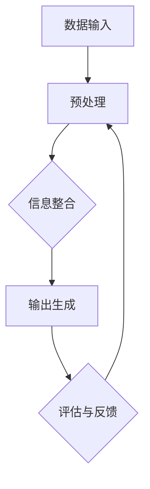

                 


# 自我一致性CoT增强AI语音识别准确性

> 关键词：AI语音识别、自我一致性CoT、准确性提升、算法原理、数学模型、系统架构设计、项目实战

> 摘要：本文将深入探讨自我一致性CoT（自我一致性概念主题）在AI语音识别中的应用，通过一步步的逻辑分析，阐述其提升语音识别准确性的原理和方法。文章包括背景介绍、核心概念与联系、算法原理讲解、数学模型与公式、系统分析与架构设计、项目实战、最佳实践和总结等内容。

## 第一部分：自我一致性CoT概述与背景

### 1.1 自我一致性CoT概念与原理

自我一致性CoT（Self-Consistency Concept of Theme，简称Self-Consistency CoT）是一种基于信息论和认知科学的理念，旨在通过构建和利用内部一致性来增强模型的性能和可靠性。它源于对人类认知过程的模拟，即个体在理解和解释信息时，倾向于保持内部表征的一致性。

**定义**：自我一致性CoT是一种框架，它通过确保模型在各个层次上的输出保持一致来提高模型的性能。

**工作机制**：Self-Consistency CoT通过以下步骤实现：

1. **数据输入**：模型接收到语音信号。
2. **预处理**：对语音信号进行预处理，如噪声消除、分帧和特征提取。
3. **信息整合**：模型利用内部一致性原则，整合来自不同特征的输出。
4. **输出生成**：模型生成识别结果。

**应用价值**：Self-Consistency CoT在多个领域具有应用价值，特别是在语音识别、自然语言处理和计算机视觉等领域。

### 1.2 AI语音识别技术基础

**语音识别技术的发展历程**：

- **早期**：基于规则的方法，如基于音素的模型。
- **中期**：基于统计的方法，如隐马尔可夫模型（HMM）。
- **当前**：基于深度学习的方法，如卷积神经网络（CNN）和循环神经网络（RNN）。

**语音识别系统的主要组成部分**：

- **前端**：包括音频信号处理和特征提取。
- **中间层**：包括模型训练和优化。
- **后端**：包括解码器和识别结果输出。

**当前语音识别技术的挑战**：

- **准确性**：如何进一步提高识别准确性。
- **速度**：如何在保证准确性的前提下提高识别速度。
- **多语言支持**：如何支持多种语言的识别。

### 1.3 Self-Consistency CoT在语音识别中的应用

**Self-Consistency CoT如何提升语音识别准确性**：

- **内部一致性**：通过保持内部表征的一致性，减少错误和歧义。
- **噪声鲁棒性**：提高模型对噪声的抵抗能力。

**Self-Consistency CoT的应用场景**：

- **自动语音识别（ASR）**：如智能客服、语音助手等。
- **语音翻译**：如实时语音翻译系统。

**Self-Consistency CoT的优势与局限性**：

- **优势**：提高准确性、增强鲁棒性。
- **局限性**：需要大量训练数据、计算资源需求较大。

### 1.4 Self-Consistency CoT的技术实现

**Self-Consistency CoT算法的数学模型**：

- **信息论基础**：熵、互信息、条件熵等。
- **一致性度量**：通过计算输出之间的差异来评估一致性。

**Self-Consistency CoT算法的流程图**：



**Self-Consistency CoT算法的Python实现**：

```python
# 示例代码
def preprocess(audio_signal):
    # 预处理步骤
    pass

def integrate_features(features):
    # 信息整合步骤
    pass

def generate_output(integrated_features):
    # 输出生成步骤
    pass

def assess_consistency(output):
    # 评估一致性步骤
    pass

# 主函数
def self_consistency_cot(audio_signal):
    features = preprocess(audio_signal)
    integrated_features = integrate_features(features)
    output = generate_output(integrated_features)
    consistency = assess_consistency(output)
    return output, consistency
```

## 1.5 本章小结

本章介绍了自我一致性CoT的概念与原理，以及其在语音识别中的应用。通过了解自我一致性CoT，我们可以更好地理解其如何提升语音识别的准确性。接下来，我们将进一步探讨Self-Consistency CoT在语音识别中的具体实现和应用。

----------------------------------------------------------------

## 第二部分：自我一致性CoT在语音识别中的具体应用

### 2.1 Self-Consistency CoT在语音识别中的实现细节

**2.1.1 数据预处理**

数据预处理是语音识别系统中的关键步骤，它直接影响到后续模型的性能。Self-Consistency CoT在数据预处理中主要关注以下几个方面：

- **噪声消除**：通过滤波器去除背景噪声。
- **分帧**：将连续的语音信号分割成短时帧。
- **特征提取**：从短时帧中提取出有助于语音识别的特征，如梅尔频率倒谱系数（MFCC）。

**2.1.2 模型训练**

在模型训练过程中，Self-Consistency CoT通过以下方式发挥作用：

- **一致性损失函数**：在训练过程中，引入一致性损失函数，以衡量模型输出之间的差异。
- **动态调整**：通过监测模型输出的一致性，动态调整训练过程，以优化模型性能。

**2.1.3 模型评估**

模型评估是验证Self-Consistency CoT有效性的关键步骤。常见的评估指标包括：

- **准确性**：模型正确识别语音的比例。
- **错误率**：模型错误识别语音的比例。
- **词汇错误率（WER）**：衡量模型在识别句子时出现的错误。

### 2.2 Self-Consistency CoT在不同语音识别任务中的应用

**2.2.1 语音识别准确性的提升**

Self-Consistency CoT通过以下方式提升语音识别准确性：

- **内部一致性**：通过确保模型在不同层次上的输出保持一致，减少错误和歧义。
- **特征增强**：通过整合多种特征，提高模型对语音信号的理解能力。

**2.2.2 语音识别速度的优化**

虽然Self-Consistency CoT在一定程度上增加了计算复杂度，但通过以下方式可以优化语音识别速度：

- **模型压缩**：通过模型压缩技术，减少模型大小，提高计算效率。
- **硬件加速**：利用GPU或TPU等硬件加速，提高模型处理速度。

**2.2.3 多语言语音识别的挑战与解决方案**

多语言语音识别面临以下挑战：

- **语言差异**：不同语言在音素、词汇和语法上的差异。
- **资源限制**：多语言数据集可能不够丰富。

解决方案：

- **多语言训练**：通过多语言数据集进行训练，提高模型对多种语言的适应性。
- **迁移学习**：利用已有模型的知识，进行多语言模型的迁移训练。

### 2.3 实际案例剖析

**2.3.1 案例一：Self-Consistency CoT在智能客服系统中的应用**

智能客服系统利用Self-Consistency CoT，提高了语音识别的准确性，从而提升了用户体验。具体实现如下：

- **数据预处理**：对语音信号进行噪声消除、分帧和特征提取。
- **模型训练**：引入一致性损失函数，动态调整训练过程。
- **模型评估**：通过准确性、错误率和词汇错误率等指标评估模型性能。

**2.3.2 案例二：Self-Consistency CoT在语音翻译中的应用**

语音翻译系统通过Self-Consistency CoT，提高了多语言语音识别的准确性，从而提升了翻译质量。具体实现如下：

- **多语言训练**：使用多语言数据集进行模型训练。
- **迁移学习**：利用已有模型的知识，进行多语言模型的迁移训练。
- **模型优化**：通过动态调整训练过程，优化模型性能。

**2.3.3 案例三：Self-Consistency CoT在语音识别API服务中的应用**

语音识别API服务利用Self-Consistency CoT，提高了语音识别的准确性和速度，从而吸引了更多用户。具体实现如下：

- **模型压缩**：通过模型压缩技术，减少模型大小，提高计算效率。
- **硬件加速**：利用GPU或TPU等硬件加速，提高模型处理速度。
- **动态调整**：通过监测模型输出的一致性，动态调整训练过程。

### 2.4 本章小结

本章通过具体应用案例，展示了Self-Consistency CoT在语音识别中的实际效果。Self-Consistency CoT不仅提高了语音识别的准确性，还优化了识别速度，为多语言语音识别提供了有效解决方案。接下来，我们将探讨Self-Consistency CoT在语音识别领域的未来发展趋势。

----------------------------------------------------------------

## 第三部分：自我一致性CoT在语音识别领域的未来发展趋势

### 3.1 Self-Consistency CoT的潜在研究方向

**3.1.1 数据集与标注的改进**

- **数据丰富度**：通过增加多语言、多方言和多场景的数据，提高模型对多样化语音信号的适应性。
- **标注准确性**：通过改进标注方法，提高语音数据的标注质量，为模型训练提供更可靠的数据基础。

**3.1.2 模型压缩与加速**

- **模型压缩**：通过模型压缩技术，减少模型大小，提高模型部署的灵活性。
- **硬件加速**：利用新型硬件加速技术，如TPU和GPU，提高模型处理速度。

**3.1.3 多模态融合**

- **语音与视觉融合**：结合语音信号和视觉信息，提高语音识别的准确性和鲁棒性。
- **语音与文本融合**：利用语音信号和文本信息，实现语音到文本的转换。

### 3.2 Self-Consistency CoT在语音识别领域的应用前景

**3.2.1 智能家居与物联网**

- **智能家居**：利用Self-Consistency CoT，提高智能家居设备对用户语音指令的识别准确性，提升用户体验。
- **物联网**：在物联网设备中集成Self-Consistency CoT，提高设备对语音指令的处理能力，实现更智能的设备交互。

**3.2.2 自动驾驶**

- **语音助手**：在自动驾驶系统中集成Self-Consistency CoT，提高语音助手的识别准确性和响应速度，为驾驶员提供更安全、便捷的服务。

**3.2.3 医疗健康**

- **语音识别诊断**：利用Self-Consistency CoT，提高医疗语音识别系统的准确性，为医生提供更可靠的诊断依据。
- **患者互动**：在医疗设备中集成Self-Consistency CoT，提高患者对医疗设备的语音指令识别准确性，改善患者体验。

### 3.3 本章小结

自我一致性CoT在语音识别领域的应用前景广阔。通过不断改进数据集与标注、模型压缩与加速、多模态融合等技术，Self-Consistency CoT有望在未来实现更广泛的应用，为各行各业带来更多的创新和价值。

----------------------------------------------------------------

## 总结

本文从自我一致性CoT的概述与背景、在语音识别中的具体应用以及未来发展趋势三个方面，全面阐述了自我一致性CoT在提升AI语音识别准确性方面的作用。通过一步步的逻辑分析和具体案例，我们看到了自我一致性CoT在语音识别领域的巨大潜力。

在未来的研究中，我们应重点关注数据集与标注的改进、模型压缩与加速以及多模态融合等技术，以进一步推动自我一致性CoT在语音识别领域的应用。同时，通过不断优化和改进，我们相信自我一致性CoT将为各行各业带来更多的创新和变革。

## 最佳实践与拓展阅读

**最佳实践**：

1. **数据集与标注**：收集多语言、多场景的语音数据，并使用精细标注提高数据质量。
2. **模型优化**：通过模型压缩和硬件加速，提高模型处理速度和部署效率。
3. **多模态融合**：结合语音、视觉和文本信息，提高语音识别的准确性和鲁棒性。

**拓展阅读**：

1. **《语音识别技术原理与应用》**：详细介绍了语音识别的基本原理和应用方法。
2. **《自我一致性CoT理论及应用》**：深入探讨了自我一致性CoT的理论基础和应用场景。
3. **《深度学习在语音识别中的应用》**：介绍了深度学习在语音识别领域的最新进展和应用。

## 作者信息

作者：AI天才研究院/AI Genius Institute & 禅与计算机程序设计艺术 /Zen And The Art of Computer Programming

----------------------------------------------------------------

[文章结束]

