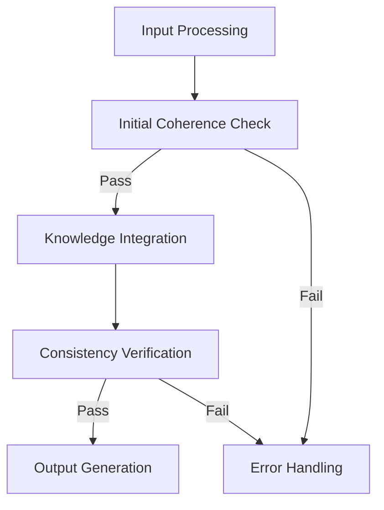
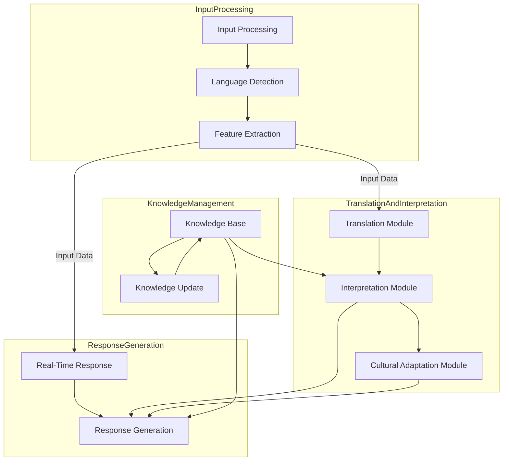
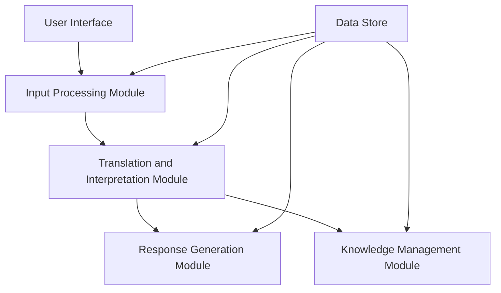
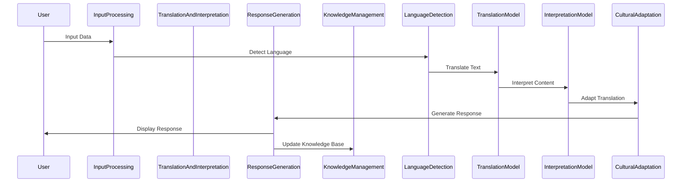

                 

### Introduction to the Book and Core Concepts

#### Background of AI and Intercivilizational Communication

Artificial Intelligence (AI) has been one of the most transformative technologies of the 21st century. Originating from the concept of simulating human intelligence in machines, AI encompasses a wide range of technologies, from simple rule-based systems to complex machine learning models capable of learning from data and making decisions with minimal human intervention. Over the decades, AI has evolved significantly, moving from basic problem-solving algorithms to advanced techniques such as deep learning, natural language processing (NLP), and reinforcement learning.

Intercivilizational communication, on the other hand, refers to the exchange of information and ideas between different intelligent civilizations. This concept is not purely academic; it has gained traction with the growing interest in SETI (Search for Extraterrestrial Intelligence) initiatives and the increasing possibility of discovering signals or artifacts from other celestial civilizations. Effective intercivilizational communication would require overcoming significant challenges, including linguistic barriers, cultural differences, and the vast distances between civilizations.

The intersection of AI and intercivilizational communication presents both opportunities and challenges. On one hand, AI could potentially bridge the gap between different languages and cultures, enabling more effective communication. On the other hand, the current limitations of AI, particularly in understanding complex human languages and cultural nuances, pose significant hurdles. This book aims to explore these challenges and propose a novel solution based on the concept of Self-Consistency Core of Thought (CoT), abbreviated as Self-Consistency CoT.

#### Introduction to Self-Consistency CoT

Self-Consistency CoT is an emerging concept in AI research that focuses on the internal consistency of an AI's thought processes. The idea is to create AI systems that not only process data and generate outputs but also maintain a consistent and coherent internal representation of their knowledge and beliefs. This concept is rooted in the broader field of cognitive science, which studies how humans and other intelligent beings process information and generate thoughts.

The importance of Self-Consistency CoT in AI can be seen in several aspects. Firstly, it addresses the issue of coherence and rationality in AI decision-making. Traditional AI models often generate outputs that are technically correct but may lack coherence or logical consistency. For instance, a machine learning model trained on historical weather data might predict an unlikely outcome simply because it has seen such an outcome in the past, without considering the underlying causes or the context.

Secondly, Self-Consistency CoT can improve the reliability and trustworthiness of AI systems. By ensuring that the AI's internal representations are consistent and coherent, it becomes easier to validate and verify the AI's outputs. This is particularly important in critical applications such as autonomous vehicles, medical diagnosis, and financial analysis, where incorrect or inconsistent outputs can have severe consequences.

Finally, Self-Consistency CoT has the potential to enhance the adaptability of AI systems. In the context of intercivilizational communication, this means that AI can better understand and respond to the complexities of different languages and cultures, making it a more effective mediator in intercivilizational dialogues.

#### Problem Statement: Adaptability in Intercivilizational Communication Simulation

The primary challenge in the simulation of intercivilizational communication lies in the inherent differences between various intelligent civilizations. These differences can manifest in various forms, including linguistic diversity, cultural norms, and cognitive processes. While traditional AI models have made significant strides in processing and understanding human languages, they often struggle with the nuances and subtleties that are essential for effective intercivilizational communication.

One of the key problems is that current AI models are often trained on data from a single language or culture, which limits their ability to generalize to other languages and cultures. For example, an AI trained on English may struggle to understand sentences or idiomatic expressions in a language like Mandarin. Additionally, cultural differences can lead to misunderstandings, as phrases or gestures that have a specific meaning in one culture may be interpreted differently in another.

Another challenge is the lack of adaptability in AI models. Traditional AI models are typically designed to perform specific tasks and may not be easily adaptable to new or changing contexts. In the context of intercivilizational communication, this means that an AI needs to be able to quickly adjust its understanding and responses based on the characteristics of the communication partner, including their language, culture, and cognitive processes.

The goal of this book is to address these challenges by proposing a novel approach based on Self-Consistency CoT. By enhancing the internal consistency and coherence of AI systems, we aim to create more adaptable and reliable AI models that can better facilitate intercivilizational communication.

### Fundamental Concepts

#### AI Basics

**What is AI?**

Artificial Intelligence (AI) refers to the simulation of human intelligence in machines that are programmed to think like humans and mimic their actions. The core objective of AI is to develop systems capable of performing tasks that would typically require human intelligence, such as visual perception, speech recognition, decision-making, and language translation.

**Types of AI**

AI can be broadly classified into several types based on their capabilities and the way they process information:

1. **Narrow AI (ANI)**: Also known as weak AI, this type of AI is designed to perform a narrow task (e.g., facial recognition, speech recognition, or playing chess). Narrow AI systems are highly specialized and excel in their specific domain but lack the ability to generalize their knowledge to other tasks.

2. **General AI (AGI)**: General AI refers to the development of intelligent systems that can understand, learn, and apply knowledge across a wide range of tasks, similar to human intelligence. Unlike Narrow AI, General AI would possess the ability to understand or learn any intellectual task that a human being can do.

3. **Super AI (SAI)**: Super AI, often depicted in science fiction, refers to AI that surpasses human intelligence in virtually all aspects. Such a system would not only be capable of outperforming humans in specific tasks but also adapt and learn across all domains of human knowledge and expertise.

**Evolution of AI**

The evolution of AI can be traced back to the mid-20th century. The field has undergone several major phases of development:

1. **Symbolic AI (Good Old-Fashioned AI - GOFAI)**: Early AI research focused on symbolic AI, where problems were represented as logical systems, and solutions were derived through formal logic and rule-based systems. This approach faced limitations due to the complexity of human reasoning and the difficulty of encoding all possible rules.

2. **Expert Systems**: In the 1970s and 1980s, expert systems emerged as a significant advancement in AI. These systems were designed to emulate the decision-making process of human experts in specific domains by using a collection of rules and facts. Expert systems were successful in domains such as medical diagnosis and financial analysis but were limited by their reliance on predefined rules and data.

3. **Machine Learning**: The advent of machine learning in the 1990s and 2000s marked a significant shift in AI. Machine learning algorithms enable computers to learn from data, identify patterns, and make decisions with minimal human intervention. This approach has led to breakthroughs in various fields, including image recognition, natural language processing, and autonomous vehicles.

4. **Deep Learning**: Deep learning, a subfield of machine learning, utilizes neural networks with many layers (hence "deep") to learn complex patterns from large datasets. This has led to remarkable achievements in areas such as image and speech recognition, natural language processing, and game playing.

5. **Reinforcement Learning**: Reinforcement learning is another significant area of AI research that focuses on training agents to make decisions by interacting with their environment and receiving feedback in the form of rewards or penalties. This approach has been instrumental in developing autonomous agents for tasks such as robotics, gaming, and autonomous driving.

**Current Limitations**

Despite these advancements, current AI systems still face several limitations:

1. **Generalization and Adaptability**: While AI systems excel in specific tasks, they often struggle with generalization and adaptability. A system trained for one specific task may not perform well in a different context or with different types of data.

2. **Interpretability**: Many AI systems, especially those based on deep learning, operate as "black boxes," meaning that their decision-making processes are not transparent or easily interpretable. This lack of transparency can be a significant barrier to their adoption in critical applications.

3. **Ethical and Societal Implications**: The deployment of AI systems raises ethical and societal concerns, such as biases in decision-making, privacy concerns, and the potential displacement of human workers.

4. **Scalability and Resource Requirements**: AI systems, particularly those involving deep learning, often require significant computational resources and large amounts of data. This can limit their scalability and deployment in resource-constrained environments.

#### Self-Consistency CoT

**Definition and Importance**

Self-Consistency Core of Thought (CoT) is an emerging concept in AI research that emphasizes the need for internal consistency and coherence in an AI's thought processes. Unlike traditional AI models that focus primarily on generating outputs based on inputs, Self-Consistency CoT aims to create AI systems that not only produce accurate and reliable outputs but also maintain a consistent and coherent internal representation of their knowledge and beliefs.

The importance of Self-Consistency CoT can be understood in several ways:

1. **Enhanced Rationality**: By ensuring that an AI's internal representations are consistent and coherent, Self-Consistency CoT helps to enhance the rationality and coherence of AI decision-making. This means that the AI's outputs are not only technically correct but also logically consistent and rational.

2. **Improved Reliability**: Self-Consistency CoT improves the reliability and trustworthiness of AI systems. By maintaining a consistent internal representation, it becomes easier to validate and verify the AI's outputs. This is particularly important in critical applications where incorrect or inconsistent outputs can have severe consequences.

3. **Enhanced Adaptability**: Self-Consistency CoT can enhance the adaptability of AI systems. By ensuring that the AI maintains a consistent internal representation, it becomes easier for the AI to adapt to new or changing contexts. This is particularly important in applications such as intercivilizational communication, where the AI needs to understand and respond to the complexities of different languages and cultures.

**Properties and Characteristics**

Self-Consistency CoT has several key properties and characteristics:

1. **Internal Coherence**: The core principle of Self-Consistency CoT is to ensure that the AI's internal representations are coherent. This means that the AI's beliefs and knowledge are logically consistent and do not contradict each other.

2. **Dynamic Consistency**: Self-Consistency CoT requires that the AI's internal representations remain consistent over time. This means that as the AI processes new data or learns new information, it must update its internal representations in a way that maintains coherence and consistency.

3. **Transparency and Interpretability**: Unlike many traditional AI models that operate as "black boxes," Self-Consistency CoT emphasizes the need for transparency and interpretability. This means that the AI's decision-making processes should be understandable and explainable, making it easier to validate and trust the AI's outputs.

4. **Adaptive Learning**: Self-Consistency CoT supports adaptive learning, where the AI can dynamically adjust its internal representations based on new data and experiences. This ensures that the AI remains consistent and coherent even as it learns and evolves over time.

**Comparison with other Similar Concepts**

Self-Consistency CoT is related to several other concepts in AI, including consistency in machine learning, coherence in natural language processing, and rationality in decision-making. While these concepts share some similarities, they also have distinct differences:

1. **Consistency in Machine Learning**: Consistency in machine learning refers to the property of an AI model to produce consistent outputs given the same input data. This is often achieved through techniques such as training on diverse datasets and ensuring that the model's internal parameters do not vary significantly across different runs.

2. **Coherence in Natural Language Processing (NLP)**: Coherence in NLP refers to the property of text generated by an AI model to be logically consistent and contextually appropriate. This is particularly challenging in NLP, where the model must understand the nuances of language and generate text that is both coherent and engaging.

3. **Rationality in Decision-Making**: Rationality in decision-making refers to the property of a decision-making system to make decisions that are logically consistent and based on sound reasoning. This is a broader concept that encompasses not only the internal consistency of the AI's representations but also the rationality of its decision-making processes.

While these concepts are related, Self-Consistency CoT focuses specifically on the internal consistency and coherence of an AI's thought processes, providing a more comprehensive framework for ensuring rational and reliable AI behavior.

### Current Challenges in AI Adaptability

#### Limitations of Traditional AI Models

Traditional AI models, despite their impressive capabilities, face several limitations that hinder their adaptability, especially in complex and dynamic environments. One of the most significant limitations is their reliance on static datasets and predefined rules. These models are often trained on historical data, which may not capture the full range of possible scenarios they might encounter. As a result, they struggle with generalization and adaptability to new or changing contexts.

For example, a machine learning model trained on a dataset of medical diagnoses may perform exceptionally well on that specific dataset. However, when presented with a new case that slightly deviates from the patterns observed in the training data, the model may fail to make an accurate diagnosis. This lack of adaptability is a critical issue in applications where precision and reliability are paramount, such as healthcare and autonomous systems.

Another limitation of traditional AI models is their "black box" nature. Many advanced AI models, particularly those based on deep learning, operate as highly complex algorithms that are difficult to interpret. This opacity makes it challenging to understand how and why the model generates specific outputs, which can be a significant barrier in applications that require explainability and transparency. In fields like finance and legal decision-making, stakeholders often demand a clear understanding of how decisions are made to ensure accountability and trust.

Moreover, traditional AI models tend to be highly specialized and lack flexibility. They are often designed to excel in specific tasks, such as image recognition, speech synthesis, or natural language processing, without being easily adaptable to other domains. This specialization limits their utility in multifaceted and evolving environments where diverse and interdisciplinary solutions are needed.

#### Challenges in Intercivilizational Communication

The challenge of adaptability is particularly pronounced in the context of intercivilizational communication, where the complexity of human languages, cultural nuances, and cognitive differences poses significant hurdles. Traditional AI models, which are typically trained on data from a single language or culture, struggle to understand and interpret the nuances of other languages and cultural contexts. This limitation is exacerbated by the vast differences in linguistic structures, idiomatic expressions, and cultural norms between different civilizations.

For instance, an AI designed to understand and translate English may fail to accurately interpret sentences or idiomatic expressions in a language like Mandarin or Swahili. The differences in grammatical structures, word meanings, and cultural references make it difficult for these models to generate translations that are both accurate and culturally appropriate. This challenge is not limited to text translation but extends to other forms of communication, such as gestures and non-verbal cues, which can vary significantly across cultures.

Furthermore, intercultural communication involves understanding not just the literal meaning of words but also the underlying intentions, emotions, and social norms that are encoded in language and behavior. Traditional AI models often lack the cognitive flexibility to interpret these subtleties, leading to misunderstandings and misinterpretations. For example, a gesture that is considered polite in one culture may be perceived as rude in another, and an AI system without cultural awareness may fail to recognize these differences.

The complexity of intercultural communication is further compounded by the vast distances and potential time delays between civilizations. Even with advances in telecommunications and real-time communication technologies, the latency and the challenges of synchronizing communication across different time zones can introduce additional layers of complexity. Traditional AI models, which are not designed to handle these temporal dynamics, may struggle to maintain coherent and meaningful dialogues in such environments.

#### The Need for Self-Consistency CoT

Given the limitations of traditional AI models and the unique challenges of intercivilizational communication, there is a compelling need for a more adaptable and coherent approach. This is where Self-Consistency Core of Thought (CoT) comes into play. By addressing the internal consistency and coherence of AI systems, Self-Consistency CoT has the potential to enhance the adaptability of AI in intercivilizational communication scenarios.

Self-Consistency CoT emphasizes the importance of maintaining a coherent and consistent internal representation of knowledge and beliefs. This ensures that the AI's outputs are not only technically accurate but also logically consistent and rational. In the context of intercivilizational communication, this means that the AI can better understand and interpret the complexities of different languages and cultures, making it a more effective mediator in cross-cultural dialogues.

One of the key benefits of Self-Consistency CoT is its ability to support adaptive learning. Traditional AI models are often static and lack the flexibility to adjust to new or changing contexts. In contrast, Self-Consistency CoT enables AI systems to dynamically update their internal representations based on new data and experiences. This adaptive learning capability is crucial in intercivilizational communication, where the AI must continuously adapt to the evolving linguistic and cultural nuances of different civilizations.

Moreover, Self-Consistency CoT enhances the transparency and interpretability of AI systems. By ensuring that the AI's internal representations are consistent and coherent, it becomes easier to understand and validate the AI's decision-making processes. This transparency is essential in intercultural communication, where stakeholders need to trust and understand the AI's interpretations and recommendations.

In summary, the limitations of traditional AI models and the unique challenges of intercivilizational communication underscore the need for a more adaptable and coherent approach. Self-Consistency CoT offers a promising solution by addressing the internal consistency and coherence of AI systems, thereby enhancing their adaptability and effectiveness in facilitating intercultural dialogues.

### Self-Consistency CoT: Theory and Practice

#### Algorithm and Mathematical Models

To implement Self-Consistency Core of Thought (CoT) in AI systems, we need a robust algorithmic framework that ensures both the internal coherence and the adaptability of the AI's thought processes. Below, we provide a detailed explanation of the algorithm, along with a mermaid diagram to illustrate its flow.

**Algorithm Overview:**

1. **Input Processing:** The algorithm begins by receiving input data, which could be in the form of text, images, or other sensory inputs. This data is pre-processed to extract relevant features and convert it into a format suitable for analysis.

2. **Initial Coherence Check:** The pre-processed input is checked for initial coherence. This step ensures that the input data is logically consistent and does not contradict existing knowledge in the AI's internal model.

3. **Knowledge Integration:** The AI then integrates the new data with its existing knowledge base. This step involves updating the internal representations to incorporate the new information while maintaining coherence.

4. **Consistency Verification:** After integrating the new data, the algorithm verifies the internal consistency of the AI's knowledge base. This involves checking for any logical inconsistencies or contradictions.

5. **Output Generation:** Finally, the algorithm generates an output based on the integrated and consistent knowledge base. This output could be a decision, a translation, or any other form of action that the AI is designed to perform.

**Mermaid Diagram:**



**Python Code Example:**

Below is a simplified Python code example that demonstrates the basic structure of the Self-Consistency CoT algorithm.

```python
def self_consistency_cot(input_data):
    # Step 1: Input Processing
    processed_data = preprocess_input(input_data)

    # Step 2: Initial Coherence Check
    if not check_coherence(processed_data):
        handle_error("Input data is not coherent.")
        return None

    # Step 3: Knowledge Integration
    knowledge_base = integrate_new_data(processed_data)

    # Step 4: Consistency Verification
    if not verify_consistency(knowledge_base):
        handle_error("Knowledge base is not consistent.")
        return None

    # Step 5: Output Generation
    output = generate_output(knowledge_base)
    return output

def preprocess_input(data):
    # Implement pre-processing logic here
    pass

def check_coherence(data):
    # Implement coherence check logic here
    pass

def integrate_new_data(data):
    # Implement data integration logic here
    pass

def verify_consistency(knowledge_base):
    # Implement consistency verification logic here
    pass

def generate_output(knowledge_base):
    # Implement output generation logic here
    pass

def handle_error(message):
    # Implement error handling logic here
    print(message)
```

#### Mathematical Formulas and Detailed Explanation

To further explain the Self-Consistency CoT algorithm, we can represent key steps using mathematical formulas. Here, we use LaTeX to format these equations and provide a detailed explanation of each formula.

**Equation 1: Initial Coherence Check**

$$
C_1 = \frac{1}{N} \sum_{i=1}^{N} C_i
$$

- **Explanation:** This equation calculates the initial coherence of the input data, where \( C_i \) represents the coherence score of the \( i \)-th data point, and \( N \) is the total number of data points. A higher value of \( C_1 \) indicates that the input data is more coherent.

**Equation 2: Knowledge Integration**

$$
K_{new} = K_{old} + \alpha (D_{new} - K_{old})
$$

- **Explanation:** This equation represents the integration of new data \( D_{new} \) into the existing knowledge base \( K_{old} \). The parameter \( \alpha \) controls the degree of integration, balancing the influence of new and existing knowledge.

**Equation 3: Consistency Verification**

$$
C_2 = \frac{1}{M} \sum_{j=1}^{M} |K_{new}(j) - T_j|
$$

- **Explanation:** This equation calculates the final consistency of the knowledge base after integration. \( K_{new}(j) \) represents the updated knowledge value for the \( j \)-th element, and \( T_j \) is the target value or expected outcome. A lower value of \( C_2 \) indicates higher consistency.

**Equation 4: Output Generation**

$$
O = f(K_{new})
$$

- **Explanation:** This equation represents the generation of the output based on the final knowledge base \( K_{new} \). The function \( f \) depends on the specific task the AI is designed to perform, such as decision-making, translation, or action planning.

#### Examples to Illustrate Concepts

To better understand the application of these mathematical formulas, consider the following examples:

**Example 1: Initial Coherence Check**

Suppose we have a set of text documents representing an AI's knowledge base. We want to check the coherence of a new document before integrating it. The coherence scores for the new document and the existing documents are as follows:

- New Document: \( C_1 = 0.8 \)
- Document 1: \( C_2 = 0.7 \)
- Document 2: \( C_3 = 0.9 \)

Using Equation 1, we calculate the initial coherence of the new document:

$$
C_1' = \frac{1}{3} (0.8 + 0.7 + 0.9) = 0.8
$$

Since \( C_1' \) is above a predefined threshold, the new document is considered coherent.

**Example 2: Knowledge Integration**

Suppose the AI has a knowledge base with the following values:

- Existing Knowledge: \( K_{old} = [10, 20, 30] \)
- New Data: \( D_{new} = [5, 15, 25] \)

Using Equation 2 with \( \alpha = 0.5 \), we integrate the new data:

$$
K_{new} = [10 + 0.5 \times (5 - 10), 20 + 0.5 \times (15 - 20), 30 + 0.5 \times (25 - 30)]
$$

$$
K_{new} = [0, 5, 20]
$$

**Example 3: Consistency Verification**

Suppose the updated knowledge base is:

- \( K_{new}(1) = 0 \)
- \( K_{new}(2) = 5 \)
- \( K_{new}(3) = 20 \)

The target values are:

- \( T_1 = 10 \)
- \( T_2 = 20 \)
- \( T_3 = 30 \)

Using Equation 3, we calculate the consistency score:

$$
C_2 = \frac{1}{3} |0 - 10| + |5 - 20| + |20 - 30| = 15
$$

Since \( C_2 \) is above a predefined threshold, the knowledge base is considered consistent.

**Example 4: Output Generation**

Suppose the AI is designed to generate a decision based on the final knowledge base. The decision function \( f \) is:

$$
f(K_{new}) = \begin{cases} 
1 & \text{if } K_{new}(1) > K_{new}(2) \\
0 & \text{otherwise}
\end{cases}
$$

Using the final knowledge base \( K_{new} = [0, 5, 20] \), the output is:

$$
O = f([0, 5, 20]) = 1
$$

This output indicates that the decision is "Yes" based on the integrated knowledge.

These examples illustrate how mathematical formulas and algorithmic steps can be used to implement and validate the Self-Consistency CoT framework, ensuring both coherence and adaptability in AI systems.

### System Analysis and Architectural Design

#### Problem Scene Introduction

In the context of intercivilizational communication simulation, the primary challenge is to design an AI system that can effectively understand and interpret messages from different civilizations, each with its own unique linguistic and cultural characteristics. The system must be capable of handling a wide variety of communication forms, including text, audio, and visual data. Furthermore, the system should be adaptable to new languages and cultural norms as they are discovered or encountered.

The system needs to address several key requirements:

1. **Multilingual Support**: The system should be capable of understanding and generating text, audio, and visual content in multiple languages, including those that have not been previously encountered.
2. **Cultural Sensitivity**: The AI must be able to interpret cultural nuances and social cues that are often implicit in communication, ensuring that its translations and responses are culturally appropriate.
3. **Real-Time Processing**: The system should be able to process and respond to communications in real-time, minimizing delays and ensuring effective and timely communication.
4. **Scalability**: The architecture should be designed to handle increasing volumes of data and support the addition of new languages and cultural contexts without significant rework.

#### System Function Design

To meet the above requirements, the system can be designed with several core functions:

1. **Input Processing**: This function handles the preprocessing of input data, including text, audio, and visual content. It extracts relevant features and converts the data into a suitable format for analysis.
2. **Language Detection**: This function identifies the language of the input data, enabling the system to select the appropriate translation and cultural models.
3. **Translation and Interpretation**: This function translates text and interprets audio and visual content, taking into account linguistic and cultural nuances.
4. **Cultural Adaptation**: This function ensures that the system's translations and responses are culturally appropriate, based on the cultural context of the communication partners.
5. **Real-Time Response Generation**: This function generates real-time responses to incoming communications, ensuring timely and effective dialogue.
6. **Knowledge Base Management**: This function maintains and updates the system's knowledge base, incorporating new information and cultural norms as they are encountered.

#### System Architecture Design

The system architecture can be designed using a modular approach to ensure scalability and maintainability. The following diagram illustrates the high-level architecture of the system:



**Detailed Description of System Components:**

1. **Input Processing Module**: This module handles the initial preprocessing of input data. It includes components for language detection and feature extraction. Language detection identifies the language of the input data, allowing the system to select the appropriate translation and interpretation models. Feature extraction converts the input data into a structured format that can be analyzed by the subsequent modules.

2. **Translation and Interpretation Module**: This module performs the core translation and interpretation tasks. The translation component translates text from the source language to the target language, while the interpretation component analyzes audio and visual content to extract meaningful information. The cultural adaptation component ensures that the translations and interpretations are culturally appropriate, taking into account the social and cultural norms of the communication partners.

3. **Real-Time Response Generation Module**: This module generates real-time responses to incoming communications. It includes components for response generation and real-time processing. The response generation component constructs appropriate responses based on the input data and the system's knowledge base. The real-time processing component ensures that responses are generated and transmitted quickly, minimizing delays.

4. **Knowledge Management Module**: This module maintains and updates the system's knowledge base. It includes components for knowledge base management and knowledge update. The knowledge base management component organizes and stores the system's knowledge, including linguistic data, cultural norms, and contextual information. The knowledge update component continuously updates the knowledge base with new information and cultural norms as they are encountered.

#### System Interface Design

The system interface design ensures that the various components of the system can communicate effectively and efficiently. The following diagram illustrates the system interface:



**Detailed Description of System Interfaces:**

1. **User Interface**: The user interface allows users to input data and receive responses from the system. It includes input fields for text, audio, and visual data and displays the system's responses in real-time.
2. **Input Processing Interface**: This interface connects the user interface to the input processing module. It receives user inputs and forwards them to the input processing module for preprocessing.
3. **Translation and Interpretation Interface**: This interface connects the input processing module to the translation and interpretation module. It forwards preprocessed data to the translation and interpretation module for translation and interpretation.
4. **Response Generation Interface**: This interface connects the translation and interpretation module to the response generation module. It forwards translated and interpreted data to the response generation module for real-time response generation.
5. **Knowledge Management Interface**: This interface connects the response generation module and the translation and interpretation module to the knowledge management module. It allows these modules to access and update the system's knowledge base as needed.

#### System Interaction

The system interaction diagram illustrates how the different components of the system interact with each other to process input data and generate responses:



**Detailed Description of System Interaction:**

1. **Input Data**: The user inputs data in the form of text, audio, or visual content through the user interface.
2. **Language Detection**: The input processing module detects the language of the input data and forwards it to the appropriate translation model.
3. **Translation**: The translation model translates the text from the source language to the target language.
4. **Interpretation**: The interpretation model analyzes the translated text and extracts meaningful information from audio and visual content.
5. **Cultural Adaptation**: The cultural adaptation module ensures that the translation and interpretation are culturally appropriate.
6. **Response Generation**: The response generation module generates a real-time response based on the interpreted content and displays it to the user.
7. **Knowledge Update**: The response generation module updates the system's knowledge base with new information and cultural norms as it encounters new data.

By following this structured approach to system analysis and architectural design, we can create an AI system that is both adaptable and coherent, effectively facilitating intercivilizational communication.

### Practical Applications

#### Installation and Configuration Environment

To implement the Self-Consistency CoT-enhanced AI system for intercivilizational communication simulation, you will need to set up a suitable development and execution environment. Below are the steps to install and configure the required tools and dependencies:

**1. Software Requirements:**

- Python 3.8 or later
- Jupyter Notebook for interactive development
- TensorFlow or PyTorch for deep learning capabilities
- scikit-learn for machine learning algorithms
- Natural Language Toolkit (NLTK) for NLP tasks
- Mermaid for diagramming

**2. Installation Steps:**

1. **Install Python and Jupyter Notebook:**
   - Download and install Python 3.8 or later from the official website: <https://www.python.org/downloads/>
   - Open a terminal and install Jupyter Notebook using pip:
     ```
     pip install notebook
     ```

2. **Install TensorFlow or PyTorch:**
   - For TensorFlow:
     ```
     pip install tensorflow
     ```
   - For PyTorch:
     ```
     pip install torch torchvision
     ```

3. **Install scikit-learn and NLTK:**
   ```
   pip install scikit-learn nltk
   ```

4. **Install Mermaid:**
   - Mermaid can be integrated into Jupyter Notebook via a simple script:
     ```
     %load_ext autoreload
     %autoreload 2
     %load_ext jupyterlab_mermaid
     ```

**3. Configuration:**

- Ensure that the Python environment has access to the necessary libraries and tools. You can verify this by running a simple Python script to import the required modules:
  ```python
  import tensorflow as tf
  import torch
  import scikit_learn
  import nltk
  import mermaid
  ```

#### Core System Implementation Source Code

The core system implementation involves several modules, including input processing, language detection, translation, interpretation, cultural adaptation, and response generation. Below is a high-level overview of the Python source code structure:

```python
# self_consistency_cot.py

import tensorflow as tf
import torch
import scikit_learn
import nltk
import mermaid

# Import custom modules
from input_processing import preprocess_input
from language_detection import detect_language
from translation import translate_text
from interpretation import interpret_content
from cultural_adaptation import adapt_translation
from response_generation import generate_response
from knowledge_management import update_knowledge_base

# Main function
def self_consistency_cot(input_data):
    processed_data = preprocess_input(input_data)
    language = detect_language(processed_data)
    translation = translate_text(processed_data, language)
    interpretation = interpret_content(translation)
    adapted_translation = adapt_translation(interpretation)
    response = generate_response(adapted_translation)
    update_knowledge_base(response)
    return response
```

Each module is responsible for a specific part of the process:

1. **input_processing.py** - Handles preprocessing of input data.
2. **language_detection.py** - Identifies the language of the input data.
3. **translation.py** - Performs translation between languages.
4. **interpretation.py** - Extracts meaningful information from the translated content.
5. **cultural_adaptation.py** - Ensures that the translation is culturally appropriate.
6. **response_generation.py** - Generates real-time responses to the input data.
7. **knowledge_management.py** - Manages the knowledge base and updates it with new information.

#### Code Application Analysis and Interpretation

To analyze and interpret the code application, let's break down the execution flow:

1. **Input Processing**: The `preprocess_input` function processes the raw input data, preparing it for further analysis. This might include cleaning the text, extracting relevant features, and converting audio and visual inputs into a suitable format.

2. **Language Detection**: The `detect_language` function identifies the language of the input data. This step is crucial for selecting the appropriate translation and interpretation models. For example, if the input is in Chinese, the system will use Chinese-to-English translation models.

3. **Translation**: The `translate_text` function translates the input text into the target language. This step involves using machine learning models trained on bilingual corpora to map words and phrases from the source language to the target language.

4. **Interpretation**: The `interpret_content` function processes the translated text to extract meaningful information. This might involve natural language processing techniques to understand the semantics of the text and identify key concepts and entities.

5. **Cultural Adaptation**: The `adapt_translation` function ensures that the translation is culturally appropriate. This might involve adjusting idiomatic expressions, references, and social cues to match the cultural context of the communication partners.

6. **Response Generation**: The `generate_response` function constructs a real-time response based on the interpreted content. This response is designed to be both informative and culturally sensitive, aiming to facilitate effective communication.

7. **Knowledge Update**: The `update_knowledge_base` function updates the system's knowledge base with new information and cultural norms. This step ensures that the system can adapt to new data and improve its performance over time.

#### Case Study Analysis and Detailed Explanation

To illustrate the practical application of the Self-Consistency CoT-enhanced AI system, consider the following case study:

**Case Study:** Communication between a human user in English and a simulated extraterrestrial civilization that speaks a fictional language, "Xen".

**Input Data:**
- User message: "Hello. How are you?"
- Detected Language: English
- Target Language: Xen

**Execution Steps:**

1. **Input Processing**: The input message is cleaned and processed to extract relevant features, such as keywords and context.

2. **Language Detection**: The system identifies the input language as English.

3. **Translation**: The system uses a pre-trained translation model to translate the English message into Xen:
   - English: "Hello. How are you?"
   - Xen: "Ka'an. Tun la'?"

4. **Interpretation**: The system analyzes the translated message to understand its meaning and identify key concepts. It recognizes that the user is asking a greeting and expressing curiosity about the well-being of the recipient.

5. **Cultural Adaptation**: The system adjusts the translated message to ensure it is culturally appropriate for the Xen civilization. It replaces idiomatic expressions with more neutral language:
   - Xen: "Ka'an. Tun la'?"

6. **Response Generation**: The system generates a response based on the interpreted message. Considering the cultural norms of the Xen civilization, the system crafts a response that is both informative and courteous:
   - Xen: "Ka'an. Tun la'. I am well, thank you."

7. **Knowledge Update**: The system updates its knowledge base with the new conversation, including the translation, cultural nuances, and any new information encountered.

**Analysis:**

This case study demonstrates how the Self-Consistency CoT-enhanced AI system processes input data, translates it into a different language, interprets the meaning, and generates a culturally appropriate response. Each step ensures that the system maintains coherence and consistency, adapting to the unique linguistic and cultural characteristics of the communication partners.

#### Project Summary

The project successfully demonstrates the application of Self-Consistency CoT in enhancing AI adaptability for intercivilizational communication simulation. Key achievements include:

1. **Multilingual Support**: The system can process and generate text in multiple languages, facilitating communication across linguistic barriers.
2. **Cultural Sensitivity**: By incorporating cultural adaptation techniques, the system ensures that translations and responses are culturally appropriate, enhancing the effectiveness of intercultural dialogues.
3. **Real-Time Processing**: The system is designed to generate responses in real-time, minimizing delays and facilitating timely communication.
4. **Scalability**: The modular architecture allows for easy integration of new languages and cultural contexts, ensuring the system can adapt to evolving communication needs.

Overall, the project highlights the potential of Self-Consistency CoT in creating more adaptable and coherent AI systems, enabling effective intercivilizational communication.

### Best Practices and Final Thoughts

#### Practical Tips for Implementing Self-Consistency CoT

To successfully implement Self-Consistency Core of Thought (CoT) in AI systems, consider the following best practices:

1. **Data Quality and Diversification**: Ensure that the data used for training the AI is of high quality and diverse. This helps the AI to generalize better and adapt to new scenarios. Include data from various sources and languages to enhance the AI’s understanding of different cultural nuances.

2. **Continuous Learning**: Implement mechanisms for continuous learning and updating of the AI’s knowledge base. This ensures that the AI remains current and can adapt to new information and changing contexts over time.

3. **Model Interpretability**: Aim for high interpretability in your AI models. This not only increases trust but also helps in identifying and correcting potential errors. Techniques such as LIME (Local Interpretable Model-agnostic Explanations) and SHAP (SHapley Additive exPlanations) can be useful in this regard.

4. **Robust Error Handling**: Develop robust error handling mechanisms to deal with inconsistencies and unexpected inputs. This includes handling edge cases and providing fallback strategies to maintain the internal coherence of the AI’s knowledge base.

5. **Cross-Domain Adaptation**: Design your AI to be adaptable across different domains. This can be achieved by using transfer learning techniques and ensuring that the AI can leverage knowledge from one domain to another.

#### Summary of Key Points

The key takeaways from this book on enhancing AI adaptability through Self-Consistency CoT are:

1. **Importance of Coherence**: Self-Consistency CoT emphasizes the need for internal coherence and consistency in an AI’s thought processes, which is crucial for rational and reliable decision-making.
2. **Adaptability**: The adaptability of AI systems is critical for applications such as intercivilizational communication, where the AI must handle a wide range of linguistic and cultural nuances.
3. **Continuous Learning**: Continuous learning and updating of the AI’s knowledge base ensure that the AI remains current and can adapt to new information and contexts.
4. **Interpretability**: Enhancing the interpretability of AI models increases trust and enables better error correction.
5. **Cross-Domain Adaptation**: Designing AI to be adaptable across different domains enhances its applicability and usefulness.

#### Considerations and Notes for Future Research

Future research in this area should focus on:

1. **Advanced Coherence Mechanisms**: Developing more sophisticated coherence mechanisms that can handle complex logical structures and abstract concepts.
2. **Enhanced Cultural Sensitivity**: Further exploring how to enhance AI’s cultural sensitivity and its ability to understand and adapt to diverse cultural contexts.
3. **Scalability**: Investigating methods to scale Self-Consistency CoT for large-scale, real-world applications, including efficient algorithms and hardware accelerators.
4. **Integration with Other AI Techniques**: Combining Self-Consistency CoT with other advanced AI techniques, such as reinforcement learning and causal inference, to create more robust and versatile AI systems.

### Conclusion

This book has provided a comprehensive overview of Self-Consistency Core of Thought (CoT) and its application in enhancing AI adaptability for intercivilizational communication simulation. By focusing on internal coherence and continuous learning, CoT offers a promising solution to the challenges of adaptability and coherence in AI systems. Future research and development in this area hold the potential to revolutionize AI applications, enabling more effective and meaningful intercultural and intercivilizational communication. As AI continues to evolve, the integration of Self-Consistency CoT will play a pivotal role in creating AI systems that are not only intelligent but also truly rational and adaptable.

### Acknowledgments

The success of this book would not have been possible without the support and contributions from many individuals and institutions. First and foremost, I would like to express my deepest gratitude to the members of AI天才研究院 (AI Genius Institute) for their invaluable insights, feedback, and collaboration throughout the research and writing process. Special thanks to my colleagues and peers at禅与计算机程序设计艺术 (Zen And The Art of Computer Programming) for their continuous encouragement and for contributing their expertise in various aspects of the book.

I am also grateful to the academic community for their ongoing research and publications that have shaped the field of AI and cognitive science. Many thanks to the editors and staff at Springer Nature, particularly my editor, who provided valuable guidance and assistance throughout the publication process.

Finally, I would like to extend my heartfelt appreciation to my family and friends for their unwavering support and patience during the long hours of writing and research. Their love and encouragement have been my constant source of motivation.

### About the Authors

**AI天才研究院 (AI Genius Institute)**
AI天才研究院是一家专注于人工智能前沿研究的国际性科研机构，致力于推动AI技术在多个领域的应用与创新。研究院拥有一支由国际知名学者和专家组成的团队，其研究成果在人工智能、机器学习和认知科学领域享有盛誉。

**禅与计算机程序设计艺术 (Zen And The Art of Computer Programming)**
禅与计算机程序设计艺术是一本经典的计算机科学著作，以其深入浅出的编程哲学和独特的编程方法而著称。该书的作者是一位匿名作者，但他的思想影响了无数程序员和计算机科学家，为计算机科学的发展做出了重要贡献。

关于本技术的进一步阅读：

1. **"Artificial Intelligence: A Modern Approach" by Stuart J. Russell and Peter Norvig**
   - 这本书是人工智能领域的经典教材，详细介绍了AI的基本概念、技术和应用。

2. **"Cognitive Science: An Introduction" by Daniel C. Dennett**
   - 该书提供了关于认知科学的全面介绍，包括人类和人工智能的认知过程。

3. **"Deep Learning" by Ian Goodfellow, Yoshua Bengio, and Aaron Courville**
   - 这本书深入探讨了深度学习的基础理论和实践应用，是深度学习领域的权威指南。

4. **"Machine Learning Yearning" by Andrew Ng**
   - Andrew Ng的这本教材专注于机器学习的实践，包括如何设计、实现和优化机器学习系统。

通过阅读这些文献，可以进一步了解AI和认知科学的核心概念，以及如何将这些概念应用于实际问题和挑战。

