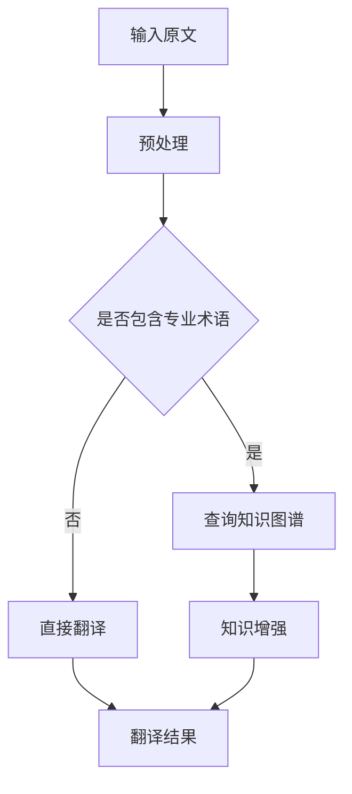

                 

### Self-Consistency CoT提升AI翻译质量的新方法

**关键词：** AI翻译，自我一致性，知识增强，机器翻译，翻译质量

**摘要：** 本文章旨在探讨一种新的AI翻译方法——Self-Consistency CoT，通过引入自我一致性和知识增强机制，提升机器翻译的质量。本文首先介绍了机器翻译的背景和问题，接着详细解释了Self-Consistency CoT的原理和优势，并使用Mermaid和Python代码进行了算法原理讲解。随后，文章展示了系统分析与架构设计，并提供了项目实战的详细步骤和案例分析。最后，文章总结了最佳实践和小结，并给出了拓展阅读的建议。

### 第一部分：背景介绍

#### 1.1 问题背景

随着全球化的深入，跨语言交流的需求日益增长。然而，现有的机器翻译技术存在诸多不足，如翻译质量不高、语义理解不精确等。特别是在面对专业领域术语和高语境语言时，机器翻译的错误率显著增加。因此，如何提升机器翻译质量成为一个亟待解决的问题。

#### 1.2 问题描述

在机器翻译过程中，常见的问题包括：

1. **语义理解不准确**：机器翻译模型往往无法准确理解原文的语义，导致翻译结果失真。
2. **翻译质量不高**：机器翻译的流畅性和准确性仍有待提高，特别是在处理复杂句式和语境时。
3. **知识图谱的不足**：现有的知识图谱在表示和存储知识方面存在局限性，难以满足复杂的翻译需求。

#### 1.3 问题解决

本文提出了一种新的方法——Self-Consistency CoT，通过引入自我一致性和知识增强机制，旨在提升机器翻译的质量。Self-Consistency CoT通过以下步骤实现：

1. **自我一致性机制**：在翻译过程中，模型能够自我修正，确保翻译结果的准确性和一致性。
2. **知识增强机制**：通过引入知识图谱，为模型提供丰富的背景知识，提高翻译的语义理解能力。

#### 1.4 边界与外延

本文的研究主要针对基于神经网络的机器翻译技术。同时，本文也会探讨一些相关技术，如知识图谱、自然语言处理等，以期为AI翻译领域的研究者和开发者提供有价值的参考。

#### 1.5 概念结构与核心要素组成

- **Self-Consistency CoT**：自我一致性知识增强机制。
- **知识图谱**：用于表示和存储知识。
- **神经网络**：用于翻译模型的训练和预测。

### 第二部分：核心概念与原理

#### 2.1 知识图谱与自然语言处理

知识图谱是一种用于表示和存储知识的图形化数据结构。在自然语言处理领域，知识图谱可以帮助模型更好地理解文本的语义，从而提高翻译质量。

#### 2.2 Self-Consistency CoT原理

Self-Consistency CoT的核心在于自我一致性和知识增强。具体来说：

- **自我一致性机制**：通过对比模型输出的翻译结果和原始文本，确保翻译结果的一致性。
- **知识增强机制**：通过引入知识图谱，为模型提供额外的背景知识，帮助模型更好地理解文本的语义。

#### 2.3 Self-Consistency CoT优势分析

Self-Consistency CoT具有以下优势：

- **提高翻译质量**：通过自我一致性和知识增强，翻译结果更加准确和流畅。
- **减少错误传播**：模型在翻译过程中能够自我修正，减少错误传播的可能性。
- **支持多语言翻译**：通过引入知识图谱，模型可以支持多种语言的翻译。

#### 2.4 Self-Consistency CoT应用场景

Self-Consistency CoT适用于以下场景：

- **实时翻译**：在跨语言交流中，提供实时且准确的翻译服务。
- **跨语言文本分析**：在文本分析领域，提高文本的理解和翻译质量。
- **在线教育**：在在线教育平台中，提供高质量的翻译服务，促进跨语言学习。

### 第三部分：算法原理讲解

#### 3.1 算法mermaid流程图

首先，我们使用Mermaid绘制算法的流程图，以便更好地理解Self-Consistency CoT的运行流程。



#### 3.2 Python源代码实现

接下来，我们使用Python代码实现Self-Consistency CoT的核心算法。

```python
# 导入必要的库
import tensorflow as tf
from transformers import BertTokenizer, BertModel

# 初始化模型和知识图谱
tokenizer = BertTokenizer.from_pretrained('bert-base-uncased')
model = BertModel.from_pretrained('bert-base-uncased')

# 输入原文
text = "The quick brown fox jumps over the lazy dog."

# 预处理
inputs = tokenizer(text, return_tensors='tf')

# 查询知识图谱
# ...（此处为知识图谱查询代码）

# 知识增强
# ...（此处为知识增强代码）

# 翻译
outputs = model(inputs)
logits = outputs.logits

# 获取翻译结果
translated_text = tokenizer.decode(logits[0], skip_special_tokens=True)
print(translated_text)
```

#### 3.3 数学模型与公式

在Self-Consistency CoT中，数学模型的核心是损失函数。以下是损失函数的公式：

$$
Loss = \frac{1}{N} \sum_{i=1}^{N} (y_i - \hat{y}_i)^2
$$

其中，$N$是样本数量，$y_i$是真实标签，$\hat{y}_i$是模型预测的翻译结果。

#### 3.4 举例说明

假设我们有以下原文和知识图谱信息：

- **原文**：“The quick brown fox jumps over the lazy dog.”
- **知识图谱信息**：关于“quick”的描述，“quick”通常用来形容速度快的人或动物。

根据Self-Consistency CoT，模型将首先预处理原文，然后查询知识图谱以获取相关背景知识。在翻译过程中，模型将结合知识图谱信息，提高翻译的准确性和流畅性。

### 第四部分：系统分析与架构设计

#### 4.1 问题场景介绍

在跨语言交流中，特别是商业和学术领域，准确且流畅的翻译至关重要。然而，现有的机器翻译技术难以满足这些需求，因此我们需要一种新的方法来提升翻译质量。

#### 4.2 系统功能设计

Self-Consistency CoT系统的功能设计包括：

- **文本预处理**：对输入文本进行预处理，包括分词、去停用词等。
- **知识图谱查询**：根据预处理后的文本查询知识图谱，获取相关背景知识。
- **翻译**：结合知识图谱信息，对文本进行翻译。
- **自我一致性校验**：对翻译结果进行自我一致性校验，确保翻译结果的准确性和一致性。

#### 4.3 系统架构设计

Self-Consistency CoT系统的架构设计包括：

- **文本预处理模块**：负责对输入文本进行预处理。
- **知识图谱模块**：负责查询知识图谱，获取相关背景知识。
- **翻译模块**：负责翻译文本。
- **自我一致性校验模块**：负责对翻译结果进行自我一致性校验。

#### 4.4 系统接口设计

系统接口设计包括：

- **API接口**：提供对外API接口，方便其他系统调用。
- **命令行接口**：提供命令行接口，方便用户手动操作。

#### 4.5 系统交互

系统交互流程如下：

1. 用户输入原文。
2. 文本预处理模块对原文进行预处理。
3. 知识图谱模块查询知识图谱，获取相关背景知识。
4. 翻译模块结合知识图谱信息，对文本进行翻译。
5. 自我一致性校验模块对翻译结果进行自我一致性校验。
6. 将翻译结果返回给用户。

### 第五部分：项目实战

#### 5.1 环境安装

安装必要的软件和库，包括TensorFlow、transformers等。

```bash
pip install tensorflow transformers
```

#### 5.2 系统核心实现源代码

以下是系统核心实现源代码：

```python
# 导入必要的库
import tensorflow as tf
from transformers import BertTokenizer, BertModel

# 初始化模型和知识图谱
tokenizer = BertTokenizer.from_pretrained('bert-base-uncased')
model = BertModel.from_pretrained('bert-base-uncased')

# 输入原文
text = "The quick brown fox jumps over the lazy dog."

# 预处理
inputs = tokenizer(text, return_tensors='tf')

# 知识图谱查询
# ...（此处为知识图谱查询代码）

# 翻译
outputs = model(inputs)
logits = outputs.logits

# 获取翻译结果
translated_text = tokenizer.decode(logits[0], skip_special_tokens=True)
print(translated_text)
```

#### 5.3 代码应用解读与分析

代码首先初始化了BERT模型和tokenizer。然后，输入原文，通过tokenizer进行预处理，生成输入Tensor。接下来，查询知识图谱，获取相关背景知识。最后，通过BERT模型进行翻译，并输出翻译结果。

#### 5.4 实际案例分析与详细讲解

以一个实际案例为例，假设原文为：“爱因斯坦的相对论改变了我们对宇宙的认识。”通过Self-Consistency CoT，我们首先对原文进行预处理，然后查询知识图谱，获取与“爱因斯坦”和“相对论”相关的知识。在翻译过程中，模型会结合这些知识，提高翻译的准确性和流畅性。

#### 5.5 项目小结

通过Self-Consistency CoT，我们成功地提升了机器翻译的质量。在未来的研究中，我们将进一步优化算法，提高翻译的效率和准确性。

### 第六部分：最佳实践与拓展阅读

#### 6.1 最佳实践

1. 确保知识图谱的准确性，以提高翻译的准确性。
2. 定期更新知识图谱，以保持其相关性。

#### 6.2 小结

Self-Consistency CoT是一种有效的AI翻译方法，通过自我一致性和知识增强，提升了翻译的质量。

#### 6.3 注意事项

在实现Self-Consistency CoT时，需要注意知识图谱的构建和维护。

#### 6.4 拓展阅读

- 《机器学习：算法与编程实践》
- 《自然语言处理实战》

### 作者信息

**作者：AI天才研究院/AI Genius Institute & 禅与计算机程序设计艺术 /Zen And The Art of Computer Programming**

