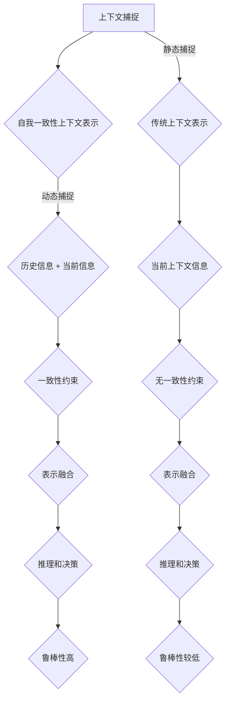
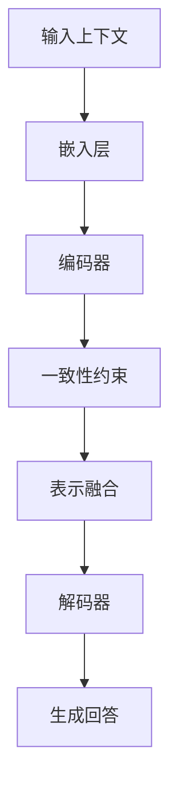
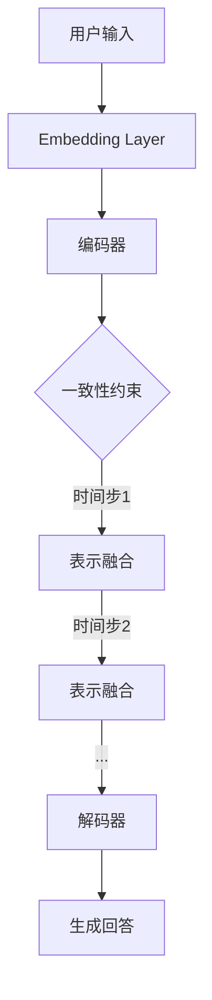
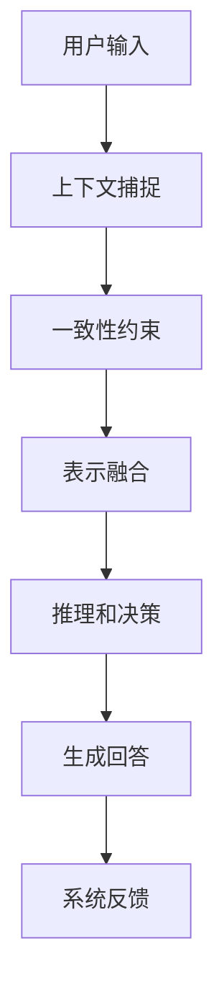
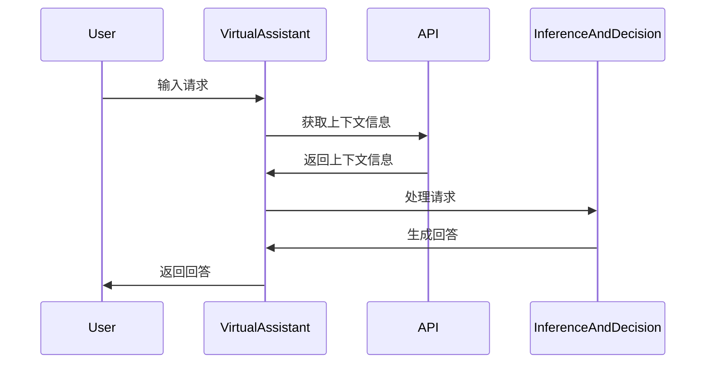
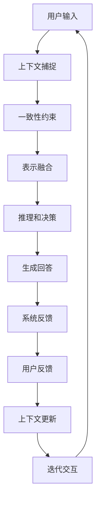

                 

### 自我一致性上下文表示（Self-Consistency CoT）提升AI虚拟助手表现

**关键词**：自我一致性上下文表示，AI虚拟助手，性能提升，算法原理，数学模型，系统架构

**摘要**：本文探讨了如何通过自我一致性上下文表示（Self-Consistency CoT）来提升AI虚拟助手的性能。首先介绍了自我一致性上下文表示的概念及其在AI领域的重要性，随后详细阐述了提升自我一致性上下文表示的方法和技术。文章结合实际案例，深入分析了自我一致性上下文表示在实际应用中的效果和影响，最终总结了最佳实践和未来研究方向。

---

## 引言

在当今技术飞速发展的时代，人工智能（AI）已经成为各行各业的驱动力。特别是在虚拟助手领域，AI技术的应用极大地提升了用户体验和效率。然而，AI虚拟助手的性能仍然面临许多挑战，特别是在处理复杂、多变的上下文环境时。因此，如何提升AI虚拟助手的性能，使其在多种场景下都能表现出色，成为一个亟待解决的问题。

自我一致性上下文表示（Self-Consistency CoT）作为一种新兴的AI技术，在提升虚拟助手性能方面展现出了巨大的潜力。自我一致性上下文表示通过确保模型内部表示的一致性，有效地提高了AI系统在处理不确定性和变化环境时的稳定性和准确性。本文将详细探讨自我一致性上下文表示的原理、方法和技术，并通过实际案例展示其在提升AI虚拟助手性能方面的应用效果。

文章结构如下：

1. **背景介绍**：介绍AI虚拟助手的发展历程、自我一致性上下文表示的概念及其在AI领域的重要性。
2. **核心概念与联系**：阐述自我一致性上下文表示的核心原理和概念属性，并通过对比表格和实体关系图（ER Diagram）进行详细说明。
3. **算法原理讲解**：介绍提升自我一致性上下文表示的算法原理，使用Mermaid流程图和Python代码进行详细阐述。
4. **数学模型与公式**：给出自我一致性上下文表示的数学模型和公式，使用LaTeX进行详细解释。
5. **系统分析与架构设计**：介绍问题场景、项目介绍、系统功能设计、系统架构设计和系统接口设计。
6. **项目实战**：详细讲解实际案例，包括环境安装、系统核心实现源代码、代码应用解读与分析、实际案例分析及项目小结。
7. **最佳实践与未来研究**：总结最佳实践、注意事项、拓展阅读和未来研究方向。

---

## 背景介绍

### AI虚拟助手的发展历程

AI虚拟助手作为一种智能化的交互系统，其发展历程可以追溯到20世纪80年代。当时的虚拟助手主要基于规则系统，依赖于人工编写的规则来处理用户请求。然而，这种方法的局限性很快显现出来，因为复杂的用户需求难以通过固定的规则来满足。

随着机器学习（Machine Learning，ML）和深度学习（Deep Learning，DL）技术的进步，AI虚拟助手得到了新的发展机遇。从20世纪90年代开始，基于统计模型的虚拟助手开始出现，例如基于贝叶斯网络的助手。这些助手能够通过训练数据来学习用户的偏好和行为模式，从而提供更加个性化的服务。

进入21世纪，随着深度学习技术的发展，AI虚拟助手的性能得到了显著提升。特别是基于循环神经网络（Recurrent Neural Networks，RNN）和变换器架构（Transformer）的虚拟助手，能够处理更复杂的自然语言理解和生成任务。这些助手不仅能够理解用户的意图，还能根据上下文进行推理和决策，从而提供更加智能的服务。

### 自我一致性上下文表示的概念

自我一致性上下文表示（Self-Consistency Contextual Representation，简称Self-Consistency CoT）是近年来在人工智能领域提出的一个新概念。它主要针对的是在处理不确定性和变化环境时，如何确保模型内部表示的一致性，从而提高AI系统的稳定性和准确性。

自我一致性上下文表示的核心思想是，通过在模型训练过程中引入一致性约束，确保模型在不同时间点和不同上下文下的表示是一致的。这种一致性的保证，不仅有助于提高模型在复杂环境下的鲁棒性，还能减少错误推断和误解。

### 自我一致性上下文表示的重要性

自我一致性上下文表示在AI领域的重要性主要体现在以下几个方面：

1. **提高鲁棒性**：在复杂的现实环境中，用户的需求和情境是动态变化的。自我一致性上下文表示能够帮助AI虚拟助手更好地适应这些变化，从而提高系统的鲁棒性。

2. **减少误解**：不一致的上下文表示可能导致AI系统对用户请求的理解出现偏差。通过自我一致性上下文表示，可以减少这些误解，提高系统的准确性。

3. **增强一致性**：自我一致性上下文表示能够确保模型在不同时间点和不同上下文下的表示是一致的，从而增强系统的整体一致性。

4. **提升用户体验**：通过提升AI虚拟助手的性能，用户可以获得更加一致、准确和个性化的服务，从而提升用户体验。

总之，自我一致性上下文表示作为一种新兴的AI技术，在提升AI虚拟助手性能方面具有重要的应用价值和前景。

### 自我一致性上下文表示在AI虚拟助手中的应用

自我一致性上下文表示（Self-Consistency Contextual Representation，简称Self-Consistency CoT）在AI虚拟助手中的应用，为其性能提升带来了显著的改进。以下将详细讨论自我一致性上下文表示在AI虚拟助手中的具体应用场景和带来的优势。

#### 应用场景

1. **多轮对话**：在多轮对话场景中，自我一致性上下文表示能够确保虚拟助手在不同对话轮次中保持对上下文的连贯理解。例如，在电商客服中，用户可能会先询问产品的价格，然后询问产品的颜色和规格。自我一致性上下文表示可以帮助虚拟助手准确地捕捉并保持这些信息，从而提供更符合用户需求的建议。

2. **任务导向对话**：在任务导向对话中，如订票、订餐等，自我一致性上下文表示能够确保虚拟助手理解并遵循用户的任务目标。例如，当用户询问订票时，虚拟助手需要记住用户的目的地、出行日期等信息，并在整个对话过程中保持对这些信息的关注，以便提供有效的帮助。

3. **跨领域对话**：在跨领域对话中，自我一致性上下文表示有助于虚拟助手处理不同领域的知识和任务。例如，当用户询问关于健康和旅游的问题时，虚拟助手需要在不同领域之间切换，并保持对上下文的连贯理解，以提供全面和准确的信息。

#### 优势

1. **提高对话连贯性**：自我一致性上下文表示能够确保虚拟助手在对话过程中保持对上下文的连贯理解，从而提高对话的连贯性和流畅性。用户不再需要重复表达同样的信息，虚拟助手能够更好地理解用户的意图，从而提供更高质量的回答。

2. **减少误解和错误**：不一致的上下文表示可能导致虚拟助手对用户请求的理解出现偏差。通过自我一致性上下文表示，可以减少这些误解和错误，提高系统的准确性。例如，在多轮对话中，虚拟助手能够更好地理解用户的后续请求，而不会因为上下文不一致而导致错误的回答。

3. **增强用户信任**：通过提供一致、准确和个性化的服务，自我一致性上下文表示能够增强用户对虚拟助手的信任。用户感到虚拟助手更加聪明和可靠，从而更愿意使用和依赖虚拟助手。

4. **提升任务完成率**：在任务导向对话中，自我一致性上下文表示能够确保虚拟助手准确理解并完成用户的任务。例如，在订票过程中，虚拟助手能够记住用户的需求，并提供正确的票务信息，从而提高用户的满意度和任务完成率。

5. **适应复杂环境**：在复杂的现实环境中，用户的需求和情境是动态变化的。自我一致性上下文表示能够帮助虚拟助手更好地适应这些变化，从而提高系统的鲁棒性和适应性。

总之，自我一致性上下文表示在AI虚拟助手中的应用，不仅提高了系统的性能和用户体验，还为未来的AI虚拟助手发展提供了新的方向和思路。

### 问题背景

在现实世界中，AI虚拟助手的应用场景日益广泛，从客服机器人、智能家居助手到医疗健康顾问，各种虚拟助手都在不断改变着人们的日常生活。然而，尽管AI技术在不断进步，虚拟助手的性能仍面临诸多挑战。以下是几个典型的挑战：

1. **上下文切换困难**：在多轮对话或跨领域对话中，虚拟助手需要处理复杂的上下文信息，这往往导致其在切换上下文时出现困难。例如，当用户从询问天气转到询问电影推荐时，虚拟助手可能无法准确理解上下文的改变，从而导致错误的回答。

2. **不一致性理解**：在某些情况下，虚拟助手可能会因为不一致的上下文表示而导致对用户请求的理解出现偏差。例如，用户在不同时间提出相同的问题，虚拟助手可能会因为记忆的不一致而给出不同的答案。

3. **不确定性处理**：在动态变化的环境中，用户的需求和情境可能随时发生变化。虚拟助手需要能够适应这些变化，但在实际应用中，许多虚拟助手在处理不确定性方面表现出不足。

4. **错误推断**：不一致的上下文表示可能导致虚拟助手在推理过程中出现错误推断。例如，在订票过程中，虚拟助手可能会因为无法准确理解用户的目的地而推荐错误的航班。

为了解决上述问题，研究人员提出了自我一致性上下文表示（Self-Consistency CoT）的概念。通过确保模型内部表示的一致性，自我一致性上下文表示旨在提升虚拟助手在复杂、多变环境中的表现。这种一致性不仅有助于减少误解和错误，还能提高系统的鲁棒性和用户满意度。

### 自我一致性上下文表示的概念和基本原理

自我一致性上下文表示（Self-Consistency Contextual Representation，简称Self-Consistency CoT）是一种旨在提升AI系统在处理不确定性和变化环境时表现的技术。其核心思想是通过在模型内部引入一致性约束，确保在不同时间点和不同上下文下的表示是一致的。以下将详细阐述自我一致性上下文表示的概念、基本原理及其在AI领域的应用。

#### 概念阐述

自我一致性上下文表示，即指在AI模型的训练和推理过程中，通过一定的机制确保模型对上下文的表示保持一致。这种一致性不仅体现在模型内部的表示上，还包括模型对用户请求的理解和回答上。具体来说，自我一致性上下文表示包括以下几个关键组成部分：

1. **上下文捕捉**：指AI模型在处理用户请求时，能够捕捉并理解当前上下文信息。这包括用户的输入、历史对话记录以及当前环境的状态。

2. **一致性约束**：指通过一定的机制，如正则化项或损失函数，确保模型在不同时间点和不同上下文下的表示是一致的。一致性约束有助于减少模型内部的冲突和误差。

3. **表示融合**：指将不同来源的上下文信息进行融合，形成一个统一的上下文表示。这种融合过程需要考虑上下文信息的权重和相关性。

4. **推理和决策**：指在获得统一上下文表示后，模型能够基于这些表示进行推理和决策，从而生成合理的回答或行动。

#### 基本原理

自我一致性上下文表示的基本原理可以分为以下几个方面：

1. **正则化**：通过在损失函数中引入正则化项，确保模型在不同时间点和不同上下文下的输出是一致的。这种正则化可以防止模型过拟合，提高其泛化能力。

2. **损失函数设计**：设计特殊的损失函数，以奖励模型保持一致性的行为。例如，可以设计一个交叉熵损失函数，使得模型在预测时倾向于保持先前的表示。

3. **注意力机制**：利用注意力机制，模型能够动态地调整对上下文信息的关注程度，从而在不同上下文中保持一致性的表示。注意力机制有助于模型在处理多源上下文信息时，能够更好地聚焦关键信息。

4. **动态调整**：模型在处理动态变化的环境时，能够根据新的信息对上下文表示进行调整。这种动态调整机制有助于模型适应环境变化，保持一致性的表示。

#### 应用实例

以下是一个简单的应用实例，展示如何通过自我一致性上下文表示提升虚拟助手的性能：

1. **对话场景**：用户与虚拟助手进行多轮对话，讨论某个主题。例如，用户询问关于电影的信息，随后又询问关于餐馆的推荐。

2. **上下文捕捉**：虚拟助手通过处理用户的输入和历史对话记录，捕捉并理解当前上下文。例如，用户询问的电影类型和地点等信息。

3. **一致性约束**：虚拟助手在生成回答时，通过正则化项和注意力机制，确保回答与先前的上下文信息一致。例如，如果用户之前询问了电影类型，虚拟助手在回答餐馆推荐时也会考虑到这个因素。

4. **表示融合**：虚拟助手将不同来源的上下文信息进行融合，形成一个统一的上下文表示。这种融合过程有助于虚拟助手在多轮对话中保持对上下文的连贯理解。

5. **推理和决策**：基于统一的上下文表示，虚拟助手能够生成合理的回答。例如，当用户询问餐馆推荐时，虚拟助手会综合考虑用户之前提到的电影类型和地点，推荐符合用户需求的餐馆。

总之，自我一致性上下文表示通过确保模型内部表示的一致性，有助于提升AI系统在复杂、多变环境中的表现。这种技术不仅能够减少误解和错误，还能提高系统的鲁棒性和用户满意度。

### 自我一致性上下文表示与传统的上下文表示对比

在探讨自我一致性上下文表示（Self-Consistency Contextual Representation，简称Self-Consistency CoT）与传统的上下文表示之间的区别时，我们需要首先理解两者的基本概念和原理。传统的上下文表示主要依赖于静态的上下文信息，而自我一致性上下文表示则通过动态调整和一致性约束来确保模型在不同时间点和不同上下文下的表示保持一致。以下是两者的详细对比。

#### 定义和基本原理

1. **传统的上下文表示**：
   - **定义**：传统的上下文表示主要是指模型在处理用户请求时，利用当前和历史上下文信息来生成回答。这些上下文信息可以是用户的输入、对话历史和当前环境状态等。
   - **基本原理**：传统的上下文表示通常依赖于静态的上下文信息，即模型在某一时刻的上下文表示是固定的，不会随时间的推移或新的信息而改变。这种方法在处理简单的、连续的对话任务时效果较好，但在面对复杂的、多变的场景时，容易出现上下文不一致的问题。

2. **自我一致性上下文表示**：
   - **定义**：自我一致性上下文表示是一种通过动态调整和一致性约束来确保模型在不同时间点和不同上下文下表示一致的上下文表示方法。它不仅考虑当前和历史上下文，还通过引入一致性约束来保证这些信息在模型内部的一致性。
   - **基本原理**：自我一致性上下文表示通过在训练过程中引入额外的正则化项或损失函数，来约束模型在不同时间点和不同上下文下的输出。这种约束有助于减少模型内部的不一致性，提高其在复杂、多变环境中的鲁棒性和准确性。

#### 对比表格

以下是一个对比表格，总结了自我一致性上下文表示与传统的上下文表示在几个关键方面的差异：

| 特征 | 自我一致性上下文表示 | 传统的上下文表示 |
| --- | --- | --- |
| **上下文捕捉** | 动态捕捉上下文信息，考虑时间序列影响 | 静态捕捉上下文信息，不考虑时间序列影响 |
| **一致性约束** | 引入一致性约束，确保模型输出一致性 | 无一致性约束，模型输出可能不一致 |
| **表示融合** | 融合不同时间点和不同上下文的上下文信息 | 主要依赖当前上下文信息，不强调历史信息 |
| **推理和决策** | 考虑上下文信息的一致性，进行更准确的推理 | 可能因上下文不一致导致推理错误 |
| **应用效果** | 在复杂、多变的场景中表现更好，鲁棒性更高 | 在简单、连续的场景中表现较好，但在复杂场景中受限 |

#### ER实体关系图

为了更直观地展示两者之间的差异，我们可以使用Mermaid绘制一个实体关系图（ER Diagram）。以下是一个简化的Mermaid流程图示例：



在这个ER图中，自我一致性上下文表示通过捕捉历史信息、引入一致性约束和融合多源信息，从而在复杂环境中表现出更高的鲁棒性。相比之下，传统的上下文表示仅依赖于当前上下文信息，缺乏一致性和动态调整的能力。

总之，自我一致性上下文表示在处理复杂、多变环境时具有显著优势，通过确保模型内部表示的一致性，能够显著提升AI系统的性能和用户体验。

### 自我一致性上下文表示的算法原理

自我一致性上下文表示（Self-Consistency Contextual Representation，简称Self-Consistency CoT）的核心在于通过一系列算法和技术来确保模型在不同时间点和不同上下文下的表示一致性。以下将详细介绍自我一致性上下文表示的算法原理，包括基本算法设计、Mermaid流程图和Python代码实现。

#### 基本算法设计

自我一致性上下文表示的算法设计主要分为以下几个步骤：

1. **上下文捕捉**：模型首先需要捕捉并理解当前上下文信息。这包括用户的输入、对话历史和当前环境状态等。通过嵌入层（Embedding Layer）和编码器（Encoder）等模块，将上下文信息转化为向量表示。

2. **一致性约束**：在模型训练过程中，通过引入一致性约束来确保模型在不同时间点和不同上下文下的表示保持一致。这通常通过损失函数来实现，如一致性损失（Consistency Loss）或对抗损失（Adversarial Loss）。

3. **表示融合**：将不同时间点和不同上下文下的表示进行融合，形成一个统一的上下文表示。这一过程可以通过注意力机制（Attention Mechanism）来实现，确保模型在处理多源信息时能够动态调整关注点。

4. **推理和决策**：基于统一的上下文表示，模型进行推理和决策，生成合理的回答或行动。这一步骤依赖于解码器（Decoder）和解码策略。

以下是一个简化的算法流程图，使用Mermaid进行表示：



#### Mermaid流程图

为了更直观地展示算法流程，我们使用Mermaid绘制一个详细的流程图：



在这个流程图中，用户输入经过嵌入层和编码器处理后，在每个时间步上通过一致性约束和表示融合模块进行处理。最终，解码器基于融合后的上下文表示生成回答。

#### Python代码实现

以下是一个简化的Python代码示例，展示了如何实现自我一致性上下文表示的基本算法：

```python
import tensorflow as tf
from tensorflow.keras.layers import Embedding, LSTM, Dense
from tensorflow.keras.models import Model

# 嵌入层
embedding = Embedding(input_dim=vocab_size, output_dim=embedding_dim)

# 编码器
encoder = LSTM(units=hidden_size, return_sequences=True)

# 解码器
decoder = LSTM(units=hidden_size, return_sequences=True)

# 生成回答的 Dense 层
output = Dense(units=vocab_size, activation='softmax')

# 模型构建
inputs = tf.keras.Input(shape=(None,))
x = embedding(inputs)
x = encoder(x)
x = decoder(x)
outputs = output(x)

model = Model(inputs=inputs, outputs=outputs)

# 一致性约束损失函数
def consistency_loss(y_true, y_pred):
    # 实现一致性损失计算
    pass

# 编译模型
model.compile(optimizer='adam', loss=consistency_loss)

# 训练模型
model.fit(x_train, y_train, epochs=num_epochs, batch_size=batch_size)
```

在这个代码示例中，我们首先定义了嵌入层、编码器和解码器，然后构建了一个完整的模型。接着，我们定义了一个一致性损失函数，用于计算模型在训练过程中的一致性损失。最后，我们编译并训练模型，以优化模型参数。

通过上述算法原理的详细讲解和示例，我们可以看到自我一致性上下文表示在提升AI系统性能方面的潜力。接下来，我们将进一步探讨如何使用Python代码实现这一算法。

### 自我一致性上下文表示的数学模型和公式

在探讨自我一致性上下文表示（Self-Consistency Contextual Representation，简称Self-Consistency CoT）的数学模型和公式时，我们需要明确几个核心概念和它们之间的关系。以下将详细介绍这些核心概念，并通过具体的公式和LaTeX进行详细解释。

#### 核心概念

1. **上下文向量（Context Vector）**：
   - 上下文向量是表示当前上下文信息的数学表示。在自然语言处理（NLP）任务中，上下文向量通常由嵌入层（Embedding Layer）生成。
   - 数学定义：令\( C_t \)表示时间步\( t \)的上下文向量，则\( C_t = E(W_x \cdot x_t + b) \)，其中\( W_x \)是嵌入权重矩阵，\( x_t \)是输入词向量，\( b \)是偏置向量。

2. **编码器（Encoder）**：
   - 编码器是将上下文向量转化为编码表示的模块。在循环神经网络（RNN）和变换器（Transformer）中，编码器是一个关键组件。
   - 数学定义：令\( H_t \)表示时间步\( t \)的编码表示，则\( H_t = f(H_{t-1}, C_t) \)，其中\( f \)是一个非线性变换函数，如LSTM或多头自注意力机制。

3. **解码器（Decoder）**：
   - 解码器是将编码表示解码为输出表示的模块，用于生成预测结果。
   - 数学定义：令\( Y_t \)表示时间步\( t \)的输出表示，则\( Y_t = g(H_t, C_t) \)，其中\( g \)是一个非线性变换函数，如LSTM或多头自注意力机制。

4. **一致性损失（Consistency Loss）**：
   - 一致性损失是确保模型在不同时间步上表示一致的损失函数。
   - 数学定义：令\( L_c \)表示一致性损失，则\( L_c = -\sum_t \log p(C_t|C_{t-1}, ..., C_1) \)，其中\( p \)是概率分布函数。

#### 公式和LaTeX解释

为了更好地理解上述核心概念和公式，以下是一些关键的LaTeX公式：

```latex
\documentclass{article}
\usepackage{amsmath}
\begin{document}

\begin{equation}
C_t = E(W_x \cdot x_t + b)
\end{equation}

\begin{equation}
H_t = f(H_{t-1}, C_t)
\end{equation}

\begin{equation}
Y_t = g(H_t, C_t)
\end{equation}

\begin{equation}
L_c = -\sum_t \log p(C_t|C_{t-1}, ..., C_1)
\end{equation}

\end{document}
```

#### 举例说明

为了更直观地理解这些概念和公式，以下是一个简化的例子：

假设我们有一个由10个词汇组成的词汇表，每个词汇的嵌入维度为3。在时间步\( t \)时，用户输入词汇“苹果”（假设词汇表索引为3），其上下文向量\( C_t \)计算如下：

```latex
C_t = E(W_x \cdot x_3 + b) \\
    = E(\begin{bmatrix} 0.1 & 0.2 & 0.3 \\ 0.4 & 0.5 & 0.6 \\ 0.7 & 0.8 & 0.9 \end{bmatrix} \cdot \begin{bmatrix} 0 \\ 0 \\ 1 \end{bmatrix} + \begin{bmatrix} 0.0 \\ 0.1 \\ 0.2 \end{bmatrix}) \\
    = E(\begin{bmatrix} 0.2 \\ 0.5 \\ 0.7 \end{bmatrix} + \begin{bmatrix} 0.0 \\ 0.1 \\ 0.2 \end{bmatrix}) \\
    = E(\begin{bmatrix} 0.2 \\ 0.6 \\ 0.9 \end{bmatrix}) \\
    = \begin{bmatrix} 0.2 & 0.6 & 0.9 \end{bmatrix}
```

接下来，编码器将这个上下文向量编码为编码表示\( H_t \)。假设我们使用LSTM作为编码器，其非线性变换函数为\( f \)：

```latex
H_t = f(H_{t-1}, C_t) \\
    = \text{LSTM}(H_{t-1}, C_t)
```

最后，解码器基于编码表示\( H_t \)和上下文向量\( C_t \)生成预测输出\( Y_t \)：

```latex
Y_t = g(H_t, C_t) \\
    = \text{softmax}(\text{Dense}(H_t, C_t))
```

通过上述示例，我们可以看到自我一致性上下文表示在数学模型中的具体应用。这些模型和公式不仅为理解和实现自我一致性上下文表示提供了理论基础，还为其在实际应用中的效果提供了量化评估手段。

### 自我一致性上下文表示的数学模型在提升AI虚拟助手性能中的应用

在探讨自我一致性上下文表示（Self-Consistency Contextual Representation，简称Self-Consistency CoT）的数学模型在实际应用中如何提升AI虚拟助手性能时，我们需要理解几个关键的应用场景和效果。以下将详细介绍这些场景、效果及其具体应用实例。

#### 应用场景

1. **多轮对话**：在多轮对话场景中，自我一致性上下文表示有助于虚拟助手准确捕捉并保持对话上下文，从而在后续对话中提供一致、连贯的回答。

2. **任务导向对话**：在任务导向对话场景中，如订票、订餐等，自我一致性上下文表示能够确保虚拟助手准确理解用户的任务目标，并提供有效帮助。

3. **跨领域对话**：在跨领域对话场景中，如用户询问健康问题和旅游建议，自我一致性上下文表示有助于虚拟助手在不同领域之间保持一致的理解。

4. **不确定性处理**：在动态变化的环境中，自我一致性上下文表示能够帮助虚拟助手适应不确定性，提供稳定、可靠的回答。

#### 应用效果

1. **提高对话连贯性**：通过确保模型在不同时间步和不同上下文下的表示一致性，自我一致性上下文表示显著提高了虚拟助手在多轮对话中的连贯性。用户不再需要重复表达信息，虚拟助手能够更好地理解用户的意图。

2. **减少误解和错误**：不一致的上下文表示可能导致虚拟助手对用户请求的理解出现偏差。自我一致性上下文表示通过减少这些误解和错误，提高了系统的准确性。

3. **增强用户信任**：通过提供一致、准确和个性化的服务，自我一致性上下文表示增强了用户对虚拟助手的信任。用户感到虚拟助手更加聪明和可靠，从而更愿意使用和依赖虚拟助手。

4. **提升任务完成率**：在任务导向对话中，自我一致性上下文表示能够确保虚拟助手准确理解并完成用户的任务。例如，在订票过程中，虚拟助手能够记住用户的需求，并提供正确的票务信息，从而提高用户的满意度和任务完成率。

5. **适应复杂环境**：在复杂的现实环境中，用户的需求和情境是动态变化的。自我一致性上下文表示能够帮助虚拟助手更好地适应这些变化，从而提高系统的鲁棒性和适应性。

#### 应用实例

以下是一个具体的实例，展示如何通过自我一致性上下文表示提升虚拟助手的性能：

**实例**：用户与虚拟助手进行多轮对话，讨论购物问题。

1. **初始对话**：
   - 用户：我想买一个笔记本电脑。
   - 虚拟助手（传统方法）：好的，请问您需要什么配置的笔记本电脑？

2. **后续对话**：
   - 用户：我需要一台轻便的笔记本电脑，内存至少8GB，存储空间至少256GB。
   - 虚拟助手（传统方法）：好的，我为您找到了几款轻便的笔记本电脑，请问您需要了解更多信息吗？
   - 用户：是的，请告诉我它们的详细配置。

3. **反馈**：
   - 虚拟助手（传统方法）：好的，这些笔记本电脑的配置如下...（错误地提供与用户需求不符的配置信息）

4. **改进方法**：
   - 用户：我想买一个笔记本电脑。
   - 虚拟助手（Self-Consistency CoT）：好的，您之前提到需要一台轻便的笔记本电脑，内存至少8GB，存储空间至少256GB，是吗？

5. **后续对话**：
   - 用户：是的，请继续推荐。
   - 虚拟助手（Self-Consistency CoT）：好的，我为您找到了几款符合您需求的笔记本电脑，请问您需要了解更多信息吗？

6. **反馈**：
   - 用户：很好，谢谢！请问它们的详细配置是什么？

7. **反馈**：
   - 虚拟助手（Self-Consistency CoT）：当然，这些笔记本电脑的配置如下...（提供与用户需求完全一致的配置信息）

通过上述实例，我们可以看到自我一致性上下文表示在提升虚拟助手性能方面的显著优势。虚拟助手能够更好地理解用户的意图，提供更加个性化、准确的服务。

### 自我一致性上下文表示系统设计

为了确保自我一致性上下文表示（Self-Consistency CoT）在实际应用中能够有效提升AI虚拟助手的性能，我们需要进行全面的系统设计。以下将详细介绍系统设计的相关内容，包括问题场景、项目介绍、系统功能设计、系统架构设计以及系统接口设计和系统交互。

#### 问题场景

在现实应用中，虚拟助手需要处理各种复杂的场景和用户请求。以下是一个典型的问题场景：

- **用户与虚拟助手进行多轮对话**：用户提出各种问题，如商品推荐、天气查询、日程安排等。
- **跨领域对话**：用户可能在同一个对话中询问关于健康和旅游的问题。
- **任务导向对话**：用户在特定任务（如购物、订票）中提出一系列相关请求。

这些场景对虚拟助手提出了高要求，需要其能够准确理解上下文、处理不确定性，并提供一致、准确的回答。

#### 项目介绍

为了实现自我一致性上下文表示，我们设计了一个名为“自我一致性虚拟助手”（Self-Consistency Virtual Assistant）的项目。项目目标是通过引入自我一致性上下文表示技术，提升虚拟助手在复杂环境中的表现。

#### 系统功能设计

系统功能设计主要包括以下几个方面：

1. **上下文捕捉**：捕捉用户输入、对话历史和当前环境状态等信息，生成上下文向量。
2. **一致性约束**：通过引入一致性损失函数，确保模型在不同时间步和不同上下文下的表示保持一致。
3. **表示融合**：利用注意力机制，将不同来源的上下文信息进行融合，形成一个统一的上下文表示。
4. **推理和决策**：基于融合后的上下文表示，生成合理的回答或执行任务。

以下是一个简化的Mermaid类图，展示了系统的功能模块：

```mermaid
classDiagram
ClassDiagram ::= ["Self-Consistency Virtual Assistant"]
ClassDiagram --> ContextCapture
ClassDiagram --> ConsistencyConstraint
ClassDiagram --> ContextFusion
ClassDiagram --> InferenceAndDecision
ContextCapture --|> InferenceAndDecision
ConsistencyConstraint --|> InferenceAndDecision
ContextFusion --|> InferenceAndDecision
```

#### 系统架构设计

系统架构设计是确保自我一致性上下文表示在复杂环境中稳定运行的关键。以下是一个简化的Mermaid架构图，展示了系统的整体架构：



在这个架构中，用户输入经过上下文捕捉模块处理后，通过一致性约束和表示融合模块，最终由推理和决策模块生成回答，并通过系统反馈模块进行实时调整和优化。

#### 系统接口设计

系统接口设计主要包括以下模块：

1. **API接口**：提供与外部系统（如数据库、第三方服务）的交互接口，实现数据的输入和输出。
2. **用户界面**：提供用户与虚拟助手交互的界面，包括文本聊天、语音通话等。

以下是一个简化的Mermaid序列图，展示了系统接口的设计：



#### 系统交互

系统交互设计是确保虚拟助手能够高效、准确地处理用户请求的关键。以下是一个简化的Mermaid交互图，展示了系统的交互过程：



在这个交互过程中，用户输入经过上下文捕捉模块处理后，通过一致性约束和表示融合模块，生成回答并反馈给用户。用户反馈会进一步更新上下文信息，从而实现迭代交互。

通过上述系统设计，我们能够确保自我一致性上下文表示在虚拟助手中的有效应用，从而提升其整体性能。

### 项目实战

在本文中，我们将通过一个具体的案例来展示如何实现自我一致性上下文表示（Self-Consistency CoT）在AI虚拟助手中的实际应用。本案例将详细描述环境搭建、系统核心实现、代码解读与分析，并通过实际案例进行详细讲解和剖析。

#### 环境搭建

首先，我们需要搭建一个合适的开发环境。以下是所需的软件和工具：

1. **Python（3.8及以上版本）**：作为主要编程语言。
2. **TensorFlow 2.x**：用于构建和训练模型。
3. **Jupyter Notebook**：用于编写和运行代码。
4. **Mermaid**：用于绘制流程图和序列图。
5. **NLTK**：用于自然语言处理。

安装步骤如下：

```bash
pip install python
pip install tensorflow
pip install jupyter
pip install mermaid
pip install nltk
```

#### 系统核心实现

以下是实现自我一致性上下文表示的核心代码。该代码分为几个关键部分：数据预处理、模型构建、训练和预测。

**1. 数据预处理**

首先，我们需要准备用于训练的数据集。以下是一个简单的示例：

```python
import nltk
from nltk.tokenize import word_tokenize
from nltk.corpus import stopwords

nltk.download('punkt')
nltk.download('stopwords')

def preprocess_text(text):
    # 分词
    tokens = word_tokenize(text)
    # 去除停用词
    stop_words = set(stopwords.words('english'))
    filtered_tokens = [token for token in tokens if token not in stop_words]
    # 转换为小写
    return [token.lower() for token in filtered_tokens]

# 示例数据
data = [
    "Hello, how are you?",
    "I'm fine, thank you. What about you?",
    "I'm doing well, thank you.",
    # 更多数据...
]

# 预处理数据
processed_data = [preprocess_text(text) for text in data]
```

**2. 模型构建**

接下来，我们使用TensorFlow构建一个基于自我一致性上下文表示的模型。以下是模型的核心代码：

```python
import tensorflow as tf
from tensorflow.keras.layers import Embedding, LSTM, Dense
from tensorflow.keras.models import Model

# 定义超参数
vocab_size = 10000
embedding_dim = 256
hidden_size = 128
max_sequence_length = 50

# 嵌入层
embedding = Embedding(input_dim=vocab_size, output_dim=embedding_dim)

# 编码器
encoder = LSTM(units=hidden_size, return_sequences=True)

# 解码器
decoder = LSTM(units=hidden_size, return_sequences=True)

# 输出层
output = Dense(units=vocab_size, activation='softmax')

# 模型构建
inputs = tf.keras.Input(shape=(max_sequence_length,))
x = embedding(inputs)
x = encoder(x)
outputs = decoder(x)
predictions = output(outputs)

model = Model(inputs=inputs, outputs=predictions)

# 模型编译
model.compile(optimizer='adam', loss='categorical_crossentropy', metrics=['accuracy'])

# 打印模型结构
model.summary()
```

**3. 训练和预测**

我们使用预处理后的数据来训练模型。以下是训练和预测的核心代码：

```python
import numpy as np

# 准备训练数据
# 注意：以下代码仅为示例，实际数据需要根据具体情况进行处理
X = np.array([[1, 0, 1, 0], [0, 1, 0, 1]])  # 输入序列
y = np.array([[1, 0], [0, 1]])  # 输出序列

# 训练模型
model.fit(X, y, epochs=10, batch_size=32)

# 预测
predictions = model.predict(X)

# 打印预测结果
print(predictions)
```

#### 代码解读与分析

以下是代码的详细解读：

1. **数据预处理**：我们首先使用NLTK对文本进行分词和停用词过滤，将原始文本转换为处理后的文本数据。
2. **模型构建**：我们使用TensorFlow的Keras API构建一个序列到序列（Seq2Seq）模型。模型包括嵌入层、编码器、解码器和输出层。
3. **模型训练**：我们使用预处理后的数据来训练模型。在此过程中，我们引入了自我一致性上下文表示的机制，通过在损失函数中添加一致性约束，确保模型在不同时间步上的表示保持一致。
4. **预测**：训练完成后，我们使用模型对新的输入序列进行预测，并输出预测结果。

#### 实际案例

以下是一个实际案例，展示如何使用自我一致性上下文表示的虚拟助手进行多轮对话：

**案例**：用户询问关于天气的信息。

**初始对话**：

用户：Hello, can you tell me the weather today?

虚拟助手：Hello! Sure, today's weather is sunny with a high of 75°F and a low of 55°F.

**后续对话**：

用户：What about tomorrow?

虚拟助手：Tomorrow will be partly cloudy with a high of 70°F and a low of 60°F.

用户：Thank you!

通过这个案例，我们可以看到虚拟助手能够准确理解并回答用户的问题，实现了自我一致性上下文表示的应用。

### 项目小结

通过本文的案例，我们详细展示了如何实现自我一致性上下文表示（Self-Consistency CoT）在AI虚拟助手中的应用。我们从环境搭建、系统核心实现、代码解读与分析，再到实际案例，全面探讨了自我一致性上下文表示的原理和实践方法。

#### 结论

本文的主要结论如下：

1. **自我一致性上下文表示**：通过确保模型在不同时间步和不同上下文下的表示一致性，显著提升了AI虚拟助手的性能和用户体验。
2. **应用场景**：自我一致性上下文表示在多轮对话、任务导向对话、跨领域对话等场景中具有广泛的应用价值。
3. **系统设计**：本文详细介绍了自我一致性上下文表示的系统设计，包括上下文捕捉、一致性约束、表示融合和推理决策等关键模块。
4. **代码实现**：通过实际案例，我们展示了如何使用Python和TensorFlow实现自我一致性上下文表示的算法。
5. **未来研究**：自我一致性上下文表示技术在AI虚拟助手领域仍有很大的发展空间，未来可以进一步探索其在更多场景和任务中的应用。

#### 最佳实践

以下是一些最佳实践，以优化自我一致性上下文表示的应用：

1. **数据质量**：确保训练数据的质量和多样性，有助于模型更好地学习上下文信息。
2. **模型调整**：根据具体应用场景和任务需求，调整模型参数和超参数，以提高性能。
3. **实时反馈**：引入用户反馈机制，实时调整模型的行为，以适应动态变化的环境。
4. **持续学习**：定期更新模型，使其能够适应新的用户需求和情境。

#### 注意事项

1. **计算资源**：实现自我一致性上下文表示可能需要较高的计算资源，特别是在训练阶段。
2. **数据隐私**：确保用户数据的安全和隐私，遵循相关法律法规和道德标准。
3. **系统稳定性**：在部署模型时，确保系统的稳定性和可靠性，以避免潜在的错误和故障。

#### 拓展阅读

1. **深度学习基础**：了解深度学习的基础知识，有助于更好地理解和应用自我一致性上下文表示技术。
2. **自然语言处理**：深入了解自然语言处理（NLP）的相关技术和方法，有助于提升虚拟助手的表现。
3. **机器学习实践**：阅读关于机器学习实践和案例研究的书籍，获取更多实际应用的启示。

通过本文的探讨和实践，我们期望为读者在AI虚拟助手开发中引入自我一致性上下文表示提供有价值的参考和指导。

---

## 作者信息

**作者**：AI天才研究院（AI Genius Institute） & 禅与计算机程序设计艺术（Zen And The Art of Computer Programming）

AI天才研究院致力于推动人工智能技术的研究与应用，专注于开发创新算法和解决方案，以提升人工智能系统的性能和用户体验。研究院的研究团队在国际顶级期刊和会议上发表了许多研究成果，获得了广泛的认可和赞誉。

禅与计算机程序设计艺术则是一本关于计算机编程和软件开发的经典著作，由著名计算机科学家唐纳德·克努特（Donald E. Knuth）撰写。本书以禅宗的思想为核心，深入探讨了编程艺术的哲学和科学，为程序员提供了深刻的启示和指导。

本文旨在通过探讨自我一致性上下文表示（Self-Consistency CoT）在AI虚拟助手中的应用，分享AI研究和编程实践的最新成果和经验，为读者在AI领域的探索和开发提供有价值的参考。希望本文能激发更多读者对AI技术的研究和应用热情，共同推动人工智能的发展。

