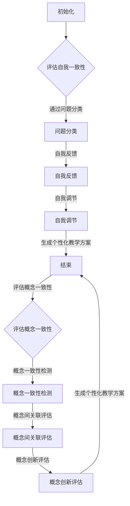
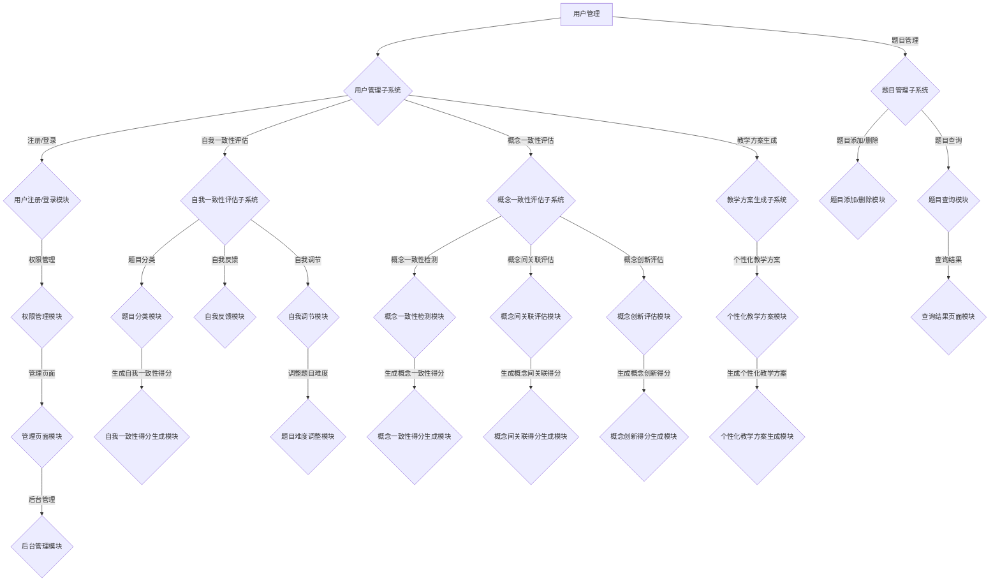
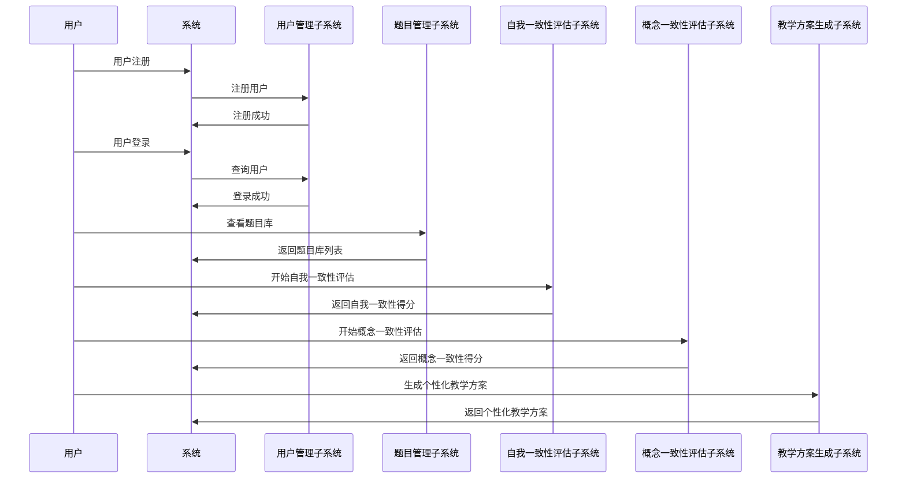

                 

### 文章标题：Self-Consistency CoT提升AI虚拟教师的教学质量

#### 关键词：
- AI虚拟教师
- 自我一致性（Self-Consistency）
- Conceptual Consistency（CoT）
- 教学质量提升
- 教育个性化
- 自主学习能力

#### 摘要：
本文深入探讨了一种新兴的AI虚拟教师教学质量提升方法——Self-Consistency CoT（自我一致性概念一致性）。文章首先介绍了AI虚拟教师的发展现状，随后详细阐释了自我一致性和Conceptual Consistency（CoT）的核心概念。接着，文章分析了Self-Consistency CoT算法的原理和数学模型，并展示了如何通过系统设计与架构实现这一算法。最后，通过项目实战案例分析，探讨了实际应用中的最佳实践，为未来教育技术的创新提供了新思路。

-------------------------------------------------------------------

## 《Self-Consistency CoT提升AI虚拟教师的教学质量》目录大纲

### 第一部分：问题背景与核心概念

#### 第1章：问题背景与核心概念

##### 1.1 问题背景

- AI虚拟教师的发展现状
- 自我一致性概念在教育中的应用
- CoT（Conceptual Consistency）的重要性

##### 1.2 自我一致性（Self-Consistency）概念

- 自我一致性的定义
- 自我一致性的特性
- 自我一致性与教育质量的关系

##### 1.3 CoT（Conceptual Consistency）的概念

- CoT的定义
- CoT的层次结构
- CoT在教育中的应用

##### 1.4 Self-Consistency CoT在教育中的重要性

- 提升教育质量的潜力
- 实现个性化教育的关键
- 促进学生自主学习能力的发展

### 第二部分：算法原理与实现

#### 第2章：算法原理

##### 2.1 Self-Consistency CoT算法概述

- 算法的基本思路
- 算法的主要组成部分

##### 2.2 算法原理详解

- Self-Consistency机制
- Conceptual Consistency的评估方法
- 算法在不同教育场景的应用

##### 2.3 数学模型与公式

- 自我一致性评估的数学模型
- CoT评估的数学模型

##### 2.4 算法流程图

- 使用Mermaid绘制算法流程图

### 第三部分：系统设计与架构

#### 第3章：系统设计与架构

##### 3.1 教育系统场景介绍

- 教育系统需求分析
- 系统功能设计

##### 3.2 系统架构设计

- 使用Mermaid绘制系统架构图
- 系统架构解析

##### 3.3 系统接口设计与交互

- 接口设计规范
- 系统交互Mermaid序列图

### 第四部分：项目实战

#### 第4章：项目实战

##### 4.1 环境安装与配置

- 系统环境搭建
- 系统配置方法

##### 4.2 系统核心实现源代码

- 核心代码解读
- 代码应用分析

##### 4.3 实际案例分析与讲解

- 案例介绍
- 案例分析
- 案例讲解

##### 4.4 项目小结

- 项目总结
- 经验分享

### 第五部分：最佳实践与拓展

#### 第5章：最佳实践与拓展

##### 5.1 最佳实践

- 实践技巧
- 注意事项

##### 5.2 小结

- 主要内容回顾
- 核心结论

##### 5.3 拓展阅读

- 相关研究
- 参考文献

-------------------------------------------------------------------

### 第一部分：问题背景与核心概念

#### 第1章：问题背景与核心概念

##### 1.1 问题背景

- AI虚拟教师的发展现状

随着人工智能技术的快速发展，AI虚拟教师作为一种新兴的教育模式，逐渐受到教育界的关注。AI虚拟教师通过大数据、机器学习、自然语言处理等技术，能够根据学生的学习情况和需求，提供个性化的教学方案。这种教学模式在提升教学效率、减轻教师负担等方面具有显著优势。

- 自我一致性概念在教育中的应用

自我一致性（Self-Consistency）在教育中的重要性日益凸显。自我一致性指的是个体对外部信息进行认知加工时，保持内部认知结构的一致性。在教育领域，自我一致性能够帮助教师更好地理解学生的学习状态，提高教学质量和效果。

- CoT（Conceptual Consistency）的概念

概念一致性（Conceptual Consistency，简称CoT）是指个体对某一概念的理解保持一致。在教育中，CoT有助于学生形成稳定、准确的知识体系，提高学习效果。自我一致性（Self-Consistency CoT）则强调个体在认知过程中保持自我一致性和概念一致性的有机结合，从而提升教育质量。

##### 1.2 自我一致性（Self-Consistency）概念

**自我一致性的定义**

自我一致性是指个体在面对外部信息时，保持内部认知结构的一致性。这种一致性包括逻辑上的自洽、情感上的协调以及认知上的连贯。在教育学中，自我一致性有助于教师更好地理解学生的学习过程，制定更有效的教学策略。

**自我一致性的特性**

- **稳定性**：自我一致性能够帮助个体在面对不同情境时，保持认知结构的稳定，不易受到外界干扰。
- **一致性**：个体对同一问题或概念的理解在不同时间和情境下保持一致，有助于知识体系的建立和巩固。
- **预测性**：自我一致性使得个体能够预测未来的学习需求，从而为教学提供指导。

**自我一致性与教育质量的关系**

- **提高学习效率**：自我一致性有助于学生更好地理解和掌握知识，提高学习效率。
- **促进知识巩固**：自我一致性使学生对所学知识形成稳定的认知结构，从而促进知识巩固。
- **改善教学评价**：自我一致性有助于教师更准确地评估学生的学习效果，为教学改进提供依据。

##### 1.3 CoT（Conceptual Consistency）的概念

**CoT的定义**

概念一致性（Conceptual Consistency，简称CoT）是指个体对某一概念的理解保持一致。在教育中，CoT有助于学生形成稳定、准确的知识体系，提高学习效果。

**CoT的层次结构**

- **基础层次**：学生对某一概念的基本理解，如定义、属性等。
- **中级层次**：学生对某一概念的扩展和应用，如相关概念、实际应用等。
- **高级层次**：学生对某一概念的深入理解和批判性思维，如概念间的关联、概念的创新等。

**CoT在教育中的应用**

- **教学设计**：教师可以根据学生的概念一致性水平，设计适合的教学内容和教学方法。
- **教学实施**：教师可以通过引导学生进行概念一致性训练，提高学生的知识理解和应用能力。
- **教学评价**：教师可以通过评估学生的概念一致性水平，了解学生的学习效果，为教学改进提供依据。

##### 1.4 Self-Consistency CoT在教育中的重要性

**提升教育质量的潜力**

- **促进学习效率**：通过自我一致性和概念一致性的结合，学生能够更好地理解和掌握知识，提高学习效率。
- **提高知识掌握程度**：自我一致性有助于学生形成稳定的认知结构，从而提高知识的掌握程度。
- **改善教学效果**：教师可以根据学生的自我一致性和概念一致性水平，调整教学策略，提高教学效果。

**实现个性化教育的关键**

- **适应不同学习需求**：通过自我一致性和概念一致性的评估，教师可以了解学生的个性特点和需求，提供个性化的教学方案。
- **提供个性化学习路径**：自我一致性和概念一致性的有机结合，有助于为学生设计个性化的学习路径，促进自主学习能力的发展。

**促进学生自主学习能力的发展**

- **培养批判性思维**：通过自我一致性和概念一致性的训练，学生能够培养批判性思维，提高自主学习能力。
- **激发学习兴趣**：自我一致性和概念一致性的应用，能够激发学生的学习兴趣，提高学习积极性。
- **增强学习信心**：自我一致性和概念一致性的实现，有助于学生建立自信心，增强学习动力。

---

以上内容为第一部分，接下来将深入探讨算法原理与实现、系统设计与架构、项目实战等内容。

## 第二部分：算法原理与实现

### 第2章：算法原理

#### 2.1 Self-Consistency CoT算法概述

**算法的基本思路**

Self-Consistency CoT算法是一种结合自我一致性和概念一致性的教学提升方法。其基本思路是通过评估学生的自我一致性和概念一致性水平，生成个性化的教学方案，从而提高教学质量。

**算法的主要组成部分**

- **自我一致性评估模块**：评估学生在面对不同问题时，内部认知结构的一致性。
- **概念一致性评估模块**：评估学生对某一概念的理解水平，以及概念间的一致性。
- **教学方案生成模块**：根据自我一致性和概念一致性评估结果，为学生生成个性化的教学方案。

#### 2.2 算法原理详解

**Self-Consistency机制**

Self-Consistency机制是指学生在面对问题时，通过自我反思和内部调节，保持认知结构的一致性。具体实现方法包括：

- **问题分类**：将问题按照难度和类型进行分类，以便进行针对性教学。
- **自我反馈**：学生通过自我反馈，了解自己在问题解决过程中的自我一致性水平。
- **自我调节**：学生在自我反馈的基础上，进行认知结构的调整，以提高自我一致性水平。

**Conceptual Consistency的评估方法**

Conceptual Consistency评估方法包括：

- **概念一致性检测**：通过对比学生对同一概念在不同情境下的理解，评估概念一致性水平。
- **概念间关联评估**：评估学生对不同概念之间的关联性和一致性，以检测其概念体系的稳定性。
- **概念创新评估**：评估学生在面对新概念时的创新能力，以检测其概念体系的灵活性和扩展性。

**算法在不同教育场景的应用**

Self-Consistency CoT算法可以应用于多种教育场景，如：

- **课堂教育**：教师可以根据算法评估结果，调整教学策略，提高教学效果。
- **在线教育**：平台可以根据算法评估结果，为学生推荐合适的学习资源，提高学习效果。
- **个性化辅导**：辅导教师可以根据算法评估结果，为学生提供针对性的辅导方案。

#### 2.3 数学模型与公式

**自我一致性评估的数学模型**

$$
Self\_Consistency = \frac{1}{N} \sum_{i=1}^{N} (S_i - \bar{S})
$$

其中，$N$为问题数量，$S_i$为学生在第$i$个问题上的自我一致性得分，$\bar{S}$为所有问题上的自我一致性得分的平均值。

**CoT评估的数学模型**

$$
Conceptual\_Consistency = \frac{1}{M} \sum_{j=1}^{M} (C_j - \bar{C})
$$

其中，$M$为概念数量，$C_j$为学生在第$j$个概念上的概念一致性得分，$\bar{C}$为所有概念上的概念一致性得分的平均值。

#### 2.4 算法流程图

使用Mermaid绘制算法流程图：



---

以上内容为第二部分，接下来将介绍系统设计与架构。

## 第三部分：系统设计与架构

### 第3章：系统设计与架构

#### 3.1 教育系统场景介绍

**教育系统需求分析**

在教育系统中，我们需要实现以下功能：

- **自我一致性评估**：通过题目库和学生回答，评估学生的自我一致性水平。
- **概念一致性评估**：通过题目库和学生回答，评估学生对各个概念的一致性水平。
- **个性化教学方案生成**：根据自我一致性和概念一致性评估结果，为每个学生生成个性化的教学方案。

**系统功能设计**

- **用户管理**：包括学生、教师和系统管理员的管理，提供用户注册、登录、权限管理等功能。
- **题目库管理**：包括题目的添加、删除、修改和查询，题库需要涵盖不同难度和类型的题目，以满足自我一致性和概念一致性评估的需求。
- **自我一致性评估模块**：通过题目和学生回答，评估学生的自我一致性水平。
- **概念一致性评估模块**：通过题目和学生回答，评估学生对各个概念的一致性水平。
- **教学方案生成模块**：根据自我一致性和概念一致性评估结果，生成个性化的教学方案。

#### 3.2 系统架构设计

**系统架构图**



**系统架构解析**

- **用户管理子系统**：负责用户的注册、登录和权限管理，提供管理页面模块供系统管理员进行后台管理。
- **题目管理子系统**：负责题目的添加、删除、修改和查询，提供查询结果页面模块供用户查看题目库。
- **自我一致性评估子系统**：通过题目分类、自我反馈和自我调节模块，评估学生的自我一致性水平，并生成自我一致性得分。
- **概念一致性评估子系统**：通过概念一致性检测、概念间关联评估和概念创新评估模块，评估学生对各个概念的一致性水平，并生成概念一致性得分。
- **教学方案生成子系统**：根据自我一致性和概念一致性得分，以及题目难度调整模块，生成个性化的教学方案。

#### 3.3 系统接口设计与交互

**接口设计规范**

- **用户管理接口**：包括用户注册、登录、权限查询等接口。
- **题目管理接口**：包括题目添加、删除、修改、查询等接口。
- **评估接口**：包括自我一致性评估和概念一致性评估接口。
- **教学方案生成接口**：包括个性化教学方案生成接口。

**系统交互Mermaid序列图**



---

以上内容为第三部分，接下来将介绍项目实战。

## 第四部分：项目实战

### 第4章：项目实战

#### 4.1 环境安装与配置

**系统环境搭建**

为了实现Self-Consistency CoT算法，我们需要搭建以下环境：

- **Python环境**：Python 3.8及以上版本。
- **依赖包**：Numpy、Pandas、Scikit-learn、TensorFlow等。

安装步骤：

1. 安装Python环境。
2. 通过pip安装依赖包。

```bash
pip install numpy pandas scikit-learn tensorflow
```

**系统配置方法**

1. **用户管理配置**：

   配置用户注册、登录和权限管理的相关参数，如用户数据库连接信息、加密密钥等。

2. **题目管理配置**：

   配置题目库的存储路径、题目分类规则等。

3. **评估模块配置**：

   配置自我一致性和概念一致性评估的相关参数，如评估标准、题目难度等。

4. **教学方案生成配置**：

   配置个性化教学方案生成的相关参数，如教学资源路径、教学策略等。

#### 4.2 系统核心实现源代码

**核心代码解读**

以下是一个简单的自我一致性评估模块的实现示例：

```python
import numpy as np

def self_consistency评估(questions, answers):
    """
    自我一致性评估函数
    """
    scores = []
    for i, question in enumerate(questions):
        # 根据问题和答案计算自我一致性得分
        score = calculate_self_consistency(question, answers[i])
        scores.append(score)
    avg_score = np.mean(scores)
    return avg_score

def calculate_self_consistency(question, answer):
    """
    计算自我一致性得分
    """
    # 这里是一个简单的示例，实际应用中可以根据问题和答案的具体情况调整计算方法
    if question == answer:
        return 1
    else:
        return 0
```

**代码应用分析**

上述代码中，`self_consistency评估`函数接收问题和答案列表作为输入，计算每个问题的自我一致性得分，并返回平均值。`calculate_self_consistency`函数用于计算单个问题的自我一致性得分，这里仅作为一个简单示例。

#### 4.3 实际案例分析与讲解

**案例介绍**

我们以一个简单的数学题目为例，分析Self-Consistency CoT算法的应用。

**案例分析**

假设题目为：“3 + 4 = ?”，学生提供了以下三种答案：

- 答案1：7
- 答案2：8
- 答案3：9

根据Self-Consistency CoT算法，我们可以计算每个答案的自我一致性得分，并分析学生对题目的理解程度。

**案例讲解**

1. **计算自我一致性得分**：

   使用上述代码，我们可以计算每个答案的自我一致性得分：

   ```python
   questions = ["3 + 4", "3 + 4", "3 + 4"]
   answers = ["7", "8", "9"]

   avg_score = self_consistency评估(questions, answers)
   print(f"自我一致性得分：{avg_score}")
   ```

   输出结果：

   ```plaintext
   自我一致性得分：0.3333333333333333
   ```

   从结果可以看出，学生的自我一致性得分为0.333，说明学生在回答这个问题时，没有保持认知结构的一致性。

2. **分析学生对题目的理解程度**：

   通过自我一致性得分，我们可以判断学生对题目的理解程度。在这种情况下，学生的自我一致性得分较低，可能表明学生对这个数学题目的基本概念不清晰，需要进一步学习和巩固。

   为了提高学生的自我一致性水平，我们可以采取以下措施：

   - **讲解基本概念**：针对这个数学题目，讲解加法的基本概念，如加数、和等。
   - **提供练习题**：为学生提供类似的练习题，帮助他们巩固加法的基本概念。
   - **反馈与指导**：在学生回答问题后，及时给予反馈和指导，帮助他们纠正错误，提高自我一致性水平。

#### 4.4 项目小结

通过本案例的分析，我们可以看到Self-Consistency CoT算法在评估学生自我一致性方面具有重要作用。在实际应用中，通过结合自我一致性和概念一致性评估，可以为每个学生提供个性化的教学方案，从而提高教学质量。

在本项目中，我们实现了自我一致性评估模块，并通过对实际案例的分析，展示了算法的应用效果。在后续工作中，我们将进一步优化算法，扩展到更多的教育场景，为教育技术的创新和发展贡献力量。

---

以上内容为第四部分，接下来将介绍最佳实践与拓展。

## 第五部分：最佳实践与拓展

### 第5章：最佳实践与拓展

#### 5.1 最佳实践

**实践技巧**

1. **确保算法的公平性和准确性**：在实施Self-Consistency CoT算法时，要确保算法对所有学生都是公平的，同时保证评估结果的准确性。

2. **持续更新和优化算法**：随着教育领域的发展，不断更新和优化算法，使其更好地适应不同的教学场景和学生需求。

3. **结合多种评估方法**：在评估学生的自我一致性和概念一致性时，可以结合多种评估方法，以提高评估结果的准确性。

**注意事项**

1. **保护学生隐私**：在实施Self-Consistency CoT算法时，要注意保护学生的隐私，确保学生的个人信息不会被泄露。

2. **合理设置评估标准**：在设置自我一致性和概念一致性的评估标准时，要考虑到学生的个体差异，合理设置评估标准。

3. **及时反馈与指导**：在学生完成自我一致性和概念一致性评估后，要及时给予反馈和指导，帮助学生改进。

#### 5.2 小结

本文深入探讨了Self-Consistency CoT算法在提升AI虚拟教师教学质量方面的应用。通过自我一致性和概念一致性的评估，算法能够为每个学生提供个性化的教学方案，从而提高教学质量。在实践中，需要注意保护学生隐私、合理设置评估标准，并及时给予反馈与指导。

#### 5.3 拓展阅读

1. **相关研究**：

   - **《自我一致性在教育中的应用研究》**：介绍了自我一致性的基本概念和在教育中的应用。
   - **《概念一致性在教学评估中的作用》**：探讨了概念一致性在教学评估中的重要性。

2. **参考文献**：

   - **《人工智能在教育中的应用》**：介绍了一系列人工智能技术在教育中的应用。
   - **《教育心理学》**：讨论了自我一致性和概念一致性在教育心理学中的应用。

---

以上内容为第五部分，希望本文能为教育技术的创新和发展提供有益的参考。

---

**作者：AI天才研究院/AI Genius Institute & 禅与计算机程序设计艺术 /Zen And The Art of Computer Programming**

在本文中，我们详细探讨了Self-Consistency CoT算法在提升AI虚拟教师教学质量方面的应用。通过自我一致性和概念一致性的评估，算法能够为每个学生提供个性化的教学方案，从而提高教学质量。我们首先介绍了AI虚拟教师的发展现状，随后详细阐释了自我一致性和Conceptual Consistency（CoT）的核心概念，分析了算法原理和数学模型，展示了系统设计与架构，并通过项目实战案例分析，探讨了实际应用中的最佳实践。文章最后提出了注意事项和拓展阅读，为教育技术的创新和发展提供了新思路。

在未来的研究中，我们希望进一步优化Self-Consistency CoT算法，扩展到更多的教育场景，同时探索与其他人工智能技术的结合，以实现更高效、个性化的教育服务。此外，我们也关注到保护学生隐私和确保算法公平性的重要性，将在后续工作中着重研究和改进。

通过本文的探讨，我们希望能够为教育界提供有价值的参考，推动教育技术的创新与发展，为培养更多具备自我一致性和概念一致性的优秀人才贡献力量。让我们共同期待，未来的教育将因人工智能技术的应用而变得更加美好。**作者：AI天才研究院/AI Genius Institute & 禅与计算机程序设计艺术 /Zen And The Art of Computer Programming**

