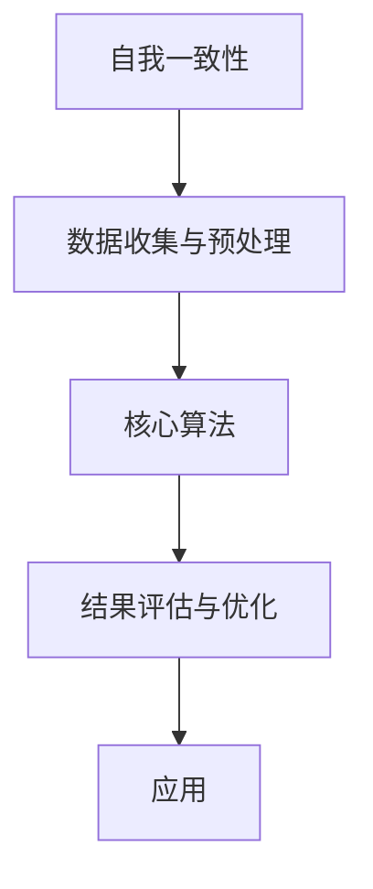
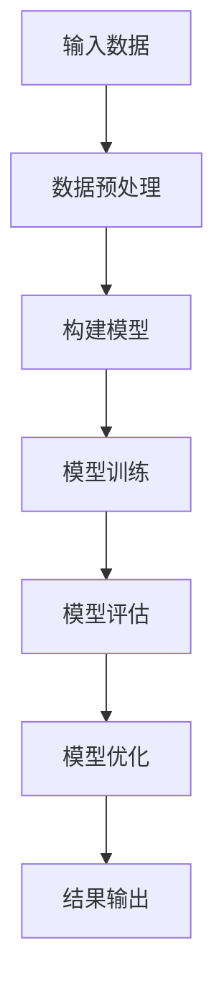
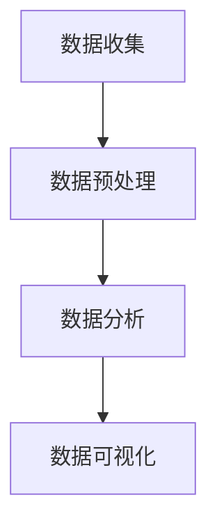
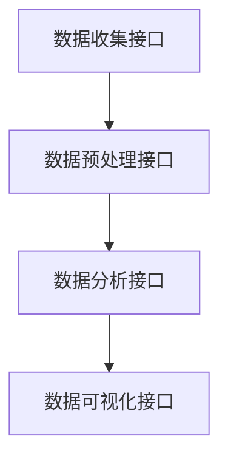
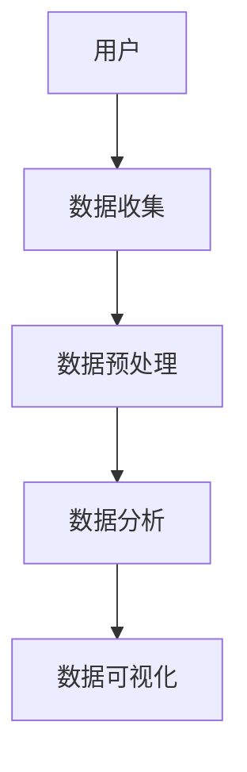

                 

**Self-Consistency CoT方法详解**

关键词：Self-Consistency CoT，核心概念，算法原理，实现技巧，应用案例

摘要：本文旨在详细解析Self-Consistency CoT方法，从核心概念、算法原理到实际应用，提供一整套完整的技术指南。我们将逐步探讨该方法的基础知识、关键技术以及在不同场景下的应用，帮助读者深入理解和掌握这一先进的计算机技术。

## 1. 引言与概述

### 1.1 书籍介绍

#### 1.1.1 背景

在当今信息爆炸的时代，如何从海量数据中提取有价值的信息成为一个亟待解决的问题。Self-Consistency CoT（Self-Consistency Core Task）方法作为一种新兴的计算机技术，应运而生。它旨在通过自我一致性原则，实现对复杂数据的高效分析和理解。

#### 1.1.2 问题解决

Self-Consistency CoT方法通过构建自我一致性的模型，能够有效地解决数据不一致、信息失真等问题，从而提高数据分析的准确性和效率。这一方法在各个领域，如大数据分析、人工智能、机器学习等，具有广泛的应用前景。

#### 1.1.3 范围与限制

本文将详细探讨Self-Consistency CoT方法的核心概念、算法原理以及实际应用。然而，由于篇幅和内容的限制，本文将不涉及一些高级话题和特定应用领域的深入讨论。

#### 1.1.4 书籍结构

本文将分为七个章节，具体内容如下：

1. 引言与概述
2. 基本概念与原理
3. 方法论与技术
4. 应用场景
5. 实施与案例分析
6. 优化与高级话题
7. 结论与未来方向

### 1.2 核心概念与术语

#### 1.2.1 自我一致性CoT方法定义

自我一致性CoT方法是一种基于自我一致性的数据分析和理解方法。它通过构建自我一致性的模型，实现对复杂数据的高效处理和分析。

#### 1.2.2 关键术语

- Self-Consistency：自我一致性，指模型内部各个部分之间的一致性。
- Core Task：核心任务，指数据分析的核心目标。
- CoT：自我一致性任务，指基于自我一致性的数据分析方法。

## 2. 基本概念与原理

### 2.1 自我一致性CoT的基本原则

自我一致性CoT方法的核心在于其自我一致性的原则。这一原则要求模型在各个层面保持一致，从而确保数据分析的准确性和可靠性。

#### 2.1.1 理论基础

自我一致性CoT方法的理论基础主要包括信息论、统计学和计算机科学等领域的知识。通过结合这些理论，我们可以构建出自我一致性的数据分析模型。

#### 2.1.2 CoT框架

以下是自我一致性CoT方法的框架图（使用Mermaid绘制）：

## 3. 方法论与技术

### 3.1 自我一致性CoT的方法论

自我一致性CoT方法的方法论主要包括以下几个步骤：

#### 3.1.1 初始设置

初始设置包括数据源的确定、环境搭建和模型初始化等。

#### 3.1.2 数据收集与预处理

数据收集与预处理是自我一致性CoT方法的关键步骤。在这一步骤中，我们需要对数据进行清洗、转换和整合，确保数据的质量和一致性。

#### 3.1.3 核心算法

核心算法是自我一致性CoT方法的核心。在这一步骤中，我们将使用自我一致性原则对数据进行处理和分析。

#### 3.1.4 算法流程图

以下是自我一致性CoT方法的算法流程图（使用Mermaid绘制）：

## 4. 应用场景

### 4.1 行业应用

自我一致性CoT方法在多个行业领域都有广泛应用。以下是一些典型的应用案例：

#### 4.1.1 人工智能领域

在人工智能领域，自我一致性CoT方法被用于图像识别、自然语言处理和语音识别等任务。通过构建自我一致性的模型，这些任务能够更加准确地处理和分析复杂数据。

#### 4.1.2 大数据分析领域

在大数据分析领域，自我一致性CoT方法被用于数据清洗、数据整合和数据挖掘等任务。它能够有效地解决数据不一致、信息失真等问题，提高数据分析的准确性和效率。

### 4.2 研究应用

自我一致性CoT方法在研究领域也有许多应用。以下是一些研究案例：

#### 4.2.1 机器学习算法研究

在机器学习算法研究中，自我一致性CoT方法被用于算法优化和算法稳定性分析。通过构建自我一致性的模型，研究人员能够更好地理解和评估机器学习算法的性能。

#### 4.2.2 数据挖掘算法研究

在数据挖掘算法研究中，自我一致性CoT方法被用于算法设计和新算法开发。通过自我一致性原则，研究人员能够构建出更加稳定和高效的数据挖掘算法。

## 5. 实施与案例分析

### 5.1 实践实施

在实践实施阶段，我们需要根据具体的应用场景和需求，选择合适的技术和工具。以下是一个简单的实施流程：

#### 5.1.1 环境搭建

首先，我们需要搭建一个合适的技术环境，包括操作系统、编程语言、开发工具和数据库等。

#### 5.1.2 数据收集与预处理

接下来，我们需要收集和预处理数据。这一步骤包括数据清洗、转换和整合等。

#### 5.1.3 模型构建与训练

在模型构建与训练阶段，我们需要根据具体任务，选择合适的模型和训练算法，对数据进行训练。

#### 5.1.4 模型评估与优化

在模型评估与优化阶段，我们需要对模型进行评估和优化，确保模型能够满足实际需求。

### 5.2 案例分析

以下是一个自我一致性CoT方法在实际项目中的应用案例：

#### 5.2.1 项目背景

该项目是一个大数据分析项目，旨在通过对海量用户行为数据进行分析，发现潜在的商业机会。

#### 5.2.2 系统功能设计

在系统功能设计阶段，我们设计了以下功能模块：

- 数据收集模块：负责收集用户行为数据。
- 数据预处理模块：负责对数据进行清洗、转换和整合。
- 数据分析模块：负责对预处理后的数据进行分析。
- 数据可视化模块：负责将分析结果进行可视化展示。

#### 5.2.3 系统架构设计

以下是系统的架构设计图（使用Mermaid绘制）：

#### 5.2.4 系统接口设计

以下是系统的接口设计图（使用Mermaid绘制）：

#### 5.2.5 系统交互设计

以下是系统的交互设计图（使用Mermaid绘制）：

## 6. 优化与高级话题

### 6.1 性能优化

在性能优化方面，自我一致性CoT方法有以下几种优化策略：

- 数据缓存：通过数据缓存，减少数据读取和预处理的时间。
- 并行处理：通过并行处理，提高数据处理的速度。
- 算法优化：通过优化算法，提高模型的计算效率和稳定性。

### 6.2 高级话题

自我一致性CoT方法在以下高级话题也有应用：

- 深度学习：将自我一致性原则应用于深度学习模型，提高模型的性能和稳定性。
- 强化学习：在强化学习领域，自我一致性原则有助于提高学习效率和稳定性。
- 多智能体系统：在多智能体系统中，自我一致性原则有助于实现智能体的协同工作和决策。

## 7. 结论与未来方向

### 7.1 总结

本文详细介绍了自我一致性CoT方法，包括其核心概念、算法原理、实现技巧和应用案例。通过本文的介绍，读者应该对自我一致性CoT方法有了更深入的理解。

### 7.2 未来方向

未来，自我一致性CoT方法有望在更多领域得到应用。同时，随着技术的不断发展，自我一致性CoT方法也将不断完善和优化，为数据处理和分析领域带来更多创新。

## 作者信息

作者：AI天才研究院/AI Genius Institute & 禅与计算机程序设计艺术 /Zen And The Art of Computer Programming

---

在撰写技术博客时，以下是一些最佳实践和注意事项：

- **明确目标受众**：了解你的读者，确保内容对他们来说既易懂又有用。
- **结构清晰**：使用清晰的章节标题和段落划分，使内容易于阅读和理解。
- **使用图表和代码**：适当的图表和代码示例有助于解释复杂的概念和技术。
- **保持简洁**：避免冗长和复杂的句子，用简单的语言传达复杂的信息。
- **实例说明**：通过实际案例和示例来说明概念和算法，使读者能够更好地理解。
- **编辑和校对**：在发布前仔细检查文章，确保没有语法错误和逻辑问题。
- **提供拓展阅读**：为读者提供相关的参考文献和拓展阅读材料，以增加他们的知识深度。

通过遵循这些最佳实践，你可以撰写出高质量的技术博客文章，吸引和留住读者。祝您写作顺利！

