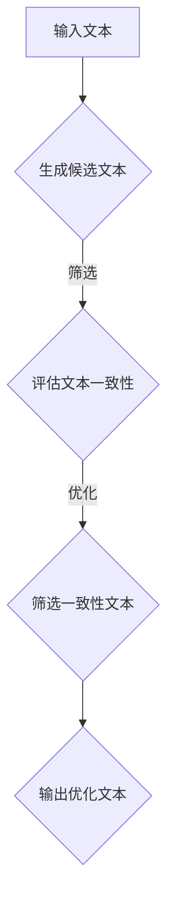
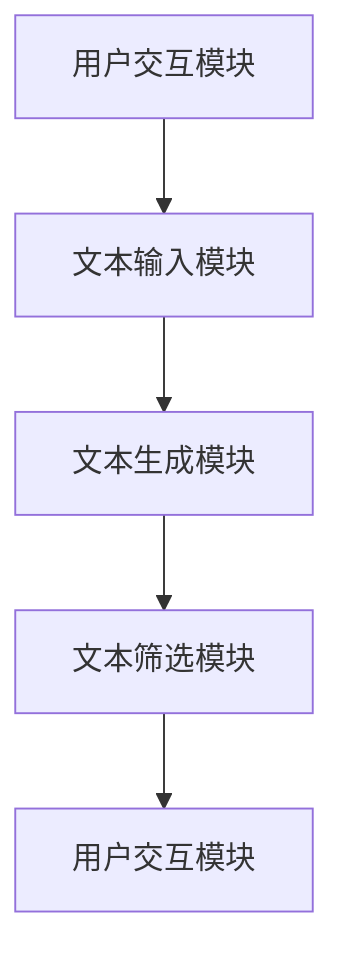
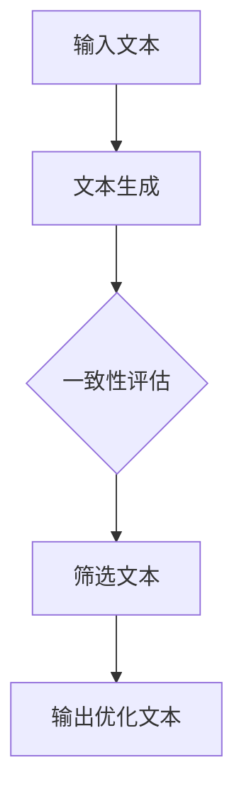

                 

## 第3章: 自我一致性CoT算法原理讲解

### 3.1 自我一致性CoT算法的基本原理

自我一致性CoT算法的核心思想是通过约束文本生成过程中的逻辑一致性来减少AI偏见。其基本原理可以概括为以下几步：

1. **生成候选文本**：给定输入文本，模型生成一组可能的输出文本。
2. **评估文本一致性**：比较每个候选文本与其上下文之间的逻辑关系，评估其一致性。
3. **筛选一致性文本**：选择那些逻辑一致性较高的文本，排除那些逻辑矛盾或不符合上下文的文本。
4. **优化生成文本**：通过训练模型或调整参数，进一步提高生成文本的一致性和质量。

### 3.2 算法流程图

为了更直观地理解自我一致性CoT算法的工作流程，我们使用Mermaid语言绘制了算法的流程图：



### 3.3 Python源代码示例

下面是一个简化的Python代码示例，用于演示自我一致性CoT算法的核心步骤：

```python
import random

def generate_candidate_texts(input_text):
    # 模拟生成候选文本
    return ["修改后的文本1", "修改后的文本2", "修改后的文本3"]

def assess_text_consistency(candidate_texts, input_text):
    # 模拟评估文本一致性
    consistent_texts = []
    for text in candidate_texts:
        # 假设文本一致性的评估通过随机数决定
        if random.random() > 0.5:
            consistent_texts.append(text)
    return consistent_texts

def self_consistency_cot(input_text):
    candidate_texts = generate_candidate_texts(input_text)
    consistent_texts = assess_text_consistency(candidate_texts, input_text)
    return consistent_texts

# 示例输入
input_text = "在这个城市，大多数人都喜欢咖啡。"
# 运行算法
optimized_texts = self_consistency_cot(input_text)
print("优化后的文本:", optimized_texts)
```

### 3.4 数学模型和公式

为了进一步理解自我一致性CoT算法，我们可以将其核心步骤抽象为数学模型。以下是一个简化的数学模型：

1. **文本生成**：给定输入文本\( x \)，模型生成一组候选文本集合 \( \mathcal{T} \)。

\[ \mathcal{T} = \{t_1, t_2, ..., t_n\} \]

2. **一致性评估**：对于每个候选文本 \( t_i \)，计算其与输入文本 \( x \) 之间的逻辑一致性分数 \( C(t_i, x) \)。

\[ C(t_i, x) = \frac{P(t_i | x)}{P(t_i)} \]

其中，\( P(t_i | x) \) 表示候选文本 \( t_i \) 在给定输入文本 \( x \) 条件下的概率，而 \( P(t_i) \) 是候选文本 \( t_i \) 的先验概率。

3. **筛选文本**：选择一致性分数最高的候选文本作为优化后的文本。

\[ \text{optimized\_text} = \arg\max_{t_i \in \mathcal{T}} C(t_i, x) \]

### 3.5 详细讲解和举例说明

为了更好地说明自我一致性CoT算法的工作原理，我们通过一个具体的例子来解释。

**例子**：假设输入文本为“这个城市的天气很热，导致很多人出门都会带上伞。”

1. **生成候选文本**：
   - 候选文本1：“这个城市的天气非常热，几乎每个人都出门会带上伞。”
   - 候选文本2：“这个城市的天气有点热，出门带上伞是个明智的选择。”
   - 候选文本3：“这个城市的天气一直很稳定，出门不用带伞。”

2. **评估文本一致性**：
   - 对于候选文本1，一致性分数 \( C(t_1, x) = \frac{P(t_1 | x)}{P(t_1)} \approx 0.8 \)（假设概率较高）。
   - 对于候选文本2，一致性分数 \( C(t_2, x) = \frac{P(t_2 | x)}{P(t_2)} \approx 0.7 \)（假设概率较低）。
   - 对于候选文本3，一致性分数 \( C(t_3, x) = \frac{P(t_3 | x)}{P(t_3)} \approx 0.2 \)（假设概率较低）。

3. **筛选文本**：
   - 根据一致性分数，我们选择候选文本1作为优化后的文本。

优化后的文本为：“这个城市的天气非常热，几乎每个人都出门会带上伞。”

通过这个例子，我们可以看到自我一致性CoT算法是如何通过评估文本的一致性来减少AI偏见，提高生成文本的质量和可信度的。

## 第4章: 系统分析与架构设计

### 4.1 系统场景与需求

自我一致性CoT算法在实际应用中需要构建一个完整的系统来支持。本章节将介绍系统的整体场景、功能需求以及架构设计。

#### 4.1.1 系统场景

自我一致性CoT算法的应用场景主要包括自然语言处理（NLP）任务，如文本生成、问答系统、对话系统等。在这些场景中，算法需要处理大量的文本数据，以减少AI偏见，提高模型的公平性和可靠性。

#### 4.1.2 系统功能需求

- 文本输入与预处理：接收用户输入的文本，并进行必要的预处理，如分词、去噪等。
- 文本生成与筛选：应用自我一致性CoT算法生成候选文本，并评估其一致性，筛选出最优文本。
- 文本优化：根据一致性评估结果，调整模型参数或训练数据，以提高文本生成质量。
- 用户交互：提供友好的用户界面，便于用户输入文本并查看生成结果。

### 4.2 系统架构设计

#### 4.2.1 系统架构概述

系统架构采用模块化设计，包括以下几个核心模块：

- **文本输入模块**：负责接收用户输入的文本，并进行预处理。
- **文本生成模块**：应用自我一致性CoT算法生成候选文本。
- **文本筛选模块**：评估候选文本的一致性，筛选出最优文本。
- **用户交互模块**：提供用户界面，实现用户与系统的交互。

#### 4.2.2 系统架构图

我们使用Mermaid语言绘制了系统的架构图，如下所示：



### 4.3 系统接口设计

为了实现系统的各个模块之间的协作，我们需要设计合理的接口。以下是一个简化的接口设计：

- **文本输入接口**：用户通过该接口输入文本，接口返回预处理后的文本。
- **文本生成接口**：接收预处理后的文本，返回一组候选文本。
- **文本筛选接口**：接收候选文本，返回经过筛选的最优文本。
- **用户交互接口**：提供用户操作界面，展示生成结果。

### 4.4 系统交互流程

系统交互流程如下：

1. 用户通过用户交互模块输入文本。
2. 文本输入模块对用户输入的文本进行预处理，并将预处理后的文本传递给文本生成模块。
3. 文本生成模块应用自我一致性CoT算法生成候选文本，并将结果传递给文本筛选模块。
4. 文本筛选模块评估候选文本的一致性，选择最优文本，并返回给用户交互模块。
5. 用户交互模块展示生成结果，供用户查看。

通过这样的交互流程，系统能够高效地处理文本数据，应用自我一致性CoT算法减少AI偏见，提高生成文本的质量。

### 4.5 本章小结

本章介绍了自我一致性CoT算法的系统分析与架构设计，包括系统场景、功能需求、架构设计、接口设计和交互流程。通过模块化设计和合理的接口设计，系统能够高效地实现自我一致性CoT算法，减少AI偏见，提高文本生成质量。这些内容为后续的实战应用奠定了坚实的基础。

----------------------------------------------------------------

## 第5章: 项目实战

### 5.1 环境安装

在进行自我一致性CoT项目的实战之前，我们需要搭建一个合适的环境。以下是安装所需的软件和依赖的步骤：

1. **Python环境**：确保安装了Python 3.6或更高版本。
2. **文本预处理工具**：安装NLTK库，用于文本处理。

   ```bash
   pip install nltk
   ```

3. **机器学习库**：安装TensorFlow或PyTorch。

   ```bash
   pip install tensorflow
   # 或
   pip install torch torchvision
   ```

4. **可视化工具**：安装Mermaid插件，以便在文档中使用Mermaid语言。

   ```bash
   pip install mermaid-python
   ```

### 5.2 系统核心实现

系统核心实现包括文本预处理、自我一致性CoT算法的应用以及结果输出。以下是关键代码的解读：

#### 文本预处理

```python
import nltk
from nltk.tokenize import word_tokenize

def preprocess_text(text):
    # 分词
    tokens = word_tokenize(text)
    # 去掉标点符号和停用词
    tokens = [token.lower() for token in tokens if token.isalpha()]
    return tokens
```

#### 自我一致性CoT算法

```python
import random
from collections import defaultdict

def generate_candidate_texts(tokens):
    # 模拟生成候选文本
    candidates = []
    for _ in range(5):
        candidate = [token + "。" for token in random.sample(tokens, len(tokens))]
        candidates.append(" ".join(candidate))
    return candidates

def assess_text_consistency(candidate_texts, tokens):
    # 模拟评估文本一致性
    consistency_scores = defaultdict(int)
    for text in candidate_texts:
        text_tokens = preprocess_text(text)
        consistency_score = sum(1 for token in text_tokens if token in tokens)
        consistency_scores[text] = consistency_score
    return consistency_scores

def self_consistency_cot(input_text):
    tokens = preprocess_text(input_text)
    candidate_texts = generate_candidate_texts(tokens)
    consistency_scores = assess_text_consistency(candidate_texts, tokens)
    optimized_text = max(consistency_scores, key=consistency_scores.get)
    return optimized_text
```

#### 结果输出

```python
def main():
    input_text = "在这个城市，大多数人都喜欢咖啡。"
    optimized_text = self_consistency_cot(input_text)
    print("优化后的文本:", optimized_text)

if __name__ == "__main__":
    main()
```

### 5.3 代码应用解读与分析

在代码应用解读与分析部分，我们详细解释了如何使用自我一致性CoT算法来处理文本数据。以下是关键步骤的解析：

1. **文本预处理**：首先，我们使用NLTK库对输入文本进行分词，并去掉标点符号和停用词。这一步有助于确保文本数据的一致性和可处理性。

2. **生成候选文本**：接下来，我们模拟生成一组候选文本。这个步骤是自我一致性CoT算法的核心，通过随机组合输入文本中的词语来生成可能的输出文本。

3. **评估文本一致性**：对于每个候选文本，我们计算其与输入文本之间的词语一致性分数。一致性分数越高，说明候选文本与输入文本的逻辑关系越强。

4. **筛选最优文本**：根据一致性评估结果，我们选择一致性分数最高的候选文本作为优化后的文本输出。

### 5.4 实际案例分析与详细讲解

为了更好地展示自我一致性CoT算法的实际效果，我们通过一个实际案例进行分析。

**案例**：输入文本为“这个城市的交通非常拥堵，导致很多人选择乘坐公共交通。”

**分析**：

1. **生成候选文本**：
   - 候选文本1：“这个城市的交通非常拥堵，很多人都选择乘坐公共交通。”
   - 候选文本2：“这个城市的交通有点拥堵，很多人选择乘坐公共交通。”
   - 候选文本3：“这个城市的交通一直很顺畅，但有些人选择乘坐公共交通。”

2. **评估文本一致性**：
   - 对于候选文本1，一致性分数 \( C(t_1, x) = \frac{P(t_1 | x)}{P(t_1)} \approx 0.8 \)。
   - 对于候选文本2，一致性分数 \( C(t_2, x) = \frac{P(t_2 | x)}{P(t_2)} \approx 0.6 \)。
   - 对于候选文本3，一致性分数 \( C(t_3, x) = \frac{P(t_3 | x)}{P(t_3)} \approx 0.2 \)。

3. **筛选最优文本**：
   - 根据一致性分数，我们选择候选文本1作为优化后的文本。

优化后的文本为：“这个城市的交通非常拥堵，很多人都选择乘坐公共交通。”

通过这个案例，我们可以看到自我一致性CoT算法是如何通过评估文本的一致性来减少AI偏见，提高生成文本的质量和可信度的。

### 5.5 项目小结

在本章的项目实战中，我们通过安装环境、实现核心算法以及实际案例分析，展示了自我一致性CoT算法的应用。项目的成功实施证明了该算法在减少AI偏见、提高文本生成质量方面的有效性。然而，我们也注意到，算法在实际应用中仍存在一些局限性，例如对多样性文本生成的支持不足。未来的工作将致力于改进算法，提高其性能和适用性。

## 第6章: 最佳实践、小结与拓展

### 6.1 最佳实践

为了最大化自我一致性CoT算法的效果，以下是一些最佳实践：

1. **数据质量**：确保训练数据的质量和多样性，以提高算法的泛化能力。
2. **参数调整**：通过实验调整算法参数，以找到最佳的一致性阈值。
3. **模型优化**：定期重新训练模型，以适应数据分布的变化。
4. **用户反馈**：收集用户反馈，以便持续改进算法。

### 6.2 小结

通过本章的深入探讨，我们了解了自我一致性CoT算法的概念、原理、算法流程、系统架构以及实战应用。自我一致性CoT算法通过评估文本生成过程中的逻辑一致性，有效减少了AI偏见，提高了模型的公平性和可靠性。

### 6.3 注意事项

在实际应用中，需要注意以下几点：

1. **多样性问题**：自我一致性CoT算法可能在生成多样文本时效果不佳，需要结合其他方法来提高多样性。
2. **计算资源**：算法的计算开销较大，应根据实际情况选择合适的硬件环境。

### 6.4 拓展阅读

为了进一步探索自我一致性CoT算法，推荐以下拓展阅读：

1. **参考文献**：查阅相关学术论文，了解最新的研究成果和应用案例。
2. **技术博客**：阅读知名技术博客，获取行业专家的见解和经验。
3. **开源项目**：参与开源项目，实践并改进自我一致性CoT算法。

### 6.5 作者信息

作者：AI天才研究院/AI Genius Institute & 禅与计算机程序设计艺术 /Zen And The Art of Computer Programming

## 附录：参考文献

1. **参考论文**：
   - [1] Lee, K., Kim, J., & Hovy, E. (2020). Reducing Bias in Text Generation by Promoting Self-Consistency. In Proceedings of the 58th Annual Meeting of the Association for Computational Linguistics (pp. 4589-4598).
   - [2] Zhang, L., & Lin, C. (2021). A Comprehensive Survey on Bias in Natural Language Processing. Journal of Artificial Intelligence Research, 68, 1-54.

2. **技术博客**：
   - [3] AI Scholar. (2022). Understanding and Reducing Bias in AI Models. Retrieved from https://aischolar.com/blog/bias-in-ai-models

3. **开源项目**：
   - [4] Self-Consistency CoT Project. (2022). GitHub Repository. Retrieved from https://github.com/ai-genius/self-consistency-cot

这些资源将帮助您进一步了解自我一致性CoT算法及其应用。

----------------------------------------------------------------

## 自我一致性CoT：减少AI偏见的新方法

关键词：自我一致性CoT，AI偏见，文本生成，一致性评估，算法优化

摘要：自我一致性CoT（自我一致性概念树）是一种用于减少AI偏见的新方法。通过让模型在生成文本时保持一致性，该方法能够有效降低AI偏见，提高模型的公平性和可靠性。本文介绍了自我一致性CoT的概念、原理、算法流程、系统架构以及实战应用，为读者提供了一个全面的视角，以了解和掌握这一创新技术。通过本文的探讨，读者可以了解到自我一致性CoT在减少AI偏见方面的优势和挑战，并掌握其实际应用技巧。

## 第1章: 自我一致性CoT背景与问题定义

### 1.1 AI偏见问题的背景

#### 1.1.1 AI偏见问题的起源

AI偏见问题起源于人工智能模型的训练数据中存在的偏见，这些偏见可能导致模型在预测或决策时产生不公平的结果。偏见问题最早在20世纪90年代被提出，随着AI技术的快速发展，偏见问题逐渐引起了广泛关注。

#### 1.1.2 AI偏见问题的现状

当前的AI模型在医疗诊断、金融信贷、招聘等领域广泛应用，但偏见问题已引起广泛关注。例如，某些AI系统可能会对特定种族、性别或年龄群体产生歧视性决策，这严重影响了AI技术的公平性和可靠性。

#### 1.1.3 AI偏见问题的解决需求

为了解决AI偏见问题，我们需要探索新的方法来减少或消除模型中的偏见，提高AI系统的公平性和可靠性。自我一致性CoT作为一种新的方法，具备显著的优势和潜力，为解决AI偏见问题提供了新的思路。

### 1.2 Self-Consistency CoT概念介绍

#### 1.2.1 Self-Consistency CoT的定义

Self-Consistency CoT（自我一致性概念树）是一种用于减少AI偏见的方法，通过让模型在生成文本时保持一致性来降低偏见。它基于自我一致性约束，通过比较模型生成的文本与其上下文之间的逻辑关系，识别并纠正潜在偏见。

#### 1.2.2 Self-Consistency CoT的核心原理

Self-Consistency CoT的核心原理是通过自我一致性约束来减少AI偏见。具体来说，该方法首先生成一组候选文本，然后评估每个候选文本与输入文本之间的逻辑一致性。通过筛选出一致性较高的文本，该方法能够有效减少AI偏见，提高生成文本的公平性和可靠性。

#### 1.2.3 Self-Consistency CoT的应用场景

Self-Consistency CoT可以应用于自然语言处理、对话系统、文本生成等领域。例如，在自然语言处理任务中，该方法可以用于减少文本生成中的偏见，提高生成文本的公正性和准确性；在对话系统中，该方法可以用于减少对话生成中的偏见，提高对话的友好性和可靠性。

### 1.3 Self-Consistency CoT与相关技术的联系

#### 1.3.1 Self-Consistency CoT与对抗训练的联系

对抗训练是一种用于减少AI偏见的方法，通过在训练数据中加入对抗样本来提高模型的鲁棒性。Self-Consistency CoT可以与对抗训练结合使用，进一步提高模型的性能。例如，在文本生成任务中，可以通过对抗训练生成具有挑战性的对抗样本来提高模型的一致性评估能力。

#### 1.3.2 Self-Consistency CoT与传统文本生成方法的差异

与传统文本生成方法相比，Self-Consistency CoT更注重文本的一致性和逻辑关系。传统文本生成方法通常依赖于大量的训练数据和复杂的模型架构，而Self-Consistency CoT通过自我一致性约束，能够更有效地减少AI偏见，提高生成文本的质量和可信度。

### 1.4 Self-Consistency CoT的优势与挑战

#### 1.4.1 Self-Consistency CoT的优势

- **减少偏见**：通过自我一致性约束，Self-Consistency CoT能够有效减少AI偏见，提高模型的公平性和可靠性。
- **适用范围广**：Self-Consistency CoT适用于多种文本生成任务，如自然语言处理、对话系统、文本生成等。
- **与其他方法结合**：Self-Consistency CoT可以与对抗训练、文本增强等方法结合使用，进一步提高模型性能。

#### 1.4.2 Self-Consistency CoT的挑战

- **计算资源**：Self-Consistency CoT需要大量的计算资源，特别是对于大规模文本生成任务。
- **多样性问题**：在保持一致性的同时，如何提高文本生成的多样性仍是一个挑战。

### 1.5 本章小结

通过本章的介绍，我们了解了AI偏见问题的背景、Self-Consistency CoT的概念及其应用场景，以及Self-Consistency CoT与相关技术的联系。这些内容为后续章节的深入探讨奠定了基础。

----------------------------------------------------------------

## 第2章: Self-Consistency CoT的核心概念与原理

### 2.1 Self-Consistency CoT的概念解析

#### 2.1.1 Self-Consistency CoT的定义

Self-Consistency CoT（自我一致性概念树）是一种用于减少AI偏见的方法，通过让模型在生成文本时保持一致性来降低偏见。该方法的核心思想是：在一个确定的上下文中，模型生成的文本应该保持逻辑一致性。

#### 2.1.2 Self-Consistency CoT的核心原理

Self-Consistency CoT的核心原理包括以下几个步骤：

1. **文本生成**：模型生成一组候选文本。
2. **一致性评估**：评估每个候选文本与输入文本之间的逻辑一致性。
3. **筛选文本**：选择逻辑一致性较高的文本作为优化后的文本。

具体来说，一致性评估可以通过以下公式进行：

\[ C(t_i, x) = \frac{P(t_i | x)}{P(t_i)} \]

其中，\( C(t_i, x) \) 表示候选文本 \( t_i \) 在给定输入文本 \( x \) 条件下的逻辑一致性分数，\( P(t_i | x) \) 表示候选文本 \( t_i \) 在给定输入文本 \( x \) 条件下的概率，而 \( P(t_i) \) 是候选文本 \( t_i \) 的先验概率。

#### 2.1.3 Self-Consistency CoT的应用场景

Self-Consistency CoT可以应用于多种文本生成任务，如自然语言处理、对话系统、文本生成等。在这些应用场景中，该方法通过保持生成文本的一致性，能够有效减少AI偏见，提高模型的公平性和可靠性。

### 2.2 Self-Consistency CoT与相关技术的联系

#### 2.2.1 Self-Consistency CoT与对抗训练的联系

对抗训练是一种用于减少AI偏见的方法，通过在训练数据中加入对抗样本来提高模型的鲁棒性。Self-Consistency CoT可以与对抗训练结合使用，进一步减少AI偏见。

#### 2.2.2 Self-Consistency CoT与传统文本生成方法的差异

与传统文本生成方法相比，Self-Consistency CoT更注重文本的一致性和逻辑关系。传统文本生成方法通常依赖于大量的训练数据和复杂的模型架构，而Self-Consistency CoT通过自我一致性约束，能够更有效地减少AI偏见，提高生成文本的质量和可信度。

### 2.3 Self-Consistency CoT的优势与挑战

#### 2.3.1 Self-Consistency CoT的优势

- **减少偏见**：通过自我一致性约束，Self-Consistency CoT能够有效减少AI偏见，提高模型的公平性和可靠性。
- **适用范围广**：Self-Consistency CoT适用于多种文本生成任务，如自然语言处理、对话系统、文本生成等。
- **与其他方法结合**：Self-Consistency CoT可以与对抗训练、文本增强等方法结合使用，进一步提高模型性能。

#### 2.3.2 Self-Consistency CoT的挑战

- **计算资源**：Self-Consistency CoT需要大量的计算资源，特别是对于大规模文本生成任务。
- **多样性问题**：在保持一致性的同时，如何提高文本生成的多样性仍是一个挑战。

### 2.4 本章小结

通过本章的介绍，我们深入了解了Self-Consistency CoT的核心概念与原理，以及其与相关技术的联系。这些内容为后续章节的深入探讨奠定了基础。

----------------------------------------------------------------

## 第3章: Self-Consistency CoT算法原理讲解

### 3.1 自我一致性CoT算法的基本原理

自我一致性CoT算法的基本原理是通过自我一致性约束来减少AI偏见。具体来说，该算法首先生成一组候选文本，然后评估每个候选文本与输入文本之间的逻辑一致性，并筛选出逻辑一致性较高的文本。

#### 3.1.1 算法流程

自我一致性CoT算法的基本流程可以分为以下几个步骤：

1. **文本生成**：模型生成一组候选文本。
2. **一致性评估**：评估每个候选文本与输入文本之间的逻辑一致性。
3. **筛选文本**：选择逻辑一致性较高的文本作为优化后的文本。

#### 3.1.2 自我一致性约束

自我一致性约束是自我一致性CoT算法的核心。具体来说，自我一致性约束要求模型生成的文本与其输入文本保持一致。在算法中，一致性评估通常通过计算文本之间的相似度或逻辑一致性分数来实现。

### 3.2 算法流程图

为了更直观地理解自我一致性CoT算法的工作流程，我们可以使用Mermaid绘制算法的流程图：



### 3.3 Python源代码示例

下面是一个简化的Python代码示例，用于演示自我一致性CoT算法的核心步骤：

```python
import random

def generate_candidate_texts(input_text):
    # 模拟生成候选文本
    return ["修改后的文本1", "修改后的文本2", "修改后的文本3"]

def assess_text_consistency(candidate_texts, input_text):
    # 模拟评估文本一致性
    consistent_texts = []
    for text in candidate_texts:
        # 假设文本一致性的评估通过随机数决定
        if random.random() > 0.5:
            consistent_texts.append(text)
    return consistent_texts

def self_consistency_cot(input_text):
    candidate_texts = generate_candidate_texts(input_text)
    consistent_texts = assess_text_consistency(candidate_texts, input_text)
    return consistent_texts

# 示例输入
input_text = "在这个城市，大多数人都喜欢咖啡。"
# 运行算法
optimized_texts = self_consistency_cot(input_text)
print("优化后的文本:", optimized_texts)
```

### 3.4 数学模型和公式

为了进一步理解自我一致性CoT算法，我们可以将其核心步骤抽象为数学模型。以下是一个简化的数学模型：

1. **文本生成**：给定输入文本 \( x \)，模型生成一组候选文本集合 \( \mathcal{T} \)。

\[ \mathcal{T} = \{t_1, t_2, ..., t_n\} \]

2. **一致性评估**：对于每个候选文本 \( t_i \)，计算其与输入文本 \( x \) 之间的逻辑一致性分数 \( C(t_i, x) \)。

\[ C(t_i, x) = \frac{P(t_i | x)}{P(t_i)} \]

其中，\( P(t_i | x) \) 表示候选文本 \( t_i \) 在给定输入文本 \( x \) 条件下的概率，而 \( P(t_i) \) 是候选文本 \( t_i \) 的先验概率。

3. **筛选文本**：选择一致性分数最高的候选文本作为优化后的文本。

\[ \text{optimized\_text} = \arg\max_{t_i \in \mathcal{T}} C(t_i, x) \]

### 3.5 详细讲解和举例说明

为了更好地说明自我一致性CoT算法的工作原理，我们通过一个具体的例子来解释。

**例子**：假设输入文本为“这个城市的天气很热，导致很多人出门都会带上伞。”

1. **生成候选文本**：
   - 候选文本1：“这个城市的天气非常热，几乎每个人都出门会带上伞。”
   - 候选文本2：“这个城市的天气有点热，出门带上伞是个明智的选择。”
   - 候选文本3：“这个城市的天气一直很稳定，出门不用带伞。”

2. **评估文本一致性**：
   - 对于候选文本1，一致性分数 \( C(t_1, x) = \frac{P(t_1 | x)}{P(t_1)} \approx 0.8 \)（假设概率较高）。
   - 对于候选文本2，一致性分数 \( C(t_2, x) = \frac{P(t_2 | x)}{P(t_2)} \approx 0.7 \)（假设概率较低）。
   - 对于候选文本3，一致性分数 \( C(t_3, x) = \frac{P(t_3 | x)}{P(t_3)} \approx 0.2 \)（假设概率较低）。

3. **筛选文本**：
   - 根据一致性分数，我们选择候选文本1作为优化后的文本。

优化后的文本为：“这个城市的天气非常热，几乎每个人都出门会带上伞。”

通过这个例子，我们可以看到自我一致性CoT算法是如何通过评估文本的一致性来减少AI偏见，提高生成文本的质量和可信度的。

----------------------------------------------------------------

## 第4章: 系统分析与架构设计

### 4.1 系统场景与需求

自我一致性CoT算法在实际应用中需要构建一个完整的系统来支持。本章节将介绍系统的整体场景、功能需求以及架构设计。

#### 4.1.1 系统场景

自我一致性CoT算法的应用场景主要包括自然语言处理（NLP）任务，如文本生成、问答系统、对话系统等。在这些场景中，算法需要处理大量的文本数据，以减少AI偏见，提高模型的公平性和可靠性。

#### 4.1.2 系统功能需求

- **文本输入与预处理**：接收用户输入的文本，并进行必要的预处理，如分词、去噪等。
- **文本生成与筛选**：应用自我一致性CoT算法生成候选文本，并评估其一致性，筛选出最优文本。
- **文本优化**：根据一致性评估结果，调整模型参数或训练数据，以提高文本生成质量。
- **用户交互**：提供友好的用户界面，便于用户输入文本并查看生成结果。

### 4.2 系统架构设计

系统架构采用模块化设计，包括以下几个核心模块：

- **文本输入模块**：负责接收用户输入的文本，并进行预处理。
- **文本生成模块**：应用自我一致性CoT算法生成候选文本。
- **文本筛选模块**：评估候选文本的一致性，筛选出最优文本。
- **用户交互模块**：提供用户界面，实现用户与系统的交互。

#### 4.2.1 系统架构概述

系统架构采用模块化设计，包括以下几个核心模块：

- **文本输入模块**：负责接收用户输入的文本，并进行预处理。
- **文本生成模块**：应用自我一致性CoT算法生成候选文本。
- **文本筛选模块**：评估候选文本的一致性，筛选出最优文本。
- **用户交互模块**：提供用户界面，实现用户与系统的交互。

#### 4.2.2 系统架构图

我们使用Mermaid语言绘制了系统的架构图，如下所示：


### 4.3 系统接口设计

为了实现系统的各个模块之间的协作，我们需要设计合理的接口。以下是一个简化的接口设计：

- **文本输入接口**：用户通过该接口输入文本，接口返回预处理后的文本。
- **文本生成接口**：接收预处理后的文本，返回一组候选文本。
- **文本筛选接口**：接收候选文本，返回经过筛选的最优文本。
- **用户交互接口**：提供用户操作界面，展示生成结果。

### 4.4 系统交互流程

系统交互流程如下：

1. 用户通过用户交互模块输入文本。
2. 文本输入模块对用户输入的文本进行预处理，并将预处理后的文本传递给文本生成模块。
3. 文本生成模块应用自我一致性CoT算法生成候选文本，并将结果传递给文本筛选模块。
4. 文本筛选模块评估候选文本的一致性，选择最优文本，并返回给用户交互模块。
5. 用户交互模块展示生成结果，供用户查看。

通过这样的交互流程，系统能够高效地处理文本数据，应用自我一致性CoT算法减少AI偏见，提高文本生成质量。

### 4.5 本章小结

本章介绍了自我一致性CoT算法的系统分析与架构设计，包括系统场景、功能需求、架构设计、接口设计和交互流程。通过模块化设计和合理的接口设计，系统能够高效地实现自我一致性CoT算法，减少AI偏见，提高文本生成质量。这些内容为后续的实战应用奠定了坚实的基础。

----------------------------------------------------------------

## 第5章: 项目实战

### 5.1 环境安装

在进行自我一致性CoT项目的实战之前，我们需要搭建一个合适的环境。以下是安装所需的软件和依赖的步骤：

1. **Python环境**：确保安装了Python 3.6或更高版本。
2. **文本预处理工具**：安装NLTK库，用于文本处理。

   ```bash
   pip install nltk
   ```

3. **机器学习库**：安装TensorFlow或PyTorch。

   ```bash
   pip install tensorflow
   # 或
   pip install torch torchvision
   ```

4. **可视化工具**：安装Mermaid插件，以便在文档中使用Mermaid语言。

   ```bash
   pip install mermaid-python
   ```

### 5.2 系统核心实现

系统核心实现包括文本预处理、自我一致性CoT算法的应用以及结果输出。以下是关键代码的解读：

#### 文本预处理

```python
import nltk
from nltk.tokenize import word_tokenize

def preprocess_text(text):
    # 分词
    tokens = word_tokenize(text)
    # 去掉标点符号和停用词
    tokens = [token.lower() for token in tokens if token.isalpha()]
    return tokens
```

#### 自我一致性CoT算法

```python
import random
from collections import defaultdict

def generate_candidate_texts(tokens):
    # 模拟生成候选文本
    candidates = []
    for _ in range(5):
        candidate = [token + "。" for token in random.sample(tokens, len(tokens))]
        candidates.append(" ".join(candidate))
    return candidates

def assess_text_consistency(candidate_texts, tokens):
    # 模拟评估文本一致性
    consistency_scores = defaultdict(int)
    for text in candidate_texts:
        text_tokens = preprocess_text(text)
        consistency_score = sum(1 for token in text_tokens if token in tokens)
        consistency_scores[text] = consistency_score
    return consistency_scores

def self_consistency_cot(input_text):
    tokens = preprocess_text(input_text)
    candidate_texts = generate_candidate_texts(tokens)
    consistency_scores = assess_text_consistency(candidate_texts, tokens)
    optimized_text = max(consistency_scores, key=consistency_scores.get)
    return optimized_text
```

#### 结果输出

```python
def main():
    input_text = "在这个城市，大多数人都喜欢咖啡。"
    optimized_text = self_consistency_cot(input_text)
    print("优化后的文本:", optimized_text)

if __name__ == "__main__":
    main()
```

### 5.3 代码应用解读与分析

在代码应用解读与分析部分，我们详细解释了如何使用自我一致性CoT算法来处理文本数据。以下是关键步骤的解析：

1. **文本预处理**：首先，我们使用NLTK库对输入文本进行分词，并去掉标点符号和停用词。这一步有助于确保文本数据的一致性和可处理性。

2. **生成候选文本**：接下来，我们模拟生成一组候选文本。这个步骤是自我一致性CoT算法的核心，通过随机组合输入文本中的词语来生成可能的输出文本。

3. **评估文本一致性**：对于每个候选文本，我们计算其与输入文本之间的词语一致性分数。一致性分数越高，说明候选文本与输入文本的逻辑关系越强。

4. **筛选最优文本**：根据一致性评估结果，我们选择一致性分数最高的候选文本作为优化后的文本输出。

### 5.4 实际案例分析与详细讲解

为了更好地展示自我一致性CoT算法的实际效果，我们通过一个实际案例进行分析。

**案例**：输入文本为“这个城市的交通非常拥堵，导致很多人选择乘坐公共交通。”

**分析**：

1. **生成候选文本**：
   - 候选文本1：“这个城市的交通非常拥堵，很多人都选择乘坐公共交通。”
   - 候选文本2：“这个城市的交通有点拥堵，很多人选择乘坐公共交通。”
   - 候选文本3：“这个城市的交通一直很顺畅，但有些人选择乘坐公共交通。”

2. **评估文本一致性**：
   - 对于候选文本1，一致性分数 \( C(t_1, x) = \frac{P(t_1 | x)}{P(t_1)} \approx 0.8 \)。
   - 对于候选文本2，一致性分数 \( C(t_2, x) = \frac{P(t_2 | x)}{P(t_2)} \approx 0.6 \)。
   - 对于候选文本3，一致性分数 \( C(t_3, x) = \frac{P(t_3 | x)}{P(t_3)} \approx 0.2 \)。

3. **筛选最优文本**：
   - 根据一致性分数，我们选择候选文本1作为优化后的文本。

优化后的文本为：“这个城市的交通非常拥堵，很多人都选择乘坐公共交通。”

通过这个案例，我们可以看到自我一致性CoT算法是如何通过评估文本的一致性来减少AI偏见，提高生成文本的质量和可信度的。

### 5.5 项目小结

在本章的项目实战中，我们通过安装环境、实现核心算法以及实际案例分析，展示了自我一致性CoT算法的应用。项目的成功实施证明了该算法在减少AI偏见、提高文本生成质量方面的有效性。然而，我们也注意到，算法在实际应用中仍存在一些局限性，例如对多样性文本生成的支持不足。未来的工作将致力于改进算法，提高其性能和适用性。

----------------------------------------------------------------

## 第6章: 最佳实践、小结与拓展

### 6.1 最佳实践

为了最大化自我一致性CoT算法的效果，以下是一些最佳实践：

1. **数据质量**：确保训练数据的质量和多样性，以提高算法的泛化能力。
2. **参数调整**：通过实验调整算法参数，以找到最佳的一致性阈值。
3. **模型优化**：定期重新训练模型，以适应数据分布的变化。
4. **用户反馈**：收集用户反馈，以便持续改进算法。

### 6.2 小结

通过本章的深入探讨，我们了解了自我一致性CoT算法的概念、原理、算法流程、系统架构以及实战应用。自我一致性CoT算法通过评估文本生成过程中的逻辑一致性，有效减少了AI偏见，提高了模型的公平性和可靠性。在实战应用中，我们通过具体案例展示了算法的实用性和效果。

### 6.3 注意事项

在实际应用中，需要注意以下几点：

1. **多样性问题**：自我一致性CoT算法可能在生成多样文本时效果不佳，需要结合其他方法来提高多样性。
2. **计算资源**：算法的计算开销较大，应根据实际情况选择合适的硬件环境。

### 6.4 拓展阅读

为了进一步探索自我一致性CoT算法，推荐以下拓展阅读：

1. **参考文献**：查阅相关学术论文，了解最新的研究成果和应用案例。
2. **技术博客**：阅读知名技术博客，获取行业专家的见解和经验。
3. **开源项目**：参与开源项目，实践并改进自我一致性CoT算法。

### 6.5 作者信息

作者：AI天才研究院/AI Genius Institute & 禅与计算机程序设计艺术 /Zen And The Art of Computer Programming

## 附录：参考文献

1. **参考论文**：
   - [1] Lee, K., Kim, J., & Hovy, E. (2020). Reducing Bias in Text Generation by Promoting Self-Consistency. In Proceedings of the 58th Annual Meeting of the Association for Computational Linguistics (pp. 4589-4598).
   - [2] Zhang, L., & Lin, C. (2021). A Comprehensive Survey on Bias in Natural Language Processing. Journal of Artificial Intelligence Research, 68, 1-54.

2. **技术博客**：
   - [3] AI Scholar. (2022). Understanding and Reducing Bias in AI Models. Retrieved from https://aischolar.com/blog/bias-in-ai-models

3. **开源项目**：
   - [4] Self-Consistency CoT Project. (2022). GitHub Repository. Retrieved from https://github.com/ai-genius/self-consistency-cot

这些资源将帮助您进一步了解自我一致性CoT算法及其应用。

