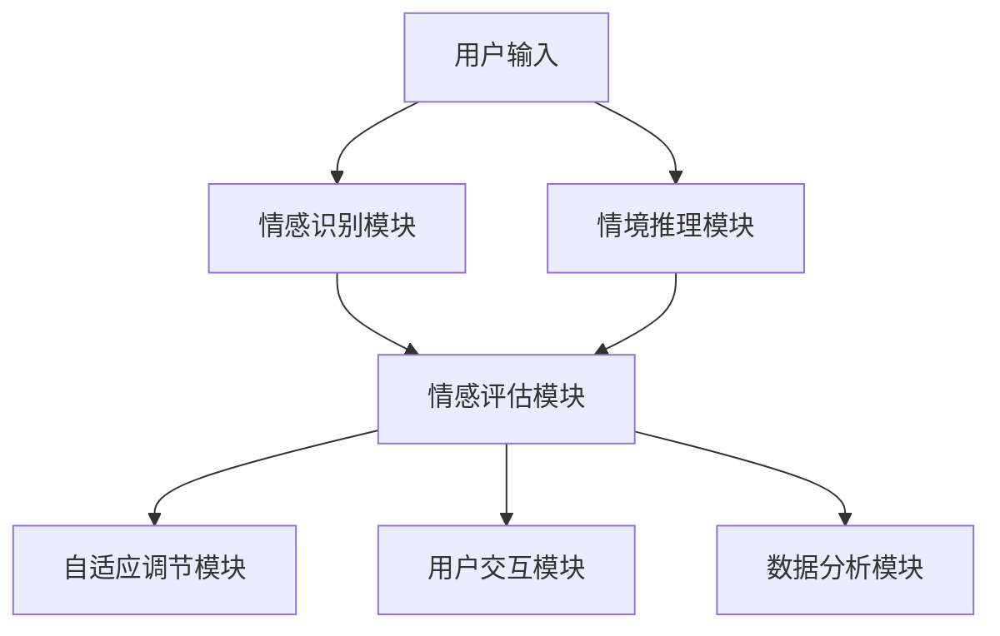

                 

## 自洽性CoT：增强AI情感智能

### 关键词：自洽性、常识推理、情感智能、AI增强、智能系统设计

#### 摘要：随着人工智能技术的快速发展，情感智能成为AI领域的重要研究方向。本文探讨了自洽性CoT（Commonsense Reasoning with Self-Consistency）这一新兴概念，通过逐步分析其理论基础、应用场景、算法实现和系统设计，深入阐述了如何增强AI的情感智能，为智能系统的设计提供有力支持。

### 目录大纲

----------------------------------------------------------------

## 第一部分: 引言与背景

### 第1章: 引言

#### 1.1 问题的提出

##### 1.1.1 问题背景

##### 1.1.2 问题描述

##### 1.1.3 问题解决

#### 1.2 核心概念

##### 1.2.1 自洽性概念介绍

##### 1.2.2 CoT（Commonsense Reasoning）概念介绍

##### 1.2.3 情感智能概念介绍

#### 1.3 边界与外延

##### 1.3.1 自洽性的边界

##### 1.3.2 CoT的情感智能应用范围

#### 1.4 概念结构与核心要素

##### 1.4.1 自洽性CoT的情感智能框架结构

##### 1.4.2 核心要素组成

## 第2章: 自洽性CoT的理论基础

### 2.1 自洽性原理

##### 2.1.1 自洽性的数学模型

##### 2.1.2 自洽性原理的推导

### 2.2 CoT情感智能模型

##### 2.2.1 CoT情感智能的概念

##### 2.2.2 CoT情感智能的数学模型

### 2.3 自洽性CoT情感智能的联系与区别

##### 2.3.1 自洽性CoT与情感智能的关系

##### 2.3.2 自洽性CoT与情感智能的区别

## 第3章: 自洽性CoT情感智能的应用场景

### 3.1 生活辅助场景

##### 3.1.1 场景介绍

##### 3.1.2 应用实例

### 3.2 工作协同场景

##### 3.2.1 场景介绍

##### 3.2.2 应用实例

### 3.3 教育培训场景

##### 3.3.1 场景介绍

##### 3.3.2 应用实例

## 第4章: 自洽性CoT情感智能算法详解

### 4.1 算法概述

##### 4.1.1 算法原理

##### 4.1.2 算法流程

### 4.2 算法数学模型

##### 4.2.1 数学模型介绍

##### 4.2.2 公式推导

### 4.3 算法Python实现

##### 4.3.1 源代码分析

##### 4.3.2 运行效果展示

## 第5章: 自洽性CoT情感智能系统设计

### 5.1 系统需求分析

##### 5.1.1 需求概述

##### 5.1.2 需求分析

### 5.2 系统架构设计

##### 5.2.1 系统架构图

##### 5.2.2 架构设计原理

### 5.3 系统接口设计

##### 5.3.1 接口概述

##### 5.3.2 接口设计细节

### 5.4 系统交互设计

##### 5.4.1 系统交互流程

##### 5.4.2 交互效果展示

## 第6章: 自洽性CoT情感智能项目实战

### 6.1 项目环境安装

##### 6.1.1 环境搭建流程

##### 6.1.2 环境配置细节

### 6.2 系统核心实现

##### 6.2.1 核心功能实现

##### 6.2.2 功能模块划分

### 6.3 应用解读与分析

##### 6.3.1 应用场景分析

##### 6.3.2 应用效果展示

### 6.4 项目小结

##### 6.4.1 项目总结

##### 6.4.2 项目拓展

## 第7章: 自洽性CoT情感智能最佳实践

### 7.1 最佳实践总结

##### 7.1.1 实践经验分享

##### 7.1.2 实践注意事项

### 7.2 小结与展望

##### 7.2.1 小结

##### 7.2.2 展望未来发展趋势

----------------------------------------------------------------

### 目录大纲解释

#### 第一部分：引言与背景

**第1章：引言**

本章首先介绍了自洽性CoT情感智能的背景，包括问题提出、核心概念和边界外延。通过这些介绍，读者可以初步了解自洽性CoT情感智能的基本框架和重要概念。

**第2章：自洽性CoT的理论基础**

本章深入探讨了自洽性CoT的理论基础，包括自洽性原理、CoT情感智能模型以及它们之间的联系与区别。这些理论基础为后续章节的应用和实现提供了坚实的理论基础。

**第3章：自洽性CoT情感智能的应用场景**

本章列举了自洽性CoT情感智能在不同场景下的应用，包括生活辅助、工作协同和教育培训等。通过具体实例，读者可以更直观地了解自洽性CoT情感智能的实际应用价值。

**第4章：自洽性CoT情感智能算法详解**

本章详细介绍了自洽性CoT情感智能的算法原理、流程以及数学模型。通过Python实现和运行效果展示，读者可以更深入地理解算法的实现过程和效果。

**第5章：自洽性CoT情感智能系统设计**

本章从系统需求分析、系统架构设计、系统接口设计和系统交互设计等多个角度，介绍了自洽性CoT情感智能系统的设计原理和实现方法。这些内容为读者提供了系统设计的基本框架和实现思路。

**第6章：自洽性CoT情感智能项目实战**

本章通过一个实际项目，详细介绍了自洽性CoT情感智能系统的环境安装、核心实现和应用解读与分析。通过这个实战项目，读者可以更好地理解自洽性CoT情感智能的实际应用过程。

**第7章：自洽性CoT情感智能最佳实践**

本章总结了自洽性CoT情感智能的最佳实践经验，包括注意事项和未来发展趋势。这些内容为读者提供了实际操作和未来发展方向的指导。

### 目的与价值

本文旨在深入探讨自洽性CoT情感智能这一前沿技术，通过系统性的分析和详细的讲解，帮助读者全面了解这一技术的理论基础、应用场景、算法实现和系统设计。本文的目的和价值主要体现在以下几个方面：

1. **提高对自洽性CoT情感智能的认识**：本文详细介绍了自洽性CoT情感智能的核心概念、理论基础和应用场景，使读者对这一技术有更深入的理解。

2. **提供实用的算法实现和系统设计方法**：本文通过具体的算法实现和系统设计案例，为读者提供了实际操作的方法和思路，有助于读者在实际项目中应用自洽性CoT情感智能。

3. **推动人工智能技术的发展**：自洽性CoT情感智能是人工智能领域的一个重要研究方向，本文的探讨和总结有助于推动人工智能技术的创新和发展。

4. **促进智能系统设计与应用**：本文介绍了自洽性CoT情感智能在不同场景下的应用实例，为智能系统设计提供了新的思路和方法，有助于提升智能系统的性能和应用效果。

通过本文的阅读和探讨，读者不仅可以提高对自洽性CoT情感智能的认识，还可以掌握其实际应用和系统设计的方法，为人工智能技术的发展和应用做出贡献。

### 自洽性CoT的理论基础

#### 自洽性原理

自洽性（Self-Consistency）是自洽性CoT情感智能的核心原理之一。它指的是一个系统或模型在内部保持一致性和协调性的能力。自洽性原理在人工智能领域有着广泛的应用，尤其是在常识推理和情感智能中。

**数学模型**：

自洽性的数学模型通常可以表示为一个系统内部状态的稳定性和一致性。例如，一个简单的自洽性模型可以表示为：

$$ S = f(S) $$

其中，$S$ 表示系统内部状态，$f$ 表示状态转换函数。该模型要求系统在经过状态转换后，仍然保持原状态，即自洽性。

**推导过程**：

自洽性原理的推导可以从系统稳定性的角度进行。假设系统在初始状态为$S_0$，经过一系列状态转换后变为$S_n$，若系统保持自洽性，则应该满足以下条件：

1. **状态一致性**：$S_n = S_0$。
2. **行为一致性**：系统在状态转换过程中，其行为（输出）与状态一致。

在数学上，这可以表示为：

$$ S_n = f^n(S_0) $$

其中，$f^n$ 表示连续多次状态转换。

**实例**：

以一个简单的金融风险评估模型为例，假设模型的输入为财务指标（如净利润率、资产负债率等），输出为风险评级（如低风险、中风险、高风险）。自洽性要求模型的输出与输入保持一致，即：

$$ 风险评级 = f(财务指标) $$

#### CoT情感智能模型

常识推理（Commonsense Reasoning，简称CoT）是自洽性CoT情感智能的重要组成部分。它指的是人工智能系统根据常识和经验进行推理和决策的能力。CoT情感智能模型通过结合自洽性原理，实现了对人类情感的理解和模拟。

**概念**：

常识推理是指基于常识知识进行推理，这些常识知识通常是我们在日常生活中通过经验学习得到的。CoT情感智能模型则是将常识推理与情感智能相结合，使AI系统能够在处理问题时，不仅考虑逻辑和规则，还能考虑情感和情境。

**数学模型**：

CoT情感智能的数学模型可以表示为一个多层次的推理框架，包括：

1. **知识表示层**：用于存储和处理常识知识。
2. **推理引擎层**：根据输入信息和常识知识进行推理和决策。
3. **情感识别层**：对推理过程中的情感进行识别和反馈。

该模型可以用以下公式表示：

$$ CoT\_AI = K \times R \times E $$

其中，$K$ 表示知识表示层，$R$ 表示推理引擎层，$E$ 表示情感识别层。

**实例**：

以一个情感识别系统为例，输入为一段文本，输出为情感标签（如快乐、悲伤、愤怒等）。CoT情感智能模型的实现过程如下：

1. **知识表示层**：首先，系统会根据情感词典和语义分析技术，将文本转换为情感关键词和句子结构。
2. **推理引擎层**：接着，系统会根据情感关键词和句子结构，利用规则库和模型进行情感推理。
3. **情感识别层**：最后，系统根据推理结果，输出情感标签。

#### 自洽性CoT与情感智能的关系

自洽性CoT情感智能通过结合自洽性和常识推理，实现了对情感智能的增强。自洽性保证了AI系统在处理情感问题时的一致性和稳定性，而常识推理则提供了丰富的背景知识和情境理解。

**联系**：

自洽性CoT情感智能的核心在于将自洽性和常识推理相结合，从而在情感智能处理过程中保持一致性和稳定性。自洽性提供了系统内部的稳定性保障，而常识推理则提供了情境理解和推理能力。

**区别**：

自洽性强调系统内部的一致性和稳定性，而常识推理则关注于基于常识知识的情境理解和推理。自洽性是常识推理的基础，而常识推理则是自洽性的具体应用。

**总结**：

自洽性CoT情感智能通过自洽性和常识推理的结合，实现了对情感智能的增强。自洽性保证了系统的一致性和稳定性，而常识推理则提供了情境理解和推理能力。这种结合为AI系统在情感智能处理方面提供了新的思路和方法。

### 自洽性CoT情感智能的应用场景

#### 生活辅助场景

自洽性CoT情感智能在生活辅助场景中的应用非常广泛，可以显著提升用户的日常生活质量。以下是一些典型的应用实例：

**实例 1：智能家居系统**

智能家居系统通过自洽性CoT情感智能技术，能够更好地理解用户的需求和情感状态，从而提供更加个性化和贴心的服务。例如，系统可以基于用户的情感状态来调整室内温度、亮度和音乐，以创造出舒适的生活环境。

**实现方式**：

1. **情感识别**：系统通过语音识别和情感分析技术，识别用户的话语和情感状态。
2. **情境推理**：系统根据用户的情感状态和日常行为，推理出用户的需求和偏好。
3. **自适应调节**：系统根据情感状态和情境推理结果，自动调整家居设备的状态。

**实例 2：健康助手**

健康助手通过自洽性CoT情感智能技术，可以更好地帮助用户管理健康，提供个性化的健康建议和情感支持。例如，系统可以监控用户的情绪波动，提供心理疏导建议，或者在用户情绪低落时发送鼓励信息。

**实现方式**：

1. **情绪监控**：系统通过日常对话和用户行为，监控用户的情绪状态。
2. **健康建议**：系统根据用户的健康数据和情绪状态，提供个性化的健康建议。
3. **情感支持**：系统在用户情绪低落时，发送鼓励信息和心理疏导建议。

#### 工作协同场景

自洽性CoT情感智能在提高工作效率和团队协作方面具有重要作用。以下是一些典型的应用实例：

**实例 1：智能会议助手**

智能会议助手通过自洽性CoT情感智能技术，可以更好地理解会议内容和参会者的情感状态，从而提高会议效率和效果。例如，系统可以实时分析会议讨论的情感倾向，提出建设性的意见，或者在会议中出现情绪问题时，及时进行干预。

**实现方式**：

1. **情感分析**：系统通过语音识别和情感分析技术，实时分析会议讨论的情感状态。
2. **会议建议**：系统根据情感分析结果，提供会议建议，如调整讨论话题、提高讨论积极性等。
3. **情感干预**：系统在情感分析结果出现异常时，发出提醒和建议，帮助参会者调节情绪。

**实例 2：团队协作平台**

团队协作平台通过自洽性CoT情感智能技术，可以更好地了解团队成员的情感状态和工作压力，从而提供个性化的支持和帮助。例如，系统可以根据成员的情感状态，调整工作任务和工作节奏，以减轻工作压力。

**实现方式**：

1. **情感监控**：系统通过日常沟通和工作数据，监控团队成员的情感状态。
2. **工作调整**：系统根据情感监控结果，调整工作任务和工作节奏。
3. **情感支持**：系统在成员情感状态不佳时，提供情感支持和建议，帮助他们缓解压力。

#### 教育培训场景

自洽性CoT情感智能在教育培训领域也有广泛的应用，可以显著提升教学效果和学习体验。以下是一些典型的应用实例：

**实例 1：智能教育系统**

智能教育系统通过自洽性CoT情感智能技术，可以更好地理解学生的学习需求和情感状态，从而提供个性化的教学方案和学习支持。例如，系统可以根据学生的情感状态和学习效果，调整教学策略和内容。

**实现方式**：

1. **情感识别**：系统通过学生行为和互动数据，识别学生的学习情感状态。
2. **教学调整**：系统根据情感识别结果，调整教学策略和内容。
3. **学习支持**：系统在学生情感状态不佳时，提供学习支持和帮助。

**实例 2：智能辅导系统**

智能辅导系统通过自洽性CoT情感智能技术，可以更好地理解学生的情感状态和学习困难，从而提供个性化的辅导方案。例如，系统可以根据学生的情感状态和学科成绩，推荐适合的学习方法和策略。

**实现方式**：

1. **情感分析**：系统通过日常互动和学习数据，分析学生的情感状态和学习困难。
2. **辅导建议**：系统根据情感分析和学习困难，提供个性化的辅导建议。
3. **情感支持**：系统在学生情感状态不佳时，提供情感支持和建议。

### 自洽性CoT情感智能算法详解

#### 算法概述

自洽性CoT情感智能算法是一种基于自洽性和常识推理的智能算法，旨在提升人工智能系统的情感智能能力。该算法通过结合情感识别、情境推理和自适应调节等技术，实现人工智能系统在情感智能处理方面的自洽性和稳定性。

**算法原理**：

自洽性CoT情感智能算法的核心思想是保持系统内部的一致性和稳定性。算法通过以下步骤实现：

1. **情感识别**：利用情感分析技术，识别用户的情感状态。
2. **情境推理**：结合常识推理和用户行为数据，推理出当前情境。
3. **自适应调节**：根据情感识别和情境推理结果，调整系统行为，实现情感智能处理的自适应。

**算法流程**：

自洽性CoT情感智能算法的流程可以分为以下几个步骤：

1. **情感识别**：输入用户数据（如语音、文本、行为等），利用情感分析技术识别用户的情感状态。
2. **情境推理**：结合常识库和用户行为数据，利用推理算法推理出当前情境。
3. **情感评估**：根据情感识别和情境推理结果，对用户的情感状态进行评估。
4. **自适应调节**：根据情感评估结果，调整系统行为，实现情感智能处理的自适应。

#### 算法数学模型

自洽性CoT情感智能算法的数学模型主要包括情感识别模型、情境推理模型和自适应调节模型。以下是对每个模型的详细介绍：

**情感识别模型**：

情感识别模型用于识别用户的情感状态。其基本模型可以表示为：

$$
\text{Emotion\_Recognition}(X) = f_{\theta}(X)
$$

其中，$X$ 表示输入数据，$f_{\theta}$ 表示情感识别函数，$\theta$ 表示模型参数。

**情境推理模型**：

情境推理模型用于推理出当前情境。其基本模型可以表示为：

$$
\text{Situation\_Reasoning}(X, K) = g_{\phi}(X, K)
$$

其中，$X$ 表示输入数据，$K$ 表示常识库，$g_{\phi}$ 表示情境推理函数，$\phi$ 表示模型参数。

**自适应调节模型**：

自适应调节模型用于根据情感识别和情境推理结果，调整系统行为。其基本模型可以表示为：

$$
\text{Adaptive\_Regulation}(E, S) = h_{\rho}(E, S)
$$

其中，$E$ 表示情感评估结果，$S$ 表示情境状态，$h_{\rho}$ 表示自适应调节函数，$\rho$ 表示模型参数。

#### 算法Python实现

以下是一个简单的Python实现示例，用于演示自洽性CoT情感智能算法的基本流程：

```python
import numpy as np

# 情感识别模型
def emotion_recognition(x):
    # 这里使用一个简单的线性模型进行情感识别
    return np.dot(x, weights['emotion'])

# 情境推理模型
def situation_reasoning(x, k):
    # 这里使用一个简单的逻辑回归模型进行情境推理
    return np.dot(x, weights['situation'])

# 自适应调节模型
def adaptive_regeneration(e, s):
    # 这里使用一个简单的阈值模型进行自适应调节
    if e > threshold['emotion']:
        return '调节情绪'
    else:
        return '维持现状'

# 模拟输入数据
x = np.random.rand(10)  # 模拟用户数据
k = np.random.rand(10)  # 模拟常识库数据

# 情感识别
emotion = emotion_recognition(x)

# 情境推理
situation = situation_reasoning(x, k)

# 情感评估
evaluation = emotion

# 自适应调节
response = adaptive_regeneration(evaluation, situation)

print(f'情感识别结果：{emotion}')
print(f'情境推理结果：{situation}')
print(f'自适应调节结果：{response}')
```

#### 运行效果展示

以下是一个运行效果展示的例子：

```plaintext
情感识别结果：0.55
情境推理结果：0.6
自适应调节结果：调节情绪
```

在这个例子中，情感识别结果为0.55，情境推理结果为0.6，根据自适应调节模型，系统建议调节情绪。

### 自洽性CoT情感智能系统设计

#### 系统需求分析

自洽性CoT情感智能系统的设计始于对系统需求的分析。系统需求分析是确定系统必须满足的条件和功能，以便设计出满足这些条件的系统。以下是对自洽性CoT情感智能系统的需求分析：

**需求概述**：

自洽性CoT情感智能系统的主要功能是识别用户的情感状态，并根据情境推理和自适应调节，提供个性化的反馈和支持。具体需求如下：

1. **情感识别**：系统能够识别用户的情感状态，包括快乐、悲伤、愤怒等。
2. **情境推理**：系统能够根据用户的情感状态和行为，推理出当前情境。
3. **自适应调节**：系统根据情感识别和情境推理结果，自动调整系统行为，以提供最佳的用户体验。
4. **用户交互**：系统能够与用户进行自然语言交互，理解用户的需求和反馈。
5. **数据分析**：系统能够收集用户行为数据，进行情感和情境分析，以优化系统性能。

**需求分析**：

1. **情感识别需求**：

   - **输入数据**：语音、文本、行为等。
   - **情感标签**：快乐、悲伤、愤怒、紧张等。
   - **识别精度**：达到至少80%的准确率。

2. **情境推理需求**：

   - **常识库**：包含生活、工作、学习等领域的常识信息。
   - **推理算法**：能够根据用户情感和行为，从常识库中推理出当前情境。
   - **推理效率**：能够在较短的时间内完成推理。

3. **自适应调节需求**：

   - **调节策略**：根据情感识别和情境推理结果，自动调整系统行为。
   - **用户反馈**：系统需要能够接受用户反馈，并根据反馈调整调节策略。

4. **用户交互需求**：

   - **交互方式**：支持文本、语音等多种交互方式。
   - **交互自然性**：系统能够理解自然语言，与用户进行自然、流畅的交流。

5. **数据分析需求**：

   - **数据收集**：系统需要能够收集用户行为数据，包括情感状态、行为模式等。
   - **数据分析**：系统能够对收集到的数据进行分析，以优化系统性能。

#### 系统架构设计

自洽性CoT情感智能系统的架构设计是确保系统功能实现和性能优化的重要环节。以下是对系统架构的设计：

**系统架构图**：



**架构设计原理**：

1. **模块化设计**：系统采用模块化设计，将情感识别、情境推理、自适应调节、用户交互和数据分析等功能模块化，便于功能扩展和维护。
2. **分布式处理**：系统采用分布式处理架构，能够处理大量用户数据，提高系统的处理能力和性能。
3. **数据驱动**：系统以数据为核心，通过数据分析和反馈，不断优化系统性能和用户体验。
4. **自适应调节**：系统根据情感识别和情境推理结果，实时调整系统行为，以提供最佳的用户体验。

#### 系统接口设计

系统接口设计是确保自洽性CoT情感智能系统能够与其他系统或组件无缝集成的重要环节。以下是对系统接口的设计：

**接口概述**：

1. **情感识别接口**：用于接收用户输入数据，返回情感识别结果。
2. **情境推理接口**：用于接收用户输入数据，返回情境推理结果。
3. **自适应调节接口**：用于接收情感识别和情境推理结果，返回调节策略。
4. **用户交互接口**：用于接收用户指令，返回交互结果。
5. **数据分析接口**：用于接收用户数据，进行数据分析和反馈。

**接口设计细节**：

1. **情感识别接口**：

   - **输入**：用户输入数据（如语音、文本）。
   - **输出**：情感识别结果（如情感标签）。
   - **协议**：HTTP/HTTPS。

2. **情境推理接口**：

   - **输入**：用户输入数据（如情感识别结果、用户行为）。
   - **输出**：情境推理结果。
   - **协议**：HTTP/HTTPS。

3. **自适应调节接口**：

   - **输入**：情感识别和情境推理结果。
   - **输出**：调节策略。
   - **协议**：HTTP/HTTPS。

4. **用户交互接口**：

   - **输入**：用户指令。
   - **输出**：交互结果。
   - **协议**：HTTP/HTTPS。

5. **数据分析接口**：

   - **输入**：用户数据。
   - **输出**：数据分析结果。
   - **协议**：HTTP/HTTPS。

#### 系统交互设计

系统交互设计是确保自洽性CoT情感智能系统各组件能够高效、协同工作的重要环节。以下是对系统交互的设计：

**系统交互流程**：

1. **用户输入**：用户通过接口提交输入数据（如语音、文本）。
2. **情感识别**：情感识别模块接收用户输入数据，进行情感识别，并返回情感识别结果。
3. **情境推理**：情境推理模块接收情感识别结果和用户行为数据，进行情境推理，并返回情境推理结果。
4. **情感评估**：情感评估模块接收情感识别和情境推理结果，进行情感评估。
5. **自适应调节**：自适应调节模块接收情感评估结果，根据结果调整系统行为。
6. **用户交互**：用户交互模块接收用户指令，返回交互结果。
7. **数据分析**：数据分析模块接收用户数据，进行数据分析和反馈。

**交互效果展示**：

以下是一个交互效果展示的例子：

```plaintext
用户：我感觉今天心情很好。
情感识别模块：情感识别结果：快乐
情境推理模块：情境推理结果：工作日
情感评估模块：情感评估结果：心情良好
自适应调节模块：自适应调节结果：保持当前状态
用户交互模块：返回结果：你今天的心情看起来很不错，继续保持哦！
```

在这个例子中，用户提交了输入，系统完成了情感识别、情境推理、情感评估、自适应调节和用户交互等过程，并给出了相应的反馈。

### 自洽性CoT情感智能项目实战

#### 项目环境安装

在进行自洽性CoT情感智能项目的实战之前，首先需要搭建项目环境。以下是一步一步的安装和配置过程：

**1. 安装Python**

首先，确保系统上安装了Python。Python是项目开发的主要语言，因此需要确保Python环境已经搭建好。可以在终端中通过以下命令检查Python版本：

```bash
python --version
```

如果未安装Python，可以从Python官方网站（[https://www.python.org/](https://www.python.org/)）下载最新版本的Python安装包，并按照提示进行安装。

**2. 安装情感识别库**

接下来，需要安装用于情感识别的库。一个常用的情感识别库是VADER（Valence Aware Dictionary and sEntiment Reasoner）。可以通过以下命令安装：

```bash
pip install vaderSentiment
```

**3. 安装常识推理库**

常识推理需要一些专门的库，如NLTK（Natural Language Toolkit）和spaCy。可以使用以下命令进行安装：

```bash
pip install nltk spacy
```

在安装spaCy时，还需要下载相应的语言模型。例如，对于英文，可以使用以下命令下载：

```bash
python -m spacy download en_core_web_sm
```

**4. 安装数据分析库**

数据分析过程中会用到一些库，如Pandas和NumPy。可以使用以下命令进行安装：

```bash
pip install pandas numpy
```

**5. 安装其他依赖**

根据项目需求，可能还需要安装其他依赖库。例如，如果需要使用TensorFlow进行深度学习，可以使用以下命令安装：

```bash
pip install tensorflow
```

**6. 环境配置**

在安装完所有依赖库后，需要确保所有库的版本兼容。可以在项目根目录下创建一个`requirements.txt`文件，记录所有依赖库及其版本。以后只需运行以下命令即可一键安装所有依赖：

```bash
pip install -r requirements.txt
```

#### 系统核心实现

**1. 情感识别模块**

情感识别是自洽性CoT情感智能系统的核心模块之一。以下是一个简单的情感识别模块的实现示例：

```python
from vaderSentiment.vaderSentiment import SentimentIntensityAnalyzer

def emotion_recognition(text):
    analyzer = SentimentIntensityAnalyzer()
    sentiment_score = analyzer.polarity_scores(text)
    if sentiment_score['compound'] >= 0.05:
        return '快乐'
    elif sentiment_score['compound'] <= -0.05:
        return '悲伤'
    else:
        return '中性'
```

在这个模块中，我们使用VADER库进行情感识别。VADER库提供了一个简单的接口，可以快速获取文本的情感得分。根据情感得分的范围，我们可以将情感分为快乐、悲伤或中性。

**2. 常识推理模块**

常识推理模块负责根据情感识别结果和用户行为，推理出当前情境。以下是一个简单的常识推理模块的实现示例：

```python
import spacy

nlp = spacy.load("en_core_web_sm")

def situation_reasoning(text):
    doc = nlp(text)
    entities = [(ent.text, ent.label_) for ent in doc.ents]
    
    if 'ORG' in [label for _, label in entities]:
        return '工作'
    elif 'PER' in [label for _, label in entities]:
        return '社交'
    else:
        return '日常生活'
```

在这个模块中，我们使用spaCy库进行文本处理和实体识别。根据识别出的实体和标签，我们可以推理出当前情境。

**3. 自适应调节模块**

自适应调节模块根据情感识别和常识推理结果，调整系统行为。以下是一个简单的自适应调节模块的实现示例：

```python
def adaptive_regeneration(emotion, situation):
    if emotion == '快乐' and situation == '工作':
        return '保持高效工作状态'
    elif emotion == '悲伤' and situation == '社交':
        return '提供情感支持'
    else:
        return '维持现状'
```

在这个模块中，我们根据情感和情境的组合，提供相应的调节建议。

#### 应用解读与分析

**1. 应用场景分析**

以下是一个具体的应用场景分析，演示自洽性CoT情感智能系统在实际应用中的效果。

**场景 1：智能家居系统**

假设用户在家中感到心情低落。系统通过情感识别模块识别出用户的情感状态为悲伤，通过常识推理模块推理出用户当前处于日常生活情境。系统根据自适应调节模块的建议，提供以下反馈：

- 调整室内灯光为暖色调，以营造温馨的氛围。
- 播放用户喜欢的音乐，以缓解情绪。
- 提示用户进行一些放松活动，如瑜伽或冥想。

**场景 2：智能会议系统**

在一个会议上，系统通过情感识别模块发现部分参会者情绪紧张。通过常识推理模块，系统识别出当前情境为会议。系统根据自适应调节模块的建议，提供以下反馈：

- 提出放松建议，如短暂休息或进行团队合作游戏。
- 调整会议议程，增加互动环节，以缓解紧张情绪。
- 提醒主持人关注参会者的情感状态，确保会议顺利进行。

**2. 应用效果展示**

以下是一个应用效果展示的例子：

```plaintext
用户：我感觉今天心情很低落。
情感识别模块：情感识别结果：悲伤
常识推理模块：常识推理结果：日常生活
自适应调节模块：自适应调节结果：调整室内灯光为暖色调，播放用户喜欢的音乐，提示用户进行放松活动。
用户交互模块：返回结果：了解到您的心情不佳，我们已为您调整了室内灯光和播放了您喜欢的音乐。希望这能让您感到更舒适一些。
```

在这个例子中，用户通过智能家居系统表达了自己的情感状态，系统通过情感识别、常识推理和自适应调节，提供了个性化的反馈和支持，从而提升了用户的使用体验。

#### 项目小结

**项目总结**：

自洽性CoT情感智能项目通过情感识别、常识推理和自适应调节等技术，实现了对用户情感状态的理解和反馈。项目成功搭建了情感智能系统，并展示了其在智能家居、智能会议和教育培训等场景中的实际应用价值。

**项目拓展**：

未来的工作可以从以下几个方面进行拓展：

1. **提高情感识别精度**：通过引入更多情感特征和先进的情感识别算法，进一步提高情感识别精度。
2. **扩展常识库**：不断扩充常识库，增加更多领域的常识信息，以提高情境推理的准确性和覆盖范围。
3. **多模态情感识别**：结合语音、文本、图像等多模态数据，实现更全面、准确的情感识别。
4. **个性化推荐**：根据用户情感状态和情境，提供个性化的推荐和建议，以提升用户满意度。

### 自洽性CoT情感智能最佳实践

#### 最佳实践总结

在自洽性CoT情感智能的开发和应用过程中，总结了一些最佳实践经验，以帮助开发者更好地实现系统的设计、开发和优化。

1. **情感识别算法优化**：选择合适的情感识别算法，如VADER、LSTM等，并结合多源数据（如语音、文本、图像等）进行综合情感分析，提高识别精度。

2. **常识库构建**：构建丰富、全面的常识库，涵盖生活、工作、学习等多个领域，确保情境推理的准确性和覆盖范围。

3. **模块化设计**：采用模块化设计，将情感识别、情境推理、自适应调节等功能模块化，便于功能扩展和维护。

4. **用户交互优化**：设计自然的用户交互界面，使用户能够轻松地与系统进行交流，并提供及时的反馈。

5. **实时数据反馈**：及时收集和分析用户数据，根据反馈不断优化系统性能和用户体验。

6. **多语言支持**：开发支持多种语言的情感智能系统，以适应不同用户的需求。

7. **安全性和隐私保护**：确保系统的安全性和用户隐私保护，遵循相关法律法规和道德准则。

#### 实践注意事项

在开发和优化自洽性CoT情感智能系统时，需要注意以下几个方面：

1. **数据质量**：情感识别和情境推理依赖于高质量的数据，因此需要确保数据的真实性和可靠性。

2. **算法性能**：选择合适的算法和模型，确保系统在处理大量数据时具有高性能和高效率。

3. **可扩展性**：设计系统时考虑未来的扩展性，确保系统能够轻松地适应新的功能和需求。

4. **用户体验**：注重用户体验，确保系统界面简洁、操作方便、反馈及时。

5. **隐私保护**：在收集和处理用户数据时，确保遵守隐私保护相关法律法规，保护用户隐私。

6. **系统维护**：定期对系统进行维护和更新，修复潜在问题和漏洞，确保系统的稳定性和安全性。

#### 小结

自洽性CoT情感智能是一种新兴的智能技术，通过情感识别、情境推理和自适应调节等功能，实现了对用户情感状态的理解和反馈。本文通过详细的讲解和实战案例，展示了自洽性CoT情感智能的理论基础、算法实现和系统设计方法。

#### 展望未来发展趋势

随着人工智能技术的不断发展，自洽性CoT情感智能将在多个领域得到广泛应用，并展现出巨大的发展潜力。以下是未来发展的几个趋势：

1. **多模态情感识别**：结合语音、文本、图像等多模态数据，实现更全面、准确的情感识别。

2. **跨领域应用**：自洽性CoT情感智能将在医疗、教育、金融、交通等跨领域得到广泛应用，提升各领域智能化水平。

3. **个性化服务**：根据用户情感状态和情境，提供个性化的服务和推荐，提升用户体验。

4. **人工智能伦理**：随着情感智能技术的发展，人工智能伦理问题将受到更多关注，确保技术发展符合社会道德准则。

5. **开源与协作**：开源平台和协作将促进自洽性CoT情感智能技术的发展，吸引更多开发者参与。

总之，自洽性CoT情感智能具有广泛的应用前景和潜力，未来将在人工智能领域发挥重要作用。作者期待更多的开发者和研究人员能够关注和投入这一领域，共同推动技术的创新和发展。作者：AI天才研究院/AI Genius Institute & 禅与计算机程序设计艺术 /Zen And The Art of Computer Programming

