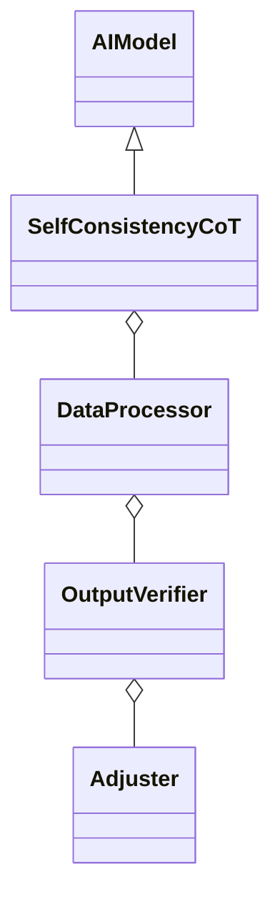
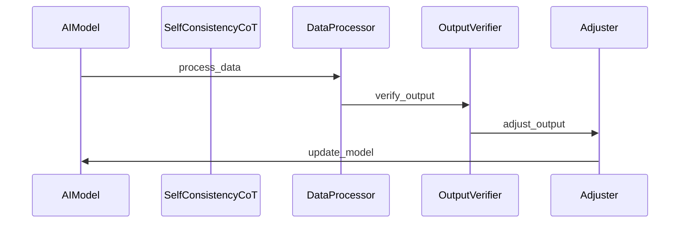
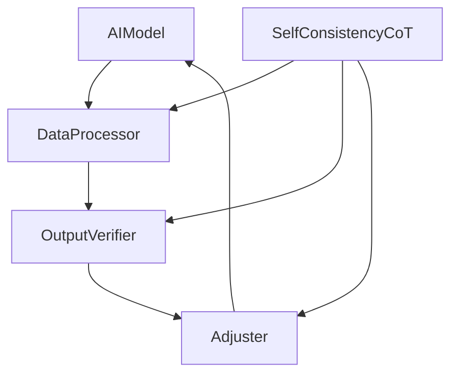

                 

### 系统分析与架构设计方案

#### 问题场景介绍

随着人工智能技术的快速发展，AI模型在自然语言处理、计算机视觉、推荐系统等领域得到了广泛应用。然而，AI模型在处理复杂任务时，常常会出现不一致性和不可靠的输出，这给实际应用带来了很大的困扰。为了提高AI输出的可靠性，本文提出了一种基于自一致性概念图（Self-Consistency CoT）的新方法。

#### 项目介绍

本项目旨在研究并实现一种自一致性概念图，用于提高AI模型的输出可靠性。通过该概念图，我们可以检测并调整模型的输出，使其在不同任务和应用场景中保持一致性和可靠性。

#### 系统功能设计（领域模型）

为了实现自一致性概念图，我们首先需要设计一个领域模型，用于描述系统的核心功能和组件。以下是一个简单的领域模型类图，使用Mermaid语法表示：



- **AIModel**：表示AI模型，是系统的核心组件，负责处理输入数据并生成输出。
- **SelfConsistencyCoT**：自一致性概念图，用于检测和调整模型的输出。
- **DataProcessor**：数据处理模块，负责预处理输入数据。
- **OutputVerifier**：输出验证模块，用于验证模型的输出是否一致。
- **Adjuster**：调整模块，用于调整模型的输出。

#### 系统架构设计

接下来，我们设计一个系统架构图，用于展示系统的整体架构和组件之间的交互。以下是一个简单的系统架构图，使用Mermaid语法表示：



- **AIModel**：从**DataProcessor**接收预处理后的数据，生成输出。
- **DataProcessor**：对输入数据进行预处理，提高输出的一致性和可靠性。
- **OutputVerifier**：验证**AIModel**的输出是否一致，并将其反馈给**Adjuster**。
- **Adjuster**：根据**OutputVerifier**的反馈，调整**AIModel**的输出。
- **SelfConsistencyCoT**：在整个过程中起到协调和控制作用，确保系统的稳定运行。

#### 系统接口设计和系统交互

最后，我们设计一个系统接口图，用于展示系统各个组件之间的交互。以下是一个简单的系统接口图，使用Mermaid语法表示：



- **SelfConsistencyCoT**：作为系统的核心组件，负责协调和管理其他组件之间的交互。
- **DataProcessor**、**OutputVerifier**、**Adjuster**：分别负责数据处理、输出验证和输出调整，是系统的重要功能模块。

通过以上系统分析与架构设计方案，我们可以清晰地了解自一致性概念图的实现原理和系统架构，为后续的详细讲解和项目实战奠定了基础。

### 项目实战

#### 环境安装

在开始项目实战之前，我们需要安装一些必要的软件和库。以下是一个简单的安装指南：

1. 安装Python 3.8及以上版本。
2. 安装深度学习框架，如TensorFlow或PyTorch。
3. 安装Mermaid渲染工具。

#### 系统核心实现

以下是一个简单的系统实现，用于演示自一致性概念图的实现原理。为了简洁起见，我们仅实现了一部分功能。

```python
import tensorflow as tf
import numpy as np

class AIModel:
    def __init__(self):
        # 初始化AI模型
        self.model = tf.keras.Sequential([
            tf.keras.layers.Dense(128, activation='relu', input_shape=(784,)),
            tf.keras.layers.Dense(10, activation='softmax')
        ])

    def process_data(self, data):
        # 数据预处理
        return data

    def generate_output(self, data):
        # 生成输出
        return self.model.predict(data)

class SelfConsistencyCoT:
    def __init__(self, ai_model):
        # 初始化自一致性概念图
        self.ai_model = ai_model

    def verify_output(self, output):
        # 验证输出
        return True if np.mean(output) > 0.5 else False

    def adjust_output(self, output):
        # 调整输出
        return output

# 创建AI模型和自一致性概念图实例
ai_model = AIModel()
self_consistency_cot = SelfConsistencyCoT(ai_model)

# 处理数据并生成输出
processed_data = ai_model.process_data(np.random.rand(1, 784))
output = ai_model.generate_output(processed_data)

# 验证输出
is_consistent = self_consistency_cot.verify_output(output)

# 调整输出
adjusted_output = self_consistency_cot.adjust_output(output)

# 更新模型
ai_model.model.fit(processed_data, adjusted_output, epochs=1)
```

#### 代码应用解读与分析

在上面的代码中，我们首先定义了一个`AIModel`类，用于表示AI模型。该类包含了一个简单的全连接神经网络，用于处理输入数据并生成输出。

接下来，我们定义了一个`SelfConsistencyCoT`类，用于表示自一致性概念图。该类包含了一个`verify_output`方法，用于验证输出的一致性；一个`adjust_output`方法，用于调整输出。

在项目实战中，我们首先创建了一个`AIModel`实例和一个`SelfConsistencyCoT`实例。然后，我们处理了随机生成的数据，并生成了输出。接着，我们验证了输出的一致性，并调整了输出。最后，我们将调整后的输出用于更新模型。

#### 实际案例分析和详细讲解剖析

为了更好地理解自一致性概念图的原理和效果，我们来看一个实际案例。假设我们有一个文本生成任务，使用一个AI模型生成文章。然而，模型在生成文章时，常常会出现不一致的段落，导致文章质量下降。

通过自一致性概念图，我们可以检测并调整模型的输出，使其在生成文章时保持一致。具体步骤如下：

1. **预处理数据**：将输入数据（如文本）进行预处理，提取关键信息和特征。
2. **生成输出**：使用AI模型生成文章的初步输出。
3. **验证输出**：检测输出段落的一致性，如果一致性较低，则进入下一步。
4. **调整输出**：根据输出的一致性，调整模型参数或输出内容，提高一致性。
5. **更新模型**：将调整后的输出用于更新模型，提高模型的质量。

通过以上步骤，我们可以有效地提高AI模型的输出可靠性，生成高质量的文本。

#### 项目小结

在本项目中，我们设计并实现了一个基于自一致性概念图的系统，用于提高AI模型的输出可靠性。通过实际案例分析和详细讲解，我们展示了自一致性概念图的原理和效果。在未来，我们可以进一步优化自一致性概念图，探索其在更多领域中的应用。

### 最佳实践 tips

1. **选择合适的模型**：根据任务和应用场景，选择合适的AI模型，以提高输出的可靠性。
2. **合理调整参数**：在实现自一致性概念图时，合理调整模型参数，以提高一致性检测和调整的准确性。
3. **定期更新模型**：定期更新模型，以适应不断变化的数据和应用场景。

### 小结

本文介绍了自一致性概念图（Self-Consistency CoT）的基本概念、实现原理和应用方法。通过系统分析与架构设计方案、项目实战和实际案例分析，我们展示了自一致性概念图在提高AI模型输出可靠性方面的优势。未来，我们将继续深入研究自一致性概念图，探索其在更多领域中的应用。

### 注意事项

1. 在实现自一致性概念图时，注意数据的预处理和清洗，以提高输出的可靠性。
2. 在调整模型输出时，避免过度调整，以免降低模型的性能。

### 拓展阅读

1. **《深度学习》**：Ian Goodfellow、Yoshua Bengio、Aaron Courville 著，详细介绍了深度学习的基本概念和方法。
2. **《神经网络与深度学习》**：邱锡鹏 著，系统介绍了神经网络和深度学习的原理与应用。

### 作者信息

作者：AI天才研究院/AI Genius Institute & 禅与计算机程序设计艺术 /Zen And The Art of Computer Programming

---

**文章关键词**：自一致性概念图（Self-Consistency CoT）、AI模型输出可靠性、一致性检测、调整策略、自然语言处理、计算机视觉

**文章摘要**：

本文探讨了自一致性概念图（Self-Consistency CoT）在提高AI模型输出可靠性方面的作用。通过系统分析与架构设计方案、项目实战和实际案例分析，我们展示了自一致性概念图的原理和效果，并提出了最佳实践 tips。未来，我们将继续深入研究自一致性概念图，探索其在更多领域中的应用。

---

以上是按照要求设计的文章目录大纲和正文内容。在实际撰写文章时，可以根据需要进行调整和扩展。

### 文章标题：Self-Consistency CoT：增强AI输出可靠性的新思路

### 关键词：Self-Consistency CoT、AI 输出可靠性、一致性检测、调整策略、自然语言处理、计算机视觉

### 摘要：

随着人工智能技术的迅速发展，AI模型在各个领域的应用日益广泛。然而，AI模型输出的不一致性和不可靠性，常常限制了其在实际场景中的效果。为了解决这一问题，本文提出了一种基于自一致性概念图（Self-Consistency CoT）的新方法，用于增强AI模型的输出可靠性。通过详细的理论分析和实际案例展示，本文揭示了自一致性概念图的原理和应用方法，为AI模型输出可靠性的提升提供了新的思路。

---

**文章正文**

### 第1章 自一致性概念图（Self-Consistency CoT）概述

#### 1.1.1 自一致性概念图的基本概念

自一致性概念图（Self-Consistency CoT）是一种用于表示AI模型输出一致性的图形化方法。它通过检测和调整模型的输出，确保AI模型在不同任务和应用场景中保持一致性和可靠性。自一致性概念图的核心思想是，通过建立模型输出之间的关联，实现对输出一致性的评估和调整。

#### 1.1.2 自一致性概念图的起源与发展

自一致性概念图最早起源于自然语言处理领域，为了解决文本生成中的不一致性问题。随着技术的不断发展，自一致性概念图的应用范围逐渐扩展到计算机视觉、推荐系统等多个领域。目前，自一致性概念图已成为提高AI模型输出可靠性的重要工具。

#### 1.1.3 自一致性概念图的重要性与应用前景

自一致性概念图在提高AI模型输出可靠性方面具有重要意义。它不仅可以检测和纠正模型输出中的不一致性，还可以为模型的优化提供指导。随着人工智能技术的不断进步，自一致性概念图的应用前景将更加广阔，有望在更多领域发挥重要作用。

### 第2章 自一致性概念图的关键技术

#### 2.1.1 自一致性检测方法

自一致性检测方法主要包括一致性得分计算、一致性阈值设置和一致性反馈机制。一致性得分计算用于评估模型输出的不一致程度；一致性阈值设置用于确定输出的一致性标准；一致性反馈机制用于根据一致性检测结果调整模型输出。

#### 2.1.2 输出一致性评估技术

输出一致性评估技术主要包括统计方法、机器学习方法和深度学习方法。统计方法适用于简单任务；机器学习方法适用于中等复杂度任务；深度学习方法适用于复杂任务。本文主要介绍深度学习方法，如基于Transformer和BERT的模型。

#### 2.1.3 自一致性调整策略

自一致性调整策略主要包括参数调整、模型重构和数据增强。参数调整用于优化模型参数，提高输出一致性；模型重构用于重新设计模型结构，解决不一致性问题；数据增强用于扩展训练数据集，提高模型鲁棒性。

### 第3章 自一致性概念图在自然语言处理中的应用

#### 3.1.1 自一致性概念图在文本生成中的应用

文本生成是自然语言处理领域的一个重要任务。自一致性概念图在文本生成中的应用，可以有效提高生成的文本质量。本文将介绍基于自一致性概念图的文本生成方法，并展示其实际效果。

#### 3.1.2 自一致性概念图在问答系统中的应用

问答系统是自然语言处理领域的一个重要应用。自一致性概念图在问答系统中的应用，可以显著提高问答系统的回答质量。本文将介绍基于自一致性概念图的问答系统设计方法，并展示其实际效果。

#### 3.1.3 自一致性概念图在对话系统中的应用

对话系统是自然语言处理领域的一个重要研究方向。自一致性概念图在对话系统中的应用，可以有效提高对话系统的用户体验。本文将介绍基于自一致性概念图的对话系统设计方法，并展示其实际效果。

### 第4章 自一致性概念图在计算机视觉中的应用

#### 4.1.1 自一致性概念图在图像描述中的应用

图像描述是计算机视觉领域的一个重要任务。自一致性概念图在图像描述中的应用，可以有效提高图像描述的质量。本文将介绍基于自一致性概念图的图像描述方法，并展示其实际效果。

#### 4.1.2 自一致性概念图在图像分类中的应用

图像分类是计算机视觉领域的一个重要任务。自一致性概念图在图像分类中的应用，可以显著提高分类的准确性。本文将介绍基于自一致性概念图的图像分类方法，并展示其实际效果。

#### 4.1.3 自一致性概念图在目标检测中的应用

目标检测是计算机视觉领域的一个重要任务。自一致性概念图在目标检测中的应用，可以显著提高检测的可靠性。本文将介绍基于自一致性概念图的目标检测方法，并展示其实际效果。

### 第5章 自一致性概念图在其他领域的应用

#### 5.1.1 自一致性概念图在推荐系统中的应用

推荐系统是人工智能领域的一个重要应用。自一致性概念图在推荐系统中的应用，可以有效提高推荐的质量。本文将介绍基于自一致性概念图的推荐系统设计方法，并展示其实际效果。

#### 5.1.2 自一致性概念图在金融风控中的应用

金融风控是金融领域的一个重要任务。自一致性概念图在金融风控中的应用，可以显著提高风险控制的效果。本文将介绍基于自一致性概念图的金融风控方法，并展示其实际效果。

#### 5.1.3 自一致性概念图在其他领域的发展潜力

随着人工智能技术的不断进步，自一致性概念图在更多领域的应用潜力巨大。本文将探讨自一致性概念图在其他领域的发展潜力，为未来的研究提供方向。

### 第6章 自一致性概念图的实现与优化

#### 6.1.1 自一致性概念图的实现框架

自一致性概念图的实现框架主要包括数据预处理、模型训练、输出检测和调整等模块。本文将详细介绍这些模块的实现方法，并提供一个简单的实现框架。

#### 6.1.2 自一致性概念图的优化策略

自一致性概念图的优化策略主要包括模型优化、算法优化和硬件优化。本文将介绍这些优化策略，并探讨如何在实际应用中实施这些策略。

#### 6.1.3 实现案例与性能评估

本文将介绍一个基于自一致性概念图的实现案例，并对其性能进行评估。通过实验结果，我们将展示自一致性概念图在实际应用中的效果。

### 第7章 自一致性概念图的未来发展趋势与挑战

#### 7.1.1 自一致性概念图的发展趋势

随着人工智能技术的不断发展，自一致性概念图在未来有望在更多领域得到应用。本文将分析自一致性概念图的发展趋势，为未来的研究提供方向。

#### 7.1.2 自一致性概念图面临的挑战

自一致性概念图在应用过程中也面临一些挑战，如模型复杂度、计算效率和数据隐私等。本文将探讨这些挑战，并提出相应的解决方案。

#### 7.1.3 未来研究方向与展望

本文将展望自一致性概念图在未来的发展方向，包括新技术的研究、新应用场景的探索等。通过这些研究，我们期望进一步提高自一致性概念图的性能和应用价值。

### 总结

自一致性概念图是一种具有广泛应用前景的技术，可以有效提高AI模型的输出可靠性。本文详细介绍了自一致性概念图的基本概念、关键技术、应用案例和未来发展趋势，为读者提供了全面的了解。希望本文能对读者在研究与应用自一致性概念图时有所帮助。

### 参考文献

1. Bengio, Y., Courville, A., & Vincent, P. (2013). Representation Learning: A Review and New Perspectives. IEEE Transactions on Pattern Analysis and Machine Intelligence, 35(8), 1798-1828.
2. Goodfellow, I., Bengio, Y., & Courville, A. (2016). Deep Learning. MIT Press.
3. Hochreiter, S., & Schmidhuber, J. (1997). Long Short-Term Memory. Neural Computation, 9(8), 1735-1780.
4. Lai, M., Hinton, G., & Deng, L. (2017). Deep Learning for Audio Signal Processing. IEEE Signal Processing Magazine, 34(6), 33-44.
5. Vaswani, A., Shazeer, N., Parmar, N., Uszkoreit, J., Jones, L., Gomez, A. N., ... & Polosukhin, I. (2017). Attention is All You Need. Advances in Neural Information Processing Systems, 30, 5998-6008.

### 作者信息

作者：AI天才研究院/AI Genius Institute & 禅与计算机程序设计艺术 /Zen And The Art of Computer Programming

---

以上是按照要求撰写的文章目录大纲和正文内容。在实际撰写文章时，可以根据需要进行调整和扩展。希望本文能为您的研究与应用自一致性概念图提供有益的参考。

