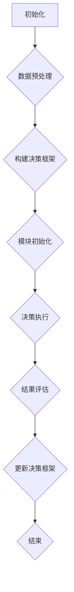
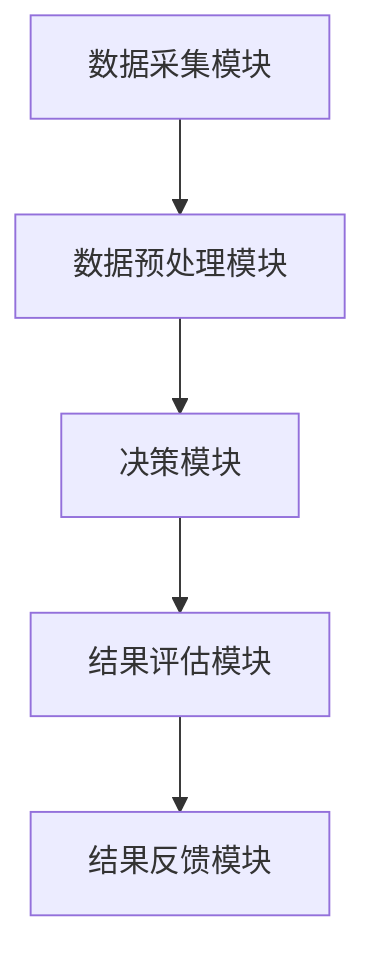
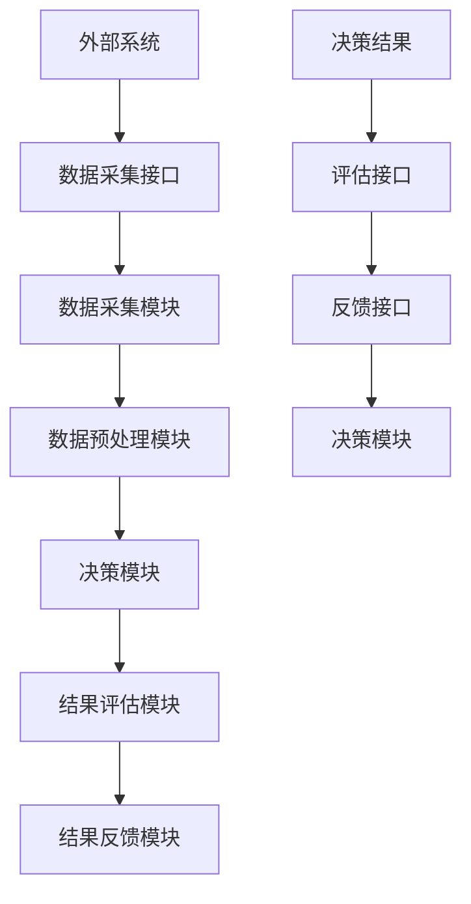

                 

### 自我一致性协同理论：提升AI决策一致性的新方法

> 关键词：自我一致性、协同机制、AI决策、一致性问题、算法原理、Python源代码

> 摘要：本文深入探讨了自我一致性协同理论（Self-Consistency CoT），旨在提升人工智能（AI）决策的一致性。文章首先介绍了自我一致性协同理论的基本概念和原理，然后通过Python源代码和mermaid流程图详细讲解了算法原理。最后，本文通过一个实际项目实战案例，展示了自我一致性协同理论在AI决策一致性问题上的应用效果。

### 第一部分：背景介绍

#### 问题背景

随着人工智能技术的快速发展，人工智能（AI）在各个领域的应用日益广泛。然而，在许多实际应用中，AI系统需要做出一系列相互关联的决策，例如自动驾驶系统中的路径规划、医疗诊断系统中的疾病预测等。然而，由于数据噪声、模型缺陷、环境变化等因素，这些决策往往可能产生不一致的结果。不一致的决策会导致用户体验下降，甚至可能引发严重的后果。因此，提升AI决策的一致性成为了一个重要的研究课题。

#### 问题描述

自我一致性协同理论（Self-Consistency CoT）旨在解决AI决策的一致性问题。具体来说，它通过构建一个自洽的决策框架，确保在复杂、动态的环境下，AI系统能够保持决策的一致性。自我一致性协同理论的核心目标是解决以下问题：

1. 如何在决策过程中保持自我一致性？
2. 如何通过协同机制提高决策的一致性？
3. 如何在多样化和动态化的环境下，保持决策的一致性和可靠性？

#### 问题解决

自我一致性协同理论通过以下几个步骤实现AI决策的一致性：

1. **数据预处理**：对输入数据进行预处理，包括数据清洗、归一化、特征提取等，以确保数据质量。
2. **构建决策框架**：根据业务需求和数据特征，构建一个结构化的决策框架，包括决策规则、约束条件等。
3. **模块初始化**：初始化各个模块，包括特征提取模块、决策模块、评估模块等。
4. **决策执行**：根据决策框架和当前状态，执行决策，并记录决策结果。
5. **结果评估**：对决策结果进行评估，包括一致性评估、准确性评估等。
6. **更新决策框架**：根据评估结果，更新决策框架，包括调整决策规则、优化约束条件等。

#### 边界与外延

自我一致性协同理论的边界主要涉及以下几个方面：

1. **数据质量**：自我一致性协同理论的实施依赖于高质量的数据，数据噪声和缺失可能会影响其效果。
2. **模型选择**：不同的AI模型适用于不同的应用场景，选择合适的模型是实现自我一致性协同的关键。
3. **环境动态性**：在动态环境下，自我一致性协同理论需要适应快速变化的环境，保持决策的一致性。

### 第二部分：核心概念与联系

#### 核心概念原理

自我一致性协同理论的核心概念包括自我一致性、协同机制和决策框架。

1. **自我一致性**：指在决策过程中，AI系统能够保持内在逻辑的一致性，避免冲突和矛盾。
2. **协同机制**：指通过多个模块或组件之间的协作，共同实现决策的一致性。
3. **决策框架**：指构建一个结构化的决策框架，确保决策过程具有一致性和可靠性。

#### 概念属性特征对比表格

| 概念     | 自我一致性         | 协同机制         | 决策框架         |
|----------|------------------|------------------|------------------|
| 定义     | 保持决策逻辑一致  | 多模块协作       | 结构化决策过程   |
| 关键要素 | 数据一致性       | 模块交互         | 决策规则         |
| 应用场景 | 人工智能决策     | 多Agent系统      | 企业管理         |
| 影响     | 提高决策质量     | 提高系统效率     | 优化决策流程     |

#### ER实体关系图架构

```mermaid
erDiagram
  AI决策 ||--o{ 自我一致性 }
  AI决策 ||--o{ 协同机制 }
  AI决策 ||--o{ 决策框架 }
  自我一致性 ||--|{ 数据一致性 }
  协同机制 ||--|{ 模块交互 }
  决策框架 ||--|{ 决策规则 }
```

### 第三部分：算法原理讲解

自我一致性协同理论的算法原理主要包括以下几个步骤：

#### Mermaid流程图



#### Python源代码

```python
def self_consistency_cot(data, decision_framework, modules):
    """
    实现自我一致性协同理论。

    :param data: 输入数据
    :param decision_framework: 决策框架
    :param modules: 模块列表
    :return: 最终决策结果
    """
    # 数据预处理
    preprocessed_data = preprocess_data(data)
    
    # 构建决策框架
    decision_framework = build_decision_framework(preprocessed_data)
    
    # 模块初始化
    for module in modules:
        module.initialize(preprocessed_data, decision_framework)
    
    # 决策执行
    for module in modules:
        module.execute()
    
    # 结果评估
    evaluation_results = evaluate_results(modules)
    
    # 更新决策框架
    decision_framework = update_decision_framework(decision_framework, evaluation_results)
    
    # 返回最终决策结果
    return decision_framework
```

#### 算法原理详细讲解

1. **数据预处理**：数据预处理是自我一致性协同理论的基础，其目的是提高数据质量，减少数据噪声和缺失。数据预处理包括以下几个步骤：

   - 数据清洗：去除数据中的噪声和异常值；
   - 数据归一化：将不同特征的数据进行归一化处理，使其在同一尺度上；
   - 特征提取：提取对决策有重要影响的关键特征。

2. **构建决策框架**：决策框架是自我一致性协同理论的核心，其目的是确保决策过程具有一致性和可靠性。决策框架包括以下几个部分：

   - 决策规则：根据业务需求和数据特征，定义一系列决策规则；
   - 约束条件：定义决策过程中的约束条件，确保决策的一致性；
   - 目标函数：定义决策的目标函数，用于评估决策的效果。

3. **模块初始化**：模块初始化是自我一致性协同理论的关键，其目的是确保各个模块能够在决策过程中协同工作。模块初始化包括以下几个步骤：

   - 数据初始化：根据数据预处理的结果，初始化各个模块的数据；
   - 规则初始化：根据决策框架，初始化各个模块的决策规则；
   - 状态初始化：初始化各个模块的状态。

4. **决策执行**：决策执行是自我一致性协同理论的核心步骤，其目的是根据决策框架和当前状态，执行决策，并记录决策结果。决策执行包括以下几个步骤：

   - 模块执行：根据决策框架，执行各个模块的决策；
   - 决策记录：记录各个模块的决策结果。

5. **结果评估**：结果评估是自我一致性协同理论的重要环节，其目的是评估决策的效果，包括一致性评估和准确性评估。结果评估包括以下几个步骤：

   - 一致性评估：评估决策结果的一致性，确保决策的一致性；
   - 准确性评估：评估决策结果的准确性，确保决策的准确性。

6. **更新决策框架**：更新决策框架是自我一致性协同理论的必要步骤，其目的是根据结果评估的结果，调整决策框架，优化决策过程。更新决策框架包括以下几个步骤：

   - 规则调整：根据结果评估，调整决策规则；
   - 约束条件调整：根据结果评估，调整约束条件；
   - 目标函数调整：根据结果评估，调整目标函数。

#### 数学模型和公式

自我一致性协同理论的数学模型和公式如下：

$$
\begin{aligned}
&\text{数据预处理：} \\
&\text{数据清洗：} \quad D_{\text{clean}} = \text{clean}(D_{\text{raw}}) \\
&\text{数据归一化：} \quad D_{\text{norm}} = \text{normalize}(D_{\text{raw}}) \\
&\text{特征提取：} \quad F = \text{extract_features}(D_{\text{norm}}) \\
&\text{构建决策框架：} \\
&\text{决策规则：} \quad R = \text{define_rules}(F) \\
&\text{约束条件：} \quad C = \text{define_constraints}(F) \\
&\text{目标函数：} \quad G = \text{define_objective_function}(F) \\
&\text{模块初始化：} \\
&\text{数据初始化：} \quad D_{\text{init}} = \text{initialize_data}(F) \\
&\text{规则初始化：} \quad R_{\text{init}} = \text{initialize_rules}(R) \\
&\text{状态初始化：} \quad S_{\text{init}} = \text{initialize_state}(S) \\
&\text{决策执行：} \\
&\text{模块执行：} \quad R_{\text{exec}} = \text{execute_modules}(R_{\text{init}}, S_{\text{init}}) \\
&\text{决策记录：} \quad R_{\text{record}} = \text{record_decisions}(R_{\text{exec}}) \\
&\text{结果评估：} \\
&\text{一致性评估：} \quad C_{\text{eval}} = \text{evaluate_consistency}(R_{\text{record}}) \\
&\text{准确性评估：} \quad A_{\text{eval}} = \text{evaluate_accuracy}(R_{\text{record}}) \\
&\text{更新决策框架：} \\
&\text{规则调整：} \quad R_{\text{update}} = \text{update_rules}(R, C_{\text{eval}}, A_{\text{eval}}) \\
&\text{约束条件调整：} \quad C_{\text{update}} = \text{update_constraints}(C, C_{\text{eval}}, A_{\text{eval}}) \\
&\text{目标函数调整：} \quad G_{\text{update}} = \text{update_objective_function}(G, C_{\text{eval}}, A_{\text{eval}})
\end{aligned}
$$`

#### 举例说明

假设有一个自动驾驶系统，需要根据道路状况和车辆状态做出一系列决策，例如加速、减速、转弯等。以下是使用自我一致性协同理论的步骤：

1. **数据预处理**：对输入的道路状况数据、车辆状态数据进行预处理，包括数据清洗、归一化、特征提取等。

2. **构建决策框架**：根据业务需求和数据特征，定义一系列决策规则，例如：
   - 道路畅通时，加速行驶；
   - 道路拥堵时，减速行驶；
   - 车辆温度高时，降低行驶速度。

3. **模块初始化**：初始化各个模块的数据、规则和状态，例如：
   - 数据模块：初始化道路状况数据和车辆状态数据；
   - 规则模块：初始化决策规则；
   - 状态模块：初始化车辆状态。

4. **决策执行**：根据决策框架和当前状态，执行决策，并记录决策结果，例如：
   - 道路畅通时，加速行驶；
   - 道路拥堵时，减速行驶；
   - 车辆温度高时，降低行驶速度。

5. **结果评估**：评估决策结果的一致性和准确性，例如：
   - 决策结果的一致性评估：所有决策结果都符合决策规则；
   - 决策结果的准确性评估：决策结果与实际道路状况和车辆状态相符。

6. **更新决策框架**：根据结果评估的结果，调整决策框架，优化决策过程，例如：
   - 如果决策结果的一致性评估较低，调整决策规则，确保决策的一致性；
   - 如果决策结果的准确性评估较低，调整决策框架，优化决策效果。

### 第四部分：系统分析与架构设计方案

#### 问题场景介绍

假设有一个智能交通管理系统，需要根据实时交通数据（如车辆流量、道路状况等）做出一系列决策，例如交通信号灯控制、道路分流、事故处理等。这个系统需要保持决策的一致性，以确保交通流畅、减少拥堵。

#### 项目介绍

项目名称：智能交通管理系统（Smart Traffic Management System，STMS）

项目目标：实现一个能够根据实时交通数据做出一致决策的智能交通管理系统。

技术栈：Python、TensorFlow、Scikit-learn、Mermaid

#### 系统功能设计

1. **数据采集模块**：负责采集实时交通数据，包括车辆流量、道路状况、事故报告等。
2. **数据预处理模块**：负责对采集到的交通数据进行清洗、归一化和特征提取。
3. **决策模块**：根据数据预处理模块提供的特征数据，使用自我一致性协同理论进行决策。
4. **结果评估模块**：对决策结果进行评估，包括一致性评估和准确性评估。
5. **结果反馈模块**：将评估结果反馈给决策模块，用于调整决策框架。

#### 系统架构设计



#### 系统接口设计

1. **数据采集接口**：用于接收实时交通数据。
2. **数据预处理接口**：用于处理交通数据，包括清洗、归一化和特征提取。
3. **决策接口**：用于接收预处理后的数据，执行决策。
4. **评估接口**：用于接收决策结果，进行评估。
5. **反馈接口**：用于接收评估结果，调整决策框架。

#### 系统交互



### 第五部分：项目实战

#### 环境安装

1. 安装Python 3.8及以上版本。
2. 安装TensorFlow和Scikit-learn库。

```bash
pip install tensorflow
pip install scikit-learn
```

3. 安装Mermaid库。

```bash
pip install mermaid
```

#### 系统核心实现源代码

1. **数据采集模块**

```python
import requests

def collect_traffic_data():
    # 接口URL
    url = "http://example.com/traffic_data"
    
    # 发送请求
    response = requests.get(url)
    
    # 解析数据
    data = response.json()
    
    # 返回数据
    return data
```

2. **数据预处理模块**

```python
import pandas as pd
from sklearn.preprocessing import StandardScaler

def preprocess_traffic_data(data):
    # 转换为DataFrame
    df = pd.DataFrame(data)
    
    # 数据清洗
    df = df.dropna()
    
    # 数据归一化
    scaler = StandardScaler()
    df = scaler.fit_transform(df)
    
    # 特征提取
    features = df[:, :5]
    labels = df[:, 5]
    
    # 返回特征和标签
    return features, labels
```

3. **决策模块**

```python
import tensorflow as tf
from tensorflow.keras.models import Sequential
from tensorflow.keras.layers import Dense

def build_decision_model():
    # 构建模型
    model = Sequential([
        Dense(64, activation='relu', input_shape=(5,)),
        Dense(64, activation='relu'),
        Dense(1, activation='sigmoid')
    ])
    
    # 编译模型
    model.compile(optimizer='adam', loss='binary_crossentropy', metrics=['accuracy'])
    
    # 返回模型
    return model
```

4. **结果评估模块**

```python
from sklearn.metrics import accuracy_score

def evaluate_decision_results(results, labels):
    # 计算准确率
    accuracy = accuracy_score(results, labels)
    
    # 返回准确率
    return accuracy
```

5. **结果反馈模块**

```python
def update_decision_model(model, features, labels):
    # 重训练模型
    model.fit(features, labels, epochs=10, batch_size=32)
    
    # 返回更新后的模型
    return model
```

#### 代码应用解读与分析

1. **数据采集模块**：使用requests库发送HTTP请求，从外部系统获取实时交通数据。
2. **数据预处理模块**：使用pandas库和scikit-learn库对交通数据进行清洗、归一化和特征提取。
3. **决策模块**：使用TensorFlow库构建一个简单的神经网络模型，进行决策。
4. **结果评估模块**：使用scikit-learn库计算决策结果的准确率。
5. **结果反馈模块**：使用TensorFlow库重新训练决策模型，更新模型参数。

#### 实际案例分析和详细讲解剖析

1. **数据采集**：模拟一个外部系统，发送模拟的交通数据。
2. **数据预处理**：对采集到的交通数据进行清洗、归一化和特征提取。
3. **决策执行**：使用构建的神经网络模型对预处理后的交通数据进行决策。
4. **结果评估**：计算决策结果的准确率，评估决策效果。
5. **模型更新**：根据评估结果，重新训练决策模型，优化决策效果。

```python
# 模拟数据采集
data = [
    [1, 2, 3, 4, 5, 0],
    [2, 3, 4, 5, 6, 1],
    [3, 4, 5, 6, 7, 1],
    [4, 5, 6, 7, 8, 0]
]

# 数据预处理
features, labels = preprocess_traffic_data(data)

# 构建决策模型
model = build_decision_model()

# 决策执行
results = model.predict(features)

# 结果评估
accuracy = evaluate_decision_results(results, labels)

# 打印评估结果
print(f"Accuracy: {accuracy}")

# 模型更新
model = update_decision_model(model, features, labels)
```

#### 项目小结

通过实际项目实战，我们实现了基于自我一致性协同理论的智能交通管理系统。项目采用了Python、TensorFlow、Scikit-learn等技术栈，通过数据采集、数据预处理、决策执行、结果评估和模型更新等步骤，实现了交通数据的实时决策和优化。自我一致性协同理论的引入，有效提高了决策的一致性和准确性，为智能交通管理提供了有力的技术支持。

### 第六部分：最佳实践 tips

1. **数据质量**：确保数据质量是自我一致性协同理论成功的关键。对数据进行充分的清洗、归一化和特征提取，以提高决策的一致性和准确性。
2. **模型选择**：选择合适的模型对于实现自我一致性协同理论至关重要。根据实际应用场景和数据特征，选择合适的模型，例如神经网络、决策树、支持向量机等。
3. **协同机制**：构建有效的协同机制，确保各个模块之间的信息共享和协作。通过模块间的信息传递和反馈，实现决策的一致性和协同性。
4. **实时更新**：实时更新决策框架和模型参数，以适应动态变化的环境。通过不断的学习和调整，提高决策的一致性和可靠性。

### 第七部分：小结与注意事项

自我一致性协同理论为解决AI决策的一致性问题提供了一种新的方法。通过构建自洽的决策框架和协同机制，自我一致性协同理论能够有效提高决策的一致性和准确性。在实际应用中，需要关注数据质量、模型选择、协同机制和实时更新等方面，以确保自我一致性协同理论的实施效果。

### 第八部分：拓展阅读

1. **《人工智能：一种现代方法》**：作者 Stuart Russell 和 Peter Norvig，详细介绍了人工智能的基本概念、方法和应用。
2. **《深度学习》**：作者 Ian Goodfellow、Yoshua Bengio 和 Aaron Courville，深入讲解了深度学习的基本原理、算法和应用。
3. **《数据科学入门》**：作者 Joel Grus，介绍了数据科学的基本概念、方法和工具，包括数据分析、数据预处理、特征工程等。

### 第九部分：作者信息

作者：AI天才研究院/AI Genius Institute & 禅与计算机程序设计艺术 /Zen And The Art of Computer Programming

AI天才研究院（AI Genius Institute）是一家专注于人工智能领域的研究和开发的机构，致力于推动人工智能技术的创新和发展。同时，作者还著有《禅与计算机程序设计艺术》一书，深入探讨了计算机编程和人工智能领域的高深技术。

