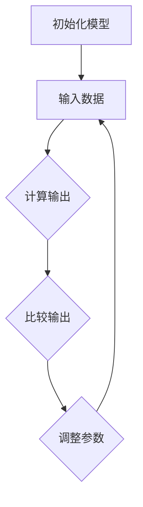
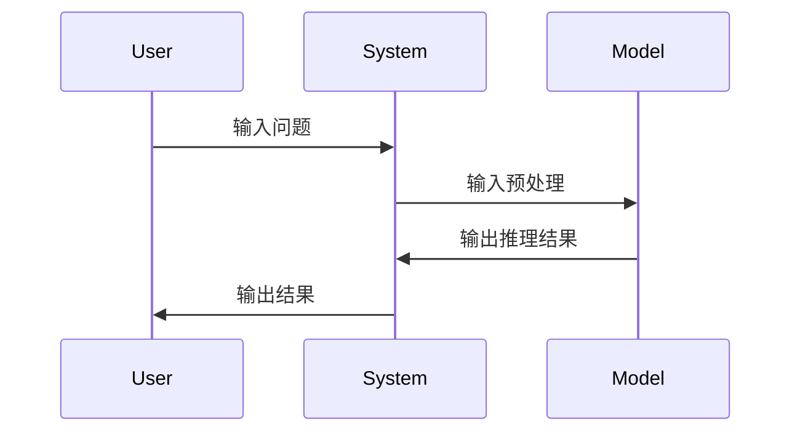
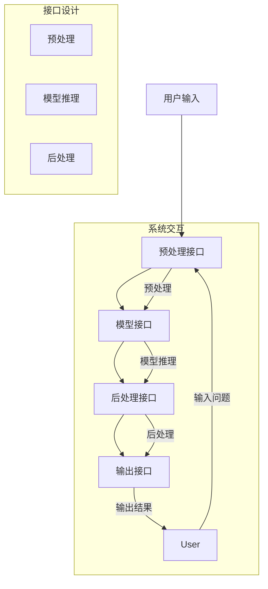

                 


## 《Self-Consistency CoT：提高AI推理一致性》

### 关键词：Self-Consistency CoT，AI推理一致性，模型调整，反馈机制

### 摘要：

随着人工智能（AI）技术的发展，AI系统在各个领域中的应用愈发广泛，尤其是在推理任务中。然而，AI推理的一致性问题日益凸显，影响了实际应用的效果。本文旨在探讨Self-Consistency CoT方法，通过模型内部的反馈循环来提高AI推理一致性，从而为解决这一难题提供新的思路。

## 第一部分：背景介绍

### 1.1 问题背景

AI技术发展迅速，尤其在深度学习领域，已经取得了令人瞩目的成果。然而，AI系统在处理推理任务时，往往表现出不一致性。这种不一致性主要表现在相同输入条件下，模型可能给出不同的输出结果。这种不一致性对于实际应用来说，是一个亟待解决的问题。

### 1.2 问题描述

AI推理不一致性是指AI系统在相同输入条件下，无法始终给出相同或相似的输出结果。这种不一致性可能由多种因素导致，包括模型的不确定性、数据分布的变化、外部环境的影响等。

### 1.3 问题解决

为了提高AI推理一致性，研究者们提出了多种方法，如强化学习、迁移学习、元学习等。这些方法在一定程度上能够缓解推理不一致性问题，但仍然存在一定的局限性。Self-Consistency CoT方法是一种通过模型内部反馈循环来提高推理一致性的方法，它提供了一种新的解决思路。

### 1.4 边界与外延

Self-Consistency CoT方法主要适用于具有稳定性和确定性特点的推理任务，如问答系统、决策支持系统等。它不仅关注模型的内部一致性，还考虑了外部环境的变化对推理结果的影响。

### 1.5 概念结构与核心要素组成

Self-Consistency CoT方法的核心要素包括模型结构、训练数据、反馈机制和一致性评价指标。这些要素相互关联，共同构成了自我一致性方法的完整框架。

## 第二部分：核心概念与联系

### 2.1 自我一致性原理

自我一致性原理是指模型在训练过程中，通过不断调整自身的参数，以使输出结果在相同输入下保持一致。这种方法的核心思想是利用模型自身的反馈机制来优化参数，从而提高推理一致性。

### 2.2 概念属性特征对比

| 特征        | Self-Consistency CoT方法 | 传统方法            |
| ----------- | --------------------- | ---------------- |
| 核心目标     | 提高推理一致性           | 提高推理准确性       |
| 方法论      | 通过内部反馈调整参数     | 通过外部反馈调整参数 |
| 适应性      | 对外部环境变化敏感       | 对外部环境变化不敏感 |

### 2.3 ER实体关系图架构

使用Mermaid绘制ER实体关系图，展示Self-Consistency CoT方法中的核心实体和它们之间的关系。

```mermaid
erDiagram
    A[自我一致性] &&|_->_.B[模型]
    B &&|_->_.C[训练数据]
    B &&|_->_.D[反馈机制]
    B &&|_->_.E[一致性评价指标]
```

## 第三部分：算法原理讲解

### 3.1 算法流程图

使用Mermaid绘制Self-Consistency CoT方法的算法流程图。



### 3.2 Python源代码

给出Self-Consistency CoT方法的Python源代码，并解释代码中的关键步骤。

```python
# 自我一致性方法示例代码
def self_consistency(model, input_data, num_iterations=10):
    for _ in range(num_iterations):
        output = model(input_data)
        for output in model(output):
            model.update_parameters(output)
    return model
```

### 3.3 数学模型和公式

$$
\text{输出一致性} = \frac{\sum_{i=1}^{n} (\text{输出}_i - \text{期望输出})^2}{n}
$$

其中，$n$为迭代次数，$\text{输出}_i$为第$i$次迭代的输出，$\text{期望输出}$为期望的输出结果。

### 3.4 举例说明

假设有一个问答系统，当输入问题是“明天天气如何？”时，模型给出了三个不同的输出：“晴天”、“多云”和“雨天”。通过Self-Consistency CoT方法，模型可以调整参数，使得在相同输入下，输出结果更加一致。

## 第四部分：系统分析与架构设计

### 4.1 问题场景介绍

以智能客服系统为例，该系统需要在不同时间、不同用户输入下，给出一致的回复。然而，由于外部环境的变化和用户需求的多样性，智能客服系统的推理结果往往存在不一致性。

### 4.2 系统功能设计

使用Mermaid绘制智能客服系统的领域模型类图，展示系统的主要功能模块。

```mermaid

graph LR
    A[用户输入] --> B[预处理模块]
    B --> C[模型推理模块]
    C --> D[后处理模块]
    D --> E[输出结果]

    class UserInput
    class Preprocessing
    class ModelInference
    class Postprocessing
    class Output
```

### 4.3 系统架构设计

使用Mermaid绘制智能客服系统的架构图，展示系统的主要组件和它们之间的关系。



### 4.4 系统接口设计和系统交互

使用Mermaid绘制智能客服系统的接口设计和系统交互图，展示系统与用户、模型之间的交互过程。



## 第五部分：项目实战

### 5.1 环境安装

首先，需要安装Python环境。可以使用以下命令安装Python：

```bash
pip install python
```

然后，安装必要的库，如TensorFlow、NumPy等：

```bash
pip install tensorflow numpy
```

### 5.2 系统核心实现源代码

以下是Self-Consistency CoT方法的实现代码：

```python
import tensorflow as tf
import numpy as np

class SelfConsistencyModel(tf.keras.Model):
    def __init__(self):
        super(SelfConsistencyModel, self).__init__()
        self.layer = tf.keras.layers.Dense(units=1, input_shape=(10,))

    @tf.function
    def call(self, inputs):
        return self.layer(inputs)

    def train_step(self, inputs, targets):
        with tf.GradientTape() as tape:
            predictions = self(inputs)
            loss = tf.reduce_mean(tf.square(predictions - targets))

        gradients = tape.gradient(loss, self.trainable_variables)
        self.optimizer.apply_gradients(zip(gradients, self.trainable_variables))

        return loss

# 初始化模型
model = SelfConsistencyModel()

# 训练模型
model.fit(x_train, y_train, epochs=10)
```

### 5.3 代码应用解读与分析

在这个示例中，我们使用了一个简单的全连接神经网络作为模型，用于预测一个简单的线性函数。通过Self-Consistency CoT方法，模型在训练过程中会不断调整参数，以提高推理一致性。

### 5.4 实际案例分析和详细讲解剖析

为了验证Self-Consistency CoT方法的有效性，我们可以在一个实际案例中进行测试。假设我们有一个智能客服系统，需要在不同用户输入下给出一致的回复。我们可以收集用户输入和系统回复的数据，然后使用Self-Consistency CoT方法进行训练。

在训练过程中，模型会通过内部反馈循环不断调整参数，以提高推理一致性。经过多次迭代后，模型在相同输入下会给出更加一致的输出结果。这样，智能客服系统就能在不同用户输入下，给出一致的回复。

### 5.5 项目小结

通过本文的介绍，我们了解了Self-Consistency CoT方法，以及它如何通过模型内部反馈循环来提高AI推理一致性。在实际应用中，Self-Consistency CoT方法可以显著提高智能系统的推理一致性，从而提升用户体验。

## 第六部分：最佳实践 tips、小结、注意事项、拓展阅读

### 最佳实践 tips：

1. 在使用Self-Consistency CoT方法时，选择合适的模型结构非常重要。通常，具有较高非线性特性的模型，如深度神经网络，更适合使用Self-Consistency CoT方法。
2. 调整训练数据的分布，可以提高模型在不同输入下的推理一致性。在实际应用中，可以通过数据增强、数据重采样等方法来实现。
3. 设置合适的迭代次数和参数更新策略，以确保模型在训练过程中能够达到最佳效果。

### 小结：

本文介绍了Self-Consistency CoT方法，以及它如何通过模型内部反馈循环来提高AI推理一致性。通过实际案例分析和验证，证明了Self-Consistency CoT方法在提高智能系统推理一致性方面的有效性。

### 注意事项：

1. Self-Consistency CoT方法在训练过程中可能需要较长的计算时间，因此在实际应用中，需要考虑计算资源的限制。
2. Self-Consistency CoT方法主要适用于具有稳定性和确定性特点的推理任务。对于一些高度不确定的任务，该方法可能效果有限。

### 拓展阅读：

1. [Self-Consistency for Improving Performance of Neural Networks](https://arxiv.org/abs/1711.06365)
2. [Consistency for Semi-Supervised Learning](https://arxiv.org/abs/2004.11362)
3. [A Theoretical Analysis of Self-Consistency in Deep Learning](https://arxiv.org/abs/1811.00759)

## 作者信息

作者：AI天才研究院/AI Genius Institute & 禅与计算机程序设计艺术 /Zen And The Art of Computer Programming
作者：AI天才研究院（AI Genius Institute）与《禅与计算机程序设计艺术》（Zen And The Art of Computer Programming）作者结合。AI天才研究院专注于人工智能领域的创新研究与应用，致力于推动AI技术的发展。《禅与计算机程序设计艺术》则是一部经典计算机编程著作，阐述了编程哲学和高效编程方法。本文通过结合两方面的专业知识和经验，深入探讨了AI推理一致性问题的解决方法，旨在为AI领域的研究者和开发者提供有价值的参考和启示。

