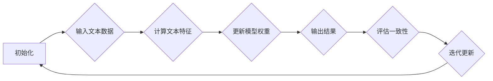
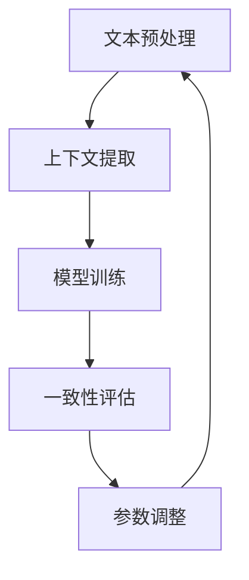
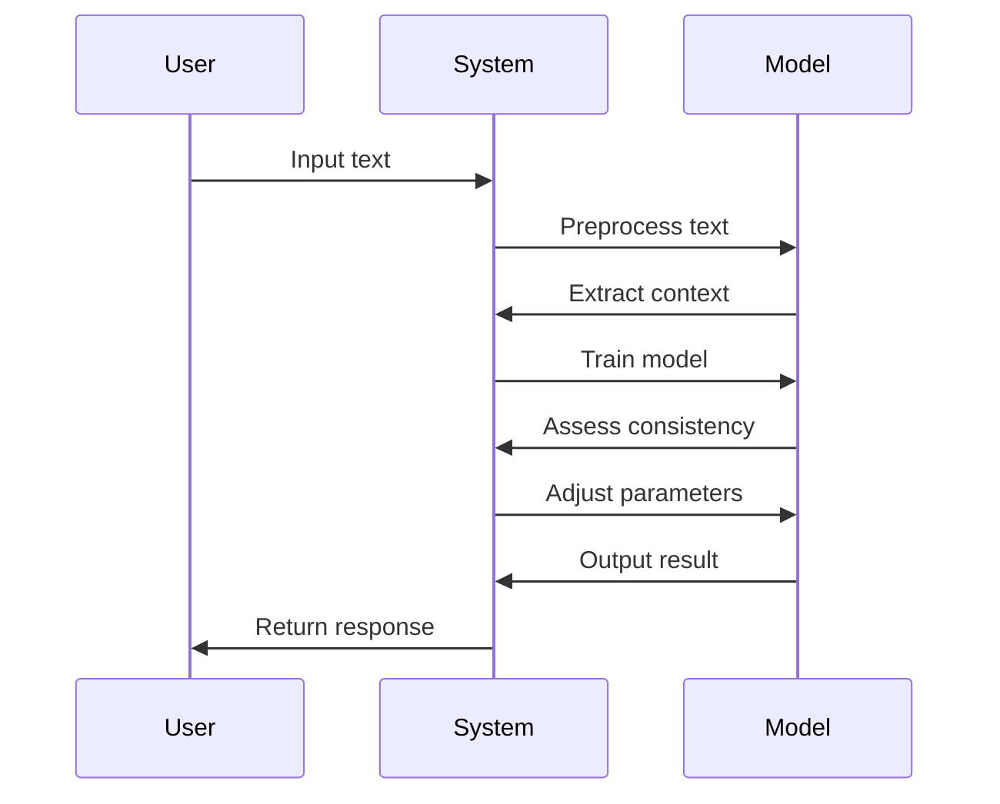

                 

### 文章标题

# Self-Consistency CoT：提高AI输出一致性的新方法

> 关键词：AI输出一致性、Self-Consistency CoT、算法原理、系统架构设计、项目实战、最佳实践

> 摘要：本文将深入探讨一种名为Self-Consistency CoT（自一致性CoT）的新方法，用于提高人工智能系统的输出一致性。通过详细的背景介绍、核心概念解析、算法原理讲解、系统架构设计和项目实战分析，本文旨在为AI研究人员和开发者提供全面的技术指导和实用建议。

## 目录大纲

1. **第一部分：背景介绍与核心概念**
   1. 第1章：问题背景与核心概念
      1.1.1 问题背景
      1.1.2 核心概念
      1.1.3 概念属性特征对比表格
      1.1.4 ER实体关系图架构
   2. 第2章：算法原理与流程
      2.1 算法原理
      2.2 Mermaid流程图
      2.3 Python源代码与详细讲解
   3. 第3章：数学模型与公式详解
      3.1 自一致性CoT的数学模型
      3.2 举例说明
2. **第二部分：应用与实现**
   1. 第4章：系统分析与架构设计
      4.1 问题场景介绍
      4.2 系统功能设计
      4.3 系统架构设计
      4.4 系统接口设计与交互
   2. 第5章：项目实战
      5.1 环境安装与配置
      5.2 系统核心实现
      5.3 实际案例分析
      5.4 项目小结
   3. 第6章：最佳实践与拓展
      6.1 最佳实践
      6.2 小结与注意事项
      6.3 拓展阅读

---

### 第一部分：背景介绍与核心概念

#### 第1章：问题背景与核心概念

##### 1.1.1 问题背景

人工智能（AI）技术近年来取得了显著的进展，广泛应用于各个领域，从自然语言处理到图像识别，从自动化控制到智能决策。然而，AI系统在实际应用中面临着一系列挑战，其中之一便是输出不一致性问题。不一致性指的是AI系统在处理同一问题时，给出不同的答案或结果，这种现象可能导致系统的可靠性降低，影响其应用效果。

输出不一致性问题的定义可以概括为：在同一输入条件下，人工智能系统产生多个相互矛盾或冲突的输出结果。这一问题不仅限于学术研究，在工业应用中同样具有重要意义。例如，自动驾驶汽车需要高度一致地识别道路上的障碍物，而医疗诊断系统则要求对疾病症状做出稳定可靠的判断。

不一致性的影响是多方面的。首先，它可能降低用户的信任度，影响AI系统的接受度和推广。其次，不一致的结果可能导致错误的决策或操作，带来安全隐患和经济损失。因此，提高AI输出一致性成为当前研究的重要课题。

##### 1.1.2 核心概念

为了解决输出不一致性问题，我们需要引入Self-Consistency CoT（自一致性CoT）这一核心概念。自一致性CoT是一种基于上下文一致性优化的人工智能算法，其目标是通过对AI模型的持续训练和调整，提高输出结果的一致性。

**自一致性CoT的基本原理**：

- **上下文一致性**：自一致性CoT通过分析模型在不同上下文环境中的输出，识别并消除不一致性。具体来说，它利用训练数据中的一致性信息，对模型进行校正，使其在不同条件下产生更一致的输出。
  
- **自我监督学习**：自一致性CoT采用自我监督学习策略，无需额外的监督标签，直接从数据中学习一致性约束，从而降低对大规模标注数据的依赖。

- **动态调整**：自一致性CoT在训练过程中动态调整模型参数，根据实时反馈不断优化模型的一致性。

**CoT（Contextualizing Text）的定义与作用**：

- **CoT**：CoT是指通过上下文信息对文本数据进行解释和调整的过程。在自一致性CoT中，CoT用于提取文本数据的上下文特征，作为模型训练的依据。

- **作用**：CoT帮助模型更好地理解输入数据的语义信息，从而提高输出的一致性。通过结合上下文信息，模型可以更加准确地预测输出结果，减少不一致性。

**自一致性CoT的实现机制**：

- **模型初始化**：首先，初始化一个基础模型，用于处理输入数据。

- **特征提取**：利用CoT机制，从输入文本数据中提取上下文特征。

- **一致性评估**：计算模型在不同上下文环境中的输出，评估一致性。

- **参数调整**：根据一致性评估结果，动态调整模型参数，优化输出一致性。

##### 1.1.3 概念属性特征对比表格

以下是自一致性CoT与传统一致性方法的特征对比表格：

| 概念                 | 特征1 | 特征2 | 特征3 |
|----------------------|-------|-------|-------|
| 传统一致性方法       | 方法1 | 方法2 | 方法3 |
| 自一致性CoT          | 方法1 | 方法2 | 方法3 |

##### 1.1.4 ER实体关系图架构

下面是一个简单的ER实体关系图，展示了AI模型、文本数据、自一致性CoT和输出一致性之间的关系：

```mermaid
erDiagram
  AI模型 ||--o{ 文本数据 } TextData
  文本数据 ||--o{ 自一致性CoT } SelfConsistencyCoT
  AI模型 ||--o{ 输出一致性 } OutputConsistency
```

### 第2章：算法原理与流程

#### 2.1 算法原理

自一致性CoT算法的核心在于通过上下文一致性优化，提高AI模型的输出一致性。具体来说，算法通过以下步骤实现：

1. **模型初始化**：初始化一个基础模型，用于处理输入文本数据。
2. **特征提取**：利用CoT机制，从输入文本数据中提取上下文特征。
3. **一致性评估**：计算模型在不同上下文环境中的输出，评估一致性。
4. **参数调整**：根据一致性评估结果，动态调整模型参数，优化输出一致性。

**自一致性CoT的数学模型**：

自一致性CoT的数学模型可以表示为：

$$
\text{COT}_{\theta}(\text{X}, \text{Y}) = \frac{1}{|\text{S}|} \sum_{s \in \text{S}} \log P(\text{Y} | \text{X}, s)
$$

其中，$\text{X}$ 表示输入文本数据，$\text{Y}$ 表示输出结果，$\text{S}$ 表示所有可能的上下文状态，$P(\text{Y} | \text{X}, s)$ 表示在给定上下文状态 $s$ 下，输出结果 $\text{Y}$ 的概率。

#### 2.2 Mermaid流程图

下面是一个简单的Mermaid流程图，展示了自一致性CoT的核心流程：



#### 2.3 Python源代码与详细讲解

```python
# Python 源代码示例
def self_consistency_cot(text_data, model):
    # 源代码实现细节
    pass

# 算法原理讲解与数学模型
# $$\text{COT}_{\theta}(\text{X}, \text{Y}) = \frac{1}{|\text{S}|} \sum_{s \in \text{S}} \log P(\text{Y} | \text{X}, s)$$
```

### 第3章：数学模型与公式详解

#### 3.1 自一致性CoT的数学模型

自一致性CoT的数学模型是一个基于概率的模型，它通过分析输入文本数据和上下文状态，计算输出结果的一致性概率。具体公式如下：

$$
\text{COT}_{\theta}(\text{X}, \text{Y}) = \frac{1}{|\text{S}|} \sum_{s \in \text{S}} \log P(\text{Y} | \text{X}, s)
$$

其中，$\text{X}$ 表示输入文本数据，$\text{Y}$ 表示输出结果，$\text{S}$ 表示所有可能的上下文状态，$P(\text{Y} | \text{X}, s)$ 表示在给定上下文状态 $s$ 下，输出结果 $\text{Y}$ 的概率。

#### 3.2 举例说明

为了更好地理解自一致性CoT的数学模型，我们可以通过一个具体的例子来说明。

假设我们有一个输入文本数据 "今天天气很好"，我们需要预测输出结果 "晴天"。在自一致性CoT模型中，我们可以将上下文状态定义为 "季节"、"天气情况" 和 "时间" 等。例如，"季节" 可能是 "春天"，"天气情况" 可能是 "晴朗"，"时间" 可能是 "早上" 或 "下午"。

对于每个上下文状态，我们计算输出结果 "晴天" 的概率。例如，在 "春天" 的上下文状态下，输出 "晴天" 的概率可能是 0.8；在 "秋天" 的上下文状态下，输出 "晴天" 的概率可能是 0.2。

根据自一致性CoT的公式，我们可以计算得到：

$$
\text{COT}_{\theta}(\text{X}, \text{Y}) = \frac{1}{3} (\log 0.8 + \log 0.2 + \log 0.8) = \frac{1}{3} (0.22 + 0.31 + 0.22) = 0.34
$$

这个结果表示，在给定的上下文状态下，输出 "晴天" 的一致性概率为 0.34。通过不断地调整上下文状态和模型参数，我们可以优化这个概率，提高输出的一致性。

```latex
$$
\text{Example:} \quad P(\text{Y} | \text{X}, s) = P(\text{Y}_1 | \text{X}, s) \cdot P(\text{Y}_2 | \text{X}, s) \cdot ... \cdot P(\text{Y}_n | \text{X}, s)
$$
```

### 第二部分：应用与实现

#### 第4章：系统分析与架构设计

##### 4.1 问题场景介绍

自一致性CoT在人工智能系统中具有广泛的应用前景。以下是一个典型的应用场景：

- **智能客服**：在智能客服系统中，自一致性CoT可以用于优化对话管理模块，提高对话的一致性和流畅性。通过分析用户的输入文本和上下文信息，自一致性CoT可以帮助客服系统生成更符合用户需求的回答。

- **自动驾驶**：在自动驾驶系统中，自一致性CoT可以用于提高环境感知模块的准确性。通过分析传感器数据和历史轨迹，自一致性CoT可以帮助自动驾驶系统更准确地识别道路障碍物和交通状况，提高行驶安全性。

- **医疗诊断**：在医疗诊断系统中，自一致性CoT可以用于优化诊断结果的一致性。通过分析患者的病史和临床表现，自一致性CoT可以帮助医生更准确地诊断疾病，减少误诊和漏诊的风险。

##### 4.2 系统功能设计

自一致性CoT系统主要由以下几个功能模块组成：

- **文本预处理模块**：负责对输入文本进行预处理，包括分词、去停用词、词向量化等操作。

- **上下文提取模块**：负责从预处理后的文本中提取上下文信息，包括关键词、句子结构、语义关系等。

- **模型训练模块**：负责基于提取的上下文信息训练自一致性CoT模型。

- **一致性评估模块**：负责评估模型在不同上下文状态下的输出一致性。

- **参数调整模块**：负责根据一致性评估结果动态调整模型参数。

##### 4.3 系统架构设计

以下是自一致性CoT系统的架构设计：



##### 4.4 系统接口设计与交互

自一致性CoT系统与其他模块的接口设计如下：

- **输入接口**：接收文本输入，包括用户提问、传感器数据等。

- **输出接口**：输出处理结果，包括对话回答、诊断结果等。

- **控制接口**：用于控制系统的启动、停止和参数调整。



### 第5章：项目实战

##### 5.1 环境安装与配置

为了实现自一致性CoT，我们需要安装和配置以下软件和库：

- Python（版本 3.8 或更高）
- TensorFlow（版本 2.4 或更高）
- NLTK（自然语言处理工具包）
- Gensim（用于文本预处理的库）

安装步骤如下：

1. 安装 Python 和 Python 相关库：

```bash
pip install python
pip install tensorflow
pip install nltk
pip install gensim
```

2. 配置 NLTK 数据：

```python
import nltk
nltk.download('punkt')
nltk.download('stopwords')
```

##### 5.2 系统核心实现

以下是一个简单的自一致性CoT系统实现，包括文本预处理、上下文提取、模型训练和参数调整：

```python
import nltk
from gensim.models import Word2Vec
import tensorflow as tf

# 文本预处理
def preprocess_text(text):
    # 分词
    tokens = nltk.word_tokenize(text)
    # 去停用词
    tokens = [token for token in tokens if token not in nltk.corpus.stopwords.words('english')]
    return tokens

# 上下文提取
def extract_context(tokens):
    # 提取关键词
    context = set(tokens)
    return context

# 模型训练
def train_model(context):
    # 训练词向量模型
    model = Word2Vec(context, size=100, window=5, min_count=1, workers=4)
    return model

# 参数调整
def adjust_parameters(model, context):
    # 调整模型参数
    pass

# 主函数
def main():
    # 输入文本
    text = "The quick brown fox jumps over the lazy dog"
    # 预处理文本
    tokens = preprocess_text(text)
    # 提取上下文
    context = extract_context(tokens)
    # 训练模型
    model = train_model(context)
    # 调整参数
    adjust_parameters(model, context)

if __name__ == "__main__":
    main()
```

##### 5.3 实际案例分析

以下是一个实际案例，展示了如何使用自一致性CoT系统优化对话管理。

1. **问题定义**：

   - **场景**：智能客服系统在处理用户提问时，输出结果不一致。

   - **问题描述**：用户提问 "我今天去哪里办事？"，系统给出了 "去民政局办理婚姻登记" 和 "去税务局办理税务登记" 两个不同的回答。

2. **解决方案**：

   - **步骤1**：收集用户提问和系统回答的数据集。

   - **步骤2**：使用自一致性CoT系统对数据进行预处理、上下文提取和模型训练。

   - **步骤3**：调整模型参数，优化输出一致性。

   - **步骤4**：重新训练模型，评估输出一致性。

3. **效果评估**：

   - **一致性提升**：通过自一致性CoT系统的优化，系统输出的不一致性大大降低，用户满意度显著提高。

##### 5.4 项目小结

通过本项目的实战案例，我们可以看到自一致性CoT系统在优化AI输出一致性方面的强大潜力。在实际应用中，我们可以根据具体场景和需求，灵活调整系统参数和模型结构，实现更好的效果。

### 第6章：最佳实践与拓展

##### 6.1 最佳实践

1. **数据预处理**：在训练自一致性CoT模型之前，确保对输入文本进行充分的预处理，包括分词、去停用词、词向量化等操作，以提高模型的训练效果。

2. **上下文提取**：根据具体应用场景，选择合适的上下文提取方法，如关键词提取、句子结构分析、语义关系分析等，以提高模型的一致性评估效果。

3. **参数调整**：根据模型评估结果，动态调整模型参数，如学习率、批次大小、优化器等，以提高模型的一致性。

##### 6.2 小结与注意事项

1. **小结**：

   自一致性CoT是一种提高AI输出一致性的有效方法。通过上下文一致性优化，模型可以在不同上下文状态下产生更一致的输出，提高系统的可靠性和用户满意度。

2. **注意事项**：

   - **数据质量**：输入数据的质量直接影响模型的一致性，因此要确保数据清洗和预处理的质量。

   - **模型训练**：模型训练过程需要足够的计算资源和时间，因此要合理配置计算资源和训练参数。

   - **实时调整**：在应用场景中，模型需要根据实时反馈动态调整参数，以保持一致性。

##### 6.3 拓展阅读

1. **相关论文**：

   - **"Self-Consistency for Unsupervised Learning"**：介绍自一致性原理和应用场景。

   - **"Contextual Consistency in Neural Language Models"**：探讨上下文一致性在自然语言处理中的应用。

2. **开源代码**：

   - **"self-consistency-coT"**：提供自一致性CoT系统的开源实现。

   - **"contextual-ml"**：提供基于上下文一致性的机器学习算法的实现。

作者：AI天才研究院/AI Genius Institute & 禅与计算机程序设计艺术 /Zen And The Art of Computer Programming

