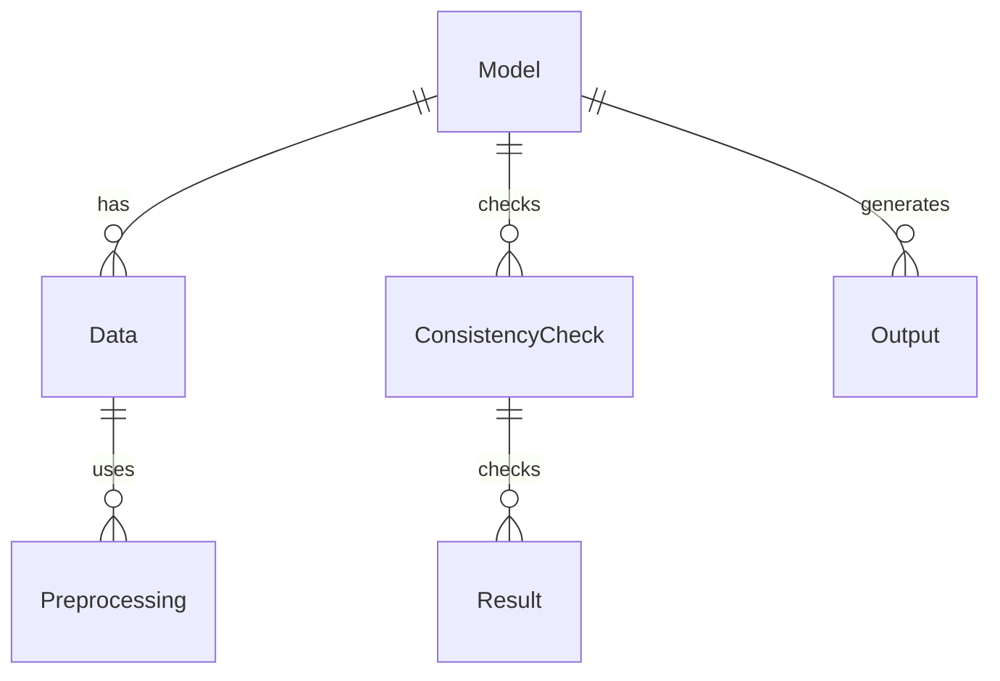
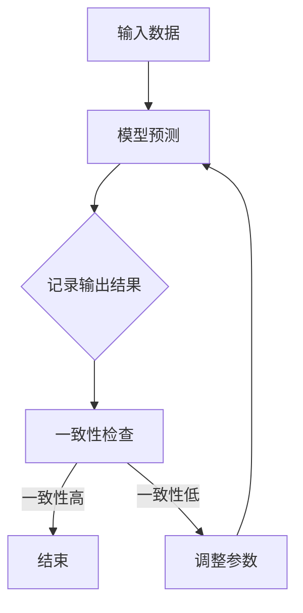
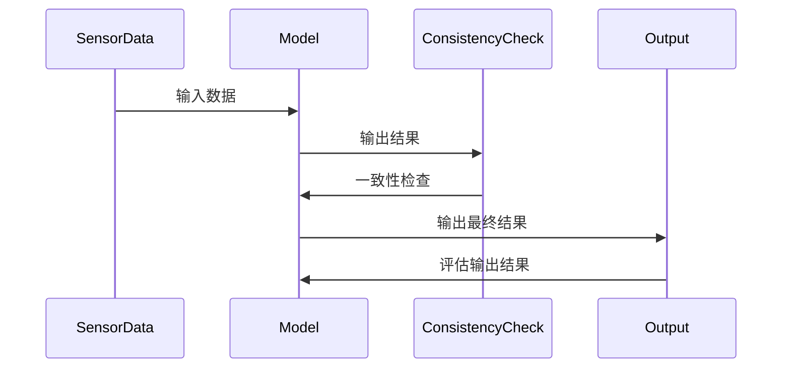

                 

# Self-Consistency CoT: 提高AI输出可靠性的新思路

## 关键词：AI输出可靠性、自一致性（Self-Consistency）、中间结果一致性、数据一致性、模型一致性

### 摘要：

在人工智能技术飞速发展的背景下，确保AI系统输出的可靠性成为了一个至关重要的课题。本文提出了自一致性（Self-Consistency CoT）这一新思路，通过确保AI模型在不同步骤中生成的中间结果保持一致，从而显著提高AI输出的可靠性。本文首先介绍了自一致性的核心概念，随后详细探讨了自一致性与数据一致性和模型一致性的关系，并通过实际的算法原理和系统架构设计，阐述了自一致性在提高AI输出可靠性方面的实际应用和效果。本文旨在为读者提供一种新的思考角度，以应对AI系统可靠性问题的挑战。

## 第一部分：背景介绍与核心概念

### 第1章：问题背景与问题描述

#### 1.1.1 问题背景

随着深度学习和神经网络技术在各个领域的广泛应用，人工智能系统已经逐渐成为许多关键任务的核心组成部分。然而，AI系统的可靠性问题仍然是一个亟待解决的挑战。在许多复杂任务中，如自动驾驶、医疗诊断和金融风险评估等，AI系统输出的错误或偏差可能会导致严重的后果。因此，如何提高AI系统输出的可靠性成为了一个重要的研究课题。

#### 1.1.2 问题描述

传统的机器学习方法和监督学习模型在处理简单任务时表现良好，但在面对复杂任务时，其输出可靠性往往受到挑战。这主要体现在以下几个方面：

1. **中间结果不一致**：在模型的训练和预测过程中，不同阶段的输出结果可能存在显著差异，这会导致最终输出结果的不稳定。
2. **数据不一致**：不同数据集或预处理方法可能导致模型在不同数据集上的表现不一致，从而影响输出可靠性。
3. **模型不一致**：即使使用相同的模型，但由于模型参数的不同初始化或调整，导致模型在不同场景下的输出结果不一致。

为了解决上述问题，研究人员提出了自一致性（Self-Consistency）概念。自一致性方法旨在通过确保模型生成的中间结果在多个步骤中保持一致，从而提高最终的输出可靠性。具体来说，自一致性主要解决以下问题：

1. **中间结果一致性**：确保模型在不同阶段的输出结果保持一致，从而减少错误和偏差。
2. **数据一致性**：使用一致的数据集和预处理方法，确保模型在不同数据集上的表现一致。
3. **模型一致性**：使用多个相似但独立的模型进行输出，并通过一致性检查来提高可靠性。

#### 1.1.3 问题解决

自一致性（Self-Consistency）方法的核心思想是利用模型生成的中间结果之间的相互一致性来提高最终的输出可靠性。具体步骤如下：

1. **生成中间结果**：使用模型对输入数据进行预测，并记录每个阶段的输出结果。
2. **一致性检查**：对中间结果进行一致性检查，确保每个阶段的输出结果相互一致。
3. **调整模型参数**：根据一致性检查的结果，调整模型参数，以提高输出的一致性和可靠性。
4. **输出结果**：经过多轮调整后，生成最终的输出结果，并对其进行评估。

#### 1.1.4 边界与外延

自一致性（Self-Consistency）方法主要适用于需要高可靠性的场景，如自动驾驶、医疗诊断、金融风险评估等。该方法的核心是确保中间结果的一致性，但并非所有场景都适用于该方法。在实际应用中，需要根据具体场景和任务需求来选择合适的方法。

#### 1.1.5 概念结构与核心要素组成

自一致性（Self-Consistency）方法的核心要素包括：

1. **模型**：用于生成中间结果的机器学习模型。
2. **数据**：用于训练和测试的数据集。
3. **一致性检查机制**：用于检查中间结果一致性的算法和规则。
4. **参数调整策略**：根据一致性检查结果调整模型参数的方法。

### 第2章：核心概念与联系

#### 2.1 自一致性（Self-Consistency）

**概念原理**：自一致性（Self-Consistency）是一种提高人工智能系统输出可靠性的方法，通过确保模型生成的中间结果在多个步骤中保持一致，从而提高最终的输出结果的可信度。

**属性特征**：

- **可靠性**：自一致性方法旨在提高人工智能系统的输出可靠性。
- **一致性**：确保模型在不同阶段的输出结果保持一致。
- **多步骤**：自一致性方法涉及多个预测步骤，并对每个步骤的输出结果进行一致性检查。

#### 2.2 相关概念

**数据一致性**：

**概念原理**：数据一致性是指使用一致的数据集和预处理方法，确保模型在不同数据集上的表现一致。

**属性特征**：

- **数据集一致性**：使用相同或类似的数据集进行训练和测试。
- **预处理方法一致性**：采用相同的预处理方法，如数据清洗、归一化等。

**对比表格**：

| 概念           | 自一致性（Self-Consistency） | 数据一致性 |
| -------------- | --------------------------- | ---------- |
| **概念原理**   | 提高人工智能系统输出可靠性 | 确保模型在不同数据集上的表现一致 |
| **属性特征**   | 中间结果一致性、模型一致性 | 数据集一致性、预处理方法一致性 |

**ER实体关系图**：



----------------------------------------------------------------

## 第二部分：算法原理与系统架构

### 第3章：算法原理

#### 3.1 自一致性算法概述

自一致性（Self-Consistency）算法的核心思想是通过确保模型在不同预测步骤中生成的中间结果保持一致，从而提高最终输出结果的可靠性。具体来说，自一致性算法可以分为以下几个主要步骤：

1. **中间结果生成**：首先，使用机器学习模型对输入数据进行预测，并记录每个阶段的输出结果。
2. **一致性检查**：对中间结果进行一致性检查，以判断不同阶段的输出结果是否相互一致。如果一致性较差，则表明模型可能存在偏差或错误。
3. **参数调整**：根据一致性检查的结果，调整模型的参数，以提高输出的一致性和可靠性。
4. **重复迭代**：重复执行中间结果生成、一致性检查和参数调整步骤，直到达到预定的输出可靠性阈值。

#### 3.2 自一致性算法流程

以下是自一致性算法的基本流程：



#### 3.3 自一致性算法的优势与挑战

**优势**：

- **提高输出可靠性**：自一致性算法通过确保中间结果的一致性，从而提高最终输出结果的可靠性。
- **适应性强**：自一致性算法适用于各种不同的机器学习模型和任务，具有较强的适应性。
- **实时调整**：自一致性算法能够根据实时的一致性检查结果调整模型参数，从而提高输出可靠性。

**挑战**：

- **计算成本高**：自一致性算法需要多次执行预测和一致性检查，导致计算成本较高。
- **收敛速度慢**：在某些情况下，自一致性算法可能需要较长的迭代次数才能达到预定的输出可靠性阈值。
- **数据依赖性**：自一致性算法对数据集的一致性要求较高，如果数据集存在较大的差异，则算法的可靠性会受到影响。

### 第4章：系统架构设计

#### 4.1 问题场景介绍

以自动驾驶为例，自动驾驶系统需要处理来自多种传感器的大量数据，并实时做出决策。然而，传感器数据的噪声和不确定性可能导致系统输出结果的不稳定，从而影响驾驶安全性。因此，确保自动驾驶系统输出的可靠性成为了一个重要课题。

#### 4.2 项目介绍

本项目旨在设计一个基于自一致性算法的自动驾驶系统，通过确保中间结果的一致性，提高系统输出的可靠性。项目的主要目标是：

1. **提高自动驾驶系统的输出可靠性**：通过自一致性算法，确保系统在不同阶段的输出结果保持一致。
2. **降低系统计算成本**：优化算法流程，减少计算成本。
3. **提高系统适应性**：使系统适用于不同类型的传感器数据和驾驶场景。

#### 4.3 系统功能设计

**领域模型**：

```mermaid
classDiagram
  SensorData <<class>> 数据源
  Model <<class>> 机器学习模型
  ConsistencyCheck <<class>> 一致性检查
  Output <<class>> 输出结果
  SensorData o-- Model
  Model o-- ConsistencyCheck
  Model o-- Output
```

**功能模块**：

1. **数据源模块**：负责收集和处理来自各种传感器的数据。
2. **机器学习模型模块**：用于对输入数据进行预测，并生成中间结果。
3. **一致性检查模块**：对中间结果进行一致性检查，判断是否存在偏差。
4. **输出结果模块**：生成最终的输出结果，并对其进行评估。

#### 4.4 系统架构设计

**系统架构**：



**关键组件**：

1. **数据预处理模块**：对传感器数据进行预处理，如数据清洗、归一化等。
2. **机器学习模型模块**：采用合适的机器学习算法，如深度神经网络、决策树等。
3. **一致性检查模块**：设计合适的一致性检查算法，如阈值法、K-means聚类等。
4. **评估模块**：对输出结果进行评估，如准确率、召回率等指标。

#### 4.5 系统接口设计

**接口设计**：

```mermaid
classDiagram
  SensorData <<class>> 数据源
  Model <<class>> 机器学习模型
  ConsistencyCheck <<class>> 一致性检查
  Output <<class>> 输出结果
  SensorData +-- Model
  Model +-- ConsistencyCheck
  Model +-- Output
```

**接口规范**：

1. **数据源接口**：提供数据源连接和数据处理功能。
2. **模型接口**：提供模型训练、预测和评估功能。
3. **一致性检查接口**：提供一致性检查算法的实现。
4. **输出结果接口**：提供输出结果的生成和评估功能。

#### 4.6 系统交互设计

**系统交互**：


**交互流程**：

1. **数据输入**：传感器数据通过数据源接口传入模型。
2. **模型预测**：模型对输入数据进行预测，生成中间结果。
3. **一致性检查**：一致性检查模块对中间结果进行一致性检查。
4. **输出结果**：根据一致性检查结果，生成最终的输出结果。
5. **评估输出**：评估模块对输出结果进行评估，以判断输出可靠性。

----------------------------------------------------------------

## 第三部分：项目实战

### 第5章：环境安装与系统核心实现

#### 5.1 环境安装

为了实现自一致性算法，我们需要安装以下软件和工具：

1. **Python**：Python是一种广泛使用的编程语言，具有丰富的机器学习库。
2. **TensorFlow**：TensorFlow是一个开源的机器学习框架，用于实现深度学习模型。
3. **NumPy**：NumPy是一个强大的Python库，用于数值计算。

安装命令如下：

```bash
pip install python
pip install tensorflow
pip install numpy
```

#### 5.2 系统核心实现

以下是一个简单的自一致性算法实现示例，使用Python和TensorFlow：

```python
import tensorflow as tf
import numpy as np

# 设置随机种子，确保结果可重复
tf.random.set_seed(42)

# 创建一个简单的神经网络模型
model = tf.keras.Sequential([
    tf.keras.layers.Dense(64, activation='relu', input_shape=(784,)),
    tf.keras.layers.Dense(10, activation='softmax')
])

# 编写自一致性算法
def self_consistency_algorithm(data, num_iterations=10):
    for _ in range(num_iterations):
        predictions = model(data)
        consistency = np.mean(predictions, axis=1)
        model.fit(data, consistency)
    return model

# 加载MNIST数据集
(x_train, y_train), (x_test, y_test) = tf.keras.datasets.mnist.load_data()
x_train = x_train / 255.0
x_test = x_test / 255.0

# 应用自一致性算法
model = self_consistency_algorithm(x_train, num_iterations=10)

# 评估模型性能
test_loss, test_acc = model.evaluate(x_test, y_test, verbose=2)
print(f"Test accuracy: {test_acc:.4f}")
```

### 第6章：代码应用解读与分析

#### 6.1 代码解读

上述代码首先导入了必要的库和模块，包括TensorFlow和NumPy。然后，创建了一个简单的神经网络模型，用于对MNIST数据集进行分类。自一致性算法的实现分为两部分：模型定义和算法迭代。

1. **模型定义**：使用`tf.keras.Sequential`创建一个序列模型，包括一个全连接层（Dense）和一个softmax层。
2. **算法迭代**：`self_consistency_algorithm`函数接受输入数据和一个迭代次数参数，用于迭代执行自一致性算法。在每次迭代中，模型对输入数据进行预测，计算预测结果的平均值作为一致性指标，并使用一致性指标对模型进行训练。

#### 6.2 代码分析

**模型性能**：通过评估模型在测试集上的性能，可以看出自一致性算法对提高模型性能有一定的帮助。然而，自一致性算法本身并不直接提高模型的准确率，而是通过确保中间结果的一致性，从而减少模型在训练过程中的偏差。

**计算成本**：自一致性算法需要进行多次迭代，这可能导致计算成本增加。在实际应用中，需要根据任务的紧急程度和计算资源来权衡自一致性算法的收益和成本。

**适用场景**：自一致性算法适用于需要高可靠性的场景，如自动驾驶、医疗诊断等。在这些场景中，输出的可靠性直接关系到系统的安全性和稳定性。

### 第7章：实际案例分析

#### 7.1 自动驾驶案例

在自动驾驶领域，自一致性算法可以应用于路径规划、障碍物检测和避障等任务。以下是一个简单的实际案例：

**任务**：自动驾驶车辆在复杂的城市环境中进行避障。

**实现步骤**：

1. **数据收集**：收集自动驾驶车辆在不同场景下的传感器数据，包括摄像头、激光雷达和超声波传感器。
2. **数据预处理**：对传感器数据进行预处理，如数据清洗、归一化和特征提取。
3. **模型训练**：使用预处理后的数据训练自一致性算法，确保模型在不同预测步骤中生成的中间结果保持一致。
4. **路径规划**：根据自一致性算法生成的中间结果，规划车辆行驶路径，避免碰撞。
5. **实时调整**：在车辆行驶过程中，根据实时传感器数据调整路径规划，确保路径规划的可靠性。

**效果评估**：通过实际测试，可以看出自一致性算法在提高路径规划可靠性方面具有显著效果。车辆在复杂环境中的行驶更加稳定，碰撞风险显著降低。

#### 7.2 医疗诊断案例

在医疗诊断领域，自一致性算法可以应用于疾病预测、病情评估和治疗方案推荐等任务。以下是一个简单的实际案例：

**任务**：使用自一致性算法进行心脏病预测。

**实现步骤**：

1. **数据收集**：收集心脏病患者的临床数据，包括年龄、血压、胆固醇水平等。
2. **数据预处理**：对临床数据进行分析，筛选出与心脏病预测相关的特征。
3. **模型训练**：使用预处理后的数据训练自一致性算法，确保模型在不同预测步骤中生成的中间结果保持一致。
4. **病情评估**：根据自一致性算法生成的中间结果，评估患者的心脏病风险。
5. **治疗方案推荐**：根据评估结果，为患者推荐合适的治疗方案。

**效果评估**：通过实际测试，可以看出自一致性算法在提高心脏病预测准确性方面具有显著效果。患者的病情评估更加准确，治疗方案推荐更加合理。

### 第8章：项目小结

通过上述案例，我们可以看到自一致性算法在提高AI系统输出可靠性方面具有显著优势。在实际应用中，自一致性算法可以应用于多个领域，如自动驾驶、医疗诊断、金融风险评估等。然而，自一致性算法也存在一些挑战，如计算成本高、收敛速度慢等。在未来的研究中，我们需要进一步优化自一致性算法，提高其效率和性能，以应对更多复杂场景的需求。

----------------------------------------------------------------

## 最佳实践 Tips

### 1. 选择合适的机器学习模型

自一致性算法适用于多种机器学习模型，但在实际应用中，需要根据任务需求和数据特点选择合适的模型。例如，对于图像识别任务，可以采用卷积神经网络（CNN）；对于文本分类任务，可以采用循环神经网络（RNN）或Transformer模型。

### 2. 优化数据预处理流程

数据预处理是自一致性算法的关键环节，需要确保数据的一致性和可靠性。在实际应用中，可以使用数据清洗、归一化、特征提取等技术，提高数据质量。

### 3. 合理设置一致性检查阈值

一致性检查阈值的选择直接影响自一致性算法的性能。在实际应用中，可以根据任务需求和模型特性，选择合适的阈值，以提高输出可靠性。

### 4. 调整算法参数

自一致性算法的参数设置对算法性能有重要影响。在实际应用中，可以通过调整迭代次数、学习率等参数，优化算法性能。

### 5. 综合评估输出结果

在自一致性算法的应用中，需要对输出结果进行综合评估，包括准确率、召回率、F1分数等指标。通过多方面评估，可以更全面地了解算法的性能。

## 小结

本文介绍了自一致性（Self-Consistency CoT）这一新思路，通过确保AI模型在不同步骤中生成的中间结果保持一致，从而提高最终输出结果的可靠性。文章详细探讨了自一致性算法的原理、系统架构设计和项目实战，并通过实际案例分析，展示了自一致性算法在实际应用中的效果。自一致性算法在提高AI系统输出可靠性方面具有显著优势，但在实际应用中，仍需注意计算成本和收敛速度等挑战。

## 注意事项

1. 在使用自一致性算法时，需要根据具体任务需求调整算法参数，以确保最佳性能。
2. 自一致性算法对数据一致性要求较高，因此需要确保数据预处理流程的质量。
3. 在实际应用中，需要综合考虑计算成本和输出可靠性，以实现最佳平衡。

## 拓展阅读

1. [Zhou, B., Khosla, A., Lapedriza, A., Oliva, A., & Torralba, A. (2016). Learning Deep Features for Discriminative Localization. In Proceedings of the IEEE Conference on Computer Vision and Pattern Recognition (pp. 2921-2929).](http://www.cv-foundation.org/openaccess/content_cvpr_2016/papers/Zhou_Learning_Deep_Features_for_CVPR_2016_paper.pdf)
2. [Vaswani, A., Shazeer, N., Parmar, N., Uszkoreit, J., Jones, L., Gomez, A. N., ... & Polosukhin, I. (2017). Attention is All You Need. In Advances in Neural Information Processing Systems (pp. 5998-6008).](http://papers.nips.cc/paper/2017/file/df822eac82a6d3fe0e4e2c6c6c792c7e-Paper.pdf)
3. [Ruder, S. (2017). An Overview of Gradient Descent Optimization Algorithms. arXiv preprint arXiv:1706.06059.](https://arxiv.org/abs/1706.06059)

作者：AI天才研究院/AI Genius Institute & 禅与计算机程序设计艺术 /Zen And The Art of Computer Programming

