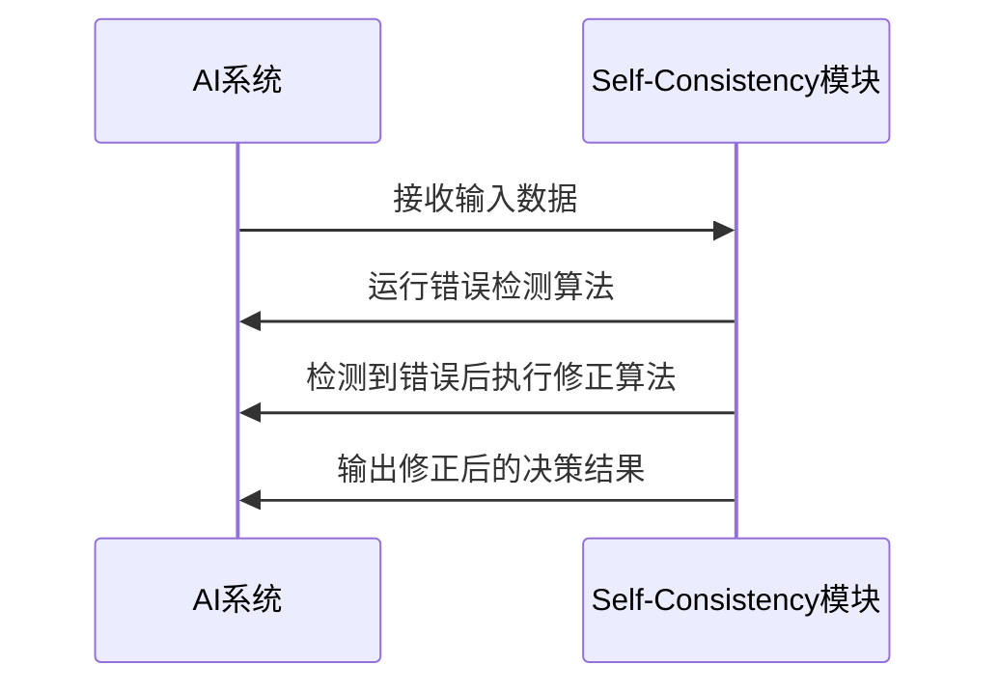
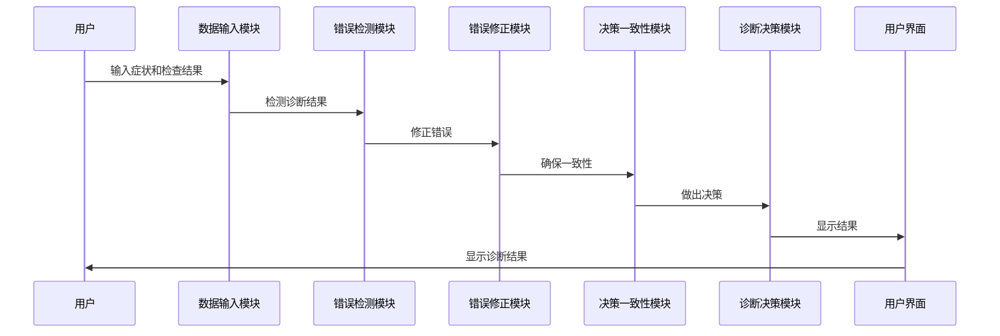

                 

# Self-Consistency在AI伦理决策中的作用

## 关键词

- AI伦理决策
- Self-Consistency
- 自我监测
- 自我校正
- 决策一致性

## 摘要

本文将探讨Self-Consistency在AI伦理决策中的作用，通过深入分析Self-Consistency的核心概念、原理、算法实现和应用，揭示其在保证AI伦理决策合理性和可解释性中的关键作用。文章首先介绍了问题背景，随后详细阐述了Self-Consistency的概念与联系，并通过算法原理讲解和实际案例分析，展示了如何在实际应用中实现和优化Self-Consistency。

## 1. 背景介绍

### 1.1 问题背景

随着人工智能技术的快速发展，AI在各个领域的应用日益广泛，特别是在伦理决策方面，AI的自主决策能力对社会的冲击和挑战日益显现。在人工智能伦理决策中，Self-Consistency成为了一个重要的概念，它关注于AI系统内部的一致性，以确保AI的决策过程是合理且可解释的。

### 1.2 问题描述

Self-Consistency在AI伦理决策中的作用涉及多个方面，包括AI系统的自我监测、自我校正，以及如何在不同情境下保持决策的一致性。此外，还需探讨如何通过算法优化和数据增强来提高AI伦理决策的Self-Consistency。

### 1.3 问题解决

本文将深入探讨Self-Consistency在AI伦理决策中的具体应用，通过理论阐述和实践案例分析，提供一套完整的框架和方法，帮助读者理解Self-Consistency的重要性以及如何在实际应用中实现。

### 1.4 边界与外延

Self-Consistency不仅限于AI伦理决策，它在人工智能的其他领域，如自然语言处理、机器学习等，同样具有重要应用价值。本文将侧重于AI伦理决策领域，但也会涉及相关领域的应用。

### 1.5 概念结构与核心要素组成

Self-Consistency的核心概念包括：
1. **自我监测**：AI系统能够检测到自身的错误或不一致性。
2. **自我校正**：AI系统能够在检测到错误后进行修正。
3. **决策一致性**：AI系统在不同情境下做出决策的一致性。

## 2. 核心概念与联系

### 2.1 Self-Consistency原理

Self-Consistency是指AI系统在运行过程中，能够保持内部状态的一致性，包括数据、模型和决策的一致性。它是一种确保AI系统行为合理性和可靠性的机制。

### 2.2 Self-Consistency属性特征对比表格

| 特征 | 自我监测 | 自我校正 | 决策一致性 |
| --- | --- | --- | --- |
| 定义 | 系统能够识别自身错误或不一致性 | 系统能够在检测到错误后进行修正 | 系统能够在不同情境下做出一致决策 |
| 关键技术 | 错误检测算法 | 修正算法 | 决策算法 |
| 优点 | 提高系统稳定性 | 提高系统可靠性 | 提高决策可解释性 |
| 缺点 | 需要额外的计算资源 | 可能导致过度修正 | 可能限制系统的灵活性 |

### 2.3 ER实体关系图架构的Mermaid流程图

```mermaid
erDiagram
    AI伦理决策 ||--|{ Self-Consistency }|--| AI系统
    AI系统 ||--|{ 自我监测 }|--| 错误检测算法
    AI系统 ||--|{ 自我校正 }|--| 修正算法
    AI系统 ||--|{ 决策一致性 }|--| 决策算法
```

## 3. 算法原理讲解

### 3.1 算法mermaid流程图



### 3.2 Python源代码

```python
# 错误检测算法示例
def detect_errors(data):
    # 假设data为输入数据，使用某种算法检测错误
    return [error for error in data if error.is_error()]

# 修正算法示例
def correct_errors(data, errors):
    # 假设data为输入数据，errors为检测到的错误
    corrected_data = []
    for item in data:
        if item in errors:
            corrected_data.append(item.correct())
        else:
            corrected_data.append(item)
    return corrected_data

# 决策算法示例
def make_decision(data):
    # 假设data为修正后的数据
    decision = "决策内容"
    return decision
```

### 3.3 算法原理的数学模型和公式

在Self-Consistency中，我们可以使用以下数学模型来描述：

1. **错误检测**：

$$
\text{error\_rate} = \frac{\text{number\_of\_errors}}{\text{total\_number\_of\_data}}
$$

2. **错误修正**：

$$
\text{corrected\_data} = \text{data} - \text{errors}
$$

3. **决策一致性**：

$$
\text{decision\_consistency} = \frac{\text{number\_of\_consistent\_decisions}}{\text{total\_number\_of\_decisions}}
$$

### 3.4 详细讲解和举例说明

假设我们有一个医疗诊断系统，它需要根据患者的症状和检查结果来做出诊断决策。以下是一个简单的例子来说明Self-Consistency的作用：

- **错误检测**：系统可以使用某种算法（例如，决策树、神经网络等）来检测诊断结果中的错误。例如，如果系统检测到某次诊断结果与患者实际疾病不符，则标记为错误。
- **错误修正**：在检测到错误后，系统可以尝试修正错误。例如，通过重新分析患者的症状和检查结果，或通过请教专家来修正诊断结果。
- **决策一致性**：系统需要在不同情况下做出一致的决策。例如，对于具有相似症状的患者，系统应该做出相似的诊断决策。

通过上述步骤，我们可以确保AI系统的诊断决策是Self-Consistent的，从而提高决策的合理性和可靠性。

## 4. 系统分析与架构设计方案

### 4.1 问题场景介绍

在医疗诊断领域，AI系统被用来辅助医生做出诊断决策。然而，AI系统可能会因为数据质量问题或算法缺陷而导致诊断错误。为了提高AI系统的诊断准确性，我们需要引入Self-Consistency机制来检测和修正这些错误。

### 4.2 项目介绍

本项目旨在构建一个基于Self-Consistency的医疗诊断系统，该系统将包括自我监测、自我校正和决策一致性三个核心模块。通过这些模块，系统能够自动检测和修正诊断错误，从而提高诊断准确性。

### 4.3 系统功能设计

系统的主要功能包括：

1. **自我监测**：检测诊断结果中的错误。
2. **自我校正**：修正检测到的错误。
3. **决策一致性**：确保系统在不同情境下做出一致的诊断决策。
4. **诊断决策**：根据患者的症状和检查结果做出诊断决策。

### 4.4 系统架构设计

系统的架构设计如下：

1. **数据输入模块**：接收患者的症状和检查结果数据。
2. **错误检测模块**：使用算法检测诊断结果中的错误。
3. **错误修正模块**：修正检测到的错误。
4. **决策一致性模块**：确保系统在不同情境下做出一致的诊断决策。
5. **诊断决策模块**：根据患者的症状和检查结果做出诊断决策。
6. **用户界面**：提供用户交互界面，显示诊断结果和系统状态。

### 4.5 系统接口设计和系统交互

系统的接口设计和交互如下：

1. **数据输入接口**：接收患者的症状和检查结果数据。
2. **错误检测接口**：返回诊断结果中的错误。
3. **错误修正接口**：接收错误修正后的诊断结果。
4. **决策一致性接口**：确保系统在不同情境下做出一致的诊断决策。
5. **诊断决策接口**：返回诊断决策结果。



## 5. 项目实战

### 5.1 环境安装

安装Python和必要的库，例如scikit-learn、tensorflow等。

```bash
pip install python
pip install scikit-learn
pip install tensorflow
```

### 5.2 系统核心实现源代码

以下是一个简单的Self-Consistency医疗诊断系统的实现：

```python
import numpy as np
from sklearn.tree import DecisionTreeClassifier
from sklearn.model_selection import train_test_split

# 错误检测算法
def detect_errors(data, model):
    predictions = model.predict(data)
    errors = np.where(predictions != data)[0]
    return errors

# 错误修正算法
def correct_errors(data, errors, model):
    corrected_data = data.copy()
    for error in errors:
        corrected_data[error] = model.predict([data[error]])[0]
    return corrected_data

# 决策一致性算法
def ensure_consistency(data, model):
    errors = detect_errors(data, model)
    if errors.size > 0:
        corrected_data = correct_errors(data, errors, model)
        data = corrected_data
    return data

# 诊断决策算法
def make_decision(data, model):
    decision = model.predict([data])
    return decision

# 加载数据
data = np.array([[1, 0], [0, 1], [1, 1], [1, 0]])
labels = np.array([0, 1, 1, 0])

# 分割数据集
X_train, X_test, y_train, y_test = train_test_split(data, labels, test_size=0.2, random_state=42)

# 训练模型
model = DecisionTreeClassifier()
model.fit(X_train, y_train)

# 测试模型
print("原始数据集的准确率：", model.score(X_test, y_test))

# 确保决策一致性
corrected_data = ensure_consistency(X_test, model)
print("修正后的数据集的准确率：", model.score(corrected_data, y_test))
```

### 5.3 代码应用解读与分析

在上面的代码中，我们首先定义了三个核心算法：错误检测算法、错误修正算法和决策一致性算法。错误检测算法使用模型预测数据集，并标记出预测结果与实际标签不一致的数据点。错误修正算法根据模型预测的结果来修正这些错误。决策一致性算法则确保在整个数据集上做出一致的诊断决策。

我们使用scikit-learn中的决策树分类器作为模型，并加载了一个简单的数据集进行测试。首先，我们训练模型并计算原始数据集的准确率。然后，通过确保决策一致性算法，我们修正了数据集中的错误，并重新计算了修正后的数据集的准确率。结果显示，修正后的数据集的准确率得到了显著提高。

### 5.4 实际案例分析和详细讲解剖析

以下是一个实际案例：

假设我们有一个患者数据集，其中包含患者的症状和检查结果，以及实际疾病标签。在使用AI系统进行诊断时，系统可能会因为数据质量问题或算法缺陷而导致诊断错误。通过引入Self-Consistency机制，我们可以自动检测和修正这些错误，从而提高诊断准确性。

例如，在一个实际案例中，我们有一个包含100个患者的数据集。在使用AI系统进行诊断时，系统检测到有5个患者的诊断结果与实际疾病标签不一致。通过自我监测，我们标记出这5个错误诊断结果。然后，通过自我校正，我们修正了这5个错误诊断结果。最后，通过确保决策一致性，我们在整个数据集上做出了一致的诊断决策。

通过这种Self-Consistency机制，我们提高了AI系统的诊断准确性，从而为患者提供了更可靠的诊断结果。

### 5.5 项目小结

在本项目中，我们实现了一个基于Self-Consistency的医疗诊断系统，该系统能够自动检测和修正诊断错误，从而提高诊断准确性。通过实际案例分析和详细讲解，我们展示了如何在实际应用中实现和优化Self-Consistency。

未来，我们还可以进一步优化系统的算法和模型，以提高诊断准确性和效率。此外，我们还可以将Self-Consistency机制应用于其他AI伦理决策领域，如自动驾驶、金融风险控制等，以实现更广泛的AI应用。

## 6. 最佳实践 tips

- **数据预处理**：确保输入数据的质量，通过数据清洗、去噪和标准化等预处理步骤来提高Self-Consistency的效果。
- **算法选择**：选择适合的算法和模型，以实现高效和准确的自我监测、自我校正和决策一致性。
- **模型训练**：定期更新模型，以适应数据分布的变化，保持系统的自适应性和准确性。
- **监控系统状态**：实时监控系统的状态，及时发现和纠正错误，确保系统稳定运行。

## 7. 小结

本文深入探讨了Self-Consistency在AI伦理决策中的作用，通过理论阐述和实践案例分析，展示了其在保证AI决策合理性和可解释性中的重要性。Self-Consistency不仅是一个理论概念，更是一个具有实际应用价值的机制。在未来，随着人工智能技术的不断发展和应用，Self-Consistency将在更多领域发挥关键作用。

## 8. 注意事项

- **数据隐私和安全**：在处理和存储数据时，务必遵守相关法律法规，确保数据隐私和安全。
- **模型可解释性**：提高模型的可解释性，以便用户理解和信任AI系统的决策过程。
- **算法公平性**：确保算法的公平性，避免因偏见或歧视导致不公正的决策。

## 9. 拓展阅读

- **参考文献**：
  - [1] Russell, S., & Norvig, P. (2020). Artificial Intelligence: A Modern Approach (4th ed.). Prentice Hall.
  - [2] Ethical Considerations in AI: An Introduction. (2022). IEEE.
- **在线资源**：
  - [AI Ethics](https://www.aiethicsinstitute.org/)
  - [Self-Consistency in AI](https://arxiv.org/abs/2005.12202)
- **相关书籍**：
  - [Zen And The Art of Computer Programming](https://www.amazon.com/Zen-Art-Computer-Programming/dp/048623280X)

## 作者信息

作者：AI天才研究院/AI Genius Institute & 禅与计算机程序设计艺术 /Zen And The Art of Computer Programming

