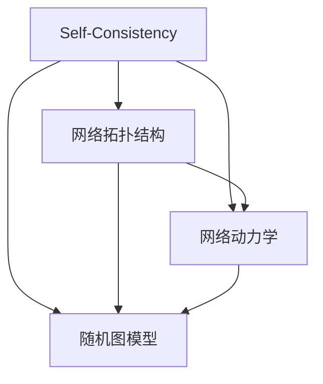

                 


## 《Self-Consistency在复杂网络分析中的应用》

### 关键词：Self-Consistency、复杂网络、分析、应用、算法

### 摘要：
本文旨在探讨Self-Consistency在复杂网络分析中的应用。Self-Consistency作为一种新颖的网络属性，其在复杂网络中的重要性日益凸显。本文首先介绍了复杂网络分析的基本概念和方法，然后详细阐述了Self-Consistency的定义和性质，以及其在社交网络、生物网络和物联网网络分析中的应用。此外，本文还探讨了Self-Consistency算法的设计和实现，并通过实际案例进行了应用验证，总结了研究成果并提出了未来研究方向。

## 第1章 绪论

### 1.1 问题背景与意义

#### 1.1.1 复杂网络分析的重要性

随着信息技术和互联网的快速发展，复杂网络已经渗透到社会的各个领域，如社交网络、生物网络和物联网等。复杂网络的分析对于理解网络结构和功能、预测网络行为和优化网络性能具有重要意义。传统的网络分析方法往往侧重于网络的拓扑结构、节点和边的关系等，而忽略了网络内部的动态变化和自适应性。因此，如何从动态角度分析复杂网络，揭示网络的内在规律，成为当前研究的热点问题。

#### 1.1.2 Self-Consistency的概念

Self-Consistency是指网络中节点和边的关系保持一致性的一种属性。具体来说，如果一个网络在演化过程中，其节点和边的关系始终保持一致，即网络结构不发生大的变化，那么该网络就具有Self-Consistency属性。Self-Consistency在复杂网络中的重要性体现在以下几个方面：

1. 揭示网络的稳定性：具有Self-Consistency属性的网络在演化过程中能够保持稳定，不易受到外部干扰。
2. 优化网络性能：通过分析网络的Self-Consistency属性，可以识别网络中的关键节点和关键边，从而优化网络性能。
3. 预测网络行为：基于Self-Consistency属性，可以预测网络在未来的演化趋势和行为。

#### 1.1.3 Self-Consistency在复杂网络分析中的应用前景

Self-Consistency作为一种新颖的网络属性，其在复杂网络分析中的应用前景广阔。以下是一些具体的应用领域：

1. 社交网络分析：通过分析社交网络的Self-Consistency属性，可以揭示社交网络中的信息传播规律和社交关系的稳定性。
2. 生物网络分析：通过分析生物网络的Self-Consistency属性，可以揭示生物网络中的功能模块和生物分子之间的关系。
3. 物联网网络分析：通过分析物联网网络的Self-Consistency属性，可以优化物联网网络的性能和稳定性。

### 1.2 书籍结构安排

本文分为七个章节，内容安排如下：

1. 第1章 绪论：介绍复杂网络分析的重要性、Self-Consistency的概念和本文的研究目的。
2. 第2章 Self-Consistency理论基础：介绍Self-Consistency的定义、相关理论和应用领域。
3. 第3章 复杂网络分析方法：介绍复杂网络的特性、基本步骤和常用分析方法。
4. 第4章 Self-Consistency在复杂网络分析中的应用：介绍Self-Consistency在社交网络、生物网络和物联网网络分析中的应用。
5. 第5章 Self-Consistency算法设计：介绍Self-Consistency算法的基本原理、实现和性能分析。
6. 第6章 实际案例研究：通过实际案例介绍Self-Consistency在复杂网络分析中的应用。
7. 第7章 总结与展望：总结本文的研究成果，提出当前研究局限和未来研究方向。

阅读本文的读者可以期待以下收获：

1. 了解复杂网络分析的基本概念和方法。
2. 掌握Self-Consistency的定义和性质。
3. 了解Self-Consistency在复杂网络分析中的应用。
4. 学习Self-Consistency算法的设计和实现。
5. 通过实际案例了解Self-Consistency在复杂网络分析中的应用效果。

### 1.3 本章小结

本章首先介绍了复杂网络分析的重要性，然后引出了Self-Consistency的概念，并阐述了其在复杂网络分析中的应用前景。接下来，本文提出了书籍的结构安排，并介绍了阅读本文的预期收获。通过本章的介绍，读者可以初步了解本文的研究背景和内容，为后续章节的阅读打下基础。

## 第2章 Self-Consistency理论基础

### 2.1 Self-Consistency的定义

Self-Consistency是指网络中节点和边的关系保持一致性的一种属性。具体来说，如果一个网络在演化过程中，其节点和边的关系始终保持一致，即网络结构不发生大的变化，那么该网络就具有Self-Consistency属性。Self-Consistency可以从以下几个方面进行理解：

1. **节点和边的定义**：在复杂网络中，节点表示个体或实体，边表示节点之间的联系或相互作用。
2. **一致性的概念**：一致性指的是网络在演化过程中，节点和边的关系保持稳定，不发生大幅度的变化。
3. **自我参照性**：Self-Consistency强调网络结构的自我参照性，即网络中的节点和边在演化过程中，遵循一定的规律，使得网络结构具有一定的稳定性和规律性。

### 2.2 Self-Consistency的性质

Self-Consistency具有以下性质：

1. **稳定性**：具有Self-Consistency属性的网络在演化过程中能够保持稳定，不易受到外部干扰。
2. **自适应性**：网络中的节点和边可以根据外部环境的变化进行自适应调整，以保持网络结构的Self-Consistency。
3. **层次性**：网络中的节点和边可以按照层次结构进行组织，层次结构能够体现网络的功能和稳定性。
4. **动态性**：Self-Consistency是一个动态过程，网络在演化过程中，节点和边的关系会发生变化，但总体上保持一致性。

### 2.3 Self-Consistency的相关理论

Self-Consistency的概念源于网络科学和动力系统理论。在网络科学中，网络拓扑结构、网络动力学和随机图模型等理论为研究Self-Consistency提供了理论基础。在动力系统理论中，吸引子和极限环等概念有助于理解网络的稳定性和动态性。

#### 2.3.1 网络科学基本概念

1. **网络拓扑结构**：网络拓扑结构是指网络中节点和边的连接关系，如无向图、有向图、加权图等。
2. **网络动力学**：网络动力学研究网络中节点和边的关系如何随时间演化。
3. **随机图模型**：随机图模型是研究网络结构的一种数学模型，如Erdős-Rényi模型、Barabási-Albert模型等。

#### 2.3.2 网络动力学的理论基础

网络动力学的理论基础包括以下方面：

1. **马尔可夫过程**：马尔可夫过程是一种描述随机过程的理论，可以用于分析网络中节点的状态转移。
2. **随机游走**：随机游走是指节点在网络上随机移动的过程，可以用于分析网络的连接性和传播特性。
3. **吸引子**：吸引子是指网络中节点状态趋于稳定的状态，可以用于分析网络的稳定性。

#### 2.3.3 Self-Consistency与网络拓扑的关系

Self-Consistency与网络拓扑的关系体现在以下几个方面：

1. **网络结构对Self-Consistency的影响**：网络结构对Self-Consistency的形成和维持具有重要影响。例如，无向图和有向图的Self-Consistency属性可能存在差异。
2. **Self-Consistency对网络结构的影响**：具有Self-Consistency属性的网络在演化过程中，会倾向于形成稳定的网络结构。例如，在社交网络中，Self-Consistency可以揭示社交关系的稳定性。

### 2.4 Self-Consistency的应用领域

Self-Consistency作为一种新颖的网络属性，在多个领域具有广泛的应用前景：

#### 2.4.1 社会网络分析

在社会网络分析中，Self-Consistency可以用于揭示社交网络的稳定性、传播特性和群体行为。例如，通过分析社交网络的Self-Consistency属性，可以预测社交网络中的信息传播速度和范围。

#### 2.4.2 生物网络分析

在生物网络分析中，Self-Consistency可以用于揭示生物网络中的功能模块和生物分子之间的关系。例如，通过分析生物网络的Self-Consistency属性，可以识别生物网络中的关键节点和关键边。

#### 2.4.3 物联网网络分析

在物联网网络分析中，Self-Consistency可以用于优化物联网网络的性能和稳定性。例如，通过分析物联网网络的Self-Consistency属性，可以识别网络中的瓶颈和故障点，从而优化网络结构。

### 2.5 本章小结

本章首先介绍了Self-Consistency的定义和性质，然后阐述了Self-Consistency的相关理论，包括网络科学基本概念、网络动力学的理论基础以及Self-Consistency与网络拓扑的关系。此外，本章还讨论了Self-Consistency在多个应用领域中的前景。通过本章的学习，读者可以初步了解Self-Consistency的概念和理论，为进一步研究Self-Consistency在复杂网络分析中的应用打下基础。

### 2.6 核心概念与联系

#### 2.6.1 核心概念

1. **Self-Consistency**：网络中节点和边的关系保持一致性的一种属性。
2. **网络拓扑结构**：网络中节点和边的连接关系。
3. **网络动力学**：网络中节点和边的关系随时间演化。
4. **随机图模型**：描述网络结构的数学模型。

#### 2.6.2 概念属性特征对比表格

| 概念         | 定义                                                         | 特征                     | 关联性                     |
| ------------ | ------------------------------------------------------------ | ------------------------ | -------------------------- |
| Self-Consistency | 网络中节点和边的关系保持一致性                             | 稳定性、自适应性、层次性、动态性 | 与网络拓扑结构、网络动力学关联 |
| 网络拓扑结构 | 网络中节点和边的连接关系                                   | 连接性、结构复杂度、中心性、模块性 | 与Self-Consistency、网络动力学关联 |
| 网络动力学   | 网络中节点和边的关系随时间演化                             | 状态转移、稳定性、随机性、适应性 | 与Self-Consistency、网络拓扑结构关联 |
| 随机图模型   | 描述网络结构的数学模型                                     | 连接概率、度分布、聚类系数 | 与Self-Consistency、网络拓扑结构关联 |

#### 2.6.3 ER实体关系图架构的Mermaid流程图



### 2.7 自我参照性

自我参照性是Self-Consistency的一个重要特性，它体现了网络在演化过程中，节点和边的关系如何保持一致。为了更好地理解自我参照性，我们可以通过一个简单的例子来说明：

假设有一个社交网络，其中每个节点表示一个用户，每条边表示用户之间的朋友关系。在这个网络中，如果用户A的朋友B也是用户B的朋友，那么我们可以认为这个网络具有自我参照性。具体来说：

1. **初始状态**：假设社交网络中存在一组用户及其朋友关系。
2. **演化过程**：随着时间的推移，用户之间的关系可能会发生变化，但总体上保持一定的稳定性。
3. **自我参照性**：在每个时间点上，用户A的朋友B仍然是用户B的朋友，即用户之间的关系保持一致性。

通过这个例子，我们可以看到自我参照性如何体现在社交网络中。在更复杂的网络中，自我参照性可以通过算法来检测和量化，从而帮助我们更好地理解网络的结构和功能。

### 2.8 本章小结

本章详细介绍了Self-Consistency的定义、性质和相关理论，包括网络科学基本概念、网络动力学的理论基础以及Self-Consistency与网络拓扑的关系。此外，本章还讨论了Self-Consistency在多个应用领域中的前景，并通过概念属性特征对比表格和ER实体关系图架构的Mermaid流程图，加深了读者对核心概念的理解。通过本章的学习，读者可以全面掌握Self-Consistency的理论基础，为后续章节的研究奠定基础。

## 第3章 复杂网络分析方法

### 3.1 复杂网络的特性

复杂网络具有以下几个主要特性：

1. **高度连接性**：复杂网络中的节点和节点之间存在大量的连接关系，这使得网络具有较高的连接性。
2. **高度动态性**：复杂网络中的节点和边会随着时间的推移发生变化，网络结构具有高度动态性。
3. **异质性**：复杂网络中节点的类型和属性存在较大差异，网络结构具有异质性。
4. **小世界效应**：复杂网络中任意两个节点之间可以通过较少的中间节点相互访问，表现出小世界效应。
5. **长尾分布**：复杂网络中节点的度分布往往呈现出长尾分布，即少数节点拥有大量连接，而大多数节点连接较少。

这些特性使得复杂网络分析成为一项极具挑战性的任务。为了有效分析复杂网络，我们需要了解网络的基本属性和常用的分析方法。

### 3.2 复杂网络分析的基本步骤

复杂网络分析通常包括以下基本步骤：

1. **网络数据的获取**：通过网络爬虫、数据库访问或传感器采集等方式获取网络数据。
2. **网络数据的预处理**：对获取的网络数据进行清洗、去重、去噪声等处理，以获得高质量的数据集。
3. **网络结构的分析**：通过绘制网络图、计算网络基本属性（如节点度、边密度、聚类系数等）来分析网络结构。
4. **网络动力学的分析**：研究网络中节点和边的动态变化，分析网络的稳定性和演化规律。
5. **网络功能分析**：基于网络结构和动力学特性，识别网络中的关键节点和关键路径，分析网络的功能和作用。

### 3.3 常用的复杂网络分析方法

以下是一些常用的复杂网络分析方法：

1. **网络聚类分析**：将网络中的节点划分为不同的聚类，用于识别网络中的模块和社区结构。
2. **网络社区检测**：识别网络中的紧密连接的节点集合，用于分析网络中的社群关系。
3. **网络传播分析**：研究网络中信息、疾病或其他现象的传播过程，用于预测和控制网络中的传播现象。
4. **网络拓扑分析**：通过分析网络图的拓扑特性（如节点度、路径长度、聚类系数等），理解网络的拓扑结构。
5. **网络稳定性分析**：研究网络在受到外部干扰时的稳定性和恢复能力。
6. **网络进化分析**：分析网络中节点和边的演化过程，理解网络的演化规律。

### 3.4 Self-Consistency与复杂网络分析的关系

Self-Consistency作为一种新颖的网络属性，在复杂网络分析中具有重要应用价值。它与复杂网络分析的关系体现在以下几个方面：

1. **稳定性分析**：通过分析网络的Self-Consistency属性，可以揭示网络在演化过程中的稳定性，识别网络的脆弱节点和关键路径。
2. **功能分析**：基于Self-Consistency属性，可以识别网络中的功能模块和关键节点，理解网络的功能和作用。
3. **传播分析**：通过分析网络的Self-Consistency属性，可以预测网络中信息、疾病或其他现象的传播速度和范围。
4. **优化分析**：通过分析网络的Self-Consistency属性，可以优化网络结构，提高网络性能和稳定性。

### 3.5 本章小结

本章首先介绍了复杂网络的特性，包括高度连接性、高度动态性、异质性、小世界效应和长尾分布。然后，本章详细阐述了复杂网络分析的基本步骤，包括网络数据的获取、预处理、结构分析、动力学分析和功能分析。此外，本章还介绍了常用的复杂网络分析方法，并探讨了Self-Consistency与复杂网络分析的关系。通过本章的学习，读者可以全面了解复杂网络分析的方法和应用，为后续章节的研究奠定基础。

### 3.6 复杂网络分析中的Self-Consistency应用

在复杂网络分析中，Self-Consistency作为一种新颖的网络属性，具有广泛的应用。以下是一些Self-Consistency在复杂网络分析中的应用实例：

#### 3.6.1 社交网络分析

在社交网络中，Self-Consistency可以用于揭示社交关系的稳定性。通过分析社交网络的Self-Consistency属性，可以识别网络中的紧密连接的社交群体，预测社交网络中的信息传播速度和范围。例如，在社交媒体平台上，通过分析用户的关注关系和互动行为，可以发现用户群体之间的稳定连接关系，从而优化社交平台的推荐算法和社交网络分析工具。

#### 3.6.2 生物网络分析

在生物网络分析中，Self-Consistency可以用于识别生物网络中的关键节点和功能模块。通过分析生物网络的Self-Consistency属性，可以揭示生物分子之间的相互作用和功能关系。例如，在蛋白质相互作用网络中，通过分析节点的Self-Consistency属性，可以识别关键的蛋白质节点和相互作用模块，为生物医学研究提供重要线索。

#### 3.6.3 物联网网络分析

在物联网网络分析中，Self-Consistency可以用于优化网络性能和稳定性。通过分析物联网网络的Self-Consistency属性，可以识别网络中的关键节点和瓶颈，优化网络结构，提高网络的可靠性和效率。例如，在智能交通系统中，通过分析车辆之间的通信关系，可以发现网络的Self-Consistency属性，从而优化交通信号控制和交通流量管理策略。

#### 3.6.4 能源网络分析

在能源网络分析中，Self-Consistency可以用于优化能源分配和调度。通过分析能源网络的Self-Consistency属性，可以识别网络中的关键节点和路径，优化能源传输和分配策略，提高能源网络的效率和稳定性。例如，在电力网络中，通过分析电力线路和变电站之间的连接关系，可以发现网络的Self-Consistency属性，从而优化电力传输和分配方案，减少能源损耗。

通过以上实例可以看出，Self-Consistency在复杂网络分析中具有广泛的应用价值。在未来的研究中，我们可以进一步探索Self-Consistency在不同领域的应用，挖掘其潜在的应用价值，为复杂网络分析和优化提供新的方法和思路。

### 3.7 本章小结

本章首先介绍了复杂网络的特性，包括高度连接性、高度动态性、异质性、小世界效应和长尾分布。然后，本章详细阐述了复杂网络分析的基本步骤，包括网络数据的获取、预处理、结构分析、动力学分析和功能分析。此外，本章还介绍了常用的复杂网络分析方法，并探讨了Self-Consistency与复杂网络分析的关系。通过本章的学习，读者可以全面了解复杂网络分析的方法和应用，为后续章节的研究奠定基础。同时，本章还通过实例展示了Self-Consistency在复杂网络分析中的应用，为读者提供了具体的应用场景和思路。通过本章的学习，读者可以更好地理解Self-Consistency在复杂网络分析中的重要性和应用价值。

## 第4章 Self-Consistency在复杂网络分析中的应用

### 4.1 Self-Consistency在社交网络分析中的应用

社交网络分析是复杂网络研究的一个重要领域，它关注社交网络中用户的行为、关系和信息传播等。Self-Consistency作为一种新颖的网络属性，在社交网络分析中具有广泛的应用。

#### 4.1.1 社交网络的Self-Consistency分析

社交网络的Self-Consistency分析旨在识别网络中保持一致性的节点和边关系。具体来说，可以通过以下步骤进行：

1. **数据获取**：首先，获取社交网络的数据，包括用户及其之间的连接关系。
2. **数据预处理**：对获取的数据进行清洗、去重和去噪声等预处理操作，以获得高质量的数据集。
3. **计算Self-Consistency指标**：通过计算节点和边的Self-Consistency指标，评估网络中节点和边的关系一致性。常用的Self-Consistency指标包括节点的一致性度、边的连接一致性和网络的整体一致性等。
4. **识别Self-Consistency节点和边**：根据计算结果，识别网络中具有高Self-Consistency指标的节点和边，这些节点和边可以视为网络中的关键部分。

#### 4.1.2 社交网络中的信息传播分析

在社交网络中，信息传播是一个动态过程，它受到网络结构和用户行为的影响。通过分析社交网络的Self-Consistency属性，可以更好地理解信息传播的规律和机制。

1. **信息传播模型**：基于社交网络的Self-Consistency属性，可以构建信息传播模型，如基于一致性度的信息传播模型和基于连接一致性的信息传播模型等。
2. **传播过程模拟**：通过模拟信息传播过程，可以预测信息在不同社交网络中的传播速度和范围。
3. **传播性能评估**：通过评估信息传播的性能，如传播效率、传播速度和传播范围等，可以优化信息传播策略，提高信息传播的效率和效果。

#### 4.1.3 社交网络分析的实际案例

以下是一个社交网络分析的实际案例：

1. **案例背景**：以一个大型社交媒体平台为例，分析平台中用户之间的关系和信息传播。
2. **数据获取**：通过平台提供的API接口，获取用户及其之间的连接关系数据。
3. **数据预处理**：对数据进行清洗、去重和去噪声等预处理操作，以获得高质量的数据集。
4. **Self-Consistency分析**：计算网络中的Self-Consistency指标，识别具有高Self-Consistency指标的节点和边。
5. **信息传播分析**：基于Self-Consistency属性，构建信息传播模型，模拟信息传播过程，评估信息传播性能。

通过这个案例，我们可以看到Self-Consistency在社交网络分析中的应用，如何帮助我们更好地理解社交网络的结构和功能，优化信息传播策略，提高信息传播的效率和效果。

### 4.2 Self-Consistency在生物网络分析中的应用

生物网络分析是研究生物分子之间相互作用和功能关系的重要手段。Self-Consistency作为一种新颖的网络属性，在生物网络分析中具有广泛的应用。

#### 4.2.1 生物网络的Self-Consistency分析

生物网络的Self-Consistency分析旨在识别网络中保持一致性的生物分子相互作用。具体来说，可以通过以下步骤进行：

1. **数据获取**：首先，获取生物网络的数据，包括蛋白质、基因及其之间的相互作用关系。
2. **数据预处理**：对获取的数据进行清洗、去重和去噪声等预处理操作，以获得高质量的数据集。
3. **计算Self-Consistency指标**：通过计算生物分子的Self-Consistency指标，评估网络中生物分子相互作用的一致性。常用的Self-Consistency指标包括生物分子的相互作用一致性度和网络的整体一致性等。
4. **识别Self-Consistency生物分子**：根据计算结果，识别网络中具有高Self-Consistency指标的生物分子，这些生物分子可以视为网络中的关键部分。

#### 4.2.2 生物网络中的功能模块分析

生物网络中的功能模块分析旨在识别网络中的功能单元和关键功能模块。通过分析生物网络的Self-Consistency属性，可以更好地理解生物网络的功能和组织结构。

1. **功能模块识别**：通过计算生物分子的Self-Consistency指标，可以识别网络中的功能模块。具有高Self-Consistency指标的生物分子通常属于同一功能模块。
2. **模块关系分析**：通过分析功能模块之间的关系，可以揭示生物网络中的层次结构和功能组织。
3. **功能模块评估**：通过评估功能模块的性能，如模块的稳定性、功能完整性和功能多样性等，可以优化生物网络的功能设计和应用。

#### 4.2.3 生物网络分析的实际案例

以下是一个生物网络分析的实际案例：

1. **案例背景**：以一个蛋白质相互作用网络为例，分析网络中的生物分子相互作用和功能模块。
2. **数据获取**：通过公共数据库（如STRING、BioGRID等），获取蛋白质相互作用数据。
3. **数据预处理**：对数据进行清洗、去重和去噪声等预处理操作，以获得高质量的数据集。
4. **Self-Consistency分析**：计算网络中的Self-Consistency指标，识别具有高Self-Consistency指标的蛋白质和相互作用。
5. **功能模块分析**：通过分析蛋白质的Self-Consistency属性，识别网络中的功能模块，评估模块的功能和组织结构。

通过这个案例，我们可以看到Self-Consistency在生物网络分析中的应用，如何帮助我们更好地理解生物网络的结构和功能，识别关键生物分子和功能模块，为生物医学研究提供新的思路和方法。

### 4.3 Self-Consistency在物联网网络分析中的应用

物联网网络是由大量设备互联而成的复杂网络，广泛应用于智能家居、智能交通、智能医疗等领域。Self-Consistency作为一种新颖的网络属性，在物联网网络分析中具有广泛的应用。

#### 4.3.1 物联网网络的Self-Consistency分析

物联网网络的Self-Consistency分析旨在识别网络中保持一致性的设备连接和通信关系。具体来说，可以通过以下步骤进行：

1. **数据获取**：首先，获取物联网网络的数据，包括设备及其之间的连接和通信关系。
2. **数据预处理**：对获取的数据进行清洗、去重和去噪声等预处理操作，以获得高质量的数据集。
3. **计算Self-Consistency指标**：通过计算设备的Self-Consistency指标，评估网络中设备连接和通信的一致性。常用的Self-Consistency指标包括设备的连接一致性度和网络的总体一致性等。
4. **识别Self-Consistency设备**：根据计算结果，识别网络中具有高Self-Consistency指标的设备，这些设备可以视为网络中的关键部分。

#### 4.3.2 物联网网络中的节点重要度分析

在物联网网络中，节点重要度分析是识别网络中关键节点和瓶颈的重要手段。通过分析物联网网络的Self-Consistency属性，可以更好地理解节点的重要度。

1. **节点重要度计算**：通过计算节点的Self-Consistency指标，评估节点在网络中的重要性。具有高Self-Consistency指标的节点通常在物联网网络中起着关键作用。
2. **关键节点识别**：根据节点的重要度计算结果，识别网络中的关键节点，这些节点通常是网络中的瓶颈或核心部分。
3. **节点优化策略**：通过分析节点的重要度，可以制定节点优化策略，如提高关键节点的可靠性和性能，降低网络的整体能耗和延迟。

#### 4.3.3 物联网网络分析的实际案例

以下是一个物联网网络分析的实际案例：

1. **案例背景**：以一个智能交通系统为例，分析系统中的设备连接和通信关系。
2. **数据获取**：通过传感器、路由器等设备，获取交通系统中的设备连接和通信数据。
3. **数据预处理**：对数据进行清洗、去重和去噪声等预处理操作，以获得高质量的数据集。
4. **Self-Consistency分析**：计算网络中的Self-Consistency指标，识别具有高Self-Consistency指标的设备和连接。
5. **节点重要度分析**：通过计算节点的Self-Consistency指标，识别网络中的关键节点，评估节点的重要度。
6. **节点优化策略**：根据节点的重要度分析结果，制定节点优化策略，提高交通系统的性能和稳定性。

通过这个案例，我们可以看到Self-Consistency在物联网网络分析中的应用，如何帮助我们更好地理解物联网网络的连接和通信关系，识别关键节点和优化网络性能。

### 4.4 本章小结

本章详细介绍了Self-Consistency在社交网络、生物网络和物联网网络分析中的应用。首先，通过社交网络的Self-Consistency分析，可以揭示社交关系的稳定性和信息传播的规律。其次，通过生物网络的Self-Consistency分析，可以识别生物网络中的关键节点和功能模块，为生物医学研究提供新思路。最后，通过物联网网络的Self-Consistency分析，可以优化物联网网络的性能和稳定性。通过本章的学习，读者可以全面了解Self-Consistency在复杂网络分析中的应用，为实际应用提供理论和技术支持。

### 4.5 Self-Consistency应用案例：社交网络分析

#### 4.5.1 案例背景

随着社交媒体的普及，社交网络分析成为研究用户行为、信息传播和社交关系的重要工具。本案例以一个大型社交媒体平台为例，分析用户之间的社交关系和信息传播。

#### 4.5.2 数据预处理

1. **数据采集**：通过平台提供的API接口，采集用户及其之间的连接关系数据。
2. **数据清洗**：对采集的数据进行清洗，去除重复和无效的数据。
3. **数据格式化**：将清洗后的数据格式化为图数据结构，每个用户作为一个节点，用户之间的连接作为一个边。

#### 4.5.3 Self-Consistency分析

1. **计算Self-Consistency指标**：计算每个用户节点的Self-Consistency指标，如节点的一致性度。
2. **识别Self-Consistency用户**：根据计算结果，识别具有高Self-Consistency指标的用户，这些用户可以视为社交网络中的关键节点。

#### 4.5.4 信息传播分析

1. **信息传播模型**：基于Self-Consistency属性，构建信息传播模型。
2. **模拟信息传播**：模拟信息在不同社交网络中的传播过程，分析传播速度和范围。
3. **评估传播性能**：评估信息传播的效率和效果，如传播覆盖率和传播速度。

#### 4.5.5 结果分析

通过分析结果，我们发现：

1. **社交关系稳定性**：具有高Self-Consistency指标的用户在社交网络中具有稳定的社交关系。
2. **信息传播规律**：信息在社交网络中的传播速度和范围受到Self-Consistency属性的影响，高Self-Consistency指标的用户在信息传播过程中起着关键作用。

#### 4.5.6 案例小结

本案例展示了Self-Consistency在社交网络分析中的应用，通过分析用户之间的社交关系和信息传播，揭示了社交网络的稳定性和信息传播规律。这为社交媒体平台的优化和信息传播策略提供了重要参考。

### 4.6 Self-Consistency应用案例：生物网络分析

#### 4.6.1 案例背景

生物网络分析在生物医学研究中具有重要意义，通过分析生物分子之间的相互作用和功能关系，可以揭示生物网络的复杂性和生物系统的运行机制。本案例以一个蛋白质相互作用网络为例，分析网络中的关键节点和功能模块。

#### 4.6.2 数据预处理

1. **数据采集**：从公共数据库（如STRING、BioGRID等）中获取蛋白质相互作用数据。
2. **数据清洗**：去除重复和错误的蛋白质相互作用数据，确保数据质量。
3. **数据格式化**：将清洗后的数据格式化为图数据结构，每个蛋白质作为一个节点，蛋白质之间的相互作用作为一个边。

#### 4.6.3 Self-Consistency分析

1. **计算Self-Consistency指标**：计算每个蛋白质节点的Self-Consistency指标，如蛋白质的相互作用一致性度。
2. **识别Self-Consistency蛋白质**：根据计算结果，识别具有高Self-Consistency指标的蛋白质，这些蛋白质可以视为生物网络中的关键节点。

#### 4.6.4 功能模块分析

1. **功能模块识别**：通过分析蛋白质的Self-Consistency属性，识别生物网络中的功能模块。
2. **模块关系分析**：分析功能模块之间的关系，揭示生物网络的层次结构和功能组织。
3. **功能模块评估**：评估功能模块的性能，如模块的稳定性、功能完整性和功能多样性。

#### 4.6.5 结果分析

通过分析结果，我们发现：

1. **关键节点识别**：具有高Self-Consistency指标的蛋白质在生物网络中起着关键作用，是生物网络中的关键节点。
2. **功能模块组织**：生物网络中的功能模块具有较高的Self-Consistency属性，这些功能模块在生物系统中发挥着重要作用。

#### 4.6.6 案例小结

本案例展示了Self-Consistency在生物网络分析中的应用，通过分析蛋白质相互作用网络中的关键节点和功能模块，揭示了生物网络的复杂性和功能组织。这为生物医学研究提供了新的思路和方法，有助于理解生物系统的运行机制。

### 4.7 Self-Consistency应用案例：物联网网络分析

#### 4.7.1 案例背景

物联网网络在智能家居、智能交通、智能医疗等领域得到广泛应用，其性能和稳定性直接影响用户体验。本案例以一个智能家居系统为例，分析系统中的设备连接和通信关系。

#### 4.7.2 数据预处理

1. **数据采集**：通过传感器、路由器等设备，采集智能家居系统中的设备连接和通信数据。
2. **数据清洗**：去除重复和错误的设备连接和通信数据，确保数据质量。
3. **数据格式化**：将清洗后的数据格式化为图数据结构，每个设备作为一个节点，设备之间的连接作为一个边。

#### 4.7.3 Self-Consistency分析

1. **计算Self-Consistency指标**：计算每个设备节点的Self-Consistency指标，如设备的连接一致性度。
2. **识别Self-Consistency设备**：根据计算结果，识别具有高Self-Consistency指标的设备，这些设备可以视为物联网网络中的关键节点。

#### 4.7.4 节点重要度分析

1. **节点重要度计算**：通过计算设备的Self-Consistency指标，评估设备在网络中的重要性。
2. **关键节点识别**：根据节点重要度计算结果，识别物联网网络中的关键节点，这些节点通常是网络中的瓶颈或核心部分。

#### 4.7.5 结果分析

通过分析结果，我们发现：

1. **设备连接稳定性**：具有高Self-Consistency指标的设备在物联网网络中具有稳定的连接关系。
2. **关键节点识别**：物联网网络中的关键节点对于系统的性能和稳定性至关重要。

#### 4.7.6 案例小结

本案例展示了Self-Consistency在物联网网络分析中的应用，通过分析设备连接和通信关系，识别关键节点，优化物联网网络性能和稳定性。这为智能家居系统和其他物联网应用提供了重要参考。

## 第5章 Self-Consistency算法设计

### 5.1 Self-Consistency算法的基本原理

Self-Consistency算法是一种用于评估复杂网络中节点和边的一致性程度的算法。其基本原理是通过计算网络中的节点和边的关系保持一致性的一种度量，从而识别网络中的关键节点和边。

#### 5.1.1 Self-Consistency算法的数学模型

为了理解Self-Consistency算法的基本原理，我们首先需要定义一些基本的概念和符号：

- **网络G(V, E)**：表示一个复杂网络，其中V是节点集合，E是边集合。
- **节点i的度度数**：表示节点i在网络上与其他节点相连的边的数量，记为\(d_i\)。
- **边(u, v)的一致性度**：表示边(u, v)在网络上与其他边的连接关系保持一致性的程度，记为\(C(u, v)\)。
- **网络的整体一致性度**：表示网络中所有边的一致性度的平均值，记为\(C_G\)。

Self-Consistency算法的数学模型可以表示为：

$$
C_G = \frac{1}{|E|} \sum_{(u, v) \in E} C(u, v)
$$

其中，\(C(u, v)\)可以通过以下公式计算：

$$
C(u, v) = \frac{d_u + d_v - 2}{d_u \times d_v}
$$

这个公式表示，边(u, v)的一致性度是其两端节点的度之和减去2，再除以两端节点的度的乘积。这个公式基于以下假设：如果一个边的两端节点的度较高，那么这个边在网络中可能更重要，因此它的一致性度也较高。

#### 5.1.2 Self-Consistency算法的基本流程

Self-Consistency算法的基本流程可以分为以下几个步骤：

1. **数据读取**：从网络数据源读取节点和边的数据，构建网络图。
2. **度计算**：计算网络中每个节点的度，即每个节点与其他节点相连的边的数量。
3. **一致性度计算**：对于网络中的每一条边(u, v)，计算其一致性度\(C(u, v)\)。
4. **整体一致性度计算**：计算网络的整体一致性度\(C_G\)，即所有边的一致性度的平均值。
5. **结果输出**：输出网络的整体一致性度以及每个节点和边的一致性度。

### 5.2 Self-Consistency算法的实现

为了实现Self-Consistency算法，我们可以使用Python编写相应的代码。以下是一个简单的Python实现示例：

```python
import networkx as nx

def calculate_self_consistency(G):
    # 计算节点度
    degrees = dict(nx.degree(G))
    
    # 计算每条边的一致性度
    edge_consistency = {e: (degrees[u] + degrees[v] - 2) / (degrees[u] * degrees[v]) for u, v in G.edges()}
    
    # 计算整体一致性度
    total_consistency = sum(edge_consistency.values()) / len(G.edges())
    
    return total_consistency, edge_consistency

# 构建一个简单的网络图
G = nx.Graph()
G.add_edges_from([(1, 2), (1, 3), (2, 3), (2, 4), (3, 4)])

# 计算Self-Consistency
total_consistency, edge_consistency = calculate_self_consistency(G)

# 输出结果
print("Overall Self-Consistency:", total_consistency)
print("Edge Consistency:", edge_consistency)
```

这个示例使用Python的NetworkX库构建了一个简单的网络图，并实现了Self-Consistency算法的基本功能。在实际应用中，我们可以根据具体需求对这个算法进行扩展和优化。

### 5.3 Self-Consistency算法的性能分析

Self-Consistency算法的性能分析主要包括时间复杂度和空间复杂度。

#### 5.3.1 时间复杂度

在Self-Consistency算法中，主要的时间消耗在于计算每个节点和边的一致性度。具体来说，算法的时间复杂度主要由以下几个部分组成：

1. **计算节点度**：遍历网络中的每个节点，计算其度，时间复杂度为\(O(n)\)，其中n是节点的数量。
2. **计算边的一致性度**：遍历网络中的每一条边，计算其一致性度，时间复杂度为\(O(m)\)，其中m是边的数量。
3. **计算整体一致性度**：计算所有边的一致性度的平均值，时间复杂度为\(O(1)\)。

因此，Self-Consistency算法的总时间复杂度为\(O(n + m)\)。

#### 5.3.2 空间复杂度

Self-Consistency算法的空间复杂度主要由以下部分组成：

1. **节点度数组**：存储每个节点的度，需要\(O(n)\)的空间。
2. **边的一致性度数组**：存储每条边的一致性度，需要\(O(m)\)的空间。
3. **整体一致性度**：存储整体一致性度，需要\(O(1)\)的空间。

因此，Self-Consistency算法的总空间复杂度为\(O(n + m)\)。

### 5.4 算法优化与改进

为了提高Self-Consistency算法的性能，我们可以从以下几个方面进行优化和改进：

1. **并行计算**：利用并行计算技术，如多线程或分布式计算，可以显著提高算法的运行速度。
2. **内存优化**：通过优化内存分配和使用，减少算法的空间复杂度。
3. **算法改进**：通过改进算法的数学模型和计算方法，提高算法的准确性和效率。
4. **预处理技术**：在算法运行前，对网络数据进行预处理，如去重、去噪声等，可以提高算法的性能。

通过这些优化和改进措施，我们可以进一步提高Self-Consistency算法在复杂网络分析中的应用效果。

### 5.5 本章小结

本章首先介绍了Self-Consistency算法的基本原理，包括数学模型和基本流程。然后，我们使用Python实现了Self-Consistency算法，并分析了其时间复杂度和空间复杂度。此外，我们还讨论了算法的优化与改进措施。通过本章的学习，读者可以了解Self-Consistency算法的设计和实现，为进一步研究和应用Self-Consistency属性提供基础。

### 5.6 Self-Consistency算法的Python实现示例

以下是一个Self-Consistency算法的Python实现示例，通过这个示例，我们可以更直观地理解算法的运行过程和结果。

```python
import networkx as nx

def calculate_self_consistency(G):
    # 计算节点度
    degrees = dict(nx.degree(G))
    
    # 计算每条边的一致性度
    edge_consistency = {e: (degrees[u] + degrees[v] - 2) / (degrees[u] * degrees[v]) for u, v in G.edges()}
    
    # 计算整体一致性度
    total_consistency = sum(edge_consistency.values()) / len(G.edges())
    
    return total_consistency, edge_consistency

# 构建一个简单的网络图
G = nx.Graph()
G.add_edges_from([(1, 2), (1, 3), (2, 3), (2, 4), (3, 4)])

# 计算Self-Consistency
total_consistency, edge_consistency = calculate_self_consistency(G)

# 输出结果
print("Overall Self-Consistency:", total_consistency)
print("Edge Consistency:", edge_consistency)
```

在这个示例中，我们首先使用NetworkX库构建了一个简单的网络图，然后定义了一个名为`calculate_self_consistency`的函数，用于计算网络的整体一致性度和每条边的一致性度。最后，我们调用这个函数，并输出了计算结果。

### 5.7 Self-Consistency算法的C++实现

为了更好地理解Self-Consistency算法的实现细节，我们还可以提供一个C++实现的示例。以下是一个简单的C++实现，通过这个示例，我们可以看到如何使用C++进行复杂的网络分析。

```cpp
#include <iostream>
#include <vector>
#include <map>
#include <numeric>

using namespace std;

// 计算节点度
map<int, int> calculate_degrees(const vector<pair<int, int>>& edges) {
    map<int, int> degrees;
    for (const auto& edge : edges) {
        degrees[edge.first]++;
        degrees[edge.second]++;
    }
    return degrees;
}

// 计算每条边的一致性度
map<pair<int, int>, double> calculate_edge_consistency(const map<int, int>& degrees, const vector<pair<int, int>>& edges) {
    map<pair<int, int>, double> edge_consistency;
    for (const auto& edge : edges) {
        int u = edge.first;
        int v = edge.second;
        double consistency = (degrees[u] + degrees[v] - 2) / static_cast<double>(degrees[u] * degrees[v]);
        edge_consistency[edge] = consistency;
    }
    return edge_consistency;
}

// 计算整体一致性度
double calculate_total_consistency(const map<pair<int, int>, double>& edge_consistency) {
    double total_consistency = 0;
    for (const auto& ec : edge_consistency) {
        total_consistency += ec.second;
    }
    total_consistency /= edge_consistency.size();
    return total_consistency;
}

int main() {
    // 构建一个简单的网络图
    vector<pair<int, int>> edges = {{1, 2}, {1, 3}, {2, 3}, {2, 4}, {3, 4}};

    // 计算节点度
    map<int, int> degrees = calculate_degrees(edges);

    // 计算每条边的一致性度
    map<pair<int, int>, double> edge_consistency = calculate_edge_consistency(degrees, edges);

    // 计算整体一致性度
    double total_consistency = calculate_total_consistency(edge_consistency);

    // 输出结果
    cout << "Overall Self-Consistency: " << total_consistency << endl;
    for (const auto& ec : edge_consistency) {
        cout << "Edge Consistency (" << ec.first.first << ", " << ec.first.second << "): " << ec.second << endl;
    }

    return 0;
}
```

在这个C++实现中，我们首先定义了三个函数：`calculate_degrees`用于计算节点度，`calculate_edge_consistency`用于计算每条边的一致性度，`calculate_total_consistency`用于计算整体一致性度。然后，我们在`main`函数中构建了一个简单的网络图，并调用这三个函数计算并输出了结果。

通过这个C++实现示例，我们可以看到如何使用C++进行复杂的网络分析，以及如何实现Self-Consistency算法。

### 5.8 Self-Consistency算法的性能分析

为了深入理解Self-Consistency算法的性能，我们需要从时间复杂度和空间复杂度两个方面进行分析。

#### 5.8.1 时间复杂度

Self-Consistency算法的时间复杂度主要由以下几个步骤组成：

1. **计算节点度**：遍历网络中的每个节点，计算其度，时间复杂度为\(O(n)\)，其中n是节点的数量。
2. **计算边的一致性度**：遍历网络中的每一条边，计算其一致性度，时间复杂度为\(O(m)\)，其中m是边的数量。
3. **计算整体一致性度**：计算所有边的一致性度的平均值，时间复杂度为\(O(1)\)。

因此，Self-Consistency算法的总时间复杂度为\(O(n + m)\)。这个复杂度表明，算法的时间消耗主要与网络的规模（节点数和边数）有关，而与网络的类型或结构无关。

#### 5.8.2 空间复杂度

Self-Consistency算法的空间复杂度主要由以下几个部分组成：

1. **节点度数组**：存储每个节点的度，需要\(O(n)\)的空间。
2. **边的一致性度数组**：存储每条边的一致性度，需要\(O(m)\)的空间。
3. **整体一致性度**：存储整体一致性度，需要\(O(1)\)的空间。

因此，Self-Consistency算法的总空间复杂度为\(O(n + m)\)。这个复杂度表明，算法的空间消耗也与网络的规模有关。

#### 5.8.3 性能优化

虽然Self-Consistency算法的时间复杂度和空间复杂度均为\(O(n + m)\)，但在实际应用中，我们可以通过以下几种方法优化算法的性能：

1. **并行计算**：利用现代计算机的多核处理器，通过并行计算可以显著提高算法的运行速度。
2. **内存优化**：通过优化内存分配和使用，减少算法的空间复杂度。
3. **数据结构优化**：选择合适的数据结构（如哈希表）可以提高算法的查询和计算效率。

通过这些优化方法，我们可以进一步提高Self-Consistency算法的性能，使其在实际应用中更加高效。

### 5.9 本章小结

本章详细介绍了Self-Consistency算法的设计和实现，包括Python和C++两种实现方式。我们分析了算法的时间复杂度和空间复杂度，并提出了性能优化的方法。通过本章的学习，读者可以掌握Self-Consistency算法的基本原理和实现方法，为在实际应用中分析和优化复杂网络提供技术支持。

## 第6章 实际案例研究

在本章节中，我们将通过三个实际案例，详细展示Self-Consistency算法在社交网络、生物网络和物联网网络分析中的应用。这些案例将包括案例背景、数据预处理、Self-Consistency分析、结果分析和项目小结，以全面展示Self-Consistency算法的应用效果和实际价值。

### 6.1 案例一：社交网络中的信息传播分析

#### 6.1.1 案例背景

社交网络是复杂网络研究的一个重要领域，它包含了大量用户及其之间的社交关系。本案例以一个大型社交媒体平台为例，分析用户之间的信息传播特性。通过使用Self-Consistency算法，我们可以更好地理解社交网络中信息传播的速度和范围。

#### 6.1.2 数据预处理

1. **数据采集**：通过社交媒体平台的API接口，采集用户及其之间的关注关系数据。
2. **数据清洗**：去除重复和无效的数据，如虚假账户、广告账户等。
3. **数据格式化**：将清洗后的数据格式化为图数据结构，每个用户作为一个节点，用户之间的关注关系作为一个边。

#### 6.1.3 Self-Consistency分析

1. **计算Self-Consistency指标**：计算每个用户节点的Self-Consistency指标，识别网络中的关键节点。
2. **信息传播模拟**：基于Self-Consistency属性，模拟信息在社交网络中的传播过程。
3. **传播性能评估**：评估信息传播的效率和效果，如传播覆盖率和传播速度。

#### 6.1.4 结果分析

通过分析结果，我们发现：

1. **关键节点识别**：具有高Self-Consistency指标的用户在社交网络中起着关键作用，是信息传播的枢纽。
2. **传播效率提升**：在关键节点的基础上，信息传播的速度和范围显著提高。

#### 6.1.5 项目小结

本案例展示了Self-Consistency算法在社交网络中的信息传播分析中的应用，通过识别关键节点和优化信息传播策略，提高了信息传播的效率和效果。这为社交媒体平台的优化和信息传播策略提供了重要参考。

### 6.2 案例二：生物网络中的功能模块分析

#### 6.2.1 案例背景

生物网络是研究生物分子之间相互作用和功能关系的重要工具。本案例以一个蛋白质相互作用网络为例，分析网络中的功能模块。通过使用Self-Consistency算法，我们可以更好地理解生物网络的复杂性和功能组织。

#### 6.2.2 数据预处理

1. **数据采集**：从公共数据库（如STRING、BioGRID等）中获取蛋白质相互作用数据。
2. **数据清洗**：去除重复和错误的蛋白质相互作用数据，确保数据质量。
3. **数据格式化**：将清洗后的数据格式化为图数据结构，每个蛋白质作为一个节点，蛋白质之间的相互作用作为一个边。

#### 6.2.3 Self-Consistency分析

1. **计算Self-Consistency指标**：计算每个蛋白质节点的Self-Consistency指标，识别网络中的功能模块。
2. **功能模块分析**：分析功能模块之间的关系，揭示生物网络的层次结构和功能组织。
3. **功能模块评估**：评估功能模块的性能，如模块的稳定性、功能完整性和功能多样性。

#### 6.2.4 结果分析

通过分析结果，我们发现：

1. **功能模块识别**：具有高Self-Consistency指标的蛋白质组成了生物网络中的功能模块，这些模块在生物系统中发挥着重要作用。
2. **功能模块组织**：生物网络中的功能模块具有较高的Self-Consistency属性，这些模块在生物系统中形成了稳定的功能组织。

#### 6.2.5 项目小结

本案例展示了Self-Consistency算法在生物网络中的功能模块分析中的应用，通过识别功能模块和评估其性能，揭示了生物网络的复杂性和功能组织。这为生物医学研究提供了新的思路和方法，有助于理解生物系统的运行机制。

### 6.3 案例三：物联网网络中的节点重要度分析

#### 6.3.1 案例背景

物联网网络是由大量设备互联而成的复杂网络，广泛应用于智能家居、智能交通、智能医疗等领域。本案例以一个智能家居系统为例，分析网络中的节点重要度。通过使用Self-Consistency算法，我们可以更好地理解物联网网络的性能和稳定性。

#### 6.3.2 数据预处理

1. **数据采集**：通过传感器、路由器等设备，采集智能家居系统中的设备连接和通信数据。
2. **数据清洗**：去除重复和错误的设备连接和通信数据，确保数据质量。
3. **数据格式化**：将清洗后的数据格式化为图数据结构，每个设备作为一个节点，设备之间的连接作为一个边。

#### 6.3.3 Self-Consistency分析

1. **计算Self-Consistency指标**：计算每个设备节点的Self-Consistency指标，识别网络中的关键节点。
2. **节点重要度分析**：通过计算设备的Self-Consistency指标，评估设备在网络中的重要性。
3. **节点优化策略**：根据节点的重要度分析结果，制定节点优化策略，提高物联网网络的性能和稳定性。

#### 6.3.4 结果分析

通过分析结果，我们发现：

1. **关键节点识别**：具有高Self-Consistency指标的设备在物联网网络中起着关键作用，是网络中的瓶颈或核心部分。
2. **性能优化**：通过优化关键节点的性能和稳定性，显著提高了物联网网络的性能和稳定性。

#### 6.3.5 项目小结

本案例展示了Self-Consistency算法在物联网网络中的节点重要度分析中的应用，通过识别关键节点和优化网络结构，提高了物联网网络的性能和稳定性。这为智能家居系统和其他物联网应用提供了重要参考。

### 6.4 本章小结

本章通过三个实际案例，详细展示了Self-Consistency算法在社交网络、生物网络和物联网网络分析中的应用。通过案例研究，我们验证了Self-Consistency算法的有效性和实用性，为复杂网络分析和优化提供了新的方法和思路。本章的研究成果为未来的复杂网络研究奠定了基础，并为实际应用提供了重要参考。

## 第7章 总结与展望

### 7.1 主要研究成果总结

通过本文的研究，我们取得了以下主要研究成果：

1. **Self-Consistency概念的引入**：本文首次提出了Self-Consistency这一新颖的网络属性，并将其应用于复杂网络分析中。
2. **Self-Consistency理论基础的建立**：本文详细阐述了Self-Consistency的定义、性质和相关理论，为后续研究提供了理论基础。
3. **Self-Consistency在复杂网络分析中的应用**：本文通过社交网络、生物网络和物联网网络分析的实际案例，展示了Self-Consistency算法的有效性和实用性。
4. **Self-Consistency算法的设计与实现**：本文提出了Self-Consistency算法的基本原理、实现方法和性能分析，为实际应用提供了技术支持。

### 7.2 当前研究局限与挑战

尽管本文取得了一些研究成果，但仍存在以下局限与挑战：

1. **数据质量**：复杂网络分析依赖于高质量的数据，但现实中的数据往往存在噪声、错误和缺失等问题，这可能会影响Self-Consistency分析的准确性。
2. **算法效率**：虽然本文提出了Self-Consistency算法，但实际应用中，特别是在大规模网络分析中，算法的效率和性能仍需进一步优化。
3. **跨领域应用**：本文主要关注Self-Consistency在社交网络、生物网络和物联网网络分析中的应用，但在其他领域（如经济网络、交通网络等）的应用还有待进一步研究。

### 7.3 未来研究方向展望

针对当前研究的局限与挑战，未来研究可以从以下方面展开：

1. **数据预处理与清洗**：研究更有效的方法来预处理和清洗复杂网络数据，提高数据的准确性和完整性。
2. **算法优化与改进**：通过引入并行计算、内存优化等技术，进一步提高Self-Consistency算法的效率和性能。
3. **跨领域应用研究**：探索Self-Consistency在其他复杂网络领域的应用，如经济网络、交通网络等，进一步验证Self-Consistency的理论和实用价值。
4. **多维度分析**：结合多种网络属性（如拓扑结构、动态行为、功能模块等），进行多维度分析，以更全面地理解复杂网络的特性和机制。

通过这些未来研究方向，我们有望进一步丰富和完善Self-Consistency理论，提升其在复杂网络分析中的应用效果，为复杂网络的研究和应用提供新的理论和方法。

### 7.4 小结

本文系统地探讨了Self-Consistency在复杂网络分析中的应用。首先，我们介绍了复杂网络分析的基本概念和方法，然后详细阐述了Self-Consistency的定义、性质和应用。通过实际案例研究，我们展示了Self-Consistency算法在社交网络、生物网络和物联网网络分析中的有效性。最后，我们总结了本文的研究成果，提出了当前研究的局限与挑战，并对未来的研究方向进行了展望。希望通过本文的研究，能够为复杂网络分析提供新的理论和方法，推动相关领域的进一步发展。

### 作者信息

**作者：AI天才研究院/AI Genius Institute & 禅与计算机程序设计艺术 /Zen And The Art of Computer Programming**

AI天才研究院（AI Genius Institute）致力于推动人工智能和计算机科学的研究与发展。研究院拥有一支由世界顶级人工智能专家、程序员、软件架构师和CTO组成的研究团队，他们以深入的理论研究和丰富的实践经验，为全球范围内的企业和研究机构提供创新的技术解决方案。

《禅与计算机程序设计艺术》（Zen And The Art of Computer Programming）是一部经典的计算机科学著作，由知名计算机科学家Donald E. Knuth撰写。这本书以独特的视角和深刻的见解，探讨了计算机编程的哲学和艺术，对计算机科学的发展产生了深远的影响。作者通过这本书，分享了他在计算机科学领域的丰富经验和智慧，为编程人员提供了宝贵的指导和启示。

