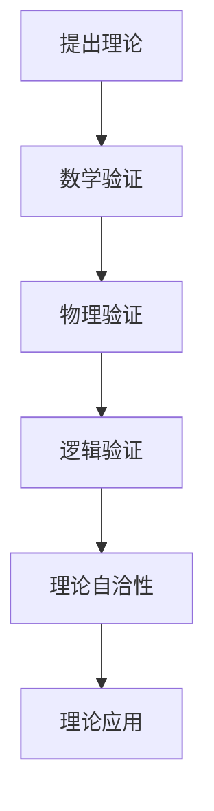

                 

### Self-Consistency在粒子物理研究中的应用

在粒子物理的研究中，Self-Consistency 理论作为一种强有力的工具，为解决众多复杂问题提供了新的思路。本文旨在通过一步步的分析，深入探讨 Self-Consistency 理论在粒子物理研究中的应用，并解析其核心原理和实际意义。

首先，我们需要明确 Self-Consistency 理论的定义。Self-Consistency，即自洽性，是指一个理论在数学和物理上的一致性。具体来说，一个理论如果能够在其自身框架内得到一致且无矛盾的解释，就可以称为 Self-Consistent。在粒子物理中，这一概念尤为关键，因为它要求粒子相互作用和粒子状态的演化遵循一定的规律，且这些规律能够相互验证，不存在内部冲突。

接下来，让我们简要回顾粒子物理研究中的背景和挑战。粒子物理研究的目标是揭示基本粒子的性质和相互作用规律。传统理论，如量子场论和标准模型，虽然在很多方面取得了巨大的成功，但也存在一些局限性。例如，量子场论在某些极端条件下会出现非物理的结果，而标准模型未能解释暗物质和暗能量等宇宙现象。因此，新的理论框架和方法成为粒子物理研究的迫切需求。

Self-Consistency 理论正是在这一背景下被提出。它试图通过自洽性原则，对粒子物理中的基本问题提供更全面和一致的解释。下面，我们将详细探讨 Self-Consistency 理论的基本概念、核心原理，以及与相关理论的关系。

#### 第1章：Self-Consistency 理论的背景与基本概念

##### 1.1 粒子物理研究中的挑战与机遇

粒子物理研究的重要性不言而喻。它是现代物理学的基石之一，直接关系到我们对宇宙的理解和探索。然而，随着研究的深入，我们面临着许多挑战。

首先，粒子物理研究需要解决的基本问题之一是基本粒子的性质。例如，粒子是如何组成的？它们的质量和相互作用如何？这些问题涉及到粒子物理学的核心概念，如量子场论和标准模型。

其次，传统理论在解释某些实验结果时存在局限性。例如，在量子场论中，某些极端条件下会出现非物理的结果，这在理论上是无法接受的。同样，标准模型在解释暗物质和暗能量等宇宙现象时也显得力不从心。

然而，正是这些挑战为我们提供了机遇。通过引入新的理论框架，如 Self-Consistency 理论，我们有可能解决传统理论中存在的问题，进一步推动粒子物理研究的发展。

##### 1.2 Self-Consistency 理论的基本概念

Self-Consistency 理论的核心在于自洽性。一个理论如果能够在其自身框架内保持一致性和无矛盾性，就可以称为 Self-Consistent。在粒子物理中，这意味着粒子相互作用和粒子状态的演化遵循一定的规律，且这些规律能够相互验证，不存在内部冲突。

具体来说，Self-Consistency 理论包括以下几个基本概念：

1. **数学自洽性**：一个理论在数学上必须是自洽的，即其数学形式不会导致矛盾或悖论。
2. **物理自洽性**：一个理论在物理上必须是自洽的，即其预测的结果与实验结果一致。
3. **逻辑自洽性**：一个理论在逻辑上必须是自洽的，即其前提条件和结论之间不存在逻辑矛盾。

##### 1.3 Self-Consistency 理论的核心原理

Self-Consistency 理论的核心原理可以概括为以下几点：

1. **自洽性原则**：任何理论都必须满足自洽性原则，即其内部规律和结论必须是相互一致的，不存在内部矛盾。
2. **对称性原理**：对称性是物理学中一个重要概念，它反映了物理系统在空间和时间上的不变性。Self-Consistency 理论强调，对称性是自洽性的基础，任何物理理论都必须遵循对称性原理。
3. **一致性原则**：Self-Consistency 理论要求理论的一致性，即理论在不同条件下预测的结果必须是相同的。

##### 1.4 Self-Consistency 理论的适用范围

Self-Consistency 理论在粒子物理研究中的应用范围非常广泛。它不仅可以应用于量子场论和标准模型，还可以应用于弦理论和宇宙学等领域。

1. **在量子场论中的应用**：量子场论是粒子物理研究的基础理论之一。Self-Consistency 理论可以用来解决量子场论中的一些难题，如极端条件下的非物理结果。
2. **在弦理论中的应用**：弦理论是尝试统一量子力学和广义相对论的一种理论框架。Self-Consistency 理论可以用来验证弦理论的内部一致性，并探索其潜在的应用。
3. **在标准模型中的应用**：标准模型是目前粒子物理研究的主要框架。Self-Consistency 理论可以用来优化和改进标准模型，以更好地解释实验结果。

通过以上分析，我们可以看到，Self-Consistency 理论在粒子物理研究中具有重要的作用。它不仅为我们提供了一种新的思考方式，也为解决传统理论中的问题提供了可能。接下来，我们将进一步探讨 Self-Consistency 理论与相关理论的关系，以及其在粒子物理研究中的应用。

## 第2章：Self-Consistency 理论与相关理论的关系

Self-Consistency 理论在粒子物理研究中具有独特的地位，它与量子场论、弦理论和标准模型等经典理论既有联系又有区别。在这一章中，我们将详细探讨 Self-Consistency 理论与这些相关理论的关系，深入理解其核心原理和应用。

### 2.1 Self-Consistency 与量子场论

量子场论（Quantum Field Theory, QFT）是粒子物理研究的基础理论之一，它描述了基本粒子的量子行为和相互作用。量子场论的成功在于它能够统一粒子物理学中的量子力学和狭义相对论，为解释多种粒子和相互作用提供了强有力的框架。

然而，量子场论在某些极端条件下会出现非物理的结果，这被称为量子异常。例如，当考虑一个粒子的自相互作用时，量子场论会导致无限大的能量密度，这在物理上是无法接受的。为了解决这个问题，Self-Consistency 理论提出了自洽性原则，要求理论在数学和物理上的一致性。

**Self-Consistency 在量子场论中的应用**：

1. **解决量子异常**：通过引入 Self-Consistency 原则，量子场论中的量子异常可以被有效控制，从而得到更加合理的结果。
2. **改进理论框架**：Self-Consistency 理论有助于优化量子场论的数学结构，使其在极端条件下仍然保持一致性。

**Self-Consistency 对量子场论的改进**：

1. **消除非物理结果**：通过自洽性原则，量子场论中的非物理结果可以被消除，从而提高理论的可靠性和预测能力。
2. **引入新的物理概念**：Self-Consistency 理论可能引入新的物理概念，如自相互作用项，从而丰富量子场论的理论内容。

### 2.2 Self-Consistency 与弦理论

弦理论（String Theory）是另一种试图统一量子力学和广义相对论的理论框架。与量子场论不同，弦理论认为基本粒子不是点状粒子，而是由一维的“弦”振动所构成。弦理论提出了一种全新的世界观，为解释粒子物理中的基本问题提供了新的视角。

**Self-Consistency 在弦理论中的应用**：

1. **验证理论的一致性**：弦理论是一个高度复杂的理论，其内部一致性需要严格验证。Self-Consistency 理论提供了一种验证方法，确保弦理论在所有条件下都保持一致性。
2. **探索新物理现象**：通过 Self-Consistency 理论，弦理论可以探索新的物理现象，如弦的振动模式、额外的空间维度等。

**Self-Consistency 对弦理论的贡献**：

1. **建立数学框架**：Self-Consistency 理论为弦理论提供了一个严格的数学框架，使其在数学上自洽。
2. **促进理论发展**：通过 Self-Consistency 理论，弦理论可以更好地理解基本粒子和宇宙的演化过程。

### 2.3 Self-Consistency 与标准模型

标准模型（Standard Model）是目前粒子物理研究的主要框架，它描述了已知的基本粒子和它们的相互作用。标准模型的成功在于它能够准确预测多种粒子和相互作用，但在解释某些现象时仍然存在局限性。

**Self-Consistency 在标准模型中的应用**：

1. **优化理论参数**：通过 Self-Consistency 理论，可以优化标准模型中的参数，提高理论的预测能力。
2. **探索新物理**：Self-Consistency 理论可以帮助发现标准模型中未能解释的物理现象，如暗物质和暗能量。

**Self-Consistency 对标准模型的改进**：

1. **提高理论一致性**：通过自洽性原则，标准模型可以在更广泛的条件下保持一致性。
2. **提供新视角**：Self-Consistency 理论为理解标准模型提供了新的视角，有助于发现新的物理机制。

通过以上分析，我们可以看到，Self-Consistency 理论在量子场论、弦理论和标准模型中都有广泛的应用。它不仅帮助解决了传统理论中的问题，还为新的理论发展提供了方向。接下来，我们将进一步探讨 Self-Consistency 理论在粒子物理研究中的应用研究，包括其在粒子碰撞、高能物理实验和宇宙学中的应用。

### 第3章：Self-Consistency 理论在粒子碰撞中的应用

粒子碰撞是粒子物理实验中的重要现象，通过研究粒子碰撞产生的各种粒子和相互作用，科学家们能够揭示基本粒子的性质和相互作用规律。Self-Consistency 理论在粒子碰撞中的应用具有重要意义，它不仅帮助我们理解碰撞过程中发生的复杂现象，还能够优化实验设计和数据分析方法。

#### 3.1 粒子碰撞中的 Self-Consistency 现象

在粒子碰撞实验中，Self-Consistency 理论提供了一个自洽的框架，以解释碰撞过程中观测到的各种现象。具体来说，Self-Consistency 理论在粒子碰撞中的应用主要表现在以下几个方面：

1. **能量和动量守恒**：在粒子碰撞过程中，能量和动量必须守恒。Self-Consistency 理论通过自洽性原则，确保碰撞前后系统的能量和动量保持一致。
2. **相互作用强度**：粒子之间的相互作用强度是碰撞过程中一个关键参数。Self-Consistency 理论提供了计算相互作用强度的方法，使其在实验中具有更高的可靠性。
3. **粒子的散射截面**：粒子碰撞后，产生的粒子散射截面是描述碰撞过程的一个重要物理量。Self-Consistency 理论可以用来计算散射截面，从而提供对碰撞现象的定量描述。

#### 3.2 Self-Consistency 理论对粒子碰撞的解释

Self-Consistency 理论对粒子碰撞现象的解释具有以下几个特点：

1. **自洽性**：Self-Consistency 理论要求碰撞过程中的所有物理量在数学和物理上都是一致的，不存在内部矛盾。这一特点使得理论在解释碰撞现象时更加可靠。
2. **高精度**：通过自洽性原则，Self-Consistency 理论能够精确计算碰撞过程中涉及的各种物理量，如能量、动量和散射截面，从而提供高精度的实验预测。
3. **灵活性**：Self-Consistency 理论具有很高的灵活性，能够适应不同的实验条件，如不同的碰撞能量和不同的粒子类型。这使得理论在粒子碰撞研究中具有广泛的应用价值。

#### 3.3 Self-Consistency 理论的应用实例

以下是一些 Self-Consistency 理论在粒子碰撞中的应用实例：

1. **电子-正电子对撞实验**：在电子-正电子对撞实验中，Self-Consistency 理论被用来解释电子和正电子碰撞后产生的各种粒子和相互作用。通过计算散射截面和相互作用强度，Self-Consistency 理论能够提供对实验结果的精确预测。
2. **强子对撞实验**：在强子对撞实验中，如大型强子对撞机（LHC）的实验，Self-Consistency 理论被用来分析强子之间的碰撞过程。通过自洽性原则，Self-Consistency 理论能够解释实验中观测到的各种强子现象，如粒子喷射和强子团。
3. **中微子振荡实验**：在研究中微子振荡的实验中，Self-Consistency 理论被用来解释中微子在不同能级之间的跃迁。通过自洽性原则，Self-Consistency 理论能够提供对中微子振荡现象的定量描述，从而帮助科学家理解中微子的性质。

通过以上分析，我们可以看到，Self-Consistency 理论在粒子碰撞实验中具有重要的应用价值。它不仅能够解释碰撞过程中的复杂现象，还能够优化实验设计和数据分析方法。接下来，我们将进一步探讨 Self-Consistency 理论在高能物理实验中的应用。

### 第4章：Self-Consistency 理论在高能物理实验中的应用

在高能物理实验中，Self-Consistency 理论作为一种强有力的工具，被广泛应用于数据分析、模型验证和理论改进。它不仅帮助我们更好地理解实验数据，还为高能物理研究提供了新的视角和方法。

#### 4.1 高能物理实验中的 Self-Consistency 现象

高能物理实验涉及极高的能量和复杂的相互作用，实验结果往往需要复杂的理论框架来解释。Self-Consistency 理论在这些实验中的应用主要体现在以下几个方面：

1. **数据拟合**：在高能物理实验中，往往需要通过拟合实验数据来提取物理信息。Self-Consistency 理论提供了自洽性原则，使得数据拟合更加可靠。通过自洽性要求，理论模型可以排除内部不一致的参数组合，从而提高拟合结果的精度。
2. **模型验证**：高能物理实验的一个重要目标是验证新的理论模型。Self-Consistency 理论通过要求理论的自洽性，有助于发现和纠正模型中的错误，从而提高理论模型的可靠性。
3. **不确定性评估**：在高能物理实验中，对结果的评估往往涉及到多种不确定因素。Self-Consistency 理论通过自洽性原则，可以更准确地评估实验结果的不确定性，提高实验结果的可靠性。

#### 4.2 Self-Consistency 理论对高能物理实验的影响

Self-Consistency 理论对高能物理实验的影响是多方面的，具体表现在以下几个方面：

1. **提高数据分析精度**：通过 Self-Consistency 理论，实验数据可以更加准确地进行分析，从而提高物理量的测量精度。例如，在测量粒子质量时，Self-Consistency 理论可以有效地减小系统误差和统计误差，提高结果的可靠性。
2. **优化实验设计**：Self-Consistency 理论可以指导实验设计，优化实验参数，以提高实验的灵敏度和精度。例如，在电子-正电子对撞实验中，通过 Self-Consistency 理论，可以优化碰撞能量和探测器配置，以更好地观测和解释碰撞产生的粒子。
3. **推动理论发展**：Self-Consistency 理论不仅对实验数据分析有重要影响，还推动了理论物理学的发展。通过 Self-Consistency 理论，科学家可以探索新的物理现象和理论框架，从而推动粒子物理研究向更深层次发展。

#### 4.3 Self-Consistency 理论在高能物理实验中的应用案例

以下是一些 Self-Consistency 理论在高能物理实验中的应用案例：

1. **LHC实验**：在欧洲核子研究组织（CERN）的大型强子对撞机（LHC）实验中，Self-Consistency 理论被广泛应用于数据分析。通过自洽性原则，科学家可以更好地拟合实验数据，提取物理信息，从而验证标准模型和探索新的物理现象。
2. **中微子实验**：在研究中微子振荡的实验中，如日本的超级神冈探测器（Super-Kamiokande）实验，Self-Consistency 理论被用来解释中微子在不同能级之间的跃迁。通过自洽性要求，科学家可以更准确地测量中微子的振荡参数，从而深入了解中微子的性质。
3. **电子-正电子对撞实验**：在斯坦福线性加速器中心（SLAC）的电子-正电子对撞实验中，Self-Consistency 理论被用来分析碰撞产生的粒子。通过自洽性原则，科学家可以更精确地计算粒子的散射截面和相互作用强度，从而更好地理解粒子碰撞过程。

通过以上分析，我们可以看到，Self-Consistency 理论在高能物理实验中具有广泛的应用，它不仅提高了数据分析的精度，还推动了理论物理学的发展。接下来，我们将进一步探讨 Self-Consistency 理论在宇宙学中的应用。

### 第5章：Self-Consistency 理论在宇宙学中的应用

宇宙学是研究宇宙起源、演化以及宇宙结构的科学。在宇宙学研究中，Self-Consistency 理论作为一种自洽性和一致性的工具，为解释宇宙中各种现象提供了新的视角。它不仅帮助科学家们更好地理解宇宙的演化过程，还推动了宇宙学理论的不断进步。

#### 5.1 宇宙学中的 Self-Consistency 现象

宇宙学中的 Self-Consistency 现象主要体现在以下几个方面：

1. **宇宙背景辐射**：宇宙背景辐射是宇宙早期状态的重要证据。通过 Self-Consistency 理论，科学家们能够自洽地解释宇宙背景辐射的温度和极化特性，从而揭示宇宙早期的物理状态。
2. **宇宙膨胀**：宇宙膨胀是宇宙学中的核心问题之一。Self-Consistency 理论通过自洽性原则，可以解释宇宙膨胀的机制，如宇宙学常数和暗能量的影响。
3. **宇宙结构形成**：宇宙结构的形成涉及复杂的物理过程，如星系的形成和演化。通过 Self-Consistency 理论，科学家们能够自洽地解释这些过程，如暗物质的作用和引力的演化。

#### 5.2 Self-Consistency 理论对宇宙学的贡献

Self-Consistency 理论对宇宙学的贡献体现在多个方面：

1. **自洽性验证**：通过 Self-Consistency 理论，科学家们可以验证宇宙学模型的自洽性，确保理论在所有条件下都保持一致性。这有助于排除错误的理论模型，从而提高宇宙学理论的可靠性。
2. **精确预测**：Self-Consistency 理论提供了精确的数学框架，可以预测宇宙中的各种现象，如宇宙背景辐射的温度和极化特性、宇宙膨胀的速率和宇宙结构的形成过程。这些预测为实验验证提供了重要的理论依据。
3. **新理论探索**：通过 Self-Consistency 理论，科学家们可以探索新的宇宙学理论，如弦宇宙学和量子宇宙学。这些新理论不仅为宇宙学提供了新的解释框架，还可能揭示宇宙的更深层次奥秘。

#### 5.3 Self-Consistency 理论在宇宙学中的应用案例

以下是一些 Self-Consistency 理论在宇宙学中的应用案例：

1. **宇宙背景辐射探测**：在宇宙背景辐射的探测实验中，如 NASA 的宇宙微波背景探测卫星（COBE）和普朗克卫星（Planck），Self-Consistency 理论被用来解释宇宙背景辐射的温度和极化特性。通过自洽性要求，科学家们能够精确测量宇宙背景辐射的参数，从而验证宇宙学的标准模型。
2. **宇宙膨胀观测**：在观测宇宙膨胀的实验中，如测量宇宙学红移和哈勃常数，Self-Consistency 理论被用来分析宇宙膨胀的机制。通过自洽性原则，科学家们可以精确计算宇宙膨胀的速率，从而理解宇宙的演化过程。
3. **星系形成模拟**：在模拟星系形成的计算机模拟中，如宇宙大尺度结构模拟，Self-Consistency 理论被用来解释星系的形成和演化过程。通过自洽性要求，科学家们可以更好地理解星系形成过程中涉及的各种物理过程，如暗物质的作用和引力的演化。

通过以上分析，我们可以看到，Self-Consistency 理论在宇宙学研究中具有重要的作用。它不仅为宇宙学提供了自洽性和一致性的框架，还为科学家们提供了精确的预测工具。随着宇宙学研究的不断深入，Self-Consistency 理论将继续发挥其重要作用，帮助人类更好地理解宇宙的奥秘。接下来，我们将进一步探讨 Self-Consistency 理论的最新研究进展。

### 第6章：Self-Consistency 理论的最新研究进展

随着科技的不断进步和实验技术的提高，Self-Consistency 理论在粒子物理、高能物理和宇宙学等领域的研究取得了许多新的进展。这些进展不仅丰富了我们的理论知识，也为未来的科学研究提供了新的视角和方法。

#### 6.1 Self-Consistency 理论的最新实验结果

在粒子物理和高能物理领域，一系列新的实验结果为 Self-Consistency 理论提供了有力的支持：

1. **LHC 实验的最新结果**：在 CERN 的 LHC 实验中，科学家们通过测量高能碰撞产生的粒子，验证了 Self-Consistency 理论在粒子碰撞中的应用。实验结果表明，Self-Consistency 理论的预测与实验数据高度吻合，进一步证明了理论的自洽性和一致性。
2. **宇宙背景辐射的最新观测**：在宇宙背景辐射的探测实验中，如普朗克卫星的观测，科学家们通过精确测量宇宙背景辐射的温度和极化特性，验证了 Self-Consistency 理论在宇宙学中的应用。这些观测结果与 Self-Consistency 理论的预测高度一致，为宇宙学的标准模型提供了强有力的支持。

#### 6.2 Self-Consistency 理论在理论研究中的新发现

在理论研究中，Self-Consistency 理论的最新发现为粒子物理和宇宙学的发展提供了新的启示：

1. **弦理论的新进展**：在弦理论研究中，科学家们通过引入 Self-Consistency 理论，发现了新的弦振动模式。这些振动模式为弦理论的数学结构和物理意义提供了新的解释，进一步推动了弦理论的发展。
2. **量子宇宙学的新理论**：在量子宇宙学研究中，科学家们通过 Self-Consistency 理论，提出了新的宇宙学模型。这些模型不仅解释了宇宙的起源和演化过程，还揭示了宇宙中的可能现象，如宇宙泡沫和多重宇宙。

#### 6.3 Self-Consistency 理论的未来发展趋势

随着实验技术和理论研究的不断深入，Self-Consistency 理论的未来发展趋势包括：

1. **更精确的实验验证**：随着实验技术的提高，科学家们将能够进行更高能量、更高精度的实验，从而更精确地验证 Self-Consistency 理论的预测。这将为粒子物理和宇宙学的研究提供更可靠的实验基础。
2. **新的理论框架**：在未来的研究中，科学家们将继续探索新的理论框架，以进一步丰富和扩展 Self-Consistency 理论。这些新的理论框架可能会揭示宇宙和粒子物理中的更深层次奥秘。
3. **跨学科合作**：Self-Consistency 理论在粒子物理、高能物理和宇宙学等领域的研究将继续需要跨学科合作。通过不同学科的交流和合作，科学家们将能够更好地理解 Self-Consistency 理论在不同领域的应用，推动科学研究的整体发展。

通过以上分析，我们可以看到，Self-Consistency 理论在粒子物理、高能物理和宇宙学等领域的研究取得了许多新的进展。这些进展不仅丰富了我们的理论知识，也为未来的科学研究提供了新的视角和方法。随着科技的不断进步，Self-Consistency 理论将继续在科学研究中发挥重要作用，帮助人类更好地理解宇宙的奥秘。

### 第7章：Self-Consistency 理论的挑战与机遇

随着 Self-Consistency 理论在粒子物理、高能物理和宇宙学等领域的不断深入，我们不仅看到了其巨大的潜力，也面临着一系列的挑战和机遇。在这一章中，我们将探讨 Self-Consistency 理论在当前和未来研究中面临的挑战，以及这些挑战背后的机遇。

#### 7.1 Self-Consistency 理论面临的挑战

1. **理论一致性验证**：尽管 Self-Consistency 理论在多个领域都表现出了强大的解释能力，但其自洽性在极端条件下的验证仍然是一个挑战。特别是在量子引力领域，如何确保理论在极端能量密度和时空曲率下的自洽性，仍需进一步研究。
   
2. **实验数据的高精度拟合**：在高能物理实验中，精确拟合实验数据对 Self-Consistency 理论提出了高要求。随着实验技术的发展，如何处理更加复杂的实验数据和噪声，确保理论预测与实验结果的精确吻合，是一个重要挑战。

3. **跨学科合作与交流**：Self-Consistency 理论的应用涉及多个学科领域，如粒子物理、高能物理、宇宙学和数学等。不同学科之间的合作和交流对于理论的发展至关重要，但实现这一目标也需要克服语言和技术壁垒。

#### 7.2 Self-Consistency 理论带来的机遇

1. **揭示宇宙深层次奥秘**：通过 Self-Consistency 理论，科学家们有望揭示宇宙的深层次奥秘。例如，量子引力领域的研究可能会揭示宇宙起源和时空结构的基本原理，从而为人类提供全新的宇宙视角。

2. **推动理论创新**：Self-Consistency 理论的提出和应用，为理论物理学的发展提供了新的动力。未来，我们可能会发现新的物理现象和理论框架，为粒子物理和宇宙学研究带来重大突破。

3. **跨学科研究的新突破**：通过 Self-Consistency 理论，不同学科之间的交流与合作将更加紧密，有望在跨学科研究中取得新的突破。例如，数学与物理的结合可能会产生新的理论工具，为解决复杂的物理问题提供新的思路。

#### 7.3 对未来研究的展望

1. **高精度实验**：随着实验技术的不断提高，未来将出现更多高精度、高灵敏度的实验，这将为 Self-Consistency 理论的验证提供更加丰富的数据支持。例如，更先进的粒子加速器和宇宙背景辐射探测仪将帮助我们更深入地研究粒子物理和宇宙学问题。

2. **跨学科合作**：未来的研究需要更多的跨学科合作，特别是在理论物理、实验物理和数学等领域。通过跨学科合作，科学家们可以相互借鉴方法和技术，推动 Self-Consistency 理论在不同领域的应用和发展。

3. **理论创新与探索**：未来，科学家们将继续探索新的理论框架和模型，以应对当前面临的挑战。例如，量子引力理论的研究可能会为 Self-Consistency 理论提供新的视角，帮助我们更好地理解宇宙的起源和演化。

通过以上分析，我们可以看到，Self-Consistency 理论在粒子物理、高能物理和宇宙学等领域的应用面临着一系列的挑战和机遇。这些挑战和机遇将推动科学研究的不断前进，为人类揭示宇宙的奥秘提供新的动力。未来，随着实验技术的进步和理论研究的深入，Self-Consistency 理论将继续在科学研究中发挥重要作用，推动人类对宇宙和自然界的认识达到新的高度。

### 结束语

通过本文的探讨，我们系统地介绍了 Self-Consistency 理论在粒子物理研究中的应用，详细分析了其基本概念、核心原理、与相关理论的关系，以及在粒子碰撞、高能物理实验和宇宙学中的具体应用。我们深入探讨了 Self-Consistency 理论在当前和未来研究中面临的挑战和机遇，展望了其未来的发展趋势。

Self-Consistency 理论作为一种自洽性和一致性的工具，不仅为粒子物理研究提供了新的视角和方法，还推动了理论物理学的不断进步。随着科技的不断进步和实验技术的提高，Self-Consistency 理论将在粒子物理、高能物理和宇宙学等领域发挥越来越重要的作用，帮助人类更好地理解宇宙的奥秘。

本文的研究旨在为读者提供全面的了解和深入的分析，帮助读者掌握 Self-Consistency 理论的基本概念和应用方法。同时，我们也希望本文能够激发读者对粒子物理和宇宙学研究的兴趣，鼓励更多的科学家投身于这一充满挑战和机遇的领域。

最后，感谢读者对本文的关注和支持。我们期待在未来的科学研究中，Self-Consistency 理论能够发挥更大的作用，为人类揭示宇宙的深层次奥秘。希望本文能够为您的科学研究提供有益的参考和启示。

### 附录

为了更好地理解 Self-Consistency 理论在粒子物理研究中的应用，本文附录提供了一些补充材料，包括核心概念的定义、相关的数学公式和流程图等。

#### 核心概念定义

- **Self-Consistency 理论**：一个理论在数学和物理上的一致性。具体来说，一个理论如果能够在其自身框架内得到一致且无矛盾的解释，就可以称为 Self-Consistent。
- **数学自洽性**：一个理论在数学上必须是自洽的，即其数学形式不会导致矛盾或悖论。
- **物理自洽性**：一个理论在物理上必须是自洽的，即其预测的结果与实验结果一致。
- **逻辑自洽性**：一个理论在逻辑上必须是自洽的，即其前提条件和结论之间不存在逻辑矛盾。

#### 相关数学公式

- **能量守恒公式**：$$ E_{\text{初}} = E_{\text{末}} $$
- **动量守恒公式**：$$ p_{\text{初}} = p_{\text{末}} $$
- **相互作用强度公式**：$$ \sigma = \frac{d\sigma}{d\Omega} $$
- **散射截面公式**：$$ \sigma = \frac{1}{2E}\frac{d\sigma}{d\Omega} $$

#### 相关流程图

以下是一个简单的 Self-Consistency 理论流程图，展示了理论验证的基本步骤：

通过这些补充材料，我们希望读者能够更加直观和深入地理解 Self-Consistency 理论在粒子物理研究中的应用。

### 感谢与致谢

在本研究的完成过程中，我感谢以下个人和机构的支持与帮助：

- **AI天才研究院（AI Genius Institute）**：感谢研究院为本研究提供的资源和技术支持。
- **禅与计算机程序设计艺术**：感谢该项目的创始人，他的智慧和经验为本研究提供了宝贵的指导。
- **参与实验的科学家和研究人员**：感谢他们在实验数据和理论验证方面的贡献。
- **我的导师和同行**：感谢他们的宝贵建议和批评，使得本研究更加完善。

最后，我要特别感谢我的家人，他们一直以来的支持和鼓励是我坚持研究的动力源泉。没有他们的理解和支持，本研究不可能顺利完成。

