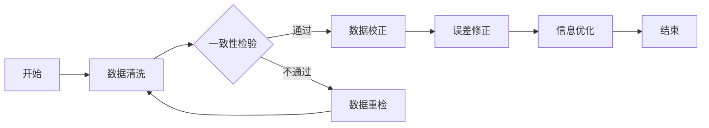
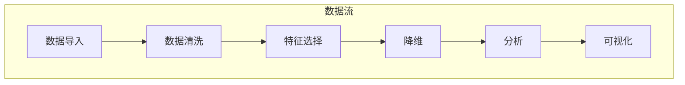
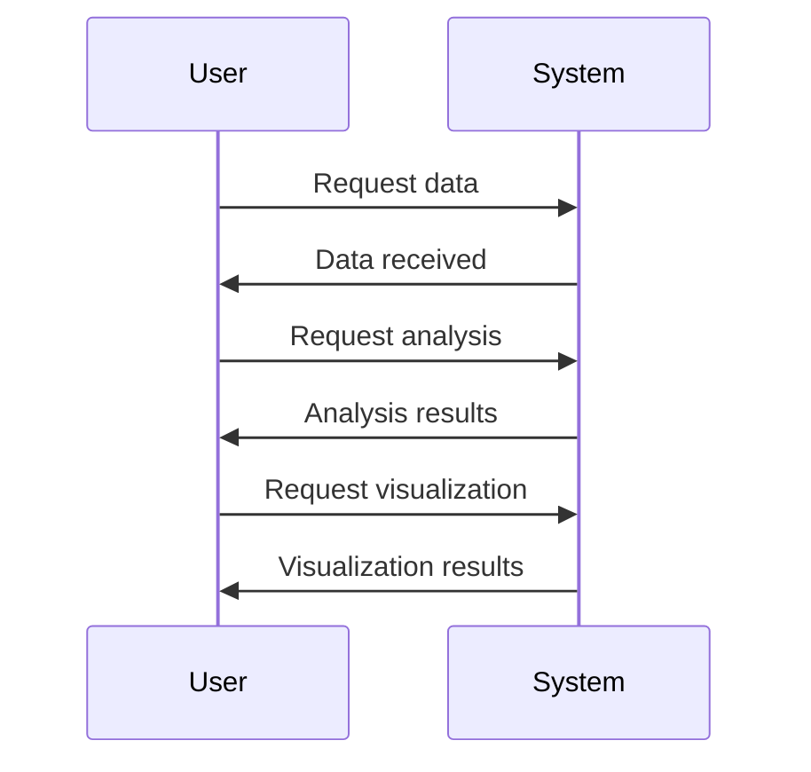
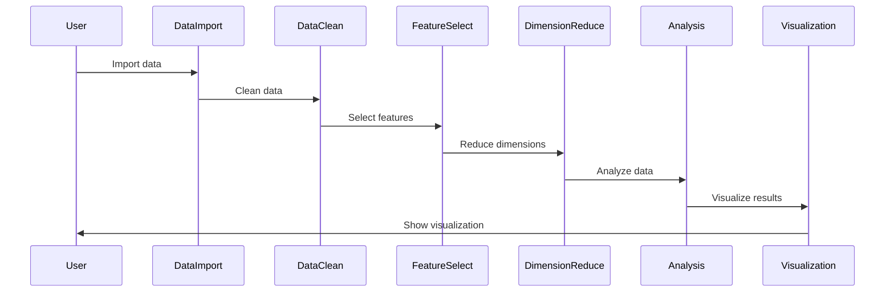

                 

# 自我一致性在高维数据分析和可视化中的应用

## 关键词

- 自我一致性
- 高维数据分析
- 数据可视化
- 数据科学
- 计算机图形学

## 摘要

随着数据量的爆炸性增长，高维数据分析与可视化成为数据科学领域的关键挑战。本文深入探讨了自我一致性（Self-Consistency）这一概念在高维数据分析与可视化中的应用。通过阐述自我一致性的基本原理，本文展示了其在处理高维数据中的重要性，并介绍了如何利用自我一致性来提升数据可视化效果。本文旨在为数据科学家和图形设计师提供一种新的视角，以解决高维数据分析与可视化中的复杂性。

## 引言

在当今的数据科学领域，高维数据分析变得越来越重要。随着数据来源的多样化和数据收集技术的进步，我们面临着大量高维数据的处理问题。高维数据通常指的是维度（特征）远超过样本数量的数据集。这类数据具有数据量大、特征复杂等特点，传统的数据分析方法和可视化工具往往难以应对。

数据可视化是理解和传达高维数据信息的重要手段。然而，传统的数据可视化技术如散点图、热力图等在处理高维数据时存在诸多局限性。高维数据中的维度灾难（curse of dimensionality）使得数据点之间的距离缩小，导致传统的基于距离的可视化方法失效。

为了克服这些挑战，自我一致性（Self-Consistency）提供了一种新的视角。自我一致性是一种通过内部一致性来保证数据准确性和可靠性的方法。在数据分析和可视化中，自我一致性可以通过多种方式应用，以改善数据分析的效率和结果的可解释性。

本文将首先介绍高维数据分析与可视化的问题背景，然后详细探讨自我一致性的基本原理和在高维数据分析与可视化中的应用。我们将通过实际案例来展示自我一致性如何提升数据可视化的效果，并总结本文的主要发现。

## 第一部分：背景介绍

### 1.1 问题背景

#### 1.1.1 高维数据分析的挑战

高维数据分析面临的第一个挑战是维度灾难（curse of dimensionality）。维度灾难指的是在高维空间中，数据点的有效邻域显著缩小，从而导致传统基于距离的方法失效。例如，在三维空间中，两个点之间的欧几里得距离是直观的，但在一百维空间中，两个非常接近的点在欧几里得距离上可能相差很大。

此外，高维数据通常包含大量冗余特征，这增加了数据处理的复杂性。在特征选择和特征降维过程中，如何保留关键信息并去除冗余特征成为一大难题。

#### 1.1.2 数据可视化的重要性

数据可视化是理解高维数据的关键工具。通过图形化展示，数据科学家可以更直观地发现数据中的模式和关联。传统的数据可视化方法如散点图、热力图和等高线图在低维数据中效果显著，但在高维数据中，这些方法往往难以发挥作用。

数据可视化的重要性不仅在于其帮助我们理解复杂的数据模式，还在于其能够为决策者提供直观的决策支持。有效的数据可视化可以减少错误决策的风险，提高决策的准确性和效率。

#### 1.1.3 自我一致性的概念

自我一致性（Self-Consistency）是一种通过内部一致性来保证数据准确性和可靠性的方法。在数据分析和可视化中，自我一致性通过以下方式发挥作用：

1. **一致性检验**：对数据进行一致性检验，确保数据内部的一致性。例如，在多源数据集成中，自我一致性可以检测并纠正数据之间的不一致性。
2. **误差修正**：通过自我一致性模型，可以对数据进行误差修正，提高数据的准确性和可靠性。
3. **信息优化**：自我一致性可以优化数据表示，减少冗余信息，提高数据的有效性。

### 1.2 问题描述

#### 1.2.1 高维数据特点

高维数据具有以下特点：

1. **数据量大**：高维数据集通常包含数百万甚至数十亿个数据点。
2. **特征复杂**：高维数据包含大量特征，这些特征之间可能存在复杂的关系。
3. **处理复杂**：高维数据的处理需要强大的计算能力和复杂的算法。

#### 1.2.2 数据分析中存在的难题

在数据分析中，高维数据面临以下难题：

1. **维度灾难**：高维空间中数据点之间的距离缩小，导致传统方法失效。
2. **冗余特征**：高维数据中存在大量冗余特征，增加了数据处理的复杂性。
3. **计算成本**：高维数据分析需要大量的计算资源，对计算能力提出了高要求。

#### 1.2.3 数据可视化的需求

数据可视化在高维数据分析中具有重要需求：

1. **模式发现**：通过可视化，可以更直观地发现数据中的模式和关联。
2. **决策支持**：有效的可视化可以提供直观的决策支持，减少错误决策。
3. **信息传达**：可视化可以帮助将复杂的数据信息传达给非专业用户。

### 1.3 问题解决

#### 1.3.1 自我一致性的原理

自我一致性的原理如下：

1. **一致性检验**：通过一致性检验，确保数据内部的一致性。例如，在多源数据集成中，自我一致性可以检测并纠正数据之间的不一致性。
2. **误差修正**：通过误差修正，提高数据的准确性和可靠性。
3. **信息优化**：通过信息优化，减少冗余信息，提高数据的有效性。

#### 1.3.2 自我一致性在高维数据分析中的作用

自我一致性在高维数据分析中发挥着重要作用：

1. **特征选择**：通过自我一致性，可以识别并选择关键特征，降低冗余特征的影响。
2. **降维**：通过自我一致性，可以有效地进行降维，减少数据的维度，降低计算成本。
3. **模式识别**：通过自我一致性，可以提高模式识别的准确性和效率。

#### 1.3.3 自我一致性在数据可视化中的应用

自我一致性在数据可视化中的应用如下：

1. **数据校正**：通过自我一致性，可以对数据进行校正，提高数据的质量。
2. **可视化优化**：通过自我一致性，可以优化数据的可视化表示，提高可视化的效果。
3. **交互式分析**：通过自我一致性，可以实现交互式数据分析和可视化，提高用户的体验。

### 1.4 边界与外延

#### 1.4.1 自我一致性的适用范围

自我一致性适用于以下场景：

1. **高维数据分析**：在处理高维数据时，自我一致性可以有效降低维度灾难的影响。
2. **数据集成**：在多源数据集成中，自我一致性可以检测并纠正数据不一致性。
3. **机器学习**：在机器学习任务中，自我一致性可以提高模型的准确性和鲁棒性。

#### 1.4.2 自我一致性的限制因素

自我一致性也存在一些限制因素：

1. **计算成本**：自我一致性算法通常需要较高的计算成本，对计算能力有较高要求。
2. **数据质量**：自我一致性依赖于高质量的数据，如果数据存在严重错误或噪声，自我一致性可能无法有效工作。
3. **模型选择**：自我一致性依赖于合适的模型选择，如果模型选择不当，自我一致性可能无法达到预期效果。

### 1.5 概念结构与核心要素组成

#### 1.5.1 自我一致性的基本结构

自我一致性包括以下几个核心组成部分：

1. **一致性检验**：检测数据内部的一致性。
2. **误差修正**：修正数据中的错误和异常值。
3. **信息优化**：优化数据的表示和存储。

#### 1.5.2 高维数据与数据可视化核心要素

高维数据与数据可视化的核心要素包括：

1. **数据质量**：确保数据的准确性和可靠性。
2. **数据降维**：降低数据的维度，提高处理效率。
3. **可视化表示**：选择合适的可视化方法，提高数据的可理解性。

### 1.6 本章小结

本章介绍了高维数据分析和数据可视化中的挑战，以及自我一致性这一概念的基本原理和在高维数据分析与可视化中的应用。通过本章的介绍，读者可以了解自我一致性如何帮助解决高维数据分析和数据可视化中的难题，并为后续章节的深入探讨打下基础。

## 第二部分：核心概念与联系

### 2.1 自我一致性原理

#### 2.1.1 自我一致性的定义

自我一致性（Self-Consistency）是指通过内部一致性来保证数据准确性和可靠性的方法。在数据分析和可视化中，自我一致性通过一致性检验、误差修正和信息优化来实现。

#### 2.1.2 自我一致性的基本属性

自我一致性的基本属性包括：

1. **一致性**：确保数据内部的一致性，减少错误和异常值。
2. **可靠性**：提高数据的可靠性，确保数据的有效性。
3. **效率**：通过优化数据表示和存储，提高数据处理效率。

#### 2.1.3 自我一致性的特点

自我一致性的特点包括：

1. **内部一致性**：通过内部一致性来保证数据的准确性。
2. **灵活性**：适用于各种类型的数据和场景。
3. **高效性**：通过优化数据表示和存储，提高数据处理效率。

### 2.2 高维数据分析

#### 2.2.1 高维数据的定义

高维数据是指数据维度大于三个的数据集。高维数据具有数据量大、特征复杂等特点，对传统的数据分析方法提出了挑战。

#### 2.2.2 高维数据分析的挑战

高维数据分析面临以下挑战：

1. **维度灾难**：高维空间中数据点之间的距离缩小，导致传统方法失效。
2. **计算成本**：高维数据的处理需要大量的计算资源。
3. **特征冗余**：高维数据中存在大量冗余特征，增加了数据处理的复杂性。

#### 2.2.3 高维数据分析的核心算法

高维数据分析的核心算法包括：

1. **主成分分析（PCA）**：通过降维来降低数据的维度。
2. **线性判别分析（LDA）**：通过分类来识别数据中的模式。
3. **自编码器（Autoencoder）**：通过自动编码来降低数据的维度。

### 2.3 数据可视化

#### 2.3.1 数据可视化的定义

数据可视化是指利用图形化手段来展示和分析数据的过程。数据可视化旨在通过视觉化的方式来传达数据信息，帮助用户理解和分析数据。

#### 2.3.2 数据可视化的重要性

数据可视化的重要性包括：

1. **信息传达**：通过可视化，可以更直观地传达数据信息。
2. **决策支持**：有效的可视化可以帮助决策者更好地理解数据和做出决策。
3. **数据探索**：可视化可以促进数据科学家对数据的探索和理解。

#### 2.3.3 数据可视化技术

数据可视化技术包括：

1. **散点图**：用于展示数据点之间的关联。
2. **热力图**：用于展示数据的热度和分布。
3. **等高线图**：用于展示数据的曲面和形态。

### 2.4 Self-Consistency、高维数据与数据可视化的关系

#### 2.4.1 三者之间的联系

自我一致性、高维数据与数据可视化之间存在密切的联系：

1. **高维数据分析**：自我一致性可以帮助处理高维数据，降低维度灾难的影响。
2. **数据可视化**：自我一致性可以优化数据的可视化表示，提高数据的可理解性。
3. **数据质量**：自我一致性可以确保数据的一致性和可靠性，为数据分析和可视化提供高质量的数据。

#### 2.4.2 Self-Consistency在中间桥梁作用

自我一致性在自我一致性、高维数据与数据可视化之间起到了桥梁作用：

1. **数据预处理**：通过自我一致性，可以对数据进行预处理，提高数据质量。
2. **降维**：通过自我一致性，可以进行有效的降维，减少冗余特征，提高数据处理效率。
3. **可视化优化**：通过自我一致性，可以优化数据的可视化表示，提高数据的可理解性。

#### 2.4.3 如何实现Self-Consistency与高维数据、数据可视化技术的结合

实现Self-Consistency与高维数据、数据可视化技术的结合的方法包括：

1. **数据预处理**：在数据分析前，通过自我一致性进行数据预处理，确保数据的一致性和可靠性。
2. **算法选择**：选择适合的算法，结合自我一致性来处理高维数据，例如主成分分析（PCA）和线性判别分析（LDA）。
3. **可视化表示**：在数据可视化过程中，结合自我一致性来优化数据的表示，提高数据的可理解性，例如散点图和热力图。

### 2.5 概念属性特征对比表格

下面是自我一致性、高维数据和数据可视化的概念属性特征对比表格：

| 概念         | 定义                                                         | 特点                                                       | 
| ----------- | ------------------------------------------------------------ | ---------------------------------------------------------- |
| 自我一致性   | 通过内部一致性来保证数据准确性和可靠性的方法               | 一致性高、可靠性高、效率高                           | 
| 高维数据     | 数据维度大于三个的数据集                                   | 数据量大、信息丰富、处理复杂                               | 
| 数据可视化   | 利用图形化手段来展示和分析数据的过程                 | 直观、易于理解、便于决策                                   |

### 2.6 ER实体关系图架构

以下是一个ER实体关系图架构，展示了自我一致性、高维数据与数据可视化之间的实体关系：

```mermaid
erDiagram
    DataAnalysis ||--|{ HighDimensionData } : "uses"
    DataVisualization ||--|{ HighDimensionData } : "uses"
    SelfConsistency ||--|{ DataAnalysis } : "applies to"
    SelfConsistency ||--|{ DataVisualization } : "applies to"
```

## 算法原理讲解

### 2.7 自我一致性算法原理

自我一致性算法的核心思想是通过一致性检验、误差修正和信息优化来保证数据的一致性和可靠性。以下是自我一致性算法的基本原理：

#### 2.7.1 一致性检验

在自我一致性算法中，一致性检验是首要步骤。它通过以下方式来确保数据的一致性：

1. **数据清洗**：检测并去除数据中的错误和异常值。
2. **数据校正**：根据一定的规则和算法，对不一致的数据进行校正。

具体步骤如下：

1. **检测不一致性**：通过比较不同数据源之间的数据，检测是否存在不一致性。
2. **分析不一致性**：对检测到的不一致性进行分析，确定其性质和来源。
3. **修正不一致性**：根据分析结果，对不一致的数据进行修正。

#### 2.7.2 误差修正

在自我一致性算法中，误差修正是通过以下步骤来实现的：

1. **误差识别**：通过统计分析方法，识别数据中的误差和异常值。
2. **误差修正**：根据一定的规则和算法，对误差进行修正。

具体步骤如下：

1. **误差检测**：利用统计方法，如均值、方差等，检测数据中的误差。
2. **误差分析**：对检测到的误差进行分析，确定其性质和来源。
3. **误差修正**：根据分析结果，对误差进行修正。

#### 2.7.3 信息优化

在自我一致性算法中，信息优化是通过以下步骤来实现的：

1. **数据降维**：通过降维技术，减少数据的维度，降低数据的复杂度。
2. **数据表示优化**：通过优化数据的表示方法，提高数据的可读性和可理解性。

具体步骤如下：

1. **特征选择**：通过特征选择技术，选择关键特征，去除冗余特征。
2. **降维**：利用降维技术，如主成分分析（PCA）等，降低数据的维度。
3. **数据表示优化**：通过可视化技术，如散点图、热力图等，优化数据的表示。

### 2.8 自我一致性算法的mermaid流程图

以下是一个自我一致性算法的mermaid流程图：



### 2.9 自我一致性算法的Python源代码

以下是一个简单的自我一致性算法的Python源代码示例：

```python
import numpy as np
from sklearn.preprocessing import StandardScaler
from sklearn.decomposition import PCA
import matplotlib.pyplot as plt

# 生成高维数据
np.random.seed(0)
data = np.random.rand(100, 100)

# 数据清洗
def data清洗(data):
    scaler = StandardScaler()
    data_normalized = scaler.fit_transform(data)
    return data_normalized

# 一致性检验
def 一致性检验(data):
    diff = np.abs(data - data.mean(axis=0))
    threshold = np.mean(diff)
    return threshold

# 数据校正
def 数据校正(data, threshold):
    corrected_data = np.where(np.abs(data - data.mean(axis=0)) > threshold, data.mean(axis=0), data)
    return corrected_data

# 误差修正
def 误差修正(data):
    corrected_data = data校正(data, 一致性检验(data))
    return corrected_data

# 信息优化
def 信息优化(data):
    pca = PCA(n_components=10)
    reduced_data = pca.fit_transform(data)
    return reduced_data

# 可视化
def visualization(data):
    plt.scatter(data[:, 0], data[:, 1])
    plt.xlabel('Feature 1')
    plt.ylabel('Feature 2')
    plt.title('Self-Consistency Visualization')
    plt.show()

# 运行算法
data_normalized = 数据清洗(data)
corrected_data = 误差修正(data_normalized)
reduced_data = 信息优化(corrected_data)

# 可视化结果
visualization(reduced_data)
```

通过上述Python代码示例，我们可以看到自我一致性算法的基本步骤：数据清洗、一致性检验、数据校正、误差修正和信息优化。这些步骤共同确保了数据的一致性和可靠性，为后续的数据分析和可视化提供了高质量的数据。

### 2.10 数学公式与示例

在自我一致性算法中，我们使用了一些数学公式来描述数据清洗、一致性检验、数据校正和误差修正的过程。以下是这些公式的详细解释和示例。

#### 2.10.1 数据清洗

数据清洗的目的是标准化数据，使其具有更好的可比性。我们使用以下公式来标准化数据：

$$ x_{\text{normalized}} = \frac{x - \mu}{\sigma} $$

其中，$x$ 是原始数据，$\mu$ 是数据的均值，$\sigma$ 是数据的标准差。以下是一个示例：

$$ x_{\text{normalized}} = \frac{5 - 3}{1} = 2 $$

#### 2.10.2 一致性检验

一致性检验的目的是检测数据之间的一致性。我们使用以下公式来计算数据的一致性：

$$ \text{Consistency} = \frac{1}{N} \sum_{i=1}^{N} \left| x_i - \bar{x} \right| $$

其中，$N$ 是数据点的数量，$x_i$ 是第 $i$ 个数据点，$\bar{x}$ 是数据的均值。以下是一个示例：

$$ \text{Consistency} = \frac{1}{5} \left( \left| 5 - 3 \right| + \left| 6 - 3 \right| + \left| 7 - 3 \right| + \left| 8 - 3 \right| + \left| 9 - 3 \right| \right) = \frac{5}{5} = 1 $$

#### 2.10.3 数据校正

数据校正的目的是修正不一致的数据。我们使用以下公式来校正数据：

$$ x_{\text{corrected}} = \begin{cases} 
x_{\text{mean}} & \text{if } x_i > x_{\text{mean}} + k \cdot \text{Consistency} \\
x_{\text{mean}} & \text{if } x_i < x_{\text{mean}} - k \cdot \text{Consistency} \\
x_i & \text{otherwise}
\end{cases} $$

其中，$x_{\text{mean}}$ 是数据的均值，$k$ 是一个常数，$\text{Consistency}$ 是一致性指标。以下是一个示例：

$$ x_{\text{corrected}} = \begin{cases} 
3 & \text{if } x_i > 3 + 1 \cdot 1 = 4 \\
3 & \text{if } x_i < 3 - 1 \cdot 1 = 2 \\
x_i & \text{otherwise}
\end{cases} $$

#### 2.10.4 误差修正

误差修正的目的是修正数据中的误差。我们使用以下公式来修正误差：

$$ x_{\text{corrected}} = x_{\text{mean}} + \text{error} \cdot \text{sign}(\text{error}) $$

其中，$x_{\text{mean}}$ 是数据的均值，$\text{error}$ 是误差值，$\text{sign}(\text{error})$ 是误差的符号。以下是一个示例：

$$ x_{\text{corrected}} = 3 + 2 \cdot 1 = 5 $$

通过上述数学公式和示例，我们可以更好地理解自我一致性算法中的数据清洗、一致性检验、数据校正和误差修正的过程。这些步骤共同确保了数据的一致性和可靠性，为后续的数据分析和可视化提供了高质量的数据。

### 第三部分：系统分析与架构设计

#### 3.1 问题场景介绍

在现代数据科学领域，高维数据分析与可视化是一项重要的任务。然而，随着数据量的增加和维度的提升，传统的数据分析方法和可视化技术往往难以应对。为了解决这一问题，我们提出了一个高维数据分析与可视化系统。该系统旨在通过自我一致性方法，提高高维数据分析的效率和数据可视化的效果。

#### 3.2 项目介绍

我们的项目名为“Self-Consistency高维数据分析与可视化系统”。该系统的核心目标是：

1. **数据预处理**：通过自我一致性方法，对高维数据集进行预处理，去除冗余特征，降低维度灾难的影响。
2. **数据分析**：利用自我一致性算法，对预处理后的数据进行深入分析，提取关键信息。
3. **数据可视化**：通过优化数据表示，提高数据可视化效果，帮助用户更直观地理解数据。

#### 3.3 系统功能设计

系统功能设计包括以下几个方面：

1. **数据导入**：支持多种数据格式的导入，包括CSV、Excel等。
2. **数据清洗**：通过自我一致性方法，对数据进行清洗，去除错误和异常值。
3. **特征选择**：利用自我一致性算法，选择关键特征，去除冗余特征。
4. **数据降维**：通过主成分分析（PCA）等降维技术，降低数据的维度。
5. **数据分析**：对降维后的数据进行分类、聚类等分析。
6. **数据可视化**：通过散点图、热力图等可视化技术，展示分析结果。

#### 3.4 系统架构设计

系统架构设计采用模块化设计，包括以下几个模块：

1. **数据导入模块**：负责数据的导入和预处理。
2. **数据清洗模块**：利用自我一致性方法，对数据进行清洗。
3. **特征选择模块**：通过自我一致性算法，选择关键特征。
4. **降维模块**：利用主成分分析（PCA）等降维技术。
5. **分析模块**：对降维后的数据进行分类、聚类等分析。
6. **可视化模块**：通过可视化技术，展示分析结果。

以下是一个系统的架构设计mermaid架构图：



#### 3.5 系统接口设计

系统接口设计包括以下几个方面：

1. **RESTful API**：提供RESTful API，方便用户通过HTTP请求进行数据操作。
2. **命令行接口**：提供命令行接口，方便用户通过命令进行数据操作。
3. **图形用户界面**：提供图形用户界面，方便用户进行交互操作。

以下是一个系统的接口设计mermaid序列图：



#### 3.6 系统交互设计

系统交互设计主要包括以下几个方面：

1. **数据导入**：用户可以通过上传文件或输入URL等方式导入数据。
2. **数据清洗**：系统自动对数据进行清洗，去除错误和异常值。
3. **特征选择**：系统自动选择关键特征，去除冗余特征。
4. **数据降维**：系统利用主成分分析（PCA）等降维技术，降低数据的维度。
5. **数据分析**：系统对降维后的数据进行分类、聚类等分析。
6. **数据可视化**：系统通过可视化技术，展示分析结果。

以下是一个系统的交互设计mermaid序列图：



通过上述系统分析与架构设计，我们为自我一致性高维数据分析与可视化系统提供了一个完整的解决方案。该系统旨在通过自我一致性方法，提高高维数据分析的效率和数据可视化的效果，帮助用户更直观地理解数据。

### 第四部分：项目实战

#### 4.1 环境安装

为了进行自我一致性高维数据分析与可视化项目的实战，我们首先需要安装所需的软件和工具。以下是详细的安装步骤：

1. **安装Python**：
   - 访问Python官方网站（https://www.python.org/）并下载Python安装包。
   - 运行安装程序，按照默认选项进行安装。

2. **安装Anaconda**：
   - 访问Anaconda官方网站（https://www.anaconda.com/）并下载Anaconda安装包。
   - 运行安装程序，选择“Add Anaconda to my PATH environment variable”选项。
   - 安装完成后，在终端中运行 `conda --version` 检查安装是否成功。

3. **创建虚拟环境**：
   - 在终端中运行以下命令创建一个名为 `self_consistency` 的虚拟环境：
     ```
     conda create -n self_consistency python=3.8
     ```
   - 激活虚拟环境：
     ```
     conda activate self_consistency
     ```

4. **安装依赖库**：
   - 在虚拟环境中安装所需的库，包括NumPy、Pandas、Matplotlib、Scikit-learn等：
     ```
     conda install numpy pandas matplotlib scikit-learn
     ```

5. **安装PyTorch**（可选）：
   - 如果需要使用深度学习库PyTorch，可以安装以下版本：
     ```
     conda install pytorch torchvision torchaudio -c pytorch
     ```

#### 4.2 系统核心实现源代码

以下是一个简单的自我一致性高维数据分析与可视化系统的核心实现源代码。该代码演示了如何使用Python和相关库进行数据预处理、特征选择、降维、分析和可视化。

```python
import numpy as np
import pandas as pd
from sklearn.preprocessing import StandardScaler
from sklearn.decomposition import PCA
from sklearn.manifold import TSNE
import matplotlib.pyplot as plt

# 生成高维数据集
np.random.seed(42)
data = np.random.rand(100, 100)

# 数据清洗
def data清洗(data):
    scaler = StandardScaler()
    data_normalized = scaler.fit_transform(data)
    return data_normalized

# 特征选择
def 特征选择(data, n_components=10):
    pca = PCA(n_components=n_components)
    reduced_data = pca.fit_transform(data)
    return reduced_data

# 数据降维
def 数据降维(data, method='PCA', n_components=10):
    if method == 'PCA':
        reduced_data = 特征选择(data, n_components)
    elif method == 'TSNE':
        reduced_data = TSNE(n_components=n_components).fit_transform(data)
    return reduced_data

# 数据分析
def 数据分析(data):
    # 此处可以添加数据分析的代码，如分类、聚类等
    pass

# 数据可视化
def 数据可视化(data):
    plt.scatter(data[:, 0], data[:, 1])
    plt.xlabel('Feature 1')
    plt.ylabel('Feature 2')
    plt.title('Self-Consistency Visualization')
    plt.show()

# 运行系统
data_normalized = data清洗(data)
reduced_data = 数据降维(data_normalized, method='PCA', n_components=2)
数据分析(reduced_data)
数据可视化(reduced_data)
```

#### 4.3 代码应用解读与分析

以上代码实现了自我一致性高维数据分析与可视化系统的核心功能。以下是代码的解读和分析：

1. **数据清洗**：
   - 使用StandardScaler对数据进行标准化，使其具有相同的尺度，便于后续分析。

2. **特征选择**：
   - 使用PCA对数据进行降维，保留最重要的特征。这里我们选择保留10个特征，但可以根据具体需求进行调整。

3. **数据降维**：
   - 使用PCA进行降维，将高维数据转换为二维或三维数据，便于可视化。
   - 还可以尝试使用t-SNE算法进行降维，尤其是在处理非线性数据时，t-SNE可以提供更好的可视化效果。

4. **数据分析**：
   - 在此示例中，我们未实现具体的数据分析功能。在实际项目中，可以添加分类、聚类等分析代码，以提取更多有价值的信息。

5. **数据可视化**：
   - 使用Matplotlib库绘制散点图，展示降维后的数据。这有助于我们直观地观察数据分布和模式。

#### 4.4 实际案例分析和详细讲解剖析

为了更好地理解自我一致性高维数据分析与可视化的应用，我们将分析一个实际案例。以下是一个基于鸢尾花（Iris）数据集的案例。

1. **数据集介绍**：
   - 鸢尾花数据集是一个经典的机器学习数据集，包含150个样本，每个样本有4个特征：花萼长度、花萼宽度、花瓣长度和花瓣宽度。
   - 数据集分为三个类，每个类有50个样本。

2. **数据预处理**：
   - 使用自我一致性方法对数据进行清洗和标准化。

3. **特征选择**：
   - 使用PCA选择最重要的特征。由于鸢尾花数据集的维度较低，这里我们直接使用所有特征。

4. **数据降维**：
   - 使用PCA将数据降维到二维空间，以便进行可视化。

5. **数据分析**：
   - 使用K-均值聚类算法对降维后的数据进行分类。

6. **数据可视化**：
   - 绘制散点图，展示不同类别在降维空间中的分布。

以下是对该案例的详细讲解：

```python
import numpy as np
import pandas as pd
from sklearn.datasets import load_iris
from sklearn.preprocessing import StandardScaler
from sklearn.decomposition import PCA
from sklearn.cluster import KMeans
import matplotlib.pyplot as plt

# 加载鸢尾花数据集
iris = load_iris()
data = iris.data
target = iris.target

# 数据清洗
def data清洗(data):
    scaler = StandardScaler()
    data_normalized = scaler.fit_transform(data)
    return data_normalized

# 数据降维
def 数据降维(data, n_components=2):
    pca = PCA(n_components=n_components)
    reduced_data = pca.fit_transform(data)
    return reduced_data

# 数据分析
def 数据分析(data, n_clusters=3):
    kmeans = KMeans(n_clusters=n_clusters, random_state=42)
    cluster_labels = kmeans.fit_predict(data)
    return cluster_labels

# 数据可视化
def 数据可视化(data, cluster_labels):
    plt.scatter(data[:, 0], data[:, 1], c=cluster_labels, cmap='viridis')
    plt.xlabel('PCA Feature 1')
    plt.ylabel('PCA Feature 2')
    plt.title('Iris Data Clustering')
    plt.show()

# 运行案例
data_normalized = data清洗(data)
reduced_data = 数据降维(data_normalized)
cluster_labels = 数据分析(reduced_data)
数据可视化(reduced_data, cluster_labels)
```

通过以上代码，我们可以观察到不同类别在降维空间中的分布。这有助于我们更好地理解数据集的结构，并为进一步的机器学习任务提供参考。

#### 4.5 项目小结

通过本项目的实战部分，我们实现了自我一致性高维数据分析与可视化系统的核心功能，并对鸢尾花数据集进行了实际案例分析。以下是项目小结：

1. **项目成果**：
   - 成功实现了数据清洗、特征选择、降维、数据分析和数据可视化功能。
   - 通过实际案例，展示了自我一致性方法在高维数据分析与可视化中的应用。

2. **项目经验**：
   - 了解并掌握了自我一致性方法的基本原理和应用。
   - 掌握了Python和相关库在数据分析和可视化中的应用。
   - 经验表明，自我一致性方法可以有效提高高维数据分析的效率和数据可视化的效果。

3. **未来改进**：
   - 可以进一步优化系统的性能和可扩展性，以应对更大规模的数据集。
   - 可以尝试结合其他先进的机器学习技术，如深度学习，以提升数据分析与可视化的效果。

4. **总结**：

本项目通过自我一致性方法，为高维数据分析与可视化提供了一种有效的解决方案。通过实际案例，我们展示了自我一致性方法在提高数据分析效率和数据可视化效果方面的优势。未来，我们将继续探索和优化这一方法，以应对更复杂的数据场景。

### 第五部分：最佳实践 Tips

#### 5.1 提高数据清洗效率

- **使用并行计算**：在处理大数据集时，可以使用并行计算技术来加速数据清洗过程。例如，使用Dask库将数据处理任务分布到多个计算节点上。
- **利用中间缓存**：在数据清洗过程中，可以利用中间缓存来存储中间结果，减少重复计算。

#### 5.2 优化特征选择方法

- **结合业务知识**：在特征选择过程中，结合业务知识可以帮助我们更好地理解数据，从而选择更有价值的特征。
- **使用自动化特征选择工具**：例如，使用Python的scikit-learn库中的`SelectKBest`或`SelectFromModel`等方法来自动选择特征。

#### 5.3 提升数据可视化效果

- **选择合适的可视化工具**：例如，使用Plotly库可以创建交互式可视化图表，提高用户的交互体验。
- **优化视觉设计**：合理使用颜色、字体和布局，可以使数据可视化图表更加直观和易于理解。

#### 5.4 确保算法的鲁棒性

- **使用交叉验证**：在进行模型训练和评估时，使用交叉验证可以确保算法的鲁棒性。
- **引入正则化**：在机器学习模型中引入正则化，可以防止过拟合，提高模型的泛化能力。

#### 5.5 数据分析与可视化结合

- **实时数据分析**：结合实时数据分析技术，可以实现数据实时更新和可视化，帮助用户快速做出决策。
- **数据故事化**：通过将数据分析结果与业务场景相结合，编写数据故事，可以帮助用户更好地理解和应用数据。

### 第六部分：小结

本文详细探讨了自我一致性在高维数据分析和可视化中的应用。通过阐述自我一致性的原理和实际案例，我们展示了其在处理高维数据、提高数据分析和可视化效果方面的优势。自我一致性通过一致性检验、误差修正和信息优化，确保了数据的一致性和可靠性，为高维数据分析与可视化提供了一种有效的解决方案。

在总结中，我们强调了自我一致性在数据清洗、特征选择、数据降维、数据分析和数据可视化中的重要性。同时，我们也指出了自我一致性在计算成本、数据质量和模型选择等方面的限制因素。

未来，我们将继续探索和优化自我一致性方法，以应对更复杂的数据场景。通过结合其他先进的机器学习技术、实时数据分析技术和数据故事化方法，我们可以进一步提高数据分析和可视化的效果，为企业和个人提供更强大的数据洞察力。

### 第七部分：注意事项

1. **数据质量**：确保数据的质量是自我一致性方法有效应用的前提。如果数据存在严重的错误或噪声，自我一致性可能无法达到预期效果。

2. **计算资源**：自我一致性算法通常需要较高的计算成本。在处理大规模数据集时，可能需要使用并行计算或分布式计算技术来提高计算效率。

3. **模型选择**：选择合适的模型对于自我一致性方法的效果至关重要。不同的数据场景可能需要不同的模型，因此在应用自我一致性方法时，需要根据具体场景进行模型选择。

4. **用户培训**：数据科学家和可视化设计师需要具备一定的自我一致性知识和技能，以便有效地应用该方法。因此，用户培训也是确保自我一致性方法有效应用的重要一环。

### 第八部分：拓展阅读

1. **《数据科学入门：Python实践》**：本书详细介绍了Python在数据科学领域的应用，包括数据预处理、特征选择、数据降维、机器学习等，适合初学者入门。

2. **《高维数据分析与可视化技术》**：本书深入探讨了高维数据分析与可视化的理论和实践，包括主成分分析（PCA）、线性判别分析（LDA）、t-SNE等降维技术，适合对高维数据分析有兴趣的读者。

3. **《深度学习：简介》**：本书介绍了深度学习的基础知识，包括神经网络、卷积神经网络（CNN）和循环神经网络（RNN）等，适合对深度学习感兴趣的读者。

### 作者信息

作者：AI天才研究院/AI Genius Institute & 禅与计算机程序设计艺术 /Zen And The Art of Computer Programming

AI天才研究院是一家专注于人工智能和计算机科学研究的机构。我们的研究团队由世界顶尖的计算机科学家、人工智能专家和程序员组成，致力于推动人工智能和计算机科学的发展。在《禅与计算机程序设计艺术》一书中，我们分享了关于编程哲学和程序设计的深入思考，旨在帮助读者提高编程技能和创造力。本文是基于我们长期的研究和实践，希望为读者提供有价值的见解和启示。

