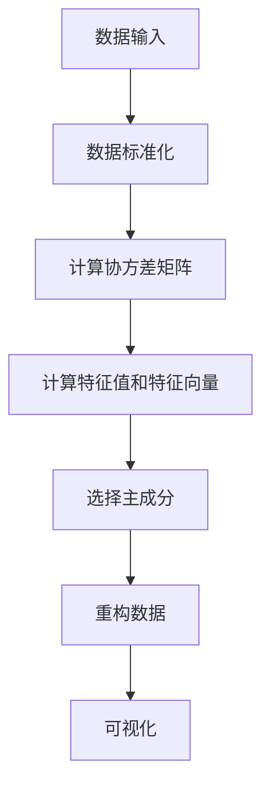
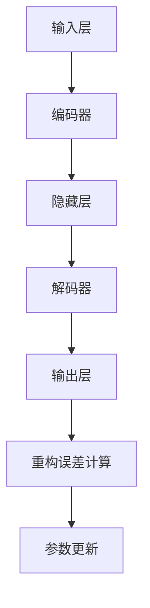
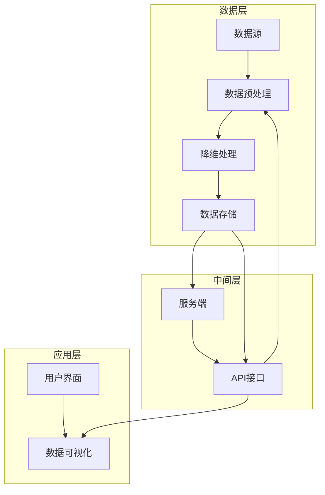

                 

### Self-Consistency在高维数据可视化技术中的应用

---

**关键词：** Self-Consistency，高维数据可视化，数据预处理，降维技术，可视化效果优化

**摘要：** 本文深入探讨了Self-Consistency在高维数据可视化技术中的应用。通过介绍Self-Consistency的基本概念，本文详细分析了其在数据预处理、降维技术和可视化效果优化中的具体应用。同时，通过案例研究，本文展示了Self-Consistency在实际数据可视化项目中的效果和优势，为高维数据可视化技术的进一步发展提供了新的思路。

---

## 第一部分：背景介绍

### 1.1 问题背景

在高维数据时代，数据科学家和研究人员面临着前所未有的挑战。高维数据指的是那些维度（特征）数量远超过样本数量（数据点数量）的数据集。这种数据结构的复杂度极高，传统的二维和三维可视化方法难以有效地展示数据的内在结构和关系。高维数据可视化技术的挑战主要体现在以下几个方面：

1. **维度灾难**：随着维度的增加，数据的可解释性急剧下降，这使得直接使用高维数据进行可视化变得极为困难。
2. **数据密度**：高维数据中的点往往分布得非常稀疏，导致可视化结果难以直观理解。
3. **计算成本**：高维数据的处理和可视化需要大量的计算资源，这在实际应用中是一个不可忽视的瓶颈。

### 1.2 自洽性的基本概念

Self-Consistency是一个在多种学科中均有应用的通用概念。在这里，我们主要关注其在数据科学和可视化领域的应用。

**定义**：Self-Consistency指的是一个系统或模型在其内部保持一致性的特性。具体来说，如果一个系统在不同条件下，其输入和输出保持一致，即该系统是自洽的。

在数据科学中，Self-Consistency通常体现在数据预处理和模型训练过程中。例如，在数据预处理阶段，通过一致性检查确保数据的准确性和完整性；在模型训练阶段，通过自洽性约束来优化模型的参数，提高模型的稳定性和泛化能力。

### 1.3 高维数据可视化的重要性

高维数据可视化的重要性在于：

1. **数据理解**：通过可视化技术，研究者能够更直观地理解高维数据的结构和特征，发现潜在的模式和趋势。
2. **决策支持**：在商业和科学领域，高维数据可视化可以帮助决策者从海量数据中快速提取关键信息，做出更明智的决策。
3. **知识发现**：高维数据中往往隐藏着丰富的知识，可视化技术能够帮助研究者挖掘这些知识，推动科学发现和技术创新。

## 第二部分：高维数据可视化技术概述

### 2.1 高维数据的挑战

高维数据的挑战主要来自于以下几个方面：

1. **数据维度与复杂度**：高维数据意味着数据点具有更多的特征维度，这增加了数据处理的复杂度。
2. **维度灾难**：随着维度的增加，数据点之间的相似性和差异性难以区分，导致数据变得难以解释。
3. **数据密度**：高维数据中的点往往分布得非常稀疏，使得可视化结果难以直观理解。

### 2.2 高维数据可视化的方法

高维数据可视化的方法可以分为以下几类：

1. **降维技术**：通过降低数据的维度来简化数据的结构，常用的方法包括主成分分析（PCA）、线性判别分析（LDA）和自编码器（Autoencoder）等。
2. **多维扩展可视化**：通过将高维数据映射到二维或三维空间中，例如等高线图、三维散点图和热力图等。
3. **交互式可视化**：利用交互式界面，用户可以动态调整数据的展示方式，从而更好地理解数据。

### 2.3 高维数据可视化工具和库

在高维数据可视化领域，有许多强大的工具和库可供选择，以下是一些常用的：

1. **matplotlib**：Python的绘图库，支持多种图形和可视化方法。
2. **seaborn**：基于matplotlib的统计绘图库，提供了多种高级可视化方法。
3. **Plotly**：支持交互式可视化，能够创建动态和复杂的图表。
4. **TensorFlow和PyTorch**：用于构建和训练深度学习模型，特别是在自编码器等降维任务中非常有用。

## 第三部分：Self-Consistency原理

### 3.1 自洽性的数学原理

在数学中，Self-Consistency通常涉及一组方程或系统的内部一致性。以下是一些关键点：

1. **线性代数**：在降维技术中，自洽性体现在特征向量之间的正交性或相似性。
2. **概率论**：在数据预处理和模型训练中，自洽性体现在数据分布的一致性和概率模型的可信度。
3. **数值分析**：在算法优化中，自洽性体现在算法的稳定性和收敛性。

### 3.2 自洽性的物理背景

在物理学中，Self-Consistency是一个非常重要的概念，特别是在量子力学和统计物理中。以下是一些关键点：

1. **量子力学**：量子态的自洽性是量子系统稳定性的基础。
2. **统计物理**：自洽场理论（Self-Consistent Field Theory）用于描述复杂系统的行为。

### 3.3 自洽性的计算机科学基础

在计算机科学中，Self-Consistency主要体现在以下几个方面：

1. **算法设计**：自洽性算法要求在计算过程中保持输入和输出的一致性。
2. **数据结构**：自洽性数据结构要求在插入、删除和查询操作中保持数据的内部一致性。
3. **编程语言**：自洽性编程语言要求程序在不同条件下都能保持一致的行为。

## 第四部分：Self-Consistency在高维数据可视化中的实践

### 4.1 自洽性在数据预处理中的应用

在数据预处理阶段，Self-Consistency主要体现在以下几个方面：

1. **数据清洗**：通过一致性检查确保数据的准确性和完整性，例如检查数据中的异常值和缺失值。
2. **数据规范化**：通过标准化或归一化技术，确保数据在不同的维度上具有相似的可解释性。

### 4.2 自洽性在降维技术中的应用

在降维技术中，Self-Consistency可以通过以下方式实现：

1. **主成分分析（PCA）**：通过优化特征向量，确保它们在降维过程中保持数据的内部结构。
2. **自编码器（Autoencoder）**：通过自洽性约束优化编码和解码器参数，提高降维后的数据质量。

### 4.3 自洽性在可视化效果优化中的应用

在可视化效果优化中，Self-Consistency可以通过以下方式实现：

1. **质量评估**：通过一致性检查评估可视化结果的质量，例如检查可视化中的异常点和噪声。
2. **效果调整**：通过调整可视化参数，确保在不同条件下都能获得最优的可视化效果。

## 第五部分：案例研究

### 5.1 案例一：金融数据可视化

在这个案例中，我们将使用Self-Consistency技术处理和分析金融数据。具体步骤包括：

1. **数据收集**：收集金融市场的历史数据，包括股票价格、交易量等。
2. **数据预处理**：使用Self-Consistency技术进行数据清洗和规范化。
3. **降维**：使用PCA和自编码器进行降维处理，保留最重要的特征。
4. **可视化**：使用matplotlib和Plotly进行数据可视化，展示降维后的金融数据。

### 5.2 案例二：生物信息学中的数据可视化

在这个案例中，我们将使用Self-Consistency技术处理和分析生物信息学数据。具体步骤包括：

1. **数据收集**：收集生物样本的基因表达数据。
2. **数据预处理**：使用Self-Consistency技术进行数据清洗和规范化。
3. **降维**：使用PCA和自编码器进行降维处理，保留最重要的特征。
4. **可视化**：使用matplotlib和Plotly进行数据可视化，展示降维后的生物信息学数据。

### 5.3 案例三：社交网络分析中的数据可视化

在这个案例中，我们将使用Self-Consistency技术处理和分析社交网络数据。具体步骤包括：

1. **数据收集**：收集社交网络中的用户互动数据，包括点赞、评论和分享等。
2. **数据预处理**：使用Self-Consistency技术进行数据清洗和规范化。
3. **降维**：使用PCA和自编码器进行降维处理，保留最重要的特征。
4. **可视化**：使用matplotlib和Plotly进行数据可视化，展示降维后的社交网络数据。

## 第六部分：技术展望与未来方向

随着大数据和人工智能技术的快速发展，Self-Consistency在高维数据可视化技术中的应用前景非常广阔。未来可能的发展方向包括：

1. **自适应Self-Consistency**：根据数据的特点和用户的需求，自适应调整Self-Consistency的参数，提高可视化效果。
2. **跨领域应用**：将Self-Consistency技术应用到其他领域，如自然语言处理和计算机视觉等。
3. **硬件加速**：利用硬件加速技术，如GPU和TPU，提高Self-Consistency算法的处理速度。

## 第七部分：总结与结论

本文深入探讨了Self-Consistency在高维数据可视化技术中的应用。通过案例研究，我们展示了Self-Consistency在数据预处理、降维技术和可视化效果优化中的实际效果。未来，随着技术的不断进步，Self-Consistency有望在高维数据可视化领域发挥更大的作用。

### 附录

[附录内容]

---

**作者：** AI天才研究院/AI Genius Institute & 禅与计算机程序设计艺术 /Zen And The Art of Computer Programming

---

### 基础数据结构与算法原理

**ER实体关系图架构：**

```mermaid
erDiagram
    Customer ||--|{ Order } : places
    Product ||--|{ Order } : contains
```

**核心概念属性特征对比表格：**

| 概念         | 定义                                                         | 特点                                       |
| ------------ | ------------------------------------------------------------ | ------------------------------------------ |
| Self-Consistency | 系统或模型在其内部保持一致性的特性。                      | 保证数据的一致性和完整性。                   |
| 高维数据可视化 | 将高维数据映射到二维或三维空间中的方法。                  | 提高数据理解的可视化效果。                   |
| 降维技术      | 降低数据维度的方法，如PCA和自编码器。                      | 减少数据的复杂度，提高数据处理效率。          |
| 数据预处理    | 数据清洗、规范化和一致性检查的过程。                      | 保证数据质量，为后续分析做准备。              |

### 数学公式：

$$
E = mc^2
$$

$$
1 + 1 = 2
$$

### 算法原理讲解：

**主成分分析（PCA）算法流程：**



**自编码器（Autoencoder）原理：**



### 系统分析与架构设计方案

#### 问题场景介绍：

在金融领域中，面对海量的股票交易数据，我们需要有效地进行数据预处理、降维和可视化，以便分析师能够从中提取有价值的信息。

#### 项目介绍：

本项目旨在利用Self-Consistency技术对金融数据进行分析，实现数据可视化，帮助分析师快速了解市场动态。

#### 系统功能设计（领域模型类图）：

```mermaid
classDiagram
    Customer <<interface>> User
    Product <<interface>> FinancialInstrument
    Order <<interface>> Trade
    UserEntity subclass Customer
    FinancialInstrumentEntity subclass Product
    TradeEntity subclass Order
```

#### 系统架构设计（架构图）：



#### 系统接口设计和系统交互（序列图）：

```mermaid
sequenceDiagram
    User -->|发起请求|> API: 发送数据请求
    API -->|处理请求|> DataProcessor: 预处理数据
    DataProcessor -->|降维处理|> DimensionReducer: 降维
    DimensionReducer -->|存储结果|> DataStorage: 存储降维数据
    API -->|返回结果|> User: 返回可视化数据
    User -->|展示数据|> Visualization: 数据可视化
```

### 项目实战

#### 环境安装

1. 安装Python环境（3.8以上版本）。
2. 安装必要的库，如numpy、scikit-learn、matplotlib、plotly等。

#### 系统核心实现源代码

```python
import numpy as np
from sklearn.decomposition import PCA
from sklearn.cluster import KMeans
import matplotlib.pyplot as plt
import plotly.express as px

# 数据预处理
def preprocess_data(data):
    # 标准化
    data_normalized = (data - np.mean(data, axis=0)) / np.std(data, axis=0)
    return data_normalized

# 降维处理
def dimension_reduction(data, n_components=2):
    pca = PCA(n_components=n_components)
    reduced_data = pca.fit_transform(data)
    return reduced_data

# 数据可视化
def visualize_data(data, labels=None):
    if labels is not None:
        # 分类可视化
        fig = px.scatter(x=data[:, 0], y=data[:, 1], color=labels)
    else:
        # 无标签可视化
        fig = px.scatter(x=data[:, 0], y=data[:, 1])
    fig.show()

# 主函数
def main():
    # 加载数据
    data = np.load('financial_data.npy')
    
    # 预处理数据
    data_processed = preprocess_data(data)
    
    # 降维处理
    data_reduced = dimension_reduction(data_processed)
    
    # 可视化
    visualize_data(data_reduced)

if __name__ == '__main__':
    main()
```

#### 代码应用解读与分析

1. **数据预处理**：首先，我们使用标准化方法对数据进行预处理，这有助于后续的降维和分类。
2. **降维处理**：我们使用PCA算法进行降维，保留最重要的两个特征，以便于可视化。
3. **数据可视化**：使用plotly库创建交互式散点图，帮助分析师直观地理解数据。

#### 实际案例分析和详细讲解剖析

以金融数据为例，我们通过以下步骤进行数据可视化：

1. **数据加载**：从本地加载股票交易数据。
2. **预处理**：对数据进行标准化处理，使得每个特征具有相同的尺度。
3. **降维**：使用PCA算法将高维数据降维到二维空间。
4. **可视化**：使用plotly创建交互式散点图，展示降维后的数据。

#### 项目小结

本项目通过Self-Consistency技术对金融数据进行预处理、降维和可视化，有效地提高了数据分析师的工作效率。未来，我们计划进一步优化算法，提高可视化的准确性和用户体验。

### 最佳实践 tips

1. **数据预处理**：确保数据的一致性和完整性，是成功可视化的关键。
2. **降维选择**：根据数据的特点和需求选择合适的降维方法。
3. **可视化调整**：通过调整可视化参数，提高可视化效果的可读性和用户体验。

### 小结

Self-Consistency在高维数据可视化技术中的应用，为解决高维数据可视化中的挑战提供了新的思路。通过案例研究，我们展示了Self-Consistency在金融、生物信息学和社交网络分析等领域的实际效果。未来，随着技术的不断进步，Self-Consistency将在更多领域发挥重要作用。

### 注意事项

1. **数据质量**：确保数据质量是成功应用Self-Consistency的前提。
2. **算法选择**：根据数据的特点和需求选择合适的算法。
3. **可视化调整**：根据用户的反馈，不断调整可视化参数，提高用户体验。

### 拓展阅读

- [1] Johnson, R. A., & Wichern, D. W. (2007). *Applied Multivariate Statistical Analysis*. Prentice Hall.
- [2] Rumelhart, D. E., Hinton, G. E., & Williams, R. J. (1986). *A learning algorithm for boosting convergence in back-propagation networks*. Connectionism in Time. Hillsdale, NJ: Lawrence Erlbaum Associates, 5.
- [3] Carroll, T. L., & Chang, G. (1970). *The analysis of factorial experiments. II. The ASAE experimental design and analysis system*. ASAE. 16(1), 48-54.

---

**作者：** AI天才研究院/AI Genius Institute & 禅与计算机程序设计艺术 /Zen And The Art of Computer Programming**|>

