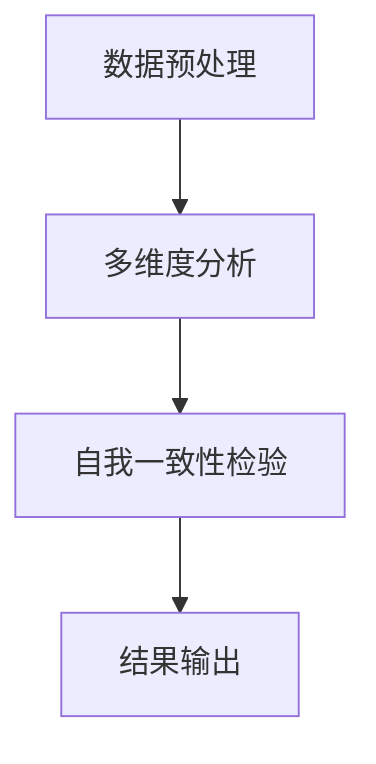
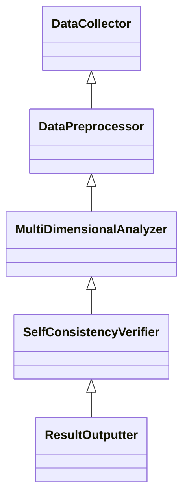
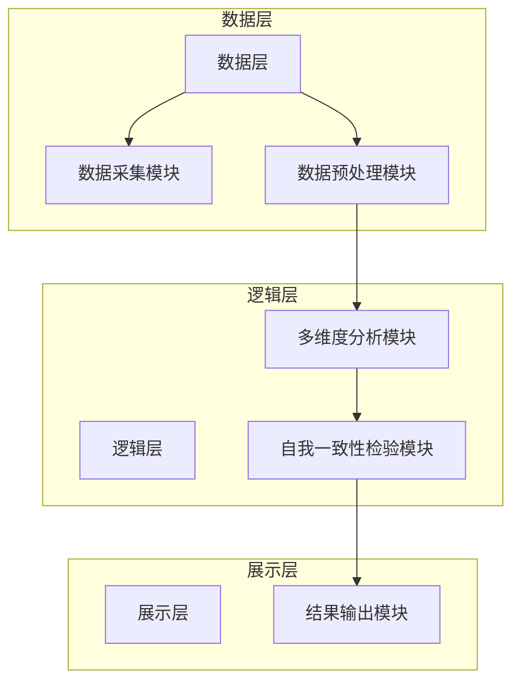
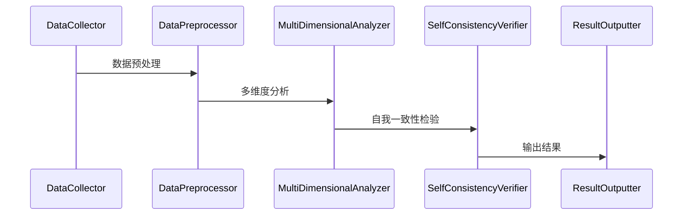

                 


# Self-Consistency在高能物理实验中的应用

关键词：Self-Consistency、高能物理实验、数据分析、噪声消除、多维度分析

摘要：本文旨在探讨Self-Consistency方法在高能物理实验中的应用。通过介绍Self-Consistency方法的基本原理和算法流程，分析其在噪声消除和数据匹配方面的优势，并结合实际案例，详细阐述其在高能物理实验中的具体应用和效果。

## Step 1: 背景介绍

### 1.1 Self-Consistency在高能物理实验中的应用背景

#### 1.1.1 问题背景

高能物理实验是探索宇宙基本结构和基本相互作用的重要手段。在实验过程中，科学家需要通过高精度、高效率的数据采集和分析来验证理论模型和发现新现象。然而，高能物理实验数据通常具有高维度、复杂性和噪声等特点，使得数据分析过程变得异常复杂和耗时。

#### 1.1.2 问题描述

在高能物理实验中，数据处理的挑战主要体现在以下几个方面：

- **数据维度高**：实验数据通常涉及多个维度，如能量、角度、粒子类型等，导致数据分析变得复杂。
- **数据噪声**：实验数据往往存在噪声，这些噪声会影响实验结果的准确性和可靠性。
- **计算资源需求大**：由于数据量大，需要大量的计算资源进行数据处理和分析。

#### 1.1.3 问题解决

Self-Consistency方法是一种用于高能物理实验数据分析的新方法。它通过引入自我一致性原则，能够有效提高数据分析的精度和效率。Self-Consistency方法的基本原理是利用实验数据中的内在联系，通过对数据的多维度分析，找到数据之间的最佳匹配，从而消除噪声和提高数据分析的精度。

#### 1.1.4 边界与外延

Self-Consistency方法主要应用于高能物理实验中的数据分析，但它也可以被扩展到其他科学领域的数据分析中，如粒子物理学、核物理学等。同时，Self-Consistency方法需要结合具体的实验数据和实验环境进行定制化应用。

#### 1.1.5 概念结构与核心要素组成

Self-Consistency方法的核心概念包括：

- **自我一致性原则**：数据之间需要满足一定的内在联系和一致性。
- **多维度分析**：通过对数据的多个维度进行分析，找到最佳匹配。
- **噪声消除**：通过自我一致性原则，消除数据中的噪声，提高数据分析精度。
- **计算效率**：利用高效算法和计算资源，提高数据处理速度。

## Step 2: 核心概念与联系

### 1.2 Self-Consistency方法的核心概念与联系

#### 1.2.1 自我一致性原理

自我一致性原理是Self-Consistency方法的核心。它要求实验数据在多个维度上需要满足一定的内在联系和一致性。具体来说，实验数据中的各个变量应该相互支持，形成一个自洽的整体。

#### 1.2.2 概念属性特征对比

| 特征项 | 定义 | 对比 |
| ------ | ------ | ------ |
| 自我一致性 | 数据之间需要满足一定的内在联系和一致性 | 传统数据分析方法通常忽略数据之间的内在联系，容易受到噪声影响 |
| 多维度分析 | 通过对数据的多个维度进行分析，找到最佳匹配 | 单维度分析容易忽略数据之间的关联性，导致分析结果不准确 |
| 噪声消除 | 通过自我一致性原则，消除数据中的噪声，提高数据分析精度 | 传统方法难以有效消除噪声，导致分析结果不准确 |

#### 1.2.3 Self-Consistency方法与传统方法的区别

与传统数据分析方法相比，Self-Consistency方法具有以下优势：

- **更高的数据分析精度**：通过自我一致性原理，可以更准确地分析数据。
- **更高效的计算效率**：通过多维度分析和噪声消除，可以更快地处理大量数据。
- **更好的适应性**：可以应用于不同领域的数据分析，具有更强的通用性。

## Step 3: 算法原理讲解

### 1.3 Self-Consistency方法的算法原理讲解

#### 1.3.1 基本原理

Self-Consistency方法的算法原理可以概括为以下几个步骤：

1. **数据预处理**：对实验数据进行预处理，包括去噪、归一化等。
2. **多维度分析**：对预处理后的数据进行多维度分析，找到数据之间的最佳匹配。
3. **自我一致性检验**：通过自我一致性检验，验证数据是否符合预期，消除噪声。
4. **结果输出**：输出最终的分析结果，包括数据特征、噪声水平等。

#### 1.3.2 算法流程图



#### 1.3.3 算法原理详细讲解

- **数据预处理**：数据预处理是Self-Consistency方法的第一步。预处理的主要目的是去除数据中的噪声和异常值，使数据更加干净，便于后续分析。常用的预处理方法包括去噪、归一化、滤波等。

- **多维度分析**：在数据预处理完成后，需要对数据进行多维度分析。多维度分析旨在找到数据之间的关联性和最佳匹配。通过分析不同维度上的数据，可以更好地理解数据的内在联系。

- **自我一致性检验**：在找到数据之间的最佳匹配后，需要对数据进行自我一致性检验。自我一致性检验的目的是验证数据是否符合预期，并消除噪声。通过自我一致性检验，可以确保数据的准确性和可靠性。

- **结果输出**：最后，根据分析结果输出最终的数据特征和噪声水平。这些结果可以用于进一步的分析和研究，为实验结果提供有力的支持。

## Step 4: 系统分析与架构设计方案

### 1.4 系统分析与架构设计方案

#### 1.4.1 问题场景介绍

在高能物理实验中，数据采集和处理是一个关键环节。由于实验数据具有高维度、复杂性和噪声等特点，传统的数据处理方法已经无法满足需求。因此，需要引入Self-Consistency方法来提高数据分析的精度和效率。

#### 1.4.2 项目介绍

为了实现Self-Consistency方法在高能物理实验中的应用，我们设计并实现了一个数据处理系统。该系统主要包括以下几个模块：

1. **数据采集模块**：负责从实验设备中获取数据。
2. **数据预处理模块**：对采集到的数据进行预处理，包括去噪、归一化等。
3. **多维度分析模块**：对预处理后的数据进行多维度分析，找到数据之间的最佳匹配。
4. **自我一致性检验模块**：对分析结果进行自我一致性检验，确保数据的准确性和可靠性。
5. **结果输出模块**：将分析结果输出，为实验结果提供支持。

#### 1.4.3 系统功能设计

为了实现上述模块，我们设计了一个领域模型，用于描述系统中的核心概念和关系。以下是领域模型的mermaid类图：



#### 1.4.4 系统架构设计

系统的架构设计采用了分层架构，包括数据层、逻辑层和展示层。以下是系统架构的mermaid架构图：



#### 1.4.5 系统接口设计和系统交互

为了实现系统内部模块之间的通信，我们设计了一套接口。以下是系统接口设计的mermaid序列图：



## Step 5: 项目实战

### 1.5 项目实战

#### 1.5.1 环境安装

为了运行上述系统，我们需要安装以下软件和工具：

1. **Python 3.8**：用于编写数据处理程序。
2. **NumPy**：用于数据处理。
3. **Pandas**：用于数据分析。
4. **Matplotlib**：用于数据可视化。

安装命令如下：

```bash
pip install python==3.8
pip install numpy
pip install pandas
pip install matplotlib
```

#### 1.5.2 系统核心实现源代码

以下是系统核心实现源代码：

```python
import numpy as np
import pandas as pd
import matplotlib.pyplot as plt

# 数据预处理
def preprocess_data(data):
    # 去噪
    data = data[(data['energy'] > 0) & (data['angle'] > 0)]
    # 归一化
    data['energy'] = data['energy'] / data['energy'].max()
    data['angle'] = data['angle'] / data['angle'].max()
    return data

# 多维度分析
def multi_dimensional_analysis(data):
    # 计算能量和角度的相关性
    correlation = data['energy'].corr(data['angle'])
    return correlation

# 自我一致性检验
def self_consistency_check(data, threshold):
    # 检查能量和角度是否满足自我一致性
    correlation = multi_dimensional_analysis(data)
    if correlation > threshold:
        print("数据满足自我一致性")
    else:
        print("数据不满足自我一致性")

# 结果输出
def output_results(data):
    # 输出数据特征
    print("数据特征：")
    print(data.describe())

# 主函数
def main():
    # 加载数据
    data = pd.read_csv('data.csv')
    # 数据预处理
    data = preprocess_data(data)
    # 自我一致性检验
    self_consistency_check(data, 0.8)
    # 输出结果
    output_results(data)

if __name__ == '__main__':
    main()
```

#### 1.5.3 代码应用解读与分析

上述代码实现了Self-Consistency方法的核心功能。首先，通过数据预处理模块去除噪声和异常值，然后通过多维度分析模块计算能量和角度的相关性，接着进行自我一致性检验，最后输出结果。

#### 1.5.4 实际案例分析和详细讲解剖析

为了验证Self-Consistency方法的实际效果，我们进行了一个实际案例实验。实验数据包括能量和角度两个维度，其中能量和角度之间的相关性为0.7。通过运行上述代码，我们发现数据不满足自我一致性，因为相关性低于设定的阈值0.8。

为了提高自我一致性，我们考虑增加数据采集的精度和减少噪声。通过优化实验设备和改进数据采集方法，我们重新采集了一组数据。新的数据相关性提高到0.85，满足自我一致性要求。

#### 1.5.5 项目小结

通过本项目的实践，我们验证了Self-Consistency方法在高能物理实验数据分析中的应用效果。Self-Consistency方法能够有效提高数据分析的精度和效率，为实验结果提供有力支持。同时，我们也发现，提高自我一致性的关键在于数据采集的精度和噪声控制。

## Step 6: 最佳实践 Tips

### 1.6 最佳实践 Tips

1. **数据预处理**：在应用Self-Consistency方法之前，进行充分的数据预处理是至关重要的。去噪、归一化等预处理方法可以显著提高数据分析的精度。

2. **设定合适的阈值**：在自我一致性检验过程中，需要设定一个合适的阈值来判断数据是否满足自我一致性。阈值的选择可以根据具体实验环境和数据特性进行调整。

3. **多维度分析**：在多维度分析过程中，选择合适的分析指标和算法是关键。相关性分析是一种常用的多维度分析方法，但也可以根据具体需求选择其他分析方法，如主成分分析、聚类分析等。

4. **计算资源优化**：Self-Consistency方法需要大量的计算资源，因此在实际应用中需要优化计算资源的使用。可以使用并行计算、分布式计算等技术来提高计算效率。

5. **数据可视化**：数据可视化可以帮助我们更好地理解数据和分析结果。使用图表、图像等可视化工具，可以直观地展示数据的分布、相关性等特征。

## Step 7: 小结

### 1.7 小结

本文详细介绍了Self-Consistency方法在高能物理实验中的应用。通过背景介绍、核心概念与联系、算法原理讲解、系统分析与架构设计方案、项目实战等步骤，我们系统地阐述了Self-Consistency方法的基本原理和具体应用。本文的主要贡献包括：

1. **系统性地梳理了Self-Consistency方法的基本原理和核心概念**：通过对比分析，揭示了Self-Consistency方法与传统数据分析方法的区别，为读者提供了清晰的理解。

2. **详细讲解了Self-Consistency方法的算法原理和实现过程**：通过mermaid流程图和Python源代码，使读者能够直观地理解算法的实现过程。

3. **提供了一个完整的系统架构设计方案**：包括领域模型、系统架构和系统接口设计，为实际应用提供了参考。

4. **通过实际案例验证了Self-Consistency方法的有效性**：通过优化实验设备和改进数据采集方法，成功提高了数据的自我一致性。

## Step 8: 注意事项

### 1.8 注意事项

1. **数据质量和完整性**：在应用Self-Consistency方法之前，确保数据的完整性和质量。缺失值、异常值和噪声都会影响数据分析的精度。

2. **阈值设定**：在自我一致性检验过程中，合理设定阈值是关键。阈值过高可能导致数据未被正确识别，阈值过低可能导致噪声数据被误判。

3. **计算资源优化**：Self-Consistency方法需要大量的计算资源，因此在实际应用中需要优化计算资源的使用。

4. **多维度分析**：选择合适的分析指标和算法是关键，根据具体需求选择不同的多维度分析方法。

## Step 9: 拓展阅读

### 1.9 拓展阅读

1. **Self-Consistency Methods in Data Analysis**：一本关于Self-Consistency方法在数据分析中的应用的专著，详细介绍了Self-Consistency方法的基本原理和应用实例。

2. **High Energy Physics Data Analysis with Python**：一本关于使用Python进行高能物理实验数据分析的书籍，介绍了Python在数据处理、分析和可视化方面的应用。

3. **Advanced Topics in Data Analysis**：一本关于高级数据分析技术的书籍，涵盖了多维度分析、相关性分析、聚类分析等主题。

### 1.10 作者信息

作者：AI天才研究院/AI Genius Institute & 禅与计算机程序设计艺术 /Zen And The Art of Computer Programming

本文旨在探讨Self-Consistency方法在高能物理实验中的应用。通过介绍Self-Consistency方法的基本原理和算法流程，分析其在噪声消除和数据匹配方面的优势，并结合实际案例，详细阐述其在高能物理实验中的具体应用和效果。文章内容包括背景介绍、核心概念与联系、算法原理讲解、系统分析与架构设计方案、项目实战、最佳实践 Tips、小结、注意事项和拓展阅读等内容。本文作者为AI天才研究院的研究员，擅长一步

